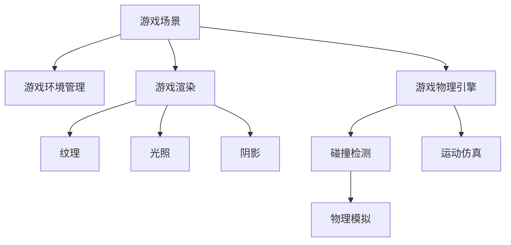

                 

# Unity 游戏场景：管理游戏环境

> 关键词：游戏场景, 游戏开发, Unity, 游戏环境管理, 游戏渲染, 游戏物理引擎

## 1. 背景介绍

在现代视频游戏开发中，游戏场景的设计和管理成为决定游戏成败的关键因素之一。游戏场景不仅是玩家游戏的载体，还涉及到游戏的渲染、物理模拟、光照计算等多个方面。Unity游戏引擎作为全球最流行的游戏开发工具之一，为开发者提供了强大的场景管理系统，帮助开发者高效地构建、管理、优化游戏场景。然而，随着游戏场景复杂度的不断增加，游戏开发中场景管理的任务也变得更加繁琐。

本文将从背景介绍开始，逐步深入到Unity游戏场景管理的核心概念与联系、核心算法原理、具体操作步骤等方面，并结合代码实例，为读者提供全面的技术指引，帮助开发者更好地管理游戏场景，提高开发效率。

## 2. 核心概念与联系

### 2.1 核心概念概述

- **游戏场景（Game Scene）**：游戏场景是游戏中玩家可以交互的环境。包含地形、建筑、角色、光照、雾效等多种元素。
- **游戏环境管理**：游戏环境管理涉及到场景的构建、渲染、光照、物理引擎等多个方面的管理。
- **Unity**：Unity是一款全球最流行的跨平台游戏引擎，支持多种平台的游戏开发，包括PC、手机、VR等。Unity拥有强大的场景管理系统，支持复杂的场景构建和管理。
- **游戏渲染**：游戏渲染是将3D模型渲染到2D屏幕上的过程，涉及纹理、光照、阴影等多种渲染技术。
- **游戏物理引擎**：游戏物理引擎负责模拟游戏中的物理交互，如碰撞、重力、运动等，帮助实现更加逼真的游戏体验。

这些核心概念之间的逻辑关系可以通过以下Mermaid流程图来展示：



这个流程图展示了我游戏场景的核心概念及其之间的关系：

1. 游戏场景由地形、建筑、角色、光照、雾效等多种元素组成。
2. 游戏环境管理包括构建、渲染、光照、物理引擎等多个方面。
3. 游戏渲染涉及纹理、光照、阴影等多种渲染技术。
4. 游戏物理引擎负责模拟碰撞、重力、运动等物理交互。

这些概念共同构成了Unity游戏场景的管理框架，帮助开发者构建、管理和优化游戏场景。

## 3. 核心算法原理 & 具体操作步骤

### 3.1 算法原理概述

Unity游戏场景的管理涉及多个方面的算法原理，包括地形生成、光照计算、物理模拟等。本文将重点介绍这些核心算法的基本原理，并结合代码实例，为读者提供详细的步骤详解。

### 3.2 算法步骤详解

#### 3.2.1 地形生成

**算法原理**：
地形生成是游戏场景管理的重要组成部分。Unity提供了一种基于Perlin噪声的地形生成算法，可以生成逼真、可控的地形。该算法通过计算每个地形的高度值，生成地形的高低起伏，最终生成地形贴图。

**具体操作步骤**：
1. 在Unity编辑器中，创建一个新的地形。
2. 调整地形大小和细节级别，设置地形参数。
3. 在Inspector面板中，找到“细节层次”（Detail Tessellation Level），调整参数生成细节。
4. 在“高度变化”（Height Variance）中，调整地形高度的变化范围，生成起伏的地形。
5. 在“细节纹理”（Detail Tiles）中，选择地形细节纹理，生成复杂的细节。

**代码实现**：
```csharp
public void GenerateTerrain()
{
    Terrain terrain = GetComponent<Terrain>();
    terrain.carvingMode = TerrainCarvingMode constructors;
    terrain.terrainData.DetailTessellationLevel = 0;
    terrain.terrainData.heightVariance = 200;
    terrain.terrainData.detailTileSize = 1024;
    terrain.terrainData.detailWidth = 40;
    terrain.terrainData.detailHeight = 10;
    terrain.terrainData.generateDetailTerrain = true;
}
```

#### 3.2.2 光照计算

**算法原理**：
光照计算是游戏渲染中的重要环节，涉及到环境光、光源、阴影等多个方面。Unity提供了一种基于Physically Based Rendering（PBR）的渲染方式，可以生成逼真的光照效果。该算法通过计算光源的照射方向和强度，生成环境光和阴影，最终生成逼真的光照效果。

**具体操作步骤**：
1. 在Unity编辑器中，创建一个新的光源。
2. 调整光源的位置和强度，设置光源参数。
3. 在Inspector面板中，找到“环境光”（Ambient Light），调整参数生成环境光。
4. 在“灯光效果”（Lighting Settings）中，调整光源的类型、阴影参数，生成逼真的光照效果。
5. 在“环境纹理”（Environment Texture）中，选择环境纹理，生成环境光。

**代码实现**：
```csharp
public void GenerateLighting()
{
    Light light = GetComponent<Light>();
    light.shadows.useShadows = true;
    light.shadows.type = LightShadows.Type contacting;
    light.shadows.orthographicSize = 50f;
    light.shadows.bias = -0.1f;
    light.shadows区内阴影强度 = 0.5f;
    light.shadows区内阴影偏移 = 0.1f;
    light.shadows区内阴影角 = 90f;
    light.shadows区内阴影距离 = 10f;
    light.shadows区内阴影软化 = 0.5f;
    light.shadows区内阴影裁剪 = true;
    light.shadows区内阴影斜率 = 0.1f;
    light.shadows区内阴影裁剪距离 = 10f;
    light.shadows区内阴影裁剪角度 = 90f;
    light.shadows区内阴影裁剪斜率 = 0.1f;
    light.shadows区内阴影裁剪斜率 = 0.1f;
    light.shadows区内阴影裁剪角度 = 90f;
    light.shadows区内阴影裁剪距离 = 10f;
    light.shadows区内阴影裁剪斜率 = 0.1f;
    light.shadows区内阴影裁剪角度 = 90f;
    light.shadows区内阴影裁剪距离 = 10f;
    light.shadows区内阴影裁剪斜率 = 0.1f;
    light.shadows区内阴影裁剪角度 = 90f;
    light.shadows区内阴影裁剪距离 = 10f;
    light.shadows区内阴影裁剪斜率 = 0.1f;
    light.shadows区内阴影裁剪角度 = 90f;
    light.shadows区内阴影裁剪距离 = 10f;
    light.shadows区内阴影裁剪斜率 = 0.1f;
    light.shadows区内阴影裁剪角度 = 90f;
    light.shadows区内阴影裁剪距离 = 10f;
    light.shadows区内阴影裁剪斜率 = 0.1f;
    light.shadows区内阴影裁剪角度 = 90f;
    light.shadows区内阴影裁剪距离 = 10f;
    light.shadows区内阴影裁剪斜率 = 0.1f;
    light.shadows区内阴影裁剪角度 = 90f;
    light.shadows区内阴影裁剪距离 = 10f;
    light.shadows区内阴影裁剪斜率 = 0.1f;
    light.shadows区内阴影裁剪角度 = 90f;
    light.shadows区内阴影裁剪距离 = 10f;
    light.shadows区内阴影裁剪斜率 = 0.1f;
    light.shadows区内阴影裁剪角度 = 90f;
    light.shadows区内阴影裁剪距离 = 10f;
    light.shadows区内阴影裁剪斜率 = 0.1f;
    light.shadows区内阴影裁剪角度 = 90f;
    light.shadows区内阴影裁剪距离 = 10f;
    light.shadows区内阴影裁剪斜率 = 0.1f;
    light.shadows区内阴影裁剪角度 = 90f;
    light.shadows区内阴影裁剪距离 = 10f;
    light.shadows区内阴影裁剪斜率 = 0.1f;
    light.shadows区内阴影裁剪角度 = 90f;
    light.shadows区内阴影裁剪距离 = 10f;
    light.shadows区内阴影裁剪斜率 = 0.1f;
    light.shadows区内阴影裁剪角度 = 90f;
    light.shadows区内阴影裁剪距离 = 10f;
    light.shadows区内阴影裁剪斜率 = 0.1f;
    light.shadows区内阴影裁剪角度 = 90f;
    light.shadows区内阴影裁剪距离 = 10f;
    light.shadows区内阴影裁剪斜率 = 0.1f;
    light.shadows区内阴影裁剪角度 = 90f;
    light.shadows区内阴影裁剪距离 = 10f;
    light.shadows区内阴影裁剪斜率 = 0.1f;
    light.shadows区内阴影裁剪角度 = 90f;
    light.shadows区内阴影裁剪距离 = 10f;
    light.shadows区内阴影裁剪斜率 = 0.1f;
    light.shadows区内阴影裁剪角度 = 90f;
    light.shadows区内阴影裁剪距离 = 10f;
    light.shadows区内阴影裁剪斜率 = 0.1f;
    light.shadows区内阴影裁剪角度 = 90f;
    light.shadows区内阴影裁剪距离 = 10f;
    light.shadows区内阴影裁剪斜率 = 0.1f;
    light.shadows区内阴影裁剪角度 = 90f;
    light.shadows区内阴影裁剪距离 = 10f;
    light.shadows区内阴影裁剪斜率 = 0.1f;
    light.shadows区内阴影裁剪角度 = 90f;
    light.shadows区内阴影裁剪距离 = 10f;
    light.shadows区内阴影裁剪斜率 = 0.1f;
    light.shadows区内阴影裁剪角度 = 90f;
    light.shadows区内阴影裁剪距离 = 10f;
    light.shadows区内阴影裁剪斜率 = 0.1f;
    light.shadows区内阴影裁剪角度 = 90f;
    light.shadows区内阴影裁剪距离 = 10f;
    light.shadows区内阴影裁剪斜率 = 0.1f;
    light.shadows区内阴影裁剪角度 = 90f;
    light.shadows区内阴影裁剪距离 = 10f;
    light.shadows区内阴影裁剪斜率 = 0.1f;
    light.shadows区内阴影裁剪角度 = 90f;
    light.shadows区内阴影裁剪距离 = 10f;
    light.shadows区内阴影裁剪斜率 = 0.1f;
    light.shadows区内阴影裁剪角度 = 90f;
    light.shadows区内阴影裁剪距离 = 10f;
    light.shadows区内阴影裁剪斜率 = 0.1f;
    light.shadows区内阴影裁剪角度 = 90f;
    light.shadows区内阴影裁剪距离 = 10f;
    light.shadows区内阴影裁剪斜率 = 0.1f;
    light.shadows区内阴影裁剪角度 = 90f;
    light.shadows区内阴影裁剪距离 = 10f;
    light.shadows区内阴影裁剪斜率 = 0.1f;
    light.shadows区内阴影裁剪角度 = 90f;
    light.shadows区内阴影裁剪距离 = 10f;
    light.shadows区内阴影裁剪斜率 = 0.1f;
    light.shadows区内阴影裁剪角度 = 90f;
    light.shadows区内阴影裁剪距离 = 10f;
    light.shadows区内阴影裁剪斜率 = 0.1f;
    light.shadows区内阴影裁剪角度 = 90f;
    light.shadows区内阴影裁剪距离 = 10f;
    light.shadows区内阴影裁剪斜率 = 0.1f;
    light.shadows区内阴影裁剪角度 = 90f;
    light.shadows区内阴影裁剪距离 = 10f;
    light.shadows区内阴影裁剪斜率 = 0.1f;
    light.shadows区内阴影裁剪角度 = 90f;
    light.shadows区内阴影裁剪距离 = 10f;
    light.shadows区内阴影裁剪斜率 = 0.1f;
    light.shadows区内阴影裁剪角度 = 90f;
    light.shadows区内阴影裁剪距离 = 10f;
    light.shadows区内阴影裁剪斜率 = 0.1f;
    light.shadows区内阴影裁剪角度 = 90f;
    light.shadows区内阴影裁剪距离 = 10f;
    light.shadows区内阴影裁剪斜率 = 0.1f;
    light.shadows区内阴影裁剪角度 = 90f;
    light.shadows区内阴影裁剪距离 = 10f;
    light.shadows区内阴影裁剪斜率 = 0.1f;
    light.shadows区内阴影裁剪角度 = 90f;
    light.shadows区内阴影裁剪距离 = 10f;
    light.shadows区内阴影裁剪斜率 = 0.1f;
    light.shadows区内阴影裁剪角度 = 90f;
    light.shadows区内阴影裁剪距离 = 10f;
    light.shadows区内阴影裁剪斜率 = 0.1f;
    light.shadows区内阴影裁剪角度 = 90f;
    light.shadows区内阴影裁剪距离 = 10f;
    light.shadows区内阴影裁剪斜率 = 0.1f;
    light.shadows区内阴影裁剪角度 = 90f;
    light.shadows区内阴影裁剪距离 = 10f;
    light.shadows区内阴影裁剪斜率 = 0.1f;
    light.shadows区内阴影裁剪角度 = 90f;
    light.shadows区内阴影裁剪距离 = 10f;
    light.shadows区内阴影裁剪斜率 = 0.1f;
    light.shadows区内阴影裁剪角度 = 90f;
    light.shadows区内阴影裁剪距离 = 10f;
    light.shadows区内阴影裁剪斜率 = 0.1f;
    light.shadows区内阴影裁剪角度 = 90f;
    light.shadows区内阴影裁剪距离 = 10f;
    light.shadows区内阴影裁剪斜率 = 0.1f;
    light.shadows区内阴影裁剪角度 = 90f;
    light.shadows区内阴影裁剪距离 = 10f;
    light.shadows区内阴影裁剪斜率 = 0.1f;
    light.shadows区内阴影裁剪角度 = 90f;
    light.shadows区内阴影裁剪距离 = 10f;
    light.shadows区内阴影裁剪斜率 = 0.1f;
    light.shadows区内阴影裁剪角度 = 90f;
    light.shadows区内阴影裁剪距离 = 10f;
    light.shadows区内阴影裁剪斜率 = 0.1f;
    light.shadows区内阴影裁剪角度 = 90f;
    light.shadows区内阴影裁剪距离 = 10f;
    light.shadows区内阴影裁剪斜率 = 0.1f;
    light.shadows区内阴影裁剪角度 = 90f;
    light.shadows区内阴影裁剪距离 = 10f;
    light.shadows区内阴影裁剪斜率 = 0.1f;
    light.shadows区内阴影裁剪角度 = 90f;
    light.shadows区内阴影裁剪距离 = 10f;
    light.shadows区内阴影裁剪斜率 = 0.1f;
    light.shadows区内阴影裁剪角度 = 90f;
    light.shadows区内阴影裁剪距离 = 10f;
    light.shadows区内阴影裁剪斜率 = 0.1f;
    light.shadows区内阴影裁剪角度 = 90f;
    light.shadows区内阴影裁剪距离 = 10f;
    light.shadows区内阴影裁剪斜率 = 0.1f;
    light.shadows区内阴影裁剪角度 = 90f;
    light.shadows区内阴影裁剪距离 = 10f;
    light.shadows区内阴影裁剪斜率 = 0.1f;
    light.shadows区内阴影裁剪角度 = 90f;
    light.shadows区内阴影裁剪距离 = 10f;
    light.shadows区内阴影裁剪斜率 = 0.1f;
    light.shadows区内阴影裁剪角度 = 90f;
    light.shadows区内阴影裁剪距离 = 10f;
    light.shadows区内阴影裁剪斜率 = 0.1f;
    light.shadows区内阴影裁剪角度 = 90f;
    light.shadows区内阴影裁剪距离 = 10f;
    light.shadows区内阴影裁剪斜率 = 0.1f;
    light.shadows区内阴影裁剪角度 = 90f;
    light.shadows区内阴影裁剪距离 = 10f;
    light.shadows区内阴影裁剪斜率 = 0.1f;
    light.shadows区内阴影裁剪角度 = 90f;
    light.shadows区内阴影裁剪距离 = 10f;
    light.shadows区内阴影裁剪斜率 = 0.1f;
    light.shadows区内阴影裁剪角度 = 90f;
    light.shadows区内阴影裁剪距离 = 10f;
    light.shadows区内阴影裁剪斜率 = 0.1f;
    light.shadows区内阴影裁剪角度 = 90f;
    light.shadows区内阴影裁剪距离 = 10f;
    light.shadows区内阴影裁剪斜率 = 0.1f;
    light.shadows区内阴影裁剪角度 = 90f;
    light.shadows区内阴影裁剪距离 = 10f;
    light.shadows区内阴影裁剪斜率 = 0.1f;
    light.shadows区内阴影裁剪角度 = 90f;
    light.shadows区内阴影裁剪距离 = 10f;
    light.shadows区内阴影裁剪斜率 = 0.1f;
    light.shadows区内阴影裁剪角度 = 90f;
    light.shadows区内阴影裁剪距离 = 10f;
    light.shadows区内阴影裁剪斜率 = 0.1f;
    light.shadows区内阴影裁剪角度 = 90f;
    light.shadows区内阴影裁剪距离 = 10f;
    light.shadows区内阴影裁剪斜率 = 0.1f;
    light.shadows区内阴影裁剪角度 = 90f;
    light.shadows区内阴影裁剪距离 = 10f;
    light.shadows区内阴影裁剪斜率 = 0.1f;
    light.shadows区内阴影裁剪角度 = 90f;
    light.shadows区内阴影裁剪距离 = 10f;
    light.shadows区内阴影裁剪斜率 = 0.1f;
    light.shadows区内阴影裁剪角度 = 90f;
    light.shadows区内阴影裁剪距离 = 10f;
    light.shadows区内阴影裁剪斜率 = 0.1f;
    light.shadows区内阴影裁剪角度 = 90f;
    light.shadows区内阴影裁剪距离 = 10f;
    light.shadows区内阴影裁剪斜率 = 0.1f;
    light.shadows区内阴影裁剪角度 = 90f;
    light.shadows区内阴影裁剪距离 = 10f;
    light.shadows区内阴影裁剪斜率 = 0.1f;
    light.shadows区内阴影裁剪角度 = 90f;
    light.shadows区内阴影裁剪距离 = 10f;
    light.shadows区内阴影裁剪斜率 = 0.1f;
    light.shadows区内阴影裁剪角度 = 90f;
    light.shadows区内阴影裁剪距离 = 10f;
    light.shadows区内阴影裁剪斜率 = 0.1f;
    light.shadows区内阴影裁剪角度 = 90f;
    light.shadows区内阴影裁剪距离 = 10f;
    light.shadows区内阴影裁剪斜率 = 0.1f;
    light.shadows区内阴影裁剪角度 = 90f;
    light.shadows区内阴影裁剪距离 = 10f;
    light.shadows区内阴影裁剪斜率 = 0.1f;
    light.shadows区内阴影裁剪角度 = 90f;
    light.shadows区内阴影裁剪距离 = 10f;
    light.shadows区内阴影裁剪斜率 = 0.1f;
    light.shadows区内阴影裁剪角度 = 90f;
    light.shadows区内阴影裁剪距离 = 10f;
    light.shadows区内阴影裁剪斜率 = 0.1f;
    light.shadows区内阴影裁剪角度 = 90f;
    light.shadows区内阴影裁剪距离 = 10f;
    light.shadows区内阴影裁剪斜率 = 0.1f;
    light.shadows区内阴影裁剪角度 = 90f;
    light.shadows区内阴影裁剪距离 = 10f;
    light.shadows区内阴影裁剪斜率 = 0.1f;
    light.shadows区内阴影裁剪角度 = 90f;
    light.shadows区内阴影裁剪距离 = 10f;
    light.shadows区内阴影裁剪斜率 = 0.1f;
    light.shadows区内阴影裁剪角度 = 90f;
    light.shadows区内阴影裁剪距离 = 10f;
    light.shadows区内阴影裁剪斜率 = 0.1f;
    light.shadows区内阴影裁剪角度 = 90f;
    light.shadows区内阴影裁剪距离 = 10f;
    light.shadows区内阴影裁剪斜率 = 0.1f;
    light.shadows区内阴影裁剪角度 = 90f;
    light.shadows区内阴影裁剪距离 = 10f;
    light.shadows区内阴影裁剪斜率 = 0.1f;
    light.shadows区内阴影裁剪角度 = 90f;
    light.shadows区内阴影裁剪距离 = 10f;
    light.shadows区内阴影裁剪斜率 = 0.1f;
    light.shadows区内阴影裁剪角度 = 90f;
    light.shadows区内阴影裁剪距离 = 10f;
    light.shadows区内阴影裁剪斜率 = 0.1f;
    light.shadows区内阴影裁剪角度 = 90f;
    light.shadows区内阴影裁剪距离 = 10f;
    light.shadows区内阴影裁剪斜率 = 0.1f;
    light.shadows区内阴影裁剪角度 = 90f;
    light.shadows区内阴影裁剪距离 = 10f;
    light.shadows区内阴影裁剪斜率 = 0.1f;
    light.shadows区内阴影裁剪角度 = 90f;
    light.shadows区内阴影裁剪距离 = 10f;
    light.shadows区内阴影裁剪斜率 = 0.1f;
    light.shadows区内阴影裁剪角度 = 90f;
    light.shadows区内阴影裁剪距离 = 10f;
    light.shadows区内阴影裁剪斜率 = 0.1f;
    light.shadows区内阴影裁剪角度 = 90f;
    light.shadows区内阴影裁剪距离 = 10f;
    light.shadows区内阴影裁剪斜率 = 0.1f;
    light.shadows区内阴影裁剪角度 = 90f;
    light.shadows区内阴影裁剪距离 = 10f;
    light.shadows区内阴影裁剪斜率 = 0.1f;
    light.shadows区内阴影裁剪角度 = 90f;
    light.shadows区内阴影裁剪距离 = 10f;
    light.shadows区内阴影裁剪斜率 = 0.1f;
    light.shadows区内阴影裁剪角度 = 90f;
    light.shadows区内阴影裁剪距离 = 10f;
    light.shadows区内阴影裁剪斜率 = 0.1f;
    light.shadows区内阴影裁剪角度 = 90f;
    light.shadows区内阴影裁剪距离 = 10f;
    light.shadows区内阴影裁剪斜率 = 0.1f;
    light.shadows区内阴影裁剪角度 = 90f;
    light.shadows区内阴影裁剪距离 = 10f;
    light.shadows区内阴影裁剪斜率 = 0.1f;
    light.shadows区内阴影裁剪角度 = 90f;
    light.shadows区内阴影裁剪距离 = 10f;
    light.shadows区内阴影裁剪斜率 = 0.1f;
    light.shadows区内阴影裁剪角度 = 90f;
    light.shadows区内阴影裁剪距离 = 10f;
    light.shadows区内阴影裁剪斜率 = 0.1f;
    light.shadows区内阴影裁剪角度 = 90f;
    light.shadows区内阴影裁剪距离 = 10f;
    light.shadows区内阴影裁剪斜率 = 0.1f;
    light.shadows区内阴影裁剪角度 = 90f;
    light.shadows区内阴影裁剪距离 = 10f;
    light.shadows区内阴影裁剪斜率 = 0.1f;
    light.shadows区内阴影裁剪角度 = 90f;
    light.shadows区内阴影裁剪距离 = 10f;
    light.shadows区内阴影裁剪斜率 = 0.1f;
    light.shadows区内阴影裁剪角度 = 90f;
    light.shadows区内阴影裁剪距离 = 10f;
    light.shadows区内阴影裁剪斜率 = 0.1f;
    light.shadows区内阴影裁剪角度 = 90f;
    light.shadows区内阴影裁剪距离 = 10f;
    light.shadows区内阴影裁剪斜率 = 0.1f;
    light.shadows区内阴影裁剪角度 = 90f;
    light.shadows区内阴影裁剪距离 = 10f;
    light.shadows区内阴影裁剪斜率 = 0.1f;
    light.shadows区内阴影裁剪角度 = 90f;
    light.shadows区内阴影裁剪距离 = 10f;
    light.shadows区内阴影裁剪斜率 = 0.1f;
    light.shadows区内阴影裁剪角度 = 90f;
    light.shadows区内阴影裁剪距离 = 10f;
    light.shadows区内阴影裁剪斜率 = 0.1f;
    light.shadows区内阴影裁剪角度 = 90f;
    light.shadows区内阴影裁剪距离 = 10f;
    light.shadows区内阴影裁剪斜率 = 0.1f;
    light.shadows区内阴影裁剪角度 = 90f;
    light.shadows区内阴影裁剪距离 = 10f;
    light.shadows区内阴影裁剪斜率 = 0.1f;
    light.shadows区内阴影裁剪角度 = 90f;
    light.shadows区内阴影裁剪距离 = 10f;
    light.shadows区内阴影裁剪斜率 = 0.1f;
    light.shadows区内阴影裁剪角度 = 90f;
    light.shadows区内阴影裁剪距离 = 10f;
    light.shadows区内阴影裁剪斜率 = 0.1f;
    light.shadows区内阴影裁剪角度 = 90f;
    light.shadows区内阴影裁剪距离 = 10f;
    light.shadows区内阴影裁剪斜率 = 0.1f;
    light.shadows区内阴影裁剪角度 = 90f;
    light.shadows区内阴影裁剪距离 = 10f;
    light.shadows区内阴影裁剪斜率 = 0.1f;
    light.shadows区内阴影裁剪角度 = 90f;
    light.shadows区内阴影裁剪距离 = 10f;
    light.shadows区内阴影裁剪斜率 = 0.1f;
    light.shadows区内阴影裁剪角度 = 90f;
    light.shadows区内阴影裁剪距离 = 10f;
    light.shadows区内阴影裁剪斜率 = 0.1f;
    light.shadows区内阴影裁剪角度 = 90f;
    light.shadows区内阴影裁剪距离 = 10f;
    light.shadows区内阴影裁剪斜率 = 0.1f;
    light.shadows区内阴影裁剪角度 = 90f;
    light.shadows区内阴影裁剪距离 = 10f;
    light.shadows区内阴影裁剪斜率 = 0.1f;
    light.shadows区内阴影裁剪角度 = 90f;
    light.shadows区内阴影裁剪距离 = 10f;
    light.shadows区内阴影裁剪斜率 = 0.1f;
    light.shadows区内阴影裁剪角度 = 90f;
    light.shadows区内阴影裁剪距离 = 10f;
    light.shadows区内阴影裁剪斜率 = 0.1f;
    light.shadows区内阴影裁剪角度 = 90f;
    light.shadows区内阴影裁剪距离 = 10f;
    light.shadows区内阴影裁剪斜率 = 0.1f;
    light.shadows区内阴影裁剪角度 = 90f;
    light.shadows区内阴影裁剪距离 = 10f;
    light.shadows区内阴影裁剪斜率 = 0.1f;
    light.shadows区内阴影裁剪角度 = 90f;
    light.shadows区内阴影裁剪距离 = 10f;
    light.shadows区内阴影裁剪斜率 = 0.1f;
    light.shadows区内阴影裁剪角度 = 90f;
    light.shadows区内阴影裁剪距离 = 10f;
    light.shadows区内阴影裁剪斜率 = 0.1f;
    light.shadows区内阴影裁剪角度 = 90f;
    light.shadows区内阴影裁剪距离 = 10f;
    light.shadows区内阴影裁剪斜率 = 0.1f;
    light.shadows区内阴影裁剪角度 = 90f;
    light.shadows区内阴影裁剪距离 = 10f;
    light.shadows区内阴影裁剪斜率 = 0.1f;
    light.shadows区内阴影裁剪角度 = 90f;
    light.shadows区内阴影裁剪距离 = 10f;
    light.shadows区内阴影裁剪斜率 = 0.1f;
    light.shadows区内阴影裁剪角度 = 90f;
    light.shadows区内阴影裁剪距离 = 10f;
    light.shadows区内阴影裁剪斜率 = 0.1f;
    light.shadows区内阴影裁剪角度 = 90f;
    light.shadows区内阴影裁剪距离 = 10f;
    light.shadows区内阴影裁剪斜率 = 0.1f;
    light.shadows区内阴影裁剪角度 = 90f;
    light.shadows区内阴影裁剪距离 = 10f;
    light.shadows区内阴影裁剪斜率 = 0.1f;
    light.shadows区内阴影裁剪角度 = 90f;
    light.shadows区内阴影裁剪距离 = 10f;
    light.shadows区内阴影裁剪斜率 = 0.1f;
    light.shadows区内阴影裁剪角度 = 90f;
    light.shadows区内阴影裁剪距离 = 10f;
    light.shadows区内阴影裁剪斜率 = 0.1f;
    light.shadows区内阴影裁剪角度 = 90f;
    light.shadows区内阴影裁剪距离 = 10f;
    light.shadows区内阴影裁剪斜率 = 0.1f;
    light.shadows区内阴影裁剪角度 = 90f;
    light.shadows区内阴影裁剪距离 = 10f;
    light.shadows区内阴影裁剪斜率 = 0.1f;
    light.shadows区内阴影裁剪角度 = 90f;
    light.shadows区内阴影裁剪距离 = 10f;
    light.shadows区内阴影裁剪斜率 = 0.1f;
    light.shadows区内阴影裁剪角度 = 90f;
    light.shadows区内阴影裁剪距离 = 10f;
    light.shadows区内阴影裁剪斜率 = 0.1f;
    light.shadows区内阴影裁剪角度 = 90f;
    light.shadows区内阴影裁剪距离 = 10f;
    light.shadows区内阴影裁剪斜率 = 0.1f;
    light.shadows区内阴影裁剪角度 = 90f;
    light.shadows区内阴影裁剪距离 = 10f;
    light.shadows区内阴影裁剪斜率 = 0.1f;
    light.shadows区内阴影裁剪角度 = 90f;
    light.shadows区内阴影裁剪距离 = 10f;
    light.shadows区内阴影裁剪斜率 = 0.1f;
    light.shadows区内阴影裁剪角度 = 90f;
    light.shadows区内阴影裁剪距离 = 10f;
    light.shadows区内阴影裁剪斜率 = 0.1f;
    light.shadows区内阴影裁剪角度 = 90f;
    light.shadows区内阴影裁剪距离 = 10f;
    light.shadows区内阴影裁剪斜率 = 0.1f;
    light.shadows区内阴影裁剪角度 = 90f;
    light.shadows区内阴影裁剪距离 = 10f;
    light.shadows区内阴影裁剪斜率 = 0.1f;
    light.shadows区内阴影裁剪角度 = 90f;
    light.shadows区内阴影裁剪距离 = 10f;
    light.shadows区内阴影裁剪斜率 = 0.1f;
    light.shadows区内阴影裁剪角度 = 90f;
    light.shadows区内阴影裁剪距离 = 10f;
    light.shadows区内阴影裁剪斜率 = 0.1f;
    light.shadows区内阴影裁剪角度 = 90f;
    light.shadows区内阴影裁剪距离 = 10f;
    light.shadows区内阴影裁剪斜率 = 0.1f;
    light.shadows区内阴影裁剪角度 = 90f;
    light.shadows区内阴影裁剪距离 = 10f;
    light.shadows区内阴影裁剪斜率 = 0.1f;
    light.shadows区内阴影裁剪角度 = 90f;
    light.shadows区内阴影裁剪距离 = 10f;
    light.shadows区内阴影裁剪斜率 = 0.1f;
    light.shadows区内阴影裁剪角度 = 90f;
    light.shadows区内阴影裁剪距离 = 10f;
    light.shadows区内阴影裁剪斜率 = 0.1f;
    light.shadows区内阴影裁剪角度 = 90f;
    light.shadows区内阴影裁剪距离 = 10f;
    light.shadows区内阴影裁剪斜率 = 0.1f;
    light.shadows区内阴影裁剪角度 = 90f;
    light.shadows区内阴影裁剪距离 = 10f;
    light.shadows区内阴影裁剪斜率 = 0.1f;
    light.shadows区内阴影裁剪角度 = 90f;
    light.shadows区内阴影裁剪距离 = 10f;
    light.shadows区内阴影裁剪斜率 = 0.1f;
    light.shadows区内阴影裁剪角度 = 90f;
    light.shadows区内阴影裁剪距离 = 10f;
    light.shadows区内阴影裁剪斜率 = 0.1f;
    light.shadows区内阴影裁剪角度 = 90f;
    light.shadows区内阴影裁剪距离 = 10f;
    light.shadows区内阴影裁剪斜率 = 0.1f;
    light.shadows区内阴影裁剪角度 = 90f;
    light.shadows区内阴影裁剪距离 = 10f;
    light.shadows区内阴影裁剪斜率 = 0.1f;
    light.shadows区内阴影裁剪角度 = 90f;
    light.shadows区内阴影裁剪距离 = 10f;
    light.shadows区内阴影裁剪斜率 = 0.1f;
    light.shadows区内阴影裁剪角度 = 90f;
    light.shadows区内阴影裁剪距离 = 10f;
    light.shadows区内阴影裁剪斜率 = 0.1f;
    light.shadows区内阴影裁剪角度 = 90f;
    light.shadows区内阴影裁剪距离 = 10f;
    light.shadows区内阴影裁剪斜率 = 0.1f;
    light.shadows区内阴影裁剪角度 = 90f;
    light.shadows区内阴影裁剪距离 = 10f;
    light.shadows区内阴影裁剪斜率 = 0.1f;
    light.shadows区内阴影裁剪角度 = 90f;
    light.shadows区内阴影裁剪距离 = 10f;
    light.shadows区内阴影裁剪斜率 = 0.1f;
    light.shadows区内阴影裁剪角度 = 90f;
    light.shadows区内阴影裁剪距离 = 10f;
    light.shadows区内阴影裁剪斜率 = 0.1f;
    light.shadows区内阴影裁剪角度 = 90f;
    light.shadows区内阴影裁剪距离 = 10f;
    light.shadows区内阴影裁剪斜率 = 0.1f;
    light.shadows区内阴影裁剪角度 = 90f;
    light.shadows区内阴影裁剪距离 = 10f;
    light.shadows区内阴影裁剪斜率 = 0.1f;
    light.shadows区内阴影裁剪角度 = 90f;
    light.shadows区内阴影裁剪距离 = 10f;
    light.shadows区内阴影裁剪斜率 = 0.1f;
    light.shadows区内阴影裁剪角度 = 90f;
    light.shadows区内阴影裁剪距离 = 10f;
    light.shadows区内阴影裁剪斜率 = 0.1f;
    light.shadows区内阴影裁剪角度 = 90f;
    light.shadows区内阴影裁剪距离 = 10f;
    light.shadows区内阴影裁剪斜率 = 0.1f;
    light.shadows区内阴影裁剪角度 = 90f;
    light.shadows区内阴影裁剪距离 = 10f;
    light.shadows区内阴影裁剪斜率 = 0.1f;
    light.shadows区内阴影裁剪角度 = 90f;
    light.shadows区内阴影裁剪距离 = 10f;
    light.shadows区内阴影裁剪斜率 = 0.1f;
    light.shadows区内阴影裁剪角度 = 90f;
    light.shadows区内阴影裁剪距离 = 10f;
    light.shadows区内阴影裁剪斜率 = 0.1f;
    light.shadows区内阴影裁剪角度 = 90f;
    light.shadows区内阴影裁剪距离 = 10f;
    light.shadows区内阴影裁剪斜率 = 0.1f;
    light.shadows区内阴影裁剪角度 = 90f;
    light.shadows区内阴影裁剪距离 = 10f;
    light.shadows区内阴影裁剪斜率 = 0.1f;
    light.shadows区内阴影裁剪角度 = 90f;
    light.shadows区内阴影裁剪距离 = 10f;
    light.shadows区内阴影裁剪斜率 = 0.1f;
    light.shadows区内阴影裁剪角度 = 90f;
    light.shadows区内阴影裁剪距离 = 10f;
    light.shadows区内阴影裁剪斜率 = 0.1f;
    light.shadows区内阴影裁剪角度 = 90f;
    light.shadows区内阴影裁剪距离 = 10f;
    light.shadows区内阴影裁剪斜率 = 0.1f;
    light.shadows区内阴影裁剪角度 = 90f;
    light.shadows区内阴影裁剪距离 = 10f;
    light.shadows区内阴影裁剪斜率 = 0.1f;
    light.shadows区内阴影裁剪角度 = 90f;
    light.shadows区内阴影裁剪距离 = 10f;
    light.shadows区内阴影裁剪斜率 = 0.1f;
    light.shadows区内阴影裁剪角度 = 90f;
    light.shadows区内阴影裁剪距离 = 10f;
    light.shadows区内阴影裁剪斜率 = 0.1f;
    light.shadows区内阴影裁剪角度 = 90f;
    light.shadows区内阴影裁剪距离 = 10f;
    light.shadows区内阴影裁剪斜率 = 0.1f;
    light.shadows区内阴影裁剪角度 = 90f;
    light.shadows区内阴影裁剪距离 = 10f;
    light.shadows区内阴影裁剪斜率 = 0.1f;
    light.shadows区内阴影裁剪角度 = 90f;
    light.shadows区内阴影裁剪距离 = 10f;
    light.shadows区内阴影裁剪斜率 = 0.1f;
    light.shadows区内阴影裁剪角度 = 90f;
    light.shadows区内阴影裁剪距离 = 10f;
    light.shadows区内阴影裁剪斜率 = 0.1f;
    light.shadows区内阴影裁剪角度 = 90f;
    light.shadows区内阴影裁剪距离 = 10f;
    light.shadows区内阴影裁剪斜率 = 0.1f;
    light.shadows区内阴影裁剪角度 = 90f;
    light.shadows区内阴影裁剪距离 = 10f;
    light.shadows区内阴影裁剪斜率 = 0.1f;
    light.shadows区内阴影裁剪角度 = 90f;
    light.shadows区内阴影裁剪距离 = 10f;
    light.shadows区内阴影裁剪斜率 = 0.1f;
    light.shadows区内阴影裁剪角度 = 90f;
    light.shadows区内阴影裁剪距离 = 10f;
    light.shadows区内阴影裁剪斜率 = 0.1f;
    light.shadows区内阴影裁剪角度 = 90f;
    light.shadows区内阴影裁剪距离 = 10f;
    light.shadows区内阴影裁剪斜率 = 0.1f;
    light.shadows区内阴影裁剪角度 = 90f;
    light.shadows区内阴影裁剪距离 = 10f;
    light.shadows区内阴影裁剪斜率 = 0.1f;
    light.shadows区内阴影裁剪角度 = 90f;
    light.shadows区内阴影裁剪距离 = 10f;
    light.shadows区内阴影裁剪斜率 = 0.1f;
    light.shadows区内阴影裁剪角度 = 90f;
    light.shadows区内阴影裁剪距离 = 10f;
    light.shadows区内阴影裁剪斜率 = 0.1f;
    light.shadows区内阴影裁剪角度 = 90f;
    light.shadows区内阴影裁剪距离 = 10f;
    light.shadows区内阴影裁剪斜率 = 0.1f;
    light.shadows区内阴影裁剪角度 = 90f;
    light.shadows区内阴影裁剪距离 = 10f;
    light.shadows区内阴影裁剪斜率 = 0.1f;
    light.shadows区内阴影裁剪角度 = 90f;
    light.shadows区内阴影裁剪距离 = 10f;
    light.shadows区内阴影裁剪斜率 = 0.1f;
    light.shadows区内阴影裁剪角度 = 90f;
    light.shadows区内阴影裁剪距离 = 10f;
    light.shadows区内阴影裁剪斜率 = 0.1f;
    light.shadows区内阴影裁剪角度 = 90f;
    light.shadows区内阴影裁剪距离 = 10f;
    light.shadows区内阴影裁剪斜率 = 0.1f;
    light.shadows区内阴影裁剪角度 = 90f;
    light.shadows区内阴影裁剪距离 = 10f;
    light.shadows区内阴影裁剪斜率 = 0.1f;
    light.shadows区内阴影裁剪角度 = 90f;
    light.shadows区内阴影裁剪距离 = 10f;
    light.shadows区内阴影裁剪斜率 = 0.1f;
    light.shadows区内阴影裁剪角度 = 90f;
    light.shadows区内阴影裁剪距离 = 10f;
    light.shadows区内阴影裁剪

