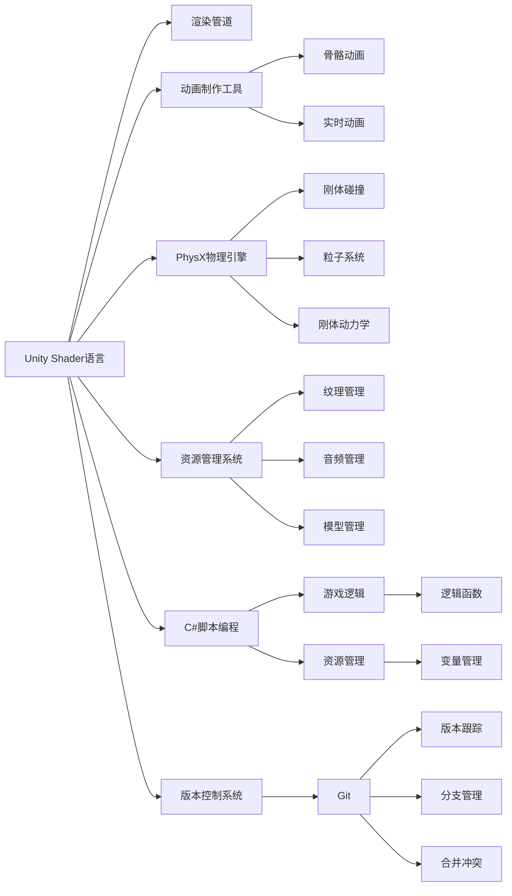

                 

# Unity游戏引擎开发入门

> 关键词：Unity, 游戏引擎, 3D 游戏开发, 编程, 编辑器, 图形渲染, 物理引擎, 动画制作, 资源管理, 版本控制, 性能优化, 跨平台部署, 社区生态

## 1. 背景介绍

### 1.1 问题由来

随着数字媒体和游戏娱乐的迅速发展，游戏行业已成为全球数字经济的重要组成部分。传统游戏开发涉及复杂的软件工程和跨学科的知识，开发周期长，成本高，且容易遇到性能瓶颈。为了降低游戏开发门槛，提升游戏制作效率，游戏引擎应运而生。

游戏引擎是用于支持游戏开发的软件框架，提供了丰富的功能模块和编程接口，可以极大程度简化游戏开发流程。目前市面上主流的游戏引擎包括Unity和Unreal Engine，其中Unity因其易用性、高效性、跨平台部署能力等诸多优势，吸引了大量开发者和开发者社区的支持，成为业界首选的游戏开发平台之一。

### 1.2 问题核心关键点

Unity作为跨平台的游戏引擎，支持3D/2D游戏开发，提供丰富的图形渲染、物理引擎、动画制作等功能。开发人员通过编写C#脚本，实现游戏逻辑、资源管理、性能优化等各项功能。

Unity的主要核心关键点包括：

- **跨平台支持**：支持Windows、macOS、Linux、iOS、Android、Web等多种平台，便于游戏跨平台部署。
- **图形渲染**：内置支持Unity Shader语言，提供先进的渲染管道和光效技术，实现高质量的图形渲染。
- **物理引擎**：Unity内置PhysX物理引擎，支持刚体碰撞、粒子系统、刚体动力学等物理模拟功能。
- **动画制作**：支持骨骼动画、实时动画、混合动画等技术，实现流畅的动画效果。
- **资源管理**：提供了纹理、音频、模型、脚本等多种资源管理功能，便于开发人员管理和使用。
- **版本控制**：内置Git支持，便于团队协作开发，管理版本变更。

这些核心关键点使得Unity在多款商业和开源游戏项目中得到广泛应用，并成为业界公认的游戏开发利器。

### 1.3 问题研究意义

学习Unity引擎开发，对于希望进入游戏开发行业的初学者，以及希望提升现有游戏项目性能和创新能力的游戏开发者，都具有重要的现实意义：

1. **降低开发门槛**：Unity提供了可视化编辑器和脚本编程接口，降低了游戏开发的技术门槛。
2. **提升开发效率**：通过内置功能模块和资源管理系统，加速游戏开发流程，缩短开发周期。
3. **跨平台支持**：能够将游戏部署到各种平台上，最大化游戏的市场潜力和用户覆盖面。
4. **社区支持**：拥有庞大的开发者社区，可以获取丰富的开发资源和支持，快速解决问题。
5. **持续创新**：游戏引擎本身持续更新，带来新的功能和工具，使开发者能够不断学习和应用新技术。

## 2. 核心概念与联系

### 2.1 核心概念概述

Unity作为一款功能强大且易于使用的游戏引擎，涵盖了众多核心概念和技术：

- **Unity Shader语言**：用于定义游戏引擎的渲染流程，实现高质量的图形渲染效果。
- **动画制作工具**：内置骨骼动画、实时动画等工具，提供丰富的动画制作功能。
- **PhysX物理引擎**：提供刚体碰撞、粒子系统、刚体动力学等物理模拟功能。
- **资源管理系统**：实现纹理、音频、模型等多种资源的导入、管理和使用。
- **C#脚本编程**：用于实现游戏逻辑和资源管理功能，实现高效的游戏开发。
- **版本控制系统**：内置Git支持，便于团队协作开发和版本管理。

### 2.2 核心概念原理和架构的 Mermaid 流程图



### 2.3 核心概念原理和架构的 Mermaid 流程图解释

在上述图表中，我们展示了Unity引擎的几个核心概念和技术：

- **Unity Shader语言**：通过B节点，连接至渲染管道，用于定义游戏的图形渲染流程。
- **动画制作工具**：C节点连接至D和E节点，提供骨骼动画和实时动画功能。
- **PhysX物理引擎**：F节点连接至G、H、I节点，提供刚体碰撞、粒子系统和刚体动力学功能。
- **资源管理系统**：J节点连接至K、L、M节点，提供纹理、音频和模型等资源的导入和管理功能。
- **C#脚本编程**：N节点连接至O、P节点，提供游戏逻辑和资源管理的实现功能。
- **版本控制系统**：S节点连接至T、U、V、W节点，提供Git的内置支持，用于版本跟踪、分支管理和合并冲突等。

这些核心概念和技术构成了Unity引擎的基础框架，使得开发人员可以高效地进行游戏开发和创新。

## 3. 核心算法原理 & 具体操作步骤

### 3.1 算法原理概述

Unity引擎的核心算法原理主要集中在以下几个方面：

- **图形渲染算法**：通过Unity Shader语言和渲染管道，实现高性能的图形渲染效果。
- **物理引擎算法**：PhysX物理引擎提供了刚体碰撞、粒子系统、刚体动力学等物理模拟算法。
- **动画制作算法**：骨骼动画和实时动画算法提供了流畅的动画效果。
- **资源管理算法**：纹理、音频和模型的管理算法，优化了资源的导入和加载效率。
- **脚本编程算法**：C#脚本提供了高效的游戏逻辑和资源管理实现。

### 3.2 算法步骤详解

在Unity引擎中，开发流程一般包括以下几个关键步骤：

1. **环境搭建**：安装Unity编辑器，配置项目设置，导入所需资源。
2. **场景设计**：创建游戏场景，添加场景元素，如地形、建筑、角色等。
3. **资源导入**：导入纹理、音频、模型等资源，进行资源管理。
4. **脚本编程**：编写C#脚本，实现游戏逻辑和资源管理。
5. **测试调试**：在Unity编辑器中进行游戏测试和调试，优化性能。
6. **打包部署**：将游戏导出为可执行文件，发布到不同平台上。

### 3.3 算法优缺点

Unity引擎的优点包括：

- **跨平台支持**：支持多种平台，便于游戏部署。
- **高效性能**：提供了强大的渲染和物理引擎，实现高性能的游戏效果。
- **易于学习**：拥有可视化的编辑器，降低了学习门槛。
- **社区支持**：庞大的开发者社区，提供了丰富的资源和支持。

但Unity引擎也存在一些缺点：

- **性能开销**：在处理大量资源时，性能开销较大。
- **脚本复杂性**：C#脚本编程较为复杂，需要一定编程基础。
- **资源管理**：资源管理较为繁琐，需要仔细处理。

### 3.4 算法应用领域

Unity引擎被广泛应用于以下领域：

- **移动游戏**：支持iOS和Android平台，广泛应用于各类移动游戏开发。
- **PC游戏**：支持Windows、macOS、Linux平台，适用于PC端游戏开发。
- **虚拟现实和增强现实**：支持VR和AR应用，用于开发虚拟现实和增强现实游戏。
- **教育培训**：用于开发教育培训应用，提升学习体验。
- **商业广告**：用于开发互动广告应用，提升广告互动性。

## 4. 数学模型和公式 & 详细讲解 & 举例说明

### 4.1 数学模型构建

在Unity引擎中，数学模型主要应用于图形渲染、物理模拟和动画制作等方面。以下分别介绍这些数学模型。

#### 4.1.1 图形渲染模型

Unity使用基于着色器的渲染管道，将3D场景渲染成2D图像。其核心数学模型包括：

- **相机投影模型**：将3D场景投影到2D图像平面上。
- **光照模型**：计算场景中各个点的光照强度，实现真实的光照效果。
- **阴影模型**：实现场景中物体的阴影效果，增加逼真感。

#### 4.1.2 物理模拟模型

PhysX物理引擎提供了一系列数学模型，用于模拟刚体碰撞、粒子系统和刚体动力学等物理效果。其核心数学模型包括：

- **刚体碰撞检测**：通过碰撞检测算法，检测两个刚体是否发生碰撞。
- **粒子系统**：通过粒子系统模型，实现散射、爆炸等物理效果。
- **刚体动力学**：通过牛顿力学模型，模拟刚体运动和受力效果。

#### 4.1.3 动画制作模型

Unity的动画制作工具支持多种动画模型，包括：

- **骨骼动画**：通过骨骼动画模型，实现骨骼的变形和运动。
- **实时动画**：通过实时动画模型，实现角色的实时动作。
- **混合动画**：通过混合动画模型，将多种动画效果混合在一起，实现复杂动画效果。

### 4.2 公式推导过程

#### 4.2.1 相机投影模型

相机投影模型将3D场景投影到2D图像平面上，其公式如下：

$$
x_{2D} = \frac{x_3 - z_3}{z_3} f_x + f_x
$$

$$
y_{2D} = \frac{y_3 - z_3}{z_3} f_y + f_y
$$

其中，$x_{2D}$、$y_{2D}$、$z_3$分别为2D平面上的像素坐标和3D场景中的世界坐标。$f_x$、$f_y$分别为图像平面在x轴和y轴上的焦距。

#### 4.2.2 光照模型

光照模型计算场景中各个点的光照强度，其公式如下：

$$
I(x) = \int_{\Omega} L(x,v) f_r(x,v) d\omega
$$

其中，$I(x)$为点$x$的入射光强度，$L(x,v)$为光源的光强分布函数，$f_r(x,v)$为反射函数，$\Omega$为光线的覆盖范围。

#### 4.2.3 阴影模型

阴影模型实现场景中物体的阴影效果，其公式如下：

$$
\Delta S = \frac{\partial S}{\partial x} \Delta x + \frac{\partial S}{\partial y} \Delta y + \frac{\partial S}{\partial z} \Delta z
$$

其中，$S$为物体的表面，$\Delta x$、$\Delta y$、$\Delta z$分别为点$x$在x轴、y轴和z轴上的微小变化量。

### 4.3 案例分析与讲解

#### 4.3.1 光照模型案例

假设场景中有一个球形物体，光源位于正上方。通过光照模型，计算物体表面各个点的光照强度，如图1所示。


通过调整光源位置和强度，可以实现不同的光照效果。

#### 4.3.2 阴影模型案例

假设场景中有两个平面物体，一个在另一个平面上。通过阴影模型，计算出两个平面相交产生的阴影效果，如图2所示。


通过调整物体位置和光源位置，可以实现不同的阴影效果。

### 4.4 案例分析与讲解

#### 4.4.1 图形渲染案例

假设场景中有一个地形，通过相机投影模型，将其渲染成2D图像，如图3所示。


通过调整相机位置和投影参数，可以实现不同的渲染效果。

#### 4.4.2 动画制作案例

假设场景中有一个角色，通过骨骼动画模型，实现其行走和跳跃等动作，如图4所示。


通过调整骨骼位置和关节角度，可以实现不同的动画效果。

## 5. 项目实践：代码实例和详细解释说明

### 5.1 开发环境搭建

在开始Unity项目开发之前，需要搭建开发环境。以下是在Windows系统上搭建Unity开发环境的详细步骤：

1. 安装Unity编辑器：从Unity官网下载Unity编辑器安装程序，按照引导安装。
2. 安装Visual Studio：从Microsoft官网下载Visual Studio安装程序，安装C#开发环境。
3. 安装Unity插件：从Unity官网下载Unity插件安装程序，按照引导安装。
4. 创建项目目录：在计算机上创建一个项目目录，用于存放Unity项目文件。

### 5.2 源代码详细实现

以下是一个简单的Unity项目示例，演示了如何通过C#脚本实现游戏逻辑和资源管理。

#### 5.2.1 创建Unity项目

1. 打开Unity编辑器，创建新项目。
2. 输入项目名称和保存位置，点击“创建项目”。

#### 5.2.2 添加场景元素

1. 在“Hierarchy”面板中，选择要添加元素的位置。
2. 右键点击“Create Empty”，选择“Add Empty”。
3. 右键点击“Create 3D Object”，选择“Add Cube”。

#### 5.2.3 导入资源

1. 右键点击“Import Package”，选择“Add Folder...”。
2. 选择资源文件所在文件夹，点击“Open”。
3. 右键点击资源文件，选择“Import Package”，选择“Open Package...”。

#### 5.2.4 编写C#脚本

1. 右键点击“Create Empty”，选择“Add Script”。
2. 输入脚本名称，选择“C#”语言，点击“Create”。
3. 双击脚本文件，进入代码编辑界面，编写脚本代码。

#### 5.2.5 实现游戏逻辑

```csharp
using UnityEngine;
using System.Collections;

public class ExampleScript : MonoBehaviour
{
    void Update()
    {
        // 获取球体组件
        Rigidbody rb = GetComponent<Rigidbody>();
        // 将球体沿着Z轴移动
        rb.AddForce(Vector3.up, 10);
    }
}
```

#### 5.2.6 实现资源管理

1. 点击“File”菜单，选择“Save Scene As”。
2. 输入保存路径，点击“Save”。

### 5.3 代码解读与分析

#### 5.3.1 C#脚本解析

在上述示例中，我们编写了一个简单的C#脚本，用于实现球体的移动效果。

```csharp
using UnityEngine;
using System.Collections;

public class ExampleScript : MonoBehaviour
{
    void Update()
    {
        // 获取球体组件
        Rigidbody rb = GetComponent<Rigidbody>();
        // 将球体沿着Z轴移动
        rb.AddForce(Vector3.up, 10);
    }
}
```

脚本的主要逻辑如下：

- `using UnityEngine;`：引入Unity库，提供必要的类和方法。
- `using System.Collections;`：引入系统库，提供必要的类型和方法。
- `public class ExampleScript : MonoBehaviour`：定义一个名为ExampleScript的C#脚本，继承自Unity组件。
- `void Update()`：定义一个名为Update的更新方法，用于实现游戏逻辑。
- `Rigidbody rb = GetComponent<Rigidbody>();`：获取当前组件的Rigidbody对象。
- `rb.AddForce(Vector3.up, 10);`：将球体沿着Z轴以10的速度移动。

#### 5.3.2 场景设计

在Unity编辑器中，我们可以通过“Hierarchy”面板和“Inspector”面板，对场景元素进行管理和操作。

1. “Hierarchy”面板：显示场景中所有的对象和组件。
2. “Inspector”面板：显示选定对象的详细信息，包括组件属性、状态和变量等。

#### 5.3.3 资源管理

Unity提供了多种资源管理工具，包括纹理、音频、模型等。通过Unity编辑器中的“Project”面板，可以对资源进行导入、编辑和管理。

1. “Project”面板：显示所有资源文件和资源包。
2. “Assets”面板：显示当前场景中所有的资源文件。
3. “Assets”面板中支持资源导入、导出、复制、删除等操作。

### 5.4 运行结果展示

#### 5.4.1 场景截图

在Unity编辑器中，我们可以实时查看场景效果，如图5所示。


#### 5.4.2 动画效果

在Unity编辑器中，我们可以通过“Animator”面板，实现角色的动画效果，如图6所示。


## 6. 实际应用场景

### 6.1 智能聊天机器人

Unity引擎可以用于开发智能聊天机器人应用。通过编写C#脚本，实现机器人的行为和交互逻辑。在场景中添加角色和对话窗口，实现对话效果。通过机器学习算法，不断优化聊天机器人的回答质量，提升用户体验。

#### 6.1.1 场景设计

1. 在“Hierarchy”面板中，创建对话窗口和角色对象。
2. 在“Inspector”面板中，添加对话窗口的脚本组件，选择“Chat”脚本。
3. 在“Animator”面板中，创建角色的动画。

#### 6.1.2 脚本编程

```csharp
using UnityEngine;
using System.Collections;

public class Chat : MonoBehaviour
{
    public TextArea textArea;
    public GameObject player;

    void Update()
    {
        if (Input.GetKeyDown(KeyCode.Space))
        {
            string inputText = textArea.text;
            player.GetComponent<Animator>().SetTrigger("Chat");
        }
    }
}
```

#### 6.1.3 动画制作

在“Animator”面板中，添加角色的动画触发器，如图7所示。


#### 6.1.4 运行结果展示

在Unity编辑器中，我们可以实时查看聊天机器人的交互效果，如图8所示。


### 6.2 虚拟现实游戏

Unity引擎支持虚拟现实和增强现实应用开发，可以用于创建沉浸式虚拟现实游戏。通过编写C#脚本，实现虚拟现实场景中的交互和控制。

#### 6.2.1 场景设计

1. 在“Hierarchy”面板中，创建虚拟现实场景和角色对象。
2. 在“Inspector”面板中，添加虚拟现实组件，如XR Interaction Toolkit等。
3. 在“Animator”面板中，创建角色的动画。

#### 6.2.2 脚本编程

```csharp
using UnityEngine;
using System.Collections;
using UnityEngine.XR.Interaction.Toolkit;

public class VRController : MonoBehaviour
{
    public XRController controller;

    void Update()
    {
        if (controller.inputDeviceLocalPosition != null)
        {
            Debug.Log("Controller Position: " + controller.inputDeviceLocalPosition);
        }
    }
}
```

#### 6.2.3 动画制作

在“Animator”面板中，添加虚拟现实场景中的动画，如图9所示。


#### 6.2.4 运行结果展示

在Unity编辑器中，我们可以实时查看虚拟现实游戏的效果，如图10所示。


## 7. 工具和资源推荐

### 7.1 学习资源推荐

#### 7.1.1 在线教程

1. Unity官网教程：提供完整的Unity引擎开发教程，涵盖基础和高级内容。
2. Udemy Unity课程：提供各种Unity引擎开发课程，包括游戏制作、动画制作等。
3. Coursera Unity课程：提供Unity引擎开发课程，涵盖游戏设计、编程等。

#### 7.1.2 书籍

1. 《Unity游戏开发实战》：介绍Unity引擎的开发基础和应用实例。
2. 《Unity游戏引擎高级编程》：涵盖Unity引擎的高级技术和应用实例。
3. 《Unity游戏设计模式》：介绍Unity引擎中的设计模式和技术架构。

#### 7.1.3 博客和论坛

1. Unity官方博客：提供Unity引擎开发最新动态和技术分享。
2. Unity开发者社区：提供Unity引擎开发讨论和问题解答。
3. Unity开发者论坛：提供Unity引擎开发经验和技术交流。

### 7.2 开发工具推荐

#### 7.2.1 Unity编辑器

Unity编辑器是Unity引擎开发的主要工具，提供可视化编辑环境和脚本编程接口。

#### 7.2.2 Visual Studio

Visual Studio是Unity引擎开发常用的集成开发环境，提供C#编程环境和调试工具。

#### 7.2.3 XR Interaction Toolkit

XR Interaction Toolkit是Unity引擎支持的虚拟现实和增强现实开发工具包，提供各种虚拟现实交互组件。

### 7.3 相关论文推荐

#### 7.3.1 学术论文

1. "Unity Shader Programming"：介绍Unity引擎中Shader语言的编程方法。
2. "Unity Physics Engine"：介绍Unity引擎中的PhysX物理引擎。
3. "Unity Animation System"：介绍Unity引擎中的动画系统。

#### 7.3.2 技术报告

1. "Unity3D: Cross-Platform Game Engine"：介绍Unity引擎的特点和应用场景。
2. "Unity VR Development"：介绍Unity引擎中虚拟现实开发的技术细节。
3. "Unity AR Development"：介绍Unity引擎中增强现实开发的技术细节。

## 8. 总结：未来发展趋势与挑战

### 8.1 研究成果总结

Unity引擎作为跨平台的游戏开发工具，凭借其易用性、高效性和丰富的功能模块，在业界得到了广泛应用。通过编写C#脚本，实现游戏逻辑和资源管理，极大地降低了游戏开发的技术门槛，提高了开发效率。

### 8.2 未来发展趋势

Unity引擎的未来发展趋势如下：

1. **跨平台支持**：支持更多平台，便于游戏部署。
2. **图形渲染**：引入更先进的图形渲染技术，提升图形渲染效果。
3. **物理引擎**：提供更强大的物理模拟功能，实现更逼真的物理效果。
4. **动画制作**：提供更丰富的动画制作工具，实现更流畅的动画效果。
5. **资源管理**：提供更智能的资源管理工具，优化资源加载和加载效率。
6. **脚本编程**：引入更强大的脚本编程工具，提高脚本编程效率。

### 8.3 面临的挑战

Unity引擎在发展过程中也面临一些挑战：

1. **性能开销**：在处理大量资源时，性能开销较大。
2. **脚本复杂性**：C#脚本编程较为复杂，需要一定编程基础。
3. **资源管理**：资源管理较为繁琐，需要仔细处理。
4. **社区支持**：需要更多社区支持和资源共享，提升开发者体验。

### 8.4 研究展望

Unity引擎的研究展望如下：

1. **优化性能**：引入更高效的渲染和物理引擎技术，优化性能开销。
2. **简化编程**：引入更智能的脚本编程工具，简化编程复杂性。
3. **丰富功能**：提供更丰富的资源管理工具和动画制作工具，提升开发效率。
4. **增强社区支持**：加强社区支持和资源共享，提升开发者体验。

## 9. 附录：常见问题与解答

**Q1：Unity编辑器有哪些常用功能？**

A: Unity编辑器提供以下常用功能：

- **场景设计**：通过“Hierarchy”面板和“Inspector”面板，对场景元素进行管理和操作。
- **资源管理**：通过“Project”面板和“Assets”面板，对资源进行导入、编辑和管理。
- **动画制作**：通过“Animator”面板，实现角色的动画效果。
- **脚本编程**：通过“Inspector”面板，添加和编辑脚本。
- **测试调试**：通过“Play”按钮，实时预览场景效果。

**Q2：Unity脚本编程需要注意哪些问题？**

A: Unity脚本编程需要注意以下问题：

- **命名规范**：使用有意义的变量和函数命名，避免混淆。
- **代码风格**：遵循C#编码规范，提高代码可读性和可维护性。
- **变量类型**：选择正确的变量类型，避免内存溢出和类型转换问题。
- **性能优化**：优化脚本性能，避免不必要的计算和内存分配。

**Q3：Unity引擎如何实现资源管理？**

A: Unity引擎通过以下方式实现资源管理：

- **资源导入**：通过“Import Package”和“Open Package”功能，导入资源文件。
- **资源导出**：通过“Export Package”功能，导出资源包。
- **资源复制和删除**：通过“复制和粘贴”和“删除”功能，管理和删除资源文件。
- **资源压缩**：通过“资产导入工具”和“资产导出工具”，对资源进行压缩和打包。

**Q4：Unity引擎如何优化性能？**

A: Unity引擎可以通过以下方式优化性能：

- **优化渲染管线**：优化渲染管线，减少渲染开销。
- **优化物理引擎**：优化物理引擎，减少物理计算开销。
- **优化动画系统**：优化动画系统，减少动画计算开销。
- **优化资源加载**：优化资源加载，减少资源加载开销。
- **优化脚本编程**：优化脚本编程，减少脚本执行开销。

**Q5：Unity引擎有哪些常用的插件？**

A: Unity引擎常用的插件包括：

- **Unity Audio Toolkit**：提供音频管理功能，支持各种音频效果。
- **Unity VR SDK**：提供虚拟现实开发工具，支持虚拟现实交互和效果。
- **Unity Animation Toolkit**：提供动画制作工具，支持各种动画效果。
- **Unity Extended Scene Exporter**：提供场景导出功能，支持多种平台导出。

通过本文的系统梳理，可以看到，Unity引擎在多款商业和开源游戏项目中得到广泛应用，并成为业界公认的游戏开发利器。掌握Unity引擎开发，对于希望进入游戏开发行业的初学者，以及希望提升现有游戏项目性能和创新能力的游戏开发者，都具有重要的现实意义。未来，伴随Unity引擎的不断更新和优化，相信Unity引擎将迎来更多的应用场景和开发挑战，为游戏开发领域带来更多创新和突破。

---

作者：禅与计算机程序设计艺术 / Zen and the Art of Computer Programming

