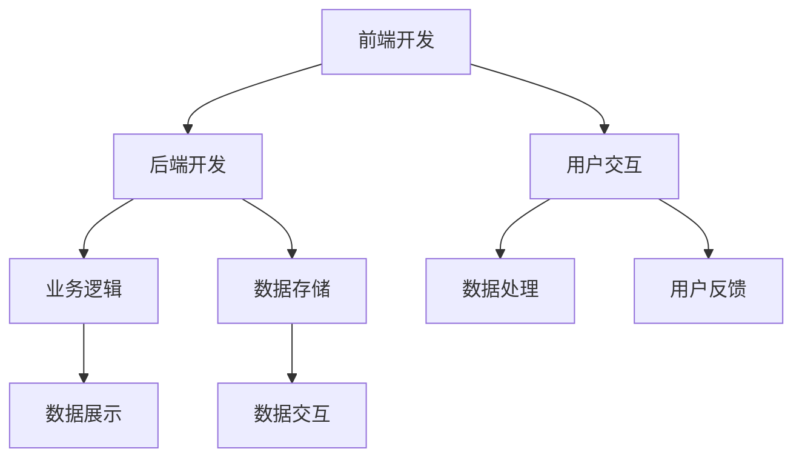

                 

# Web 应用程序开发：前端和后端

> 关键词：Web 开发,前端,后端,前端和后端开发,前端技术栈,后端技术栈,全栈开发

## 1. 背景介绍

在当今数字化时代，Web 应用程序开发已经成为推动业务增长、改善用户体验的关键因素。随着互联网技术的飞速发展，Web 应用程序的功能和复杂度也日益增加。前端和后端是构成 Web 应用程序的两个重要组成部分，两者相互协作才能确保应用的性能、安全性和用户体验。本文将从基础概念、核心算法、应用场景等多个角度深入探讨前端和后端开发的技术细节和最佳实践，帮助你构建高效、稳定的 Web 应用程序。

## 2. 核心概念与联系

### 2.1 核心概念概述

为了更好地理解前端和后端开发，本节将介绍几个关键概念及其相互联系：

- **前端开发**：指Web应用程序的用户界面部分，包括HTML、CSS和JavaScript。负责展示给用户，处理用户输入和交互。
- **后端开发**：指Web应用程序的服务器端部分，包括数据库、服务器、中间件等。负责处理业务逻辑、数据存储和通信。
- **全栈开发**：指开发者具备前端和后端开发的能力，能够独立完成Web应用程序从设计到部署的全过程。

这些概念之间有着紧密的联系：前端和后端共同协作，使得Web应用程序能够提供高效、稳定的用户体验。前端负责展示和用户交互，后端负责数据处理和业务逻辑，两者缺一不可。

### 2.2 核心概念原理和架构的 Mermaid 流程图



该流程图展示了前端和后端开发的基本架构和工作流程：用户通过前端界面与应用程序交互，前端负责展示数据和处理用户输入；后端处理业务逻辑和数据存储，并通过API将数据传递给前端。用户反馈信息再次通过前端传向后端，形成闭环。

## 3. 核心算法原理 & 具体操作步骤

### 3.1 算法原理概述

前端和后端开发的核心算法原理主要集中在以下几个方面：

- **前端算法**：主要包括DOM操作、事件处理、动画效果、响应式设计等。通过JavaScript等技术实现。
- **后端算法**：包括数据处理、业务逻辑、数据库操作等。使用Python、Java、Node.js等编程语言实现。

### 3.2 算法步骤详解

#### 3.2.1 前端开发

1. **设计页面布局**：使用HTML和CSS进行页面布局设计，定义页面元素和样式。
2. **实现交互效果**：使用JavaScript编写事件处理程序，处理用户输入和交互，如表单提交、按钮点击等。
3. **优化性能**：使用前端优化技术，如懒加载、异步加载、CSS Sprites等，提升页面加载速度和响应性。
4. **响应式设计**：使用CSS Grid、Flexbox等技术实现页面响应式布局，适配不同设备和屏幕大小。

#### 3.2.2 后端开发

1. **设计数据库模型**：定义数据库表结构和关系，确保数据一致性和完整性。
2. **实现业务逻辑**：编写服务器端代码，处理请求和响应，进行业务逻辑处理和数据计算。
3. **优化性能**：使用后端优化技术，如缓存机制、数据库索引、异步处理等，提升系统性能。
4. **安全防护**：实现身份验证、授权访问、防止SQL注入等安全措施，保护数据安全。

### 3.3 算法优缺点

#### 3.3.1 前端开发

- **优点**：
  - 用户界面直观，易于理解和操作。
  - 开发速度快，迭代周期短，便于快速上线。
  - 前端技术成熟，有大量社区支持和第三方库，开发效率高。

- **缺点**：
  - 性能瓶颈在客户端，需要考虑浏览器兼容性。
  - 安全性问题需要特别注意，如跨站脚本攻击等。
  - 数据处理和业务逻辑在客户端，难以实现复杂功能。

#### 3.3.2 后端开发

- **优点**：
  - 数据处理和业务逻辑在服务器端，更加安全和可靠。
  - 支持复杂的数据存储和计算任务，数据一致性和完整性有保障。
  - 系统性能不受客户端限制，可以采用高性能技术实现。

- **缺点**：
  - 开发周期长，需要与前端紧密配合，迭代速度较慢。
  - 服务器端代码复杂，需要考虑代码可维护性和扩展性。
  - 需要专业服务器环境，部署和运维成本较高。

### 3.4 算法应用领域

前端和后端开发在各个领域都有广泛应用：

- **电子商务**：前端展示商品信息，后端处理交易逻辑和库存管理。
- **社交网络**：前端展示用户动态，后端处理用户关系和数据存储。
- **金融科技**：前端提供交易界面，后端处理资金结算和风控逻辑。
- **医疗健康**：前端展示患者信息，后端处理病历数据和医疗决策。

## 4. 数学模型和公式 & 详细讲解 & 举例说明

### 4.1 数学模型构建

#### 4.1.1 前端开发

- **页面渲染模型**：HTML和CSS定义页面布局，JavaScript负责页面交互和动画效果。
- **响应式设计模型**：CSS Grid、Flexbox等技术实现页面响应式布局。

#### 4.1.2 后端开发

- **数据库模型**：关系型数据库（如MySQL）或非关系型数据库（如MongoDB）定义数据表结构。
- **业务逻辑模型**：使用面向对象编程（OOP）或函数式编程（FP）实现业务逻辑处理。

### 4.2 公式推导过程

#### 4.2.1 前端开发

- **DOM操作**：通过JavaScript操作DOM（文档对象模型），实现页面元素的动态更新。
- **事件处理**：使用事件监听器（如addEventListener）处理用户交互，例如表单提交、按钮点击等。
- **动画效果**：使用CSS3或JavaScript动画库（如GSAP）实现页面动画效果。

#### 4.2.2 后端开发

- **数据处理**：使用SQL语句进行数据库操作，如增删改查。
- **业务逻辑**：使用编程语言（如Python、Java）编写算法实现业务逻辑，如计算、排序等。
- **安全防护**：使用身份验证技术（如JWT、OAuth）和授权访问控制（如RBAC）保护数据安全。

### 4.3 案例分析与讲解

#### 4.3.1 前端开发案例

- **示例**：实现一个电商网站的商品详情页面。
  - **HTML和CSS**：定义页面结构和样式。
  - **JavaScript**：处理商品详情展示、搜索功能、用户评价等。
  - **优化性能**：使用懒加载、异步加载、CSS Sprites等技术提升页面加载速度。

#### 4.3.2 后端开发案例

- **示例**：实现一个社交网络平台的动态消息功能。
  - **数据库模型**：定义用户表、消息表等数据表结构。
  - **业务逻辑**：实现消息发送、接收、存储等逻辑处理。
  - **安全性**：实现身份验证、防止SQL注入等安全措施。

## 5. 项目实践：代码实例和详细解释说明

### 5.1 开发环境搭建

1. **安装Node.js和npm**：Node.js提供了JavaScript运行环境，npm是Node.js的包管理工具。
   ```
   brew install node
   ```

2. **安装Vue.js框架**：Vue.js是一个流行的前端框架，用于构建单页面应用程序。
   ```
   npm install -g @vue/cli
   vue create my-project
   ```

3. **安装MySQL数据库**：MySQL是一个流行的关系型数据库，用于存储Web应用程序的数据。
   ```
   brew install mysql
   ```

### 5.2 源代码详细实现

#### 5.2.1 前端开发

- **实现一个简单的登录页面**：
  - **HTML和CSS**：定义登录页面结构和样式。
  - **JavaScript**：实现登录表单提交、用户验证等逻辑。
  ```html
  <form @submit.prevent="login">
    <input v-model="username" placeholder="用户名">
    <input v-model="password" type="password" placeholder="密码">
    <button type="submit">登录</button>
  </form>
  ```
  ```javascript
  methods: {
    login() {
      // 验证用户名和密码
      if (this.username && this.password) {
        // 发送登录请求到后端
        axios.post('/login', { username: this.username, password: this.password })
          .then(response => {
            // 登录成功，保存用户信息
            localStorage.setItem('user', JSON.stringify(response.data.user));
          })
          .catch(error => {
            // 登录失败，显示错误信息
            alert(error.response.data.message);
          });
      }
    }
  }
  ```

#### 5.2.2 后端开发

- **实现一个简单的用户注册功能**：
  - **数据库模型**：定义用户表结构。
  - **业务逻辑**：实现用户注册、保存等逻辑处理。
  - **安全性**：实现防止SQL注入等安全措施。
  ```sql
  CREATE TABLE user (
    id INT PRIMARY KEY AUTO_INCREMENT,
    username VARCHAR(50) NOT NULL,
    password VARCHAR(255) NOT NULL,
    email VARCHAR(100),
    created_at TIMESTAMP DEFAULT CURRENT_TIMESTAMP
  );
  ```
  ```javascript
  const express = require('express');
  const app = express();
  const mysql = require('mysql');

  const pool = mysql.createPool({
    host: 'localhost',
    user: 'root',
    password: 'password',
    database: 'my_database'
  });

  app.post('/register', (req, res) => {
    const { username, password, email } = req.body;
    const sql = 'INSERT INTO user (username, password, email) VALUES (?, ?, ?)';
    pool.query(sql, [username, password, email], (error, results) => {
      if (error) {
        // 处理数据库连接错误
        console.error(error);
        res.status(500).send('Database error');
      } else {
        // 注册成功，返回用户ID
        res.send(results.insertId);
      }
    });
  });

  app.listen(3000, () => {
    console.log('Server started on port 3000');
  });
  ```

### 5.3 代码解读与分析

- **前端开发代码解读**：
  - **HTML和CSS**：定义页面结构和样式，使用v-model指令实现双向数据绑定。
  - **JavaScript**：处理表单提交和用户验证，使用axios库发送登录请求。
  - **优化性能**：使用.prevent修饰符防止表单默认提交行为，使用axios的拦截器处理请求和响应。

- **后端开发代码解读**：
  - **Node.js和Express框架**：使用Express框架搭建Web服务器，处理HTTP请求和响应。
  - **MySQL数据库**：使用mysql模块连接MySQL数据库，执行SQL语句进行数据操作。
  - **安全性**：使用池化技术提高数据库连接效率，使用参数化查询防止SQL注入攻击。

### 5.4 运行结果展示

- **前端开发结果展示**：
  - **登录页面**：用户输入用户名和密码，点击登录按钮，前端向后端发送登录请求，显示登录结果。
  - **注册页面**：用户输入用户名、密码和邮箱，点击注册按钮，前端向后端发送注册请求，显示注册结果。

- **后端开发结果展示**：
  - **登录功能**：后端接收前端登录请求，验证用户名和密码，保存用户信息。
  - **注册功能**：后端接收前端注册请求，将用户信息保存到数据库，返回用户ID。

## 6. 实际应用场景

### 6.1 电商平台

电商平台的前端页面需要展示商品信息、用户评价、购物车等功能。后端处理订单生成、支付结算、库存管理等逻辑。两者紧密协作，实现高效、稳定的电商应用。

### 6.2 在线教育

在线教育平台的前端展示课程信息、学习进度、作业提交等功能。后端处理课程数据、用户管理、作业评分等逻辑。通过前端和后端协作，提供高质量的在线学习体验。

### 6.3 社交媒体

社交媒体平台的前端展示用户动态、好友关系、私信等功能。后端处理用户数据、消息推送、数据存储等逻辑。两者协同工作，构建活跃、互动的社交平台。

### 6.4 未来应用展望

随着Web技术的不断发展，前端和后端开发将面临更多挑战和机遇。未来的发展趋势包括：

- **全栈开发**：前端和后端开发者将更加融合，全栈开发人才需求增加。
- **微服务架构**：后端开发将采用微服务架构，提高系统可扩展性和容错能力。
- **DevOps文化**：持续集成和持续部署（CI/CD）成为常态，提升开发效率和系统稳定性。
- **前端技术栈升级**：前端开发将引入更多新技术，如React、Vue、Angular等，提升开发效率和用户体验。
- **后端技术栈升级**：后端开发将引入更多高性能技术，如Docker、Kubernetes、Serverless等，提升系统性能和可维护性。

## 7. 工具和资源推荐

### 7.1 学习资源推荐

- **Web开发教程**：如MDN Web Docs、W3Schools等，提供详细的Web开发教程和示例代码。
- **前端框架文档**：如Vue.js、React、Angular等框架官方文档，深入了解框架功能和用法。
- **后端框架文档**：如Node.js、Express、Spring Boot等框架官方文档，深入了解框架功能和用法。
- **在线课程**：如Udemy、Coursera等平台提供的Web开发课程，系统学习Web开发技术。
- **技术博客**：如Medium、CSDN等平台上的技术博客，获取最新的Web开发动态和技术分享。

### 7.2 开发工具推荐

- **前端开发工具**：如Visual Studio Code、Atom等代码编辑器，支持多种前端框架和技术栈。
- **后端开发工具**：如IntelliJ IDEA、PyCharm等IDE，支持多种后端语言和技术栈。
- **版本控制工具**：如Git、SVN等版本控制工具，支持团队协作和代码管理。
- **数据库管理工具**：如phpMyAdmin、Navicat等工具，支持数据库管理和可视化操作。
- **容器化工具**：如Docker、Kubernetes等容器化工具，支持应用部署和运维。

### 7.3 相关论文推荐

- **前端开发论文**：如《JavaScript异步编程》、《响应式Web设计》等，深入探讨前端开发技术。
- **后端开发论文**：如《Node.js架构设计》、《RESTful API设计》等，深入探讨后端开发技术。
- **全栈开发论文**：如《全栈开发实践》、《全栈开发框架选择》等，深入探讨全栈开发技术和实践。

## 8. 总结：未来发展趋势与挑战

### 8.1 研究成果总结

本文详细介绍了Web应用程序开发中的前端和后端开发技术，包括设计原则、实现细节和最佳实践。通过学习本文，你可以系统掌握Web开发的核心技术，构建高效、稳定的Web应用程序。

### 8.2 未来发展趋势

- **全栈开发**：前端和后端技术将更加融合，全栈开发人才需求增加。
- **微服务架构**：后端开发将采用微服务架构，提高系统可扩展性和容错能力。
- **DevOps文化**：持续集成和持续部署（CI/CD）成为常态，提升开发效率和系统稳定性。
- **前端技术栈升级**：前端开发将引入更多新技术，如React、Vue、Angular等，提升开发效率和用户体验。
- **后端技术栈升级**：后端开发将引入更多高性能技术，如Docker、Kubernetes、Serverless等，提升系统性能和可维护性。

### 8.3 面临的挑战

- **性能瓶颈**：前端页面加载速度和后端系统性能需要不断优化。
- **安全性问题**：前端和后端的安全性问题需要特别关注，防止SQL注入、跨站脚本等攻击。
- **维护成本**：大规模Web应用程序的维护成本较高，需要高效的工具和技术支持。

### 8.4 研究展望

- **全栈开发人才**：培养更多全栈开发人才，提升Web开发技术水平。
- **微服务架构**：探索更多微服务架构的设计和实现方法，提高系统可扩展性和容错能力。
- **DevOps文化**：推广DevOps文化，提升开发效率和系统稳定性。
- **前端技术栈升级**：引入更多前端新技术，提升开发效率和用户体验。
- **后端技术栈升级**：引入更多高性能后端技术，提升系统性能和可维护性。

## 9. 附录：常见问题与解答

**Q1: 前端和后端开发的区别是什么？**

A: 前端开发主要关注用户界面和交互效果，使用HTML、CSS、JavaScript等技术。后端开发主要关注业务逻辑和数据处理，使用Python、Java、Node.js等编程语言。两者共同协作，实现高效、稳定的Web应用程序。

**Q2: 如何选择合适的Web开发框架？**

A: 选择合适的Web开发框架需要考虑多个因素，包括技术栈、功能需求、开发效率等。常用的框架包括Vue.js、React、Angular等前端框架，以及Node.js、Express、Spring Boot等后端框架。

**Q3: 前端开发中常见的性能优化有哪些？**

A: 前端开发中常见的性能优化包括：
- 懒加载：异步加载非关键资源，提升页面加载速度。
- 异步加载：使用异步请求处理，避免阻塞页面渲染。
- CSS Sprites：将多个小图标合并为一个大图标，减少HTTP请求。
- 响应式设计：使用CSS Grid、Flexbox等技术实现页面响应式布局，适配不同设备和屏幕大小。

**Q4: 后端开发中常见的安全性问题有哪些？**

A: 后端开发中常见的安全性问题包括：
- SQL注入：通过恶意输入SQL代码，绕过身份验证。
- XSS攻击：通过注入恶意脚本，窃取用户信息。
- CSRF攻击：通过伪造请求，执行恶意操作。
- 鉴权和授权：实现用户身份验证和访问控制，防止未授权访问。

**Q5: 如何构建高效的前后端协作开发流程？**

A: 构建高效的前后端协作开发流程需要：
- 定期沟通和协调，明确需求和接口。
- 使用版本控制工具，进行代码共享和版本管理。
- 使用API文档和接口测试工具，确保前后端接口一致性。
- 使用代码审查和自动化测试，提高代码质量和稳定性。

通过本文的系统梳理，可以看到，前端和后端开发在Web应用程序开发中扮演着不可或缺的角色。掌握前端和后端开发的核心技术和最佳实践，能够帮助开发者构建高效、稳定的Web应用程序，提升用户体验和业务价值。

