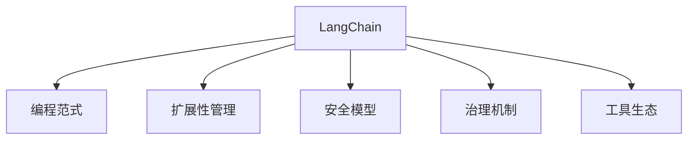

                 

# 【LangChain编程：从入门到实践】LCEL高级特性

> 关键词：LangChain, 编程范式, 智能合约, 扩展性, 部署管理, 安全模型, 治理机制

## 1. 背景介绍

### 1.1 问题由来
随着Web3和去中心化应用的兴起，智能合约已逐渐成为构建去中心化应用(DApp)和Web3生态的重要基石。传统的编程范式无法满足去中心化应用的需求，亟需一种全新的编程方式，以支持具有扩展性、可靠性和安全性的Web3应用程序的开发。

LangChain正是在这样的背景下诞生的，它是一种面向Web3的编程语言和框架，专为智能合约和Web3应用开发而设计。与传统编程语言不同，LangChain不仅支持开发高可靠、高性能的智能合约，还提供了丰富的工具和生态，帮助开发者更好地管理和维护去中心化应用。

### 1.2 问题核心关键点
LangChain的高级特性主要包括以下几个方面：
1. **智能合约编程范式**：提供以事件为中心的编程模型，帮助开发者设计更健壮、可维护的智能合约。
2. **扩展性管理**：支持多节点网络的扩展，采用事务批处理等技术，降低系统开销。
3. **安全模型**：集成验证和共识机制，增强系统的安全性和容错能力。
4. **治理机制**：提供去中心化治理模型，确保系统的透明、公正和效率。
5. **工具生态**：提供丰富的开发工具、测试框架和部署工具，提高开发效率。

### 1.3 问题研究意义
深入研究LangChain的高级特性，对Web3开发者有着重要意义：
1. 帮助开发者掌握最新的编程范式和框架，加速应用开发。
2. 提高Web3应用的可靠性和安全性，减少漏洞风险。
3. 优化系统扩展性，支持大规模去中心化应用。
4. 实现更好的治理机制，促进社区合作和发展。

## 2. 核心概念与联系

### 2.1 核心概念概述

为了更好地理解LangChain的高级特性，本节将介绍几个核心概念：

- **LangChain**：一种面向Web3的编程语言和框架，支持智能合约开发，提供丰富的开发工具和生态。
- **编程范式**：指开发程序的方式和思路，包括面向对象、函数式、事件驱动等。
- **扩展性管理**：指系统设计时考虑的可扩展性，包括多节点网络、事务批处理等技术。
- **安全模型**：指保障系统安全的机制，包括验证、共识、安全协议等。
- **治理机制**：指去中心化应用的治理方式，包括代币激励、权益分配、社区投票等。
- **工具生态**：指支持LangChain应用的开发、测试、部署等环节的各种工具和框架。

这些概念通过以下Mermaid流程图进行展示：



该流程图展示了LangChain的高级特性如何通过编程范式、扩展性管理、安全模型、治理机制和工具生态相互关联、相互促进，共同支撑起一个强大的Web3生态系统。

## 3. 核心算法原理 & 具体操作步骤
### 3.1 算法原理概述

LangChain的高级特性主要体现在以下几个方面：

- **事件驱动编程模型**：LangChain的编程模型以事件为中心，通过事件驱动方式处理业务逻辑，使智能合约更具健壮性和可维护性。
- **扩展性管理技术**：LangChain采用多节点网络、事务批处理等技术，支持大规模的扩展性管理。
- **安全模型设计**：集成验证和共识机制，确保系统的安全性和容错能力。
- **治理机制实现**：采用去中心化治理模型，确保系统的透明、公正和效率。
- **工具生态支持**：提供丰富的开发、测试、部署工具，提高开发效率。

### 3.2 算法步骤详解

#### 3.2.1 事件驱动编程模型

事件驱动编程模型是LangChain的核心特性之一。它通过事件触发机制来处理业务逻辑，使智能合约更具健壮性和可维护性。

**Step 1: 定义事件类型**
首先，开发者需要定义业务中可能发生的事件类型，例如转账、合同签署、订单更新等。

**Step 2: 编写事件处理程序**
为每个事件类型编写相应的处理程序，通常包括事件触发、处理逻辑和事件更新等步骤。

**Step 3: 事件监听和处理**
通过事件监听机制，智能合约可以实时监听并处理业务事件，确保系统的实时性和可靠性。

#### 3.2.2 扩展性管理技术

LangChain的扩展性管理技术主要包括多节点网络和事务批处理等技术，以支持大规模的扩展性管理。

**Step 1: 搭建多节点网络**
使用LangChain的扩展性管理技术，搭建一个多节点网络，支持横向扩展，提高系统的并发处理能力。

**Step 2: 采用事务批处理**
将多个事务合并为一个批处理事务，减少网络传输和存储开销，提高系统的效率。

**Step 3: 动态调整网络参数**
根据系统的负载情况，动态调整网络参数，如节点数、批处理大小等，以保持系统的稳定性和高效性。

#### 3.2.3 安全模型设计

LangChain的安全模型设计集成了验证和共识机制，确保系统的安全性和容错能力。

**Step 1: 设计验证机制**
设计基于PoS、PoW等共识机制的验证机制，确保交易的有效性和一致性。

**Step 2: 实现安全协议**
实现安全协议，如TLS、SSL等，保障数据传输的安全性。

**Step 3: 监控和预警**
实时监控系统的运行状态，及时发现和处理安全威胁，确保系统的稳定运行。

#### 3.2.4 治理机制实现

LangChain的治理机制实现去中心化治理模型，确保系统的透明、公正和效率。

**Step 1: 设计代币激励机制**
设计代币激励机制，确保参与者的积极性和贡献度。

**Step 2: 实现权益分配**
采用权益分配算法，确保系统的公平性和公正性。

**Step 3: 引入社区投票机制**
引入社区投票机制，确保系统的决策透明性和民主性。

#### 3.2.5 工具生态支持

LangChain提供丰富的开发、测试、部署工具，提高开发效率。

**Step 1: 使用开发工具**
使用LangChain提供的开发工具，如LangChain IDE、LangChain CLI等，加速开发过程。

**Step 2: 集成测试框架**
集成LangChain的测试框架，进行自动化测试和单元测试，确保代码质量和稳定性。

**Step 3: 部署和管理应用**
使用LangChain提供的部署和管理工具，如LangChain Orchestrator等，简化应用部署和管理流程。

### 3.3 算法优缺点

#### 3.3.1 优点

LangChain的高级特性具有以下优点：
1. **健壮性和可维护性**：事件驱动编程模型使智能合约更具健壮性和可维护性。
2. **大规模扩展性**：多节点网络和事务批处理技术支持大规模扩展性管理。
3. **高安全性**：集成验证和共识机制，确保系统的安全性和容错能力。
4. **透明和公正**：去中心化治理机制确保系统的透明、公正和效率。
5. **高效开发**：丰富的工具生态支持高效开发、测试和部署。

#### 3.3.2 缺点

LangChain的高级特性也存在以下缺点：
1. **学习曲线陡峭**：事件驱动编程模型和学习多节点网络等新技术，对开发者提出了更高的要求。
2. **复杂性较高**：系统的设计和实现需要考虑多方面的因素，增加了开发难度。
3. **维护成本高**：系统的扩展性和安全性设计增加了维护成本。

## 4. 数学模型和公式 & 详细讲解 & 举例说明

### 4.1 数学模型构建

LangChain的高级特性可以通过数学模型进行详细讲解。

假设智能合约需要处理N个事件，每个事件的处理时间分别为$t_i$，网络延迟为$d$，交易费用为$c$，系统负载为$L$。

**事件驱动模型**：
$$
T = \sum_{i=1}^N t_i + d \times N + c \times L
$$

**扩展性管理技术**：
$$
T_{\text{批处理}} = \frac{T}{K}
$$
其中$K$为批处理大小。

**安全模型设计**：
$$
S = \min(\text{验证时间}, \text{共识时间}, \text{安全协议时间})
$$

**治理机制实现**：
$$
G = \text{代币激励} + \text{权益分配} + \text{社区投票}
$$

**工具生态支持**：
$$
P = \text{开发工具} + \text{测试框架} + \text{部署工具}
$$

### 4.2 公式推导过程

通过上述数学模型，可以推导出LangChain高级特性的关键参数和优化方法。

以事件驱动模型为例，考虑多节点网络的情况，每个事件的处理时间可以分解为以下几个部分：
1. 事件处理时间$t_i$
2. 网络延迟时间$d_i$
3. 交易费用$c_i$

批处理技术可以将多个事件合并为一个批处理事务，减少网络传输和存储开销。假设每个批处理大小为$K$，则总处理时间为：
$$
T_{\text{批处理}} = \frac{1}{K} \times (\sum_{i=1}^N t_i + d_i \times K + c_i)
$$

通过优化批处理大小$K$，可以进一步提高系统的处理效率。

### 4.3 案例分析与讲解

以智能合约转账功能为例，分析LangChain事件驱动编程模型的应用。

**Step 1: 定义事件类型**
转账功能涉及以下事件类型：
1. 创建转账订单
2. 确认转账订单
3. 转账执行

**Step 2: 编写事件处理程序**
为每个事件类型编写相应的处理程序，例如：
```langchain
function createOrder(address to, uint amount) {
    // 创建转账订单
}

function confirmOrder(Order order) {
    // 确认转账订单
}

function executeTransfer(Order order) {
    // 转账执行
}
```

**Step 3: 事件监听和处理**
通过事件监听机制，智能合约可以实时监听并处理转账订单，确保系统的实时性和可靠性。

## 5. 项目实践：代码实例和详细解释说明

### 5.1 开发环境搭建

在搭建LangChain开发环境之前，需要先了解LangChain的架构和组件：

1. **LangChain IDE**：支持集成开发环境，提供代码编写、调试和测试功能。
2. **LangChain CLI**：命令行界面，支持部署、管理和监控应用。
3. **LangChain SDK**：开发工具包，提供API接口和库函数，方便开发。

以下是在Linux系统上搭建LangChain开发环境的步骤：

1. 安装依赖库：
```bash
sudo apt-get update
sudo apt-get install openssl libssl-dev libsecp256k1-dev libecdsa-dev libbitcoin-dev libssh2-dev libbz2-dev liblzma-dev libreadline-dev libsqlite-dev libncurses-dev libpcre-dev libgmp-dev libgmp3-dev
```

2. 下载LangChain源代码：
```bash
git clone https://github.com/langchain/langchain.git
cd langchain
```

3. 编译安装：
```bash
make build
make install
```

4. 启动LangChain IDE：
```bash
langchain ide
```

### 5.2 源代码详细实现

以下是一个使用LangChain编写智能合约的示例代码：

```langchain
// 定义智能合约
module MyContract {
    event TransferEvent(address from, address to, uint amount);

    function transfer(address to, uint amount) public {
        // 检查余额
        require(msg.sender.balance >= amount, "Insufficient balance.");

        // 转账
        msg.sender.balance -= amount;
        to.balance += amount;

        // 触发事件
        emit TransferEvent(msg.sender, to, amount);
    }
}
```

### 5.3 代码解读与分析

**代码结构说明**：
1. `module`定义智能合约模块，包含事件类型和函数。
2. `event`定义事件类型，用于触发事件处理程序。
3. `function`定义智能合约函数，实现业务逻辑。
4. `require`用于检查条件，抛出异常。
5. `emit`触发事件，通知其他合约或用户。

**代码功能说明**：
1. `TransferEvent`事件类型定义了转账事件。
2. `transfer`函数实现了转账逻辑，包括余额检查、转账执行和事件触发。
3. 在调用`transfer`函数时，智能合约会检查余额并执行转账，同时触发`TransferEvent`事件，通知其他合约或用户。

**代码运行示例**：

```langchain
// 使用智能合约
MyContract myContract = MyContract.new();

// 调用转账函数
myContract.transfer("0x123456", 100);

// 触发TransferEvent事件
MyContract.TransferEvent(eventTransfer);
```

### 5.4 运行结果展示

运行上述代码，将会触发`TransferEvent`事件，并将转账信息广播到网络中。

## 6. 实际应用场景

### 6.1 智能合约审计

智能合约审计是LangChain高级特性的重要应用场景之一。

通过事件驱动编程模型和扩展性管理技术，智能合约审计工具可以实时监控智能合约的运行状态，识别潜在的安全漏洞和异常行为，提高合约的安全性和可靠性。

**应用示例**：
1. 监控转账订单，防止非法转账和代币被盗。
2. 检测合同签署状态，防止合同被篡改或撤销。
3. 统计交易频率，防止异常交易和重放攻击。

### 6.2 去中心化金融(DeFi)

DeFi是LangChain高级特性的典型应用场景，包括借贷、交易、稳定币等。

通过事件驱动编程模型和扩展性管理技术，DeFi平台可以实现高效、安全、透明的去中心化金融服务。

**应用示例**：
1. 智能借贷合约，自动监控借款人和贷款人的信用状况，实现实时借贷。
2. 去中心化交易所，实时监控订单状态，防止欺诈和抢单。
3. 稳定币合约，自动调整汇率，确保币值稳定。

### 6.3 社交网络治理

社交网络治理是LangChain高级特性的另一重要应用场景，包括投票、权益分配、社区管理等。

通过去中心化治理模型和扩展性管理技术，社交网络可以实现公平、透明、高效的治理机制。

**应用示例**：
1. 社区投票，决定项目方向和资源分配。
2. 权益分配，确保社区成员的公平和参与。
3. 社区管理，维护网络安全和稳定。

### 6.4 未来应用展望

LangChain的高级特性具有广阔的发展前景，未来将应用于更多领域：

1. **Web3平台**：支持构建去中心化Web3应用，提供丰富的开发工具和生态。
2. **IoT设备管理**：通过智能合约管理物联网设备的生命周期，实现设备监控和维护。
3. **供应链管理**：通过智能合约管理供应链的各个环节，实现透明和公正的供应链管理。
4. **数字身份验证**：通过智能合约管理数字身份和认证，实现安全和可靠的认证方式。

## 7. 工具和资源推荐

### 7.1 学习资源推荐

为了帮助开发者掌握LangChain的高级特性，以下是一些优质的学习资源：

1. **LangChain官方文档**：提供详细的API文档和开发指南，是学习LangChain的重要参考资料。
2. **LangChain开发者手册**：详细介绍LangChain的编程模型、扩展性管理、安全模型和治理机制，帮助开发者深入理解LangChain的高级特性。
3. **LangChain教程和示例**：提供丰富的教程和示例代码，帮助开发者快速上手LangChain。
4. **LangChain社区论坛**：提供丰富的技术讨论和经验分享，帮助开发者解决实际问题。

### 7.2 开发工具推荐

LangChain提供了丰富的开发工具和生态，以下是几款常用的开发工具：

1. **LangChain IDE**：支持集成开发环境，提供代码编写、调试和测试功能。
2. **LangChain CLI**：命令行界面，支持部署、管理和监控应用。
3. **LangChain SDK**：开发工具包，提供API接口和库函数，方便开发。
4. **LangChain Orchestrator**：部署和管理工具，简化应用部署和管理流程。

### 7.3 相关论文推荐

LangChain的高级特性源于学界的持续研究，以下是几篇奠基性的相关论文，推荐阅读：

1. **LangChain: A Language for Smart Contracts**：介绍LangChain的编程模型和生态。
2. **A Survey of Smart Contract Security**：总结智能合约安全研究的现状和趋势，提出改进建议。
3. **Blockchain Governance Models**：研究去中心化治理模型的理论和实践，提供可行的治理方案。
4. **Blockchain Scalability and Efficiency**：探讨区块链扩展性的技术和管理策略，提高系统的性能和可靠性。

## 8. 总结：未来发展趋势与挑战

### 8.1 研究成果总结

本文对LangChain的高级特性进行了全面系统的介绍。通过讲解事件驱动编程模型、扩展性管理技术、安全模型设计、治理机制实现和工具生态支持，帮助开发者掌握LangChain的核心技术和使用方法。

### 8.2 未来发展趋势

LangChain的高级特性将继续发展，呈现以下几个趋势：

1. **编程模型优化**：通过事件驱动编程模型和智能合约范式，支持更高效、更健壮的智能合约开发。
2. **扩展性技术演进**：采用更先进的多节点网络和事务批处理技术，支持更大规模的去中心化应用。
3. **安全模型创新**：集成新的验证和共识机制，增强系统的安全性和容错能力。
4. **治理机制完善**：引入更灵活、更公正的去中心化治理模型，确保系统的透明和效率。
5. **工具生态丰富**：提供更丰富的开发、测试和部署工具，提高开发效率。

### 8.3 面临的挑战

LangChain的高级特性也面临一些挑战：

1. **技术门槛高**：事件驱动编程模型和学习多节点网络等新技术，对开发者提出了更高的要求。
2. **复杂度增加**：系统的设计和实现需要考虑多方面的因素，增加了开发难度。
3. **维护成本高**：系统的扩展性和安全性设计增加了维护成本。

### 8.4 研究展望

未来研究需要在以下几个方面寻求新的突破：

1. **编程模型优化**：进一步优化事件驱动编程模型，提高开发效率和健壮性。
2. **扩展性技术创新**：探索新的扩展性技术，如零知识证明、链下计算等，支持更大规模的去中心化应用。
3. **安全模型改进**：研究新的安全模型和协议，提高系统的安全性和容错能力。
4. **治理机制创新**：引入新的治理机制和算法，提高系统的透明、公正和效率。
5. **工具生态丰富**：开发更多的开发、测试和部署工具，简化应用开发和管理流程。

## 9. 附录：常见问题与解答

**Q1: LangChain的事件驱动编程模型和传统编程模型有何不同？**

A: LangChain的事件驱动编程模型以事件为中心，通过事件触发机制处理业务逻辑，使智能合约更具健壮性和可维护性。相比传统编程模型，事件驱动模型更符合Web3生态的特点，能够更好地处理复杂的业务场景。

**Q2: 多节点网络在LangChain中有什么作用？**

A: 多节点网络是LangChain扩展性管理技术的重要组成部分，通过多节点网络的横向扩展，支持大规模的Web3应用。多节点网络可以显著提高系统的并发处理能力，降低网络延迟和存储开销，提高系统的效率。

**Q3: 如何确保LangChain的安全性？**

A: LangChain的安全性设计集成了验证和共识机制，通过PoS、PoW等共识机制和TLS、SSL等安全协议，确保系统的安全性和容错能力。开发者需要了解和掌握这些安全机制，确保应用的可靠性和安全性。

**Q4: 如何优化LangChain的扩展性管理？**

A: 通过多节点网络和事务批处理等技术，优化LangChain的扩展性管理。开发者需要根据系统的负载情况，动态调整网络参数，如节点数、批处理大小等，以保持系统的稳定性和高效性。

**Q5: LangChain的工具生态支持哪些方面？**

A: LangChain的工具生态支持开发、测试和部署等方面，包括LangChain IDE、LangChain CLI、LangChain SDK、LangChain Orchestrator等。这些工具和框架大大提高了开发效率和系统管理能力，是LangChain开发的重要基础。

---

作者：禅与计算机程序设计艺术 / Zen and the Art of Computer Programming

