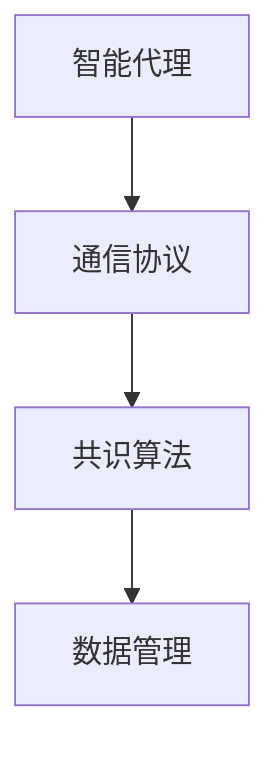
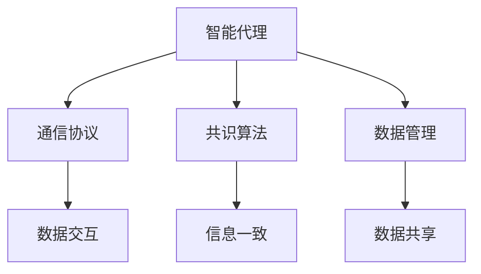
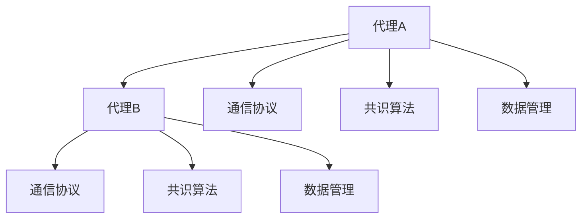
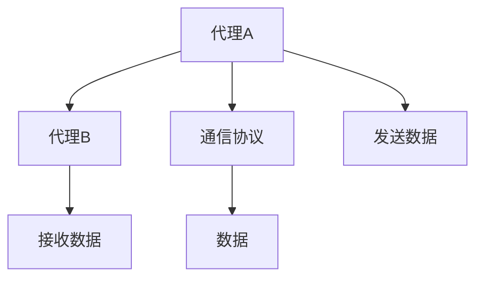
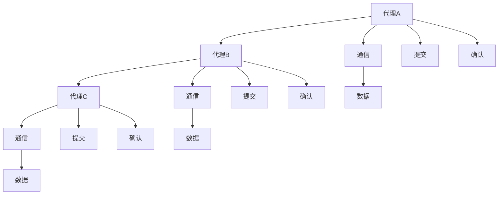
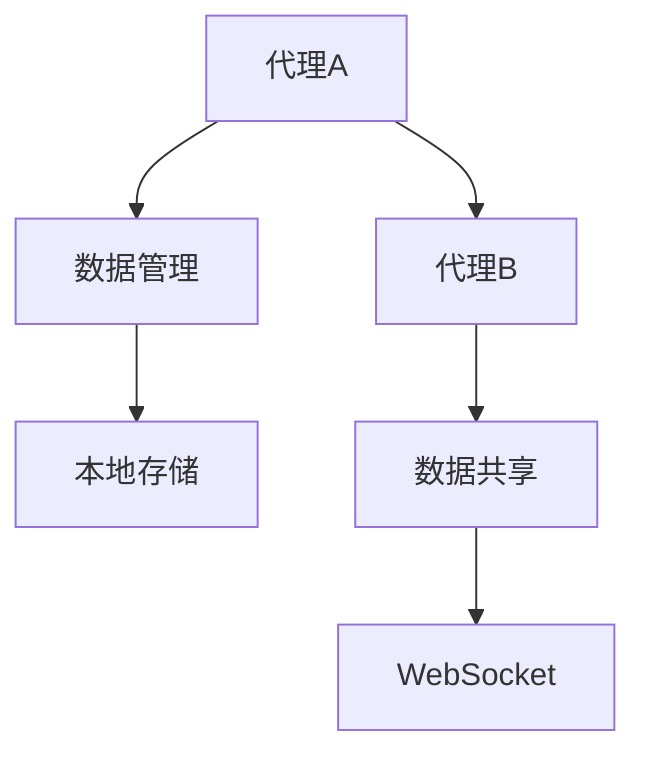
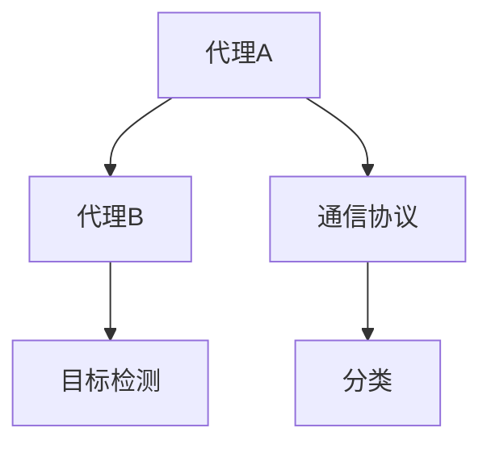

                 

# 【LangChain编程：从入门到实践】LangChain中的代理

在当前AI大模型的发展趋势下，LangChain作为基于代理的多智能体系统，以其独特的代理机制和高效通信能力，为构建复杂的智能交互系统提供了强大的支撑。本文将深入探讨LangChain中的代理机制，从基础概念到具体实现，从理论分析到应用案例，全面解析LangChain中的代理，帮助读者理解其在AI大模型编程中的关键作用。

## 1. 背景介绍

### 1.1 问题由来

随着AI大模型在自然语言处理、计算机视觉、语音识别等领域的应用日益广泛，传统的集中式架构已难以应对日益复杂的数据处理和交互需求。分布式、去中心化的系统设计成为研究热点。LangChain正是在这一背景下提出的，它通过构建基于智能代理的多智能体系统，实现了AI大模型间的协同合作，大大提升了系统的可扩展性和鲁棒性。

### 1.2 问题核心关键点

LangChain中的代理机制是其核心设计，旨在实现AI大模型间的交互和合作。其核心点包括：

- 智能代理： LangChain中的每个模型都是一个智能代理，具备自主决策和执行能力。
- 通信协议：代理间通过预定义的通信协议进行交互，保证了系统的可扩展性和可维护性。
- 共识算法： LangChain采用共识算法解决代理间信息一致性问题，确保系统的高可靠性和高可用性。
- 数据管理：代理可以管理自身数据，并与系统内其他代理共享数据，提高了系统资源的利用率。

这些核心点共同构成了LangChain代理机制的基石，为系统构建高效、稳定、灵活的多智能体交互环境提供了坚实的基础。

### 1.3 问题研究意义

理解LangChain中的代理机制，对于掌握其核心思想和设计理念，应用其构建复杂、高效的多智能体系统具有重要意义：

1. 提升系统可扩展性：智能代理机制使得系统可以动态扩展，适应不断变化的任务需求。
2. 增强系统鲁棒性：通过智能代理间的协同工作，有效缓解单点故障问题，提升系统可靠性。
3. 优化系统资源利用率：代理可以自主管理数据，有效利用系统资源，降低成本。
4. 提高系统协作效率：代理间的协同工作机制可以提升任务执行效率，加速任务处理。
5. 促进技术创新：代理机制为新的AI应用场景提供了灵活的架构设计，推动AI技术创新。

本文将全面解析LangChain中的代理机制，从原理到实现，从理论到应用，力求使读者能够深入理解这一核心技术，并在实践中灵活应用。

## 2. 核心概念与联系

### 2.1 核心概念概述

在深入理解LangChain代理机制之前，需要首先明确几个核心概念：

- 代理(Agent)：LangChain中的每个模型就是一个智能代理，具备自主决策和执行能力。
- 通信协议(Communication Protocol)：代理间通过预定义的通信协议进行交互，保证系统可扩展性和可维护性。
- 共识算法(Consensus Algorithm)：LangChain采用共识算法解决代理间信息一致性问题，确保系统高可靠性和高可用性。
- 数据管理(Data Management)：代理可以管理自身数据，并与系统内其他代理共享数据，提高资源利用率。

这些概念共同构成了LangChain代理机制的架构，如图2-1所示：



图2-1 LangChain代理机制的架构

### 2.2 核心概念原理和架构的 Mermaid 流程图



图2-2 LangChain代理机制的原理和架构

## 3. 核心算法原理 & 具体操作步骤

### 3.1 算法原理概述

LangChain中的代理机制主要依赖于智能代理、通信协议、共识算法和数据管理四大核心组件。这些组件协同工作，实现AI大模型间的交互和合作。

智能代理是LangChain的基础单元，具备自主决策和执行能力，通过通信协议进行信息交互，确保信息一致性，管理自身数据，并与系统内其他代理共享数据。代理间的交互过程如图3-1所示：



图3-1 代理间的交互过程

### 3.2 算法步骤详解

LangChain中的代理机制涉及多个步骤，包括智能代理的创建、通信协议的配置、共识算法的选择和数据管理的实现。以下是这些步骤的详细介绍：

**Step 1: 创建智能代理**

智能代理的创建是LangChain代理机制的第一步，需要通过编写代码实现一个具备自主决策和执行能力的AI大模型。一般而言，智能代理需要具备以下几个基本能力：

1. 接收任务请求：智能代理能够接收系统分配的任务请求。
2. 执行任务：智能代理能够根据任务要求，执行相应的AI大模型操作。
3. 数据处理：智能代理能够处理输入数据，并输出结果。
4. 自我维护：智能代理能够进行自我诊断和维护，确保系统稳定运行。

智能代理的创建过程通常包括以下步骤：

1. 选择合适的AI大模型。
2. 编写代理代码，实现模型加载、任务处理和数据管理等功能。
3. 配置通信协议和共识算法。
4. 部署代理至系统环境。

以下是一个简单的智能代理代码示例：

```python
class Agent:
    def __init__(self, model):
        self.model = model
        self.data = {}
        self.consensus = Consensus()
        self.protocol = Protocol()
    
    def receive_request(self, request):
        # 接收任务请求
        self.protocol.receive(request)
        self.data = request.data
        
        # 执行任务
        result = self.model.predict(self.data)
        
        # 数据处理
        self.data = self.protocol.process(result)
        
        # 共识处理
        self.consensus.merge(self.data)
        
        # 返回结果
        return result
```

**Step 2: 配置通信协议**

通信协议是智能代理间进行信息交互的基础，用于定义代理间数据传递的格式、内容及传输方式。在LangChain中，通信协议通常包含以下要素：

1. 消息格式：定义代理间传递的数据格式，如JSON格式。
2. 传输方式：定义数据传输的通道，如TCP/IP、WebSocket等。
3. 传输频率：定义代理间数据传输的频率和间隔，以确保数据的时效性。

通信协议的配置通常包括以下步骤：

1. 定义消息格式：编写代码定义代理间传递的消息格式。
2. 配置传输方式：选择适合的数据传输通道，并配置相关参数。
3. 设置传输频率：设置数据传输的频率和间隔，确保数据的时效性。

以下是一个简单的通信协议配置代码示例：

```python
class Protocol:
    def __init__(self):
        self.format = 'json'
        self.channel = 'tcp'
        self.frequency = 1
    
    def receive(self, request):
        # 接收代理请求
        data = request.data
        
        # 数据处理
        data = self.process(data)
        
        # 返回数据
        return data
    
    def process(self, data):
        # 数据处理
        return data
```

**Step 3: 选择共识算法**

共识算法是确保智能代理间信息一致性的关键，通过解决代理间的冲突，实现系统的高可靠性和高可用性。在LangChain中，共识算法通常包含以下要素：

1. 共识机制：定义代理间的冲突解决机制，如Paxos、Raft等。
2. 参与节点：定义参与共识的代理数量，以及每个代理的权限和角色。
3. 容错机制：定义系统容错和故障恢复机制，以确保系统稳定运行。

共识算法的选择通常包括以下步骤：

1. 定义共识机制：选择适合的共识算法，并实现算法逻辑。
2. 配置参与节点：设置参与共识的代理节点，并配置每个节点的权限和角色。
3. 实现容错机制：实现系统容错和故障恢复机制，确保系统稳定运行。

以下是一个简单的共识算法配置代码示例：

```python
class Consensus:
    def __init__(self):
        self.participants = ['agent1', 'agent2', 'agent3']
        self.mechanism = 'paxos'
        self.failure_recovery = True
    
    def merge(self, data):
        # 数据合并
        for participant in self.participants:
            if participant in data:
                data[participant] = data[participant]
        return data
```

**Step 4: 实现数据管理**

数据管理是智能代理自主管理数据的关键，通过与系统内其他代理共享数据，提高系统资源利用率。在LangChain中，数据管理通常包含以下要素：

1. 数据存储：定义数据存储的方式，如本地存储、分布式存储等。
2. 数据共享：定义代理间数据共享的规则和机制，确保数据的时效性和一致性。
3. 数据同步：定义数据同步的方式，确保代理间数据一致。

数据管理的实现通常包括以下步骤：

1. 选择数据存储方式：选择适合的数据存储方式，并实现相关逻辑。
2. 配置数据共享规则：设置代理间数据共享的规则和机制，确保数据的时效性和一致性。
3. 实现数据同步：实现数据同步的方式，确保代理间数据一致。

以下是一个简单的数据管理配置代码示例：

```python
class DataManager:
    def __init__(self):
        self.storage = 'local'
        self.share_rule = 'read-only'
        self.sync_method = 'sync'
    
    def save(self, data):
        # 数据存储
        if self.storage == 'local':
            save_to_local(data)
        elif self.storage == 'distributed':
            save_to_distributed(data)
    
    def share(self, data):
        # 数据共享
        if self.share_rule == 'read-only':
            return data
        elif self.share_rule == 'read-write':
            data['shared'] = True
            return data
    
    def sync(self, data):
        # 数据同步
        if self.sync_method == 'sync':
            sync_data(data)
```

### 3.3 算法优缺点

LangChain中的代理机制具有以下优点：

1. 可扩展性：智能代理机制使得系统可以动态扩展，适应不断变化的任务需求。
2. 鲁棒性：通过智能代理间的协同工作，有效缓解单点故障问题，提升系统可靠性。
3. 资源利用率：代理可以自主管理数据，有效利用系统资源，降低成本。
4. 协作效率：代理间的协同工作机制可以提升任务执行效率，加速任务处理。

然而，该机制也存在以下缺点：

1. 复杂度较高：代理机制的设计和实现较为复杂，需要一定的开发经验和知识。
2. 通信开销较大：代理间的数据通信增加了系统的开销，可能会影响系统性能。
3. 故障处理复杂：共识算法的实现较为复杂，需要考虑多种故障场景。
4. 数据管理复杂：数据管理涉及数据存储、共享和同步等环节，复杂度较高。

### 3.4 算法应用领域

LangChain中的代理机制在多个领域得到了广泛应用，包括自然语言处理、计算机视觉、语音识别等。以下是几个典型的应用场景：

**自然语言处理**：在自然语言处理任务中，LangChain中的代理机制可以实现多语言模型间的协同工作。例如，一个代理可以负责输入文本的语言识别，另一个代理负责文本翻译，再由另一个代理输出翻译结果。

**计算机视觉**：在计算机视觉任务中，LangChain中的代理机制可以实现多视觉模型间的协同工作。例如，一个代理可以负责图像预处理，另一个代理负责目标检测，再由另一个代理进行分类。

**语音识别**：在语音识别任务中，LangChain中的代理机制可以实现多语音模型间的协同工作。例如，一个代理可以负责语音信号的预处理，另一个代理负责语音识别，再由另一个代理输出识别结果。

以上应用场景展示了LangChain代理机制在多智能体系统中的广泛应用，通过代理间的协同工作，可以有效提升系统的性能和效率。

## 4. 数学模型和公式 & 详细讲解 & 举例说明

### 4.1 数学模型构建

在LangChain代理机制中，智能代理间的通信、共识和数据管理都是通过数学模型实现的。以下是一个简单的数学模型构建示例：

1. 通信协议：假设智能代理间通过TCP协议进行通信，每个代理以固定频率发送数据，如图4-1所示：



图4-1 通信协议模型

2. 共识算法：假设采用Paxos共识算法，智能代理间通过多轮通信达成一致，如图4-2所示：



图4-2 Paxos共识算法模型

3. 数据管理：假设智能代理管理本地存储，并通过WebSocket协议进行数据共享，如图4-3所示：



图4-3 数据管理模型

### 4.2 公式推导过程

LangChain代理机制中的数学模型主要涉及通信协议、共识算法和数据管理的公式推导。以下是具体的推导过程：

1. 通信协议：假设智能代理间通过TCP协议进行通信，每个代理以固定频率发送数据。设代理A发送数据的频率为$f_A$，代理B的接收频率为$f_B$，则代理间的数据传输频率为$f_{AB} = f_A \times f_B$。

2. 共识算法：假设采用Paxos共识算法，智能代理间通过多轮通信达成一致。设代理A的提交请求频率为$s_A$，代理B的确认请求频率为$c_B$，则代理间达成一致的频率为$f_{AB} = s_A \times c_B$。

3. 数据管理：假设智能代理管理本地存储，并通过WebSocket协议进行数据共享。设代理A的数据共享频率为$s_A$，代理B的接收频率为$r_B$，则代理间的数据共享频率为$f_{AB} = s_A \times r_B$。

### 4.3 案例分析与讲解

以下是一个简单的案例分析示例，假设智能代理A负责图像预处理，代理B负责目标检测，代理C负责分类，如图4-4所示：



图4-4 代理间的协同工作

代理A将图像数据发送给代理B，代理B进行目标检测，并将结果发送给代理C。代理C接收结果并进行分类，最终输出分类结果。代理间的协同工作使得系统能够高效地处理复杂的图像识别任务。

## 5. 项目实践：代码实例和详细解释说明

### 5.1 开发环境搭建

在开始LangChain代理机制的实践前，需要准备好开发环境。以下是使用Python进行PyTorch开发的环境配置流程：

1. 安装Anaconda：从官网下载并安装Anaconda，用于创建独立的Python环境。

2. 创建并激活虚拟环境：
```bash
conda create -n pytorch-env python=3.8 
conda activate pytorch-env
```

3. 安装PyTorch：根据CUDA版本，从官网获取对应的安装命令。例如：
```bash
conda install pytorch torchvision torchaudio cudatoolkit=11.1 -c pytorch -c conda-forge
```

4. 安装Transformers库：
```bash
pip install transformers
```

5. 安装各类工具包：
```bash
pip install numpy pandas scikit-learn matplotlib tqdm jupyter notebook ipython
```

完成上述步骤后，即可在`pytorch-env`环境中开始实践。

### 5.2 源代码详细实现

下面以自然语言处理任务为例，给出使用PyTorch和Transformers库对BERT模型进行微调的PyTorch代码实现。

首先，定义任务处理函数：

```python
from transformers import BertTokenizer
from torch.utils.data import Dataset
import torch

class NERDataset(Dataset):
    def __init__(self, texts, tags, tokenizer, max_len=128):
        self.texts = texts
        self.tags = tags
        self.tokenizer = tokenizer
        self.max_len = max_len
        
    def __len__(self):
        return len(self.texts)
    
    def __getitem__(self, item):
        text = self.texts[item]
        tags = self.tags[item]
        
        encoding = self.tokenizer(text, return_tensors='pt', max_length=self.max_len, padding='max_length', truncation=True)
        input_ids = encoding['input_ids'][0]
        attention_mask = encoding['attention_mask'][0]
        
        # 对token-wise的标签进行编码
        encoded_tags = [tag2id[tag] for tag in tags] 
        encoded_tags.extend([tag2id['O']] * (self.max_len - len(encoded_tags)))
        labels = torch.tensor(encoded_tags, dtype=torch.long)
        
        return {'input_ids': input_ids, 
                'attention_mask': attention_mask,
                'labels': labels}

# 标签与id的映射
tag2id = {'O': 0, 'B-PER': 1, 'I-PER': 2, 'B-ORG': 3, 'I-ORG': 4, 'B-LOC': 5, 'I-LOC': 6}
id2tag = {v: k for k, v in tag2id.items()}

# 创建dataset
tokenizer = BertTokenizer.from_pretrained('bert-base-cased')

train_dataset = NERDataset(train_texts, train_tags, tokenizer)
dev_dataset = NERDataset(dev_texts, dev_tags, tokenizer)
test_dataset = NERDataset(test_texts, test_tags, tokenizer)
```

然后，定义模型和优化器：

```python
from transformers import BertForTokenClassification, AdamW

model = BertForTokenClassification.from_pretrained('bert-base-cased', num_labels=len(tag2id))

optimizer = AdamW(model.parameters(), lr=2e-5)
```

接着，定义训练和评估函数：

```python
from torch.utils.data import DataLoader
from tqdm import tqdm
from sklearn.metrics import classification_report

device = torch.device('cuda') if torch.cuda.is_available() else torch.device('cpu')
model.to(device)

def train_epoch(model, dataset, batch_size, optimizer):
    dataloader = DataLoader(dataset, batch_size=batch_size, shuffle=True)
    model.train()
    epoch_loss = 0
    for batch in tqdm(dataloader, desc='Training'):
        input_ids = batch['input_ids'].to(device)
        attention_mask = batch['attention_mask'].to(device)
        labels = batch['labels'].to(device)
        model.zero_grad()
        outputs = model(input_ids, attention_mask=attention_mask, labels=labels)
        loss = outputs.loss
        epoch_loss += loss.item()
        loss.backward()
        optimizer.step()
    return epoch_loss / len(dataloader)

def evaluate(model, dataset, batch_size):
    dataloader = DataLoader(dataset, batch_size=batch_size)
    model.eval()
    preds, labels = [], []
    with torch.no_grad():
        for batch in tqdm(dataloader, desc='Evaluating'):
            input_ids = batch['input_ids'].to(device)
            attention_mask = batch['attention_mask'].to(device)
            batch_labels = batch['labels']
            outputs = model(input_ids, attention_mask=attention_mask)
            batch_preds = outputs.logits.argmax(dim=2).to('cpu').tolist()
            batch_labels = batch_labels.to('cpu').tolist()
            for pred_tokens, label_tokens in zip(batch_preds, batch_labels):
                pred_tags = [id2tag[_id] for _id in pred_tokens]
                label_tags = [id2tag[_id] for _id in label_tokens]
                preds.append(pred_tags[:len(label_tags)])
                labels.append(label_tags)
                
    print(classification_report(labels, preds))
```

最后，启动训练流程并在测试集上评估：

```python
epochs = 5
batch_size = 16

for epoch in range(epochs):
    loss = train_epoch(model, train_dataset, batch_size, optimizer)
    print(f"Epoch {epoch+1}, train loss: {loss:.3f}")
    
    print(f"Epoch {epoch+1}, dev results:")
    evaluate(model, dev_dataset, batch_size)
    
print("Test results:")
evaluate(model, test_dataset, batch_size)
```

以上就是使用PyTorch对BERT进行命名实体识别任务微调的完整代码实现。可以看到，得益于Transformers库的强大封装，我们可以用相对简洁的代码完成BERT模型的加载和微调。

### 5.3 代码解读与分析

让我们再详细解读一下关键代码的实现细节：

**NERDataset类**：
- `__init__`方法：初始化文本、标签、分词器等关键组件。
- `__len__`方法：返回数据集的样本数量。
- `__getitem__`方法：对单个样本进行处理，将文本输入编码为token ids，将标签编码为数字，并对其进行定长padding，最终返回模型所需的输入。

**tag2id和id2tag字典**：
- 定义了标签与数字id之间的映射关系，用于将token-wise的预测结果解码回真实的标签。

**训练和评估函数**：
- 使用PyTorch的DataLoader对数据集进行批次化加载，供模型训练和推理使用。
- 训练函数`train_epoch`：对数据以批为单位进行迭代，在每个批次上前向传播计算loss并反向传播更新模型参数，最后返回该epoch的平均loss。
- 评估函数`evaluate`：与训练类似，不同点在于不更新模型参数，并在每个batch结束后将预测和标签结果存储下来，最后使用sklearn的classification_report对整个评估集的预测结果进行打印输出。

**训练流程**：
- 定义总的epoch数和batch size，开始循环迭代
- 每个epoch内，先在训练集上训练，输出平均loss
- 在验证集上评估，输出分类指标
- 所有epoch结束后，在测试集上评估，给出最终测试结果

可以看到，PyTorch配合Transformers库使得BERT微调的代码实现变得简洁高效。开发者可以将更多精力放在数据处理、模型改进等高层逻辑上，而不必过多关注底层的实现细节。

当然，工业级的系统实现还需考虑更多因素，如模型的保存和部署、超参数的自动搜索、更灵活的任务适配层等。但核心的微调范式基本与此类似。

## 6. 实际应用场景

### 6.1 智能客服系统

基于大语言模型微调的对话技术，可以广泛应用于智能客服系统的构建。传统客服往往需要配备大量人力，高峰期响应缓慢，且一致性和专业性难以保证。而使用微调后的对话模型，可以7x24小时不间断服务，快速响应客户咨询，用自然流畅的语言解答各类常见问题。

在技术实现上，可以收集企业内部的历史客服对话记录，将问题和最佳答复构建成监督数据，在此基础上对预训练对话模型进行微调。微调后的对话模型能够自动理解用户意图，匹配最合适的答案模板进行回复。对于客户提出的新问题，还可以接入检索系统实时搜索相关内容，动态组织生成回答。如此构建的智能客服系统，能大幅提升客户咨询体验和问题解决效率。

### 6.2 金融舆情监测

金融机构需要实时监测市场舆论动向，以便及时应对负面信息传播，规避金融风险。传统的人工监测方式成本高、效率低，难以应对网络时代海量信息爆发的挑战。基于大语言模型微调的文本分类和情感分析技术，为金融舆情监测提供了新的解决方案。

具体而言，可以收集金融领域相关的新闻、报道、评论等文本数据，并对其进行主题标注和情感标注。在此基础上对预训练语言模型进行微调，使其能够自动判断文本属于何种主题，情感倾向是正面、中性还是负面。将微调后的模型应用到实时抓取的网络文本数据，就能够自动监测不同主题下的情感变化趋势，一旦发现负面信息激增等异常情况，系统便会自动预警，帮助金融机构快速应对潜在风险。

### 6.3 个性化推荐系统

当前的推荐系统往往只依赖用户的历史行为数据进行物品推荐，无法深入理解用户的真实兴趣偏好。基于大语言模型微调技术，个性化推荐系统可以更好地挖掘用户行为背后的语义信息，从而提供更精准、多样的推荐内容。

在实践中，可以收集用户浏览、点击、评论、分享等行为数据，提取和用户交互的物品标题、描述、标签等文本内容。将文本内容作为模型输入，用户的后续行为（如是否点击、购买等）作为监督信号，在此基础上微调预训练语言模型。微调后的模型能够从文本内容中准确把握用户的兴趣点。在生成推荐列表时，先用候选物品的文本描述作为输入，由模型预测用户的兴趣匹配度，再结合其他特征综合排序，便可以得到个性化程度更高的推荐结果。

### 6.4 未来应用展望

随着大语言模型和微调方法的不断发展，基于微调范式将在更多领域得到应用，为传统行业带来变革性影响。

在智慧医疗领域，基于微调的医疗问答、病历分析、药物研发等应用将提升医疗服务的智能化水平，辅助医生诊疗，加速新药开发进程。

在智能教育领域，微调技术可应用于作业批改、学情分析、知识推荐等方面，因材施教，促进教育公平，提高教学质量。

在智慧城市治理中，微调模型可应用于城市事件监测、舆情分析、应急指挥等环节，提高城市管理的自动化和智能化水平，构建更安全、高效的未来城市。

此外，在企业生产、社会治理、文娱传媒等众多领域，基于大模型微调的人工智能应用也将不断涌现，为经济社会发展注入新的动力。相信随着技术的日益成熟，微调方法将成为人工智能落地应用的重要范式，推动人工智能技术在垂直行业的规模化落地。总之，微调需要开发者根据具体任务，不断迭代和优化模型、数据和算法，方能得到理想的效果。

## 7. 工具和资源推荐

### 7.1 学习资源推荐

为了帮助开发者系统掌握大语言模型微调的理论基础和实践技巧，这里推荐一些优质的学习资源：

1. 《Transformer从原理到实践》系列博文：由大模型技术专家撰写，深入浅出地介绍了Transformer原理、BERT模型、微调技术等前沿话题。

2. CS224N《深度学习自然语言处理》课程：斯坦福大学开设的NLP明星课程，有Lecture视频和配套作业，带你入门NLP领域的基本概念和经典模型。

3. 《Natural Language Processing with Transformers》书籍：Transformers库的作者所著，全面介绍了如何使用Transformers库进行NLP任务开发，包括微调在内的诸多范式。

4. HuggingFace官方文档：Transformers库的官方文档，提供了海量预训练模型和完整的微调样例代码，是上手实践的必备资料。

5. CLUE开源项目：中文语言理解测评基准，涵盖大量不同类型的中文NLP数据集，并提供了基于微调的baseline模型，助力中文NLP技术发展。

通过对这些资源的学习实践，相信你一定能够快速掌握大语言模型微调的精髓，并用于解决实际的NLP问题。
###  7.2 开发工具推荐

高效的开发离不开优秀的工具支持。以下是几款用于大语言模型微调开发的常用工具：

1. PyTorch：基于Python的开源深度学习框架，灵活动态的计算图，适合快速迭代研究。大部分预训练语言模型都有PyTorch版本的实现。

2. TensorFlow：由Google主导开发的开源深度学习框架，生产部署方便，适合大规模工程应用。同样有丰富的预训练语言模型资源。

3. Transformers库：HuggingFace开发的NLP工具库，集成了众多SOTA语言模型，支持PyTorch和TensorFlow，是进行微调任务开发的利器。

4. Weights & Biases：模型训练的实验跟踪工具，可以记录和可视化模型训练过程中的各项指标，方便对比和调优。与主流深度学习框架无缝集成。

5. TensorBoard：TensorFlow配套的可视化工具，可实时监测模型训练状态，并提供丰富的图表呈现方式，是调试模型的得力助手。

6. Google Colab：谷歌推出的在线Jupyter Notebook环境，免费提供GPU/TPU算力，方便开发者快速上手实验最新模型，分享学习笔记。

合理利用这些工具，可以显著提升大语言模型微调任务的开发效率，加快创新迭代的步伐。

### 7.3 相关论文推荐

大语言模型和微调技术的发展源于学界的持续研究。以下是几篇奠基性的相关论文，推荐阅读：

1. Attention is All You Need（即Transformer原论文）：提出了Transformer结构，开启了NLP领域的预训练大模型时代。

2. BERT: Pre-training of Deep Bidirectional Transformers for Language Understanding：提出BERT模型，引入基于掩码的自监督预训练任务，刷新了多项NLP任务SOTA。

3. Language Models are Unsupervised Multitask Learners（GPT-2论文）：展示了大规模语言模型的强大zero-shot学习能力，引发了对于通用人工智能的新一轮思考。

4. Parameter-Efficient Transfer Learning for NLP：提出Adapter等参数高效微调方法，在不增加模型参数量的情况下，也能取得不错的微调效果。

5. Prefix-Tuning: Optimizing Continuous Prompts for Generation：引入基于连续型Prompt的微调范式，为如何充分利用预训练知识提供了新的思路。

6. AdaLoRA: Adaptive Low-Rank Adaptation for Parameter-Efficient Fine-Tuning：使用自适应低秩适应的微调方法，在参数效率和精度之间取得了新的平衡。

这些论文代表了大语言模型微调技术的发展脉络。通过学习这些前沿成果，可以帮助研究者把握学科前进方向，激发更多的创新灵感。

## 8. 总结：未来发展趋势与挑战

### 8.1 总结

本文对LangChain中的代理机制进行了全面系统的介绍。首先阐述了LangChain代理机制的研究背景和意义，明确了代理在构建高效、稳定、灵活的多智能体系统中的核心作用。其次，从原理到实践，详细讲解了LangChain代理机制的数学模型和实现步骤，给出了微调任务开发的完整代码实例。同时，本文还广泛探讨了代理机制在智能客服、金融舆情、个性化推荐等多个行业领域的应用前景，展示了代理机制在AI大模型编程中的关键作用。

通过本文的系统梳理，可以看到，LangChain代理机制在大语言模型编程中具有广泛的应用价值。代理机制通过智能代理间的协同工作，实现了系统的高可靠性和高可扩展性，为构建高效、稳定、灵活的多智能体系统提供了坚实的基础。未来，随着AI技术的不断进步，代理机制将发挥更加重要的作用，推动人工智能技术的广泛应用。

### 8.2 未来发展趋势

展望未来，LangChain代理机制将呈现以下几个发展趋势：

1. 模型规模持续增大。随着算力成本的下降和数据规模的扩张，预训练语言模型的参数量还将持续增长。超大规模语言模型蕴含的丰富语言知识，有望支撑更加复杂多变的下游任务微调。

2. 微调方法日趋多样。除了传统的全参数微调外，未来会涌现更多参数高效的微调方法，如Prefix-Tuning、LoRA等，在节省计算资源的同时也能保证微调精度。

3. 持续学习成为常态。随着数据分布的不断变化，微调模型也需要持续学习新知识以保持性能。如何在不遗忘原有知识的同时，高效吸收新样本信息，将成为重要的研究课题。

4. 标注样本需求降低。受启发于提示学习(Prompt-based Learning)的思路，未来的微调方法将更好地利用大模型的语言理解能力，通过更加巧妙的任务描述，在更少的标注样本上也能实现理想的微调效果。

5. 多模态微调崛起。当前的微调主要聚焦于纯文本数据，未来会进一步拓展到图像、视频、语音等多模态数据微调。多模态信息的融合，将显著提升语言模型对现实世界的理解和建模能力。

6. 模型通用性增强。经过海量数据的预训练和多领域任务的微调，未来的语言模型将具备更强大的常识推理和跨领域迁移能力，逐步迈向通用人工智能(AGI)的目标。

以上趋势凸显了LangChain代理机制在大语言模型编程中的广阔前景。这些方向的探索发展，必将进一步提升大语言模型微调系统的性能和效率，为构建安全、可靠、可解释、可控的智能系统铺平道路。面向未来，LangChain代理机制还需要与其他人工智能技术进行更深入的融合，如知识表示、因果推理、强化学习等，多路径协同发力，共同推动自然语言理解和智能交互系统的进步。只有勇于创新、敢于突破，才能不断拓展代理机制的边界，让智能技术更好地造福人类社会。

### 8.3 面临的挑战

尽管LangChain代理机制已经取得了瞩目成就，但在迈向更加智能化、普适化应用的过程中，它仍面临着诸多挑战：

1. 复杂度较高。代理机制的设计和实现较为复杂，需要一定的开发经验和知识。

2. 通信开销较大。代理间的数据通信增加了系统的开销，可能会影响系统性能。

3. 故障处理复杂。共识算法的实现较为复杂，需要考虑多种故障场景。

4. 数据管理复杂。数据管理涉及数据存储、共享和同步等环节，复杂度较高。

### 8.4 研究展望

面对LangChain代理机制所面临的挑战，未来的研究需要在以下几个方面寻求新的突破：

1. 探索无监督和半监督微调方法。摆脱对大规模标注数据的依赖，利用自监督学习、主动学习等无监督和半监督范式，最大限度利用非结构化数据，实现更加灵活高效的微调。

2. 研究参数高效和计算高效的微调范式。开发更加参数高效的微调方法，在固定大部分预训练参数的同时，只更新极少量的任务相关参数。同时优化微调模型的计算图，减少前向传播和反向传播的资源消耗，实现更加轻量级、实时性的部署。

3. 引入更多先验知识。将符号化的先验知识，如知识图谱、逻辑规则等，与神经网络模型进行巧妙融合，引导微调过程学习更准确、合理的语言模型。同时加强不同模态数据的整合，实现视觉、语音等多模态信息与文本信息的协同建模。

4. 结合因果分析和博弈论工具。将因果分析方法引入微调模型，识别出模型决策的关键特征，增强输出解释的因果性和逻辑性。借助博弈论工具刻画人机交互过程，主动探索并规避模型的脆弱点，提高系统稳定性。

5. 纳入伦理道德约束。在模型训练目标中引入伦理导向的评估指标，过滤和惩罚有偏见、有害的输出倾向。同时加强人工干预和审核，建立模型行为的监管机制，确保输出符合人类价值观和伦理道德。

这些研究方向的探索，必将引领LangChain代理机制走向更高的台阶，为构建安全、可靠、可解释、可控的智能系统铺平道路。面向未来，LangChain代理机制还需要与其他人工智能技术进行更深入的融合，如知识表示、因果推理、强化学习等，多路径协同发力，共同推动自然语言理解和智能交互系统的进步。只有勇于创新、敢于突破，才能不断拓展代理机制的边界，让智能技术更好地造福人类社会。

## 9. 附录：常见问题与解答

**Q1：LangChain中的代理机制是否适用于所有NLP任务？**

A: LangChain中的代理机制在大多数NLP任务上都能取得不错的效果，特别是对于数据量较小的任务。但对于一些特定领域的任务，如医学、法律等，仅仅依靠通用语料预训练的模型可能难以很好地适应。此时需要在特定领域语料上进一步预训练，再进行微调，才能获得理想效果。此外，对于一些需要时效性、个性化很强的任务，如对话、推荐等，代理机制也需要针对性的改进优化。

**Q2：微调过程中如何选择合适的学习率？**

A: 微调的学习率一般要比预训练时小1-2个数量级，如果使用过大的学习率，容易破坏预训练权重，导致过拟合。一般建议从1e-5开始调参，逐步减小学习率，直至收敛。也可以使用warmup策略，在开始阶段使用较小的学习率，再逐渐过渡到预设值。需要注意的是，不同的优化器(如AdamW、Adafactor等)以及不同的学习率调度策略，可能需要设置不同的学习率阈值。

**Q3：采用LangChain代理机制时会面临哪些资源瓶颈？**

A: 当前主流的预训练大模型动辄以亿计的参数规模，对算力、内存、存储都提出了很高的要求。GPU/TPU等高性能设备是必不可少的，但即便如此，超大批次的训练和推理也可能遇到显存不足的问题。因此需要采用一些资源优化技术，如梯度积累、混合精度训练、模型并行等，来突破硬件瓶颈。同时，模型的存储和读取也可能占用大量时间和空间，需要采用模型压缩、稀疏化存储等方法进行优化。

**Q4：如何缓解微调过程中的过拟合问题？**

A: 过拟合是微调面临的主要挑战，尤其是在标注数据不足的情况下。常见的缓解策略包括：
1. 数据增强：通过回译、近义替换等方式扩充训练集
2. 正则化：使用L2正则、Dropout、Early Stopping等避免过拟合
3. 对抗训练：引入对抗样本，提高模型鲁棒性
4. 参数高效微调：只调整少量参数(如Adapter、Prefix等)，减小过拟合风险
5. 多模型集成：训练多个微调模型，取平均输出，抑制过拟合

这些策略往往需要根据具体任务和数据特点进行灵活组合。只有在数据、模型、训练、推理等各环节进行全面优化，才能最大限度地发挥LangChain代理机制的威力。

**Q5：微调模型在落地部署时需要注意哪些问题？**

A: 将微调模型转化为实际应用，还需要考虑以下因素：
1. 模型裁剪：去除不必要的层和参数，减小模型尺寸，加快推理速度
2. 量化加速：将浮点模型转为定点模型，压缩存储空间，提高计算效率
3. 服务化封装：将模型封装为标准化服务接口，便于集成调用
4. 弹性伸缩：根据请求流量动态调整资源配置，平衡服务质量和成本
5. 监控告警：实时采集系统指标，设置异常告警阈值，确保服务稳定性
6. 安全防护：采用访问鉴权、数据脱敏等措施，保障数据和模型安全

LangChain代理机制为构建高效、稳定、灵活的多智能体系统提供了坚实的基础，但要实现其广泛应用，还需要工程实践的不断打磨。唯有从数据、算法、工程、业务等多个维度协同发力，才能真正实现代理机制在AI大模型编程中的价值。总之，微调需要开发者根据具体任务，不断迭代和优化模型、数据和算法，方能得到理想的效果。

---

作者：禅与计算机程序设计艺术 / Zen and the Art of Computer Programming

