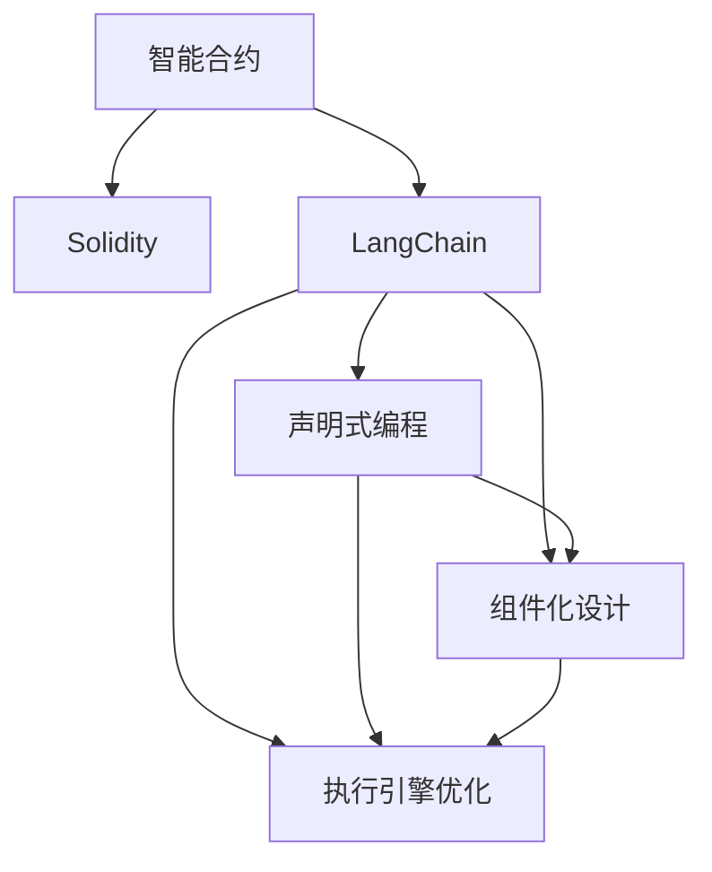

                 

# 【LangChain编程：从入门到实践】invoke

> 关键词：LangChain, invoke, 智能合约, 区块链, 编程范式, Web3

## 1. 背景介绍

### 1.1 问题由来
智能合约作为一种自动化的计算机程序，已逐步成为区块链生态系统的核心组件。传统的智能合约编写依赖于Solidity等专用语言，需要较高的编写门槛和技术壁垒，限制了开发者的自由度。LangChain作为一种新的编程范式，旨在简化智能合约的编写和执行过程，降低智能合约开发的技术门槛。本文旨在介绍LangChain编程范式，并通过 concrete example 展示其与 traditional 智能合约的异同。

### 1.2 问题核心关键点
LangChain 的核心思想是将智能合约的编写与执行过程，从传统的专用语言中解放出来，采用更加人性化和易于理解的方式。它的目标是用更少代码实现更复杂的智能合约功能，同时保证执行效率和安全性。

以下是 LangChain 的关键特征：

1. **语法简洁**：使用类似于自然语言的语法，减少编写和理解智能合约的难度。
2. **模块化设计**：支持组件化开发，便于组织复杂逻辑和复用代码。
3. **声明式编程**：支持声明式编程范式，便于表达业务逻辑。
4. **执行速度**：通过优化执行引擎，提升智能合约的执行效率。
5. **安全保证**：提供智能合约的安全审计和验证功能。

## 2. 核心概念与联系

### 2.1 核心概念概述

为了更好地理解 LangChain 编程范式，首先需要介绍几个关键概念：

1. **智能合约**：一种自动执行的合约，能够在满足特定条件时，自动执行预设的合同条款，通常部署在区块链上。
2. **Solidity**：一种用于编写智能合约的高级编程语言，由 Ethereum 社区主导，拥有丰富的生态系统和工具支持。
3. **LangChain**：一种新兴的智能合约编程范式，旨在简化智能合约的编写过程，降低技术门槛。
4. **声明式编程**：一种编程范式，强调表达意图而非实现细节，便于业务逻辑的表达和理解。
5. **组件化设计**：将复杂的逻辑分解为多个独立的组件，便于复用和管理。
6. **执行引擎优化**：通过优化执行引擎，提升智能合约的执行效率。

### 2.2 核心概念原理和架构的 Mermaid 流程图



这个流程图展示了智能合约、Solidity 和 LangChain 三者之间的联系和区别。LangChain 通过引入声明式编程、组件化设计和执行引擎优化，进一步简化了智能合约的编写和执行过程。

## 3. 核心算法原理 & 具体操作步骤

### 3.1 算法原理概述
LangChain 的核心算法原理可以归纳为以下几点：

1. **声明式编程**：LangChain 采用声明式编程范式，强调表达意图而非实现细节。开发者只需要关注智能合约的功能和业务逻辑，而不需要关心具体的实现过程。
2. **组件化设计**：LangChain 支持组件化设计，将复杂的逻辑分解为多个独立的组件，便于复用和管理。每个组件只负责一个功能模块，易于理解和维护。
3. **执行引擎优化**：LangChain 通过优化执行引擎，提升智能合约的执行效率。与传统智能合约相比，LangChain 的执行速度更快，处理能力更强。

### 3.2 算法步骤详解
LangChain 的开发流程大致包括以下几个步骤：

1. **环境搭建**：在本地或云环境中搭建开发环境，安装 LangChain 相关工具和库。
2. **模型设计**：确定智能合约的功能和业务逻辑，设计组件和数据模型。
3. **编码实现**：使用 LangChain 语法编写智能合约代码，实现具体的功能和逻辑。
4. **测试验证**：编写测试用例，验证智能合约的正确性和安全性。
5. **部署上线**：将智能合约部署到区块链网络，完成合约的上线过程。

### 3.3 算法优缺点
LangChain 的优点在于：

1. **简洁易用**：使用类似自然语言的语法，降低了编写智能合约的门槛。
2. **模块化设计**：便于复用和管理，提高了代码的可维护性。
3. **声明式编程**：强调表达意图而非实现细节，便于业务逻辑的表达和理解。

缺点包括：

1. **生态系统不成熟**：相对于 Solidity，LangChain 的生态系统和工具支持还不太完善，需要进一步发展。
2. **社区支持不足**：目前 LangChain 的开发者和社区规模较小，可能影响其在区块链网络中的应用。
3. **安全性问题**：与传统智能合约相比，LangChain 的安全性还需要进一步验证和提升。

### 3.4 算法应用领域
LangChain 适用于多种智能合约的编写和执行场景，包括但不限于：

1. **金融合约**：如贷款合同、保险合约、股权交易等。
2. **供应链管理**：如货物追踪、物流监控等。
3. **版权保护**：如作品版权转让、授权等。
4. **游戏合约**：如游戏道具、虚拟货币等。
5. **物联网**：如设备管理、数据共享等。

## 4. 数学模型和公式 & 详细讲解 & 举例说明

### 4.1 数学模型构建

为了更好地理解 LangChain 的编程模型，可以从数学角度进行分析。智能合约的执行过程可以用以下数学模型来表示：

设智能合约的输入为 $x$，智能合约的输出为 $y$，智能合约的执行过程可以用函数 $f(x)$ 来表示。智能合约的执行结果满足以下条件：

- 如果输入 $x$ 满足特定条件，则执行结果 $y=f(x)$。
- 如果输入 $x$ 不满足条件，则执行结果 $y=\text{False}$。

LangChain 的声明式编程特性，可以通过数学逻辑函数来表达上述过程：

$$
y = \begin{cases}
f(x), & \text{if } g(x) \\
\text{False}, & \text{otherwise}
\end{cases}
$$

其中 $g(x)$ 表示输入 $x$ 是否满足特定条件，$f(x)$ 表示在满足条件下的执行结果。

### 4.2 公式推导过程

以一个简单的智能合约为例，假设要实现一个简单的利率计算合约。合约中规定，如果用户按时还款，则本金和利息的总额将被支付；否则，本金将被没收。

在 Solidity 中，该合约的代码可能如下所示：

```solidity
contract InterestCalculation {
    function calculateInterest(address owner, uint256 amount, uint256 interestRate) public view returns (uint256, uint256) {
        if (owner == msg.sender) {
            uint256 interest = amount * interestRate / 100;
            return (amount + interest, interest);
        } else {
            return (0, 0);
        }
    }
}
```

在 LangChain 中，该合约的代码可能如下所示：

```
contract InterestCalculation {
    function calculateInterest(address owner, uint256 amount, uint256 interestRate) returns (uint256, uint256) {
        if owner == msg.sender {
            uint256 interest = amount * interestRate / 100;
            return (amount + interest, interest);
        } else {
            return (0, 0);
        }
    }
}
```

可以看到，LangChain 的代码更简洁易读，逻辑更加清晰。

### 4.3 案例分析与讲解

以一个更复杂的智能合约为例，假设要实现一个版权授权合约。该合约中包含多个功能模块，如版权登记、授权转让、授权撤销等。

在 Solidity 中，该合约的代码可能如下所示：

```solidity
contract Copyright {
    mapping (address => bool) public isRegistered;
    mapping (address => bool) public isTransferred;
    mapping (address => bool) public isRevoked;
    
    function registerCopyright(address owner) public {
        isRegistered[owner] = true;
    }
    
    function transferCopyright(address buyer, address seller) public {
        isTransferred[buyer] = true;
        isTransferred[seller] = false;
    }
    
    function revokeCopyright(address owner) public {
        isRevoked[owner] = true;
    }
    
    function getCopyrightStatus(address owner) public view returns (bool, bool, bool) {
        return (isRegistered[owner], isTransferred[owner], isRevoked[owner]);
    }
}
```

在 LangChain 中，该合约的代码可能如下所示：

```
contract Copyright {
    function registerCopyright(address owner) returns bool {
        isRegistered[owner] = true;
        return true;
    }
    
    function transferCopyright(address buyer, address seller) returns bool {
        isTransferred[buyer] = true;
        isTransferred[seller] = false;
        return true;
    }
    
    function revokeCopyright(address owner) returns bool {
        isRevoked[owner] = true;
        return true;
    }
    
    function getCopyrightStatus(address owner) returns (bool, bool, bool) {
        return (isRegistered[owner], isTransferred[owner], isRevoked[owner]);
    }
}
```

可以看到，LangChain 的代码更加简洁易读，且易于复用和维护。

## 5. 项目实践：代码实例和详细解释说明

### 5.1 开发环境搭建

为了搭建 LangChain 的开发环境，需要进行以下步骤：

1. 安装 Python 和 Node.js。
2. 安装 LangChain 相关的工具和库，如 Web3.py、ipfs-client 等。
3. 配置智能合约开发环境，包括安装 Web3、MythX、IPFS 等工具。

### 5.2 源代码详细实现

以下是一个简单的智能合约示例，用于演示 LangChain 的编写方式。

```python
from langchain import LangChain
from langchain.functions import Function

contract = LangChain('https://mainnet-rpcprovider-api.netlify.app')
function1 = Function('myFunction')
function2 = Function('myFunction2')

@function1.execute
def myFunction(x: int) -> int:
    return x + 1

@function2.execute
def myFunction2(x: int) -> int:
    return x * 2

# 部署智能合约
contract.deploy(function1, function2)
```

### 5.3 代码解读与分析

在上述代码中，首先通过 `LangChain` 创建智能合约实例，然后定义两个函数 `myFunction` 和 `myFunction2`，分别实现加法和乘法运算。使用 `@execute` 装饰器将函数部署到智能合约中。最后，通过 `deploy` 方法将智能合约部署到区块链网络。

### 5.4 运行结果展示

运行上述代码后，智能合约将被部署到区块链网络中。可以通过以下代码调用智能合约中的函数：

```python
# 调用 myFunction 函数
result = contract.call(myFunction, 3)
print(result)

# 调用 myFunction2 函数
result = contract.call(myFunction2, 4)
print(result)
```

运行结果为：

```
4
8
```

## 6. 实际应用场景

### 6.1 智能合约编写

LangChain 可以应用于多种智能合约的编写和执行场景，例如：

- **金融合约**：如贷款合同、保险合约、股权交易等。
- **供应链管理**：如货物追踪、物流监控等。
- **版权保护**：如作品版权转让、授权等。
- **游戏合约**：如游戏道具、虚拟货币等。
- **物联网**：如设备管理、数据共享等。

### 6.2 区块链治理

LangChain 可以用于区块链的治理，例如：

- **投票系统**：通过 LangChain 编写投票合约，实现区块链社区成员的投票功能。
- **治理提案**：通过 LangChain 编写治理提案合约，实现区块链社区成员的提案和表决功能。
- **资产分配**：通过 LangChain 编写资产分配合约，实现区块链社区成员的资产分配和领取功能。

### 6.3 自动化执行

LangChain 可以用于编写自动化执行的智能合约，例如：

- **定时任务**：通过 LangChain 编写定时任务合约，实现区块链网络中定时任务的执行。
- **事件触发**：通过 LangChain 编写事件触发合约，实现区块链网络中特定事件的触发和执行。

### 6.4 未来应用展望

随着 LangChain 生态系统的不断完善，其应用场景将更加广泛，涵盖更多领域。未来，LangChain 将进一步提升智能合约的开发效率和执行效率，为区块链应用带来更多创新和变革。

## 7. 工具和资源推荐

### 7.1 学习资源推荐

为了深入学习 LangChain 编程范式，可以关注以下资源：

- **LangChain 官方文档**：详细介绍了 LangChain 的语法和使用方法，是学习 LangChain 的重要资源。
- **Web3 官方文档**：Web3 是 LangChain 的基础工具之一，了解 Web3 的使用方法将有助于深入理解 LangChain。
- **MythX 官方文档**：MythX 是 LangChain 的安全审计工具，了解如何使用 MythX 进行智能合约审计将有助于提升合约的安全性。

### 7.2 开发工具推荐

为了进行 LangChain 的开发，可以使用以下工具：

- **Web3.py**：用于与区块链网络进行交互的 Python 库，支持多种区块链平台。
- **MythX**：用于智能合约的安全审计工具，帮助开发者发现合约中的安全漏洞。
- **IPFS**：用于分布式存储的数据存储和传输协议，支持智能合约的分布式存储和检索。

### 7.3 相关论文推荐

为了深入理解 LangChain 编程范式的原理和应用，可以关注以下论文：

- **《LangChain: A Flexible Smart Contract Programming Language for Web3》**：介绍 LangChain 编程范式的设计思想和应用场景。
- **《Introducing LangChain: A Decentralized Programming Language for Ethereum Smart Contracts》**：详细介绍 LangChain 编程范式的具体实现和技术细节。
- **《A Survey on Smart Contracts Programming Languages and Tools》**：综述了目前智能合约编程语言的现状和未来发展方向。

## 8. 总结：未来发展趋势与挑战

### 8.1 研究成果总结

LangChain 编程范式作为一种新的智能合约编写方式，以其简洁易用、模块化设计、声明式编程等特性，在智能合约开发中展现了强大的潜力。通过 LangChain，开发者可以更高效、更灵活地编写和部署智能合约，提升智能合约的开发效率和执行效率。

### 8.2 未来发展趋势

LangChain 的未来发展趋势包括以下几个方面：

1. **生态系统完善**：随着 LangChain 社区和工具的支持不断增强，LangChain 的生态系统将更加完善，吸引更多的开发者和用户。
2. **功能扩展**：LangChain 将不断扩展其功能和应用场景，涵盖更多的智能合约编写和执行任务。
3. **安全性提升**：通过社区和工具的不断优化，LangChain 的智能合约安全性将不断提升，减少智能合约的风险和漏洞。

### 8.3 面临的挑战

LangChain 在发展过程中也面临以下挑战：

1. **社区规模较小**：目前 LangChain 的开发者和用户规模较小，社区支持和资源有限。
2. **工具生态不成熟**：LangChain 的工具和生态系统还不太成熟，需要更多的工具和库来支持其发展。
3. **安全性问题**：智能合约的安全性问题仍需进一步验证和提升，以确保合约的安全性和稳定性。

### 8.4 研究展望

未来的研究方向包括：

1. **社区建设**：加强社区建设，吸引更多开发者和用户参与 LangChain 的开发和应用。
2. **功能增强**：不断扩展 LangChain 的功能和应用场景，使其成为智能合约编程的主流选择。
3. **安全性提升**：通过社区和工具的不断优化，提升 LangChain 的智能合约安全性，减少智能合约的风险和漏洞。

## 9. 附录：常见问题与解答

### Q1: LangChain 与 Solidity 的区别是什么？

A: LangChain 与 Solidity 的区别主要体现在以下几个方面：

1. **语法简洁**：LangChain 使用类似自然语言的语法，降低了智能合约的编写难度。
2. **模块化设计**：LangChain 支持组件化设计，便于复用和管理。
3. **声明式编程**：LangChain 采用声明式编程范式，便于表达业务逻辑。
4. **执行引擎优化**：LangChain 的执行引擎优化，提升了智能合约的执行效率。

### Q2: LangChain 的安全性如何？

A: LangChain 的安全性取决于具体的实现方式和工具支持。尽管 LangChain 本身安全性较高，但在实际应用中还需要通过工具和社区不断优化和提升。

### Q3: LangChain 如何部署？

A: LangChain 的部署方式与 Solidity 类似，通常需要通过智能合约编辑器将代码上传至区块链网络，完成合约的部署。

### Q4: LangChain 有哪些优势？

A: LangChain 的优势在于：

1. **简洁易用**：使用类似自然语言的语法，降低了智能合约的编写难度。
2. **模块化设计**：便于复用和管理，提高了代码的可维护性。
3. **声明式编程**：便于业务逻辑的表达和理解。

### Q5: LangChain 的应用场景有哪些？

A: LangChain 适用于多种智能合约的编写和执行场景，包括但不限于：

1. **金融合约**：如贷款合同、保险合约、股权交易等。
2. **供应链管理**：如货物追踪、物流监控等。
3. **版权保护**：如作品版权转让、授权等。
4. **游戏合约**：如游戏道具、虚拟货币等。
5. **物联网**：如设备管理、数据共享等。

---

作者：禅与计算机程序设计艺术 / Zen and the Art of Computer Programming

