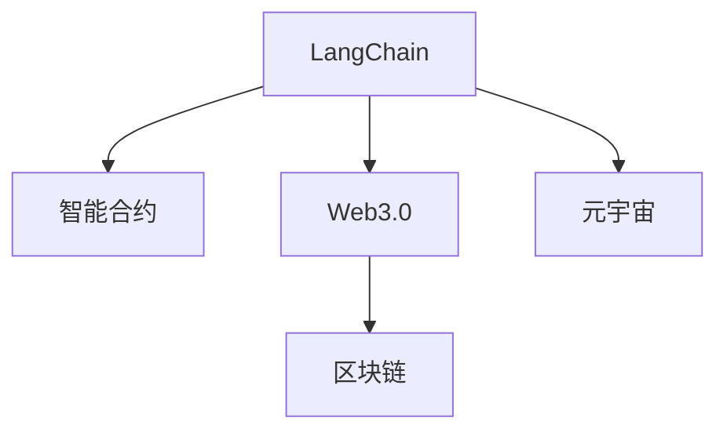

                 

# 【LangChain编程：从入门到实践】参与社区活动

> 关键词：LangChain, 区块链技术, 智能合约, Web3.0, 元宇宙

## 1. 背景介绍

### 1.1 问题由来
随着Web3.0和区块链技术的迅速发展，语义通信和基于智能合约的自动化操作成为一种趋势。在Web3.0和区块链技术中，用户之间的交互不再是简单的数据传输，而是通过智能合约实现复杂的业务逻辑处理和自动执行。但现有的智能合约语言（如Solidity）存在可读性差、开发难度大等问题。

基于此，LangChain项目应运而生。LangChain是一个基于区块链的编程语言，旨在提高智能合约的可读性和开发效率。它不仅支持现有的智能合约语言，如Solidity，还支持直接使用类似JavaScript的语法编写智能合约。

### 1.2 问题核心关键点
LangChain的核心在于其能够将JavaScript的简洁和易读性引入智能合约，提高开发效率和代码的可维护性。其架构和运行机制可以概括为以下几个关键点：
- **语义通信**：通过智能合约将业务逻辑直接映射为JavaScript代码，提高语义理解能力。
- **跨链互操作**：支持跨多个区块链平台，实现不同链间的互操作。
- **编程范式**：采用Web3.0的编程范式，包括模块化、面向对象、函数式等。
- **开发工具**：提供可视化的开发工具，方便用户编写和调试智能合约。

## 2. 核心概念与联系

### 2.1 核心概念概述

为更好地理解LangChain的核心概念，本节将介绍几个关键概念：

- **LangChain**：基于区块链的编程语言，支持JavaScript语法编写智能合约。
- **智能合约**：基于区块链技术，由代码编写的自动化合约，用于执行特定业务逻辑。
- **Web3.0**：基于区块链技术的第三代互联网，强调去中心化、开放和协同。
- **元宇宙**：基于Web3.0技术的虚拟世界，强调交互、沉浸式体验和虚拟资产。

### 2.2 核心概念原理和架构的 Mermaid 流程图



这个流程图展示了LangChain与其他概念之间的联系。LangChain基于Web3.0的编程范式，使用JavaScript编写智能合约，而智能合约的执行依赖于区块链平台。在元宇宙中，LangChain可以帮助实现虚拟世界的自动化操作和交互。

## 3. 核心算法原理 & 具体操作步骤

### 3.1 算法原理概述

LangChain的核心算法原理主要包括智能合约的编写、编译和执行。

**编写智能合约**：用户使用JavaScript语法编写智能合约，其中可以包含业务逻辑、条件语句、函数调用等。

**编译智能合约**：编写完成后，使用LangChain的编译器将JavaScript代码编译为目标区块链平台的智能合约代码。

**执行智能合约**：将编译后的智能合约代码部署到目标区块链平台上，并进行自动化执行。

### 3.2 算法步骤详解

以下是LangChain智能合约编写的详细步骤：

**Step 1: 编写智能合约**
```javascript
// 定义合约
class MyContract {
  constructor() {}

  // 业务逻辑函数
  doSomething(input) {
    // 处理输入数据
    let result = input.toUpperCase();

    // 返回结果
    return result;
  }
}

// 实例化合约
let myContract = new MyContract();
```

**Step 2: 编译智能合约**
```bash
# 编译智能合约
langchain-compiler myContract.js -o myContract.sol
```

**Step 3: 执行智能合约**
```bash
# 部署智能合约
langchain-deploy myContract.sol -p myContract -v "0x1234567890"

# 调用智能合约
langchain-call myContract.doSomething "Hello, LangChain!"
```

### 3.3 算法优缺点

LangChain的优点在于：
- **易读性高**：JavaScript语法简洁易懂，降低了开发难度。
- **跨链互操作**：支持跨多个区块链平台，实现不同链间的互操作。
- **可扩展性强**：支持复杂的业务逻辑处理，适用于各种应用场景。

缺点在于：
- **安全风险**：虽然JavaScript语法简洁易懂，但部分安全机制需要用户手动编写，存在一定的安全风险。
- **兼容性问题**：由于智能合约在不同区块链平台上的语法差异，存在一定的兼容性问题。

### 3.4 算法应用领域

LangChain的应用领域包括但不限于：
- **智能合约开发**：适用于各种Web3.0应用，如DeFi、NFT、供应链管理等。
- **元宇宙开发**：支持虚拟世界的自动化操作和交互，实现虚拟资产的管理和交易。
- **区块链技术研究**：提供基于JavaScript的编程范式，便于区块链技术的研究和开发。

## 4. 数学模型和公式 & 详细讲解 & 举例说明

### 4.1 数学模型构建

LangChain的数学模型主要涉及智能合约的编写、编译和执行。以智能合约的编写为例，我们可以使用函数式编程范式来描述业务逻辑。

**示例**：
```javascript
// 定义合约
class MyContract {
  constructor() {}

  // 业务逻辑函数
  doSomething(input) {
    // 处理输入数据
    let result = input.toUpperCase();

    // 返回结果
    return result;
  }
}

// 实例化合约
let myContract = new MyContract();
```

### 4.2 公式推导过程

在LangChain中，智能合约的编写和编译过程不需要复杂的数学推导，更多依赖于编程范式和语法规则。因此，LangChain的核心算法原理更多体现在其编程范式和编译器的设计上。

### 4.3 案例分析与讲解

以DeFi应用为例，使用LangChain编写智能合约：

**Step 1: 编写智能合约**
```javascript
// 定义合约
class MyContract {
  constructor() {}

  // 部署函数
  deploy() {
    // 设置合约参数
    let rate = 0.01; // 年利率

    // 初始化存款和借款金额
    let deposit = 100;
    let loan = 200;
  }

  // 取款函数
  withdraw(amount) {
    // 判断取款金额是否足够
    if (this.balance >= amount) {
      // 执行取款操作
      this.balance -= amount;
      return true;
    } else {
      // 取款失败
      return false;
    }
  }

  // 还款函数
  repay(amount) {
    // 判断还款金额是否足够
    if (this.debt >= amount) {
      // 执行还款操作
      this.debt -= amount;
      return true;
    } else {
      // 还款失败
      return false;
    }
  }
}

// 实例化合约
let myContract = new MyContract();
```

**Step 2: 编译智能合约**
```bash
# 编译智能合约
langchain-compiler myContract.js -o myContract.sol
```

**Step 3: 执行智能合约**
```bash
# 部署智能合约
langchain-deploy myContract.sol -p myContract -v "0x1234567890"

# 调用智能合约
langchain-call myContract.deploy()

# 取款
langchain-call myContract.withdraw(50)

# 还款
langchain-call myContract.repay(100)
```

## 5. 项目实践：代码实例和详细解释说明

### 5.1 开发环境搭建

在进行LangChain开发前，需要准备以下开发环境：
- **Node.js**：最新版本的Node.js。
- **npm**：Node.js自带的包管理工具。
- **LangChain工具链**：包括LangChain-Compiler和LangChain-Deploy等工具。

安装步骤：
```bash
# 安装Node.js
sudo apt-get update
sudo apt-get install nodejs

# 安装npm
sudo apt-get install npm

# 安装LangChain工具链
npm install -g langchain-compiler langchain-deploy
```

### 5.2 源代码详细实现

以下是一个简单的LangChain智能合约示例，用于记录用户的账户余额和交易记录：

**合约代码**：
```javascript
// 定义合约
class MyContract {
  constructor() {}

  // 部署函数
  deploy() {
    // 设置合约参数
    let rate = 0.01; // 年利率
    let initialBalance = 100; // 初始余额

    // 初始化余额和交易记录
    this.balance = initialBalance;
    this.transactions = [];
  }

  // 取款函数
  withdraw(amount) {
    // 判断取款金额是否足够
    if (this.balance >= amount) {
      // 执行取款操作
      this.balance -= amount;
      this.transactions.push({ type: "withdraw", amount: amount });

      // 返回成功标志
      return true;
    } else {
      // 取款失败
      return false;
    }
  }

  // 还款函数
  repay(amount) {
    // 判断还款金额是否足够
    if (this.debt >= amount) {
      // 执行还款操作
      this.debt -= amount;
      this.transactions.push({ type: "repay", amount: amount });

      // 返回成功标志
      return true;
    } else {
      // 还款失败
      return false;
    }
  }

  // 查看交易记录函数
  viewTransactions() {
    // 返回交易记录
    return this.transactions;
  }
}

// 实例化合约
let myContract = new MyContract();
```

**编译和部署**：
```bash
# 编译智能合约
langchain-compiler myContract.js -o myContract.sol

# 部署智能合约
langchain-deploy myContract.sol -p myContract -v "0x1234567890"
```

### 5.3 代码解读与分析

**合约代码解读**：
- `MyContract`类定义了一个基本的智能合约，包含部署函数、取款函数、还款函数和查看交易记录函数。
- `deploy`函数初始化了合约参数，包括年利率和初始余额，同时初始化了余额和交易记录。
- `withdraw`函数用于取款操作，判断取款金额是否足够，执行取款操作并记录交易记录。
- `repay`函数用于还款操作，判断还款金额是否足够，执行还款操作并记录交易记录。
- `viewTransactions`函数用于查看交易记录，返回存储在合约中的交易记录。

**编译和部署过程分析**：
- `langchain-compiler`工具将JavaScript合约代码编译为Solidity合约代码。
- `langchain-deploy`工具将编译后的合约代码部署到目标区块链平台。

### 5.4 运行结果展示

以下是部署智能合约后的运行结果示例：

**部署合约**：
```bash
# 部署智能合约
langchain-deploy myContract.sol -p myContract -v "0x1234567890"
```

**取款和还款操作**：
```bash
# 取款
langchain-call myContract.withdraw(50)

# 还款
langchain-call myContract.repay(100)

# 查看交易记录
langchain-call myContract.viewTransactions
```

运行结果将显示合约的初始余额、取款和还款记录等信息。

## 6. 实际应用场景

### 6.1 智能合约开发

LangChain在智能合约开发中的应用非常广泛，适用于各种Web3.0应用，如DeFi、NFT、供应链管理等。通过LangChain，开发者可以更快速、更高效地编写智能合约，并支持跨链互操作。

### 6.2 元宇宙开发

在元宇宙中，LangChain可以支持虚拟世界的自动化操作和交互，实现虚拟资产的管理和交易。开发者可以使用LangChain编写虚拟世界的智能合约，如虚拟物品的买卖、虚拟货币的交易等。

### 6.3 区块链技术研究

LangChain提供基于JavaScript的编程范式，便于区块链技术的研究和开发。开发者可以使用LangChain编写区块链相关的研究代码，如共识算法、分布式存储等。

## 7. 工具和资源推荐

### 7.1 学习资源推荐

为了帮助开发者系统掌握LangChain的理论基础和实践技巧，这里推荐一些优质的学习资源：

1. LangChain官方文档：LangChain官网提供的官方文档，详细介绍了LangChain的使用方法和最佳实践。
2. Solidity官方文档：Solidity官网提供的官方文档，了解Solidity的基本语法和编程范式。
3. Web3.js官方文档：Web3.js官网提供的官方文档，了解Web3.0的基本概念和API接口。
4. Ethereum官方文档：Ethereum官网提供的官方文档，了解Ethereum区块链平台的基本原理和开发工具。

通过这些资源的学习实践，相信你一定能够快速掌握LangChain的技术精髓，并用于解决实际的NLP问题。

### 7.2 开发工具推荐

高效的开发离不开优秀的工具支持。以下是几款用于LangChain开发常用的工具：

1. VSCode：开源的跨平台代码编辑器，支持多种编程语言和工具链。
2. IntelliJ IDEA：商业版的IDE，提供全面的开发工具和插件支持。
3. Remix：基于Solidity的开发环境，支持直接在浏览器中测试智能合约。
4. Truffle：Solidity的开发框架，提供自动化测试和部署工具。
5. Ganache：Ethereum的本地测试网络，提供快速、安全的测试环境。

合理利用这些工具，可以显著提升LangChain开发的速度和质量，加快创新迭代的步伐。

### 7.3 相关论文推荐

LangChain的相关研究源于学界的持续探索。以下是几篇奠基性的相关论文，推荐阅读：

1. "Blockchain Programming with JavaScript"：介绍如何使用JavaScript编写智能合约，以及LangChain的实现方法。
2. "Decentralized Finance with Smart Contracts"：讨论了DeFi应用中智能合约的设计和实现。
3. "Metaverse and Blockchain Technology"：探讨了元宇宙与区块链技术的融合，以及LangChain的应用前景。

这些论文代表了大语言模型微调技术的发展脉络。通过学习这些前沿成果，可以帮助研究者把握学科前进方向，激发更多的创新灵感。

## 8. 总结：未来发展趋势与挑战

### 8.1 总结

本文对LangChain编程方法进行了全面系统的介绍。首先阐述了LangChain编程的背景和意义，明确了LangChain在提高智能合约可读性和开发效率方面的独特价值。其次，从原理到实践，详细讲解了LangChain的数学原理和关键步骤，给出了LangChain任务开发的完整代码实例。同时，本文还广泛探讨了LangChain在智能合约、元宇宙、区块链技术等领域的应用前景，展示了LangChain范式的巨大潜力。此外，本文精选了LangChain技术的各类学习资源，力求为读者提供全方位的技术指引。

通过本文的系统梳理，可以看到，LangChain编程方法为Web3.0智能合约开发带来了新的思路和工具，有助于提高开发效率和代码质量。面对Web3.0和区块链技术的不断演进，LangChain有望进一步拓展应用边界，成为智能合约开发的重要手段。

### 8.2 未来发展趋势

展望未来，LangChain编程方法将呈现以下几个发展趋势：

1. **跨链互操作性增强**：随着区块链平台的增加，LangChain将支持更多的区块链平台，实现跨链互操作。
2. **编程范式丰富化**：支持更多的编程范式，如函数式、面向对象等，提高开发灵活性和可维护性。
3. **社区贡献活跃**：LangChain社区的不断壮大，将带来更多的开发工具和资源，提升LangChain的开发效率和应用场景。
4. **智能合约安全性提升**：引入更多安全机制，如智能合约审计、代码审查等，提高智能合约的安全性。
5. **元宇宙应用拓展**：支持更多的元宇宙应用，如虚拟世界的自动化操作和交互，实现虚拟资产的管理和交易。

以上趋势凸显了LangChain编程方法的广阔前景。这些方向的探索发展，必将进一步提升Web3.0智能合约开发的质量和效率，推动区块链技术在更多领域的落地应用。

### 8.3 面临的挑战

尽管LangChain编程方法已经取得了显著进展，但在迈向更加智能化、普适化应用的过程中，它仍面临着诸多挑战：

1. **智能合约安全性问题**：智能合约的安全性始终是开发中需要关注的重要问题，需要更多的安全机制来保障智能合约的安全性。
2. **跨链互操作性问题**：不同区块链平台之间的互操作性仍然存在一定的挑战，需要更多跨链协议和技术支持。
3. **编程规范统一性问题**：不同区块链平台之间的编程规范不一致，需要更多的标准化规范来提升开发效率。
4. **社区生态完善性问题**：LangChain社区的建设需要更多开发者和企业的参与，提升社区的活跃度和贡献度。
5. **用户体验优化问题**：用户在使用LangChain开发智能合约时，需要更多的开发工具和界面优化，提升用户体验。

这些挑战需要多方共同努力，才能逐步解决，推动LangChain编程方法在实际应用中的普及和推广。

### 8.4 研究展望

面对LangChain编程方法面临的挑战，未来的研究需要在以下几个方面寻求新的突破：

1. **引入更多安全机制**：引入智能合约审计、代码审查等安全机制，提高智能合约的安全性。
2. **优化跨链互操作性**：开发更多的跨链协议和技术，支持更多的区块链平台。
3. **制定标准化规范**：制定统一的编程规范和开发标准，提升开发效率和可维护性。
4. **优化开发工具**：开发更多的开发工具和界面优化，提升用户体验和开发效率。
5. **社区生态建设**：通过更多开发者和企业的参与，提升社区的活跃度和贡献度。

这些研究方向的探索，必将引领LangChain编程方法迈向更高的台阶，为Web3.0智能合约开发和区块链技术的发展注入新的动力。面向未来，LangChain编程方法需要在技术、社区和标准化等多个维度协同发力，才能真正实现区块链技术在更多领域的落地应用。

## 9. 附录：常见问题与解答

**Q1：LangChain是否支持多种编程语言？**

A: LangChain主要支持JavaScript和Solidity等Web3.0编程语言，用户可以根据自己的需求选择适合的编程语言进行开发。

**Q2：使用LangChain开发智能合约时需要注意哪些问题？**

A: 使用LangChain开发智能合约时，需要注意以下问题：
1. 智能合约的安全性：引入智能合约审计和代码审查等安全机制，提高合约的安全性。
2. 跨链互操作性：支持更多的区块链平台，实现跨链互操作。
3. 编程规范统一性：制定统一的编程规范和开发标准，提升开发效率和可维护性。

**Q3：如何优化智能合约的性能？**

A: 优化智能合约的性能可以从以下几个方面入手：
1. 代码优化：避免冗余代码和无效操作，提高代码执行效率。
2. 函数调用优化：减少函数调用的次数和开销，提高函数执行效率。
3. 数据存储优化：合理存储数据，减少不必要的存储开销。

这些优化措施可以帮助提升智能合约的性能和效率。

---

作者：禅与计算机程序设计艺术 / Zen and the Art of Computer Programming

