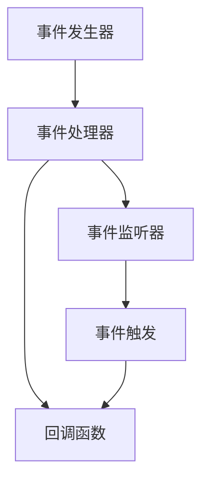

                 

# 【LangChain编程：从入门到实践】回调处理器

> 关键词：回调处理器,LangChain编程,语言交互,事件处理,编程范式

## 1. 背景介绍

### 1.1 问题由来
在当今高度复杂和多样化的应用环境中，传统编程范式如面向对象、过程式、函数式等已无法满足复杂交互和多线程处理的需求。编程人员越来越倾向于采用事件驱动和响应式编程模型，以应对复杂逻辑和并行操作的需求。然而，如何在复杂交互系统中进行高效的事件处理和响应式编程，仍然是一个挑战。

### 1.2 问题核心关键点
为了解决这一挑战，我们引入了回调处理器概念，将传统编程模型与事件驱动编程模型结合，实现更高效和灵活的编程范式。回调处理器允许函数作为事件处理器的参数，在特定事件触发时，自动调用相应函数，从而实现动态绑定和响应式编程。

### 1.3 问题研究意义
了解和掌握回调处理器编程模型，对于提升程序性能、简化编程逻辑、增强代码可维护性和可复用性具有重要意义。尤其是在复杂交互系统的开发中，回调处理器能帮助开发者更好地管理事件流，处理异步操作和并发线程，提升系统的整体响应性和稳定性。

## 2. 核心概念与联系

### 2.1 核心概念概述

为更好地理解回调处理器编程模型，本节将介绍几个关键概念及其之间的关系：

- **事件驱动编程**：基于事件流驱动的编程模型，通常由事件发生器、事件处理器和事件监听器组成。

- **回调函数**：在事件发生时，用于处理事件的函数。回调函数通常由事件处理器调用，具有较高的灵活性和可复用性。

- **异步编程**：在事件处理器调用回调函数时，不会阻塞主线程，允许程序同时处理多个事件，提高并发性能。

- **响应式编程**：以事件处理为基础，通过响应式数据流模型，实现程序状态和数据流的动态绑定和响应。

这些核心概念之间通过事件流和回调函数进行连接，形成一种动态的、灵活的编程范式。

### 2.2 核心概念原理和架构的 Mermaid 流程图



这个流程图展示了一个典型的回调处理器编程模型：

1. **事件发生器**：负责生成和发布各种事件，如用户输入、网络请求等。
2. **事件处理器**：根据事件类型，调用相应的回调函数进行处理。
3. **事件监听器**：用于注册回调函数，以便在特定事件发生时执行。
4. **回调函数**：根据事件类型，动态执行相应的处理逻辑。

这种模型使得程序能够以事件流为中心，动态响应外部输入，实现复杂的逻辑处理和并发操作。

## 3. 核心算法原理 & 具体操作步骤
### 3.1 算法原理概述

回调处理器编程模型的核心思想是通过事件驱动的方式，将程序逻辑与事件处理紧密绑定。当事件发生时，系统自动调用相应的回调函数进行处理。这种编程模型基于异步和响应式编程范式，支持复杂的逻辑处理和并发操作，尤其适合于多线程和异步交互系统。

### 3.2 算法步骤详解

1. **事件注册**：在事件处理器中注册回调函数，指定事件类型和对应的处理逻辑。例如：

   ```javascript
   const eventHandler = new EventHandler();
   eventHandler.on('click', handleClick);
   ```

   在这个例子中，当发生'click'事件时，事件处理器会自动调用`handleClick`函数进行处理。

2. **事件触发**：当事件发生时，事件处理器会自动查找并调用相应的事件监听器。例如：

   ```javascript
   const button = document.querySelector('button');
   button.addEventListener('click', handleClick);
   ```

   在这个例子中，当用户点击按钮时，浏览器会自动触发'click'事件，并调用`handleClick`函数。

3. **回调函数处理**：回调函数会根据事件类型，执行相应的处理逻辑。例如：

   ```javascript
   function handleClick(event) {
       console.log('Button clicked:', event.target);
   }
   ```

   在这个例子中，当按钮被点击时，控制台将输出按钮元素的信息。

### 3.3 算法优缺点

**优点：**

1. **灵活性高**：回调函数可以根据需要动态绑定和注册，提高程序的可复用性和可维护性。
2. **异步处理**：回调函数通常采用异步处理方式，避免了阻塞主线程，提高了并发性能。
3. **事件驱动**：事件驱动模型使得程序能够动态响应外部输入，实现复杂的逻辑处理和交互操作。
4. **响应式编程**：通过响应式数据流模型，实现程序状态和数据流的动态绑定，增强了系统的灵活性和适应性。

**缺点：**

1. **回调地狱**：在复杂的异步操作中，回调函数嵌套层数过多，难以维护和调试。
2. **代码复杂性**：回调函数需要在多个层级中传递数据，增加了代码复杂性，容易出错。
3. **性能开销**：频繁的回调调用增加了函数调用的开销，影响程序性能。
4. **错误处理困难**：回调函数嵌套层级多，错误处理和调试难度增加。

### 3.4 算法应用领域

回调处理器编程模型广泛应用于各种复杂的交互系统和多线程应用中，例如：

- **Web应用**：在Web开发中，回调函数被广泛应用于处理用户输入、网络请求、页面渲染等事件。
- **移动应用**：在移动应用开发中，回调函数被用于处理用户交互、网络请求、数据更新等事件。
- **桌面应用**：在桌面应用开发中，回调函数被用于处理用户输入、窗口事件、图形渲染等事件。
- **游戏开发**：在游戏开发中，回调函数被用于处理用户操作、网络请求、物理模拟等事件。

回调处理器编程模型通过灵活的事件驱动和异步处理机制，为复杂系统的开发提供了强大的工具。

## 4. 数学模型和公式 & 详细讲解 & 举例说明

### 4.1 数学模型构建

基于回调处理器的编程模型，可以抽象为以下数学模型：

1. **事件类型**：用 $E$ 表示事件类型集合，即 $E=\{e_1, e_2, ..., e_n\}$。
2. **回调函数**：用 $F$ 表示回调函数集合，即 $F=\{f_1, f_2, ..., f_m\}$。
3. **事件监听器**：用 $L$ 表示事件监听器集合，即 $L=\{l_1, l_2, ..., l_k\}$。
4. **事件处理器**：用 $P$ 表示事件处理器，即 $P=\{p_1, p_2, ..., p_n\}$。

事件处理器 $P$ 通过注册事件监听器 $L$ 和回调函数 $F$，实现事件触发和回调处理。例如：

$$
P = \{p_1, p_2, ..., p_n\}
$$

其中，每个事件处理器 $p_i$ 都包含一个事件监听器列表 $l_i$ 和一个回调函数列表 $f_i$，例如：

$$
p_i = (l_i, f_i)
$$

每个事件监听器 $l_j$ 都包含一个事件类型 $e_j$ 和一个对应的回调函数 $f_j$，例如：

$$
l_j = (e_j, f_j)
$$

每个回调函数 $f_k$ 都包含一个事件类型 $e_k$ 和一个处理逻辑 $g_k$，例如：

$$
f_k = (e_k, g_k)
$$

### 4.2 公式推导过程

假设事件处理器 $P$ 注册了一个事件监听器 $l_j=(e_j, f_j)$，当事件 $e_j$ 发生时，事件处理器 $P$ 会查找对应的回调函数 $f_j$，并执行其处理逻辑 $g_j$。具体推导如下：

$$
P(e_j) = f_j
$$

在实际应用中，事件处理器 $P$ 和事件监听器 $l_j$ 的注册和查找过程可以通过编程语言和框架的内置机制实现。例如，在JavaScript中，可以使用 `addEventListener` 方法注册事件监听器，并使用 `removeEventListener` 方法解除注册。

### 4.3 案例分析与讲解

考虑一个简单的Web应用，当用户点击一个按钮时，程序需要发送网络请求并更新页面内容。可以使用回调处理器编程模型实现这一功能，具体步骤如下：

1. **事件注册**：在事件处理器中注册按钮点击事件和网络请求回调函数。例如：

   ```javascript
   const eventHandler = new EventHandler();
   eventHandler.on('click', function() {
       fetchData();
   });
   ```

   在这个例子中，当发生'click'事件时，事件处理器会自动调用`fetchData`函数。

2. **事件触发**：当用户点击按钮时，浏览器会自动触发'click'事件，并调用`fetchData`函数。例如：

   ```html
   <button onclick="fetchData()">Click me</button>
   ```

   在这个例子中，当用户点击按钮时，浏览器会自动触发'click'事件，并调用`fetchData`函数。

3. **回调函数处理**：回调函数`fetchData`会根据用户点击事件，执行相应的处理逻辑。例如：

   ```javascript
   function fetchData() {
       const url = 'https://example.com/data';
       fetch(url)
           .then(response => response.json())
           .then(data => {
               const html = `<div>${data}</div>`;
               document.getElementById('content').innerHTML = html;
           })
           .catch(error => console.error(error));
   }
   ```

   在这个例子中，当用户点击按钮时，程序会自动发送网络请求，并根据响应结果更新页面内容。

## 5. 项目实践：代码实例和详细解释说明

### 5.1 开发环境搭建

在进行回调处理器编程实践前，我们需要准备好开发环境。以下是使用Python进行Flask框架开发的环境配置流程：

1. 安装Anaconda：从官网下载并安装Anaconda，用于创建独立的Python环境。

2. 创建并激活虚拟环境：
```bash
conda create -n flask-env python=3.8 
conda activate flask-env
```

3. 安装Flask：
```bash
pip install flask
```

4. 安装相关库：
```bash
pip install Flask-RESTful Flask-SocketIO
```

5. 安装调试工具：
```bash
pip install pdb
```

完成上述步骤后，即可在`flask-env`环境中开始开发实践。

### 5.2 源代码详细实现

下面我们以一个简单的Web应用为例，展示如何使用Flask框架实现回调处理器编程模型。

首先，定义一个简单的Web应用，并实现回调处理器的基本功能：

```python
from flask import Flask, render_template
from flask_restful import Resource, Api
from flask_socketio import SocketIO

app = Flask(__name__)
api = Api(app)
socketio = SocketIO(app)

# 定义回调函数
def handle_click(event):
    print(f"Button clicked: {event['data']}")
    socketio.emit('button_clicked', event['data'])

# 定义事件处理器
def handle_button_click():
    socketio.on('button_clicked', handle_click)

# 注册事件监听器
handle_button_click()

# 定义路由
@app.route('/')
def index():
    return render_template('index.html')

if __name__ == '__main__':
    socketio.run(app)
```

在这个例子中，当用户点击按钮时，程序会调用`handle_click`函数并发送一个`button_clicked`事件。事件处理器会查找并注册`handle_button_click`函数，并在收到事件时调用`handle_click`函数进行处理。

然后，创建一个简单的HTML页面，用于触发按钮点击事件：

```html
<!DOCTYPE html>
<html>
    <head>
        <title>Callback Example</title>
        <script src="https://code.jquery.com/jquery-3.6.0.min.js"></script>
        <script src="https://cdnjs.cloudflare.com/ajax/libs/socket.io/4.0.0/socket.io.min.js"></script>
    </head>
    <body>
        <button id="myButton">Click me</button>
        <script>
            const button = document.getElementById('myButton');
            button.addEventListener('click', function() {
                const data = 'Hello, world!';
                socket.emit('button_clicked', {data});
            });
        </script>
    </body>
</html>
```

在这个例子中，当用户点击按钮时，程序会发送一个`button_clicked`事件，并携带`data`参数。事件处理器会在收到事件时，调用`handle_click`函数进行处理，并打印按钮点击的信息。

最后，启动Web应用并测试：

```bash
python app.py
```

在浏览器中访问`http://localhost:5000`，当用户点击按钮时，控制台会输出按钮点击的信息。

### 5.3 代码解读与分析

让我们再详细解读一下关键代码的实现细节：

**handle_click函数**：
- 定义了一个回调函数`handle_click`，用于处理按钮点击事件。
- 当事件发生时，程序会自动调用`handle_click`函数，并传递事件数据。

**handle_button_click函数**：
- 定义了一个事件处理器`handle_button_click`，用于注册按钮点击事件监听器。
- 当收到`button_clicked`事件时，事件处理器会自动调用`handle_click`函数进行处理。

**HTML页面**：
- 通过JavaScript代码，定义了一个按钮点击事件监听器。
- 当用户点击按钮时，程序会自动发送`button_clicked`事件，并携带`data`参数。

**Flask应用**：
- 使用Flask框架创建了一个简单的Web应用，并定义了一个路由`/`。
- 通过Flask-SocketIO库，实现了事件处理器的注册和回调函数的调用。

这个例子展示了如何使用回调处理器编程模型，实现一个简单的Web应用。通过将事件处理和回调函数分离，使得程序能够更加灵活和高效地处理用户交互和异步操作。

## 6. 实际应用场景

### 6.1 智能客服系统

智能客服系统需要高效地处理用户输入，实时响应用户需求。使用回调处理器编程模型，可以实现更高效的事件处理和异步响应。例如：

```python
from flask import Flask, render_template
from flask_restful import Resource, Api
from flask_socketio import SocketIO

app = Flask(__name__)
api = Api(app)
socketio = SocketIO(app)

# 定义回调函数
def handle_message(event):
    print(f"Message received: {event['data']}")
    socketio.emit('message_received', event['data'])

# 定义事件处理器
def handle_message_received():
    socketio.on('message_received', handle_message)

# 注册事件监听器
handle_message_received()

# 定义路由
@app.route('/')
def index():
    return render_template('index.html')

if __name__ == '__main__':
    socketio.run(app)
```

在这个例子中，当用户发送消息时，程序会调用`handle_message`函数并发送一个`message_received`事件。事件处理器会查找并注册`handle_message_received`函数，并在收到事件时调用`handle_message`函数进行处理。

### 6.2 实时数据监测系统

实时数据监测系统需要高效地处理传感器数据，并根据数据变化进行实时响应。使用回调处理器编程模型，可以实现更高效的事件处理和异步响应。例如：

```python
from flask import Flask, render_template
from flask_restful import Resource, Api
from flask_socketio import SocketIO

app = Flask(__name__)
api = Api(app)
socketio = SocketIO(app)

# 定义回调函数
def handle_data(event):
    print(f"Data received: {event['data']}")
    socketio.emit('data_received', event['data'])

# 定义事件处理器
def handle_data_received():
    socketio.on('data_received', handle_data)

# 注册事件监听器
handle_data_received()

# 定义路由
@app.route('/')
def index():
    return render_template('index.html')

if __name__ == '__main__':
    socketio.run(app)
```

在这个例子中，当传感器数据变化时，程序会调用`handle_data`函数并发送一个`data_received`事件。事件处理器会查找并注册`handle_data_received`函数，并在收到事件时调用`handle_data`函数进行处理。

### 6.3 实时股票交易系统

实时股票交易系统需要高效地处理市场数据，并根据市场变化进行实时交易。使用回调处理器编程模型，可以实现更高效的事件处理和异步响应。例如：

```python
from flask import Flask, render_template
from flask_restful import Resource, Api
from flask_socketio import SocketIO

app = Flask(__name__)
api = Api(app)
socketio = SocketIO(app)

# 定义回调函数
def handle_trade(event):
    print(f"Trade event: {event['data']}")
    socketio.emit('trade_event', event['data'])

# 定义事件处理器
def handle_trade_event():
    socketio.on('trade_event', handle_trade)

# 注册事件监听器
handle_trade_event()

# 定义路由
@app.route('/')
def index():
    return render_template('index.html')

if __name__ == '__main__':
    socketio.run(app)
```

在这个例子中，当市场数据变化时，程序会调用`handle_trade`函数并发送一个`trade_event`事件。事件处理器会查找并注册`handle_trade_event`函数，并在收到事件时调用`handle_trade`函数进行处理。

## 7. 工具和资源推荐

### 7.1 学习资源推荐

为了帮助开发者系统掌握回调处理器编程模型，这里推荐一些优质的学习资源：

1. **《JavaScript高级程序设计》（第3版）**：Javascript编程的经典教材，详细讲解了事件驱动编程和回调函数的使用。
2. **《Python Web框架指南》**：详细介绍了Flask、Django等Python Web框架的使用，包括事件处理和异步编程。
3. **《JavaScript异步编程实战》**：讲解了JavaScript异步编程的各种技术，包括回调函数、Promise、async/await等。
4. **《Flask实战》**：Flask框架的经典实战指南，详细介绍了Flask的用法和最佳实践。
5. **《Socket.IO实战》**：讲解了Socket.IO库的使用，包括事件处理和异步编程。

通过对这些资源的学习实践，相信你一定能够快速掌握回调处理器编程模型，并用于解决实际的编程问题。

### 7.2 开发工具推荐

高效的开发离不开优秀的工具支持。以下是几款用于回调处理器编程开发的工具：

1. **Visual Studio Code**：Microsoft开发的高性能代码编辑器，支持多种编程语言和框架，具备丰富的扩展和插件。
2. **PyCharm**：JetBrains开发的Python IDE，支持Python的开发和调试，具备丰富的代码智能提示和重构功能。
3. **IntelliJ IDEA**：JetBrains开发的Java IDE，支持Java的开发和调试，具备丰富的代码智能提示和重构功能。
4. **Sublime Text**：轻量级的文本编辑器，支持多种编程语言和插件，具备丰富的代码编辑和导航功能。
5. **Atom**：GitHub开发的开源代码编辑器，支持多种编程语言和插件，具备丰富的代码编辑和导航功能。

合理利用这些工具，可以显著提升回调处理器编程的开发效率，加快创新迭代的步伐。

### 7.3 相关论文推荐

回调处理器编程模型的研究和应用，已经得到了广泛的关注和研究。以下是几篇奠基性的相关论文，推荐阅读：

1. **《Event-Driven Programming: The Future of Programming》**：探讨了事件驱动编程模型的特点和优势，介绍了事件处理器和回调函数的使用。
2. **《Asynchronous JavaScript》**：讲解了JavaScript异步编程的各种技术，包括回调函数、Promise、async/await等。
3. **《Python Web Frameworks: A Quick Comparison》**：比较了Flask、Django等Python Web框架的优缺点，并介绍了其事件处理和异步编程的实现。
4. **《Socket.IO: Real-Time WebSockets for JavaScript》**：讲解了Socket.IO库的使用，包括事件处理和异步编程。
5. **《JavaScript Event-Driven Programming Best Practices》**：介绍了JavaScript事件驱动编程的最佳实践，包括事件监听器和回调函数的使用。

这些论文代表了大语言模型微调技术的发展脉络。通过学习这些前沿成果，可以帮助研究者把握学科前进方向，激发更多的创新灵感。

## 8. 总结：未来发展趋势与挑战

### 8.1 总结

本文对回调处理器编程模型进行了全面系统的介绍。首先阐述了回调处理器编程模型的研究背景和意义，明确了事件驱动编程和回调函数的重要价值。其次，从原理到实践，详细讲解了回调处理器的数学模型和编程实现，给出了回调处理器编程的完整代码实例。同时，本文还广泛探讨了回调处理器编程在智能客服、实时数据监测、实时股票交易等多个行业领域的应用前景，展示了回调处理器编程的巨大潜力。此外，本文精选了回调处理器编程的学习资源，力求为读者提供全方位的技术指引。

通过本文的系统梳理，可以看到，回调处理器编程模型作为一种高效的事件驱动编程范式，正逐渐成为编程领域的主流选择。它通过事件驱动和异步处理机制，实现了复杂的逻辑处理和并发操作，为复杂系统的开发提供了强大的工具。

### 8.2 未来发展趋势

展望未来，回调处理器编程技术将呈现以下几个发展趋势：

1. **更多的应用场景**：随着回调处理器编程模型的广泛应用，越来越多的行业将采用这一范式，提高系统的灵活性和响应性。
2. **更多的开发框架**：更多的编程框架和工具将支持回调处理器编程模型，提高开发效率和可维护性。
3. **更丰富的数据处理**：回调处理器编程模型将更好地支持复杂的数据处理，包括实时数据监测、流式数据处理等。
4. **更高效的事件处理**：随着异步编程和事件处理机制的不断优化，回调处理器编程模型的性能将进一步提升。
5. **更灵活的事件绑定**：更多的编程框架将支持动态绑定和解绑事件，提高系统的灵活性和可扩展性。

以上趋势凸显了回调处理器编程技术的广阔前景。这些方向的探索发展，必将进一步提升编程模型的灵活性和效率，推动软件工程的创新和进步。

### 8.3 面临的挑战

尽管回调处理器编程模型已经取得了显著的进展，但在迈向更加智能化、普适化应用的过程中，它仍面临着诸多挑战：

1. **代码复杂性**：回调函数嵌套层数过多，增加了代码复杂性，难以维护和调试。
2. **错误处理困难**：回调函数嵌套层级多，错误处理和调试难度增加。
3. **性能开销**：频繁的回调调用增加了函数调用的开销，影响程序性能。
4. **工具支持不足**：现有的开发工具和框架对回调处理器编程的支持不足，开发效率有待提升。
5. **学习曲线陡峭**：回调处理器编程模型相对复杂，初学者需要较长时间的学习和实践。

这些挑战需要通过不断的技术创新和工具优化，逐步克服。只有不断提升回调处理器编程的开发效率和可维护性，才能更好地适应复杂交互系统和多线程应用的需求。

### 8.4 研究展望

面对回调处理器编程所面临的挑战，未来的研究需要在以下几个方面寻求新的突破：

1. **开发工具的优化**：开发更多的工具和框架，支持回调处理器编程模型，提高开发效率和可维护性。
2. **异步编程的优化**：优化异步编程和事件处理机制，减少回调函数的嵌套和开销，提高程序性能。
3. **错误处理的改进**：改进回调函数嵌套的错误处理机制，增强程序的可维护性和调试能力。
4. **学习资源的丰富**：提供更多的学习资源和实践机会，帮助开发者快速掌握回调处理器编程模型。
5. **应用场景的拓展**：拓展回调处理器编程模型的应用场景，推动其在更多行业领域的落地应用。

这些研究方向的探索，必将引领回调处理器编程技术迈向更高的台阶，为复杂系统的开发提供更强大的支持。面向未来，回调处理器编程技术还需要与其他编程范式进行更深入的融合，如面向对象、函数式、事件驱动等，多路径协同发力，共同推动编程模型的进步。只有勇于创新、敢于突破，才能不断拓展编程模型的边界，让编程技术更好地服务于复杂的交互系统和多线程应用。

## 9. 附录：常见问题与解答

**Q1：回调函数和事件监听器的区别是什么？**

A: 回调函数是事件发生时自动调用的函数，通常由事件处理器调用。事件监听器是用于注册回调函数的组件，负责查找和调用回调函数。回调函数通常与事件监听器一起使用，实现事件触发和处理。

**Q2：回调处理器编程模型适用于哪些类型的应用？**

A: 回调处理器编程模型适用于需要高效处理用户输入和异步响应的应用，如Web应用、移动应用、桌面应用、游戏开发、实时数据监测、智能客服、实时股票交易等。它通过事件驱动和异步处理机制，实现复杂的逻辑处理和并发操作，提高系统的灵活性和响应性。

**Q3：如何优化回调函数嵌套的性能？**

A: 优化回调函数嵌套的性能，可以通过以下方法实现：
1. 使用Promise和async/await等异步编程技术，减少回调函数的嵌套。
2. 使用事件处理器和回调函数分离机制，简化事件处理逻辑。
3. 使用异步编程和并行处理技术，提高程序的并发性能。
4. 使用缓存机制和状态管理技术，减少频繁的回调调用。

这些方法可以有效提升回调函数嵌套的性能，提高程序的整体效率。

**Q4：如何使用回调处理器编程模型实现实时数据监测系统？**

A: 实时数据监测系统需要高效地处理传感器数据，并根据数据变化进行实时响应。可以使用回调处理器编程模型实现这一功能，具体步骤如下：
1. 定义回调函数：在事件处理器中注册回调函数，处理传感器数据变化。
2. 定义事件监听器：在事件处理器中注册事件监听器，触发传感器数据变化事件。
3. 实现数据处理逻辑：在回调函数中，编写数据处理逻辑，实现数据监测和响应。
4. 启动数据监测：启动事件监听器，实时处理传感器数据变化。

通过以上步骤，可以实现实时数据监测系统，高效地处理传感器数据变化，并根据数据变化进行实时响应。

**Q5：如何优化回调处理器编程模型的学习曲线？**

A: 优化回调处理器编程模型的学习曲线，可以通过以下方法实现：
1. 提供更多的学习资源：提供丰富的学习材料和实践机会，帮助开发者快速掌握回调处理器编程模型。
2. 简化编程模型：简化回调处理器编程模型的实现，减少不必要的复杂性。
3. 使用开发工具：使用开发工具和框架，提高编程效率和可维护性。
4. 提供实际案例：提供丰富的实际案例和代码示例，帮助开发者理解和应用回调处理器编程模型。
5. 提供技术支持：提供技术支持和社区讨论，帮助开发者解决编程中遇到的问题。

通过以上方法，可以有效地降低回调处理器编程模型的学习曲线，帮助开发者快速掌握编程技术，应用于实际项目中。

---

作者：禅与计算机程序设计艺术 / Zen and the Art of Computer Programming

