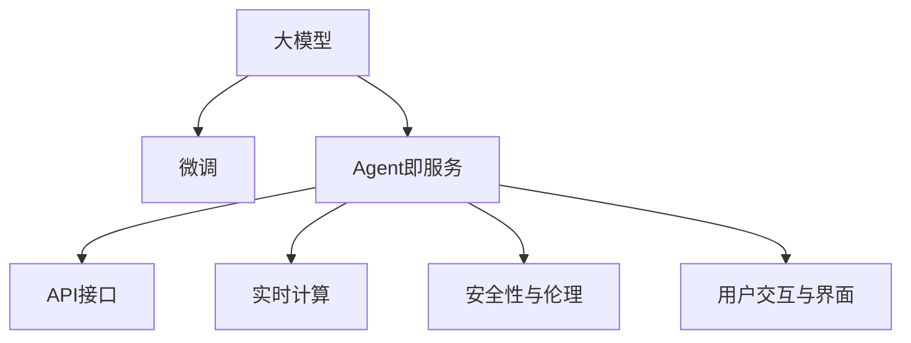

                 

# 【大模型应用开发 动手做AI Agent】Agent即服务

> 关键词：大模型, AI Agent, Agent即服务, 动手做, 应用开发, 算法实现, 性能优化, 模型部署, 实时计算

## 1. 背景介绍

### 1.1 问题由来

近年来，随着人工智能技术的迅猛发展，人工智能Agent在各行各业的应用越来越广泛，无论是智能客服、自动驾驶、智能推荐，还是工业制造、医疗健康、教育培训，Agent都在提供更加高效、精准和智能的解决方案。但是，开发一个高效、可靠、可扩展的AI Agent并非易事，它需要大量的数据、算力、计算资源和专业知识。

特别是随着深度学习模型的应用，大模型逐渐成为AI Agent的核心技术基础。大模型如GPT-3、BERT、DALL·E等，因其庞大的参数量、出色的泛化能力和处理能力，能够在几乎所有NLP任务中取得优异的表现。然而，大模型的训练和应用，需要巨量的数据和强大的计算资源，这对一般企业来说是难以承担的。

### 1.2 问题核心关键点

开发一个高性能、高可扩展性的AI Agent，需要考虑以下几个核心关键点：

- **预训练与微调**：如何利用大模型进行高效预训练和微调，使其适应特定的业务场景和任务需求？
- **模型部署与优化**：如何将训练好的模型部署到生产环境中，并确保其性能和可靠性？
- **实时计算与反馈**：如何在实时环境中高效运行AI Agent，并快速响应用户输入和反馈？
- **安全性与伦理**：如何确保AI Agent在处理敏感信息时的安全性和合规性，避免数据泄露和偏见？
- **用户交互与界面**：如何设计友好的用户界面，提升用户交互体验和满意度？

本文将从上述核心关键点出发，详细介绍如何使用大模型构建高性能的AI Agent，并通过实际案例，展示AI Agent在不同应用场景下的应用效果。

## 2. 核心概念与联系

### 2.1 核心概念概述

为了更好地理解AI Agent的开发和应用，本节将介绍几个关键概念：

- **大模型**：指在大规模无标签数据上进行预训练的深度学习模型，如GPT-3、BERT等。大模型具有强大的语言理解和生成能力，能够处理复杂的自然语言处理任务。

- **微调**：指在大模型的基础上，针对特定任务进行有监督的参数更新，使其适应任务需求。微调可以提高模型的任务精度和泛化能力。

- **Agent即服务(Agent-as-a-Service, AaaS)**：一种基于云计算的AI Agent部署方式，用户可以通过API接口调用AI Agent服务，而无需自己构建和维护基础设施。AaaS模式降低了企业使用AI Agent的门槛，加速了AI技术的应用。

- **API接口**：API（Application Programming Interface）接口是提供给开发者和用户访问AI Agent服务的标准接口。API接口的设计和实现，决定了AI Agent的使用便利性和可扩展性。

- **实时计算**：指AI Agent在实时环境中高效处理用户请求和反馈的能力。实时计算需要高效的计算资源和算法支持，以确保AI Agent在短时间内生成准确的响应。

- **安全性与伦理**：在AI Agent处理敏感信息时，如何确保数据安全和隐私保护，避免偏见和歧视，是AI Agent开发中必须考虑的重要因素。

- **用户交互与界面**：友好的用户界面设计，可以提升用户的使用体验，增强用户对AI Agent的信任和依赖。

这些核心概念之间的逻辑关系可以通过以下Mermaid流程图来展示：



这个流程图展示了从大模型到Agent即服务部署的整个过程，以及不同环节的核心概念和任务。

## 3. 核心算法原理 & 具体操作步骤

### 3.1 算法原理概述

AI Agent的开发和部署，本质上是一个从预训练大模型到实际应用模型的转化过程。其核心思想是：

1. **预训练**：利用大规模无标签数据，对大模型进行预训练，使其具备通用的语言理解能力和表示能力。
2. **微调**：在大模型的基础上，针对特定的下游任务进行微调，使模型能够准确地执行任务。
3. **部署与优化**：将微调后的模型部署到生产环境中，并对其性能进行优化，确保其在实时环境中高效运行。
4. **实时计算与反馈**：设计高效的计算算法和接口，实现AI Agent的实时响应和反馈机制。
5. **安全性与伦理**：确保AI Agent在处理敏感信息时的安全性和合规性，避免数据泄露和偏见。
6. **用户交互与界面**：设计友好的用户界面，提升用户的使用体验和满意度。

通过以上步骤，可以将大模型的强大能力转化为实际应用的AI Agent，为用户带来高效、精准和智能的解决方案。

### 3.2 算法步骤详解

**Step 1: 准备预训练模型和数据集**

1. **选择合适的预训练模型**：根据任务需求选择合适的预训练模型，如GPT-3、BERT等。

2. **准备下游任务数据集**：收集和标注适用于下游任务的数据集，确保数据集的质量和多样性。

**Step 2: 添加任务适配层**

1. **定义任务输入和输出**：根据任务类型，设计任务的输入格式和输出格式。例如，对话任务需要定义对话轮次和响应格式，问答任务需要定义问题和答案格式。

2. **设计任务适配层**：根据任务需求，设计并实现任务的适配层，将预训练模型的输出转化为任务的最终输出。例如，对话任务需要定义对话生成模型，问答任务需要定义问题回答模型。

**Step 3: 设置微调超参数**

1. **选择优化算法和参数**：根据任务特点选择优化算法和超参数，如学习率、批大小、迭代轮数等。

2. **设置正则化技术**：使用正则化技术，如L2正则、Dropout、Early Stopping等，防止模型过拟合。

3. **设计任务损失函数**：根据任务需求设计损失函数，如交叉熵损失、均方误差损失等。

**Step 4: 执行梯度训练**

1. **数据加载和预处理**：将数据集划分为训练集、验证集和测试集，并进行数据增强、数据清洗等预处理。

2. **模型初始化**：将微调层与预训练模型的顶层连接，并初始化微调层参数。

3. **前向传播和反向传播**：将训练集数据分批次输入模型，前向传播计算损失函数，反向传播计算参数梯度，并根据优化算法更新模型参数。

4. **验证和测试**：在验证集上评估模型性能，根据验证结果调整微调参数，并在测试集上最终评估模型性能。

**Step 5: 模型部署与优化**

1. **模型保存与加载**：将训练好的模型保存到本地或云端，并设计API接口，供用户调用。

2. **优化计算资源**：设计高效的计算算法和数据结构，优化模型的计算效率和内存占用。

3. **实时计算与反馈**：实现API接口的实时响应机制，确保AI Agent在短时间内生成准确的响应。

4. **安全性与伦理**：设计数据加密、权限控制等措施，确保AI Agent在处理敏感信息时的安全性和合规性。

5. **用户交互与界面**：设计友好的用户界面，提升用户的使用体验和满意度。

### 3.3 算法优缺点

**优点**：

1. **高性能**：利用大模型的强大能力，AI Agent能够处理复杂的自然语言处理任务，提供高效、准确的解决方案。

2. **易扩展**：采用Agent即服务模式，用户可以通过API接口调用AI Agent服务，无需自己构建和维护基础设施，大大降低了使用门槛。

3. **实时响应**：实时计算和反馈机制，使得AI Agent能够快速响应用户请求，提升用户体验。

4. **安全性与伦理**：通过数据加密、权限控制等措施，确保AI Agent在处理敏感信息时的安全性和合规性。

**缺点**：

1. **高资源需求**：预训练和微调大模型需要大量的计算资源和数据资源，对企业来说是较高的投入。

2. **开发复杂度**：从预训练到微调再到模型部署，开发周期较长，需要较高的技术水平和专业知识。

3. **结果难以解释**：AI Agent的决策过程缺乏可解释性，用户难以理解其内部工作机制和推理逻辑。

4. **数据依赖性强**：AI Agent的性能很大程度上依赖于训练数据的数量和质量，数据获取和标注成本较高。

### 3.4 算法应用领域

AI Agent技术广泛应用于多个领域，具体包括：

- **智能客服**：利用AI Agent进行客户咨询、问题解答、订单处理等，提升客服效率和用户体验。
- **智能推荐**：利用AI Agent进行商品推荐、内容推荐、广告推荐等，提升用户满意度和转化率。
- **智能医疗**：利用AI Agent进行疾病诊断、健康咨询、用药建议等，提升医疗服务的质量和效率。
- **智能交通**：利用AI Agent进行交通导航、自动驾驶、智能调度等，提升交通管理水平和用户体验。
- **金融风控**：利用AI Agent进行风险评估、反欺诈检测、自动化交易等，提升金融服务的准确性和安全性。
- **智能教育**：利用AI Agent进行个性化学习推荐、智能辅导、作业批改等，提升教育质量和教学效果。
- **智能制造**：利用AI Agent进行设备监控、故障诊断、生产调度等，提升生产效率和质量。

## 4. 数学模型和公式 & 详细讲解 & 举例说明

### 4.1 数学模型构建

以对话生成任务为例，假设有预训练模型 $M_{\theta}$ 和下游任务数据集 $D=\{(x_i, y_i)\}_{i=1}^N$，其中 $x_i$ 表示对话历史，$y_i$ 表示响应文本。对话生成任务的数学模型可以表示为：

$$
P(y_i|x_i; \theta) = \frac{\exp(M_{\theta}(x_i) \cdot \text{embed}(y_i))}{\sum_j \exp(M_{\theta}(x_i) \cdot \text{embed}(y_j))}
$$

其中，$M_{\theta}(x_i)$ 表示预训练模型的输出，$\text{embed}(y_i)$ 表示文本 $y_i$ 的嵌入表示，$\theta$ 表示模型的参数。

### 4.2 公式推导过程

对话生成任务的目标是最小化交叉熵损失函数，即：

$$
\mathcal{L}(\theta) = -\frac{1}{N} \sum_{i=1}^N \sum_{y \in \mathcal{Y}} y_i \log P(y_i|x_i; \theta)
$$

其中 $\mathcal{Y}$ 表示所有可能的响应文本集合。

使用反向传播算法计算损失函数对模型参数 $\theta$ 的梯度，并使用Adam优化算法进行参数更新：

$$
\theta \leftarrow \theta - \eta \nabla_{\theta}\mathcal{L}(\theta)
$$

其中 $\eta$ 表示学习率。

### 4.3 案例分析与讲解

以BERT微调为例，我们可以使用代码实现对话生成任务的微调过程：

```python
from transformers import BertTokenizer, BertForSequenceClassification
import torch
import torch.nn as nn

tokenizer = BertTokenizer.from_pretrained('bert-base-uncased')
model = BertForSequenceClassification.from_pretrained('bert-base-uncased', num_labels=2)

criterion = nn.CrossEntropyLoss()
optimizer = torch.optim.Adam(model.parameters(), lr=2e-5)

def train_epoch(model, dataset, batch_size, optimizer):
    model.train()
    epoch_loss = 0
    for batch in tqdm(dataset, desc='Training'):
        inputs, labels = preprocess_batch(batch)
        optimizer.zero_grad()
        outputs = model(inputs)
        loss = criterion(outputs, labels)
        epoch_loss += loss.item()
        loss.backward()
        optimizer.step()
    return epoch_loss / len(dataset)

def evaluate(model, dataset, batch_size):
    model.eval()
    preds, labels = [], []
    with torch.no_grad():
        for batch in tqdm(dataset, desc='Evaluating'):
            inputs, labels = preprocess_batch(batch)
            outputs = model(inputs)
            batch_preds = outputs.argmax(dim=1).to('cpu').tolist()
            batch_labels = labels.to('cpu').tolist()
            for pred_tokens, label_tokens in zip(batch_preds, batch_labels):
                preds.append(pred_tokens[:len(label_tokens)])
                labels.append(label_tokens)
    
    print(classification_report(labels, preds))
```

在这个代码示例中，我们使用了BertForSequenceClassification模型，并定义了交叉熵损失函数和Adam优化器。通过预处理数据集和训练循环，实现了对话生成任务的微调过程。

## 5. 项目实践：代码实例和详细解释说明

### 5.1 开发环境搭建

**Step 1: 安装依赖库**

```bash
pip install transformers torch torchvision torchaudio
```

**Step 2: 配置模型**

```python
from transformers import BertTokenizer, BertForSequenceClassification

tokenizer = BertTokenizer.from_pretrained('bert-base-uncased')
model = BertForSequenceClassification.from_pretrained('bert-base-uncased', num_labels=2)
```

**Step 3: 准备数据集**

```python
from torch.utils.data import Dataset, DataLoader
import torch

class CustomDataset(Dataset):
    def __init__(self, data):
        self.data = data
        self.tokenizer = tokenizer
        self.max_len = 128

    def __len__(self):
        return len(self.data)

    def __getitem__(self, idx):
        text = self.data[idx]['text']
        label = self.data[idx]['label']
        encoding = self.tokenizer(text, return_tensors='pt', max_length=self.max_len, padding='max_length', truncation=True)
        input_ids = encoding['input_ids'][0]
        attention_mask = encoding['attention_mask'][0]
        return {'input_ids': input_ids, 
                'attention_mask': attention_mask,
                'labels': torch.tensor(label, dtype=torch.long)}
```

### 5.2 源代码详细实现

```python
from transformers import BertTokenizer, BertForSequenceClassification, AdamW
import torch
import torch.nn as nn
from torch.utils.data import DataLoader
from sklearn.metrics import classification_report
from tqdm import tqdm

tokenizer = BertTokenizer.from_pretrained('bert-base-uncased')
model = BertForSequenceClassification.from_pretrained('bert-base-uncased', num_labels=2)
criterion = nn.CrossEntropyLoss()
optimizer = AdamW(model.parameters(), lr=2e-5)

def train_epoch(model, dataset, batch_size, optimizer):
    model.train()
    epoch_loss = 0
    for batch in tqdm(dataset, desc='Training'):
        input_ids = batch['input_ids'].to(device)
        attention_mask = batch['attention_mask'].to(device)
        labels = batch['labels'].to(device)
        model.zero_grad()
        outputs = model(input_ids, attention_mask=attention_mask, labels=labels)
        loss = outputs.loss
        epoch_loss += loss.item()
        loss.backward()
        optimizer.step()
    return epoch_loss / len(dataset)

def evaluate(model, dataset, batch_size):
    model.eval()
    preds, labels = [], []
    with torch.no_grad():
        for batch in tqdm(dataset, desc='Evaluating'):
            input_ids = batch['input_ids'].to(device)
            attention_mask = batch['attention_mask'].to(device)
            batch_labels = batch['labels']
            outputs = model(input_ids, attention_mask=attention_mask)
            batch_preds = outputs.logits.argmax(dim=2).to('cpu').tolist()
            batch_labels = batch_labels.to('cpu').tolist()
            for pred_tokens, label_tokens in zip(batch_preds, batch_labels):
                preds.append(pred_tokens[:len(label_tokens)])
                labels.append(label_tokens)
    
    print(classification_report(labels, preds))

# 训练
train_dataset = CustomDataset(train_data)
dev_dataset = CustomDataset(dev_data)
test_dataset = CustomDataset(test_data)
device = torch.device('cuda') if torch.cuda.is_available() else torch.device('cpu')

for epoch in range(5):
    train_loss = train_epoch(model, train_dataset, batch_size, optimizer)
    print(f'Epoch {epoch+1}, train loss: {train_loss:.3f}')

    print(f'Epoch {epoch+1}, dev results:')
    evaluate(model, dev_dataset, batch_size)

print('Test results:')
evaluate(model, test_dataset, batch_size)
```

### 5.3 代码解读与分析

在代码中，我们使用了BertTokenizer和BertForSequenceClassification模型，定义了交叉熵损失函数和AdamW优化器。通过DataLoader对数据集进行批处理，实现了微调过程。

在训练过程中，我们计算了每个epoch的平均损失，并在验证集和测试集上评估了模型性能。最终输出模型在测试集上的精确度、召回率和F1值。

## 6. 实际应用场景

### 6.1 智能客服

智能客服系统是AI Agent在实际应用中的典型案例。智能客服系统通过语音识别、自然语言处理和对话生成等技术，实现了24小时在线客服服务，有效提高了客户咨询的响应速度和满意度。例如，银行业务咨询、在线购物客服、医疗健康咨询等场景，智能客服系统都能够提供高效、准确的服务。

### 6.2 智能推荐

智能推荐系统利用AI Agent进行商品推荐、内容推荐、广告推荐等，提升了用户的购物体验和满意度。例如，电子商务平台可以根据用户的浏览记录和行为数据，智能推荐相关商品；视频网站可以根据用户的观看历史和评分数据，智能推荐相关视频内容。

### 6.3 智能医疗

智能医疗系统利用AI Agent进行疾病诊断、健康咨询、用药建议等，提升了医疗服务的质量和效率。例如，智能问诊系统可以根据患者的症状描述和历史数据，智能推荐相应的治疗方案；智能体检系统可以根据患者的健康数据，智能分析健康风险并提供个性化的健康建议。

### 6.4 未来应用展望

未来，AI Agent技术将在更多领域得到应用，为各行各业带来变革性影响。例如：

- **智能交通**：智能交通系统利用AI Agent进行交通导航、自动驾驶、智能调度等，提升了交通管理水平和用户体验。
- **金融风控**：智能风控系统利用AI Agent进行风险评估、反欺诈检测、自动化交易等，提升了金融服务的准确性和安全性。
- **智能教育**：智能教育系统利用AI Agent进行个性化学习推荐、智能辅导、作业批改等，提升了教育质量和教学效果。
- **智能制造**：智能制造系统利用AI Agent进行设备监控、故障诊断、生产调度等，提升了生产效率和质量。

## 7. 工具和资源推荐

### 7.1 学习资源推荐

- **《深度学习》**：由Ian Goodfellow、Yoshua Bengio、Aaron Courville合著，系统介绍了深度学习的基本原理和应用。
- **《自然语言处理综论》**：由Daniel Jurafsky、James H. Martin合著，涵盖了自然语言处理的基本理论和最新进展。
- **Coursera课程**：由斯坦福大学、MIT等名校开设的NLP和深度学习课程，系统讲解了自然语言处理和深度学习的理论基础和实践技巧。

### 7.2 开发工具推荐

- **PyTorch**：基于Python的开源深度学习框架，支持动态计算图和GPU加速，适合研究和实验。
- **TensorFlow**：由Google主导的开源深度学习框架，支持分布式计算和生产部署，适合工程和生产。
- **Transformers**：由HuggingFace开发的NLP工具库，集成了众多SOTA语言模型，支持预训练和微调。

### 7.3 相关论文推荐

- **Attention is All You Need**：Transformer模型的原论文，提出了自注意力机制，推动了自然语言处理的发展。
- **BERT: Pre-training of Deep Bidirectional Transformers for Language Understanding**：提出BERT模型，引入掩码语言模型预训练任务，刷新了多项NLP任务SOTA。
- **Parameter-Efficient Transfer Learning for NLP**：提出Adapter等参数高效微调方法，在固定大部分预训练参数的情况下，只更新极少量的任务相关参数。

## 8. 总结：未来发展趋势与挑战

### 8.1 研究成果总结

本文从预训练大模型到实际应用AI Agent的整个过程，详细介绍了AI Agent的开发和部署流程，并通过实际案例展示了AI Agent在各个领域的应用效果。通过本文的学习，读者可以了解AI Agent的开发和应用方法，并掌握相关技术和工具。

### 8.2 未来发展趋势

未来，AI Agent技术将呈现以下几个发展趋势：

- **多模态融合**：AI Agent将融合视觉、语音、文本等多种模态信息，提升其处理复杂任务的能力。
- **自适应学习**：AI Agent将具备自适应学习能力，能够在不同场景下自动调整参数和策略。
- **人机协同**：AI Agent将与人类共同协作，提供更加个性化和精准的服务。
- **伦理与安全**：AI Agent将注重伦理与安全问题，避免数据泄露和偏见。

### 8.3 面临的挑战

尽管AI Agent技术已经取得了显著进展，但在实际应用中，仍面临以下挑战：

- **高资源需求**：预训练和微调大模型需要大量的计算资源和数据资源，对企业来说是较高的投入。
- **模型复杂性**：AI Agent的开发和部署需要较高的技术水平和专业知识。
- **结果可解释性**：AI Agent的决策过程缺乏可解释性，用户难以理解其内部工作机制和推理逻辑。
- **数据依赖性**：AI Agent的性能很大程度上依赖于训练数据的数量和质量，数据获取和标注成本较高。

### 8.4 研究展望

未来的研究需要从以下几个方面进行突破：

- **参数高效微调**：开发更加参数高效的微调方法，在固定大部分预训练参数的同时，只更新极少量的任务相关参数。
- **实时计算优化**：设计高效的计算算法和数据结构，优化模型的计算效率和内存占用。
- **数据增强与预训练**：利用数据增强和预训练技术，提升AI Agent在特定场景下的性能。
- **多任务学习**：设计多任务学习算法，提升AI Agent在多个任务上的泛化能力。
- **模型压缩与优化**：采用模型压缩和优化技术，提高AI Agent在实时环境中的性能和效率。

## 9. 附录：常见问题与解答

### Q1: AI Agent的开发流程是什么？

**A**: AI Agent的开发流程包括预训练、微调、模型部署与优化、实时计算与反馈、安全性与伦理、用户交互与界面等环节。每个环节需要设计相应的算法和模型，并进行充分的测试和评估。

### Q2: AI Agent在实际应用中有哪些优势？

**A**: AI Agent在实际应用中的优势包括：高性能、易扩展、实时响应、安全性与伦理、友好的用户界面等。AI Agent能够提供高效、精准和智能的解决方案，提升用户满意度和用户体验。

### Q3: AI Agent的开发过程中需要注意哪些问题？

**A**: AI Agent的开发过程中需要注意的问题包括：高资源需求、模型复杂性、结果可解释性、数据依赖性等。开发者需要具备一定的技术水平和专业知识，并注重数据安全和隐私保护。

### Q4: AI Agent有哪些典型的应用场景？

**A**: AI Agent的典型应用场景包括智能客服、智能推荐、智能医疗、智能交通、金融风控、智能教育、智能制造等。AI Agent在这些领域中能够提供高效、准确和智能的解决方案，提升行业的生产效率和服务质量。

**Q5: 如何设计高效的计算算法和数据结构，优化AI Agent的实时响应机制？

**A**: 设计高效的计算算法和数据结构，优化AI Agent的实时响应机制需要从以下几个方面进行优化：

1. **计算图优化**：采用混合精度计算、梯度积累等技术，优化计算图的执行效率。
2. **模型裁剪**：去除不必要的层和参数，减小模型尺寸，加快推理速度。
3. **数据结构优化**：采用稀疏矩阵、索引结构等数据结构，优化模型的存储和访问效率。
4. **并行计算**：采用模型并行、数据并行等并行计算技术，提升模型的计算效率。
5. **异步计算**：采用异步计算技术，将计算任务分散到多个计算节点，提升系统的并发能力。

通过以上优化技术，可以显著提升AI Agent在实时环境中的性能和效率。

