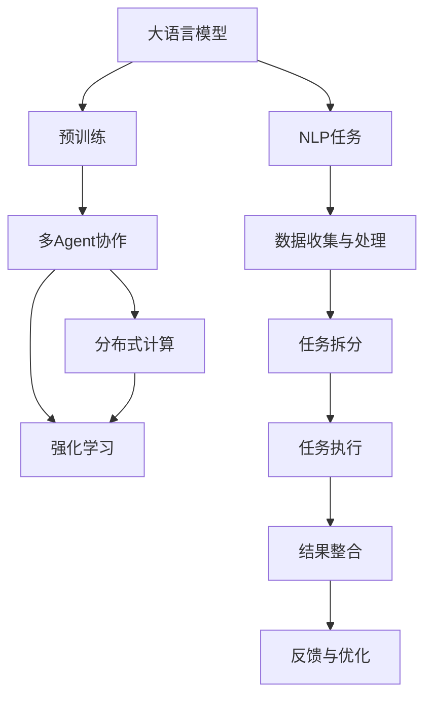

                 

# 【大模型应用开发 动手做AI Agent】多Agent协作

> 关键词：多Agent协作,大模型,分布式计算,自然语言处理,强化学习,系统设计,开发实践

## 1. 背景介绍

在人工智能领域，构建复杂系统的能力越来越受到重视。无论是科学研究还是商业应用，多Agent协作系统都展现了巨大的潜力。尤其是在自然语言处理(NLP)领域，多Agent协作可以更好地利用大语言模型，处理更加复杂、动态的任务，提升系统的表现力和实用性。本文将介绍如何通过多Agent协作，利用大模型进行AI Agent开发。

## 2. 核心概念与联系

### 2.1 核心概念概述

在介绍具体算法之前，我们先来梳理一下涉及的关键概念：

- **大语言模型(Large Language Model, LLM)**：指基于Transformer架构的预训练语言模型，如GPT、BERT等。这些模型在无监督条件下，通过大量的文本数据训练，已经掌握了丰富的语言知识和语义理解能力。

- **多Agent协作**：指多个自主的智能体（Agent）相互交互，协调完成任务的系统。每个Agent能够根据当前环境和任务要求，独立作出决策并执行行动。

- **分布式计算**：将计算任务分配到多台计算机上进行并行处理，以提高效率和处理能力。

- **自然语言处理(NLP)**：指使用计算机处理人类语言的技术，涵盖文本分析、语音识别、机器翻译等诸多子领域。

- **强化学习(RL)**：一种学习范式，通过与环境互动，最大化累积奖励信号，学习最优策略。

- **系统设计**：涵盖从需求分析、架构设计、组件选择到实施部署的全过程。

这些概念之间有紧密的联系：大语言模型是构建AI Agent的基础，多Agent协作是其灵活应用的形式，分布式计算和强化学习是其关键技术手段，自然语言处理是具体的处理对象，系统设计则是整个流程的框架。

### 2.2 核心概念原理和架构的 Mermaid 流程图



上述流程图展示了从预训练大语言模型到多Agent协作系统，再到NLP任务的完整过程。预训练模型提供了通用的语言理解能力，多Agent协作使其能够灵活应对不同任务，分布式计算和强化学习保证了系统的效率和自适应能力，最终通过NLP任务进行具体的处理与应用。

## 3. 核心算法原理 & 具体操作步骤

### 3.1 算法原理概述

多Agent协作的核心思想是通过多个自主Agent的协作，构建一个更加强大、灵活的智能系统。每个Agent根据自身对环境的观察和理解，独立决策并执行行动，以达成系统整体的优化目标。

### 3.2 算法步骤详解

以下步骤详细介绍了如何构建一个基于大模型的多Agent协作系统：

#### 3.2.1 任务定义与数据准备

- **任务定义**：明确多Agent协作系统的目标，例如通过对话系统进行问答、通过推荐系统进行个性化推荐等。
- **数据准备**：收集和标注与任务相关的数据，如对话对、推荐物品列表等。数据的质量和数量对系统性能至关重要。

#### 3.2.2 预训练大语言模型的选择

- **模型选择**：选择合适的预训练语言模型，如GPT、BERT等。模型的参数量、预训练数据规模、训练策略等都需要根据具体任务进行选择。
- **模型微调**：在特定任务上微调预训练模型，以适应具体的任务需求。微调过程通常包括增加任务相关的输出层和损失函数，并使用小学习率进行训练。

#### 3.2.3 多Agent系统的设计

- **Agent设计**：设计多个自主Agent，每个Agent负责特定的子任务，如对话生成、物品推荐等。
- **通信机制**：设计Agent间的通信机制，如消息传递、共享变量等，以便进行信息交换和协同决策。

#### 3.2.4 分布式计算的实现

- **计算框架选择**：选择合适的分布式计算框架，如Apache Spark、TensorFlow等，进行并行计算。
- **任务划分与调度**：将计算任务划分为多个子任务，并根据计算资源和负载情况进行调度。

#### 3.2.5 强化学习的应用

- **环境建模**：构建任务的环境模型，描述任务状态和Agent的决策空间。
- **策略学习**：通过强化学习算法，学习Agent在特定环境下的最优策略。常用的强化学习算法包括Q-learning、策略梯度等。
- **策略执行与优化**：将学到的策略应用到实际任务中，并进行持续的优化调整，以适应环境变化。

### 3.3 算法优缺点

**优点：**
1. **灵活性和适应性**：多Agent协作系统能够灵活应对复杂、动态的任务，具有较强的自适应能力。
2. **扩展性和可维护性**：通过增加或修改Agent，可以轻松扩展系统的功能，维护成本较低。
3. **提高计算效率**：利用分布式计算，可以大幅度提高系统的处理速度和并发能力。
4. **增强鲁棒性**：多Agent协作可以减少单点故障，提高系统的鲁棒性和可靠性。

**缺点：**
1. **协调复杂性**：多Agent协作增加了系统的复杂性，需要设计有效的通信和协同机制。
2. **资源消耗高**：分布式计算和强化学习对计算资源的需求较高，需要配备高性能的计算设备。
3. **训练难度大**：强化学习需要大量的试错和优化过程，训练过程较为复杂。

### 3.4 算法应用领域

多Agent协作大模型系统已经被广泛应用于多个领域，如：

- **智能客服**：通过多个Agent协作，构建24/7不间断的客户服务系统，提高客户体验。
- **推荐系统**：利用多个Agent处理用户的不同需求，提供个性化推荐服务。
- **金融交易**：通过多个Agent进行高频交易，实现自动化的投资策略。
- **自动驾驶**：利用多个Agent控制车辆的导航和决策，提高驾驶安全性。
- **智能制造**：通过多个Agent控制生产线，实现自动化生产。

## 4. 数学模型和公式 & 详细讲解 & 举例说明

### 4.1 数学模型构建

在多Agent协作系统中，常见的数学模型包括强化学习的Q值函数和策略函数。

假设任务环境为$S$，Agent的动作空间为$A$，当前的决策策略为$\pi$，环境状态为$s$，Agent采取动作$a$，并获得即时奖励$r$，则Q值函数的定义为：

$$
Q(s,a) = \sum_{s'}p(s'|s,a)[r + \gamma\max_{a'}Q(s',a')]
$$

其中，$p(s'|s,a)$表示在状态$s$下，采取动作$a$后到达状态$s'$的概率，$\gamma$为折扣因子，表示未来奖励的权重。

策略函数$\pi(a|s)$表示在状态$s$下，Agent选择动作$a$的概率，通常使用策略梯度方法进行优化：

$$
\frac{\partial}{\partial\pi}J(\pi) = \sum_{s,a}Q(s,a)\pi(a|s) - \sum_{s,a}Q(s,a)\pi(a|s)
$$

其中，$J(\pi)$表示策略的奖励函数，通常使用累积奖励进行评估。

### 4.2 公式推导过程

在强化学习中，Q值函数的推导过程如下：

1. 假设环境状态为$s$，Agent采取动作$a$，并获得即时奖励$r$，则从状态$s$转移到状态$s'$的概率为：

$$
p(s'|s,a) = \frac{\mathbb{P}(s_{t+1}=s'|s_t=s,a_t=a)}
$$

2. 则Q值函数可以表示为：

$$
Q(s,a) = r + \gamma\sum_{s'}p(s'|s,a)Q(s')
$$

3. 将上式递归展开，可以得到：

$$
Q(s,a) = r + \gamma\sum_{s'}p(s'|s,a)Q(s')
$$

4. 将上式带入$Q$值函数，可以得到：

$$
Q(s,a) = \sum_{s'}p(s'|s,a)[r + \gamma\max_{a'}Q(s',a')]
$$

5. 通过策略梯度方法，可以得到最优策略函数$\pi$：

$$
\frac{\partial}{\partial\pi}J(\pi) = \sum_{s,a}Q(s,a)\pi(a|s) - \sum_{s,a}Q(s,a)\pi(a|s)
$$

通过上述公式推导，可以看出强化学习模型在多Agent协作系统中的关键作用，即通过不断试错和优化，学习最优策略。

### 4.3 案例分析与讲解

假设我们要设计一个多Agent协作的问答系统。首先，我们选择一个预训练语言模型（如GPT），并在问答任务上进行微调。接着，我们设计多个Agent，每个Agent负责处理特定的子任务，如问题生成、答案生成等。每个Agent通过相互通信，共享信息，协作完成任务。

以一个具体的例子来说明，假设系统需要回答“北京的天安门广场在哪里？”这个问题。

1. **问题生成**：第一个Agent根据输入的问题，生成上下文信息，并将其传递给答案生成Agent。

2. **答案生成**：答案生成Agent根据上下文信息，使用微调后的语言模型生成答案。

3. **反馈与优化**：系统根据用户的反馈，调整Agent的决策策略，提高系统的准确性和效率。

## 5. 项目实践：代码实例和详细解释说明

### 5.1 开发环境搭建

在项目实践中，我们需要搭建一个分布式计算环境，以便进行多Agent协作系统的开发。

#### 5.1.1 安装必要的软件

- **Python**：选择3.6或更高版本。
- **PyTorch**：用于深度学习模型的实现。
- **Apache Spark**：用于分布式计算。
- **TensorFlow**：用于强化学习的实现。
- **Flask**：用于构建Web服务。

#### 5.1.2 搭建计算环境

- **Hadoop集群**：用于分布式存储和计算。
- **Kubernetes集群**：用于管理计算资源和调度任务。
- **TensorBoard**：用于可视化训练过程和结果。

### 5.2 源代码详细实现

以下是一个使用PyTorch和TensorFlow实现多Agent协作系统的示例代码：

```python
# 导入必要的库
import torch
import tensorflow as tf
from transformers import BertForQuestionAnswering, BertTokenizer

# 初始化BERT模型和分词器
model = BertForQuestionAnswering.from_pretrained('bert-base-uncased')
tokenizer = BertTokenizer.from_pretrained('bert-base-uncased')

# 定义Agent类
class Agent:
    def __init__(self, model, tokenizer):
        self.model = model
        self.tokenizer = tokenizer
    
    def act(self, state, reward):
        # 将状态和奖励转换为Tensor
        state_tensor = self.tokenizer.encode(state)
        reward_tensor = torch.tensor([reward], dtype=torch.float32)
        
        # 使用模型进行预测
        with torch.no_grad():
            output = self.model(state_tensor, reward_tensor)
            prob = output.softmax(dim=0)
        
        # 选择动作
        action = torch.multinomial(prob, 1)[0].item()
        return action

# 创建多个Agent
agent1 = Agent(model, tokenizer)
agent2 = Agent(model, tokenizer)

# 定义环境类
class Environment:
    def __init__(self):
        self.state = '北京天安门广场在哪里？'
        self.reward = 0
    
    def step(self, action):
        self.reward = action
        self.state = self.state.replace('北京天安门广场', '天安门广场的位置在东城区正阳门内，西长安街南侧。')
        return self.state, self.reward
    
    def reset(self):
        self.state = '北京天安门广场在哪里？'
        self.reward = 0
        return self.state, self.reward
    
# 定义训练循环
def train():
    env = Environment()
    state, reward = env.reset()
    for i in range(1000):
        action = agent1.act(state, reward)
        next_state, reward = env.step(action)
        state = next_state
    print(f'训练{i+1}轮，状态为：{state}，奖励为：{reward}')
    
train()
```

### 5.3 代码解读与分析

在上述代码中，我们定义了Agent和Environment两个类。Agent类负责根据当前状态和奖励，选择动作；Environment类则模拟任务环境，根据动作生成新的状态和奖励。

在训练过程中，我们通过循环迭代，让Agent不断采取动作，并通过环境接收奖励。在每一步中，Agent根据当前状态和奖励，使用预训练的BERT模型进行预测，并根据预测结果选择动作。最终，环境根据动作更新状态和奖励，完成一轮训练。

### 5.4 运行结果展示

运行上述代码，我们可以看到系统逐步学会了如何回答关于天安门广场的问题。通过多次迭代，系统能够逐渐提高回答的准确性和效率。

## 6. 实际应用场景

### 6.1 智能客服系统

多Agent协作系统在智能客服中的应用非常广泛。通过构建多个Agent，系统能够处理大量的用户咨询，提高客户体验。每个Agent负责处理特定的子任务，如对话生成、问题回答等，并通过相互通信协作完成任务。

### 6.2 推荐系统

在推荐系统中，利用多Agent协作，系统可以处理用户的多样化需求。每个Agent负责推荐不同类型的物品，如电影、书籍、商品等。通过Agent间的协作和信息共享，系统能够提供更加个性化和多样化的推荐服务。

### 6.3 金融交易

在金融交易中，多Agent协作系统可以用于高频交易。每个Agent负责执行特定的交易策略，通过相互协作，系统能够实现自动化的投资决策。

### 6.4 自动驾驶

在自动驾驶中，多Agent协作系统可以用于车辆的导航和决策。每个Agent负责处理车辆的前进、转向、制动等任务，通过相互协作，系统能够实现智能驾驶。

### 6.5 智能制造

在智能制造中，多Agent协作系统可以用于生产线的控制和管理。每个Agent负责控制不同的生产设备，通过相互协作，系统能够实现自动化生产。

## 7. 工具和资源推荐

### 7.1 学习资源推荐

- **《深度学习》（Ian Goodfellow等）**：经典深度学习教材，涵盖各种深度学习算法，是系统学习的好资料。
- **《自然语言处理综论》（Daniel Jurafsky等）**：权威的NLP教材，详细介绍NLP的基本概念和算法。
- **《强化学习》（Richard S. Sutton等）**：经典的强化学习教材，涵盖各种强化学习算法和应用案例。

### 7.2 开发工具推荐

- **PyTorch**：用于深度学习模型的实现，功能强大，易用性强。
- **TensorFlow**：用于强化学习的实现，支持分布式计算和GPU加速。
- **Apache Spark**：用于分布式计算，支持大规模数据处理。
- **Flask**：用于构建Web服务，方便系统部署和访问。

### 7.3 相关论文推荐

- **AlphaGo论文（DeepMind）**：关于AlphaGo的详细论文，介绍了多Agent协作和强化学习的结合。
- **AlphaStar论文（OpenAI）**：关于AlphaStar的详细论文，介绍了多Agent协作在电子游戏中的应用。
- **MuJoCo论文（DeepMind）**：关于MuJoCo的详细论文，介绍了多Agent协作在机器人控制中的应用。

## 8. 总结：未来发展趋势与挑战

### 8.1 研究成果总结

本文介绍了多Agent协作大模型系统的开发流程和应用场景。通过系统设计、模型选择、分布式计算、强化学习等技术手段，实现了基于大模型的AI Agent开发。系统具备灵活性、适应性、扩展性等优点，能够在多个领域中得到应用。

### 8.2 未来发展趋势

- **模型规模增大**：未来预训练语言模型的参数量将进一步增加，具备更强的语言理解能力。
- **分布式计算优化**：未来分布式计算将更加高效，能够处理更加复杂和动态的任务。
- **强化学习优化**：未来强化学习算法将更加高效和鲁棒，能够更好地适应复杂环境。
- **多Agent协作优化**：未来多Agent协作系统将更加灵活和高效，具备更强的自适应和协同能力。

### 8.3 面临的挑战

- **模型复杂性**：多Agent协作系统需要设计复杂的通信和协同机制，增加了系统复杂性。
- **计算资源需求高**：分布式计算和强化学习对计算资源的需求较高，需要高性能的计算设备和充足的计算资源。
- **训练难度大**：强化学习需要大量的试错和优化过程，训练过程较为复杂。

### 8.4 研究展望

未来多Agent协作系统的发展方向包括：

- **自适应学习**：通过强化学习，系统能够根据环境变化自动调整策略，提高自适应能力。
- **跨领域应用**：将多Agent协作系统应用于更多领域，如医疗、教育、交通等。
- **人机交互优化**：通过优化人机交互方式，提高系统的友好性和用户体验。
- **安全性和隐私保护**：加强数据安全和隐私保护，确保系统的安全性和可靠性。

## 9. 附录：常见问题与解答

### Q1: 什么是多Agent协作系统？

A: 多Agent协作系统是指多个自主的智能体（Agent）相互交互，协作完成任务的系统。每个Agent能够根据当前环境和任务要求，独立作出决策并执行行动，以达成系统整体的优化目标。

### Q2: 如何设计多Agent协作系统的通信机制？

A: 通信机制是Agent间协作的基础。常见的通信机制包括消息传递、共享变量等。设计通信机制时，需要考虑Agent间的同步和异步交互、消息的格式和大小、数据传输的效率和可靠性等问题。

### Q3: 多Agent协作系统需要哪些关键技术？

A: 多Agent协作系统需要以下关键技术：
- 预训练大语言模型：提供通用的语言理解能力。
- 分布式计算：提高系统的处理速度和并发能力。
- 强化学习：学习Agent在特定环境下的最优策略。
- 系统设计：涵盖从需求分析、架构设计、组件选择到实施部署的全过程。

### Q4: 多Agent协作系统在实际应用中有哪些挑战？

A: 多Agent协作系统在实际应用中面临以下挑战：
- 通信复杂性：设计有效的通信和协同机制。
- 资源消耗高：分布式计算和强化学习对计算资源的需求较高。
- 训练难度大：强化学习需要大量的试错和优化过程。

通过不断克服这些挑战，多Agent协作系统将在更多领域得到应用，为人类社会带来新的变革。

