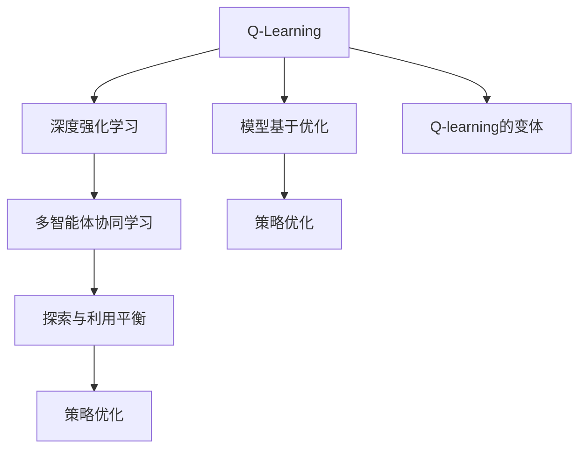

                 

# 一切皆是映射：AI Q-learning未来发展趋势预测

> 关键词：强化学习, Q-learning, AI, 智能系统, 未来发展, 技术预测

## 1. 背景介绍

### 1.1 问题由来

强化学习(Reinforcement Learning, RL)是人工智能领域的经典问题之一，它涉及到智能体在特定环境中通过试错学习最优策略的过程。在这一过程中，智能体根据当前环境状态，采取行动，得到即时反馈，并据此调整后续的行为策略。从智能游戏的AlphaGo到自动驾驶的深度学习策略，强化学习已经在诸多领域展示出强大的应用潜力。

强化学习的核心在于建立智能体与环境之间的动态映射关系。智能体通过不断的试错和探索，最终学习到对环境的准确理解，并能够高效地预测未来的环境变化。这种映射关系不仅仅局限于数字信号处理、机器人控制等传统领域，也在逐步拓展到复杂的自然语言理解和交互、医疗决策、金融投资等新兴领域。

### 1.2 问题核心关键点

强化学习的核心在于如何构建智能体和环境之间的映射，并学习最优策略。其主要问题包括：

- 策略表示：如何高效地表示智能体的策略，使之具有较好的泛化性和可解释性。
- 探索与利用平衡：如何在探索未知和利用已有知识之间取得平衡，避免陷入局部最优。
- 模型与现实差距：如何将模型预测与实际环境中的不确定性有效结合，避免模型过拟合或欠拟合。
- 样本效率：如何以较少的样本数量，高效地学习最优策略。
- 可扩展性：在处理高维环境、连续动作空间等复杂问题时，如何保持算法的效率和鲁棒性。

这些问题共同构成了强化学习的核心挑战，也是未来研究的热点方向。

## 2. 核心概念与联系

### 2.1 核心概念概述

为了更好地理解强化学习的未来发展趋势，我们需要了解一些核心概念：

- **Q-Learning**：Q-Learning是强化学习中最基础的模型之一，用于计算智能体在不同状态-动作对下的价值函数。通过不断优化Q值，智能体学习到最优策略。
- **深度强化学习**：结合深度神经网络与强化学习，通过多层次网络结构进行策略表示和学习。广泛应用于复杂的视觉、自然语言理解和动作控制任务。
- **模型基于优化**：如Policy Gradient、Trust Region Policy Optimization等，通过优化策略函数的参数，使得智能体能够学习到稳定的策略。
- **Q-learning的变体**：如Deep Q-Network (DQN)、Dueling Network、Double Q-Learning等，通过优化Q值的估计和更新，提升Q-Learning的性能和稳定性。
- **多智能体协同学习**：多个智能体在共享或竞争的环境中，通过合作或竞争学习最优策略。多智能体系统广泛应用于无人驾驶、交通控制等领域。
- **策略优化**：如SARSA、SARSA(lambda)等，通过更新状态-动作对的价值函数，优化智能体的策略。
- **探索与利用平衡**：如Epsilon-Greedy、Upper Confidence Bound (UCB)等，通过引入随机性，平衡探索未知和利用已有知识。

这些概念之间的逻辑关系可以通过以下Mermaid流程图来展示：



这个流程图展示了大语言模型微调的关键概念及其之间的关系：

1. Q-Learning是强化学习的基石。
2. 深度强化学习结合神经网络，提升策略表示和学习的性能。
3. 模型基于优化方法进一步优化策略函数。
4. Q-learning的变体通过改进Q值的估计和更新，提升算法性能。
5. 多智能体协同学习使智能体能够与环境中的其他智能体进行交互。
6. 探索与利用平衡策略引入随机性，平衡探索和利用。

这些概念共同构成了强化学习的理论基础，为其未来的发展提供了方向。

## 3. 核心算法原理 & 具体操作步骤
### 3.1 算法原理概述

Q-Learning的核心思想是通过不断更新状态-动作对的Q值，学习到最优策略。假设智能体在环境中的状态为$s$，采取动作$a$，得到即时奖励$r$，并转移到新状态$s'$。Q值定义为：

$$
Q(s, a) = r + \gamma \max_{a'} Q(s', a')
$$

其中$\gamma$为折扣因子，保证长期奖励的价值。

在实际应用中，Q值可以通过以下公式进行更新：

$$
Q(s_t, a_t) = Q(s_t, a_t) + \alpha [r_{t+1} + \gamma \max Q(s_{t+1}, a) - Q(s_t, a_t)]
$$

其中$\alpha$为学习率，$t$为时间步。智能体在每个时间步，通过采样当前状态$s_t$的动作$a_t$，观察即时奖励$r_{t+1}$和转移状态$s_{t+1}$，然后根据Q值更新公式计算Q值，进而更新策略函数。

### 3.2 算法步骤详解

基于Q-Learning的强化学习算法主要包括以下步骤：

**Step 1: 准备环境**

- 构建环境模型，明确状态空间、动作空间和奖励函数。
- 初始化Q值表或神经网络，表示智能体的策略。

**Step 2: 选择动作**

- 从策略函数中随机选择动作$a$，并执行该动作。
- 接收即时奖励$r$，并根据环境转移规则计算新状态$s'$。

**Step 3: 更新Q值**

- 根据当前状态-动作对$(s_t, a_t)$和即时奖励$r_{t+1}$，更新Q值。
- 如果新状态$s_{t+1}$为终止状态，则Q值不再更新。

**Step 4: 策略优化**

- 根据Q值表或神经网络输出动作概率分布。
- 通过Softmax函数，将输出概率转化为动作概率。
- 利用温度$\beta$调整动作概率，平衡探索和利用。

**Step 5: 重复迭代**

- 重复执行Step 2-Step 4，直至达到预设的迭代次数或环境终止条件。
- 输出最终的策略函数，用于指导智能体未来的行为。

### 3.3 算法优缺点

Q-Learning在强化学习中具有以下优点：

1. 简单易懂：Q-Learning算法相对简单，易于理解和实现。
2. 鲁棒性强：Q-Learning在处理非线性、高维环境和连续动作空间时，表现良好。
3. 样本效率高：Q-Learning能够以较少的样本数量，高效地学习最优策略。

同时，该算法也存在一些缺点：

1. 收敛速度慢：Q-Learning需要大量的迭代次数才能收敛。
2. 策略表示能力有限：Q-Learning难以处理复杂的策略表示，难以捕捉策略的层次结构。
3. 过拟合风险：Q-Learning容易过拟合，需要引入正则化技术。
4. 可解释性不足：Q-Learning策略函数的输出难以解释，缺乏可解释性。

尽管存在这些缺点，但Q-Learning依然是强化学习的基础范式，在处理特定问题时依然具有不可替代的优势。未来研究重点在于如何结合其他算法和模型，进一步提升Q-Learning的性能和稳定性。

### 3.4 算法应用领域

Q-Learning已经在诸多领域展示出强大的应用潜力，包括：

- 游戏AI：AlphaGo、Dota 2等游戏中的智能决策系统，通过Q-Learning实现最优策略的探索和利用。
- 机器人控制：无人驾驶、服务机器人等领域，通过Q-Learning优化控制策略。
- 金融投资：量化交易、投资组合优化等任务，通过Q-Learning学习最优交易策略。
- 自然语言处理：对话系统、文本生成、机器翻译等任务，通过Q-Learning优化语言模型。
- 医疗决策：诊断、治疗计划优化等任务，通过Q-Learning学习最优决策策略。
- 物流优化：供应链管理、路径规划等任务，通过Q-Learning优化物流系统。
- 工业控制：智能制造、质量检测等任务，通过Q-Learning优化生产过程。

这些应用场景展示了Q-Learning在实际问题解决中的广泛适用性，未来将继续拓展到更多新兴领域。

## 4. 数学模型和公式 & 详细讲解  
### 4.1 数学模型构建

Q-Learning的核心数学模型为状态-动作对的Q值更新公式。假设智能体在时间步$t$的状态为$s_t$，采取动作$a_t$，得到即时奖励$r_{t+1}$，并转移到新状态$s_{t+1}$。定义Q值函数为$Q(s, a)$，表示在状态$s$下采取动作$a$的即时奖励和未来期望奖励之和。

Q值更新公式如下：

$$
Q(s_t, a_t) = Q(s_t, a_t) + \alpha [r_{t+1} + \gamma \max Q(s_{t+1}, a) - Q(s_t, a_t)]
$$

其中$\alpha$为学习率，$\gamma$为折扣因子。

### 4.2 公式推导过程

在实际应用中，Q值通常由神经网络表示。假设智能体在状态$s_t$下的策略函数为$\pi(a|s_t)$，通过Softmax函数将神经网络输出转化为动作概率分布。则Q值可以表示为：

$$
Q(s_t, a_t) = \int r_{t+1} \pi(a_{t+1}|s_{t+1}) \prod_{i=0}^{t-1} \pi(a_i|s_i) \, dP(s_{t+1})
$$

其中$P(s_{t+1})$表示新状态$s_{t+1}$的转移概率。

将上式展开，并利用指数法则，可得：

$$
Q(s_t, a_t) = \frac{1}{Z} \sum_{a_{t+1}, s_{t+2}, \dots, s_T} \prod_{i=t}^{T-1} \pi(a_i|s_i) \exp \left( \sum_{i=t}^{T-1} [r_i + \gamma \max Q(s_{i+1}, a)] \right)
$$

其中$Z$为归一化因子，确保概率分布总和为1。

这个公式展示了Q值在策略函数和转移概率下的计算方法。在实际应用中，我们通常使用神经网络来近似策略函数，并通过反向传播算法进行优化。

### 4.3 案例分析与讲解

以下我们以AlphaGo为例，解释Q-Learning在复杂环境中的实际应用。

AlphaGo通过Q-Learning算法，在围棋游戏中实现了超越人类顶尖选手的表现。其核心在于：

- 定义状态空间：将棋盘和棋子状态编码为数字序列。
- 定义动作空间：定义所有合法的围棋动作。
- 定义奖励函数：通过规则定义围棋的即时奖励和最终奖励。
- 初始化Q值：通过随机游戏或专家知识，初始化Q值表。
- 执行Q-Learning算法：通过博弈树搜索和价值函数更新，学习最优策略。

在实际应用中，AlphaGo采用蒙特卡罗树搜索(MCTS)来探索最优策略。通过扩展博弈树，并利用Q值表预测后续状态的价值，AlphaGo能够高效地学习到最优的下棋策略。

AlphaGo的成功展示了Q-Learning在复杂环境中的强大能力，未来Q-Learning有望在更多复杂任务中发挥重要作用。

## 5. 项目实践：代码实例和详细解释说明
### 5.1 开发环境搭建

在进行Q-Learning项目实践前，我们需要准备好开发环境。以下是使用Python进行Q-Learning开发的环境配置流程：

1. 安装Anaconda：从官网下载并安装Anaconda，用于创建独立的Python环境。

2. 创建并激活虚拟环境：
```bash
conda create -n q-learning-env python=3.8 
conda activate q-learning-env
```

3. 安装PyTorch：根据CUDA版本，从官网获取对应的安装命令。例如：
```bash
conda install pytorch torchvision torchaudio cudatoolkit=11.1 -c pytorch -c conda-forge
```

4. 安装TensorFlow：由Google主导开发的开源深度学习框架，生产部署方便，适合大规模工程应用。同样有丰富的预训练语言模型资源。

5. 安装各类工具包：
```bash
pip install numpy pandas scikit-learn matplotlib tqdm jupyter notebook ipython
```

完成上述步骤后，即可在`q-learning-env`环境中开始Q-Learning实践。

### 5.2 源代码详细实现

下面我们以Q-Learning算法在简单环境中的应用为例，给出完整的代码实现。

首先，定义Q-Learning的基本类：

```python
import numpy as np
import random

class QLearning:
    def __init__(self, env, alpha=0.1, gamma=0.9, epsilon=0.1, epsilon_min=0.01, episodes=1000):
        self.env = env
        self.alpha = alpha
        self.gamma = gamma
        self.epsilon = epsilon
        self.epsilon_min = epsilon_min
        self.episodes = episodes
        self.q_table = np.zeros((env.observation_space.n, env.action_space.n))
    
    def choose_action(self, state):
        if random.random() < self.epsilon:
            action = env.action_space.sample()
        else:
            action = np.argmax(self.q_table[state, :])
        return action
    
    def update_q_table(self, state, action, reward, next_state):
        best_action = self.choose_action(next_state)
        self.q_table[state, action] += self.alpha * (reward + self.gamma * self.q_table[next_state, best_action] - self.q_table[state, action])
        if self.epsilon > self.epsilon_min:
            self.epsilon *= 0.99
```

然后，定义测试函数：

```python
import gym

env = gym.make('CartPole-v1')
q = QLearning(env)
scores = []
for episode in range(q.episodes):
    state = env.reset()
    score = 0
    while True:
        action = q.choose_action(state)
        next_state, reward, done, _ = env.step(action)
        q.update_q_table(state, action, reward, next_state)
        state = next_state
        score += reward
        if done:
            scores.append(score)
            break
env.close()
print(np.mean(scores))
```

在实际应用中，可以根据具体环境，调整Q-Learning的超参数，如学习率、折扣因子、探索率等，以达到最优效果。

### 5.3 代码解读与分析

让我们再详细解读一下关键代码的实现细节：

**QLearning类**：
- `__init__`方法：初始化环境、超参数和Q值表。
- `choose_action`方法：根据当前状态，随机选择动作或采取Q值最大的动作。
- `update_q_table`方法：根据当前状态-动作对，更新Q值表。

**测试函数**：
- 创建环境，初始化Q-Learning实例。
- 在每个时间步，随机选择动作，观察即时奖励，并根据Q值更新Q值表。
- 累计奖励，并在环境终止时记录分数。

通过这个简单的代码实现，我们可以看到Q-Learning的基本工作流程。Q-Learning算法通过不断更新Q值，逐步学习到最优策略，并通过探索和利用平衡，最大化累计奖励。

## 6. 实际应用场景

### 6.1 自动驾驶

自动驾驶技术是强化学习的重要应用领域之一。在自动驾驶系统中，智能车需要通过传感器获取环境信息，通过强化学习算法学习最优的驾驶策略。

在实际应用中，智能车通过激光雷达、摄像头等传感器，获取当前位置、速度、周围车辆和行人等信息。定义状态空间为车辆位置和速度，动作空间为加速、刹车、转向等动作。定义奖励函数为避免碰撞、保持车流稳定等指标。通过Q-Learning算法，智能车学习到最优驾驶策略，能够在复杂交通环境中安全稳定地行驶。

### 6.2 机器人控制

机器人控制是Q-Learning的另一重要应用领域。在机器人控制中，Q-Learning用于学习最优的控制策略。

在实际应用中，机器人通过传感器获取环境信息，如位置、姿态、障碍物等。定义状态空间为机器人的位置和姿态，动作空间为电机控制信号。定义奖励函数为任务完成度、障碍物避让等指标。通过Q-Learning算法，机器人学习到最优控制策略，能够在各种环境中高效完成任务。

### 6.3 金融投资

金融投资是Q-Learning的典型应用之一。在金融投资中，智能交易系统通过Q-Learning学习最优的交易策略。

在实际应用中，智能交易系统通过历史交易数据、市场趋势等信息，定义状态空间为市场指数、股票价格等，动作空间为买入、卖出、持有等交易策略。定义奖励函数为交易收益。通过Q-Learning算法，智能交易系统学习到最优的交易策略，能够在复杂市场环境中最大化收益。

### 6.4 未来应用展望

随着Q-Learning技术的不断进步，其在更多领域将得到广泛应用，为实际问题解决提供新的思路和方法。

在智慧医疗领域，Q-Learning可以用于辅助诊断和治疗方案优化，提高医疗服务的智能化水平。

在智能教育领域，Q-Learning可以用于智能推荐系统，根据学生的历史学习数据，推荐个性化的学习内容，提升学习效果。

在智慧城市治理中，Q-Learning可以用于交通流量控制、公共资源优化等，提高城市管理的智能化水平。

此外，在企业生产、社会治理、文娱传媒等众多领域，Q-Learning技术也将不断涌现，为NLP技术带来新的突破。

## 7. 工具和资源推荐
### 7.1 学习资源推荐

为了帮助开发者系统掌握Q-Learning的理论基础和实践技巧，这里推荐一些优质的学习资源：

1. 《强化学习》系列博文：由大模型技术专家撰写，深入浅出地介绍了强化学习的基本概念和经典模型。

2. CS234《深度学习与强化学习》课程：斯坦福大学开设的强化学习明星课程，有Lecture视频和配套作业，带你入门强化学习领域的基本概念和经典模型。

3. 《深度学习》书籍：Ian Goodfellow、Yoshua Bengio和Aaron Courville合著的经典书籍，全面介绍了深度学习和强化学习的基本原理和算法。

4. OpenAI Gym：开源的强化学习环境，提供了丰富的环境库，方便开发者进行模型测试和实验。

5. GitHub上的开源项目：GitHub上大量的开源Q-Learning项目，提供了丰富的案例和代码实现，供开发者学习和参考。

通过对这些资源的学习实践，相信你一定能够快速掌握Q-Learning的精髓，并用于解决实际的强化学习问题。

### 7.2 开发工具推荐

高效的开发离不开优秀的工具支持。以下是几款用于Q-Learning开发的常用工具：

1. PyTorch：基于Python的开源深度学习框架，灵活动态的计算图，适合快速迭代研究。大部分预训练语言模型都有PyTorch版本的实现。

2. TensorFlow：由Google主导开发的开源深度学习框架，生产部署方便，适合大规模工程应用。同样有丰富的预训练语言模型资源。

3. OpenAI Gym：开源的强化学习环境，提供了丰富的环境库，方便开发者进行模型测试和实验。

4. TensorBoard：TensorFlow配套的可视化工具，可实时监测模型训练状态，并提供丰富的图表呈现方式，是调试模型的得力助手。

5. Weights & Biases：模型训练的实验跟踪工具，可以记录和可视化模型训练过程中的各项指标，方便对比和调优。

6. Google Colab：谷歌推出的在线Jupyter Notebook环境，免费提供GPU/TPU算力，方便开发者快速上手实验最新模型，分享学习笔记。

合理利用这些工具，可以显著提升Q-Learning任务的开发效率，加快创新迭代的步伐。

### 7.3 相关论文推荐

Q-Learning技术的发展得益于学界的持续研究。以下是几篇奠基性的相关论文，推荐阅读：

1. Q-Learning：用强化学习算法训练人工智能游戏（Q-Learning: A New Approach to General Game Playing）：通过Q-Learning算法，DeepMind在围棋、星际争霸等游戏中取得了显著的成绩。

2. 学习表示与强化学习（Learning to Learn）：提出了一种通用的强化学习框架，用于学习最优策略。

3. 强化学习：基础与挑战（Reinforcement Learning: An Introduction）：详细介绍了强化学习的基本概念和算法，是强化学习的经典教材。

4. 深度强化学习：代理学习在人类游戏棋类游戏中的应用（Deep Reinforcement Learning in Human-Competitive Games）：展示了深度强化学习在人类游戏中的应用。

5. 强化学习基础：多智能体系统（Reinforcement Learning: Foundations of Adaptive Behavior）：介绍了多智能体系统的强化学习算法。

这些论文代表了大语言模型微调技术的发展脉络。通过学习这些前沿成果，可以帮助研究者把握学科前进方向，激发更多的创新灵感。

## 8. 总结：未来发展趋势与挑战

### 8.1 总结

本文对Q-Learning算法的基本原理和实际应用进行了详细讲解。Q-Learning通过不断更新Q值，逐步学习到最优策略，并在复杂环境中找到最佳的解决方案。Q-Learning在自动驾驶、机器人控制、金融投资等领域展示了强大的应用潜力，未来将继续拓展到更多新兴领域。

通过本文的系统梳理，可以看到，Q-Learning算法在解决实际问题时具备不可替代的优势，是强化学习的基础范式。未来需要结合其他算法和模型，进一步提升Q-Learning的性能和稳定性。

### 8.2 未来发展趋势

展望未来，Q-Learning技术将呈现以下几个发展趋势：

1. 多智能体系统：多智能体系统将进一步发展，智能体之间的协同学习将提升系统的效率和鲁棒性。

2. 分布式强化学习：通过分布式训练，提升模型在处理大规模环境中的性能。

3. 深度强化学习：深度强化学习将进一步发展，通过多层次神经网络结构提升策略表示和学习的性能。

4. 策略优化：策略优化方法将进一步发展，通过优化策略函数的参数，提高模型的稳定性。

5. 探索与利用平衡：探索与利用平衡策略将进一步优化，通过引入更加精细化的探索机制，提高模型对未知环境的适应能力。

6. 强化学习与深度学习结合：强化学习与深度学习的结合将更加紧密，通过神经网络优化Q值函数，提升模型的性能。

7. 强化学习在多模态数据中的应用：强化学习将在处理多模态数据（如图像、语音、文本等）时展现出更大潜力。

8. 强化学习在医疗、金融等高风险领域的应用：强化学习将在医疗、金融等高风险领域展现出更大的应用潜力。

以上趋势凸显了Q-Learning技术的广阔前景，这些方向的探索发展，必将进一步提升Q-Learning算法的性能和应用范围。

### 8.3 面临的挑战

尽管Q-Learning技术已经取得了瞩目成就，但在迈向更加智能化、普适化应用的过程中，它仍面临着诸多挑战：

1. 样本效率：Q-Learning需要大量的样本才能学习到最优策略，如何在高维环境和连续动作空间中，提升样本效率，将是未来需要解决的重要问题。

2. 可解释性：Q-Learning模型难以解释其内部工作机制和决策逻辑，如何在保证性能的同时，提高模型的可解释性，也是未来需要解决的重要问题。

3. 安全性：Q-Learning模型容易学习到有害的行为策略，如何确保模型的安全性，避免有害的决策输出，将是未来需要解决的重要问题。

4. 算法复杂性：Q-Learning算法的复杂性随环境复杂度的增加而增加，如何设计更加高效的算法框架，提升算法的可扩展性和鲁棒性，将是未来需要解决的重要问题。

5. 模型优化：Q-Learning模型在处理大规模数据时，容易过拟合，如何设计更加稳定的模型优化策略，避免过拟合，将是未来需要解决的重要问题。

6. 鲁棒性：Q-Learning模型在处理多变和不确定的环境时，容易表现出不稳定性，如何提高模型的鲁棒性，将是未来需要解决的重要问题。

7. 分布式计算：在处理大规模环境时，需要分布式计算支持，如何设计高效的分布式计算框架，提升算法的效率和稳定性，将是未来需要解决的重要问题。

以上挑战将推动Q-Learning技术不断突破，提升其在实际问题解决中的能力。

### 8.4 研究展望

面对Q-Learning面临的挑战，未来的研究需要在以下几个方面寻求新的突破：

1. 探索无监督和半监督强化学习方法。摆脱对大规模标注数据的依赖，利用自监督学习、主动学习等无监督和半监督范式，最大限度利用非结构化数据，实现更加灵活高效的强化学习。

2. 研究参数高效的强化学习方法。开发更加参数高效的强化学习方法，在固定大部分预训练参数的同时，只更新极少量的任务相关参数。

3. 融合因果和对比学习范式。通过引入因果推断和对比学习思想，增强强化学习模型建立稳定因果关系的能力，学习更加普适、鲁棒的环境表征，从而提升模型泛化性和抗干扰能力。

4. 引入更多先验知识。将符号化的先验知识，如知识图谱、逻辑规则等，与神经网络模型进行巧妙融合，引导强化学习过程学习更准确、合理的策略。

5. 结合因果分析和博弈论工具。将因果分析方法引入强化学习模型，识别出模型决策的关键特征，增强输出解释的因果性和逻辑性。借助博弈论工具刻画人机交互过程，主动探索并规避模型的脆弱点，提高系统稳定性。

6. 纳入伦理道德约束。在强化学习模型的训练目标中引入伦理导向的评估指标，过滤和惩罚有害的输出倾向。同时加强人工干预和审核，建立模型行为的监管机制，确保输出符合人类价值观和伦理道德。

这些研究方向的探索，必将引领Q-Learning技术迈向更高的台阶，为构建安全、可靠、可解释、可控的智能系统铺平道路。面向未来，Q-Learning技术还需要与其他人工智能技术进行更深入的融合，如知识表示、因果推理、强化学习等，多路径协同发力，共同推动自然语言理解和智能交互系统的进步。只有勇于创新、敢于突破，才能不断拓展强化学习算法的边界，让智能技术更好地造福人类社会。

## 9. 附录：常见问题与解答

**Q1：Q-Learning算法如何处理连续动作空间？**

A: 处理连续动作空间是Q-Learning的挑战之一。通常采用深度神经网络对动作空间进行编码，通过多层网络结构逼近连续动作空间。另外，也可以使用多臂赌博机（Multi-Armed Bandit）等方法，将连续动作空间离散化，通过Q-Learning算法学习最优动作策略。

**Q2：Q-Learning算法如何处理高维状态空间？**

A: 高维状态空间是Q-Learning的另一大挑战。通常采用特征提取方法，将高维状态空间映射到低维空间。另外，也可以使用卷积神经网络（CNN）、自编码器（AE）等方法，通过网络结构对高维状态空间进行编码。

**Q3：Q-Learning算法如何处理稀疏奖励？**

A: 稀疏奖励是Q-Learning在实际应用中的常见问题。稀疏奖励容易导致探索和利用的不平衡，降低算法的性能。解决方法包括引入奖励重构、学习时间差分奖励等技术。

**Q4：Q-Learning算法如何处理动态环境？**

A: 动态环境是Q-Learning的常见问题之一。动态环境使得环境状态和奖励函数随时间变化，难以进行有效的策略学习。解决方法包括引入在线学习算法、时间差分学习等技术。

**Q5：Q-Learning算法如何处理复杂环境？**

A: 复杂环境是Q-Learning的另一大挑战。复杂环境通常包含大量的变量和交互作用，难以进行有效的策略学习。解决方法包括引入模型预测、蒙特卡罗树搜索（MCTS）等技术。

通过上述常见问题的解答，我们可以更好地理解Q-Learning算法的应用细节和优化策略，推动其在更多实际问题中的应用。

---

作者：禅与计算机程序设计艺术 / Zen and the Art of Computer Programming

