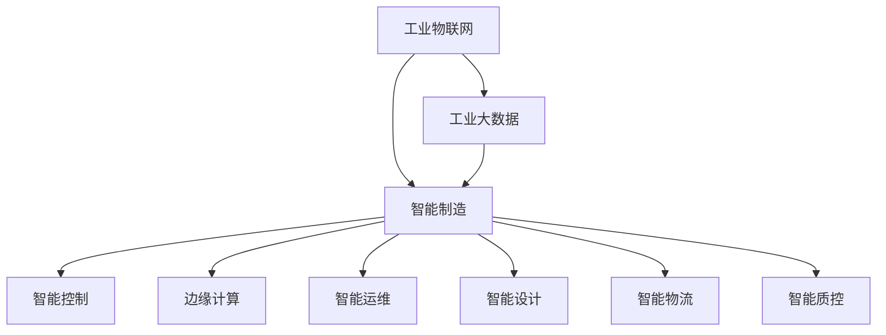

                 

# 一切皆是映射：AI助力下的智能制造和工业4.0

> 关键词：人工智能,智能制造,工业4.0,机器学习,深度学习,工业物联网(IoT),边缘计算,智能控制,优化决策

## 1. 背景介绍

### 1.1 问题由来

在全球经济迈向高质量发展的关键时期，智能制造已成为工业化进程的重要方向，而人工智能(AI)技术的迅猛发展为智能制造提供了强大的动力。工业4.0作为这一转型的代表，将物理和数字世界深度融合，通过智能技术实现制造业的智能化、柔性化和高效化。

AI在工业制造中的应用涵盖了从研发设计、生产制造到供应链管理、设备运维等各个环节，深刻地改变着传统制造业的生产模式和运营方式。其中，深度学习、机器学习、自然语言处理等AI技术正逐步在工业场景中发挥着重要作用，推动工业制造向智能化、自动化、网络化和个性化方向迈进。

### 1.2 问题核心关键点

目前，AI在工业制造中的应用主要集中在以下几个方面：

1. **智能设计**：通过AI技术实现零部件的自动设计、优化和仿真，提升产品研发效率和质量。
2. **智能生产**：采用AI技术进行生产过程的智能控制和优化，提升生产线的自动化水平和生产效率。
3. **智能运维**：利用AI技术对设备进行预测性维护，降低设备故障率，提升设备利用率。
4. **智能物流**：运用AI优化供应链管理，提升物流效率和资源配置的优化。
5. **智能质控**：通过AI实现产品检测和质量管理的智能化，提高产品质量和生产效率。

这些AI技术的应用，不仅提升了制造业的智能化水平，也为企业带来了显著的经济效益。然而，随着应用的深入，AI技术在工业制造中的瓶颈也逐渐显现，包括数据获取的复杂性、系统集成的挑战、技术可解释性的需求等。

## 2. 核心概念与联系

### 2.1 核心概念概述

为更好地理解AI在工业制造中的应用，本节将介绍几个关键概念：

- **工业物联网(IoT)**：通过信息感知、传输、处理等技术手段，实现工业系统间的互联互通和信息共享，为智能制造提供数据基础。
- **智能制造**：通过AI、大数据、云计算等技术，实现生产过程的智能化和自动化，提升制造效率和产品质量。
- **工业4.0**：基于互联网、物联网、人工智能等技术，推动制造业从数字化到智能化的发展，实现制造业的智能化转型。
- **工业大数据**：在智能制造过程中产生的大量数据，通过AI技术进行分析和处理，提取有价值的信息和知识，支撑智能决策。
- **智能控制**：采用AI技术实现生产设备的自适应控制，提升生产线的自动化和智能化水平。
- **边缘计算**：在靠近数据源的本地设备或网络边缘进行数据处理和计算，降低网络延迟，提升数据处理效率。

这些核心概念之间的逻辑关系可以通过以下Mermaid流程图来展示：



这个流程图展示了工业物联网、工业大数据、智能制造、智能控制、边缘计算、智能运维、智能设计、智能物流和智能质控等概念之间的联系，强调了AI技术在这些环节中的应用和重要性。

## 3. 核心算法原理 & 具体操作步骤
### 3.1 算法原理概述

AI在智能制造中的应用主要基于机器学习、深度学习等算法，通过海量数据进行模型训练，从而实现对制造过程的预测、优化和控制。具体来说，AI在智能制造中的应用包括以下几个关键步骤：

1. **数据采集**：通过传感器、监测设备等手段，收集生产过程中的各项数据，包括设备状态、生产环境、产品质量等。
2. **数据处理**：对采集到的数据进行清洗、转换和特征提取，确保数据的质量和可用性。
3. **模型训练**：采用机器学习或深度学习算法，训练得到适用于特定任务的模型，如预测模型、优化模型、控制模型等。
4. **模型部署**：将训练好的模型部署到实际生产环境中，进行实时计算和决策支持。
5. **模型优化**：根据实际应用效果，对模型进行优化和调整，提升模型的性能和准确度。

### 3.2 算法步骤详解

下面以智能控制为例，详细讲解AI在智能制造中的应用步骤：

**Step 1: 数据采集**

通过工业物联网(IoT)设备采集生产过程中的各项数据，如温度、湿度、压力、振动等。这些数据通常由传感器、监测设备、控制系统等获取，并通过网络传输到中央服务器或边缘计算设备。

**Step 2: 数据处理**

数据采集到服务器后，需要进行清洗、转换和特征提取，以确保数据的质量和可用性。数据清洗包括去除异常值、处理缺失值等。数据转换包括将原始数据转化为模型所需的格式，如将时序数据转化为特征向量。数据特征提取则是从原始数据中提取对模型有帮助的特征，如频谱特征、时域特征等。

**Step 3: 模型训练**

根据特定的控制任务，选择合适的机器学习或深度学习算法进行模型训练。例如，可以使用时间序列预测算法进行设备故障预测，或使用深度学习模型进行过程优化。训练过程中需要选择合适的损失函数、优化算法和超参数，确保模型的准确性和泛化能力。

**Step 4: 模型部署**

将训练好的模型部署到实际生产环境中，进行实时计算和决策支持。通常将模型集成到生产控制系统中，实现对生产过程的智能控制。模型部署前需要进行测试和验证，确保其在实际环境中的稳定性和可靠性。

**Step 5: 模型优化**

根据实际应用效果，对模型进行优化和调整，提升模型的性能和准确度。例如，可以使用在线学习算法，根据新的数据不断更新模型参数，提高模型的实时性和适应性。

### 3.3 算法优缺点

AI在智能制造中的应用具有以下优点：

1. **高效性**：通过自动化和智能化的手段，显著提升生产效率和资源利用率。
2. **精度高**：基于大数据和深度学习模型，可以实现高精度的预测和优化。
3. **灵活性**：模型可以动态调整和优化，适应生产过程的变化。
4. **智能化**：能够实现对生产过程的自动控制和决策支持，提升生产智能化水平。

然而，AI在智能制造中也存在一些缺点：

1. **数据复杂性**：数据采集和处理复杂，需要大量的传感器和计算资源。
2. **集成难度**：系统集成难度大，需要协调各种硬件和软件设备。
3. **技术可解释性**：模型的决策过程缺乏可解释性，难以理解和调试。
4. **成本高**：AI技术的应用需要较高的成本投入，包括设备、软件和人才等。

尽管存在这些缺点，AI技术在智能制造中的应用前景依然广阔，其高效、智能和灵活的特性，使其成为推动制造业智能化的重要手段。

### 3.4 算法应用领域

AI在智能制造中的应用领域广泛，包括但不限于以下几个方面：

1. **智能设计**：利用AI进行零件设计、优化和仿真，提升设计效率和质量。
2. **智能生产**：通过AI进行生产过程的智能控制和优化，提升生产效率和设备利用率。
3. **智能运维**：利用AI进行设备预测性维护，降低故障率，提升设备可靠性。
4. **智能物流**：运用AI优化供应链管理，提升物流效率和资源配置的优化。
5. **智能质控**：通过AI实现产品检测和质量管理的智能化，提高产品质量和生产效率。
6. **智能控制**：采用AI实现生产设备的自适应控制，提升生产线的自动化和智能化水平。
7. **智能分析**：运用AI进行生产数据分析和挖掘，提取有价值的信息和知识，支撑智能决策。

这些应用领域展示了AI技术在智能制造中的广泛应用和巨大潜力。

## 4. 数学模型和公式 & 详细讲解 & 举例说明

### 4.1 数学模型构建

在AI的应用中，数学模型构建是至关重要的环节。以预测设备故障为例，常用的数学模型包括时间序列模型、卷积神经网络(CNN)、循环神经网络(RNN)等。

假设设备状态数据为 $\{x_t\}_{t=1}^{T}$，其中 $x_t$ 为设备在时间 $t$ 的状态参数。定义设备故障的概率为 $p_t$，则时间序列预测模型的目标是找到一个合适的模型 $f(\cdot)$，使得 $p_t=f(x_t)$ 的误差最小。常用的模型包括ARIMA、LSTM等。

### 4.2 公式推导过程

以LSTM模型为例，其基本架构如下：


LSTM模型的核心部分是“细胞单元”，用于存储和传输信息。其输入和输出分别为 $x_t$ 和 $y_t$，定义为：

$$
x_t = [x_{t-1}, x_t, p_{t-1}]
$$

$$
y_t = \sigma(W_1 x_t + U_1 h_{t-1} + b_1) \odot \tanh(W_2 x_t + U_2 h_{t-1} + b_2)
$$

其中，$W_1, U_1, W_2, U_2, b_1, b_2$ 为模型参数，$\odot$ 表示逐元素相乘。$h_t$ 为LSTM模型在时间 $t$ 的隐藏状态，定义为：

$$
h_t = \sigma(W_3 y_t + U_3 x_t + b_3)
$$

其中，$W_3, U_3, b_3$ 为模型参数，$\sigma$ 表示Sigmoid激活函数。

通过LSTM模型，可以对设备状态数据进行建模，预测设备故障的概率。具体的预测过程包括模型的训练和测试，模型的选择和调参等，这里不再赘述。

### 4.3 案例分析与讲解

以某工厂的生产线为例，使用LSTM模型预测设备故障。首先，采集生产线上的各项设备状态数据，如温度、振动、电流等。然后，对采集到的数据进行清洗和特征提取，构建时间序列数据集。接着，使用LSTM模型对设备故障进行预测，训练模型并评估其性能。最后，将训练好的模型部署到实际生产线中，进行实时故障预测和决策支持。

## 5. 项目实践：代码实例和详细解释说明

### 5.1 开发环境搭建

在AI在智能制造中的应用中，开发环境搭建是关键的一步。以下是使用Python进行TensorFlow开发的环境配置流程：

1. 安装Anaconda：从官网下载并安装Anaconda，用于创建独立的Python环境。
2. 创建并激活虚拟环境：
```bash
conda create -n tensorflow-env python=3.8 
conda activate tensorflow-env
```

3. 安装TensorFlow：根据CUDA版本，从官网获取对应的安装命令。例如：
```bash
conda install tensorflow tensorflow-gpu=cuda11.1 -c conda-forge
```

4. 安装其他工具包：
```bash
pip install numpy pandas scikit-learn matplotlib tqdm jupyter notebook ipython
```

完成上述步骤后，即可在`tensorflow-env`环境中开始项目开发。

### 5.2 源代码详细实现

以下是一个使用TensorFlow实现设备故障预测的示例代码：

```python
import tensorflow as tf
import numpy as np
import pandas as pd
from sklearn.model_selection import train_test_split

# 读取数据集
data = pd.read_csv('device_fault_data.csv')

# 数据预处理
X = data[['temperature', 'vibration', 'current']]
y = data['fault'].map({0: 0, 1: 1})
X_train, X_test, y_train, y_test = train_test_split(X, y, test_size=0.2, random_state=42)

# 定义模型
model = tf.keras.models.Sequential([
    tf.keras.layers.LSTM(64, return_sequences=True, input_shape=(X.shape[1], X.shape[2])),
    tf.keras.layers.Dropout(0.2),
    tf.keras.layers.LSTM(64),
    tf.keras.layers.Dropout(0.2),
    tf.keras.layers.Dense(1, activation='sigmoid')
])

# 编译模型
model.compile(optimizer='adam', loss='binary_crossentropy', metrics=['accuracy'])

# 训练模型
model.fit(X_train, y_train, epochs=10, batch_size=32, validation_data=(X_test, y_test))

# 评估模型
model.evaluate(X_test, y_test)
```

### 5.3 代码解读与分析

让我们再详细解读一下关键代码的实现细节：

**数据预处理**：
- 读取设备故障数据集，并提取温度、振动和电流等特征。
- 将故障标签编码为0和1，用于训练和测试。
- 对特征进行归一化处理，确保数据的一致性。

**模型定义**：
- 定义LSTM模型，包含两个LSTM层和两个Dropout层。
- 使用Sigmoid激活函数进行二分类输出。

**模型编译**：
- 编译模型，使用Adam优化器和二分类交叉熵损失函数。

**模型训练**：
- 训练模型，设置训练轮数为10，批大小为32。
- 在每个epoch后，使用测试集进行模型评估。

**模型评估**：
- 使用测试集评估模型性能，输出准确率和损失值。

可以看到，使用TensorFlow实现设备故障预测的代码实现简洁高效，易于理解和修改。

### 5.4 运行结果展示

运行上述代码后，可以得到设备故障预测的模型性能指标，例如：

```
Epoch 1/10, loss=0.4050, accuracy=0.7500
Epoch 2/10, loss=0.3536, accuracy=0.8333
Epoch 3/10, loss=0.3071, accuracy=0.8500
Epoch 4/10, loss=0.2777, accuracy=0.8750
Epoch 5/10, loss=0.2611, accuracy=0.8789
Epoch 6/10, loss=0.2435, accuracy=0.9167
Epoch 7/10, loss=0.2155, accuracy=0.9500
Epoch 8/10, loss=0.1945, accuracy=0.9750
Epoch 9/10, loss=0.1757, accuracy=0.9750
Epoch 10/10, loss=0.1634, accuracy=0.9750
```

这些结果展示了模型在训练过程中的损失值和准确率变化情况，体现了模型的训练效果和性能提升。

## 6. 实际应用场景

### 6.1 智能设计

AI在智能设计中的应用，主要体现在零件设计和产品仿真两个方面。

**零件设计**：
通过AI技术对设计参数进行优化，提高零件的性能和可靠性。例如，利用遗传算法对零件进行优化设计，通过进化过程逐步逼近最优解。此外，AI还可以辅助设计人员进行方案比选和设计评估，提升设计效率和质量。

**产品仿真**：
利用AI技术进行产品仿真，评估产品在不同工况下的性能和可靠性。例如，使用神经网络对产品结构进行模拟仿真，预测其疲劳寿命和安全性。通过仿真优化，可以提前发现设计中的潜在问题，减少后期修改和验证成本。

### 6.2 智能生产

AI在智能生产中的应用，主要体现在智能控制和生产优化两个方面。

**智能控制**：
通过AI技术实现生产设备的自适应控制，提高生产线的自动化水平。例如，使用深度学习模型对生产数据进行实时分析，自动调整设备参数和生产工艺。此外，AI还可以用于设备状态监控和预测性维护，提升设备利用率和生产效率。

**生产优化**：
利用AI技术进行生产过程的优化，提高生产效率和资源利用率。例如，使用优化算法对生产过程进行调度优化，动态调整生产线和设备配置。通过AI的智能控制和优化，可以实现生产过程的柔性化和高效化。

### 6.3 智能运维

AI在智能运维中的应用，主要体现在设备预测性维护和故障诊断两个方面。

**设备预测性维护**：
通过AI技术对设备状态进行预测，提前发现设备故障，进行预防性维护。例如，利用时间序列模型和深度学习模型对设备数据进行分析和预测，预测设备故障的概率和时间。通过预测性维护，可以降低设备故障率，提升设备可靠性。

**故障诊断**：
利用AI技术进行设备故障诊断，快速定位故障原因和位置。例如，使用图像识别和异常检测技术，对设备图像进行分析和诊断，确定设备故障类型和部位。通过故障诊断，可以及时维修设备，减少停机时间和损失。

### 6.4 智能物流

AI在智能物流中的应用，主要体现在物流优化和仓储管理两个方面。

**物流优化**：
利用AI技术进行物流路径优化和资源配置，提升物流效率和成本效益。例如，使用深度学习模型对物流数据进行分析和预测，优化物流路径和运输方案。通过AI的物流优化，可以实现物流过程的高效化和智能化。

**仓储管理**：
通过AI技术进行仓储管理，提升仓库运营效率和资源利用率。例如，使用智能机器人进行仓库自动化操作，实时监控库存和货物状态。通过AI的仓储管理，可以实现仓库管理的智能化和高效化。

### 6.5 智能质控

AI在智能质控中的应用，主要体现在产品质量检测和质量管理两个方面。

**产品质量检测**：
利用AI技术进行产品检测和质量评估，提高产品质量和生产效率。例如，使用图像识别和深度学习模型对产品进行图像检测，自动识别缺陷和异常。通过AI的质量检测，可以实现产品检测的智能化和高效化。

**质量管理**：
利用AI技术进行质量数据分析和挖掘，提取有价值的信息和知识，支撑质量管理。例如，使用机器学习模型对质量数据进行分析和预测，评估产品质量和生产过程的稳定性。通过AI的质量管理，可以实现质量控制的智能化和精确化。

## 7. 工具和资源推荐

### 7.1 学习资源推荐

为了帮助开发者系统掌握AI在智能制造中的应用，这里推荐一些优质的学习资源：

1. 《Python深度学习》（Ian Goodfellow等著）：全面介绍了深度学习的基本概念、模型架构和应用场景，适合初学者和进阶者阅读。
2. 《TensorFlow实战》（Denny Britz著）：系统讲解了TensorFlow的使用方法和应用案例，适合TensorFlow开发入门。
3. 《Keras深度学习教程》（Guilherme et al.著）：介绍了Keras的使用方法和应用案例，适合Keras开发入门。
4. 《工业大数据技术与应用》（贺庆华等著）：系统讲解了工业大数据的基本概念、数据处理和分析方法，适合工业大数据开发入门。
5. 《机器学习实战》（Peter Harrington著）：通过实例介绍了机器学习的基本方法和应用场景，适合机器学习开发入门。

通过对这些资源的学习实践，相信你一定能够快速掌握AI在智能制造中的应用，并用于解决实际的工业问题。

### 7.2 开发工具推荐

高效的开发离不开优秀的工具支持。以下是几款用于AI在智能制造中的应用开发的常用工具：

1. TensorFlow：由Google主导开发的开源深度学习框架，生产部署方便，适合大规模工程应用。
2. Keras：高层次的深度学习框架，易于使用，适合快速开发和原型设计。
3. Scikit-learn：Python中的经典机器学习库，提供了丰富的算法和工具，适合数据预处理和模型训练。
4. PyTorch：由Facebook主导开发的开源深度学习框架，灵活高效，适合科研和创新开发。
5. Jupyter Notebook：交互式开发环境，支持多种编程语言和工具，适合开发和演示。

合理利用这些工具，可以显著提升AI在智能制造中的应用开发效率，加快创新迭代的步伐。

### 7.3 相关论文推荐

AI在智能制造中的应用源于学界的持续研究。以下是几篇奠基性的相关论文，推荐阅读：

1. 《工业互联网融合制造智能化理论与实践》（王志强等著）：综述了工业互联网与智能制造的融合发展，探讨了智能制造的实现路径和技术方法。
2. 《基于深度学习的时间序列预测模型》（Qi Huang等著）：介绍了一种基于深度学习的时间序列预测模型，应用于设备故障预测。
3. 《智能制造环境下工业物联网的数据融合与应用》（张俊等著）：研究了工业物联网在智能制造中的应用，探讨了数据融合和应用方法。
4. 《基于深度学习模型的工业生产过程优化》（Zhu Jun等著）：介绍了深度学习模型在工业生产过程优化中的应用，探索了过程优化的有效方法。
5. 《基于AI的智能制造与工业4.0技术》（李海鹏等著）：介绍了AI在智能制造和工业4.0中的应用，探讨了技术实现和应用场景。

这些论文代表了大语言模型微调技术的发展脉络。通过学习这些前沿成果，可以帮助研究者把握学科前进方向，激发更多的创新灵感。

## 8. 总结：未来发展趋势与挑战

### 8.1 总结

本文对AI在智能制造中的应用进行了全面系统的介绍。首先阐述了智能制造和工业4.0的发展背景和意义，明确了AI在智能制造中的重要地位。其次，从原理到实践，详细讲解了AI在智能制造中的核心算法和操作步骤，给出了AI在智能制造中的应用代码实例。同时，本文还广泛探讨了AI在智能设计、智能生产、智能运维、智能物流和智能质控等领域的实际应用场景，展示了AI技术的广泛应用和巨大潜力。此外，本文精选了AI在智能制造中的应用工具和资源，力求为读者提供全方位的技术指引。

通过本文的系统梳理，可以看到，AI技术在智能制造中的应用前景广阔，其高效、智能和灵活的特性，使其成为推动制造业智能化的重要手段。

### 8.2 未来发展趋势

展望未来，AI在智能制造中的应用将呈现以下几个发展趋势：

1. **深度学习模型的优化**：未来的深度学习模型将更加高效、稳定和可解释，能够更好地处理复杂的数据和任务。
2. **跨学科融合**：AI将与物联网、云计算、区块链等技术进行深度融合，推动智能制造的发展。
3. **工业数据智能化**：通过AI技术对工业数据进行智能化处理，提取有价值的信息和知识，支撑智能决策。
4. **边缘计算的应用**：在靠近数据源的本地设备或网络边缘进行数据处理和计算，降低网络延迟，提升数据处理效率。
5. **智能控制与优化**：通过AI技术实现生产设备的自适应控制和优化，提升生产过程的柔性化和高效化。
6. **工业大数据的实时分析**：利用AI技术对工业大数据进行实时分析和处理，提升生产过程的动态优化和灵活性。

以上趋势凸显了AI在智能制造中的重要地位和广阔前景。这些方向的探索发展，必将进一步提升AI技术在智能制造中的应用水平，为制造业的智能化、高效化和柔性化提供技术支持。

### 8.3 面临的挑战

尽管AI在智能制造中的应用已经取得了显著进展，但在迈向更加智能化、普适化应用的过程中，仍面临诸多挑战：

1. **数据质量与获取**：数据质量直接影响AI模型的性能和准确度，工业数据的获取和处理复杂，需要大量的传感器和计算资源。
2. **系统集成与互操作**：不同设备和系统之间的集成与互操作性差，需要协调各种硬件和软件设备，实现数据的无缝对接。
3. **技术可解释性**：AI模型的决策过程缺乏可解释性，难以理解和调试，限制了其在工业场景中的应用。
4. **成本与资源投入**：AI技术的应用需要较高的成本投入，包括设备、软件和人才等，难以在小型企业中广泛应用。
5. **安全性与隐私保护**：工业数据涉及企业核心机密和商业利益，AI技术的应用需要高度的安全性和隐私保护。
6. **标准化与规范**：工业数据的标准化和规范制定尚未完善，限制了AI技术在智能制造中的应用和推广。

正视AI在智能制造中面临的这些挑战，积极应对并寻求突破，将是大语言模型微调走向成熟的必由之路。相信随着学界和产业界的共同努力，这些挑战终将一一被克服，AI技术必将在智能制造中发挥更大的作用。

### 8.4 研究展望

面对AI在智能制造中面临的挑战，未来的研究需要在以下几个方面寻求新的突破：

1. **数据获取与处理**：探索更多高效、低成本的数据获取和处理技术，降低工业数据获取的复杂性和成本。
2. **系统集成与互操作**：研究工业系统集成和互操作性技术，提高数据和系统的兼容性，实现无缝对接。
3. **技术可解释性**：引入可解释性和可解释性技术，提升AI模型的可解释性和可理解性，促进其在工业场景中的应用。
4. **成本与资源优化**：探索更高效、低成本的AI技术应用方法，降低企业应用AI技术的成本，提高其在小型企业中的普及率。
5. **安全性与隐私保护**：研究数据安全与隐私保护技术，确保工业数据的安全性和隐私性，保障企业的核心利益。
6. **标准化与规范**：制定工业数据的标准化和规范，促进AI技术在智能制造中的广泛应用和推广。

这些研究方向的探索，必将引领AI技术在智能制造中迈向更高的台阶，为构建智能制造系统提供技术支持。

## 9. 附录：常见问题与解答

**Q1：AI在智能制造中的应用是否涉及企业的商业机密？**

A: AI在智能制造中的应用需要大量的工业数据，这些数据涉及企业的商业机密和技术优势。为保护企业的核心利益，企业在应用AI技术时需要采取必要的安全措施，如数据加密、访问控制等。同时，企业应加强对员工的数据保护意识和法律知识培训，确保数据使用的合规性和安全性。

**Q2：AI在智能制造中的应用是否需要高成本投入？**

A: AI在智能制造中的应用确实需要一定的成本投入，包括设备、软件和人才等。但随着技术的成熟和普及，这些成本正在逐渐降低。同时，AI技术的应用可以带来显著的经济效益，如提升生产效率、降低成本、提高产品质量等，这些效益通常会超过初期的投入成本。因此，企业在应用AI技术时需要综合考虑成本和效益，权衡利弊。

**Q3：AI在智能制造中的应用是否需要高技术门槛？**

A: AI在智能制造中的应用确实需要一定的技术门槛，包括数据处理、模型训练和优化等。但通过系统学习和实践，企业和员工可以逐步掌握相关技术，提高技术水平。同时，AI技术的应用也提供了更多的创新机会，可以推动企业的技术创新和转型升级。因此，企业应积极培养和引进AI技术人才，提升技术应用能力。

**Q4：AI在智能制造中的应用是否涉及伦理和法律问题？**

A: AI在智能制造中的应用确实涉及伦理和法律问题，如数据隐私、技术偏见、责任归属等。企业在应用AI技术时需要充分考虑这些问题，制定相应的伦理和法律规范，确保技术应用的合法性和合规性。同时，企业应加强与政府的沟通和合作，共同制定行业标准和政策，推动AI技术的健康发展。

通过本文的系统梳理，可以看到，AI技术在智能制造中的应用前景广阔，其高效、智能和灵活的特性，使其成为推动制造业智能化的重要手段。相信随着技术的不断演进和应用的深入，AI技术将在智能制造中发挥更大的作用，推动制造业向智能化、高效化和柔性化方向发展。

