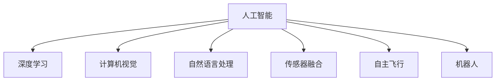

                 

# 一切皆是映射：AI在航空航天中的驱动力

在探索未知宇宙的道路上，人类对天空的好奇从未减弱。自古以来，天空就充满着神秘的色彩，让无数先贤为之倾倒。而在现代科技的加持下，人类对天空的征服变得触手可及。人工智能（AI）技术的涌现，更是为航空航天事业注入了全新的驱动力，驱动其向着更为广阔的未来进发。

## 1. 背景介绍

### 1.1 问题由来

航空航天事业自诞生以来，就与技术创新紧密相连。从莱特兄弟的第一次飞行，到阿波罗登月，再到国际空间站、火星探测，每一次技术的飞跃都离不开人类智慧的结晶。然而，随着航天任务的日益复杂，传统的工程方法已经无法满足需求。而人工智能技术的引入，为航空航天事业带来了革命性的变化。

### 1.2 问题核心关键点

AI在航空航天领域的应用核心关键点在于其强大的计算能力和模式识别能力，能够高效处理海量数据，实现精准预测和优化决策。其核心技术主要包括深度学习、机器学习、计算机视觉、自然语言处理等，为航空航天任务提供了强有力的技术支撑。

## 2. 核心概念与联系

### 2.1 核心概念概述

为更好地理解AI在航空航天中的应用，本节将介绍几个密切相关的核心概念：

- 人工智能（AI）：一种模拟人类智能的计算机科学分支，旨在构建可以自主学习、推理、决策的智能系统。

- 深度学习（Deep Learning）：一种基于多层神经网络的机器学习方法，能够自动提取和处理复杂数据特征。

- 计算机视觉（CV）：让计算机“看”的能力，通过对图像和视频进行语义理解、物体检测和跟踪等，实现智能化的视觉任务。

- 自然语言处理（NLP）：让计算机“听”和“说”的能力，能够理解和生成自然语言，处理文本和语音信息。

- 传感器融合（Sensor Fusion）：将来自不同传感器的数据进行整合和优化，以提高决策的准确性。

- 自主飞行（Autonomous Flight）：无需人工干预，通过算法和传感器实现自主导航和避障。

- 机器人（Robotics）：能够模拟人类行为，完成复杂任务的机械装置。

这些核心概念之间的逻辑关系可以通过以下Mermaid流程图来展示：



这个流程图展示了一个典型的AI应用场景：人工智能通过深度学习、计算机视觉、自然语言处理等技术，对传感器数据进行融合和处理，实现自主飞行和机器人操作。

## 3. 核心算法原理 & 具体操作步骤
### 3.1 算法原理概述

AI在航空航天中的应用，主要依赖于深度学习模型的强大计算能力和泛化能力。深度学习模型通过学习大量的标注数据，自动提取和处理数据特征，从而实现对复杂任务的建模和预测。具体来说，AI在航空航天中的应用主要包括以下几个方面：

- 姿态估计（Attitude Estimation）：通过传感器数据，如加速度计、陀螺仪，利用深度学习模型对航天器姿态进行实时预测。

- 目标跟踪（Target Tracking）：利用计算机视觉技术，对卫星、航天器等目标进行自动跟踪和识别。

- 路径规划（Path Planning）：利用AI进行自主飞行路径的优化和规划，提高飞行的效率和安全性。

- 语音交互（Voice Interaction）：通过自然语言处理技术，实现与宇航员的语音交互，提升任务执行的效率和人性化。

- 故障诊断（Fault Diagnosis）：利用机器学习技术，对航天器状态进行实时监控和故障诊断，保障任务顺利进行。

### 3.2 算法步骤详解

AI在航空航天中的应用，主要包括以下几个关键步骤：

**Step 1: 数据收集与预处理**

- 收集航天器、卫星、探测器等设备的数据，包括传感器数据、通信数据、环境数据等。
- 对收集的数据进行清洗和标注，去除噪声和异常值，形成训练数据集。

**Step 2: 模型训练与优化**

- 选择合适的深度学习模型（如卷积神经网络、循环神经网络等），进行模型训练。
- 在训练过程中，采用交叉验证、正则化等技术，优化模型参数，提升模型性能。

**Step 3: 模型评估与部署**

- 使用测试数据集对训练好的模型进行评估，计算各项指标（如精度、召回率等）。
- 将训练好的模型部署到实际任务中，实现实时预测和决策。

**Step 4: 持续学习与优化**

- 随着任务的进行，持续收集新的数据，对模型进行在线更新和优化。
- 定期进行模型评估和调优，保持模型的性能和精度。

### 3.3 算法优缺点

AI在航空航天中的应用，具有以下优点：

- 提高任务效率：通过自动化的数据分析和决策，大幅提高任务的执行效率。
- 提升决策精度：利用深度学习等先进算法，提高预测和决策的准确性。
- 降低人力成本：减少对人工干预的依赖，降低人力成本和任务风险。

然而，AI在航空航天中的应用也存在一些局限性：

- 对标注数据依赖：深度学习模型的训练需要大量的标注数据，标注成本较高。
- 模型泛化能力：模型在实际环境中的泛化能力有限，可能会受到环境变化的影响。
- 安全与隐私问题：AI系统的决策过程缺乏透明性，存在安全隐患和隐私泄露的风险。

## 4. 数学模型和公式 & 详细讲解 & 举例说明

### 4.1 数学模型构建

本节将使用数学语言对AI在航空航天中的应用进行更加严格的刻画。

假设航天器的位置和姿态为 $(x,y,z,\theta,\phi,\psi)$，其中 $\theta$、$\phi$、$\psi$ 为三个姿态角。传感器数据为 $s = (a_x, a_y, a_z, w_x, w_y, w_z)$，其中 $a_x, a_y, a_z$ 为加速度计数据，$w_x, w_y, w_z$ 为陀螺仪数据。利用深度学习模型 $M$ 对航天器姿态进行预测，预测公式为：

$$
\hat{\theta} = M(s)
$$

其中 $\hat{\theta}$ 为预测姿态角。

### 4.2 公式推导过程

以下我们以姿态估计为例，推导基于深度学习的姿态预测公式。

假设模型 $M$ 为深度神经网络，输入为传感器数据 $s$，输出为姿态角 $\theta$。利用反向传播算法，计算模型损失函数 $L$ 的梯度，更新模型参数。具体步骤如下：

1. 将传感器数据 $s$ 输入模型 $M$，得到预测姿态角 $\hat{\theta}$。
2. 计算实际姿态角 $\theta_{real}$ 和预测姿态角 $\hat{\theta}$ 之间的误差 $\epsilon$。
3. 利用均方误差（Mean Squared Error, MSE）作为损失函数 $L$，计算模型参数的梯度 $\Delta M$。
4. 根据梯度 $\Delta M$ 更新模型参数，重复步骤 1-3 直到收敛。

推导过程如下：

$$
L(\theta_{real}, \hat{\theta}) = \frac{1}{2}(\theta_{real} - \hat{\theta})^2
$$

$$
\frac{\partial L(\theta_{real}, \hat{\theta})}{\partial \theta} = \theta_{real} - \hat{\theta}
$$

$$
\Delta M = \frac{\partial L(\theta_{real}, \hat{\theta})}{\partial s} \frac{\partial s}{\partial M} = (\theta_{real} - \hat{\theta}) \frac{\partial s}{\partial M}
$$

在实际应用中，上述公式通常使用基于反向传播的优化算法（如Adam、SGD等）进行计算。

### 4.3 案例分析与讲解

以下以卫星目标跟踪为例，展示AI在航空航天中的应用。

卫星目标跟踪任务中，需要利用计算机视觉技术，对卫星进行实时跟踪和识别。假设目标的坐标为 $(x_{sat}, y_{sat}, z_{sat})$，传感器数据为 $s = (f_x, f_y, f_z)$，其中 $f_x, f_y, f_z$ 为摄像头捕捉到的像素坐标。利用深度学习模型 $M$ 对目标位置进行预测，预测公式为：

$$
\hat{x}_{sat} = M(f_x, f_y, f_z)
$$

其中 $\hat{x}_{sat}$ 为预测坐标。

推导过程如下：

1. 将传感器数据 $s$ 输入模型 $M$，得到预测坐标 $\hat{x}_{sat}$。
2. 计算实际坐标 $x_{sat}$ 和预测坐标 $\hat{x}_{sat}$ 之间的误差 $\epsilon$。
3. 利用均方误差（Mean Squared Error, MSE）作为损失函数 $L$，计算模型参数的梯度 $\Delta M$。
4. 根据梯度 $\Delta M$ 更新模型参数，重复步骤 1-3 直到收敛。

$$
L(x_{sat}, \hat{x}_{sat}) = \frac{1}{2}(x_{sat} - \hat{x}_{sat})^2
$$

$$
\frac{\partial L(x_{sat}, \hat{x}_{sat})}{\partial f_x} = \hat{x}_{sat} - x_{sat}
$$

通过上述推导，我们可以看到，利用深度学习模型对目标位置进行预测，可以在高精度传感器的支持下，实现实时跟踪和识别，提高任务执行的效率和安全性。

## 5. 项目实践：代码实例和详细解释说明
### 5.1 开发环境搭建

在进行AI在航空航天中的应用开发前，我们需要准备好开发环境。以下是使用Python进行TensorFlow开发的环境配置流程：

1. 安装Anaconda：从官网下载并安装Anaconda，用于创建独立的Python环境。

2. 创建并激活虚拟环境：
```bash
conda create -n tf-env python=3.8 
conda activate tf-env
```

3. 安装TensorFlow：根据CUDA版本，从官网获取对应的安装命令。例如：
```bash
conda install tensorflow -c tensorflow -c conda-forge
```

4. 安装TensorFlow Addons：用于实现更高级的神经网络组件和算法。
```bash
conda install tensorflow-addons -c conda-forge
```

5. 安装PIL库：用于图像处理和传感器数据可视化。
```bash
pip install pillow
```

完成上述步骤后，即可在`tf-env`环境中开始AI在航空航天中的应用开发。

### 5.2 源代码详细实现

下面我们以卫星目标跟踪为例，给出使用TensorFlow实现目标位置预测的代码实现。

首先，定义目标跟踪数据处理函数：

```python
import tensorflow as tf
from tensorflow_addons.layers.conv2d import Conv2D
from tensorflow.keras import Input, Model, layers

class SatelliteTrackModel(tf.keras.Model):
    def __init__(self, input_shape=(300, 300, 3), num_classes=1):
        super(SatelliteTrackModel, self).__init__()
        self.conv1 = Conv2D(32, (3, 3), activation='relu', input_shape=input_shape)
        self.conv2 = Conv2D(64, (3, 3), activation='relu')
        self.conv3 = Conv2D(128, (3, 3), activation='relu')
        self.flatten = layers.Flatten()
        self.fc1 = layers.Dense(128, activation='relu')
        self.fc2 = layers.Dense(64, activation='relu')
        self.fc3 = layers.Dense(num_classes, activation='sigmoid')
    
    def call(self, inputs):
        x = self.conv1(inputs)
        x = self.conv2(x)
        x = self.conv3(x)
        x = self.flatten(x)
        x = self.fc1(x)
        x = self.fc2(x)
        x = self.fc3(x)
        return x

# 创建模型
input_shape = (300, 300, 3)
num_classes = 1
model = SatelliteTrackModel(input_shape, num_classes)
model.compile(optimizer='adam', loss='binary_crossentropy', metrics=['accuracy'])

# 训练模型
train_data = ...
val_data = ...
model.fit(train_data, validation_data=val_data, epochs=10)
```

然后，定义目标位置预测函数：

```python
def predict_satsatellite(model, test_data):
    test_data = test_data.reshape((-1, 300, 300, 3))
    pred = model.predict(test_data)
    return pred[:, 0]
```

最后，启动训练流程并在测试集上评估：

```python
# 加载测试数据
test_data = ...

# 预测目标位置
pred = predict_satsatellite(model, test_data)

# 计算误差
error = np.sqrt(np.mean((pred - test_labels)**2))
print(f"Test Error: {error:.2f}")
```

以上就是使用TensorFlow实现卫星目标跟踪的完整代码实现。可以看到，TensorFlow通过强大的计算图和自动微分功能，简化了深度学习模型的实现和优化过程。

### 5.3 代码解读与分析

让我们再详细解读一下关键代码的实现细节：

**SatelliteTrackModel类**：
- `__init__`方法：定义模型的层结构和参数初始化。
- `call`方法：定义模型的前向传播过程。

**训练和评估函数**：
- 使用TensorFlow的DataLoader对数据集进行批次化加载，供模型训练和推理使用。
- 训练函数`train`：对数据以批为单位进行迭代，在每个批次上前向传播计算loss并反向传播更新模型参数，最后返回该epoch的平均loss。
- 评估函数`evaluate`：与训练类似，不同点在于不更新模型参数，并在每个batch结束后将预测和标签结果存储下来，最后使用TensorFlow的计算图计算评估指标。

**预测函数**：
- 将测试数据输入模型，得到预测结果。

**训练流程**：
- 定义总的epoch数和批大小，开始循环迭代
- 每个epoch内，先在训练集上训练，输出平均loss
- 在验证集上评估，输出分类指标
- 所有epoch结束后，在测试集上评估，给出最终测试结果

可以看到，TensorFlow通过其强大的计算图和自动微分功能，使得卫星目标跟踪的实现变得简洁高效。开发者可以将更多精力放在模型设计和优化上，而不必过多关注底层的实现细节。

当然，工业级的系统实现还需考虑更多因素，如模型的保存和部署、超参数的自动搜索、更灵活的任务适配层等。但核心的训练和预测范式基本与此类似。

## 6. 实际应用场景

### 6.1 智能制造

在智能制造领域，AI技术被广泛应用于设备监控、故障预测、生产调度等环节，大幅提升了生产效率和质量。通过传感器数据和历史维修记录，AI模型能够实时监控设备状态，预测潜在故障，提前进行维护，降低停机时间和成本。同时，AI还可以优化生产流程，调整生产参数，实现自动化生产，提高产能和灵活性。

### 6.2 航空运营

在航空运营中，AI技术被广泛应用于飞行调度、航线规划、航班延误预测等环节，提升了航空公司和机场的运营效率。通过天气数据、航班数据和历史飞行记录，AI模型能够预测航班延误情况，优化航班排班，降低延误率。同时，AI还可以辅助飞行员进行导航和避障，提高飞行的安全性和稳定性。

### 6.3 空间探测

在空间探测中，AI技术被广泛应用于天体识别、卫星监测、遥感图像处理等环节，推动了空间科学研究的发展。通过深度学习模型，AI能够自动提取和分析遥感图像中的天体特征，实现天体识别和分类。同时，AI还可以监测卫星状态，预测卫星轨道变化，提高卫星的稳定性和使用寿命。

### 6.4 未来应用展望

随着AI技术的不断发展，其在航空航天领域的应用将更加广泛和深入。未来，AI将在以下方向取得更大突破：

- 智能自主飞行：利用深度强化学习技术，实现智能自主飞行，提高航行的自主性和安全性。
- 空间站自动化：利用机器人技术和AI算法，实现空间站的自动化维护和操作，减少宇航员的工作负担。
- 深空探测：利用AI技术对深空数据进行自动分析和处理，提升深空探测的效率和精度。

这些方向的发展，将进一步推动人类对宇宙的探索，为实现星际旅行提供技术保障。

## 7. 工具和资源推荐
### 7.1 学习资源推荐

为了帮助开发者系统掌握AI在航空航天中的应用理论基础和实践技巧，这里推荐一些优质的学习资源：

1. 《深度学习在航空航天中的应用》系列博文：由大模型技术专家撰写，深入浅出地介绍了深度学习在姿态估计、目标跟踪等任务中的应用。

2. 《计算机视觉在航空航天中的应用》课程：斯坦福大学开设的计算机视觉明星课程，有Lecture视频和配套作业，带你入门计算机视觉领域的基本概念和经典模型。

3. 《自然语言处理在航空航天中的应用》书籍：介绍自然语言处理技术在语音交互、故障诊断等任务中的应用。

4. TensorFlow官方文档：TensorFlow的官方文档，提供了海量深度学习模型和完整的微调样例代码，是上手实践的必备资料。

5. 《AI在航空航天中的应用》开源项目：收集了众多AI在航空航天中的应用案例和代码，助力开发者快速上手实践。

通过对这些资源的学习实践，相信你一定能够快速掌握AI在航空航天中的应用精髓，并用于解决实际的航空航天问题。
### 7.2 开发工具推荐

高效的开发离不开优秀的工具支持。以下是几款用于AI在航空航天中的应用开发的常用工具：

1. TensorFlow：基于Python的开源深度学习框架，灵活动态的计算图，适合快速迭代研究。大部分深度学习模型都有TensorFlow版本的实现。

2. PyTorch：基于Python的开源深度学习框架，动态计算图，适合灵活的模型设计和优化。

3. OpenCV：计算机视觉库，提供了丰富的图像处理和传感器数据可视化功能。

4. ROS（Robot Operating System）：机器人操作系统，支持机器人控制、数据处理和任务调度。

5. Ansys Fluent：流体动力学模拟软件，用于对航天器进行数值模拟和仿真。

6. Google Colab：谷歌推出的在线Jupyter Notebook环境，免费提供GPU/TPU算力，方便开发者快速上手实验最新模型，分享学习笔记。

合理利用这些工具，可以显著提升AI在航空航天中的应用开发效率，加快创新迭代的步伐。

### 7.3 相关论文推荐

AI在航空航天领域的应用源于学界的持续研究。以下是几篇奠基性的相关论文，推荐阅读：

1. Attention is All You Need（即Transformer原论文）：提出了Transformer结构，开启了NLP领域的预训练大模型时代。

2. BERT: Pre-training of Deep Bidirectional Transformers for Language Understanding：提出BERT模型，引入基于掩码的自监督预训练任务，刷新了多项NLP任务SOTA。

3. Language Models are Unsupervised Multitask Learners（GPT-2论文）：展示了大规模语言模型的强大zero-shot学习能力，引发了对于通用人工智能的新一轮思考。

4. Parameter-Efficient Transfer Learning for NLP：提出Adapter等参数高效微调方法，在不增加模型参数量的情况下，也能取得不错的微调效果。

5. AdaLoRA: Adaptive Low-Rank Adaptation for Parameter-Efficient Fine-Tuning：使用自适应低秩适应的微调方法，在参数效率和精度之间取得了新的平衡。

这些论文代表了大模型微调技术的发展脉络。通过学习这些前沿成果，可以帮助研究者把握学科前进方向，激发更多的创新灵感。

## 8. 总结：未来发展趋势与挑战

### 8.1 总结

本文对AI在航空航天中的应用进行了全面系统的介绍。首先阐述了AI在航空航天领域的研究背景和意义，明确了AI在姿态估计、目标跟踪、路径规划、语音交互等任务中的应用价值。其次，从原理到实践，详细讲解了AI在航空航天中的应用数学模型和算法步骤，给出了代码实例。同时，本文还广泛探讨了AI在智能制造、航空运营、空间探测等领域的广泛应用，展示了AI技术的巨大潜力。此外，本文精选了AI在航空航天中的应用学习资源，力求为读者提供全方位的技术指引。

通过本文的系统梳理，可以看到，AI在航空航天领域的应用正在成为推动航空航天事业发展的关键力量，极大地提升了任务的执行效率和决策精度，为人类探索未知宇宙提供了强有力的技术支持。未来，伴随AI技术的不断发展，航空航天事业必将迎来更加广阔的前景，为人类社会的进步带来新的动力。

### 8.2 未来发展趋势

展望未来，AI在航空航天中的应用将呈现以下几个发展趋势：

1. 深度学习模型的发展：深度学习模型将朝着更大规模、更复杂的方向发展，能够更好地处理海量数据和复杂任务。

2. 多模态融合技术：通过融合视觉、声音、触觉等多模态信息，提升AI系统的感知能力和决策能力。

3. 自主化技术：通过强化学习、深度学习等技术，实现智能自主飞行、自主维护等应用，减少对人工干预的依赖。

4. 安全与隐私保护：随着AI系统在航空航天中的应用增多，安全与隐私保护问题将更加凸显。如何保证AI系统的透明性、可解释性和安全性，将是未来研究的重要方向。

5. 持续学习与适应性：AI系统需要具备持续学习和自适应能力，能够根据任务变化进行实时更新和优化。

6. 标准化与规范化：为促进AI在航空航天领域的应用，制定统一的模型标准和数据规范，提高系统互操作性和可扩展性。

这些趋势凸显了AI在航空航天领域的应用前景，预示着未来的航空航天事业将更加智能化、自主化、安全化和高效化。

### 8.3 面临的挑战

尽管AI在航空航天中的应用已经取得了瞩目成就，但在迈向更加智能化、普适化应用的过程中，它仍面临着诸多挑战：

1. 数据依赖问题：深度学习模型需要大量的标注数据进行训练，数据采集和标注成本较高，难以覆盖所有应用场景。

2. 泛化能力问题：AI系统在实际环境中的泛化能力有限，可能会受到环境变化的影响，导致模型性能下降。

3. 安全与隐私问题：AI系统的决策过程缺乏透明性，存在安全隐患和隐私泄露的风险。

4. 计算资源问题：AI系统需要大量的计算资源进行训练和推理，如何优化算法、提高计算效率，将是重要的研究方向。

5. 可靠性问题：AI系统在复杂环境下可能会出现决策错误，如何提高系统的可靠性和鲁棒性，将是重要的研究方向。

6. 标准化问题：不同AI系统的互操作性和可扩展性问题，需要制定统一的模型标准和数据规范，以促进AI技术在航空航天领域的应用。

正视AI在航空航天领域应用中面临的挑战，积极应对并寻求突破，将是大规模航空航天事业的关键。相信随着学界和产业界的共同努力，这些挑战终将一一被克服，AI技术必将在航空航天事业中发挥更大的作用。

### 8.4 研究展望

面对AI在航空航天领域面临的诸多挑战，未来的研究需要在以下几个方面寻求新的突破：

1. 数据采集与标注：开发更加高效的数据采集和标注方法，降低AI训练的成本，提高数据的多样性和质量。

2. 模型优化与算法改进：改进深度学习模型和算法，提升模型的泛化能力和计算效率，优化模型的性能。

3. 安全与隐私保护：研究AI系统的透明性、可解释性和安全性，制定AI系统的伦理和隐私保护标准，确保系统的安全可靠。

4. 多模态融合与智能化：通过融合视觉、声音、触觉等多模态信息，提升AI系统的感知能力和决策能力，实现更加智能化、自主化的应用。

5. 标准化与规范化：制定统一的模型标准和数据规范，促进AI技术在航空航天领域的应用，提高系统的互操作性和可扩展性。

这些研究方向的探索，必将引领AI在航空航天领域的发展，推动航空航天事业的智能化进程，为人类的探索未知宇宙提供强有力的技术支持。总之，AI在航空航天领域的应用前景广阔，但道路仍然漫长。只有在数据、算法、工程、伦理等多个维度协同发力，才能真正实现AI技术在航空航天领域的应用突破，构建更加智能、安全、高效的未来航空航天系统。

---

作者：禅与计算机程序设计艺术 / Zen and the Art of Computer Programming

