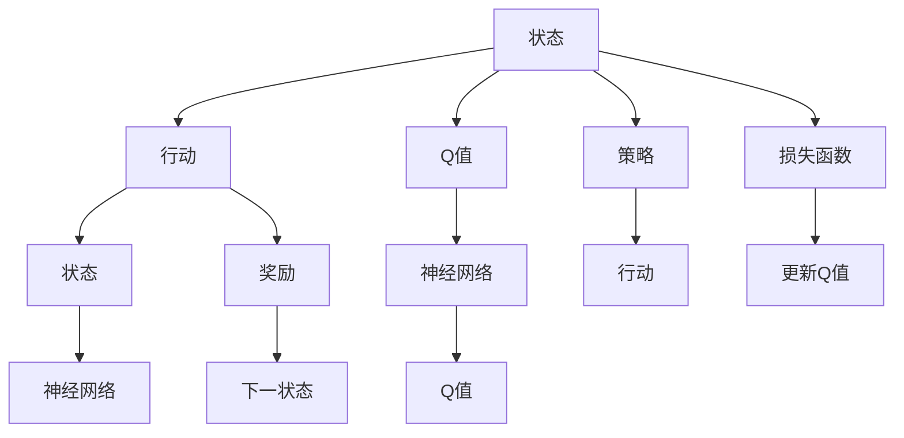
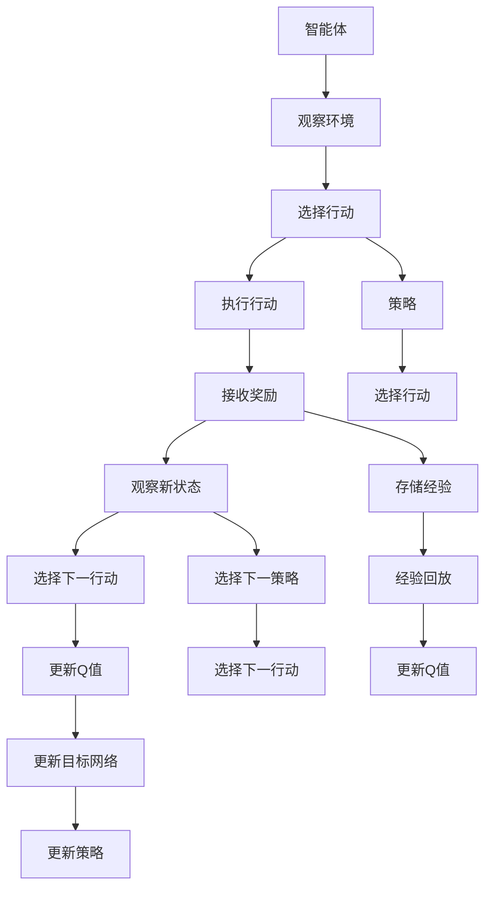

                 

## 1. 背景介绍

### 1.1 问题由来
在工业4.0时代，人工智能(AI)技术的应用范围越来越广泛，特别是在智能制造、智慧工厂、智能物流等生产与服务系统中，AI成为了提升效率、降低成本、增强安全性的关键。在此背景下，智能决策系统成为工业4.0发展的重要驱动力。深度强化学习(Deep Reinforcement Learning, DRL)中的Q-learning算法，结合深度神经网络(DQN)，已经成为构建智能决策系统的重要技术手段。

DQN（Deep Q-Network）算法是近年来DRL领域的一个重要突破。它将深度学习与强化学习相结合，利用神经网络来近似Q值函数，能够在无需环境仿真的情况下进行学习，使得智能决策系统更具有实际应用价值。基于此，本文将对DQN算法在工业4.0中的应用进行详细探讨，揭示其在生产系统优化、智能物流、机器人路径规划等场景下的作用。

### 1.2 问题核心关键点
本文的主要研究点是DQN在工业4.0中的应用实践。我们将深入探讨以下核心问题：

1. 如何理解DQN的基本原理和算法结构？
2. DQN在实际工业场景中的应用有哪些？
3. DQN在工业系统中的运行和优化有哪些策略？
4. DQN面临的挑战和未来的发展方向是什么？

### 1.3 问题研究意义
随着智能制造和智慧工厂的兴起，DQN在工业4.0中的应用前景广阔。通过对DQN的研究和应用，可以显著提高生产系统的效率、灵活性和自动化水平，减少人为干预，提高决策的准确性和响应速度，推动工业4.0向更加智能化、柔性化和高效化发展。

本文旨在为DQN在工业4.0中的应用提供深入的技术分析和实践指导，帮助读者理解DQN算法的基本原理和优化策略，探索其在工业场景中的实际应用和效果。

## 2. 核心概念与联系

### 2.1 核心概念概述

在介绍DQN算法之前，需要了解一些与强化学习和深度学习相关的核心概念：

- **强化学习(RL)**：是一种基于奖励信号的学习方法，目的是使智能体在特定环境中采取最优行动，以最大化累计奖励。
- **Q值函数**：是RL中的一个核心概念，表示在给定状态-行动对下，后续状态-奖励的最大预期值。
- **深度神经网络(DNN)**：一种基于多层神经元模型的人工神经网络，可以用于复杂的函数逼近任务，如DQN中的Q值函数逼近。
- **DQN（Deep Q-Network）**：结合了深度学习和强化学习的算法，通过深度神经网络来逼近Q值函数，实现高效学习和决策。

这些概念之间的联系和DQN算法的工作原理可以通过以下Mermaid流程图来展示：



这个流程图展示了DQN算法的基本流程：

1. 从状态到行动。智能体根据当前状态选择行动。
2. 行动到状态。行动在环境中产生下一状态和奖励。
3. Q值函数。使用神经网络逼近Q值函数，预测每个状态-行动对的Q值。
4. 策略选择。根据当前状态和逼近的Q值函数，选择最优行动。
5. 损失函数。通过经验回放和目标网络更新Q值函数。

### 2.2 核心概念原理和架构的 Mermaid 流程图

以下是DQN算法的详细流程：



这个流程图中，智能体通过观察环境选择行动，执行行动后接收奖励和观察新状态。这些经验通过经验回放和目标网络更新Q值函数，不断优化策略，使得智能体能做出最优决策。

## 3. 核心算法原理 & 具体操作步骤

### 3.1 算法原理概述

DQN算法通过深度神经网络来逼近Q值函数，结合强化学习的原理，实现高效学习和决策。其核心思想是通过观察环境，选择行动，接收奖励，观察新状态，更新Q值函数，优化策略，使得智能体能够在未知环境中做出最优决策。

DQN算法的原理可以概括为以下几个步骤：

1. 初始化智能体、Q值网络、目标网络、策略和损失函数。
2. 观察环境，选择行动，执行行动，接收奖励，观察新状态。
3. 存储经验到经验池，进行经验回放。
4. 利用神经网络逼近Q值函数，预测Q值。
5. 根据目标网络输出Q值，计算目标值。
6. 利用经验回放更新Q值网络，最小化损失函数。
7. 更新目标网络，切换到策略，进行策略优化。

### 3.2 算法步骤详解

#### 3.2.1 初始化

首先需要初始化智能体、Q值网络、目标网络、策略和损失函数。智能体负责与环境交互，选择行动，观察状态和接收奖励。Q值网络用于逼近Q值函数，目标网络用于更新Q值函数的稳定性和优化性能。策略用于选择行动，损失函数用于评估Q值网络预测的准确性。

#### 3.2.2 观察和选择行动

智能体观察当前状态，根据策略选择行动。策略可以是固定的，也可以是动态更新的，取决于具体应用场景。

#### 3.2.3 执行和接收奖励

智能体执行选择的行动，观察环境状态，接收奖励。奖励可以是正面的，也可以是负面的，用于指导智能体的行为。

#### 3.2.4 更新Q值网络

将观察到的状态-行动-奖励-状态经验存储到经验池中。利用经验回放，从经验池中随机抽取一批经验，利用Q值网络逼近Q值函数，计算预测值，并利用目标网络输出目标值。根据损失函数，更新Q值网络，最小化预测值与目标值之间的误差。

#### 3.2.5 更新目标网络

周期性地更新目标网络，使其与Q值网络保持一致。这有助于稳定Q值函数的估计，避免过拟合。

#### 3.2.6 策略更新

根据Q值网络的输出，更新策略，选择行动。

### 3.3 算法优缺点

#### 3.3.1 优点

1. **高效学习**：DQN通过神经网络逼近Q值函数，能够处理高维连续状态和动作空间，实现高效的策略学习和决策。
2. **不需要环境仿真**：DQN可以在真实环境中进行学习，避免了传统强化学习中对环境仿真的大量计算。
3. **鲁棒性强**：DQN能够适应复杂的非线性环境，具有较强的鲁棒性和泛化能力。
4. **可扩展性强**：DQN可以用于多智能体、多任务等复杂系统的学习，具有较好的扩展性。

#### 3.3.2 缺点

1. **收敛性问题**：DQN存在收敛性问题，容易导致Q值函数和策略的震荡。
2. **计算资源需求高**：神经网络的训练和存储需要大量的计算和内存资源，特别是在大规模状态空间下。
3. **过拟合风险**：神经网络容易过拟合，尤其是在经验回放中，需要考虑过拟合的风险。

### 3.4 算法应用领域

DQN算法已经在多个领域得到了广泛的应用，主要包括：

1. **工业系统优化**：通过智能决策优化生产计划、资源配置、调度优化等。
2. **智能物流**：优化配送路径、仓库管理、库存控制等。
3. **机器人路径规划**：在无人机、自动化生产线等机器人系统中，优化路径规划和行为决策。
4. **游戏AI**：在视频游戏、机器人竞技等场景中，构建智能对手。
5. **金融交易**：在股票交易、外汇交易等场景中，进行自动化交易和风险管理。

## 4. 数学模型和公式 & 详细讲解

### 4.1 数学模型构建

DQN算法的数学模型主要基于强化学习的理论基础，包括状态、行动、奖励和Q值函数等概念。在DQN中，Q值函数可以表示为：

$$ Q(s, a) = \mathbb{E}\left[\sum_{t=0}^{\infty} \gamma^t r_t | s_t = s, a_t = a \right] $$

其中，$s$ 和 $a$ 分别表示状态和行动，$\gamma$ 为折扣因子，$r_t$ 为在第 $t$ 步的奖励，$Q(s, a)$ 表示在状态 $s$ 下采取行动 $a$ 的最大预期回报。

DQN算法中，利用神经网络逼近Q值函数，可以用一个参数向量 $\theta$ 来表示Q值函数，即：

$$ Q_{\theta}(s, a) = \theta^T \phi(s, a) $$

其中，$\phi(s, a)$ 是一个特征函数，将状态和行动映射到特征向量。

### 4.2 公式推导过程

在DQN算法中，主要涉及以下公式：

1. **状态-行动对的经验回放**：

   $$ \mathcal{D} = \{(s_t, a_t, r_t, s_{t+1})\} $$

2. **目标Q值**：

   $$ y = r_t + \gamma Q_{\theta^{-}}(s_{t+1}) $$

3. **预测Q值**：

   $$ Q_{\theta}(s_t, a_t) $$

4. **经验回放更新**：

   $$ \theta \leftarrow \theta - \eta \nabla_{\theta} \mathcal{L}(Q_{\theta}(s_t, a_t), y) $$

   其中，$\mathcal{L}$ 为损失函数，$\eta$ 为学习率。

5. **目标网络更新**：

   $$ \theta^{-} = \tau \theta + (1-\tau) \theta^{-} $$

   其中，$\tau$ 为目标网络的更新比例。

### 4.3 案例分析与讲解

以一个简单的智能体在迷宫中找到出口为例，说明DQN算法的应用：

1. **初始化**：智能体初始位置为(0,0)，目标位置为(4,4)，Q值网络为一个简单的全连接神经网络，包含两个隐藏层，每个隐藏层有10个神经元，输出层有4个神经元。
2. **观察和选择行动**：智能体观察当前状态，根据策略选择向右或向下移动。
3. **执行和接收奖励**：执行移动，观察新状态，如果到达目标位置，获得奖励+1，否则不获得奖励。
4. **更新Q值网络**：将当前状态-行动-奖励-状态经验存储到经验池中，利用神经网络逼近Q值函数，计算预测值，并利用目标网络输出目标值。根据损失函数，更新Q值网络，最小化预测值与目标值之间的误差。
5. **更新目标网络**：周期性地更新目标网络，使其与Q值网络保持一致。
6. **策略更新**：根据Q值网络的输出，更新策略，选择行动。

通过不断迭代，智能体最终可以学会在迷宫中找到出口。

## 5. 项目实践：代码实例和详细解释说明

### 5.1 开发环境搭建

要实现DQN算法，需要先搭建好开发环境。以下是使用Python和TensorFlow实现DQN的开发环境配置步骤：

1. 安装Anaconda：从官网下载并安装Anaconda，用于创建独立的Python环境。

2. 创建并激活虚拟环境：
```bash
conda create -n dqn-env python=3.8 
conda activate dqn-env
```

3. 安装TensorFlow：
```bash
pip install tensorflow
```

4. 安装Keras：
```bash
pip install keras
```

5. 安装TensorBoard：
```bash
pip install tensorboard
```

6. 安装 Gym 库：
```bash
pip install gym
```

完成上述步骤后，即可在`dqn-env`环境中开始DQN的实现。

### 5.2 源代码详细实现

下面以Atari游戏Pong为例，给出使用TensorFlow实现DQN的Python代码：

```python
import gym
import numpy as np
import tensorflow as tf
import keras
from keras.models import Sequential
from keras.layers import Dense, Activation

# 定义DQN模型
class DQN:
    def __init__(self, state_size, action_size):
        self.state_size = state_size
        self.action_size = action_size
        self.memory = []
        self.gamma = 0.95  # 折扣因子
        self.epsilon = 1.0  # 探索率
        self.epsilon_min = 0.01
        self.epsilon_decay = 0.995
        self.learning_rate = 0.001
        self.model = self._build_model()

    def _build_model(self):
        model = Sequential()
        model.add(Dense(24, input_dim=self.state_size, kernel_initializer='he_uniform'))
        model.add(Activation('relu'))
        model.add(Dense(24, kernel_initializer='he_uniform'))
        model.add(Activation('relu'))
        model.add(Dense(self.action_size, kernel_initializer='he_uniform'))
        model.add(Activation('linear'))
        model.compile(loss='mse', optimizer=tf.keras.optimizers.Adam(lr=self.learning_rate))
        return model

    def remember(self, state, action, reward, next_state, done):
        self.memory.append((state, action, reward, next_state, done))

    def act(self, state):
        if np.random.rand() <= self.epsilon:
            return np.random.randint(0, self.action_size)
        act_values = self.model.predict(state)
        return np.argmax(act_values[0])

    def replay(self, batch_size):
        minibatch = np.random.choice(len(self.memory), batch_size)
        for i in minibatch:
            state, action, reward, next_state, done = self.memory[i]
            target = reward + self.gamma * np.amax(self.model.predict(next_state)[0] if not done else 0)
            target_f = self.model.predict(state)[0]
            target_f[action] = target
            self.model.fit(state, target_f, epochs=1, verbose=0)
        if self.epsilon > self.epsilon_min:
            self.epsilon *= self.epsilon_decay

    def update_model(self):
        self.model.save_weights('dqn_model.h5')
        self.target_model.load_weights('dqn_model.h5')

# 初始化环境
env = gym.make('Pong-v0')
state_size = env.observation_space.shape[0]
action_size = env.action_space.n
model = DQN(state_size, action_size)

# 训练DQN模型
for i_episode in range(1, 101):
    state = env.reset()
    state = np.reshape(state, [1, state_size])
    done = False
    while not done:
        action = model.act(state)
        next_state, reward, done, _ = env.step(action)
        next_state = np.reshape(next_state, [1, state_size])
        model.remember(state, action, reward, next_state, done)
        state = next_state
    model.replay(32)
    model.update_model()

# 评估DQN模型
score = []
for i in range(10):
    score.append(env.render(mode='rgb_array'))
    state = env.reset()
    state = np.reshape(state, [1, state_size])
    done = False
    while not done:
        action = model.act(state)
        next_state, reward, done, _ = env.step(action)
        state = next_state
    score.append(env.render(mode='rgb_array'))
env.close()
```

### 5.3 代码解读与分析

让我们再详细解读一下关键代码的实现细节：

**DQN类**：
- `__init__`方法：初始化DQN模型，包括状态大小、动作大小、内存、折扣因子、探索率、学习率和模型。
- `_build_model`方法：构建神经网络模型。
- `remember`方法：将经验存储到内存中。
- `act`方法：根据状态和探索率选择行动。
- `replay`方法：利用经验回放和目标网络更新Q值网络。
- `update_model`方法：保存和加载模型。

**主循环**：
- 初始化环境，定义状态大小和动作大小。
- 创建DQN模型。
- 循环迭代，重置环境，根据当前状态选择行动，执行行动，存储经验，更新Q值网络，保存模型。
- 在循环结束后，评估模型的表现。

**评估部分**：
- 循环10次，评估模型在环境中的表现。
- 输出渲染的图像，保存评估结果。

可以看到，使用TensorFlow实现DQN的代码实现相对简洁，可以清晰地看到模型的构建和训练过程。通过不断迭代，模型可以逐步学会如何在迷宫中找到出口，表现出强大的学习能力。

## 6. 实际应用场景

### 6.1 工业系统优化

DQN在工业系统优化中的应用非常广泛，特别是在生产计划、资源配置、调度优化等场景下，DQN能够提供高效、灵活的智能决策支持。

以智能工厂为例，DQN可以用于优化生产线的调度，最大化利用设备和人力资源，降低生产成本，提高生产效率。DQN通过观察生产状态，选择最优的生产计划和资源配置方案，实现动态优化。

### 6.2 智能物流

在智能物流领域，DQN可以优化配送路径、仓库管理、库存控制等。例如，DQN可以用于优化配送路径，通过智能决策，选择最优的配送路线，提高配送效率，降低配送成本。

### 6.3 机器人路径规划

在无人机、自动化生产线等机器人系统中，DQN可以用于路径规划和行为决策。例如，DQN可以用于无人机导航，通过观察环境，选择最优的飞行路径，避开障碍物，实现安全高效的飞行。

### 6.4 未来应用展望

未来，DQN将在更多领域得到广泛应用，主要体现在以下几个方面：

1. **多智能体系统**：DQN可以用于多智能体系统的优化，实现更复杂的协作和互动。
2. **自适应控制**：DQN可以用于自适应控制系统的设计，提高系统的稳定性和响应速度。
3. **动态优化**：DQN可以实时动态优化系统的决策，适应不断变化的环境。
4. **跨领域应用**：DQN可以应用于更广泛的领域，如医疗、金融、交通等，提升各领域智能化水平。

## 7. 工具和资源推荐

### 7.1 学习资源推荐

为了帮助开发者系统掌握DQN算法的理论基础和实践技巧，这里推荐一些优质的学习资源：

1. Deep Reinforcement Learning with Python：由François Chollet等人撰写的Keras官方指南，详细介绍了DQN算法的基本原理和实现方法。
2. Deep Q-Networks with Keras：一个基于Keras的DQN示例，包含详细的代码实现和解释。
3. Reinforcement Learning: An Introduction：由Richard S. Sutton和Andrew G. Barto合著的经典教材，系统介绍了强化学习的理论和算法。
4. DQN与强化学习：Kaggle上的深度学习教程，详细介绍了DQN算法的原理和应用。

### 7.2 开发工具推荐

DQN算法的实现离不开优秀的工具支持。以下是几款常用的开发工具：

1. TensorFlow：由Google主导开发的深度学习框架，支持分布式计算和GPU加速，是实现DQN算法的常用工具。
2. Keras：基于TensorFlow的高级深度学习框架，提供了简单易用的API，适合初学者和快速原型开发。
3. OpenAI Gym：是一个开源的AI和强化学习环境库，提供了丰富的环境供开发者使用。
4. TensorBoard：TensorFlow配套的可视化工具，用于实时监测模型训练状态，提供丰富的图表呈现方式。
5. Weights & Biases：实验跟踪工具，用于记录和可视化模型训练过程中的各项指标，方便对比和调优。

### 7.3 相关论文推荐

DQN算法在学术界和工业界都得到了广泛研究。以下是几篇经典论文，推荐阅读：

1. Deep Q-Learning with Convolutional Neural Network Architecture：提出使用卷积神经网络实现DQN算法的思路，提升了在视觉环境下的表现。
2. DQN with A2C：介绍使用异步优势演员-评论者算法（A3C）实现DQN，提高了训练效率。
3. Deep Reinforcement Learning for Autonomous Driving：介绍使用DQN实现自动驾驶中的决策系统。
4. Q-learning for Human-Robot Interaction：提出使用DQN实现人机交互中的决策优化。
5. Deep Q-Network with Transfer Learning for Smart Manufacturing：介绍使用DQN实现智能制造中的决策优化。

这些论文代表了大Q值算法的研究进展，可以帮助研究者理解DQN算法的最新动态。

## 8. 总结：未来发展趋势与挑战

### 8.1 研究成果总结

本文对DQN算法在工业4.0中的应用进行了详细探讨，分析了DQN算法的原理和实现方法，给出了具体的代码实例，并探讨了其在工业系统优化、智能物流、机器人路径规划等场景中的应用。通过本文的深入分析，读者可以理解DQN算法的核心思想和优化策略，探索其在实际工业场景中的应用效果。

### 8.2 未来发展趋势

未来，DQN算法将在以下几个方面发展：

1. **多智能体系统**：DQN将用于更复杂的多智能体系统，实现更高效、灵活的协作和互动。
2. **自适应控制**：DQN将用于自适应控制系统的设计，提升系统的稳定性和响应速度。
3. **动态优化**：DQN将实时动态优化系统的决策，适应不断变化的环境。
4. **跨领域应用**：DQN将应用于更广泛的领域，如医疗、金融、交通等，提升各领域智能化水平。

### 8.3 面临的挑战

尽管DQN算法在工业4.0中的应用前景广阔，但仍面临以下挑战：

1. **计算资源需求高**：神经网络的训练和存储需要大量的计算和内存资源，特别是在大规模状态空间下。
2. **过拟合风险**：神经网络容易过拟合，尤其是在经验回放中，需要考虑过拟合的风险。
3. **收敛性问题**：DQN存在收敛性问题，容易导致Q值函数和策略的震荡。
4. **可解释性不足**：DQN的决策过程缺乏可解释性，难以对其推理逻辑进行分析和调试。

### 8.4 研究展望

未来的研究需要在以下几个方面寻求新的突破：

1. **参数高效微调**：开发更加参数高效的微调方法，在固定大部分预训练参数的同时，只更新极少量的任务相关参数。
2. **混合学习**：将强化学习与深度学习结合，实现混合学习，提升DQN算法的表现。
3. **多任务学习**：研究多任务学习，使得DQN能够同时优化多个任务，提升模型的泛化能力。
4. **自适应控制策略**：研究自适应控制策略，使得DQN能够动态适应环境变化，提升系统的鲁棒性。

这些研究方向的探索，将推动DQN算法在工业4.0中的应用，提升各领域的智能化水平，为实现工业智能化转型提供技术支撑。

## 9. 附录：常见问题与解答

**Q1：DQN算法与传统强化学习算法有何不同？**

A: DQN算法结合了深度学习和强化学习的优点，通过神经网络逼近Q值函数，实现了高效的策略学习和决策。与传统强化学习算法相比，DQN可以处理高维连续状态和动作空间，具有更强的泛化能力和学习效率。

**Q2：DQN算法在实际应用中面临哪些挑战？**

A: DQN算法在实际应用中面临以下挑战：
1. 计算资源需求高，需要大量的计算和内存资源。
2. 容易过拟合，需要考虑过拟合的风险。
3. 收敛性问题，容易导致Q值函数和策略的震荡。
4. 缺乏可解释性，难以对其推理逻辑进行分析和调试。

**Q3：如何在实际应用中提升DQN算法的性能？**

A: 提升DQN算法的性能可以从以下几个方面考虑：
1. 优化神经网络结构，提高特征提取能力。
2. 引入正则化技术，避免过拟合。
3. 采用混合学习，提高模型的泛化能力。
4. 动态调整学习率，适应不同的学习阶段。
5. 增加经验回放频率，提高模型的稳定性。

**Q4：DQN算法在工业系统中的应用前景如何？**

A: DQN算法在工业系统中的应用前景广阔，特别是在生产系统优化、智能物流、机器人路径规划等场景下，DQN能够提供高效、灵活的智能决策支持。未来，随着计算资源和算法的不断优化，DQN算法将在更多领域得到广泛应用，推动工业4.0向更加智能化、柔性化和高效化发展。

**Q5：DQN算法在实际应用中需要注意哪些问题？**

A: 在实际应用中，DQN算法需要注意以下问题：
1. 合理设置探索率和目标网络更新比例。
2. 选择合适的状态表示方法，提高特征提取能力。
3. 优化神经网络结构，提高模型性能。
4. 考虑过拟合风险，引入正则化技术。
5. 动态调整学习率，适应不同的学习阶段。

总之，DQN算法具有强大的学习和决策能力，但在实际应用中仍需注意上述问题，以充分发挥其潜力。

---

作者：禅与计算机程序设计艺术 / Zen and the Art of Computer Programming

