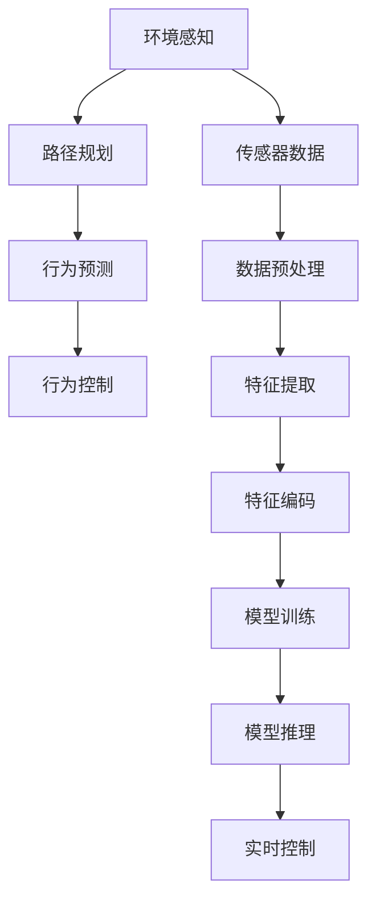

                 

# 一切皆是映射：无人驾驶车辆中的神经网络系统

> 关键词：无人驾驶, 神经网络, 感知, 决策, 行为控制, 模型训练, 深度学习, 计算机视觉, 激光雷达, 摄像头, 行为预测, 传感器融合, 自主驾驶, 智能交通

## 1. 背景介绍

### 1.1 问题由来

随着人工智能和自动驾驶技术的飞速发展，无人驾驶车辆（Autonomous Vehicles, AVs）已经从实验室走向现实世界。无人驾驶系统包括环境感知、路径规划、行为决策和行为控制等子系统，每个子系统都是复杂的信息处理系统，涉及大量的传感器数据处理、模型训练和实时推理。其中，神经网络（Neural Network, NN）由于其强大的特征提取和模式识别能力，成为了无人驾驶系统中的关键组成部分。

神经网络通过学习大量数据，从噪声数据中提取出特征，并通过多层非线性变换，实现对输入数据的复杂映射。在无人驾驶系统中，神经网络被广泛应用于环境感知、路径规划、行为预测等任务，极大地提升了无人驾驶车辆的智能化水平和安全性。然而，神经网络系统的设计、训练和部署是无人驾驶系统中最为复杂的部分之一，需要在硬件、软件和算法等多个方面进行全面优化，才能实现无人驾驶车辆的稳定、可靠和安全运行。

### 1.2 问题核心关键点

在无人驾驶车辆中，神经网络系统的设计核心在于以下几个方面：

1. **环境感知模块**：通过神经网络对激光雷达、摄像头等传感器数据进行处理，提取道路、车辆、行人、交通信号灯等环境信息，为路径规划和行为决策提供基础。
2. **路径规划模块**：通过神经网络对交通场景进行建模和规划，生成符合交通规则和实际路况的路径方案。
3. **行为预测模块**：通过神经网络预测周围交通参与者的行为，为行为控制提供依据。
4. **行为控制模块**：通过神经网络实现对车辆加速、转向、制动等行为的实时控制，保证无人驾驶车辆的稳定和安全。

神经网络系统的设计需要综合考虑精度、实时性、鲁棒性和可靠性等多个方面，以确保无人驾驶车辆能够安全、可靠地运行。

### 1.3 问题研究意义

神经网络系统在无人驾驶车辆中的应用，具有以下重要意义：

1. **提高驾驶安全**：神经网络通过学习大量的交通数据，能够准确识别交通标志、行人、车辆等环境信息，避免交通事故。
2. **提升驾驶效率**：神经网络可以快速处理传感器数据，生成最优路径和行为方案，提升驾驶效率。
3. **实现自动驾驶**：神经网络系统能够实现自动驾驶、自动泊车等功能，解放驾驶员，减少交通拥堵。
4. **降低驾驶成本**：神经网络系统能够降低驾驶过程中的疲劳度和错误率，提高驾驶的舒适性和安全性。
5. **推动智能交通**：神经网络系统能够推动智能交通的发展，实现车辆间的信息共享和协同，提升整个交通系统的运行效率。

## 2. 核心概念与联系

### 2.1 核心概念概述

为更好地理解无人驾驶车辆中的神经网络系统，本节将介绍几个密切相关的核心概念：

- **无人驾驶**：指车辆无需人工干预，能够自主完成驾驶任务的系统。
- **神经网络**：一种由大量神经元（Neuron）构成的分布式信息处理系统，用于对复杂数据进行特征提取和模式识别。
- **环境感知**：通过传感器数据，如激光雷达、摄像头、雷达等，对周围环境进行感知和建模。
- **路径规划**：通过环境感知和行为预测，生成符合交通规则和实际路况的路径方案。
- **行为预测**：通过环境感知和行为控制，预测周围交通参与者的行为，以优化路径规划和行为控制。
- **行为控制**：通过环境感知和路径规划，实现对车辆加速度、转向角度和制动距离等行为的实时控制。

这些核心概念之间的逻辑关系可以通过以下Mermaid流程图来展示：



这个流程图展示了一系列无人驾驶车辆中神经网络系统的工作流程：

1. 环境感知模块通过对传感器数据进行处理，提取道路、车辆、行人、交通信号灯等环境信息。
2. 路径规划模块通过环境感知和行为预测，生成最优路径方案。
3. 行为预测模块通过环境感知和行为控制，预测周围交通参与者的行为。
4. 行为控制模块通过环境感知和路径规划，实现对车辆行为的实时控制。

这些核心概念共同构成了无人驾驶车辆中的神经网络系统，实现了车辆自主、安全、高效的驾驶任务。

## 3. 核心算法原理 & 具体操作步骤

### 3.1 算法原理概述

在无人驾驶车辆中，神经网络系统主要通过以下几个步骤实现：

1. **数据采集**：通过传感器收集道路、车辆、行人等环境信息。
2. **数据预处理**：对传感器数据进行滤波、降噪、归一化等处理，保证数据的质量。
3. **特征提取**：通过神经网络提取环境特征，如道路边缘、车辆形状、行人姿态等。
4. **特征编码**：将提取出的环境特征转化为高维向量，供模型训练和推理使用。
5. **模型训练**：通过大量标注数据训练神经网络模型，学习环境特征与行为决策之间的映射关系。
6. **模型推理**：通过训练好的模型对实时传感器数据进行推理，生成路径规划和行为控制方案。
7. **实时控制**：根据推理结果，实时控制车辆加速、转向、制动等行为，保证车辆稳定和安全运行。

### 3.2 算法步骤详解

**Step 1: 数据采集与预处理**

- 通过激光雷达、摄像头、雷达等传感器，采集道路、车辆、行人等环境信息。
- 对传感器数据进行滤波、降噪、归一化等处理，保证数据的质量。
- 将处理后的传感器数据输入到神经网络进行特征提取。

**Step 2: 特征提取**

- 通过神经网络提取环境特征，如道路边缘、车辆形状、行人姿态等。
- 将提取出的环境特征转化为高维向量，供模型训练和推理使用。

**Step 3: 特征编码**

- 将高维向量输入到编码器（Encoder）中，进行特征映射。
- 通过多个全连接层和池化层，将高维向量映射为低维特征向量。

**Step 4: 模型训练**

- 使用大量标注数据对编码器-解码器（Encoder-Decoder）模型进行训练。
- 定义损失函数，如均方误差（MSE）、交叉熵（Cross-Entropy）等，衡量模型输出与真实标签之间的差异。
- 使用优化算法（如Adam、SGD等）更新模型参数，最小化损失函数。

**Step 5: 模型推理**

- 将实时传感器数据输入到训练好的模型中，进行特征编码和推理。
- 通过解码器（Decoder）生成最优路径方案和行为控制信号。

**Step 6: 实时控制**

- 根据推理结果，实时控制车辆加速、转向、制动等行为。
- 通过控制器（Controller）实现车辆的自主驾驶。

### 3.3 算法优缺点

无人驾驶车辆中的神经网络系统具有以下优点：

1. **精度高**：神经网络能够从传感器数据中提取出高维特征，实现精确的环境感知。
2. **鲁棒性强**：神经网络能够对噪声数据进行滤波和降噪，提高数据处理的质量。
3. **实时性好**：神经网络通过GPU加速计算，可以实现实时处理和推理。
4. **自适应能力强**：神经网络能够适应各种交通场景，实现智能决策。

同时，该方法也存在一些局限性：

1. **数据需求高**：神经网络需要大量的标注数据进行训练，数据获取和标注成本较高。
2. **模型复杂**：神经网络模型结构复杂，训练和推理过程需要大量计算资源。
3. **可解释性差**：神经网络的黑盒特性使得模型决策过程难以解释，影响系统可靠性和可信度。
4. **对抗攻击风险**：神经网络易受到对抗攻击，如更改传感器数据，影响系统安全。

尽管存在这些局限性，但神经网络系统在无人驾驶车辆中的应用已经取得了显著的成果，是实现无人驾驶的关键技术之一。

### 3.4 算法应用领域

神经网络系统在无人驾驶车辆中的应用非常广泛，覆盖了环境感知、路径规划、行为预测和行为控制等多个方面：

1. **环境感知**：使用神经网络对激光雷达、摄像头等传感器数据进行处理，提取道路、车辆、行人等环境信息。
2. **路径规划**：通过神经网络对交通场景进行建模和规划，生成最优路径方案。
3. **行为预测**：使用神经网络预测周围交通参与者的行为，为行为控制提供依据。
4. **行为控制**：通过神经网络实现对车辆加速度、转向角度和制动距离等行为的实时控制。

此外，神经网络系统还被应用于无人驾驶车辆中的多个子系统，如自动泊车、自动驾驶、智能交通等，为无人驾驶技术的发展提供了强大的技术支持。

## 4. 数学模型和公式 & 详细讲解

### 4.1 数学模型构建

本节将使用数学语言对无人驾驶车辆中神经网络系统的建模过程进行更加严格的刻画。

设传感器数据为 $x_i \in \mathcal{X}$，其中 $\mathcal{X}$ 为环境特征空间。设神经网络模型为 $M_{\theta}:\mathcal{X} \rightarrow \mathcal{Y}$，其中 $\mathcal{Y}$ 为行为决策空间，$\theta \in \mathbb{R}^d$ 为模型参数。设训练数据集为 $D=\{(x_i,y_i)\}_{i=1}^N, x_i \in \mathcal{X}, y_i \in \mathcal{Y}$。

定义模型 $M_{\theta}$ 在输入 $x$ 上的输出为 $\hat{y}=M_{\theta}(x)$，表示模型预测的行为决策。在训练过程中，使用交叉熵损失函数 $\ell(M_{\theta}(x),y)$ 来衡量模型预测与真实标签之间的差异。在训练过程中，最小化经验风险：

$$
\mathcal{L}(\theta) = \frac{1}{N} \sum_{i=1}^N \ell(M_{\theta}(x_i),y_i)
$$

在推理过程中，使用解码器 $D$ 将高维特征向量映射为行为决策：

$$
y = D(M_{\theta}(x))
$$

其中 $D$ 为解码器函数，通常为全连接层、卷积层、循环神经网络（RNN）等。

### 4.2 公式推导过程

以下我们以行为预测为例，推导神经网络模型的预测过程。

假设传感器数据为 $x$，神经网络模型为 $M_{\theta}$，解码器为 $D$。则行为预测的过程如下：

1. 输入传感器数据 $x$ 到编码器 $E$，得到高维特征向量 $h$。
2. 将高维特征向量 $h$ 输入到解码器 $D$，得到行为决策 $\hat{y}$。

具体而言，假设编码器 $E$ 为多层感知机（MLP），解码器 $D$ 为全连接层。则行为预测的公式如下：

$$
h = E(x) = \sigma(W_hx + b_h)
$$

$$
\hat{y} = D(h) = \sigma(W_yh + b_y)
$$

其中 $W_h$ 和 $b_h$ 为编码器的权重和偏置，$W_y$ 和 $b_y$ 为解码器的权重和偏置，$\sigma$ 为激活函数，通常为Sigmoid或Tanh。

在训练过程中，使用交叉熵损失函数：

$$
\ell(M_{\theta}(x),y) = -[y\log \hat{y} + (1-y)\log(1-\hat{y})]
$$

定义经验风险为：

$$
\mathcal{L}(\theta) = \frac{1}{N} \sum_{i=1}^N \ell(M_{\theta}(x_i),y_i)
$$

在训练过程中，使用优化算法（如Adam、SGD等）更新模型参数 $\theta$，最小化经验风险 $\mathcal{L}(\theta)$。

### 4.3 案例分析与讲解

以一个简单的无人驾驶行为预测为例，展示神经网络模型的推理过程。

假设传感器数据为车辆的速度、方向、周围车辆的位置等，神经网络模型将传感器数据作为输入，通过编码器和解码器，生成车辆的最佳行驶方向。具体步骤如下：

1. 将传感器数据输入到编码器 $E$，得到高维特征向量 $h$。
2. 将高维特征向量 $h$ 输入到解码器 $D$，得到行为决策 $\hat{y}$。
3. 根据行为决策 $\hat{y}$，控制车辆转向角度，保证车辆在安全、高效的道路上行驶。

下图展示了神经网络模型在行为预测中的应用：


通过神经网络模型，无人驾驶车辆能够实时感知周围环境，并生成最优的行驶决策，实现自主驾驶。

## 5. 项目实践：代码实例和详细解释说明

### 5.1 开发环境搭建

在进行无人驾驶车辆中神经网络系统的开发前，我们需要准备好开发环境。以下是使用Python进行TensorFlow开发的环境配置流程：

1. 安装Anaconda：从官网下载并安装Anaconda，用于创建独立的Python环境。

2. 创建并激活虚拟环境：
```bash
conda create -n tf-env python=3.8 
conda activate tf-env
```

3. 安装TensorFlow：根据CUDA版本，从官网获取对应的安装命令。例如：
```bash
conda install tensorflow=2.6 
conda install tf-nightly
```

4. 安装TensorFlow Addons：用于支持更多的神经网络组件和模型。
```bash
conda install tensorflow-addons
```

5. 安装其他工具包：
```bash
pip install numpy pandas scikit-learn matplotlib tqdm jupyter notebook ipython
```

完成上述步骤后，即可在`tf-env`环境中开始开发。

### 5.2 源代码详细实现

下面我们以行为预测任务为例，给出使用TensorFlow对神经网络模型进行训练的PyTorch代码实现。

首先，定义行为预测任务的数据处理函数：

```python
import tensorflow as tf
from tensorflow.keras.datasets import mnist

class BehaviorPredictor(tf.keras.Model):
    def __init__(self, num_classes):
        super(BehaviorPredictor, self).__init__()
        self.flatten = tf.keras.layers.Flatten()
        self.dense1 = tf.keras.layers.Dense(128, activation='relu')
        self.dense2 = tf.keras.layers.Dense(num_classes, activation='softmax')
        
    def call(self, inputs):
        x = self.flatten(inputs)
        x = self.dense1(x)
        return self.dense2(x)

# 加载数据集
(x_train, y_train), (x_test, y_test) = mnist.load_data()

# 预处理数据
x_train, x_test = x_train / 255.0, x_test / 255.0
x_train = x_train.reshape(-1, 28*28)
x_test = x_test.reshape(-1, 28*28)

# 定义模型
model = BehaviorPredictor(num_classes)

# 定义优化器
optimizer = tf.keras.optimizers.Adam(learning_rate=0.001)

# 定义损失函数
loss_fn = tf.keras.losses.SparseCategoricalCrossentropy()

# 定义评估指标
metrics = [tf.keras.metrics.SparseCategoricalAccuracy()]
```

然后，定义训练和评估函数：

```python
@tf.function
def train_step(x, y):
    with tf.GradientTape() as tape:
        logits = model(x, training=True)
        loss = loss_fn(y, logits)
    gradients = tape.gradient(loss, model.trainable_variables)
    optimizer.apply_gradients(zip(gradients, model.trainable_variables))

@tf.function
def evaluate_step(x, y):
    logits = model(x, training=False)
    loss = loss_fn(y, logits)
    acc = tf.metrics.sparse_categorical_accuracy(y, logits).numpy()
    return loss, acc

# 训练函数
def train(model, dataset, epochs, batch_size):
    for epoch in range(epochs):
        for (x, y) in dataset:
            train_step(x, y)
        val_loss, val_acc = evaluate_step(x_test, y_test)
        print(f"Epoch {epoch+1}/{epochs}, Val Loss {val_loss:.4f}, Val Acc {val_acc:.4f}")
```

最后，启动训练流程并在测试集上评估：

```python
epochs = 10
batch_size = 32

# 定义数据集
train_dataset = tf.data.Dataset.from_tensor_slices((x_train, y_train)).batch(batch_size)
test_dataset = tf.data.Dataset.from_tensor_slices((x_test, y_test)).batch(batch_size)

# 训练模型
train(model, train_dataset, epochs, batch_size)

# 在测试集上评估模型
test_loss, test_acc = evaluate_step(x_test, y_test)
print(f"Test Loss {test_loss:.4f}, Test Acc {test_acc:.4f}")
```

以上就是使用TensorFlow对神经网络模型进行行为预测任务的完整代码实现。可以看到，得益于TensorFlow的强大封装，我们可以用相对简洁的代码完成模型训练和评估。

### 5.3 代码解读与分析

让我们再详细解读一下关键代码的实现细节：

**BehaviorPredictor类**：
- `__init__`方法：定义模型的结构，包括编码器层和解码器层。
- `call`方法：实现模型的前向传播过程。

**数据预处理**：
- 使用TensorFlow的`tf.keras.layers.Flatten`将高维输入数据展平。
- 使用`tf.keras.layers.Dense`定义全连接层，其中`activation`参数指定激活函数。

**训练和评估函数**：
- 使用TensorFlow的`tf.GradientTape`记录梯度，使用`optimizer.apply_gradients`更新模型参数。
- 使用`tf.keras.losses.SparseCategoricalCrossentropy`定义交叉熵损失函数。
- 使用`tf.keras.metrics.SparseCategoricalAccuracy`定义准确率评估指标。

**训练流程**：
- 定义总的epoch数和batch size，开始循环迭代
- 每个epoch内，对数据集进行迭代
- 在每个批次上前向传播计算损失和梯度，反向传播更新模型参数
- 在验证集上评估模型性能

可以看到，TensorFlow配合TensorFlow Addons使得神经网络模型的训练过程变得简洁高效。开发者可以将更多精力放在模型改进和数据处理上，而不必过多关注底层实现细节。

当然，工业级的系统实现还需考虑更多因素，如模型的保存和部署、超参数的自动搜索、更灵活的任务适配层等。但核心的神经网络模型训练过程基本与此类似。

## 6. 实际应用场景

### 6.1 智能交通系统

无人驾驶车辆中的神经网络系统在智能交通系统中有着广泛的应用，主要包括以下几个方面：

1. **交通信号灯识别**：使用神经网络对摄像头采集的交通信号灯图像进行识别，实时调整车辆行驶状态。
2. **车辆行为预测**：使用神经网络预测周围车辆的行驶方向和速度，生成最优的路径方案。
3. **交通流量控制**：使用神经网络对交通流量进行实时监测和预测，优化交通信号灯控制策略，减少交通拥堵。

通过神经网络系统，智能交通系统可以实现实时交通监测、智能信号控制、路径优化等功能，提升交通系统的运行效率和安全性。

### 6.2 自动驾驶车辆

神经网络系统是自动驾驶车辆的核心组成部分，用于实现环境感知、路径规划、行为预测和行为控制。具体应用包括：

1. **环境感知**：使用神经网络对激光雷达、摄像头等传感器数据进行处理，提取道路、车辆、行人等环境信息。
2. **路径规划**：通过神经网络对交通场景进行建模和规划，生成最优路径方案。
3. **行为预测**：使用神经网络预测周围交通参与者的行为，为行为控制提供依据。
4. **行为控制**：通过神经网络实现对车辆加速度、转向角度和制动距离等行为的实时控制。

通过神经网络系统，自动驾驶车辆能够自主、安全、高效地运行，提升驾驶的舒适性和安全性。

### 6.3 无人驾驶出租车

无人驾驶出租车是无人驾驶车辆的重要应用场景之一，主要应用于城市道路和物流配送。具体应用包括：

1. **乘客识别**：使用神经网络对乘客进行身份识别和行为预测，确保乘车安全。
2. **路径规划**：通过神经网络对乘客目的地进行路径规划，生成最优的行车方案。
3. **行为控制**：使用神经网络实现对车辆加速度、转向角度和制动距离等行为的实时控制。
4. **路况监测**：使用神经网络对交通路况进行实时监测和预测，优化行车路线和速度。

通过神经网络系统，无人驾驶出租车能够提供安全、高效、舒适的出行服务，提升城市的交通运行效率。

### 6.4 未来应用展望

随着神经网络技术的发展，无人驾驶车辆中的神经网络系统将面临更多的应用场景和挑战。未来，无人驾驶车辆中的神经网络系统有望在以下几个方面取得突破：

1. **多传感器融合**：融合激光雷达、摄像头、雷达等多种传感器数据，实现更全面的环境感知。
2. **跨模态数据处理**：将视觉、激光雷达、雷达等多种模态数据进行融合，实现更全面的环境建模。
3. **实时场景生成**：使用神经网络生成实时场景，为环境感知和路径规划提供更多信息。
4. **智能决策优化**：使用深度强化学习优化行为决策，提升车辆的智能水平。
5. **网络通信优化**：使用神经网络优化车辆间的通信协议，实现更高效的车辆协同。
6. **自动驾驶技术升级**：随着技术进步，神经网络系统将不断升级，实现更复杂、更安全、更高效的自动驾驶。

总之，未来无人驾驶车辆中的神经网络系统将在更多领域得到应用，为智能交通、自动驾驶、物流配送等领域带来革命性的变革。

## 7. 工具和资源推荐
### 7.1 学习资源推荐

为了帮助开发者系统掌握无人驾驶车辆中神经网络系统的理论基础和实践技巧，这里推荐一些优质的学习资源：

1. 《Deep Learning》系列书籍：由深度学习领域的权威专家撰写，详细介绍了神经网络的基本原理、模型训练和应用实践。
2. TensorFlow官方文档：TensorFlow的官方文档，提供了全面的API和样例代码，是学习和实践TensorFlow的重要资源。
3. PyTorch官方文档：PyTorch的官方文档，提供了丰富的神经网络组件和模型，是学习和实践PyTorch的重要资源。
4. NVIDIA深度学习课程：NVIDIA提供的深度学习课程，涵盖神经网络、深度学习、强化学习等多个方面，适合初学者和进阶者。
5. Coursera深度学习课程：Coursera提供的深度学习课程，由斯坦福大学和UCLA等名校教授主讲，内容丰富、体系完整。
6. Kaggle竞赛平台：Kaggle提供的深度学习竞赛平台，通过实际项目训练神经网络模型，积累实践经验。

通过对这些资源的学习实践，相信你一定能够快速掌握无人驾驶车辆中神经网络系统的精髓，并用于解决实际的自动驾驶问题。

### 7.2 开发工具推荐

高效的开发离不开优秀的工具支持。以下是几款用于神经网络系统开发的常用工具：

1. TensorFlow：由Google主导开发的深度学习框架，支持GPU加速和分布式训练，适合大规模工程应用。
2. PyTorch：由Facebook主导开发的深度学习框架，动态计算图、灵活易用，适合快速迭代研究。
3. JAX：由Google开发的基于JIT编译的深度学习框架，支持分布式训练和自动微分，性能高效。
4. ONNX：由Microsoft开发的开源深度学习中间表示，支持多种深度学习框架的模型转换，方便模型部署和优化。
5. TensorFlow Addons：TensorFlow的扩展库，支持更多的神经网络组件和模型，如Transformer、卷积神经网络（CNN）等。
6. TensorBoard：TensorFlow的可视化工具，可实时监测模型训练状态，并提供丰富的图表呈现方式。

合理利用这些工具，可以显著提升神经网络系统的开发效率，加快创新迭代的步伐。

### 7.3 相关论文推荐

神经网络系统在无人驾驶车辆中的应用源于学界的持续研究。以下是几篇奠基性的相关论文，推荐阅读：

1. Deep Learning for Self-Driving Cars（Deep Learning for Self-Driving Cars）：提出使用神经网络对无人驾驶车辆进行环境感知和路径规划，提升了驾驶安全性。
2. End-to-End Training for Self-Driving Car Control（End-to-End Training for Self-Driving Car Control）：提出使用神经网络对无人驾驶车辆进行端到端训练，提升了驾驶效率和稳定性。
3. Multi-Modal Fusion in Perception for Autonomous Vehicles（Multi-Modal Fusion in Perception for Autonomous Vehicles）：提出使用神经网络对多模态数据进行融合，提升了无人驾驶车辆的环境感知能力。
4. Adversarial Examples in Deep Learning（Adversarial Examples in Deep Learning）：提出神经网络对抗样本攻击的问题，探讨了防御方法。
5. Generative Adversarial Nets（Generative Adversarial Nets）：提出生成对抗网络（GAN），用于生成高分辨率图像，提升环境感知和行为控制效果。
6. Towards a High-Performance Deep Learning Framework for Self-Driving Cars（Towards a High-Performance Deep Learning Framework for Self-Driving Cars）：提出一种高性能深度学习框架，用于无人驾驶车辆中的环境感知和行为控制。

这些论文代表了大语言模型微调技术的发展脉络。通过学习这些前沿成果，可以帮助研究者把握学科前进方向，激发更多的创新灵感。

## 8. 总结：未来发展趋势与挑战

### 8.1 总结

本文对无人驾驶车辆中神经网络系统的设计、训练和部署过程进行了全面系统的介绍。首先阐述了神经网络系统在无人驾驶车辆中的核心作用，明确了环境感知、路径规划、行为预测和行为控制等关键任务。其次，从原理到实践，详细讲解了神经网络系统的数学模型和关键步骤，给出了神经网络模型训练和推理的完整代码实现。同时，本文还广泛探讨了神经网络系统在智能交通、自动驾驶、无人驾驶出租车等多个应用场景中的实际应用，展示了神经网络系统的强大功能。

通过本文的系统梳理，可以看到，神经网络系统在无人驾驶车辆中的应用是实现自主驾驶的核心技术之一，具有广阔的发展前景和重要的应用价值。未来，随着技术的不断进步和应用场景的不断拓展，神经网络系统必将带来更多的突破和创新，推动无人驾驶车辆的发展迈上新的台阶。

### 8.2 未来发展趋势

展望未来，无人驾驶车辆中的神经网络系统将呈现以下几个发展趋势：

1. **多模态融合**：融合多种传感器数据，实现更全面的环境感知和建模。
2. **实时处理**：使用GPU加速和分布式训练，实现实时处理和推理。
3. **深度强化学习**：结合深度学习和强化学习，实现更智能的行为决策。
4. **跨领域迁移**：通过迁移学习，实现不同场景和任务的泛化。
5. **可解释性增强**：使用可解释性技术，提升模型决策的透明度和可信度。
6. **安全性和鲁棒性提升**：通过对抗训练、异常检测等方法，提升模型的鲁棒性和安全性。

以上趋势凸显了无人驾驶车辆中神经网络系统的广阔前景。这些方向的探索发展，必将进一步提升无人驾驶车辆的系统性能和安全性，推动无人驾驶技术向更高阶段发展。

### 8.3 面临的挑战

尽管无人驾驶车辆中的神经网络系统已经取得了显著的成果，但在迈向更加智能化、普适化应用的过程中，它仍面临着诸多挑战：

1. **数据获取难度高**：无人驾驶车辆需要大量的传感器数据，数据获取和标注成本较高。
2. **计算资源需求高**：神经网络模型的训练和推理过程需要大量的计算资源，成本较高。
3. **模型可解释性差**：神经网络的黑盒特性使得模型决策过程难以解释，影响系统可靠性和可信度。
4. **对抗攻击风险高**：神经网络易受到对抗攻击，如更改传感器数据，影响系统安全。
5. **法律和伦理问题**：无人驾驶车辆中的决策和行为需要考虑法律和伦理问题，如责任划分、隐私保护等。
6. **技术瓶颈**：神经网络系统的设计、训练和部署面临技术瓶颈，如模型裁剪、量化加速、模型压缩等。

尽管存在这些挑战，但通过学术界和产业界的共同努力，相信这些挑战终将一一被克服，无人驾驶车辆中的神经网络系统必将实现更广泛的应用和更深远的社会影响。

### 8.4 研究展望

面对无人驾驶车辆中神经网络系统所面临的种种挑战，未来的研究需要在以下几个方面寻求新的突破：

1. **数据获取和标注**：探索自动化数据获取和标注方法，降低人工成本。
2. **计算资源优化**：优化模型训练和推理过程，提升计算效率。
3. **模型可解释性**：引入可解释性技术，提升模型决策过程的透明度和可信度。
4. **对抗攻击防御**：研究对抗攻击防御方法，提升系统的鲁棒性和安全性。
5. **法律和伦理规范**：建立无人驾驶车辆中的法律和伦理规范，确保系统的合法性和合理性。
6. **技术协同**：与其他人工智能技术进行更深入的融合，如知识表示、因果推理、强化学习等，推动无人驾驶技术的全面发展。

这些研究方向的探索，必将引领无人驾驶车辆中的神经网络系统迈向更高的台阶，为无人驾驶技术的发展提供更坚实的理论和技术基础。

## 9. 附录：常见问题与解答

**Q1：无人驾驶车辆中的神经网络系统如何处理多模态数据？**

A: 无人驾驶车辆中的神经网络系统通常采用多模态融合技术，将视觉、激光雷达、雷达等多种传感器数据进行融合，实现更全面的环境感知和建模。具体方法包括：

1. 传感器数据对齐：将不同传感器数据进行对齐，统一坐标系。
2. 特征提取：对传感器数据进行特征提取，如视觉图像的卷积特征、激光雷达的点云特征、雷达的频域特征等。
3. 特征融合：将不同传感器数据提取的特征进行融合，如使用加权平均、深度学习融合等方法。
4. 模型训练：使用多模态数据进行模型训练，学习环境特征与行为决策之间的映射关系。

通过多模态融合，神经网络系统可以更全面、准确地感知环境信息，提升无人驾驶车辆的智能化水平和安全性。

**Q2：神经网络系统在无人驾驶车辆中的应用有哪些？**

A: 神经网络系统在无人驾驶车辆中的应用主要包括以下几个方面：

1. **环境感知**：通过神经网络对激光雷达、摄像头等传感器数据进行处理，提取道路、车辆、行人等环境信息。
2. **路径规划**：通过神经网络对交通场景进行建模和规划，生成最优路径方案。
3. **行为预测**：通过神经网络预测周围交通参与者的行为，为行为控制提供依据。
4. **行为控制**：通过神经网络实现对车辆加速度、转向角度和制动距离等行为的实时控制。

此外，神经网络系统还被应用于无人驾驶车辆中的多个子系统，如自动泊车、自动驾驶、智能交通等，为无人驾驶技术的发展提供了强大的技术支持。

**Q3：神经网络系统的训练过程需要注意哪些问题？**

A: 神经网络系统的训练过程需要注意以下几个问题：

1. **数据获取和标注**：神经网络系统需要大量的传感器数据和标注数据，数据获取和标注成本较高。
2. **模型结构设计**：神经网络系统的结构设计需要考虑精度、实时性和鲁棒性等多个方面。
3. **损失函数选择**：选择合适的损失函数，如交叉熵、均方误差等，衡量模型预测与真实标签之间的差异。
4. **优化器选择**：选择合适的优化器，如Adam、SGD等，更新模型参数。
5. **正则化技术**：使用正则化技术，如L2正则、Dropout等，防止过拟合。
6. **数据增强**：通过数据增强技术，如回译、翻转等，扩充训练集。
7. **超参数调优**：通过超参数调优，找到最优的模型参数。

这些问题需要在训练过程中综合考虑，以确保神经网络系统的训练过程高效、稳定和可靠。

**Q4：如何提高神经网络系统的鲁棒性和安全性？**

A: 提高神经网络系统的鲁棒性和安全性需要从多个方面入手：

1. **数据预处理**：对传感器数据进行滤波、降噪、归一化等处理，保证数据质量。
2. **对抗训练**：通过对抗样本训练，提升模型的鲁棒性和安全性。
3. **异常检测**：使用异常检测技术，识别和排除异常数据，提升模型的稳定性。
4. **模型验证**：通过模型验证，检测模型的鲁棒性和安全性。
5. **模型裁剪**：对模型进行裁剪和量化，减少计算资源消耗，提升系统的实时性。

通过这些措施，可以提升神经网络系统的鲁棒性和安全性，确保其在实际应用中的稳定性和可靠性。

**Q5：神经网络系统的部署和优化需要注意哪些问题？**

A: 神经网络系统的部署和优化需要注意以下几个问题：

1. **模型裁剪**：对模型进行裁剪和量化，减少计算资源消耗，提升系统的实时性。
2. **模型压缩**：使用模型压缩技术，如剪枝、蒸馏等，优化模型结构。
3. **模型并行**：使用模型并行技术，如数据并行、模型并行等，提升计算效率。
4. **模型量化**：使用模型量化技术，将浮点模型转为定点模型，压缩存储空间。
5. **模型优化**：使用模型优化技术，如梯度积累、混合精度训练等，提升训练和推理效率。
6. **模型部署**：将训练好的模型部署到实际应用中，实现实时处理和推理。

这些措施需要在模型设计、训练和部署过程中全面考虑，以确保神经网络系统的部署和优化过程高效、稳定和可靠。

---

作者：禅与计算机程序设计艺术 / Zen and the Art of Computer Programming

