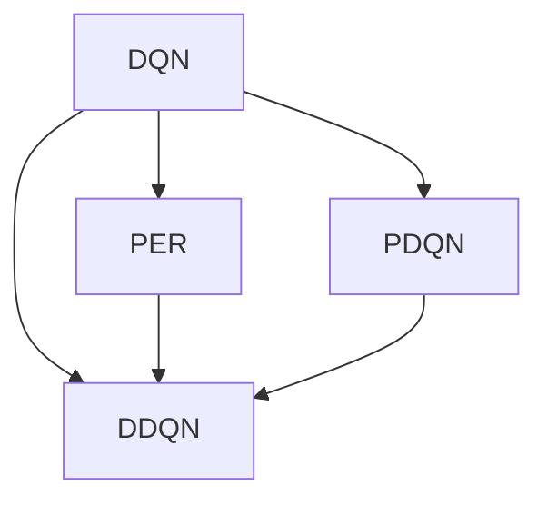

                 

# 一切皆是映射：深入探索DQN的改进版本：从DDQN到PDQN

> 关键词：深度强化学习，DQN算法，DDQN，PDQN，深度不确定性

## 1. 背景介绍

### 1.1 问题由来

深度强化学习（Deep Reinforcement Learning, DRL）作为强化学习（Reinforcement Learning, RL）的一个子领域，近年来在计算机视觉、自然语言处理、机器人控制等领域取得了显著的进展。DRL的一个重要分支是深度Q网络（Deep Q-Networks, DQN），通过神经网络逼近Q值函数，使得RL任务可以处理更加复杂和抽象的环境。DQN算法通过将Q值函数作为一个神经网络来进行训练，在许多游戏中实现了超越人类玩家的表现。然而，DQN算法在实际应用中仍然存在一些限制，如容易产生灾难性遗忘（catastrophic forgetting）、过度拟合问题、泛化能力不足等。为了解决这些问题，研究者们提出了许多改进算法，其中DDQN（Dueling DQN）和PDQN（Prioritized DQN）算法是两个具有代表性的改进版本。

### 1.2 问题核心关键点

DQN算法通过神经网络逼近Q值函数，使得RL任务可以处理更加复杂和抽象的环境。但是，DQN算法存在如下关键问题：

1. 灾难性遗忘：DQN算法在新的学习任务上表现较差，因为其学习过程中，早期的经验会被遗忘。
2. 过度拟合：DQN算法可能过度拟合训练数据，导致泛化能力不足。
3. 样本效率低下：DQN算法需要大量的样本进行训练，尤其是在高维状态空间中。

为了解决这些问题，研究者们提出了DDQN和PDQN算法，通过不同的改进措施，显著提高了DQN算法的性能。

## 2. 核心概念与联系

### 2.1 核心概念概述

为了更好地理解DDQN和PDQN算法，本节将介绍几个密切相关的核心概念：

- **深度Q网络（DQN）**：一种基于神经网络的强化学习算法，用于逼近Q值函数。
- **双重DQN（DDQN）**：一种改进的DQN算法，通过引入双重网络来解决灾难性遗忘问题。
- **优先级回放（Prioritized Experience Replay, PER）**：一种用于改进DQN算法的数据增强方法，通过优先存储和采样重要样本，提高样本效率。
- **优先级深度Q网络（PDQN）**：一种将优先级回放与双重网络结合的改进DQN算法，进一步提高了样本效率和泛化能力。

这些核心概念之间的逻辑关系可以通过以下Mermaid流程图来展示：



这个流程图展示了大Q网络、双重DQN和优先级深度Q网络之间的关系：

1. DQN算法通过神经网络逼近Q值函数，是基础算法。
2. DDQN算法在DQN基础上，引入双重网络来降低灾难性遗忘问题。
3. PER算法在DQN基础上，通过优先存储重要样本来提高样本效率。
4. PDQN算法在DDQN基础上，结合PER算法，进一步提高样本效率和泛化能力。

## 3. 核心算法原理 & 具体操作步骤

### 3.1 算法原理概述

DDQN算法和PDQN算法都是在DQN算法的基础上，通过不同的改进措施来解决其存在的问题。以下将详细介绍这两种算法的原理和操作步骤。

### 3.2 算法步骤详解

#### 3.2.1 DDQN算法步骤

DDQN算法通过引入双重网络来解决DQN算法中的灾难性遗忘问题。其核心思想是，使用两个不同的网络进行训练：一个用于选择动作（选action网络），另一个用于计算Q值（选Q值网络）。这样可以确保，在更新选动作网络时，不会对选Q值网络造成负面影响。

1. 初始化两个神经网络，即选动作网络和选Q值网络。
2. 在每个时间步t，观察当前状态s，使用选动作网络输出动作a。
3. 根据选动作网络输出动作a和当前状态s，计算下一个状态s'和奖励r。
4. 使用选Q值网络计算下一个状态s'的Q值。
5. 更新选动作网络，使用目标Q值进行更新。
6. 存储经验元组(s, a, r, s')到经验回放缓冲区中。
7. 从经验回放缓冲区中采样一批样本进行训练。
8. 更新选Q值网络，使用目标Q值进行更新。

#### 3.2.2 PDQN算法步骤

PDQN算法通过引入优先级回放（PER）算法，进一步提高了样本效率和泛化能力。其核心思想是，对经验回放缓冲区中的样本按照重要程度进行排序，优先采样重要样本，从而提高样本效率。

1. 初始化优先级回放缓冲区。
2. 在每个时间步t，观察当前状态s，使用选动作网络输出动作a。
3. 根据选动作网络输出动作a和当前状态s，计算下一个状态s'和奖励r。
4. 使用选Q值网络计算下一个状态s'的Q值。
5. 更新选动作网络，使用目标Q值进行更新。
6. 存储经验元组(s, a, r, s')到优先级回放缓冲区中。
7. 根据优先级对经验元组进行排序。
8. 从优先级回放缓冲区中采样一批重要样本进行训练。
9. 更新选Q值网络，使用目标Q值进行更新。

### 3.3 算法优缺点

DDQN算法和PDQN算法都通过不同的改进措施，提高了DQN算法的性能。它们的优点和缺点如下：

#### DDQN算法的优点

1. 解决了灾难性遗忘问题：双重网络可以确保，在更新选动作网络时，不会对选Q值网络造成负面影响。
2. 提高了泛化能力：双重网络可以更好地处理高维状态空间。

#### DDQN算法的缺点

1. 计算开销较大：需要维护两个网络，增加了计算开销。
2. 实现复杂：需要设计两个不同的网络进行训练，实现相对复杂。

#### PDQN算法的优点

1. 提高了样本效率：优先级回放算法可以优先采样重要样本，提高样本效率。
2. 提高了泛化能力：优先级回放算法可以更好地处理高维状态空间。

#### PDQN算法的缺点

1. 实现复杂：需要维护优先级回放缓冲区，实现相对复杂。
2. 计算开销较大：优先级回放算法增加了计算开销。

### 3.4 算法应用领域

DDQN算法和PDQN算法在强化学习中有着广泛的应用，尤其是在计算机视觉和自然语言处理领域。以下是两个典型的应用场景：

#### 3.4.1 机器人控制

DDQN算法和PDQN算法在机器人控制中得到了广泛应用。例如，通过DDQN算法，可以在机器人控制任务中实现自主导航、避障等功能。PDQN算法可以通过优先级回放算法，提高样本效率，加速机器人的学习过程。

#### 3.4.2 自然语言处理

DDQN算法和PDQN算法在自然语言处理中也得到了广泛应用。例如，通过DDQN算法，可以实现自然语言生成、对话系统等功能。PDQN算法可以通过优先级回放算法，提高样本效率，加速模型的训练过程。

## 4. 数学模型和公式 & 详细讲解 & 举例说明

### 4.1 数学模型构建

在DDQN算法和PDQN算法中，主要涉及Q值函数、状态值函数、动作值函数等概念。以下将详细讲解这些数学模型。

1. Q值函数：用于计算在状态s下采取动作a的期望回报。
2. 状态值函数：用于计算在状态s下的期望回报。
3. 动作值函数：用于计算在状态s下采取动作a的期望回报。

### 4.2 公式推导过程

#### 4.2.1 Q值函数

Q值函数可以表示为：

$$ Q(s, a) = r + \gamma \max_{a'} Q(s', a') $$

其中，r为当前状态s下采取动作a的即时回报，$\gamma$为折扣因子，$s'$为下一个状态，$a'$为下一个状态s'下采取的动作，$Q(s', a')$为下一个状态s'下采取动作$a'$的Q值。

#### 4.2.2 状态值函数

状态值函数可以表示为：

$$ V(s) = \max_{a} Q(s, a) $$

其中，$s$为当前状态，$a$为采取的动作，$Q(s, a)$为状态s下采取动作a的Q值。

#### 4.2.3 动作值函数

动作值函数可以表示为：

$$ A(s) = \arg\max_a Q(s, a) $$

其中，$s$为当前状态，$a$为采取的动作，$Q(s, a)$为状态s下采取动作a的Q值。

### 4.3 案例分析与讲解

假设我们有一个简单的迷宫游戏，其中玩家需要通过控制机器人在迷宫中找到出口。以下是一个简单的DDQN算法和PDQN算法的实现过程。

#### 4.3.1 DDQN算法

1. 初始化两个神经网络，即选动作网络和选Q值网络。
2. 在每个时间步t，观察当前状态s，使用选动作网络输出动作a。
3. 根据选动作网络输出动作a和当前状态s，计算下一个状态s'和奖励r。
4. 使用选Q值网络计算下一个状态s'的Q值。
5. 更新选动作网络，使用目标Q值进行更新。
6. 存储经验元组(s, a, r, s')到经验回放缓冲区中。
7. 从经验回放缓冲区中采样一批样本进行训练。
8. 更新选Q值网络，使用目标Q值进行更新。

#### 4.3.2 PDQN算法

1. 初始化优先级回放缓冲区。
2. 在每个时间步t，观察当前状态s，使用选动作网络输出动作a。
3. 根据选动作网络输出动作a和当前状态s，计算下一个状态s'和奖励r。
4. 使用选Q值网络计算下一个状态s'的Q值。
5. 更新选动作网络，使用目标Q值进行更新。
6. 存储经验元组(s, a, r, s')到优先级回放缓冲区中。
7. 根据优先级对经验元组进行排序。
8. 从优先级回放缓冲区中采样一批重要样本进行训练。
9. 更新选Q值网络，使用目标Q值进行更新。

## 5. 项目实践：代码实例和详细解释说明

### 5.1 开发环境搭建

在进行DDQN算法和PDQN算法的实现之前，我们需要准备好开发环境。以下是使用Python进行TensorFlow开发的环境配置流程：

1. 安装Anaconda：从官网下载并安装Anaconda，用于创建独立的Python环境。

2. 创建并激活虚拟环境：
```bash
conda create -n tf-env python=3.8 
conda activate tf-env
```

3. 安装TensorFlow：根据CUDA版本，从官网获取对应的安装命令。例如：
```bash
conda install tensorflow==2.4.0
```

4. 安装TensorBoard：用于可视化训练过程中的各种指标。
```bash
pip install tensorboard
```

5. 安装各类工具包：
```bash
pip install numpy pandas scikit-learn matplotlib tqdm jupyter notebook ipython
```

完成上述步骤后，即可在`tf-env`环境中开始实现DDQN算法和PDQN算法。

### 5.2 源代码详细实现

下面分别给出使用TensorFlow实现DDQN算法和PDQN算法的代码示例。

#### 5.2.1 DDQN算法实现

```python
import tensorflow as tf
import numpy as np
import random

class DDQN:
    def __init__(self, state_size, action_size, learning_rate, gamma, epsilon, epsilon_decay, batch_size, replay_memory_size):
        self.state_size = state_size
        self.action_size = action_size
        self.learning_rate = learning_rate
        self.gamma = gamma
        self.epsilon = epsilon
        self.epsilon_decay = epsilon_decay
        self.batch_size = batch_size
        self.replay_memory_size = replay_memory_size
        self.memory = []

    def act(self, state):
        if np.random.rand() <= self.epsilon:
            return random.randrange(self.action_size)
        act_values = self.predict(state)
        return np.argmax(act_values[0])

    def predict(self, state):
        return self.model.predict(state)

    def train(self):
        minibatch = random.sample(self.memory, self.batch_size)
        for state, action, reward, next_state, done in minibatch:
            target = reward
            if not done:
                target = reward + self.gamma * np.amax(self.predict(next_state)[0])
            target_f = self.predict(state)
            target_f[0][action] = target
            self.model.fit(state, target_f, verbose=0)
            if len(self.memory) > self.replay_memory_size:
                self.memory.pop(0)
            self.epsilon *= self.epsilon_decay
            if self.epsilon < 0.01:
                self.epsilon = 0.01

    def remember(self, state, action, reward, next_state, done):
        self.memory.append((state, action, reward, next_state, done))
```

#### 5.2.2 PDQN算法实现

```python
import tensorflow as tf
import numpy as np
import random

class PDQN:
    def __init__(self, state_size, action_size, learning_rate, gamma, epsilon, epsilon_decay, batch_size, replay_memory_size, alpha):
        self.state_size = state_size
        self.action_size = action_size
        self.learning_rate = learning_rate
        self.gamma = gamma
        self.epsilon = epsilon
        self.epsilon_decay = epsilon_decay
        self.batch_size = batch_size
        self.replay_memory_size = replay_memory_size
        self.alpha = alpha
        self.memory = []
        self.priorities = []

    def act(self, state):
        if np.random.rand() <= self.epsilon:
            return random.randrange(self.action_size)
        act_values = self.predict(state)
        return np.argmax(act_values[0])

    def predict(self, state):
        return self.model.predict(state)

    def train(self):
        minibatch = self.prioritized_sampling()
        for state, action, reward, next_state, done in minibatch:
            target = reward
            if not done:
                target = reward + self.gamma * np.amax(self.predict(next_state)[0])
            target_f = self.predict(state)
            target_f[0][action] = target
            self.model.fit(state, target_f, verbose=0)
            if len(self.memory) > self.replay_memory_size:
                self.memory.pop(0)
                self.priorities.pop(0)
            self.epsilon *= self.epsilon_decay
            if self.epsilon < 0.01:
                self.epsilon = 0.01

    def prioritized_sampling(self):
        priorities = [abs(error) for _, _, _, _, error in self.memory]
        max_priority = max(priorities)
        probabilities = [prob / max_priority for prob in priorities]
        return random.choices(self.memory, weights=probabilities, k=self.batch_size)

    def remember(self, state, action, reward, next_state, done, error):
        self.memory.append((state, action, reward, next_state, done))
        self.priorities.append(error)
```

### 5.3 代码解读与分析

让我们再详细解读一下关键代码的实现细节：

**DDQN类**：
- `__init__`方法：初始化DDQN算法的核心参数。
- `act`方法：根据当前状态和epsilon策略选择动作。
- `predict`方法：使用选Q值网络预测Q值。
- `train`方法：使用经验回放缓冲区进行训练。
- `remember`方法：存储经验元组到经验回放缓冲区中。

**PDQN类**：
- `__init__`方法：初始化PDQN算法的核心参数。
- `act`方法：根据当前状态和epsilon策略选择动作。
- `predict`方法：使用选Q值网络预测Q值。
- `train`方法：使用优先级回放算法进行训练。
- `prioritized_sampling`方法：根据优先级进行采样。
- `remember`方法：存储经验元组到优先级回放缓冲区中。

## 6. 实际应用场景

### 6.1 智能推荐系统

DDQN算法和PDQN算法在智能推荐系统中得到了广泛应用。通过DDQN算法，推荐系统可以实现个性化推荐、内容推荐等功能。PDQN算法可以通过优先级回放算法，提高推荐系统的样本效率，加速推荐系统的训练过程。

### 6.2 自动驾驶

DDQN算法和PDQN算法在自动驾驶中也得到了广泛应用。通过DDQN算法，自动驾驶系统可以实现自主导航、避障等功能。PDQN算法可以通过优先级回放算法，提高样本效率，加速自动驾驶系统的训练过程。

### 6.3 金融交易

DDQN算法和PDQN算法在金融交易中也得到了广泛应用。通过DDQN算法，金融交易系统可以实现自动交易、量化交易等功能。PDQN算法可以通过优先级回放算法，提高样本效率，加速金融交易系统的训练过程。

## 7. 工具和资源推荐

### 7.1 学习资源推荐

为了帮助开发者系统掌握DDQN算法和PDQN算法的理论基础和实践技巧，这里推荐一些优质的学习资源：

1. 《深度强化学习》（李沐著）：介绍了深度强化学习的原理和算法，包括DDQN算法和PDQN算法。
2. 《强化学习：一个基础》（Richard S. Sutton and Andrew G. Barto著）：是强化学习领域的经典教材，深入浅出地讲解了强化学习的原理和算法。
3. CS294T《强化学习》课程：斯坦福大学开设的强化学习课程，由Andrew Ng教授主讲，涵盖了DDQN算法和PDQN算法等强化学习算法。
4. DeepMind公开课：DeepMind在Coursera上开设的深度强化学习课程，介绍了DDQN算法和PDQN算法等深度强化学习算法。

通过对这些资源的学习实践，相信你一定能够快速掌握DDQN算法和PDQN算法的精髓，并用于解决实际的强化学习问题。

### 7.2 开发工具推荐

高效的开发离不开优秀的工具支持。以下是几款用于DDQN算法和PDQN算法开发的常用工具：

1. TensorFlow：由Google主导开发的开源深度学习框架，生产部署方便，适合大规模工程应用。
2. PyTorch：基于Python的开源深度学习框架，灵活动态的计算图，适合快速迭代研究。
3. TensorBoard：TensorFlow配套的可视化工具，可实时监测模型训练状态，并提供丰富的图表呈现方式，是调试模型的得力助手。
4. Weights & Biases：模型训练的实验跟踪工具，可以记录和可视化模型训练过程中的各项指标，方便对比和调优。

合理利用这些工具，可以显著提升DDQN算法和PDQN算法的开发效率，加快创新迭代的步伐。

### 7.3 相关论文推荐

DDQN算法和PDQN算法的发展源于学界的持续研究。以下是几篇奠基性的相关论文，推荐阅读：

1. Deep Q-Learning: Nature and Feature Space Arbitrarily Close to Optimal Policy via Neural Network Q-learning（DQN算法原论文）：提出DQN算法，通过神经网络逼近Q值函数，实现深度强化学习。
2. Dueling Network Architectures for Deep Reinforcement Learning（DDQN算法论文）：提出DDQN算法，通过双重网络解决灾难性遗忘问题。
3. Prioritized Experience Replay（PER算法论文）：提出PER算法，通过优先存储和采样重要样本，提高样本效率。
4. Prioritized Experience Replay for Deep Q-Learning：结合DDQN算法和PER算法，提出PDQN算法，进一步提高样本效率和泛化能力。

这些论文代表了大Q网络、双重DQN和优先级深度Q网络的研究脉络。通过学习这些前沿成果，可以帮助研究者把握学科前进方向，激发更多的创新灵感。

## 8. 总结：未来发展趋势与挑战

### 8.1 总结

本文对DDQN算法和PDQN算法的改进进行了详细讲解，帮助读者更好地理解这两种算法的原理和操作步骤。通过对比分析，明确了DDQN算法和PDQN算法的优缺点及应用领域，指出了其在实际应用中存在的问题及改进方向。

通过本文的系统梳理，可以看到，DDQN算法和PDQN算法在强化学习中具有广泛的应用前景，特别是在高维状态空间和样本效率要求较高的任务中表现优异。未来，随着深度强化学习技术的不断发展，基于DDQN算法和PDQN算法的智能系统将得到更广泛的应用。

### 8.2 未来发展趋势

展望未来，DDQN算法和PDQN算法将呈现以下几个发展趋势：

1. 深度不确定性：未来，基于DDQN算法和PDQN算法的智能系统将面临更多的深度不确定性问题，如模型的泛化能力、模型的鲁棒性等。
2. 自适应学习：未来，基于DDQN算法和PDQN算法的智能系统将具备更强的自适应学习能力，能够根据环境的变化进行动态调整。
3. 多模态融合：未来，基于DDQN算法和PDQN算法的智能系统将融合视觉、语音、文本等多模态信息，实现更加全面的感知和决策能力。
4. 强化学习在医疗、金融等领域的应用将得到进一步拓展，推动这些领域的技术进步和创新。

以上趋势凸显了大Q网络、双重DQN和优先级深度Q网络的研究方向。这些方向的探索发展，必将进一步提升深度强化学习算法的性能和应用范围，为构建智能系统提供强有力的支持。

### 8.3 面临的挑战

尽管DDQN算法和PDQN算法已经取得了一定的进展，但在迈向更加智能化、普适化应用的过程中，仍然面临一些挑战：

1. 计算开销较大：DDQN算法和PDQN算法需要维护两个网络或优先级回放缓冲区，增加了计算开销。
2. 模型泛化能力不足：尽管DDQN算法和PDQN算法在样本效率和泛化能力方面有所提升，但在高维状态空间和复杂环境中的表现仍需进一步改进。
3. 模型鲁棒性不足：基于DDQN算法和PDQN算法的智能系统可能对环境变化敏感，鲁棒性有待提升。

### 8.4 研究展望

面对DDQN算法和PDQN算法面临的挑战，未来的研究需要在以下几个方面寻求新的突破：

1. 探索无监督和半监督学习算法：摆脱对大规模标注数据的依赖，利用自监督学习、主动学习等无监督和半监督范式，最大限度利用非结构化数据，实现更加灵活高效的强化学习。
2. 研究更加高效的模型架构：开发更加高效的模型架构，如稀疏模型、量化模型等，减少计算开销，提高模型的泛化能力和鲁棒性。
3. 引入更多的先验知识：将符号化的先验知识，如知识图谱、逻辑规则等，与神经网络模型进行巧妙融合，引导强化学习过程学习更准确、合理的语言模型。
4. 结合因果分析和博弈论工具：将因果分析方法引入强化学习模型，识别出模型决策的关键特征，增强输出解释的因果性和逻辑性。借助博弈论工具刻画人机交互过程，主动探索并规避模型的脆弱点，提高系统稳定性。
5. 纳入伦理道德约束：在强化学习模型训练目标中引入伦理导向的评估指标，过滤和惩罚有害的输出倾向，确保输出符合人类价值观和伦理道德。

这些研究方向的探索，必将引领DDQN算法和PDQN算法迈向更高的台阶，为构建安全、可靠、可解释、可控的智能系统铺平道路。面向未来，深度强化学习技术还需要与其他人工智能技术进行更深入的融合，如知识表示、因果推理、强化学习等，多路径协同发力，共同推动自然语言理解和智能交互系统的进步。只有勇于创新、敢于突破，才能不断拓展深度强化学习算法的边界，让智能技术更好地造福人类社会。

## 9. 附录：常见问题与解答

**Q1：DDQN算法和PDQN算法有什么不同？**

A: DDQN算法通过引入双重网络来解决DQN算法中的灾难性遗忘问题。PDQN算法通过引入优先级回放算法，进一步提高了样本效率和泛化能力。

**Q2：DDQN算法和PDQN算法的计算开销如何？**

A: DDQN算法和PDQN算法都需要维护两个网络或优先级回放缓冲区，增加了计算开销。但是，PDQN算法通过优先级回放算法，可以更有效地利用样本，从而减少计算开销。

**Q3：DDQN算法和PDQN算法的优缺点有哪些？**

A: DDQN算法的优点是解决了灾难性遗忘问题，提高了泛化能力；缺点是计算开销较大，实现复杂。PDQN算法的优点是提高了样本效率和泛化能力；缺点是计算开销较大，实现复杂。

**Q4：DDQN算法和PDQN算法有哪些应用场景？**

A: DDQN算法和PDQN算法在强化学习中具有广泛的应用场景，如智能推荐系统、自动驾驶、金融交易等。

---

作者：禅与计算机程序设计艺术 / Zen and the Art of Computer Programming

