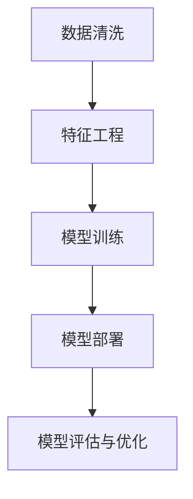

                 

# 一切皆是映射：神经网络在金融欺诈检测中的应用

> 关键词：神经网络, 金融欺诈检测, 数据清洗, 特征工程, 模型训练, 深度学习, 金融科技, 风险控制

## 1. 背景介绍

### 1.1 问题由来
金融欺诈是一种常见且危害巨大的非法行为，给个人和企业带来了巨大的经济损失。传统的金融欺诈检测方法主要依赖规则和人工审核，效率低、成本高、误报率高。近年来，随着深度学习技术的不断发展，基于神经网络的机器学习方法在金融欺诈检测领域取得了显著成效。

神经网络，特别是深度神经网络，通过多层次的特征提取和组合，能够自动学习到数据中的复杂模式，对于金融欺诈这种多维度、高复杂性的任务具有天然的优势。本文将深入探讨神经网络在金融欺诈检测中的应用，涵盖数据清洗、特征工程、模型训练等关键环节，并分析其优缺点和未来发展方向。

### 1.2 问题核心关键点
神经网络在金融欺诈检测中的应用主要包括以下几个关键点：

- 数据清洗：金融数据往往包含大量噪音和缺失值，需要通过清洗得到高质量的训练数据。
- 特征工程：选择合适的特征能够提升模型性能，包括基本特征、衍生特征、高阶特征等。
- 模型训练：选择合适的模型结构，通过大量标注数据训练模型，提升检测能力。
- 模型部署：将训练好的模型部署到实际应用中，实现实时欺诈检测。
- 模型评估与优化：定期评估模型性能，通过持续优化提升检测准确率和响应速度。

## 2. 核心概念与联系

### 2.1 核心概念概述

神经网络是一种模拟生物神经系统的计算模型，通过多层神经元之间的权重矩阵进行数据传递和变换。在金融欺诈检测中，神经网络可以从原始数据中自动学习到潜在的欺诈模式，提升检测精度和自动化程度。

金融欺诈检测涉及大量数据，数据质量对模型的性能至关重要。因此，数据清洗是神经网络应用的前提，能够有效减少噪音、填补缺失值，提高模型训练效果。

特征工程是神经网络应用的另一关键环节，通过特征选择、特征提取和特征组合，将原始数据转换为模型可识别的特征向量。特征的优劣直接影响到模型的训练效果，是提升模型性能的重要手段。

神经网络的训练过程是模型的核心，通过大量标注数据对模型进行训练，使得模型能够学习到数据中的欺诈模式，并自动进行特征组合和模式提取。训练的好坏直接决定模型的性能。

神经网络的部署是模型应用的最后一步，将训练好的模型部署到实际应用场景中，进行实时欺诈检测。模型的实时性、准确性和可解释性是部署过程中需要重点考虑的问题。

模型评估与优化是神经网络应用的持续过程，通过定期评估模型性能，发现问题并进行优化，提升模型效果。

这些核心概念之间的逻辑关系可以通过以下Mermaid流程图来展示：



这个流程图展示了神经网络在金融欺诈检测中的应用流程，从数据预处理到模型评估与优化，每一个环节都至关重要。

## 3. 核心算法原理 & 具体操作步骤
### 3.1 算法原理概述

神经网络在金融欺诈检测中的应用主要基于监督学习范式。通过标注好的欺诈数据集，训练一个分类模型，使得模型能够自动识别和分类新数据中的欺诈行为。

神经网络的输入为金融数据，经过多个隐藏层的非线性变换后，输出为欺诈与否的二分类结果。分类模型的训练过程即为模型的参数优化过程，通过反向传播算法计算梯度并更新参数，使得模型在训练集上达到最小损失函数。

常用的神经网络架构包括卷积神经网络（CNN）、循环神经网络（RNN）和长短时记忆网络（LSTM）等。在金融欺诈检测中，卷积神经网络因其在图像处理领域的成功应用，被广泛用于处理高维金融数据；循环神经网络则适用于处理时间序列数据，能够捕捉时间依赖性。

### 3.2 算法步骤详解

神经网络在金融欺诈检测中的应用步骤如下：

**Step 1: 数据清洗**
- 收集金融数据，包括交易记录、客户信息、市场数据等。
- 进行数据预处理，包括去重、去噪、缺失值填补等。

**Step 2: 特征工程**
- 选择合适的特征，如交易金额、交易时间、交易频率等。
- 对特征进行编码和归一化处理，转换为模型可接受的输入。
- 进行特征组合和降维，减少特征维度，提高模型训练效率。

**Step 3: 模型选择与设计**
- 根据数据特点选择合适的神经网络架构，如CNN、RNN、LSTM等。
- 设计网络结构，包括输入层、隐藏层、输出层等。
- 确定损失函数、优化器和训练策略。

**Step 4: 模型训练**
- 将清洗后的数据划分为训练集、验证集和测试集。
- 在训练集上训练模型，通过反向传播算法更新参数，最小化损失函数。
- 在验证集上进行模型评估，防止过拟合。

**Step 5: 模型部署与优化**
- 将训练好的模型部署到实际应用中，进行实时欺诈检测。
- 定期评估模型性能，进行调参和模型优化，提升检测精度和实时性。

### 3.3 算法优缺点

神经网络在金融欺诈检测中的应用具有以下优点：

- 自适应性：神经网络能够自动学习数据中的复杂模式，适应多维度、高复杂性的金融数据。
- 高精度：通过大量标注数据训练，神经网络能够获得高精度的检测结果。
- 实时性：神经网络模型可以部署到实际应用中，进行实时欺诈检测。

同时，神经网络的应用也存在以下缺点：

- 数据依赖性：神经网络需要大量标注数据进行训练，标注成本较高。
- 模型复杂度：神经网络模型复杂，训练和推理速度较慢，对硬件资源要求较高。
- 可解释性：神经网络模型通常被称为“黑盒”模型，难以解释模型的决策过程。

## 4. 数学模型和公式 & 详细讲解
### 4.1 数学模型构建

神经网络在金融欺诈检测中的应用主要基于分类任务。设输入数据为 $x$，输出为 $y$，神经网络模型的输入层为 $x_i$，隐藏层为 $h_i$，输出层为 $y_i$。神经网络的数学模型为：

$$
y_i = \sigma(\sum_{j=1}^n w_{ij}h_{j-1} + b_i)
$$

其中，$\sigma$ 为激活函数，$w_{ij}$ 为权重矩阵，$b_i$ 为偏置项。

设 $l$ 为损失函数，常用的分类损失函数包括交叉熵损失函数和均方误差损失函数。神经网络的训练目标为最小化损失函数 $l$：

$$
\min_{\theta} l(x_i, y_i)
$$

其中，$\theta$ 为模型参数，包括权重矩阵和偏置项。

### 4.2 公式推导过程

以交叉熵损失函数为例，其推导过程如下：

设神经网络的输出为 $y_i$，真实标签为 $y$，则交叉熵损失函数为：

$$
l(x_i, y_i) = -y\log y_i - (1-y)\log (1-y_i)
$$

对每个样本的损失函数求和，得到训练集的经验风险：

$$
\mathcal{L}(\theta) = \frac{1}{N}\sum_{i=1}^N l(x_i, y_i)
$$

其中，$N$ 为训练集样本数。

神经网络的训练过程是参数优化的过程，通过反向传播算法计算梯度并更新参数，最小化损失函数 $\mathcal{L}(\theta)$。训练过程的优化算法包括随机梯度下降（SGD）、Adam等，其中 Adam 因其高效性和稳定性，成为目前最流行的优化算法之一。

### 4.3 案例分析与讲解

以金融交易欺诈检测为例，假设输入为交易金额 $x$，输出为欺诈与否 $y$。可以设计一个简单的多层感知器（MLP）神经网络，包括输入层、隐藏层和输出层。具体步骤如下：

**Step 1: 数据清洗**
- 收集交易数据，去除异常值和重复记录。
- 对缺失值进行填补，如使用均值填补或插值法。

**Step 2: 特征工程**
- 选择交易金额、交易时间、交易频率等特征。
- 对特征进行编码和归一化处理，转换为模型可接受的输入。

**Step 3: 模型选择与设计**
- 设计一个包含两个隐藏层的多层感知器神经网络，每个隐藏层包含100个神经元。
- 设置交叉熵损失函数和Adam优化器。

**Step 4: 模型训练**
- 将数据划分为训练集、验证集和测试集，比例为7:1:2。
- 在训练集上训练模型，通过反向传播算法更新参数。
- 在验证集上进行模型评估，调整超参数。

**Step 5: 模型部署与优化**
- 将训练好的模型部署到实际应用中，进行实时欺诈检测。
- 定期评估模型性能，进行调参和模型优化。

## 5. 项目实践：代码实例和详细解释说明
### 5.1 开发环境搭建

神经网络在金融欺诈检测中的应用需要使用Python和相关的深度学习框架，如TensorFlow或PyTorch。以下是开发环境的搭建步骤：

1. 安装Python：从官网下载并安装Python，建议使用3.8及以上版本。

2. 安装深度学习框架：
   - 安装TensorFlow：
   ```
   pip install tensorflow==2.4
   ```
   - 安装PyTorch：
   ```
   pip install torch torchvision torchaudio
   ```

3. 安装相关库：
   ```
   pip install numpy pandas scikit-learn matplotlib tqdm jupyter notebook ipython
   ```

4. 安装数据集：
   - 下载金融交易数据集，如Kaggle上的NIPS07金融交易数据集。
   - 下载标注数据集，如Kaggle上的欺诈交易数据集。

完成上述步骤后，即可在Python环境中进行神经网络的应用实践。

### 5.2 源代码详细实现

以下是使用TensorFlow进行神经网络在金融欺诈检测中应用的完整代码实现：

```python
import tensorflow as tf
from tensorflow.keras.models import Sequential
from tensorflow.keras.layers import Dense, Dropout
from tensorflow.keras.optimizers import Adam
from sklearn.model_selection import train_test_split
import pandas as pd
import numpy as np

# 读取数据集
df = pd.read_csv('financial_data.csv')
X = df.drop(['transaction_id'], axis=1)
y = df['is_fraud']

# 数据预处理
X = X.fillna(X.mean())
X = (X - X.mean()) / X.std()

# 划分数据集
X_train, X_test, y_train, y_test = train_test_split(X, y, test_size=0.2, random_state=42)

# 定义模型
model = Sequential([
    Dense(100, activation='relu', input_shape=(X_train.shape[1],)),
    Dropout(0.5),
    Dense(100, activation='relu'),
    Dropout(0.5),
    Dense(1, activation='sigmoid')
])

# 定义损失函数和优化器
loss = 'binary_crossentropy'
optimizer = Adam(learning_rate=0.001)

# 编译模型
model.compile(loss=loss, optimizer=optimizer, metrics=['accuracy'])

# 训练模型
model.fit(X_train, y_train, epochs=50, batch_size=32, validation_data=(X_test, y_test))

# 评估模型
test_loss, test_acc = model.evaluate(X_test, y_test, verbose=2)
print(f'Test loss: {test_loss}, Test accuracy: {test_acc}')
```

### 5.3 代码解读与分析

以下是代码的详细解读与分析：

**数据预处理**
- 使用`fillna`方法填补缺失值，使用均值填补缺失值。
- 对数据进行归一化处理，使用`(X - X.mean()) / X.std()`计算标准化。

**模型定义**
- 定义一个包含两个隐藏层的多层感知器神经网络，每个隐藏层包含100个神经元。
- 使用`Dense`层定义全连接层，使用`Activation`层定义激活函数。

**模型训练**
- 使用`fit`方法训练模型，设置训练轮数为50，批次大小为32。
- 使用`validation_data`参数设置验证集，评估模型性能。

**模型评估**
- 使用`evaluate`方法评估模型，输出测试损失和准确率。

## 6. 实际应用场景
### 6.1 智能投顾

智能投顾（Robo-Advisors）是金融科技领域的创新应用，利用机器学习和大数据技术，为客户提供个性化的投资建议和理财规划。智能投顾系统需要实时分析客户行为和市场数据，进行风险评估和投资组合优化。

在智能投顾系统中，神经网络可以用于客户行为分析、市场数据处理和投资组合推荐等任务。通过分析客户的交易记录和行为数据，神经网络能够自动学习客户的投资偏好和风险承受能力，提供个性化的投资建议。同时，通过分析市场数据，神经网络能够捕捉市场趋势和波动，提供实时的市场预测和投资组合优化。

### 6.2 信用评分

信用评分是金融机构评估客户信用风险的重要手段。传统的信用评分方法依赖于手工设计的特征和规则，无法充分利用大数据的潜力。神经网络可以自动学习客户的历史交易记录、社会关系、行为数据等，提升信用评分的准确性和自动化程度。

在信用评分系统中，神经网络可以用于客户行为分析、社会网络分析和信用评分预测等任务。通过分析客户的交易记录和社交网络数据，神经网络能够自动学习客户的信用行为模式，提升信用评分的准确性。同时，通过分析客户的历史行为和社会关系，神经网络能够捕捉客户的信用风险，提供个性化的信用评分。

### 6.3 风险预警

金融风险预警系统能够实时监测市场动态，识别潜在的风险和异常行为，进行风险预警和应对。神经网络可以用于交易行为分析、市场异常检测和风险预警等任务。

在金融风险预警系统中，神经网络可以用于交易行为分析、市场异常检测和风险预警等任务。通过分析客户的交易记录和市场数据，神经网络能够自动学习市场趋势和异常行为，进行实时预警。同时，通过分析交易行为和市场数据，神经网络能够识别潜在的欺诈行为，进行风险预警和应对。

### 6.4 未来应用展望

神经网络在金融欺诈检测中的应用前景广阔，未来有望进一步拓展到更多的金融科技应用中。

1. 智能合约：智能合约是区块链技术的重要应用，用于自动执行金融交易和合同条款。神经网络可以用于智能合约的风险评估和自动化执行，提升合约执行的效率和安全性。

2. 金融市场预测：神经网络可以用于金融市场预测，分析市场数据和历史交易记录，提供实时的市场预测和投资建议。

3. 金融监管：神经网络可以用于金融监管，分析市场数据和行为数据，进行风险预警和异常检测，帮助监管机构及时发现和应对金融风险。

4. 保险风险管理：神经网络可以用于保险风险管理，分析客户的历史数据和行为数据，进行风险评估和理赔审核，提升保险理赔的效率和准确性。

未来，随着神经网络技术的不断发展和应用，其将进一步渗透到金融科技的各个环节，提升金融服务的效率和智能化水平。

## 7. 工具和资源推荐
### 7.1 学习资源推荐

以下是一些推荐的学习资源，帮助深入理解神经网络在金融欺诈检测中的应用：

1. 《深度学习》课程：斯坦福大学的Coursera深度学习课程，涵盖深度学习的基本概念和应用，适合初学者。

2. 《神经网络与深度学习》书籍：Michael Nielsen的书籍，详细介绍了神经网络的工作原理和应用，适合深度学习的进阶学习者。

3. TensorFlow官方文档：TensorFlow官方文档，提供了详细的API文档和代码示例，适合实用开发。

4. PyTorch官方文档：PyTorch官方文档，提供了详细的API文档和代码示例，适合实用开发。

5. Kaggle竞赛：参加Kaggle上的金融欺诈检测竞赛，实战练兵，提升技能。

### 7.2 开发工具推荐

以下是一些推荐的开发工具，帮助进行神经网络在金融欺诈检测中的应用：

1. Jupyter Notebook：用于数据处理和模型训练，支持Python和TensorFlow等深度学习框架。

2. Anaconda：用于数据管理和环境搭建，支持Python和相关库的安装。

3. TensorBoard：TensorFlow配套的可视化工具，实时监测模型训练状态，提供详细的图表和报告。

4. Keras：高层次的深度学习框架，易于上手，适合快速原型开发。

5. PyTorch：灵活的深度学习框架，支持动态计算图，适合复杂的模型训练和推理。

### 7.3 相关论文推荐

以下是一些推荐的相关论文，深入理解神经网络在金融欺诈检测中的应用：

1. "Deep Neural Networks for Fraud Detection in Financial Transactions"：论文提出基于深度神经网络的金融欺诈检测方法，详细介绍了模型的架构和训练过程。

2. "Fraud Detection Using Deep Learning"：论文介绍了深度学习在金融欺诈检测中的应用，包括数据预处理、特征选择和模型训练等关键环节。

3. "A Survey on Deep Learning Techniques for Credit Scoring"：论文综述了深度学习在信用评分中的应用，介绍了不同模型的优缺点和应用场景。

4. "Application of Neural Networks to Real-Time Fraud Detection"：论文介绍了神经网络在实时欺诈检测中的应用，详细讨论了模型的实时性和准确性。

5. "Fraud Detection in E-commerce: A Survey"：论文综述了电商欺诈检测的最新进展，介绍了不同模型的性能和应用效果。

## 8. 总结：未来发展趋势与挑战
### 8.1 研究成果总结

神经网络在金融欺诈检测中的应用取得了显著成果，提升了检测的精度和自动化程度。主要成果包括：

1. 自适应性：神经网络能够自动学习数据中的复杂模式，适应多维度、高复杂性的金融数据。

2. 高精度：通过大量标注数据训练，神经网络能够获得高精度的检测结果。

3. 实时性：神经网络模型可以部署到实际应用中，进行实时欺诈检测。

### 8.2 未来发展趋势

神经网络在金融欺诈检测中的应用前景广阔，未来有望进一步拓展到更多的金融科技应用中。主要发展趋势包括：

1. 自动化程度提升：未来的金融科技应用将更加注重自动化程度，提升客户体验和服务效率。

2. 模型复杂度降低：随着硬件资源的不断提升，神经网络的模型复杂度有望进一步降低，提升实时性和稳定性。

3. 可解释性增强：神经网络的可解释性是当前的一个重要研究方向，未来的模型将更加注重可解释性和透明性。

4. 多模态融合：未来的神经网络模型将更加注重多模态数据的融合，提升对复杂金融数据的处理能力。

5. 联邦学习：联邦学习是一种分布式机器学习方法，未来的金融欺诈检测系统将更加注重联邦学习的应用，保护数据隐私和安全。

### 8.3 面临的挑战

尽管神经网络在金融欺诈检测中的应用取得了显著进展，但仍面临一些挑战：

1. 数据依赖性：神经网络需要大量标注数据进行训练，标注成本较高。

2. 模型复杂度：神经网络模型复杂，训练和推理速度较慢，对硬件资源要求较高。

3. 可解释性：神经网络通常被称为“黑盒”模型，难以解释模型的决策过程。

4. 隐私保护：金融数据涉及敏感信息，如何在保障隐私的前提下进行模型训练和应用，是当前的一个重要研究方向。

5. 对抗攻击：神经网络模型容易受到对抗攻击，如何在保障安全的前提下进行模型训练和部署，是当前的一个重要研究方向。

### 8.4 研究展望

未来的研究需要在以下几个方面寻求新的突破：

1. 无监督学习和半监督学习：探索无监督学习和半监督学习的方法，降低对标注数据的依赖，提升模型的泛化能力。

2. 参数高效微调：开发更加参数高效的微调方法，在固定大部分预训练参数的同时，只更新极少量的任务相关参数。

3. 对抗训练：引入对抗训练技术，提升模型的鲁棒性和抗攻击能力。

4. 多模态融合：引入多模态数据融合技术，提升模型对复杂金融数据的处理能力。

5. 联邦学习：引入联邦学习技术，保护数据隐私和安全性，提升模型的公平性和透明性。

这些研究方向的探索，将推动神经网络在金融欺诈检测中的应用走向新的高度，为金融科技的发展注入新的动力。

## 9. 附录：常见问题与解答

**Q1：神经网络在金融欺诈检测中的训练数据如何获取？**

A: 神经网络在金融欺诈检测中的训练数据可以从多个渠道获取：

1. 公开数据集：如Kaggle上的金融交易数据集和欺诈数据集，可以进行数据分析和特征工程。

2. 内部数据：金融机构可以提供内部交易数据和客户信息，用于训练模型。

3. 合成数据：可以生成合成数据，如生成对抗网络（GAN）等，用于模型训练和测试。

**Q2：神经网络在金融欺诈检测中如何防止过拟合？**

A: 神经网络在金融欺诈检测中防止过拟合的方法包括：

1. 数据增强：通过数据增强技术，如数据扩充、随机化等，增加训练数据的多样性，减少过拟合。

2. 正则化：使用L2正则化、Dropout等方法，限制模型的复杂度，防止过拟合。

3. 提前停止：在验证集上进行模型评估，当模型在验证集上的性能不再提升时，停止训练，防止过拟合。

4. 模型集成：使用集成学习的方法，将多个模型的预测结果进行加权平均，提升模型的泛化能力。

**Q3：神经网络在金融欺碎检测中的模型选择有哪些？**

A: 神经网络在金融欺诈检测中的模型选择包括：

1. 多层感知器（MLP）：适用于处理高维数据，适用于特征选择和降维。

2. 卷积神经网络（CNN）：适用于处理时间序列数据，适用于特征提取和模式识别。

3. 循环神经网络（RNN）：适用于处理序列数据，适用于捕捉时间依赖性。

4. 长短时记忆网络（LSTM）：适用于处理长序列数据，适用于捕捉时间依赖性。

**Q4：神经网络在金融欺诈检测中的优化策略有哪些？**

A: 神经网络在金融欺诈检测中的优化策略包括：

1. 超参数调优：通过超参数调优，如学习率、批次大小、网络层数等，提升模型效果。

2. 模型裁剪：通过模型裁剪技术，去除不必要的层和参数，提升模型的实时性和稳定性。

3. 量化加速：通过量化加速技术，将浮点模型转为定点模型，提升模型的计算速度和内存占用。

4. 模型压缩：通过模型压缩技术，如剪枝、知识蒸馏等，减小模型的参数量和计算资源消耗。

**Q5：神经网络在金融欺碎检测中的部署有哪些方法？**

A: 神经网络在金融欺诈检测中的部署方法包括：

1. 服务器部署：将模型部署在服务器上，进行实时欺诈检测。

2. 云服务部署：将模型部署在云服务平台上，如AWS、Google Cloud等，实现实时化和可扩展性。

3. 边缘计算部署：将模型部署在边缘设备上，如移动设备、智能家居等，实现本地化和实时性。

---

作者：禅与计算机程序设计艺术 / Zen and the Art of Computer Programming

