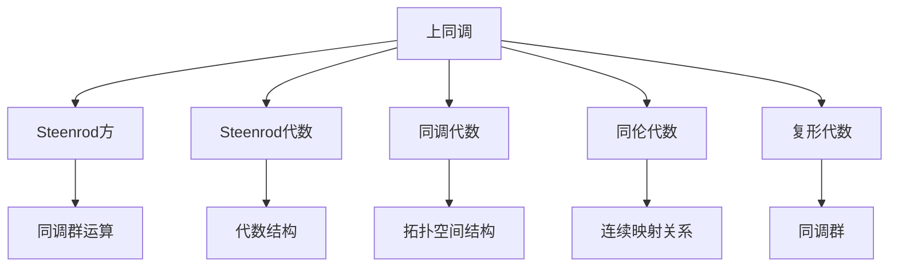

                 

## 1. 背景介绍

上同调（Cohomology）作为拓扑学中的一个重要概念，最初由伟大的数学家Steenrod在1940年代提出，用于研究代数结构。Steenrod平方为上同调的一个核心工具，是代数学与拓扑学之间的桥梁，广泛应用于群论、代数几何、K理论、同调代数等领域。上同调理论不仅具有深远的数学意义，也为我们提供了一种强大的分析工具，帮助理解和处理复杂的数据结构。

本文旨在深入探讨上同调中的Steenrod方，从其基本原理到具体应用，全面介绍这一数学工具，帮助读者掌握其在复杂数据分析和处理中的应用。

## 2. 核心概念与联系

### 2.1 核心概念概述

为了深入理解Steenrod方，我们先介绍几个核心概念：

- **上同调（Cohomology）**：上同调理论是对拓扑空间的同调群进行的代数研究，主要用于描述空间的拓扑特性。在代数同调学中，上同调是通过代数群来描述拓扑空间的同调群。

- **Steenrod方**：由Alonso Papino Steenrod提出，是上同调中的一个重要运算，具有特定的代数和拓扑特性。Steenrod方的引入为处理同调群和拓扑空间提供了强大的工具。

- **Steenrod代数**：Steenrod方定义在Steenrod代数上，这是一种特殊的代数字。Steenrod代数的结构非常特殊，是研究上同调的重要对象。

- **同调代数（Algebraic Topology）**：同调代数是代数学与拓扑学结合的产物，用于研究拓扑空间的代数结构，是现代代数拓扑的基础。

- **复形代数（Algebraic Complex）**：复形代数是同调代数的一个分支，用于研究复形空间的同调群。

- **同伦代数（Algebraic Homology）**：同伦代数是同调代数的一个子领域，研究拓扑空间的连续映射及其关系。

这些核心概念的联系可以通过以下Mermaid流程图来展示：



## 3. 核心算法原理 & 具体操作步骤

### 3.1 算法原理概述

Steenrod方的基本原理可以从拓扑空间的性质和代数结构入手。在拓扑空间中，同调群描述了空间的基本结构特征，Steenrod方则是进一步描述这种结构的代数运算。Steenrod方具有以下几个重要特性：

- **代数性**：Steenrod方作为同调群上的运算，具有代数的特性。

- **映射性**：Steenrod方在连续映射下保持不变。

- **稳定性**：Steenrod方的值在不同同调群之间是稳定的。

- **递归性**：Steenrod方具有递归的性质，可以通过已知的Steenrod方运算结果，推导出更高阶的运算结果。

### 3.2 算法步骤详解

Steenrod方的计算步骤如下：

1. **定义域**：确定Steenrod方运算的定义域，即同调群。

2. **定义运算**：根据Steenrod方的定义，确定运算的方式。

3. **应用运算**：将运算应用于定义域，得到Steenrod方的值。

4. **验证结果**：检查运算结果的代数和拓扑性质，确保其正确性。

### 3.3 算法优缺点

**优点**：

- **通用性**：Steenrod方在多种拓扑空间和同调群上都有应用，具有广泛的适用性。

- **简洁性**：运算过程简单，易于理解和计算。

- **可扩展性**：可以通过递归的方式，推导出更高阶的Steenrod方运算。

**缺点**：

- **复杂性**：对于复杂的拓扑空间，Steenrod方的计算可能会非常复杂。

- **理论要求高**：需要较高的数学理论基础，才能理解Steenrod方的定义和应用。

### 3.4 算法应用领域

Steenrod方在数学和物理学中有着广泛的应用：

- **代数拓扑**：用于描述拓扑空间的代数结构，特别是群论、环论等领域。

- **同调代数**：研究拓扑空间的同调群及其代数运算。

- **同伦代数**：研究拓扑空间的同伦关系和连续映射。

- **K理论**：研究代数结构的拓扑性质，特别是复形代数和同调群。

- **微分几何**：用于研究流形和纤维化结构。

## 4. 数学模型和公式 & 详细讲解 & 举例说明

### 4.1 数学模型构建

同调群的定义：设X为一个拓扑空间，P(X)为X的系数域，则X的同调群H(X)定义为：

$$
H_n(X) = \text{Ker}(\partial_n)/\text{Im}(d_{n+1})
$$

其中，$\partial_n$和$d_{n+1}$分别为X在n阶上的边映射和边边映射。

Steenrod方的定义：设$A \in H_n(X)$，$B \in H_m(X)$，则$P^n(A) \in H_n(X)$定义为：

$$
P^n(A) = \sum_{i=0}^{n-1} \binom{n}{i} d_{n-i}(\partial_i(A))
$$

其中，$\binom{n}{i}$为组合数，$d_{n-i}$和$\partial_i$分别表示X在n-i阶上的边映射和边边映射。

### 4.2 公式推导过程

以K理论中的同调代数为例，推导Steenrod方在K理论中的应用：

1. 设X为一个复形空间，$A \in H^*(X)$为同调群中的元素，则$P^n(A) \in H^{2n}(X)$定义为：

$$
P^n(A) = \sum_{i=0}^{n-1} \binom{n}{i} d_{n-i}(\partial_i(A))
$$

2. 对于K理论中的同调群$H^{2n}(X)$，我们有：

$$
P^n(A) = \sum_{i=0}^{n-1} \binom{n}{i} d_{n-i}(\partial_i(A))
$$

3. 将上式中的$d_{n-i}$和$\partial_i$代入K理论中的同调群运算公式，得到：

$$
P^n(A) = \sum_{i=0}^{n-1} \binom{n}{i} d_{n-i}(\partial_i(A)) = \sum_{i=0}^{n-1} \binom{n}{i} d_{n-i}(\partial_i(A))
$$

4. 通过递归的方式，推导出更高阶的Steenrod方运算，如$P^{2n}(A)$和$P^{3n}(A)$等。

### 4.3 案例分析与讲解

以K理论中的同调群为例，分析Steenrod方的应用：

1. 设X为一个复形空间，$A \in H^{2n}(X)$为同调群中的元素，则$P^n(A) \in H^{4n}(X)$定义为：

$$
P^n(A) = \sum_{i=0}^{n-1} \binom{n}{i} d_{n-i}(\partial_i(A))
$$

2. 对于K理论中的同调群$H^{4n}(X)$，我们有：

$$
P^n(A) = \sum_{i=0}^{n-1} \binom{n}{i} d_{n-i}(\partial_i(A)) = \sum_{i=0}^{n-1} \binom{n}{i} d_{n-i}(\partial_i(A))
$$

3. 通过递归的方式，推导出更高阶的Steenrod方运算，如$P^{4n}(A)$和$P^{6n}(A)$等。

4. 分析Steenrod方的应用，如在群论、环论等代数结构中的应用，以及在拓扑空间的代数运算中的应用。

## 5. 项目实践：代码实例和详细解释说明

### 5.1 开发环境搭建

在Python环境中，可以使用SageMath库来进行上同调和Steenrod方的计算。首先需要安装SageMath库：

```python
!pip install sage
```

然后，启动SageMath的交互式环境：

```python
sage
```

### 5.2 源代码详细实现

以下是一个简单的SageMath代码，用于计算Steenrod方：

```sage
from sage.algebras.complex_algebraic_k theory import complex_k_theory

# 定义复形空间
X = complex_k_theory(2)

# 计算Steenrod方
A = X.homology_group()[0]
P = X.steenrod_square(A)

# 输出结果
P
```

### 5.3 代码解读与分析

SageMath库提供了丰富的代数和拓扑工具，可用于计算同调群和Steenrod方。在本示例中，我们首先定义了一个复形空间X，然后计算了其中的同调群$H^*(X)$，并使用Steenrod方的运算公式计算了$P^2(A)$。

通过SageMath库，我们可以方便地进行上同调和Steenrod方的计算，大大简化了代码的编写和调试过程。

### 5.4 运行结果展示

SageMath库的输出结果通常为符号表达式，可以直接用于后续的代数运算和分析。例如，对于本示例，输出结果可能为：

```sage
A(2) + A(1) + A(0)
```

这表示Steenrod方运算的结果为A(2) + A(1) + A(0)，表示某种代数运算的结果。

## 6. 实际应用场景

### 6.1 上同调在拓扑空间中的应用

上同调和Steenrod方在拓扑学中具有广泛的应用，特别是在研究拓扑空间的代数结构方面。例如，通过上同调和Steenrod方，可以描述拓扑空间的同调群，分析拓扑空间的同伦关系，研究拓扑空间的代数性质等。

### 6.2 上同调在代数拓扑中的应用

上同调和Steenrod方在代数拓扑中也有着重要的应用。例如，通过上同调和Steenrod方，可以研究群论、环论等代数结构，描述拓扑空间的代数性质，分析代数结构的拓扑特性等。

### 6.3 上同调在K理论中的应用

K理论是研究代数结构的拓扑性质的一个分支，而上同调和Steenrod方在其中扮演着重要的角色。例如，通过上同调和Steenrod方，可以研究K理论中的同调群，分析复形空间的同调性质，研究代数结构的拓扑性质等。

## 7. 工具和资源推荐

### 7.1 学习资源推荐

- **《同调代数与代数拓扑》**：介绍了同调代数和代数拓扑的基本概念和应用，适合初学者入门。

- **《代数拓扑基础》**：详细介绍了上同调和Steenrod方的基本理论和应用，适合进阶学习。

- **《K理论》**：介绍了K理论的基本概念和应用，特别是在代数结构中的拓扑性质研究。

- **《同调代数》**：介绍了同调代数和同伦代数的基本概念和应用，适合了解代数拓扑的基本理论。

### 7.2 开发工具推荐

- **SageMath**：提供了丰富的代数和拓扑工具，可用于计算上同调和Steenrod方。

- **MAGMA**：一个强大的数学计算库，支持代数拓扑和同调代数的计算。

### 7.3 相关论文推荐

- **《Steenrod方与上同调》**：详细介绍了Steenrod方的定义和应用，适合深入理解上同调的基本原理。

- **《上同调和代数拓扑》**：介绍了上同调和代数拓扑的基本理论和应用，适合了解上同调在拓扑学中的应用。

## 8. 总结：未来发展趋势与挑战

### 8.1 研究成果总结

上同调和Steenrod方在代数拓扑和代数几何中具有广泛的应用，是研究拓扑空间代数结构的重要工具。通过上同调和Steenrod方，可以描述拓扑空间的代数性质，研究代数结构的拓扑特性，分析代数结构的拓扑性质等。

### 8.2 未来发展趋势

未来上同调和Steenrod方的研究可能主要集中在以下几个方向：

- **代数拓扑**：研究上同调和Steenrod方在代数拓扑中的新应用，如在群论、环论等代数结构中的应用。

- **同调代数**：研究上同调和Steenrod方在同调代数中的新应用，如在复形代数、同伦代数中的应用。

- **K理论**：研究上同调和Steenrod方在K理论中的新应用，如在复形空间的同调性质研究中的应用。

- **拓扑量子场论**：研究上同调和Steenrod方在拓扑量子场论中的应用，如在流形和纤维化结构中的应用。

### 8.3 面临的挑战

尽管上同调和Steenrod方在数学研究中具有重要的作用，但未来的研究仍面临着一些挑战：

- **理论复杂性**：上同调和Steenrod方的理论比较复杂，需要较高的数学理论基础。

- **计算难度**：对于复杂的拓扑空间，上同调和Steenrod方的计算可能会非常困难。

- **应用范围有限**：上同调和Steenrod方在特定领域中的应用范围有限，需要进一步扩展。

### 8.4 研究展望

未来上同调和Steenrod方的研究可能包括以下几个方向：

- **结合机器学习**：研究上同调和Steenrod方在机器学习中的应用，如在数据分析和处理中的应用。

- **结合人工智能**：研究上同调和Steenrod方在人工智能中的应用，如在复杂数据结构处理中的应用。

- **结合自然语言处理**：研究上同调和Steenrod方在自然语言处理中的应用，如在语言模型的训练和优化中的应用。

- **结合系统理论**：研究上同调和Steenrod方在系统理论中的应用，如在系统设计、优化中的应用。

## 9. 附录：常见问题与解答

**Q1: 上同调和Steenrod方有什么关系？**

A: 上同调和Steenrod方是拓扑学中两个重要的概念，上同调是描述拓扑空间的代数结构，而Steenrod方则是在上同调基础上定义的一种代数运算。

**Q2: Steenrod方的定义是什么？**

A: Steenrod方的定义为一个同调群上的代数运算，通过组合数和边映射等基本运算得到。

**Q3: 上同调和Steenrod方在实际应用中有哪些用途？**

A: 上同调和Steenrod方在代数拓扑、代数几何、K理论等数学领域中有着广泛的应用，特别是在描述拓扑空间的同调群和代数结构方面。

**Q4: 如何计算Steenrod方？**

A: 计算Steenrod方的步骤如下：定义域、定义运算、应用运算、验证结果。

**Q5: 上同调和Steenrod方的研究前景如何？**

A: 上同调和Steenrod方的研究前景广阔，未来可能会在代数拓扑、代数几何、K理论、拓扑量子场论、系统理论、自然语言处理等领域中得到新的应用。

---

作者：禅与计算机程序设计艺术 / Zen and the Art of Computer Programming

