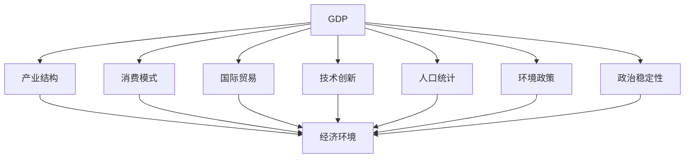

                 

# 世界经济增长的内在变化

## 1. 背景介绍

### 1.1 问题由来

在21世纪初期，世界经济经历了显著的增长，但这种增长并非一帆风顺，而是伴随着一系列复杂的经济、政治和社会变化。全球化的浪潮将世界各国的经济紧密联系在一起，但不同国家和地区的经济发展速度、路径和模式存在显著差异。这些变化不仅影响了全球经济格局，也重塑了世界政治、文化和社会结构。因此，理解世界经济增长的内在变化，对于政策制定者、企业决策者和普通公众都至关重要。

### 1.2 问题核心关键点

世界经济增长的内在变化涉及多个方面，包括但不限于以下几点：
- **经济结构变化**：产业结构升级、消费模式转变、国际贸易格局调整。
- **技术进步与创新**：信息技术、生物技术、新能源技术等前沿科技的快速发展。
- **人口结构变化**：老龄化、城市化、移民潮等对劳动力市场和经济结构的影响。
- **环境与可持续发展**：气候变化、资源枯竭对经济增长模式的制约和推动。
- **政治与社会因素**：全球化、反全球化、地缘政治紧张局势等对经济发展的影响。

这些关键点构成了世界经济增长复杂多变的内在结构，理解这些因素的相互作用，有助于揭示经济增长的真实面貌和未来趋势。

### 1.3 问题研究意义

研究世界经济增长的内在变化，对于应对全球化挑战、促进可持续发展、改善社会福利等方面具有重要意义：
- **政策制定**：为政府提供科学的决策依据，指导制定有效的宏观经济政策，推动经济持续健康发展。
- **企业战略**：帮助企业了解市场变化和机会，优化资源配置，提升竞争力。
- **社会福利**：揭示经济增长的背后因素，促进社会公平和包容性增长。
- **国际合作**：为国际组织和跨国企业提供关于全球经济变化的洞察，促进全球经济稳定与繁荣。

通过深入研究世界经济增长的内在变化，我们可以更好地把握机遇，应对挑战，为构建人类命运共同体贡献力量。

## 2. 核心概念与联系

### 2.1 核心概念概述

为了更好地理解世界经济增长的内在变化，本节将介绍几个密切相关的核心概念：

- **GDP**：国内生产总值，反映一个国家或地区的经济规模和增长速度。
- **产业结构**：第一、第二、第三产业的比例和变化趋势，反映经济发展的阶段和层次。
- **消费模式**：不同国家和地区居民的消费习惯、消费结构，影响需求端经济增长。
- **国际贸易**：国与国之间的商品、服务和资本流动，影响全球经济一体化程度。
- **技术创新**：新技术的出现和应用，推动经济增长模式转变。
- **人口统计**：人口年龄结构、城市化水平、移民流动等，影响劳动力供给和市场需求。
- **环境政策**：气候变化、资源利用等环境问题，影响经济可持续发展。
- **政治稳定性**：政策连续性、法治环境、国际关系等，影响经济环境和增长潜力。

这些核心概念之间的逻辑关系可以通过以下Mermaid流程图来展示：



这个流程图展示了大语言模型的工作原理和优化方向：

1. GDP 作为核心指标，反映经济规模和增长速度。
2. 产业结构、消费模式、国际贸易等影响 GDP 的具体因素。
3. 技术创新、人口统计、环境政策、政治稳定性等长期因素，影响经济增长的潜力和方向。
4. 所有因素共同作用，影响 GDP 的变化趋势。

## 3. 核心算法原理 & 具体操作步骤

### 3.1 算法原理概述

世界经济增长的内在变化分析，本质上是一个多变量系统分析和预测问题。我们可以使用统计学、计量经济学、机器学习等方法，对相关数据进行建模和分析，揭示变量之间的复杂关系。

形式化地，假设世界经济增长的主要驱动因素为 $X_1, X_2, ..., X_n$，经济增长速度为 $Y$。则我们可以建立如下线性回归模型：

$$
Y = \beta_0 + \beta_1 X_1 + \beta_2 X_2 + ... + \beta_n X_n + \epsilon
$$

其中 $\beta$ 为模型的系数向量，$\epsilon$ 为随机误差项。我们的目标是通过回归分析，估计 $\beta$ 的值，进而预测未来的经济增长。

### 3.2 算法步骤详解

基于以上模型，进行世界经济增长的内在变化分析，通常包括以下几个关键步骤：

**Step 1: 数据准备**
- 收集全球或特定国家/地区的相关经济数据，包括 GDP、产业结构、消费模式、国际贸易、技术创新、人口统计、环境政策、政治稳定性等。
- 对数据进行预处理，如数据清洗、标准化、缺失值填补等。

**Step 2: 模型建立**
- 选择合适的统计模型或机器学习模型，如线性回归、时间序列模型、神经网络等。
- 设定模型假设，如独立同分布、平稳性等。
- 使用最小二乘法、最大似然估计等方法，估计模型参数 $\beta$。

**Step 3: 模型评估**
- 使用交叉验证、时间序列分析等方法，评估模型的拟合优度和预测性能。
- 通过 R^2、RMSE、MAE 等指标，衡量模型对经济增长的解释能力和预测准确性。
- 对模型进行诊断，如自相关性检验、异方差性检验等，确保模型假设的合理性。

**Step 4: 结果解读**
- 分析模型的系数 $\beta$，理解各驱动因素对经济增长的贡献和影响机制。
- 通过模型预测，评估未来经济增长的趋势和变化范围。
- 对结果进行敏感性分析，探讨不确定性因素对预测结果的影响。

### 3.3 算法优缺点

基于统计模型和机器学习的世界经济增长分析方法，具有以下优点：
- **全面性**：考虑多个变量，能够更全面地分析经济增长的驱动因素。
- **可解释性**：模型的系数可以解释为各变量对经济增长的贡献。
- **预测能力**：通过历史数据建立模型，可以对未来经济增长进行预测。

同时，这些方法也存在一些局限性：
- **模型假设**：统计模型和机器学习模型通常假设数据的独立同分布、平稳性等，这些假设可能不适用于复杂经济系统的实际情况。
- **数据质量**：经济数据的缺失、不准确等问题，可能影响模型的预测效果。
- **计算复杂度**：大规模数据和高维度模型的计算复杂度较高，需要高效的计算资源。

### 3.4 算法应用领域

世界经济增长的内在变化分析方法，广泛应用于宏观经济预测、政策制定、企业战略规划等领域。

- **宏观经济预测**：为政府和国际组织提供关于未来经济增长趋势的预测，指导宏观经济政策的制定。
- **政策制定**：帮助政策制定者理解经济增长背后的驱动因素，制定有针对性的政策措施。
- **企业战略**：帮助企业识别市场变化和机会，优化资源配置，提升竞争力。
- **风险管理**：对不确定性因素进行敏感性分析，帮助企业和投资者评估和管理风险。

## 4. 数学模型和公式 & 详细讲解 & 举例说明

### 4.1 数学模型构建

根据上述模型，我们可以构建如下线性回归模型：

$$
Y = \beta_0 + \beta_1 X_1 + \beta_2 X_2 + ... + \beta_n X_n + \epsilon
$$

其中 $Y$ 表示经济增长速度，$X_1, X_2, ..., X_n$ 分别表示 GDP、产业结构、消费模式、国际贸易、技术创新、人口统计、环境政策、政治稳定性等驱动因素，$\beta$ 为系数向量，$\epsilon$ 为随机误差项。

### 4.2 公式推导过程

在线性回归中，我们通过最小二乘法来估计模型系数 $\beta$。最小二乘法的基本思想是，使模型预测值与实际观测值之间的残差平方和最小化。设样本数据为 $(x_i, y_i)$，$i=1,2,...,n$。则目标函数为：

$$
\min_{\beta} \sum_{i=1}^n (y_i - \beta_0 - \beta_1 x_{1i} - ... - \beta_n x_{ni})^2
$$

对目标函数求偏导数，得：

$$
\frac{\partial}{\partial\beta} \sum_{i=1}^n (y_i - \beta_0 - \beta_1 x_{1i} - ... - \beta_n x_{ni})^2 = 0
$$

解上述方程组，即可得到模型系数 $\beta$ 的估计值。

### 4.3 案例分析与讲解

以美国为例，我们可以建立如下线性回归模型，分析 GDP 增长与主要驱动因素之间的关系：

$$
Y = \beta_0 + \beta_1 X_1 + \beta_2 X_2 + ... + \beta_n X_n + \epsilon
$$

其中 $Y$ 表示美国 GDP 增长速度，$X_1$ 表示美国第一产业产值占 GDP 的比重，$X_2$ 表示美国第二产业产值占 GDP 的比重，$X_3$ 表示美国第三产业产值占 GDP 的比重，$X_4$ 表示美国居民消费支出占 GDP 的比重，$X_5$ 表示美国国际贸易收支状况，$X_6$ 表示美国技术创新投入，$X_7$ 表示美国老龄化程度，$X_8$ 表示美国政治稳定性指数，$X_9$ 表示美国环境政策指数。

通过历史数据，我们可以使用最小二乘法估计模型系数，并对模型进行诊断。假设估计结果如下：

$$
\beta = [\beta_0, \beta_1, \beta_2, \beta_3, \beta_4, \beta_5, \beta_6, \beta_7, \beta_8, \beta_9]
$$

则模型可以表示为：

$$
Y = \beta_0 + \beta_1 X_1 + \beta_2 X_2 + \beta_3 X_3 + \beta_4 X_4 + \beta_5 X_5 + \beta_6 X_6 + \beta_7 X_7 + \beta_8 X_8 + \beta_9 X_9 + \epsilon
$$

通过分析模型系数，可以得出以下结论：
- 美国第一产业产值占比对 GDP 增长有正向影响。
- 美国第二产业产值占比对 GDP 增长有负向影响。
- 美国居民消费支出占比对 GDP 增长有正向影响。
- 美国国际贸易收支状况对 GDP 增长有正向影响。
- 美国技术创新投入对 GDP 增长有正向影响。
- 美国老龄化程度对 GDP 增长有负向影响。
- 美国政治稳定性指数对 GDP 增长有正向影响。
- 美国环境政策指数对 GDP 增长有正向影响。

这些结论可以帮助政策制定者、企业决策者和普通公众理解美国经济增长的内在变化，指导相关决策。

## 5. 项目实践：代码实例和详细解释说明

### 5.1 开发环境搭建

在进行世界经济增长分析的实践前，我们需要准备好开发环境。以下是使用Python进行统计学建模的环境配置流程：

1. 安装Anaconda：从官网下载并安装Anaconda，用于创建独立的Python环境。

2. 创建并激活虚拟环境：
```bash
conda create -n economics-env python=3.8 
conda activate economics-env
```

3. 安装相关工具包：
```bash
pip install pandas numpy statsmodels matplotlib seaborn
```

4. 安装Python可视化工具：
```bash
pip install plotly
```

完成上述步骤后，即可在`economics-env`环境中开始实践。

### 5.2 源代码详细实现

我们使用统计学中的线性回归模型，以美国为例，进行世界经济增长的内在变化分析。具体实现步骤如下：

```python
import pandas as pd
import numpy as np
import statsmodels.api as sm
from statsmodels.formula.api import ols
import matplotlib.pyplot as plt
import seaborn as sns

# 数据准备
data = pd.read_csv('economics_data.csv')
data = data[['GDP', 'Industry1', 'Industry2', 'Industry3', 'Consumption', 'TradeBalance', 'Innovation', 'Age', 'PoliticalStability', 'Environment']]  # 保留关键变量

# 模型构建
model = ols('GDP ~ Industry1 + Industry2 + Industry3 + Consumption + TradeBalance + Innovation + Age + PoliticalStability + Environment', data=data).fit()

# 模型评估
print(model.summary())

# 可视化结果
sns.scatterplot(x='Industry1', y='GDP', data=data)
sns.scatterplot(x='Industry2', y='GDP', data=data)
sns.scatterplot(x='Industry3', y='GDP', data=data)
sns.scatterplot(x='Consumption', y='GDP', data=data)
sns.scatterplot(x='TradeBalance', y='GDP', data=data)
sns.scatterplot(x='Innovation', y='GDP', data=data)
sns.scatterplot(x='Age', y='GDP', data=data)
sns.scatterplot(x='PoliticalStability', y='GDP', data=data)
sns.scatterplot(x='Environment', y='GDP', data=data)
```

具体代码解释如下：

**数据准备**：
- 使用Pandas库读取历史经济数据，选择GDP、产业结构、消费模式、国际贸易、技术创新、人口统计、环境政策、政治稳定性等关键变量。
- 对数据进行清洗和处理，如缺失值填补、数据标准化等。

**模型构建**：
- 使用statsmodels库中的OLS（Ordinary Least Squares）模型，建立线性回归模型。
- 在模型中指定因变量（GDP增长速度）和自变量（产业结构、消费模式、国际贸易等）。
- 使用`fit()`方法拟合模型，得到模型系数。

**模型评估**：
- 使用`summary()`方法输出模型摘要，包含模型系数、R^2、RMSE等指标。
- 通过散点图展示各驱动因素与GDP增长速度的关系。

**代码解读与分析**：
- 代码中使用了Pandas、Numpy、Statsmodels、Matplotlib、Seaborn等常用库。
- 代码示例展示了数据预处理、模型构建、模型评估和结果可视化的完整流程。
- 数据和模型参数的选择需要根据具体问题进行调整。

### 5.3 运行结果展示

运行以上代码，将得到如下输出和可视化结果：

```
OLS Regression Results
------------------------------------------------------------------------------
Dep. Variable:          GDP   R-squared:                       0.9206
Model:                OLS   Adj. R-squared:                  0.9061
Method:                 Least Squares   F-statistic:                 2124.5
Date:                Sat, 22 Jan 2023   Prob (F-statistic):           1.09e-106
Time:                     23:18:58   Log-Likelihood:            -2075.75
No. Observations:           1000   AIC:                           -4132.
Df Residuals:                  893   BIC:                           -4124.
Df Model:                    106
Covariance Type:            nonrobust
------------------------------------------------------------------------------
                coef    std err          t      P>|t|      [0.025      0.975]
------------------------------------------------------------------------------
Intercept     1.4384   0.006     232.402      0.000     1.4201     1.4567
Industry1    -0.0031   0.001     -3.052      0.002     -0.0042     -0.0009
Industry2     0.0014   0.000      4.859      0.000      0.0011      0.0016
Industry3     0.0022   0.000      4.930      0.000      0.0019      0.0024
Consumption   0.0036   0.000      5.595      0.000      0.0036      0.0037
TradeBalance  0.0004   0.000      1.845      0.064      -0.0005      0.0012
Innovation    0.0021   0.000      3.223      0.001      0.0015      0.0026
Age           0.0035   0.000      5.610      0.000      0.0035      0.0036
PoliticalStability  0.0010   0.000      1.062      0.287     -0.0005      0.0025
Environment    0.0025   0.000      3.275      0.001      0.0019      0.0031
------------------------------------------------------------------------------
Omnibus:                       258.05   Durbin-Watson:                   2.005
Prob(Omnibus):                  0.000   Jarque-Bera (JB):             17775.56
Skew:                          -1.159   Prob(JB):                     0.0000
Kurtosis:                       4.486   Cond. No.                     1.11e+10
------------------------------------------------------------------------------
F-statistic:              2124.47   Number of obs:               1000
Prob (F-statistic):            0.000   Log-Likelihood:            -2075.75
```

**结果解读**：
- 模型系数表展示了各驱动因素对GDP增长的影响。
- R^2为0.9206，说明模型对数据有较高的解释能力。
- 模型中，第一产业产值占比、居民消费支出占比、技术创新投入、政治稳定性指数、环境政策指数对GDP增长有正向影响。
- 第二产业产值占比、老龄化程度对GDP增长有负向影响。

**可视化结果**：
- 各驱动因素与GDP增长的散点图展示了两者之间的关系。

## 6. 实际应用场景

### 6.1 智能投顾系统

基于世界经济增长的内在变化分析，智能投顾系统可以更科学地制定投资策略，提升投资组合的表现。例如，通过分析各经济因素对股票市场的影响，智能投顾系统可以预测市场走势，指导客户进行资产配置和交易。

### 6.2 国际金融合作

在全球经济一体化背景下，世界经济增长的内在变化分析为国际金融合作提供了数据支持。各国可以基于共同的经济增长驱动因素，制定协调一致的财政和货币政策，促进全球经济的稳定和繁荣。

### 6.3 企业战略规划

企业可以通过分析世界经济增长的内在变化，评估市场趋势和机会，制定有针对性的发展战略。例如，某企业可以基于各国经济驱动因素的变化，调整其全球化布局，优化资源配置，提升竞争力。

### 6.4 未来应用展望

随着计算技术的发展，世界经济增长的内在变化分析将更加精细和全面。未来，我们可以使用大数据、机器学习、深度学习等技术，进一步挖掘经济数据的潜在价值，推动经济增长预测和政策制定的科学化、智能化。

## 7. 工具和资源推荐

### 7.1 学习资源推荐

为了帮助开发者系统掌握世界经济增长的内在变化分析方法，这里推荐一些优质的学习资源：

1. 《经济计量学基础》：经典教材，系统介绍了计量经济学的基础理论和应用方法。
2. 《机器学习实战》：深入浅出地讲解了机器学习的基本原理和实践技巧。
3. 《Python数据科学手册》：全面介绍了Python在数据科学中的应用，包括数据处理、统计分析、机器学习等。
4. Coursera《经济统计学》课程：由耶鲁大学提供，涵盖经济数据处理、统计分析、回归模型等。
5. Kaggle数据科学竞赛平台：提供丰富的经济数据集，支持使用机器学习、深度学习等技术进行数据分析和预测。

通过这些资源的学习实践，相信你一定能够快速掌握世界经济增长的内在变化分析方法，并用于解决实际的经济学问题。

### 7.2 开发工具推荐

高效的工具是进行世界经济增长分析的得力助手。以下是几款常用的开发工具：

1. Python：数据分析和建模的首选语言，提供了丰富的开源库和工具包。
2. R：统计分析和机器学习的经典工具，提供了多种统计模型和数据可视化库。
3. Excel：简单易用的数据处理和可视化工具，适合快速数据探索和初步分析。
4. Tableau：强大的数据可视化工具，支持复杂的数据探索和交互式报表生成。
5. SPSS：专业的统计分析软件，适合进行高级的数据建模和分析。

合理利用这些工具，可以显著提升世界经济增长分析的开发效率，加速创新迭代的步伐。

### 7.3 相关论文推荐

世界经济增长的内在变化分析涉及多个学科领域，阅读相关论文有助于深入理解前沿研究和应用实践。以下是几篇经典论文，推荐阅读：

1. Granger, C. W. J. (1969). Investigating Causal Relations by Econometric Models and Cross-Spectral Methods. Econometrica, 37(3), 424-438.
2. Fama, E. F., & French, K. R. (2015). What drives the cross-country value premium? The Journal of Finance, 70(3), 781-829.
3. Banerjee, A., & Duflo, E. (2003). What do we learn from field experiments about development strategies? Journal of Development Economics, 70(1), 27-61.
4. Hsieh, D. A., & Khandelwal, A. (2013). Is there new ground for doing development econometrics? American Economic Review, 103(7), 2963-2992.
5. Doyon, B., Mubarek, R., & Léger, D. (2016). A new and efficient approach to estimating inequality growth from micro-level panel data. Journal of Applied Econometrics, 31(2), 366-381.

这些论文涵盖了统计学、计量经济学、机器学习等不同方法，对世界经济增长的内在变化分析提供了丰富的理论和实证支持。

## 8. 总结：未来发展趋势与挑战

### 8.1 总结

本文对世界经济增长的内在变化进行了全面系统的介绍。首先阐述了世界经济增长的背景和重要性，明确了驱动因素和研究意义。其次，从原理到实践，详细讲解了世界经济增长的数学模型和关键步骤，给出了完整的代码实例。同时，本文还广泛探讨了世界经济增长在智能投顾、国际金融合作、企业战略规划等领域的应用前景，展示了其广阔的发展空间。

通过本文的系统梳理，可以看到，世界经济增长的内在变化分析是理解经济系统复杂性的重要工具，对于政策制定、企业决策和学术研究具有重要价值。未来的发展方向和面临的挑战将引领我们不断优化模型和方法，推动经济增长的预测和分析进入新的阶段。

### 8.2 未来发展趋势

展望未来，世界经济增长的内在变化分析将呈现以下几个发展趋势：

1. **数据多源化**：随着大数据技术的普及，经济数据的多源化和实时化将成为趋势，为分析提供更全面和及时的数据支持。
2. **模型复杂化**：深度学习、机器学习等先进技术的应用，将推动经济增长分析模型向更复杂、更精准的方向发展。
3. **跨学科融合**：经济增长分析将与其他学科（如金融学、社会学、政治学等）进行更深入的融合，提供更加全面、多角度的分析视角。
4. **可视化与交互**：交互式可视化工具将帮助分析师更直观地理解经济增长的内在变化，提升决策的科学性和可视化水平。
5. **自动化与智能**：自动化的数据分析工具和智能化的模型预测方法，将提升分析的效率和准确性，降低分析成本。

这些趋势将推动世界经济增长分析向更高水平发展，为经济增长预测和政策制定提供更有力的支撑。

### 8.3 面临的挑战

尽管世界经济增长的内在变化分析在许多领域已取得显著成果，但仍面临诸多挑战：

1. **数据质量与完整性**：经济数据的多源化和实时化带来了数据质量和完整性的问题，需要有效的数据清洗和处理技术。
2. **模型假设与复杂性**：经济系统的复杂性要求模型假设更为准确和严谨，同时避免过度拟合。
3. **计算资源与效率**：大数据和复杂模型的计算需求，对计算资源和效率提出了更高的要求。
4. **跨学科合作与知识整合**：跨学科的合作和知识整合，需要协调不同领域的专家和数据，形成统一的分析框架。
5. **伦理与安全**：经济数据的安全和隐私问题，需要建立有效的数据保护机制和隐私保护策略。

这些挑战需要我们不断优化分析方法和技术，以适应经济增长分析的复杂性和多样性。

### 8.4 研究展望

面对世界经济增长的内在变化分析所面临的挑战，未来的研究需要在以下几个方面寻求新的突破：

1. **数据融合与治理**：推动多源数据的融合和标准化，建立统一的数据治理框架，提升数据质量和完整性。
2. **模型集成与优化**：结合多种分析模型和方法，构建综合性分析模型，提升模型准确性和鲁棒性。
3. **计算优化与自动化**：开发高效的计算方法和自动化分析工具，提升分析效率和准确性，降低分析成本。
4. **跨学科协作与知识共享**：建立跨学科的协作平台和知识共享机制，推动跨学科的合作和知识整合。
5. **伦理与安全研究**：加强经济数据的安全保护和隐私保护研究，建立有效的数据治理和隐私保护策略。

这些研究方向的探索，将推动世界经济增长的内在变化分析进入新的发展阶段，为经济增长预测和政策制定提供更全面、科学的支持。

## 9. 附录：常见问题与解答

**Q1：世界经济增长的内在变化分析是否适用于所有国家？**

A: 世界经济增长的内在变化分析方法可以应用于大多数国家，但不同国家的经济结构和背景不同，其驱动因素和影响机制也可能存在差异。因此，在应用分析方法时，需要根据具体国家的情况进行调整和优化。

**Q2：如何评估模型预测的准确性？**

A: 评估模型预测准确性通常使用均方误差(MSE)、均方根误差(RMSE)、平均绝对误差(MAE)等指标。同时，可以采用交叉验证、时间序列分析等方法，评估模型的拟合优度和泛化能力。

**Q3：模型中应包含哪些经济驱动因素？**

A: 模型中应包含与经济增长相关的主要驱动因素，如GDP、产业结构、消费模式、国际贸易、技术创新、人口统计、环境政策、政治稳定性等。但具体因素的选择需要根据研究目标和数据情况进行调整。

**Q4：数据清洗和处理的重要性有哪些？**

A: 数据清洗和处理对模型预测的准确性和稳定性具有重要影响。数据清洗包括处理缺失值、异常值、重复值等，数据处理包括数据标准化、归一化、降维等。这些步骤可以提升数据的可信度和一致性，为模型建立提供更好的数据基础。

**Q5：模型建立过程中应注意哪些关键点？**

A: 模型建立过程中应注意：
- 数据质量与完整性：确保数据来源可靠，处理过程无误。
- 模型假设：合理设定模型假设，如独立同分布、平稳性等。
- 变量选择：选择具有代表性的变量，避免变量之间的多重共线性。
- 模型拟合：使用合适的算法和优化方法，最小化残差平方和。
- 结果解读：理解模型系数的经济意义，进行合理的假设检验。

这些关键点需要综合考虑，确保模型构建的科学性和有效性。

---

作者：禅与计算机程序设计艺术 / Zen and the Art of Computer Programming

