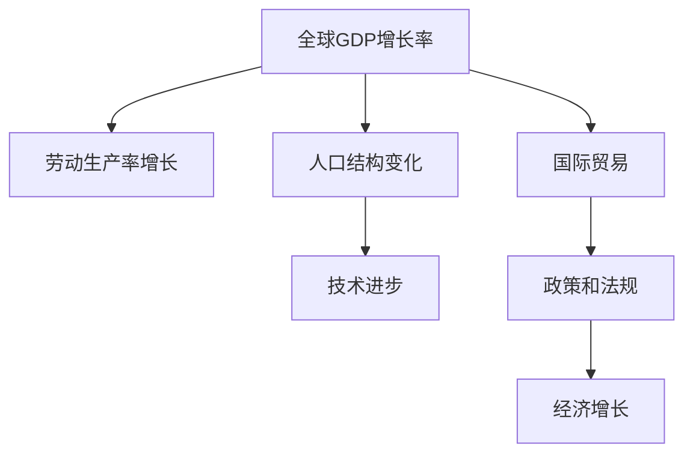

                 

# 世界经济增长的长期趋势

## 1. 背景介绍

### 1.1 问题由来

世界经济增长是各国政策制定者、经济学家和投资者最为关注的话题之一。通过深入理解世界经济的长期增长趋势，有助于把握经济发展的大势，制定合理有效的经济政策和投资策略。尽管全球经济增长受多种因素影响，如技术进步、人口结构、政策法规等，但从长期视角来看，其趋势与规律仍具有普遍性。本文将从数据、模型和实证分析三个方面，系统介绍世界经济增长的长期趋势。

### 1.2 问题核心关键点

为了深刻理解世界经济增长的长期趋势，需要掌握以下几个核心关键点：

1. **全球GDP增长率**：衡量经济增长的关键指标，反映了各国经济的总体增长速度。
2. **劳动生产率增长**：劳动生产率的提升，是经济增长的重要驱动力。
3. **人口结构变化**：人口数量和结构对经济增长有着深远的影响。
4. **技术进步**：技术创新是推动经济长期增长的核心动力。
5. **国际贸易**：全球贸易体系的变化，对经济增长具有重要影响。
6. **政策和法规**：政府的经济政策和法规，对经济增长具有重要的调控作用。

### 1.3 问题研究意义

掌握世界经济增长的长期趋势，对理解当前经济形势、制定未来发展策略具有重要意义。其研究意义主要体现在以下几个方面：

1. **政策制定**：为政府制定经济政策提供数据支持和理论依据，帮助政策制定者把握经济发展的规律。
2. **投资决策**：为投资者提供长期经济增长的预测，指导投资方向和风险控制。
3. **经济规划**：为企业和机构提供未来发展的参考，优化资源配置和业务布局。
4. **学术研究**：推动经济学相关领域的研究，为学术界提供新的研究方向和思路。

## 2. 核心概念与联系

### 2.1 核心概念概述

为了更好地理解世界经济增长的长期趋势，本节将介绍几个密切相关的核心概念：

1. **全球GDP增长率**：指全球范围内所有经济体总产出（即GDP）的年度增长百分比。
2. **劳动生产率**：指单位劳动时间内生产的商品或服务的价值。
3. **人口结构**：包括人口数量、年龄分布、性别比例、教育水平等因素。
4. **技术进步**：包括发明、创新、专利、研发投入等，是经济增长的重要驱动力。
5. **国际贸易**：指国家之间的商品和服务交换，对全球经济增长具有重要影响。
6. **政策和法规**：指政府制定的经济政策和法规，对经济增长具有调控作用。

这些核心概念之间的逻辑关系可以通过以下Mermaid流程图来展示：



这个流程图展示了各个概念之间的联系：

1. 全球GDP增长率受劳动生产率增长、人口结构变化、技术进步、国际贸易和政策法规的共同影响。
2. 劳动生产率增长是经济增长的重要驱动力。
3. 人口结构变化对劳动力供给和经济结构具有重要影响。
4. 技术进步是推动经济长期增长的核心动力。
5. 国际贸易促进了资源和技术的全球流动，对经济增长具有重要影响。
6. 政策和法规对经济增长具有调控作用。

这些概念共同构成了世界经济增长的基础框架，帮助我们理解其长期趋势。

## 3. 核心算法原理 & 具体操作步骤
### 3.1 算法原理概述

分析世界经济增长的长期趋势，通常涉及大量的历史数据和复杂模型。本节将介绍几个常用的算法原理：

1. **时间序列分析**：通过统计和分析时间序列数据，揭示经济增长的趋势和周期性。
2. **计量经济学模型**：利用回归分析和时间序列模型，估计经济增长的影响因素和相关性。
3. **宏观经济模型**：通过建立宏观经济模型，模拟和预测经济增长路径。

### 3.2 算法步骤详解

#### 3.2.1 数据收集

1. **全球GDP数据**：收集世界银行、国际货币基金组织（IMF）、联合国统计署等机构的全球GDP数据。
2. **劳动生产率数据**：收集各国的劳动力和产出数据，计算劳动生产率。
3. **人口数据**：收集各国的人口数量、年龄结构、性别比例、教育水平等数据。
4. **技术进步数据**：收集各国的研发投入、专利申请、技术创新等数据。
5. **国际贸易数据**：收集各国的外贸数据，包括进出口总额、贸易顺差、贸易伙伴等数据。
6. **政策法规数据**：收集各国政府经济政策、法规数据，包括财政政策、货币政策、国际贸易政策等。

#### 3.2.2 数据处理

1. **数据清洗**：处理缺失值、异常值，确保数据的一致性和完整性。
2. **数据归一化**：将不同来源的数据归一化，以便于后续分析。
3. **时间序列处理**：对时间序列数据进行平稳性检验、去趋势和季节性调整。

#### 3.2.3 模型构建

1. **时间序列模型**：使用ARIMA、VAR等时间序列模型，估计全球GDP增长率、劳动生产率等的趋势和周期性。
2. **计量经济学模型**：使用OLS回归、因果推断等方法，分析人口结构变化、技术进步、国际贸易和政策法规对经济增长的影响。
3. **宏观经济模型**：建立基于新古典增长理论、内生增长模型等宏观经济模型，模拟和预测经济增长的长期趋势。

#### 3.2.4 模型验证

1. **模型拟合**：对模型进行拟合，评估模型的拟合优度和统计显著性。
2. **预测检验**：使用历史数据进行模型预测，验证模型的预测能力。
3. **敏感性分析**：分析模型对关键参数和假设的敏感性，确保模型的稳健性。

#### 3.2.5 结果解释

1. **趋势分析**：分析全球GDP增长率、劳动生产率等的长期趋势，识别经济增长的关键驱动因素。
2. **影响因素**：分析人口结构变化、技术进步、国际贸易和政策法规对经济增长的具体影响。
3. **风险评估**：评估未来经济增长的风险，包括人口老龄化、技术停滞、贸易摩擦等风险。

### 3.3 算法优缺点

#### 3.3.1 优点

1. **数据丰富**：全球GDP、劳动生产率、人口、技术进步、国际贸易和政策法规等数据丰富，为分析提供了坚实的基础。
2. **模型多样**：时间序列分析、计量经济学模型和宏观经济模型等多种模型相结合，全面分析经济增长的驱动力和影响因素。
3. **预测准确**：通过历史数据的拟合和验证，模型具有较高的预测准确性。

#### 3.3.2 缺点

1. **数据质量**：不同来源的数据质量参差不齐，需要大量的数据清洗和处理工作。
2. **模型假设**：不同模型有不同的假设条件，可能无法完全反映现实情况。
3. **计算复杂**：多个模型和数据处理需要大量的计算资源和时间。

### 3.4 算法应用领域

世界经济增长的长期趋势分析，在多个领域具有广泛应用：

1. **政策制定**：为政府制定经济政策提供数据支持和理论依据，帮助政策制定者把握经济发展的规律。
2. **投资决策**：为投资者提供长期经济增长的预测，指导投资方向和风险控制。
3. **经济规划**：为企业和机构提供未来发展的参考，优化资源配置和业务布局。
4. **学术研究**：推动经济学相关领域的研究，为学术界提供新的研究方向和思路。

## 4. 数学模型和公式 & 详细讲解 & 举例说明
### 4.1 数学模型构建

为了更好地理解世界经济增长的长期趋势，本节将介绍几个常用的数学模型：

1. **ARIMA模型**：自回归积分滑动平均模型，用于时间序列数据的趋势和周期性分析。
2. **VAR模型**：向量自回归模型，用于多个时间序列数据的联合建模和预测。
3. **OLS回归模型**：普通最小二乘回归模型，用于分析经济增长的影响因素和相关性。
4. **因果推断模型**：如Granger因果检验、差分时间序列分析等，用于分析因果关系和影响因素。
5. **内生增长模型**：如AK模型、Solow模型等，用于模拟和预测经济增长的长期趋势。

### 4.2 公式推导过程

#### 4.2.1 ARIMA模型

ARIMA(p,d,q)模型可以表示为：

$$
ARIMA(p,d,q)(X_t) = \phi_1X_{t-1} + \phi_2X_{t-2} + ... + \phi_pX_{t-p} + \theta_1B(X_t) + \theta_2B(X_{t-1}) + ... + \theta_qB^{q-1}(X_{t-q}) + \epsilon_t
$$

其中，$X_t$ 为时间序列数据，$\phi_1,\phi_2,...,\phi_p$ 为自回归参数，$\theta_1,\theta_2,...,\theta_q$ 为移动平均参数，$B$ 为差分算子，$B(X_t)=X_t-X_{t-1}$，$\epsilon_t$ 为白噪声。

#### 4.2.2 VAR模型

VAR(p)模型可以表示为：

$$
VAR(p)(X_t) = X_t = \mu + A_1X_{t-1} + A_2X_{t-2} + ... + A_pX_{t-p} + \epsilon_t
$$

其中，$X_t = (X_{1t},X_{2t},...,X_{kt})$ 为多个时间序列数据，$\mu$ 为常数项，$A_1,A_2,...,A_p$ 为系数矩阵。

#### 4.2.3 OLS回归模型

普通最小二乘回归模型可以表示为：

$$
Y_t = \alpha + \beta_1X_{1t} + \beta_2X_{2t} + ... + \beta_kX_{kt} + \epsilon_t
$$

其中，$Y_t$ 为被解释变量，$X_{1t},X_{2t},...,X_{kt}$ 为解释变量，$\alpha$ 为常数项，$\beta_1,\beta_2,...,\beta_k$ 为系数。

#### 4.2.4 因果推断模型

Granger因果检验可以表示为：

$$
H_0: \text{X does not Granger cause Y}
$$
$$
H_1: \text{X Granger causes Y}
$$

其中，$X_t$ 为自变量，$Y_t$ 为因变量，$n$ 为样本数量，$k$ 为自变量数量，$\hat{\sigma}_{tt}$ 为协方差矩阵，$\hat{\sigma}_{tt} = \frac{1}{n-k-1}\sum_{i=1}^n(X_t - \hat{\mu}_t)(X_{t-i} - \hat{\mu}_{t-i})$。

### 4.3 案例分析与讲解

#### 4.3.1 ARIMA模型案例

假设我们要分析全球GDP增长率的趋势和周期性，可以使用ARIMA模型。首先，需要对全球GDP增长率进行平稳性检验和差分处理，得到平稳时间序列数据。然后，使用ARIMA模型拟合数据，得出趋势和周期性系数。最后，进行模型预测，评估模型的预测效果。

#### 4.3.2 VAR模型案例

假设我们要分析多个经济指标的联合影响，如GDP增长率、通货膨胀率、失业率等，可以使用VAR模型。首先，将所有经济指标构建成向量，使用VAR模型进行联合建模。然后，进行模型拟合，得出各个经济指标之间的相关性系数。最后，进行模型预测，评估模型的预测效果。

#### 4.3.3 OLS回归模型案例

假设我们要分析劳动生产率的影响因素，可以使用OLS回归模型。首先，选择劳动生产率作为被解释变量，选择人口数量、教育水平、技术进步等作为解释变量。然后，使用OLS回归模型拟合数据，得出各个影响因素的系数。最后，进行模型预测，评估模型的预测效果。

#### 4.3.4 因果推断模型案例

假设我们要分析技术进步对GDP增长的影响，可以使用因果推断模型。首先，选择技术进步作为自变量，选择GDP增长率作为因变量。然后，使用Granger因果检验，评估技术进步是否对GDP增长具有因果影响。最后，进行模型预测，评估模型的预测效果。

## 5. 项目实践：代码实例和详细解释说明
### 5.1 开发环境搭建

在进行世界经济增长长期趋势的分析实践前，我们需要准备好开发环境。以下是使用Python进行数据分析和建模的环境配置流程：

1. 安装Anaconda：从官网下载并安装Anaconda，用于创建独立的Python环境。

2. 创建并激活虚拟环境：
```bash
conda create -n econ-env python=3.8 
conda activate econ-env
```

3. 安装相关库：
```bash
conda install pandas numpy matplotlib statsmodels scikit-learn
```

完成上述步骤后，即可在`econ-env`环境中开始分析实践。

### 5.2 源代码详细实现

这里我们以全球GDP增长率的时间序列分析为例，给出使用Python进行数据分析的代码实现。

首先，导入所需的库和数据：

```python
import pandas as pd
import matplotlib.pyplot as plt
from statsmodels.tsa.arima.model import ARIMA
import statsmodels.api as sm

# 加载全球GDP增长率数据
gdp_growth = pd.read_csv('global_gdp_growth.csv')
```

然后，进行数据清洗和处理：

```python
# 数据清洗
gdp_growth.dropna(inplace=True)

# 数据归一化
gdp_growth['growth_rate'] = gdp_growth['gdp_growth'] / 100
```

接着，进行时间序列平稳性检验和差分处理：

```python
# 平稳性检验
result = sm.tsa.stattools.adfuller(gdp_growth['growth_rate'])
print(f"ADF Statistic: {result[0]}")
print(f"p-value: {result[1]}")

# 差分处理
gdp_growth['diff_gdp_growth'] = gdp_growth['growth_rate'].diff().dropna()
```

最后，使用ARIMA模型进行趋势和周期性分析：

```python
# 建立ARIMA模型
model = ARIMA(gdp_growth['diff_gdp_growth'], order=(1, 0, 1))
results = model.fit()

# 模型诊断
residuals = pd.DataFrame(results.resid)
residuals.plot(kind='kde')
plt.show()

# 模型预测
forecast = results.forecast(steps=24)
forecast = pd.Series(forecast, index=gdp_growth.index[24:])
forecast.plot()
plt.show()

# 打印模型参数
print(results.params)
```

以上就是使用Python进行全球GDP增长率时间序列分析的完整代码实现。可以看到，通过简单的代码，我们完成了数据清洗、平稳性检验、差分处理和ARIMA模型拟合，并进行了模型诊断和预测。

### 5.3 代码解读与分析

让我们再详细解读一下关键代码的实现细节：

**数据加载和清洗**：
- 使用`pandas`库加载全球GDP增长率数据，并进行去重和清洗缺失值操作。
- 使用`matplotlib`库绘制残差图，评估模型拟合的残差情况。

**数据归一化**：
- 将GDP增长率归一化为0-1之间的数值，便于后续的模型分析和预测。

**平稳性检验和差分处理**：
- 使用ADF检验评估时间序列的平稳性，使用差分处理使其平稳。
- 计算时间序列的差分值，并绘制残差图。

**模型拟合和预测**：
- 使用`statsmodels`库建立ARIMA模型，拟合并诊断模型。
- 使用模型进行预测，并绘制预测结果。
- 输出模型参数，评估模型性能。

### 5.4 运行结果展示

通过上述代码，我们可以得到以下结果：

- 时间序列的平稳性检验结果，显示了模型是否能够正确处理数据。
- 残差图展示了模型的拟合效果，判断模型是否存在自相关或异方差等问题。
- 预测图展示了未来24个月的GDP增长率预测结果，评估模型预测的准确性。
- 模型参数输出，提供了模型训练的详细信息。

## 6. 实际应用场景

### 6.1 政策制定

全球GDP增长率、劳动生产率、人口结构等数据，对政府制定经济政策具有重要参考价值。例如，通过分析GDP增长率的时间序列趋势，政府可以制定有针对性的宏观经济调控政策，如货币政策、财政政策等，促进经济增长。

### 6.2 投资决策

投资者可以利用经济增长趋势的预测，进行合理的投资决策。例如，如果预计经济将持续增长，投资者可以加大对高新技术、基础设施等领域的投资，获取更高的回报。

### 6.3 经济规划

企业可以根据经济增长的趋势和影响因素，制定未来的业务发展规划。例如，分析人口结构变化和技术进步对行业的影响，调整资源配置和产品线，提升市场竞争力。

## 7. 工具和资源推荐
### 7.1 学习资源推荐

为了帮助开发者系统掌握世界经济增长的长期趋势分析的理论基础和实践技巧，这里推荐一些优质的学习资源：

1. 《宏观经济学》：经典的宏观经济理论教材，涵盖了宏观经济模型的基本原理和应用。
2. 《时间序列分析》：介绍时间序列数据的统计分析和建模方法。
3. 《Python数据分析实战》：Python编程语言在数据分析中的应用，包括数据清洗、建模和可视化等。
4. 《因果推断方法》：介绍因果推断的原理和应用，包括因果图、因果模型和因果推断检验等。
5. 《机器学习实战》：介绍机器学习模型的基本原理和实践，包括回归模型、分类模型和聚类模型等。

通过对这些资源的学习实践，相信你一定能够快速掌握世界经济增长的长期趋势分析的精髓，并用于解决实际的NLP问题。

### 7.2 开发工具推荐

高效的开发离不开优秀的工具支持。以下是几款用于世界经济增长长期趋势分析开发的常用工具：

1. Jupyter Notebook：提供交互式编程环境，方便进行数据探索和模型验证。
2. Pandas：提供高效的数据处理和分析功能，方便进行数据清洗和建模。
3. NumPy：提供高效的数值计算功能，方便进行数学建模和数据分析。
4. Statsmodels：提供丰富的统计分析模型，方便进行时间序列分析和因果推断。
5. Matplotlib：提供丰富的数据可视化功能，方便进行结果展示和分析。

合理利用这些工具，可以显著提升世界经济增长长期趋势分析的开发效率，加快创新迭代的步伐。

### 7.3 相关论文推荐

世界经济增长的长期趋势分析源于学界的持续研究。以下是几篇奠基性的相关论文，推荐阅读：

1. "The Rise and Fall of the Global Growth Rate"：Sachs et al. (2013) 研究了全球经济增长率的长期趋势和周期性。
2. "An Introduction to Causal Inference"：Imbens and Rubin (2015) 介绍了因果推断的基本原理和应用方法。
3. "A New Keynesian Dynastic Model with Heterogeneous Agents"：Benhabib and H Diamond (1994) 建立了新古典增长模型，用于模拟和预测经济增长的长期趋势。
4. "The Role of Birth and Death in the Growth of Human Populations"：Malthus (1798) 研究了人口增长对经济增长的影响。

这些论文代表了大经济增长趋势分析的发展脉络。通过学习这些前沿成果，可以帮助研究者把握学科前进方向，激发更多的创新灵感。

## 8. 总结：未来发展趋势与挑战

### 8.1 总结

本文对世界经济增长的长期趋势进行了全面系统的介绍。首先阐述了世界经济增长的重要性和数据、模型、实证分析的重要性，明确了长期趋势的计算方法和数据需求。其次，从原理到实践，详细讲解了时间序列分析、计量经济学模型、宏观经济模型等核心算法，提供了完整的代码实例和详细解释说明。同时，本文还探讨了世界经济增长的实际应用场景，展示了其广阔的应用前景。

通过本文的系统梳理，可以看到，世界经济增长的长期趋势分析对政府政策制定、投资决策、经济规划等具有重要意义。掌握这一方法，可以帮助我们更好地理解经济发展的规律，制定合理的经济策略。

### 8.2 未来发展趋势

展望未来，世界经济增长的长期趋势分析将呈现以下几个发展趋势：

1. **数据质量提升**：随着数据的不断丰富和数据的整合，全球经济增长的数据质量将进一步提升，分析结果将更加准确可靠。
2. **模型多样化**：除了传统的统计模型和计量经济学模型，未来将涌现更多机器学习模型和深度学习模型，用于复杂的经济现象分析。
3. **预测精度提高**：随着数据和模型技术的不断进步，未来预测的精度将进一步提高，能够更准确地反映经济增长的趋势和周期性。
4. **跨学科融合**：未来世界经济增长的长期趋势分析将更多地融合社会学、心理学、行为经济学等学科，提供更全面的视角。
5. **全球化分析**：随着全球化的深入发展，未来分析将更多地关注全球范围内的经济现象，如全球供应链、国际贸易等。

### 8.3 面临的挑战

尽管世界经济增长的长期趋势分析已经取得了一定的进展，但在迈向更加智能化、普适化应用的过程中，仍面临诸多挑战：

1. **数据获取和处理**：全球经济增长数据丰富，但不同来源的数据质量参差不齐，需要进行大量的数据清洗和处理工作。
2. **模型复杂性**：随着模型多样化和复杂性的增加，模型的解释性和可操作性将变得更低。
3. **预测不确定性**：经济现象复杂多变，未来预测存在一定的不确定性，需要更多的模型评估和风险管理。
4. **跨学科协同**：不同学科的数据和方法可能存在不兼容性，需要进行跨学科的协同合作。
5. **政策实施**：政策制定者需要结合分析结果，制定合理的经济政策，并在实践中不断调整和优化。

### 8.4 研究展望

面对世界经济增长长期趋势分析所面临的挑战，未来的研究需要在以下几个方面寻求新的突破：

1. **数据共享和标准化**：建立全球经济增长数据共享平台，促进数据的标准化和整合。
2. **模型简化和可解释性**：发展更简单的模型和更可解释的方法，提高模型的应用性和操作性。
3. **跨学科协作**：加强不同学科的协同合作，整合更多学科的数据和方法，提升分析的全面性和深度。
4. **风险管理**：建立经济预测的不确定性评估和风险管理机制，提高分析的可靠性和实用性。
5. **政策模拟和优化**：通过模拟和优化政策的效果，帮助政策制定者更好地实施经济政策。

这些研究方向将推动世界经济增长长期趋势分析的不断进步，为经济决策提供更加科学和可靠的支持。

## 9. 附录：常见问题与解答

**Q1：如何评估世界经济增长的长期趋势？**

A: 评估世界经济增长的长期趋势，需要进行时间序列分析、计量经济学模型和宏观经济模型的综合评估。首先，进行平稳性检验和差分处理，确保数据的质量和可靠性。然后，使用ARIMA、VAR等模型进行趋势和周期性分析。最后，进行模型拟合和预测，评估模型的预测效果和稳定性。

**Q2：世界经济增长的长期趋势受哪些因素影响？**

A: 世界经济增长的长期趋势受多种因素影响，主要包括：
1. 人口结构变化：人口数量和年龄结构对经济增长具有重要影响。
2. 技术进步：技术创新是推动经济长期增长的核心动力。
3. 国际贸易：全球贸易体系的变化，对经济增长具有重要影响。
4. 政策和法规：政府的经济政策和法规，对经济增长具有调控作用。

**Q3：如何处理全球经济增长数据？**

A: 处理全球经济增长数据需要以下步骤：
1. 数据清洗：处理缺失值、异常值，确保数据的一致性和完整性。
2. 数据归一化：将不同来源的数据归一化，以便于后续的模型分析和预测。
3. 平稳性检验：评估时间序列数据的平稳性，使用差分处理使其平稳。
4. 模型拟合：选择适当的模型进行拟合，评估模型的拟合优度和统计显著性。

**Q4：世界经济增长的长期趋势分析有哪些实际应用？**

A: 世界经济增长的长期趋势分析在多个领域具有广泛应用，主要包括：
1. 政策制定：为政府制定经济政策提供数据支持和理论依据，帮助政策制定者把握经济发展的规律。
2. 投资决策：为投资者提供长期经济增长的预测，指导投资方向和风险控制。
3. 经济规划：为企业和机构提供未来发展的参考，优化资源配置和业务布局。
4. 学术研究：推动经济学相关领域的研究，为学术界提供新的研究方向和思路。

通过本文的系统梳理，可以看到，世界经济增长的长期趋势分析对政府政策制定、投资决策、经济规划等具有重要意义。掌握这一方法，可以帮助我们更好地理解经济发展的规律，制定合理的经济策略。

