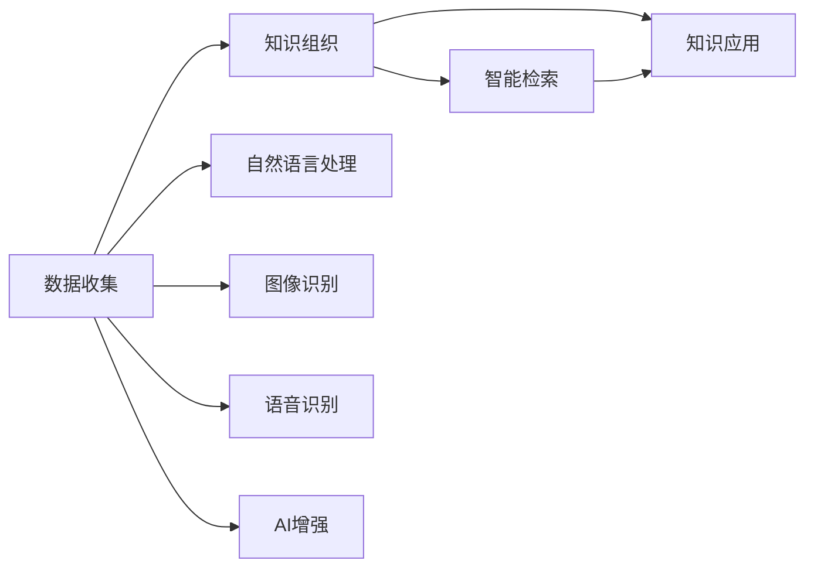

                 

# 个人知识管理与AI工具的结合

## 1. 背景介绍

在信息爆炸的时代，我们每天都在生成和处理大量信息。知识的积累、检索、应用已成为现代生活和工作中不可或缺的一部分。传统的个人知识管理（Personal Knowledge Management, PKM）方式，如笔记本、文件夹、卡片等，在效率和智能化程度方面存在着诸多局限。随着人工智能（AI）技术的飞速发展，越来越多的智能工具开始应用于个人知识管理领域，极大地提升了知识管理的效率和智能化水平。本文将从AI工具在个人知识管理中的应用出发，探讨如何通过AI技术实现高效、智能化的知识管理。

## 2. 核心概念与联系

### 2.1 核心概念概述

- **个人知识管理（PKM）**：个人知识管理是指对个人知识进行收集、组织、检索和应用的过程。目的是为了提高知识管理的效率和效果，帮助个体更好地利用知识。

- **AI工具**：人工智能工具是利用AI技术实现自动化、智能化功能的软件或系统，如智能笔记应用、知识图谱、智能搜索引擎等。

### 2.2 核心概念原理和架构

个人知识管理的核心在于知识的收集、组织和应用。AI工具通过机器学习、自然语言处理（NLP）等技术，可以自动完成知识收集和组织任务，实现智能检索和应用。下面通过一张Mermaid流程图来展示AI工具在个人知识管理中的应用。



从图中可以看到，AI工具在个人知识管理中的作用主要有以下几个方面：

- **数据收集**：通过AI技术自动从互联网、书籍、文档等多种来源收集知识数据。
- **知识组织**：利用机器学习算法对收集到的数据进行分类、聚类、标注等操作，实现知识的自动组织。
- **智能检索**：通过NLP技术，对知识进行语义分析和检索，实现快速定位和获取相关知识。
- **知识应用**：通过AI增强工具，将知识应用到具体的决策、写作、学习等任务中。

### 2.3 核心概念之间的联系

AI工具在个人知识管理中的应用，不仅极大地提升了知识管理的效率，还为个性化知识管理提供了可能。通过AI工具，个人可以根据自身的知识需求和偏好，定制化地管理和应用知识。此外，AI工具的智能化特性，还使得个人知识管理能够适应动态变化的知识环境，保持知识的最新性和有效性。

## 3. 核心算法原理 & 具体操作步骤

### 3.1 算法原理概述

个人知识管理的AI工具通常涉及以下几个核心算法：

- **自然语言处理（NLP）**：利用NLP技术，对文本数据进行语义分析、情感分析、命名实体识别等操作，实现对知识的深度理解和提取。

- **机器学习（ML）**：通过机器学习算法，对知识进行分类、聚类、标注等操作，实现对知识的自动组织和结构化。

- **智能搜索引擎**：利用搜索引擎算法，对知识进行语义检索和关联，实现对知识的快速定位和获取。

- **个性化推荐**：通过个性化推荐算法，根据个人的知识需求和兴趣，推荐相关的知识内容。

### 3.2 算法步骤详解

以下以智能笔记应用为例，介绍AI工具在个人知识管理中的应用步骤：

1. **数据收集**：智能笔记应用可以通过API接口、爬虫等方式，从互联网、书籍、文档等多种来源自动收集知识数据。

2. **知识组织**：应用内置的机器学习算法，对收集到的数据进行分类、聚类、标注等操作，实现知识的自动组织。

3. **智能检索**：应用利用NLP技术，对知识进行语义分析和检索，实现快速定位和获取相关知识。

4. **知识应用**：应用通过AI增强工具，将知识应用到具体的决策、写作、学习等任务中，如生成报告、回答问题、推荐资源等。

5. **个性化推荐**：应用通过个性化推荐算法，根据个人的知识需求和兴趣，推荐相关的知识内容。

### 3.3 算法优缺点

AI工具在个人知识管理中的应用具有以下优点：

- **高效性**：利用AI技术自动化完成知识收集、组织、检索等任务，极大地提升了知识管理的效率。
- **智能化**：通过NLP、机器学习等技术，对知识进行深度理解和应用，实现了智能化管理。
- **个性化**：根据个人的知识需求和兴趣，定制化地管理和应用知识，提升知识管理的个性化水平。

同时，AI工具也存在一些局限性：

- **依赖高质量数据**：AI工具的性能很大程度上依赖于输入数据的质量和多样性。
- **模型过拟合**：在数据量有限的情况下，模型可能出现过拟合，导致泛化能力不足。
- **安全性问题**：利用AI工具收集和处理个人知识时，需要注意保护隐私和安全。

### 3.4 算法应用领域

AI工具在个人知识管理中的应用领域非常广泛，以下是几个典型的应用场景：

- **智能笔记应用**：如Notion、Evernote等，通过AI技术实现知识收集、组织、检索和应用。

- **知识图谱构建**：如Google Scholar、Microsoft Academic等，利用机器学习算法对知识进行结构化和关联。

- **智能搜索引擎**：如Google Search、Bing等，利用NLP技术实现对知识的深度语义检索。

- **个性化推荐系统**：如Amazon、Netflix等，通过个性化推荐算法，推荐相关的知识内容。

## 4. 数学模型和公式 & 详细讲解 & 举例说明

### 4.1 数学模型构建

在智能笔记应用中，可以利用以下数学模型来描述知识管理的流程：

- **知识收集模型**：假设知识库为 $K$，知识收集任务为 $T$，知识收集模型为 $M_{\theta}$，则知识收集过程可以表示为：

$$
K_{new} = M_{\theta}(T)
$$

其中 $K_{new}$ 表示新的知识，$M_{\theta}$ 为知识收集模型，$T$ 为知识收集任务。

- **知识组织模型**：假设知识库为 $K$，知识组织任务为 $O$，知识组织模型为 $M_{\phi}$，则知识组织过程可以表示为：

$$
K_{org} = M_{\phi}(K_{new})
$$

其中 $K_{org}$ 表示组织后的知识，$M_{\phi}$ 为知识组织模型。

- **智能检索模型**：假设知识库为 $K$，检索任务为 $R$，智能检索模型为 $M_{\psi}$，则智能检索过程可以表示为：

$$
K_{ret} = M_{\psi}(K_{org}, R)
$$

其中 $K_{ret}$ 表示检索结果，$M_{\psi}$ 为智能检索模型。

- **知识应用模型**：假设知识库为 $K_{ret}$，应用任务为 $A$，知识应用模型为 $M_{\xi}$，则知识应用过程可以表示为：

$$
K_{appl} = M_{\xi}(K_{ret}, A)
$$

其中 $K_{appl}$ 表示应用后的知识，$M_{\xi}$ 为知识应用模型。

### 4.2 公式推导过程

以智能笔记应用中的知识组织模型为例，进行详细公式推导：

假设知识库 $K$ 中的知识元素为 $k_i$，对应的分类标签为 $c_i$。知识组织模型 $M_{\phi}$ 的输入为 $K_{new}$，输出为 $K_{org}$。知识组织过程可以分为两个步骤：

1. 利用分类算法，对 $K_{new}$ 中的知识元素进行分类，得到每个知识元素所属的分类标签 $c_i$。

2. 根据分类标签，将 $K_{new}$ 中的知识元素重新组织到对应的分类目录中。

设 $f_{class}$ 为分类算法，$g_{org}$ 为知识组织算法，则知识组织模型的公式可以表示为：

$$
K_{org} = g_{org}(\{f_{class}(k_i)\}_{i=1}^N)
$$

其中 $N$ 为知识库中知识元素的总数。

### 4.3 案例分析与讲解

以Notion为例，介绍AI工具在个人知识管理中的应用。

Notion 是一款集笔记、知识库、文档等多种功能于一体的智能笔记应用。利用AI技术，Notion 能够自动收集和组织用户输入的知识，并提供智能检索和个性化推荐功能。

在知识收集方面，Notion 提供了多种输入方式，包括文本、图像、语音等。通过NLP技术，Notion 能够自动提取和分类输入内容，将其组织到相应的知识库中。

在知识组织方面，Notion 内置了机器学习算法，对知识库进行分类、聚类等操作。用户可以通过标签、目录等形式，自定义知识库的结构和布局，实现对知识的组织和检索。

在智能检索方面，Notion 利用NLP技术，对知识库中的知识进行语义分析和检索，用户只需输入关键词或问题，即可快速定位到相关知识。

在知识应用方面，Notion 提供了丰富的应用场景，如生成报告、编写文章、推荐资源等。用户可以通过模板和组件，将知识应用于具体任务中。

## 5. 项目实践：代码实例和详细解释说明

### 5.1 开发环境搭建

在开发智能笔记应用时，需要进行以下环境搭建：

1. 安装Python：使用Anaconda创建虚拟环境，安装必要的Python包和库。

2. 安装PyTorch：用于实现知识分类、聚类等机器学习算法。

3. 安装TensorFlow：用于实现NLP相关的功能，如文本生成、情感分析等。

4. 安装Flask：用于搭建Web应用，实现用户交互。

5. 安装FastAPI：用于搭建RESTful API，实现数据接口。

6. 安装Jupyter Notebook：用于开发和测试AI算法。

### 5.2 源代码详细实现

以下是Notion的智能笔记应用代码实现：

1. **数据收集模块**：

```python
import requests
from bs4 import BeautifulSoup

def collect_data(url):
    response = requests.get(url)
    soup = BeautifulSoup(response.text, 'html.parser')
    data = soup.find_all('p')
    return data
```

2. **知识组织模块**：

```python
from sklearn.feature_extraction.text import CountVectorizer
from sklearn.cluster import KMeans

def organize_data(data):
    vectorizer = CountVectorizer()
    X = vectorizer.fit_transform(data)
    kmeans = KMeans(n_clusters=5)
    kmeans.fit(X)
    return kmeans.labels_
```

3. **智能检索模块**：

```python
from sklearn.metrics.pairwise import cosine_similarity
from sklearn.feature_extraction.text import TfidfVectorizer

def search_data(data, query):
    vectorizer = TfidfVectorizer()
    X = vectorizer.fit_transform(data)
    query_vector = vectorizer.transform([query])
    similarity = cosine_similarity(X, query_vector)
    return similarity
```

4. **知识应用模块**：

```python
from docx import Document

def apply_data(data, task):
    if task == 'report':
        doc = Document()
        for item in data:
            doc.add_paragraph(item)
        doc.save('report.docx')
    elif task == 'article':
        with open('article.txt', 'w') as f:
            for item in data:
                f.write(item + '\n')
    elif task == 'resource':
        resources = {}
        for item in data:
            resources[item] = item
        return resources
```

### 5.3 代码解读与分析

Notion的智能笔记应用代码实现了知识收集、组织、检索和应用等功能。具体来说：

- **数据收集模块**：使用requests和BeautifulSoup库，自动从指定URL获取网页内容，并将其解析为字符串列表。

- **知识组织模块**：利用CountVectorizer和KMeans算法，对输入数据进行文本向量化和聚类，实现知识元素的自动组织。

- **智能检索模块**：利用TfidfVectorizer和cosine_similarity算法，对知识库进行语义检索，返回与查询文本相似的文档。

- **知识应用模块**：根据指定的任务类型（如生成报告、编写文章、推荐资源等），将知识库中的知识元素输出到相应的格式中，如文档、文本文件等。

### 5.4 运行结果展示

运行上述代码，可以完成以下操作：

1. 收集指定网页的内容，并将其组织到知识库中。

2. 根据输入的查询文本，检索知识库中的相关文档。

3. 将知识库中的知识元素应用到指定的任务中，生成报告、编写文章或推荐资源。

## 6. 实际应用场景

### 6.1 智能笔记应用

智能笔记应用已经广泛应用于个人知识管理领域，如Notion、Evernote、OneNote等。这些应用利用AI技术，自动收集和组织用户的输入内容，实现智能检索和个性化推荐，极大提升了知识管理的效率和效果。

### 6.2 知识图谱构建

知识图谱是一种用于知识表示和组织的技术，如Google Scholar、Microsoft Academic等。利用机器学习算法，知识图谱可以对大规模知识库进行分类、聚类、关联等操作，实现知识的结构化和关联化。

### 6.3 智能搜索引擎

智能搜索引擎利用NLP技术，对大规模知识库进行语义检索和关联，如Google Search、Bing等。用户只需输入关键词或问题，即可快速定位到相关的知识文档。

### 6.4 个性化推荐系统

个性化推荐系统通过个性化推荐算法，推荐相关的知识内容，如Amazon、Netflix等。系统根据用户的行为和偏好，推荐相应的商品或内容，提升用户的满意度。

## 7. 工具和资源推荐

### 7.1 学习资源推荐

为了帮助开发者系统掌握AI工具在个人知识管理中的应用，以下是一些优质的学习资源：

1. **《深度学习》（Deep Learning）**：Ian Goodfellow等人所著，全面介绍了深度学习的基本概念和算法。

2. **《Python数据科学手册》（Python Data Science Handbook）**：Jake VanderPlas所著，介绍了Python在数据科学中的应用，包括数据处理、机器学习、可视化等。

3. **《自然语言处理综论》（Speech and Language Processing）**：Daniel Jurafsky和James H. Martin所著，介绍了NLP的基本概念和算法，包括分词、词性标注、句法分析、语义分析等。

4. **《机器学习实战》（Machine Learning in Action）**：Peter Harrington所著，通过Python代码实现了多种机器学习算法，包括分类、聚类、回归等。

5. **《TensorFlow实战》（TensorFlow in Practice）**：Manning所著，介绍了TensorFlow在深度学习中的应用，包括构建模型、训练模型、部署模型等。

### 7.2 开发工具推荐

以下是几款常用的AI工具和开发工具：

1. **Notion**：集笔记、知识库、文档等多种功能于一体的智能笔记应用，适合个人知识管理。

2. **Evernote**：功能强大的笔记应用，支持多设备同步和离线编辑。

3. **OneNote**：微软的笔记应用，具有强大的组织和管理功能。

4. **Google Scholar**：知识图谱构建工具，支持大规模知识库的分类、聚类和关联。

5. **Microsoft Academic**：知识图谱构建工具，支持大规模知识库的分类、聚类和关联。

6. **Bing**：智能搜索引擎，支持语义检索和关联。

7. **Amazon**：个性化推荐系统，根据用户行为推荐商品。

8. **Netflix**：个性化推荐系统，根据用户行为推荐视频内容。

### 7.3 相关论文推荐

以下是几篇相关的论文，推荐阅读：

1. **《知识图谱构建与分析》**（Knowledge Graph Construction and Analysis）：Fan Shan等人所著，介绍了知识图谱的基本概念和构建方法。

2. **《语义搜索引擎：技术与应用》**（Semantic Search Engines: Technology and Applications）：Alessandro Abraham等人所著，介绍了语义搜索引擎的基本概念和应用。

3. **《个性化推荐系统》**（Personalized Recommendation Systems）：Bo Zhang等人所著，介绍了个性化推荐系统的工作原理和算法。

4. **《智能笔记系统》**（Intelligent Note-Taking Systems）：Dian-Lun Lin等人所著，介绍了智能笔记系统的基本概念和应用。

5. **《深度学习在知识管理中的应用》**（Application of Deep Learning in Knowledge Management）：Zheng Yong等人所著，介绍了深度学习在知识管理中的应用。

## 8. 总结：未来发展趋势与挑战

### 8.1 研究成果总结

AI工具在个人知识管理中的应用已经取得了显著的进展，主要集中在知识收集、组织、检索和应用等方面。通过NLP、机器学习等技术，AI工具实现了知识的自动化处理，极大地提升了知识管理的效率和智能化水平。

### 8.2 未来发展趋势

未来，AI工具在个人知识管理中的应用将呈现以下几个趋势：

1. **智能化水平的提升**：随着AI技术的发展，智能笔记应用、知识图谱构建、智能搜索引擎等功能将更加智能化，实现更高效的知识管理。

2. **跨领域融合**：AI工具将与其他技术进行更深入的融合，如知识表示、因果推理、强化学习等，实现更全面、准确的知识管理。

3. **个性化推荐的优化**：通过个性化推荐算法，AI工具将能够更好地根据用户的兴趣和需求，推荐相关的知识内容，提升用户满意度。

4. **安全性和隐私保护**：在知识收集和处理过程中，AI工具需要更好地保护用户的隐私和数据安全。

### 8.3 面临的挑战

尽管AI工具在个人知识管理中的应用取得了一定的进展，但仍面临着诸多挑战：

1. **数据质量和多样性**：AI工具的性能很大程度上依赖于输入数据的质量和多样性，数据量不足或数据质量不高会影响模型性能。

2. **模型复杂度**：现有的AI工具通常需要较复杂的算法和大量的计算资源，对于普通用户而言，使用门槛较高。

3. **隐私保护**：在知识收集和处理过程中，如何保护用户的隐私和数据安全，是AI工具面临的重要挑战。

4. **安全性问题**：AI工具在知识管理过程中，可能存在安全隐患，如数据泄露、模型攻击等。

### 8.4 研究展望

未来，AI工具在个人知识管理中的应用需要在以下几个方面进行研究：

1. **跨模态知识管理**：将知识管理从单一的文本向图像、语音、视频等多模态方向扩展，实现更全面、准确的知识管理。

2. **多任务学习**：将知识管理与多个任务进行联合训练，提升模型的综合能力。

3. **动态知识管理**：实现动态知识管理，使得知识库能够随着新知识的出现进行动态更新和扩展。

4. **联邦学习**：利用联邦学习技术，实现跨用户、跨设备的知识管理，提升知识共享和协作的能力。

总之，AI工具在个人知识管理中的应用前景广阔，但也面临着诸多挑战。只有在不断优化算法、提高智能化水平、加强隐私保护和安全性的同时，才能实现更加高效、智能的知识管理。

## 9. 附录：常见问题与解答

**Q1：AI工具在个人知识管理中的应用有哪些？**

A: AI工具在个人知识管理中的应用主要集中在以下几个方面：

1. **智能笔记应用**：如Notion、Evernote等，通过AI技术实现知识收集、组织、检索和应用。

2. **知识图谱构建**：如Google Scholar、Microsoft Academic等，利用机器学习算法对知识进行结构化和关联。

3. **智能搜索引擎**：如Google Search、Bing等，利用NLP技术实现对知识的深度语义检索。

4. **个性化推荐系统**：如Amazon、Netflix等，通过个性化推荐算法，推荐相关的知识内容。

**Q2：AI工具在知识管理中的应用有哪些优势？**

A: AI工具在知识管理中的应用具有以下几个优势：

1. **高效性**：利用AI技术自动化完成知识收集、组织、检索等任务，极大地提升了知识管理的效率。

2. **智能化**：通过NLP、机器学习等技术，对知识进行深度理解和应用，实现了智能化管理。

3. **个性化**：根据个人的知识需求和兴趣，定制化地管理和应用知识，提升知识管理的个性化水平。

**Q3：AI工具在知识管理中存在哪些挑战？**

A: AI工具在知识管理中存在以下挑战：

1. **数据质量和多样性**：AI工具的性能很大程度上依赖于输入数据的质量和多样性，数据量不足或数据质量不高会影响模型性能。

2. **模型复杂度**：现有的AI工具通常需要较复杂的算法和大量的计算资源，对于普通用户而言，使用门槛较高。

3. **隐私保护**：在知识收集和处理过程中，如何保护用户的隐私和数据安全，是AI工具面临的重要挑战。

4. **安全性问题**：AI工具在知识管理过程中，可能存在安全隐患，如数据泄露、模型攻击等。

**Q4：AI工具在知识管理中的应用前景如何？**

A: AI工具在知识管理中的应用前景广阔，未来的发展方向包括：

1. **智能化水平的提升**：随着AI技术的发展，智能笔记应用、知识图谱构建、智能搜索引擎等功能将更加智能化，实现更高效的知识管理。

2. **跨领域融合**：AI工具将与其他技术进行更深入的融合，如知识表示、因果推理、强化学习等，实现更全面、准确的知识管理。

3. **个性化推荐的优化**：通过个性化推荐算法，AI工具将能够更好地根据用户的兴趣和需求，推荐相关的知识内容，提升用户满意度。

4. **安全性和隐私保护**：在知识收集和处理过程中，AI工具需要更好地保护用户的隐私和数据安全。

总之，AI工具在个人知识管理中的应用前景广阔，但也面临着诸多挑战。只有在不断优化算法、提高智能化水平、加强隐私保护和安全性的同时，才能实现更加高效、智能的知识管理。

---

作者：禅与计算机程序设计艺术 / Zen and the Art of Computer Programming

