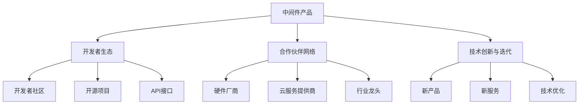

                 

# 中间件公司的生态护城河构建

## 1. 背景介绍

在当今快速变化的IT行业中，中间件作为连接企业内部系统和外部生态的关键枢纽，其重要性不言而喻。中间件公司面临的竞争日益激烈，传统的技术优势、市场占有率、合作伙伴关系等护城河已不再足够，企业需要构建更具动态性和可持续性的生态护城河来巩固市场地位。本文将深入探讨中间件公司如何通过构建生态系统、创新产品和服务、优化用户体验、强化合作伙伴关系、注重技术研发和迭代等手段，打造坚实的生态护城河。

## 2. 核心概念与联系

### 2.1 核心概念概述

中间件是一种使应用程序间互相通信的软件，它通过提供统一的接口和协议，隐藏底层系统和硬件的复杂性，提高系统的互操作性和集成性。中间件公司的核心任务是提供易于集成、高效稳定、安全可靠的中间件产品和服务，同时通过构建强大的生态系统，吸引更多的开发者、合作伙伴和客户，共同推动行业发展。

中间件公司的生态护城河主要包括：
- **产品与服务**：提供高质量的中间件产品和创新服务，满足不同行业和场景的需求。
- **开发者生态**：通过社区、开源项目、API接口等方式，吸引并培养开发者，增强产品的活力和用户粘性。
- **合作伙伴网络**：与硬件厂商、云服务提供商、行业龙头等建立紧密的合作关系，共同开拓市场。
- **技术创新与迭代**：持续投入研发，不断推出符合市场趋势和用户需求的新产品和新服务，保持竞争优势。

### 2.2 核心概念原理和架构的 Mermaid 流程图



以上Mermaid流程图展示了中间件公司生态护城河的主要组成部分及其相互关系：中间件产品作为核心，通过吸引和培养开发者、建立合作伙伴网络、持续进行技术创新与迭代，共同构建强大的生态系统。

## 3. 核心算法原理 & 具体操作步骤

### 3.1 算法原理概述

中间件公司的生态护城河构建，本质上是一个多维度、动态性的系统工程。其核心算法原理主要包括以下几个方面：
- **生态系统设计**：基于中间件产品，设计合理的生态系统框架，明确各组件间的关系和功能，确保系统的高效运转。
- **开发者关系管理**：通过社区、开源项目、API接口等方式，建立与开发者的紧密联系，吸引和保留有价值的人才。
- **合作伙伴协同**：通过建立合作关系，实现优势互补，共同开拓市场，增强产品和服务的竞争力。
- **技术迭代与创新**：持续进行技术研发和迭代，推出符合市场趋势和用户需求的新产品和服务，保持技术领先地位。

### 3.2 算法步骤详解

以下是构建中间件公司生态护城河的主要步骤：

**Step 1: 产品与服务开发**
- 根据市场调研结果，选择合适的中间件产品线，涵盖企业应用、云服务、物联网等领域。
- 设计产品的技术架构和功能模块，确保产品的稳定性和可扩展性。
- 制定产品发布和更新计划，保证产品持续创新和优化。

**Step 2: 开发者生态建设**
- 创建开发者社区，提供技术交流、问题解答、培训资源等，增强开发者粘性。
- 支持和维护开源项目，吸引更多开发者参与贡献，提升社区活跃度。
- 发布API接口和SDK，简化开发者的集成流程，提高产品的易用性和可扩展性。

**Step 3: 合作伙伴网络构建**
- 选择有潜力的合作伙伴，如硬件厂商、云服务提供商、行业龙头等，共同开发和推广产品。
- 定期举行合作研讨会和技术交流活动，增强合作伙伴之间的互动和信任。
- 建立联合实验室或技术合作组，共同解决技术难题，提升产品竞争力。

**Step 4: 技术创新与迭代**
- 设立研发团队，持续进行技术研发，跟踪行业趋势和用户需求，不断推出新产品和新服务。
- 与学术机构和研究团队合作，推动前沿技术的转化与应用。
- 建立技术评估和迭代机制，定期评估产品性能和用户体验，进行优化和改进。

### 3.3 算法优缺点

中间件公司生态护城河构建的算法具有以下优点：
- 生态系统的动态性和可持续性，能够吸引更多的开发者和合作伙伴，增强市场竞争力。
- 产品和技术的多样化，能够满足不同行业和场景的需求，提升用户粘性和满意度。
- 持续的技术创新和迭代，能够保持技术领先地位，避免被市场淘汰。

同时，该算法也存在以下局限性：
- 生态系统的建设和管理需要大量资源和时间投入，短期内难以见效。
- 技术创新的风险和成本较高，需要谨慎评估和把控。
- 生态系统的复杂性增加，管理和协调难度加大。

### 3.4 算法应用领域

中间件公司的生态护城河构建方法，不仅适用于中间件行业，也适用于其他具有类似特性的企业。例如：

- **云服务提供商**：通过构建云生态，吸引开发者和合作伙伴，增强云产品的竞争力和市场份额。
- **网络安全公司**：通过构建安全社区和合作伙伴网络，提升产品的安全性与可靠性，赢得更多客户信任。
- **物联网公司**：通过构建设备互联和数据共享的生态系统，实现设备之间的无缝协同，满足物联网的需求。

## 4. 数学模型和公式 & 详细讲解 & 举例说明

### 4.1 数学模型构建

假设中间件公司的产品数量为 $P$，开发者数量为 $D$，合作伙伴数量为 $C$，技术迭代速度为 $R$，市场占有率为 $M$，生态系统活跃度为 $E$。构建生态护城河的数学模型为：

$$
\text{E} = f(\text{P}, \text{D}, \text{C}, \text{R}, \text{M})
$$

其中 $f$ 表示生态系统活跃度与各变量之间的关系，可以通过实验和数据分析得到。

### 4.2 公式推导过程

根据上式，我们可以通过对 $P$、$D$、$C$、$R$、$M$ 的调整，来优化生态系统活跃度 $E$。例如，增加合作伙伴数量 $C$，可以提升市场占有率 $M$，进而增强生态系统的活跃度。

### 4.3 案例分析与讲解

以下以某中间件公司为例，分析其生态护城河的构建过程：

该公司首先设计了涵盖企业应用、云服务、物联网等领域的中间件产品线。然后，创建开发者社区，支持和维护开源项目，发布API接口和SDK，增强开发者粘性和产品易用性。接着，选择硬件厂商和云服务提供商作为合作伙伴，建立联合实验室和技术合作组，共同开发和推广产品。最后，设立研发团队，持续进行技术研发和迭代，推出新产品和新服务，保持技术领先地位。

通过这些措施，该公司的生态系统活跃度显著提升，市场占有率持续增长，成功构建了坚实的生态护城河。

## 5. 项目实践：代码实例和详细解释说明

### 5.1 开发环境搭建

在进行中间件公司生态护城河构建的实践时，我们需要准备好开发环境。以下是使用Python进行开发的环境配置流程：

1. 安装Anaconda：从官网下载并安装Anaconda，用于创建独立的Python环境。

2. 创建并激活虚拟环境：
```bash
conda create -n middleware-env python=3.8 
conda activate middleware-env
```

3. 安装必要的Python包和库：
```bash
pip install requests flask gunicorn jinja2
```

完成上述步骤后，即可在`middleware-env`环境中开始实践。

### 5.2 源代码详细实现

下面我们以构建开发者社区为例，给出使用Flask框架实现开发者社区的Python代码实现。

```python
from flask import Flask, request, render_template, redirect

app = Flask(__name__)

@app.route('/')
def index():
    return render_template('index.html')

@app.route('/login', methods=['POST'])
def login():
    username = request.form['username']
    password = request.form['password']
    # 在这里进行用户认证
    if authenticate(username, password):
        return redirect('/dashboard')
    else:
        return 'Invalid username or password'

@app.route('/dashboard')
def dashboard():
    return render_template('dashboard.html')

if __name__ == '__main__':
    app.run(debug=True)
```

### 5.3 代码解读与分析

让我们再详细解读一下关键代码的实现细节：

**Flask应用**：
- 使用Flask框架创建Web应用，提供登录和仪表盘页面。
- 定义两个路由，`/` 提供首页，`/dashboard` 提供仪表盘页面。

**路由处理**：
- `index`路由：展示首页，可能包含开发者社区的简介和引导信息。
- `login`路由：接收表单提交的用户名和密码，进行认证，成功则跳转到仪表盘页面，失败则提示错误信息。
- `dashboard`路由：提供仪表盘页面，展示社区活动、开发者贡献、API接口等。

**Flask模板**：
- 使用模板引擎渲染HTML页面，增加Web应用的交互性和动态性。
- 开发者社区的仪表盘页面可能需要展示社区成员、活动列表、最新贡献等，具体实现方式取决于社区的需求。

**Flask应用启动**：
- 使用 `app.run(debug=True)` 启动应用，进入本地调试模式，方便开发和测试。

### 5.4 运行结果展示

通过Flask应用，开发者社区可以提供一个用户友好的交互界面，吸引更多的开发者参与。例如，仪表盘页面可以展示社区成员列表、最新贡献、活动信息等，增加用户的活跃度和粘性。

## 6. 实际应用场景

### 6.1 企业应用中间件

中间件公司可以为各类企业提供全面的应用中间件解决方案，包括企业内部系统集成、云服务对接、数据交换等。通过构建开发者生态，吸引企业内部的IT部门和第三方开发者，共同开发和优化中间件产品，提升产品的易用性和市场竞争力。

### 6.2 云服务中间件

在云服务领域，中间件公司可以提供云平台之间的互操作性解决方案，如API网关、消息队列、分布式事务等。通过构建云生态，吸引云服务提供商、云应用开发者、云运维工程师等，提升云服务的可靠性和扩展性。

### 6.3 物联网中间件

物联网中间件公司可以提供设备之间的互联和数据共享解决方案，如MQTT协议、设备管理平台等。通过构建物联网生态，吸引设备制造商、物联网应用开发者、云服务提供商等，实现设备的无缝协同和数据的高效处理。

### 6.4 未来应用展望

随着技术的不断演进和市场需求的多样化，中间件公司的生态护城河构建将面临新的挑战和机遇。例如：

- **跨行业融合**：中间件公司需要跨行业拓展业务，如从企业应用转向工业物联网、医疗健康等领域，构建更广泛的生态系统。
- **人工智能与物联网的融合**：利用人工智能技术提升物联网中间件的智能化水平，如设备行为分析、预测性维护等。
- **安全性与隐私保护**：中间件公司需要加强数据安全和隐私保护，避免数据泄露和滥用，增强用户信任。
- **边缘计算与云计算的结合**：中间件公司需要推动边缘计算和云计算的结合，优化数据传输和处理效率，满足实时性要求。

## 7. 工具和资源推荐

### 7.1 学习资源推荐

为了帮助中间件公司开发者系统掌握生态护城河构建的技术基础和实践技巧，这里推荐一些优质的学习资源：

1. **《软件架构模式》**：介绍常见的软件架构模式和设计原则，帮助开发者构建高效、可维护的软件系统。
2. **《微服务架构设计》**：讲解微服务架构的设计和实现，帮助中间件公司构建灵活、可扩展的架构。
3. **《开源社区管理》**：讲述开源社区的建立和管理，吸引和保留开发者的策略。
4. **《云服务架构》**：介绍云服务架构的设计和优化，帮助中间件公司提升云服务的性能和可靠性。
5. **《物联网安全》**：讲解物联网安全技术和最佳实践，帮助中间件公司保护数据和设备的安全。

通过对这些资源的学习实践，相信中间件公司开发者一定能够系统掌握生态护城河构建的技术基础和实践技巧。

### 7.2 开发工具推荐

高效的开发离不开优秀的工具支持。以下是几款用于中间件公司生态护城河构建开发的常用工具：

1. **Jenkins**：持续集成和持续交付(CI/CD)工具，自动化测试、部署和监控，提升开发效率。
2. **Docker**：容器化技术，简化应用部署和管理，提高环境一致性。
3. **Kubernetes**：容器编排工具，实现应用的自动化扩展和管理，提高资源利用率。
4. **Prometheus**：监控和告警系统，实时监控系统性能和状态，保障应用稳定运行。
5. **ELK Stack**：日志管理和分析工具，帮助中间件公司分析和排查问题，优化性能。

合理利用这些工具，可以显著提升中间件公司生态护城河构建的开发效率，加快创新迭代的步伐。

### 7.3 相关论文推荐

中间件公司生态护城河构建的研究源于学界的持续研究。以下是几篇奠基性的相关论文，推荐阅读：

1. **《面向服务的架构：构建灵活的应用系统》**：介绍面向服务架构的设计和实现，帮助中间件公司构建灵活、可扩展的系统。
2. **《微服务架构：构建可伸缩的应用系统》**：讲解微服务架构的设计和实现，帮助中间件公司提升系统的可伸缩性和可靠性。
3. **《开源社区的建立与管理》**：讲述开源社区的建立和管理策略，帮助中间件公司吸引和保留开发者。
4. **《云服务架构：构建高效的应用系统》**：介绍云服务架构的设计和优化，帮助中间件公司提升云服务的性能和可靠性。
5. **《物联网安全技术》**：讲解物联网安全技术和最佳实践，帮助中间件公司保护数据和设备的安全。

这些论文代表的中间件公司生态护城河构建的发展脉络。通过学习这些前沿成果，可以帮助研究者把握学科前进方向，激发更多的创新灵感。

## 8. 总结：未来发展趋势与挑战

### 8.1 总结

本文对中间件公司生态护城河构建方法进行了全面系统的介绍。首先阐述了中间件公司的生态护城河构建背景和意义，明确了生态系统对企业竞争力的重要性。其次，从原理到实践，详细讲解了中间件公司生态护城河构建的数学模型和关键步骤，给出了生态护城河构建的代码实例。同时，本文还探讨了生态护城河在企业应用、云服务、物联网等多个领域的实际应用场景，展示了生态护城河构建的广泛适用性和巨大潜力。此外，本文精选了生态护城河构建的学习资源、开发工具和相关论文，力求为中间件公司开发者提供全方位的技术指引。

通过本文的系统梳理，可以看到，中间件公司生态护城河构建方法正在成为企业竞争力的重要组成部分。生态系统的动态性和可持续性，能够吸引更多的开发者和合作伙伴，增强市场竞争力。未来，伴随技术的不断演进和市场需求的多样化，中间件公司的生态护城河构建还将面临新的挑战和机遇。

### 8.2 未来发展趋势

展望未来，中间件公司生态护城河构建将呈现以下几个发展趋势：

1. **生态系统的多样化和复杂化**：随着业务的拓展和市场的变化，中间件公司的生态系统将更加多样化，涵盖更多行业和场景，满足不同用户需求。
2. **技术创新的加速**：中间件公司将持续进行技术研发和创新，推动前沿技术的应用，提升产品竞争力。
3. **人工智能与物联网的融合**：中间件公司将利用人工智能和物联网技术，提升系统的智能化水平，实现更高效的业务协同。
4. **安全性与隐私保护**：中间件公司将加强数据安全和隐私保护，避免数据泄露和滥用，增强用户信任。
5. **边缘计算与云计算的结合**：中间件公司将推动边缘计算和云计算的结合，优化数据传输和处理效率，满足实时性要求。

以上趋势凸显了中间件公司生态护城河构建的广阔前景。这些方向的探索发展，必将进一步提升中间件系统的性能和应用范围，为企业的数字化转型提供坚实的技术基础。

### 8.3 面临的挑战

尽管中间件公司生态护城河构建已经取得了瞩目成就，但在迈向更加智能化、普适化应用的过程中，它仍面临诸多挑战：

1. **生态系统的管理复杂性**：随着生态系统的多样化和复杂化，管理和协调难度加大，需要灵活的策略和工具。
2. **技术创新的风险和成本**：技术创新的风险和成本较高，需要谨慎评估和把控。
3. **数据安全和隐私保护**：中间件公司需要加强数据安全和隐私保护，避免数据泄露和滥用，增强用户信任。
4. **边缘计算与云计算的结合**：推动边缘计算和云计算的结合，优化数据传输和处理效率，满足实时性要求，需要解决网络延迟和数据同步等问题。

这些挑战需要中间件公司不断探索和创新，才能在激烈的竞争中保持领先地位。

### 8.4 研究展望

面对中间件公司生态护城河构建所面临的种种挑战，未来的研究需要在以下几个方面寻求新的突破：

1. **生态系统的自动化管理**：开发生态系统的自动化管理工具，提高管理和协调效率，降低人力成本。
2. **技术创新的风险控制**：建立技术创新评估和迭代机制，降低技术创新的风险和成本，保障创新成果的有效落地。
3. **数据安全和隐私保护**：引入数据加密、身份认证、访问控制等技术，加强数据安全和隐私保护，增强用户信任。
4. **边缘计算与云计算的融合**：推动边缘计算和云计算的融合，优化数据传输和处理效率，满足实时性要求，需要进一步研究和实践。

这些研究方向的探索，必将引领中间件公司生态护城河构建技术迈向更高的台阶，为构建安全、可靠、可解释、可控的智能系统铺平道路。面向未来，中间件公司需要从数据、算法、工程、业务等多个维度协同发力，才能真正实现中间件技术在垂直行业的规模化落地。总之，中间件公司生态护城河构建需要开发者根据具体任务，不断迭代和优化生态系统、产品、技术，方能得到理想的效果。

---

作者：禅与计算机程序设计艺术 / Zen and the Art of Computer Programming

