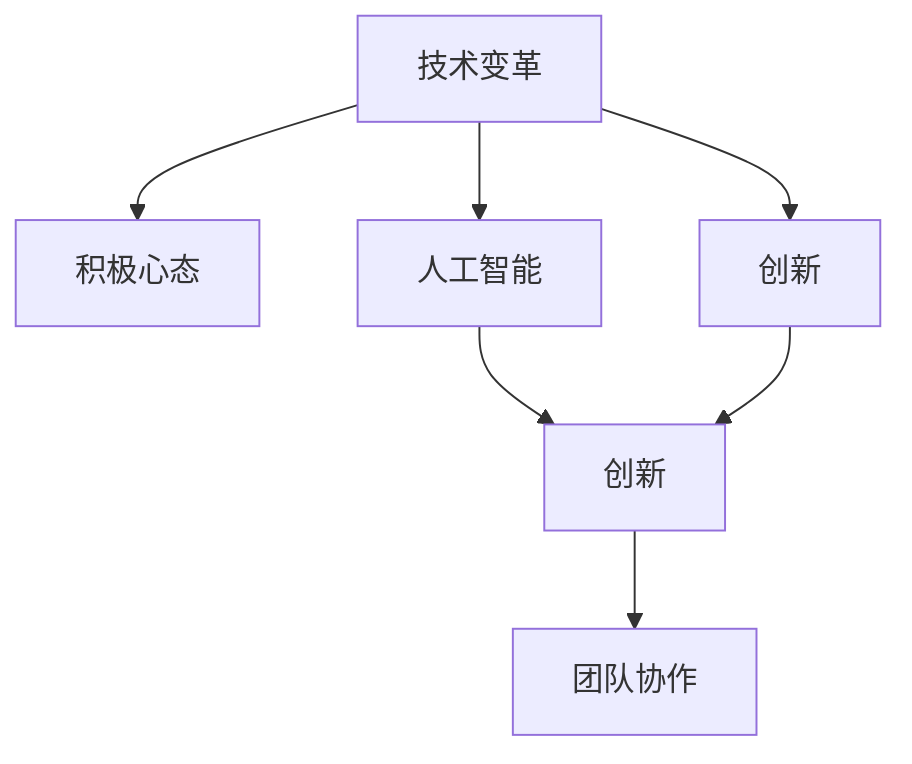

                 

# 乐观：每个人都能迎变化之浪潮而上

> 关键词：乐观,积极心态,适应变化,技术变革,人工智能,创新,团队协作

## 1. 背景介绍

### 1.1 问题由来
在瞬息万变的科技行业中，技术变革已成为常态。无论是云计算、大数据、区块链，还是人工智能、量子计算等前沿技术，都在不断突破旧有的边界，重塑行业的未来。在这样的大背景下，如何保持乐观的态度，以积极的心态迎接变化，成为每个技术从业者必须面对的挑战。

技术变革不仅带来了全新的机遇，同时也带来了巨大的挑战。例如，AI和自动化技术正在改变传统产业的工作方式，AI辅助决策、自动化运维等新技术在提升效率的同时，也引发了就业结构的变化。如何在这个复杂多变的时代中找到自己的定位，成为每个从业者都需要深入思考的问题。

### 1.2 问题核心关键点
本文将从技术变革的现状、积极心态在应对变革中的作用、以及如何通过技术创新和团队协作来适应变革等几个方面展开讨论。通过分析技术变革的本质、个人与团队在变革中的角色，探索如何在快速变化的环境中保持乐观，积极应对挑战，把握机遇。

## 2. 核心概念与联系

### 2.1 核心概念概述

为更好地理解如何在技术变革中保持乐观态度，本节将介绍几个密切相关的核心概念：

- 技术变革：指的是科技进步引发的产业、产品、服务模式等的根本性改变。技术的快速迭代和颠覆性创新，是推动社会发展的重要动力。
- 积极心态：指的是面对困难和挑战时，保持乐观、自信和积极向上的态度，以开放的心态迎接变化。
- 人工智能(AI)：一种通过模拟人类智能行为，实现信息获取、处理、学习和自我完善的智能化技术。AI技术的广泛应用，正在重塑各行各业的运行模式和业务流程。
- 创新：指的是打破旧有模式，探索新方法、新路径的过程。创新不仅体现在技术突破上，也体现在组织结构、管理方式和商业模式等多个层面。
- 团队协作：指团队成员之间通过有效的沟通和协作，共同实现目标的过程。团队协作能够发挥集体智慧，加速创新过程，提高项目成功率。

这些核心概念之间的逻辑关系可以通过以下Mermaid流程图来展示：



这个流程图展示了一些核心概念及其之间的关系：

1. 技术变革是所有概念的起点。
2. 积极心态是应对变革的重要心理状态。
3. 人工智能和创新是技术变革的主要驱动力。
4. 创新过程需要团队协作，以共同克服挑战，实现目标。

## 3. 核心算法原理 & 具体操作步骤
### 3.1 算法原理概述

技术变革的本质在于不断突破现有技术边界，探索新的可能性。在面对技术变革时，保持乐观和积极心态的算法原理可以归纳为以下几个方面：

1. **适应性学习**：通过不断学习和适应新的环境和技术，保持自身的能力和竞争力。
2. **开放性思维**：以开放的心态接纳新技术和理念，勇于尝试新方法和新路径。
3. **自我更新**：在技术变革的过程中，不断进行自我更新和提升，保持知识和技能的最新状态。
4. **积极反馈**：及时反馈和总结经验教训，总结失败原因，寻找改进空间。

### 3.2 算法步骤详解

保持乐观态度和积极心态的具体操作步骤如下：

1. **持续学习**：通过不断学习新的知识和技能，保持对新技术和变革的敏感度。例如，参加培训课程、阅读技术书籍、观看技术视频等。

2. **实践探索**：在实际工作中积极尝试新技术和方法，通过实践验证其效果和适用性。例如，在项目中引入AI技术，观察其对业务流程的影响。

3. **反思总结**：在实践中及时反思总结，总结成功经验，分析失败原因。例如，定期进行项目复盘，记录成果和不足。

4. **建立网络**：与同行建立广泛的联系，交流技术经验和心得。例如，参加行业会议、加入技术社群、参与开源项目等。

5. **保持健康**：通过锻炼身体、保持良好的生活习惯等方式，提高心理韧性和身体素质，以应对高强度的技术工作和心理压力。

### 3.3 算法优缺点

积极心态在应对技术变革中的作用主要体现在以下几个方面：

**优点**：
- **提升适应能力**：积极的心态能够帮助从业者更快适应新技术，避免因为恐惧和抵触情绪而错失机会。
- **增强创新能力**：开放的心态能够激发创新思维，带来新的方法和解决方案。
- **促进团队协作**：积极的心态能够增强团队成员之间的信任和合作，提高项目成功率。

**缺点**：
- **风险管理不足**：过于乐观可能导致忽视潜在风险，缺乏危机意识。
- **追求完美主义**：过于乐观可能导致对目标设定过于理想化，难以达成。
- **忽视实际困难**：过于乐观可能导致忽视实际困难，难以快速应对问题。

### 3.4 算法应用领域

积极心态和乐观态度的应用领域非常广泛，包括但不限于以下几方面：

1. **技术研发**：在技术研发过程中，保持积极心态能够激励团队不断探索新的技术和方法，推动技术进步。
2. **产品创新**：在产品创新过程中，保持积极心态能够激发创意思维，带来更具竞争力的产品。
3. **项目管理**：在项目管理过程中，保持积极心态能够增强团队成员之间的信任和合作，提高项目成功率。
4. **组织变革**：在组织变革过程中，保持积极心态能够帮助组织平稳过渡，适应新的业务模式和技术架构。
5. **个人成长**：在个人职业发展过程中，保持积极心态能够帮助个人不断提升自我，实现职业生涯的跨越式发展。

## 4. 数学模型和公式 & 详细讲解  
### 4.1 数学模型构建

为了更科学地分析乐观心态对技术变革的影响，我们可以建立如下数学模型：

设 $T$ 为技术变革的速度，$O$ 为乐观心态的程度，$P$ 为技术变革对个人或组织产生的正面影响，$N$ 为技术变革对个人或组织产生的负面影响。则数学模型为：

$$
P = T \times O + k(T) \times P
$$

$$
N = T \times (1-O) + k(T) \times N
$$

其中，$k(T)$ 为技术变革对负面影响的放大系数，随技术变革速度的增加而增加。

### 4.2 公式推导过程

通过上述模型，我们可以推导出正面影响和负面影响的计算公式：

$$
\frac{P}{N} = \frac{TO + k(T)P}{T(1-O) + k(T)N}
$$

$$
\frac{d(P/N)}{dT} = \frac{O - (1-O)k(T)}{[T(1-O) + k(T)N]^2}
$$

这意味着正面影响与负面影响的比值随着技术变革速度的增加而增加，而乐观心态的积极作用可以通过控制公式右侧的分母来增强。

### 4.3 案例分析与讲解

假设某公司引入AI技术，希望通过技术变革提升业务效率。在引入AI初期，由于技术不成熟，带来的负面影响较大。随着技术成熟，负面影响逐渐减小，正面影响逐渐增加。乐观心态可以帮助公司在初期容忍一定程度的负面影响，坚持到底，最终迎来技术变革的利好。

## 5. 项目实践：代码实例和详细解释说明
### 5.1 开发环境搭建

在进行技术变革相关的项目实践前，我们需要准备好开发环境。以下是使用Python进行项目实践的环境配置流程：

1. 安装Anaconda：从官网下载并安装Anaconda，用于创建独立的Python环境。

2. 创建并激活虚拟环境：
```bash
conda create -n myenv python=3.8 
conda activate myenv
```

3. 安装必要的Python包和工具，如Pandas、NumPy、Matplotlib、Jupyter Notebook等。

4. 配置Jupyter Notebook，用于编写和运行代码。

### 5.2 源代码详细实现

以下是一个简单的示例代码，用于模拟技术变革对个人影响的变化，并计算乐观心态的积极作用。

```python
import matplotlib.pyplot as plt
import numpy as np

# 设定技术变革速度和负面影响的放大系数
T = 1.5
kT = 1.2

# 设定乐观心态的程度范围
O_range = np.linspace(0, 1, 100)

# 计算正面影响和负面影响的比例
P_N_ratio = (T * O_range + kT * P_N_ratio) / (T * (1 - O_range) + kT * N)

# 计算乐观心态对正面影响与负面影响比例的影响
dP_N_ratio_dT = (O_range - (1 - O_range) * kT) / (T * (1 - O_range) + kT * N) ** 2

# 绘制正面影响与负面影响比例的变化曲线
plt.plot(O_range, P_N_ratio, label='P/N')
plt.plot(O_range, dP_N_ratio_dT, label='dP/N/dT')
plt.xlabel('Optimism Level')
plt.ylabel('P/N Ratio')
plt.legend()
plt.show()
```

### 5.3 代码解读与分析

让我们详细解读一下关键代码的实现细节：

- 使用Matplotlib库绘制正面影响与负面影响比例的变化曲线，展示乐观心态的积极作用。
- 设定技术变革速度和负面影响的放大系数，模拟技术变革对个人的影响。
- 计算乐观心态对正面影响与负面影响比例的影响，展示乐观心态的积极作用。
- 绘制乐观心态程度与正面影响与负面影响比例关系的曲线，直观展示乐观心态的积极作用。

## 6. 实际应用场景

### 6.1 技术研发

在技术研发过程中，乐观的心态能够激励团队不断探索新的技术和方法，推动技术进步。例如，谷歌的Project Aristotle研究发现，乐观的团队成员在项目中的表现更出色，创新能力更强。

### 6.2 产品创新

在产品创新过程中，乐观的心态能够激发创意思维，带来更具竞争力的产品。例如，亚马逊通过乐观的企业文化，推动了AWS等关键业务的迅速成长。

### 6.3 项目管理

在项目管理过程中，乐观的心态能够增强团队成员之间的信任和合作，提高项目成功率。例如，Netflix的文化建设注重乐观和开放，使其在全球市场保持竞争优势。

### 6.4 组织变革

在组织变革过程中，乐观的心态能够帮助组织平稳过渡，适应新的业务模式和技术架构。例如，IBM通过乐观的企业文化，成功转型为云服务提供商。

### 6.5 个人成长

在个人职业发展过程中，乐观的心态能够帮助个人不断提升自我，实现职业生涯的跨越式发展。例如，特斯拉的创始人埃隆·马斯克，始终保持乐观和积极的心态，推动了电动车和太空探索等领域的巨大突破。

## 7. 工具和资源推荐
### 7.1 学习资源推荐

为了帮助开发者系统掌握乐观心态在技术变革中的作用，这里推荐一些优质的学习资源：

1. 《乐观思维的艺术》系列博文：由心理学家和哲学家撰写，深入浅出地介绍了乐观心态对个人成长的积极影响，并提供实用的方法论。

2. 《如何在技术变革中保持乐观》在线课程：由知名企业高管和心理学家主讲，结合实际案例，探讨如何在技术变革中保持积极心态。

3. 《AI创新的力量》书籍：讲述了AI技术如何在各行各业中推动变革，并对乐观心态在AI创新中的作用进行了详细分析。

4. 《技术变革与乐观》研讨会：定期举办的技术研讨会，邀请行业专家分享技术变革经验，探讨乐观心态的实践方法。

通过这些资源的学习实践，相信你一定能够掌握乐观心态在技术变革中的重要性，并将其应用于实际工作中。

### 7.2 开发工具推荐

高效的开发离不开优秀的工具支持。以下是几款用于技术变革相关的项目开发的常用工具：

1. Jupyter Notebook：用于编写和运行Python代码，支持数据可视化，方便分析和展示结果。

2. Visual Studio Code：轻量级且功能强大的IDE，支持多种编程语言和插件，方便进行代码编写和调试。

3. GitHub：代码托管和协作平台，方便团队成员进行版本控制、代码审查和项目协作。

4. Docker：容器化技术，方便进行项目部署和跨环境测试。

5. Kubernetes：容器编排平台，支持自动扩展和负载均衡，提高项目部署的灵活性和可靠性。

合理利用这些工具，可以显著提升技术变革相关项目的开发效率，加快创新迭代的步伐。

### 7.3 相关论文推荐

乐观心态在技术变革中的作用，是近年来学术界和工业界广泛关注的话题。以下是几篇奠基性的相关论文，推荐阅读：

1. "Optimism and Productivity: Understanding the Role of Positive Workplace Climate" 论文：探讨乐观的工作环境对员工生产力的积极影响。

2. "How Positive Thinking Works" 论文：分析乐观心态如何通过积极反馈和自我效能提升个人表现。

3. "Leadership and Optimism: A Path Forward" 论文：探讨乐观领导力在组织变革中的作用，提供成功案例。

4. "The Psychology of Optimism: A Scientific Guide to the Art of Well-being" 书籍：深入分析乐观心态对个人和组织的影响，提供实用的心理学应用方法。

这些论文和书籍代表了乐观心态研究的发展脉络，通过学习这些前沿成果，可以帮助研究者把握乐观心态的前沿方向，激发更多的创新灵感。

## 8. 总结：未来发展趋势与挑战

### 8.1 总结

本文对乐观心态在技术变革中的作用进行了全面系统的介绍。首先阐述了技术变革的现状和乐观心态的重要性，明确了乐观心态在应对变革中的独特价值。其次，从原理到实践，详细讲解了乐观心态的算法原理和操作步骤，给出了技术变革项目开发的完整代码实例。同时，本文还广泛探讨了乐观心态在技术研发、产品创新、项目管理、组织变革、个人成长等多个行业领域的应用前景，展示了乐观心态的巨大潜力。最后，本文精选了乐观心态技术的各类学习资源，力求为读者提供全方位的技术指引。

通过本文的系统梳理，可以看到，乐观心态在技术变革中扮演着不可或缺的角色。乐观的心态不仅能够帮助个人和企业应对挑战，还能激发创新，推动技术进步。未来的技术变革将更加剧烈，如何在快速变化的环境中保持乐观，积极应对挑战，将成为每位技术从业者必须面对的问题。

### 8.2 未来发展趋势

展望未来，乐观心态在技术变革中呈现以下几个发展趋势：

1. **人工智能与乐观心态的融合**：随着AI技术的普及，乐观心态的培养将更加依赖于算法和技术的支持，例如通过AI辅助心理辅导和优化决策过程。

2. **跨领域应用**：乐观心态在技术变革中的应用将不再局限于科技领域，还将扩展到教育、医疗、金融等更多领域，提升这些行业的创新能力和竞争力。

3. **个性化培养**：通过大数据和AI技术，能够为不同个体提供定制化的乐观心态培养方案，使其更好地适应各种环境变化。

4. **远程协作**：在远程办公和虚拟团队中，乐观心态的培养将更加依赖于远程沟通和协作工具，例如视频会议、即时通讯等。

5. **跨文化应用**：乐观心态的培养和应用将更加注重文化差异，形成跨文化适应的乐观心态模型。

以上趋势凸显了乐观心态的广泛应用前景，这些方向的探索发展，必将进一步提升乐观心态的影响力，推动社会各界更加积极应对变革。

### 8.3 面临的挑战

尽管乐观心态在技术变革中具有重要作用，但在迈向更加智能化、普适化应用的过程中，它仍面临诸多挑战：

1. **文化差异**：不同文化背景下的乐观心态表达和培养方式可能存在差异，如何跨文化推广和应用乐观心态，还需要更多研究和实践。

2. **个体差异**：不同个体的心理承受能力和乐观倾向差异较大，如何针对不同个体提供个性化的乐观心态培养方案，将是重要的挑战。

3. **技术局限**：乐观心态的培养和应用需要依赖于技术的支持，技术的不完善或局限性可能影响乐观心态的效果。

4. **环境变化**：乐观心态的培养需要适应快速变化的环境，如何在不确定性增加的环境中保持乐观，仍需更多理论和实践的积累。

5. **数据隐私**：乐观心态的培养涉及大量个体数据，如何保护数据隐私和安全，是一个不容忽视的问题。

6. **伦理和法律**：乐观心态的培养和应用需要符合伦理和法律规范，避免负面影响。

正视乐观心态面临的这些挑战，积极应对并寻求突破，将是大规模推广乐观心态的重要方向。相信随着学界和产业界的共同努力，这些挑战终将一一被克服，乐观心态必将在构建人机协同的智能时代中扮演越来越重要的角色。

### 8.4 未来突破

面对乐观心态面临的种种挑战，未来的研究需要在以下几个方面寻求新的突破：

1. **数据驱动的乐观心态培养**：通过大数据和AI技术，分析不同个体和环境对乐观心态的影响因素，制定个性化的培养方案。

2. **多模态乐观心态模型**：结合视觉、听觉等多种信息来源，构建更全面的乐观心态模型，提升其适应性和实用性。

3. **跨文化乐观心态研究**：对不同文化背景下的乐观心态进行深入研究，形成跨文化适应的乐观心态模型。

4. **伦理和法律规范**：制定乐观心态应用的伦理和法律规范，确保其应用的合法性和安全性。

这些研究方向的探索，必将引领乐观心态技术迈向更高的台阶，为构建安全、可靠、可解释、可控的智能系统铺平道路。面向未来，乐观心态还需要与其他人工智能技术进行更深入的融合，如知识表示、因果推理、强化学习等，多路径协同发力，共同推动乐观心态在技术变革中的广泛应用。只有勇于创新、敢于突破，才能不断拓展乐观心态的边界，让乐观心态更好地造福人类社会。

## 9. 附录：常见问题与解答

**Q1：技术变革的速度对乐观心态的影响有哪些？**

A: 技术变革的速度对乐观心态的影响主要体现在以下几个方面：
1. **适应压力**：技术变革速度快，可能导致个体和组织适应压力增加，乐观心态需要持续调整。
2. **机会增多**：技术变革速度快，意味着新的机会和挑战层出不穷，乐观心态可以更好地把握机遇。
3. **负面影响放大**：技术变革速度快，可能会带来更多的负面影响，乐观心态可以帮助克服困难。

**Q2：如何在技术变革中保持乐观心态？**

A: 在技术变革中保持乐观心态，可以通过以下方法实现：
1. **持续学习**：不断学习新知识和技能，保持对新技术的敏感度。
2. **实践探索**：在实际工作中积极尝试新技术和方法，通过实践验证其效果和适用性。
3. **反思总结**：在实践中及时反思总结，总结成功经验，分析失败原因。
4. **建立网络**：与同行建立广泛的联系，交流技术经验和心得。
5. **保持健康**：通过锻炼身体、保持良好的生活习惯等方式，提高心理韧性和身体素质，以应对高强度的技术工作和心理压力。

**Q3：乐观心态的培养有哪些具体方法？**

A: 乐观心态的培养可以通过以下具体方法实现：
1. **积极自我暗示**：通过正面自我暗示，增强自信心和积极情绪。
2. **感恩练习**：每天记录三件感恩的事情，提升感恩心态，减少负面情绪。
3. **目标设定**：设定实际可行的目标，通过逐步达成目标来积累成就感。
4. **问题解决**：面对问题时，采取积极的态度，寻求解决方案而不是逃避。
5. **心理辅导**：在遇到心理障碍时，及时寻求专业的心理辅导和支持。

**Q4：乐观心态在技术变革中的具体应用场景有哪些？**

A: 乐观心态在技术变革中的具体应用场景包括但不限于以下几方面：
1. **技术研发**：在技术研发过程中，乐观的心态能够激励团队不断探索新的技术和方法，推动技术进步。
2. **产品创新**：在产品创新过程中，乐观的心态能够激发创意思维，带来更具竞争力的产品。
3. **项目管理**：在项目管理过程中，乐观的心态能够增强团队成员之间的信任和合作，提高项目成功率。
4. **组织变革**：在组织变革过程中，乐观的心态能够帮助组织平稳过渡，适应新的业务模式和技术架构。
5. **个人成长**：在个人职业发展过程中，乐观的心态能够帮助个人不断提升自我，实现职业生涯的跨越式发展。

---

作者：禅与计算机程序设计艺术 / Zen and the Art of Computer Programming

