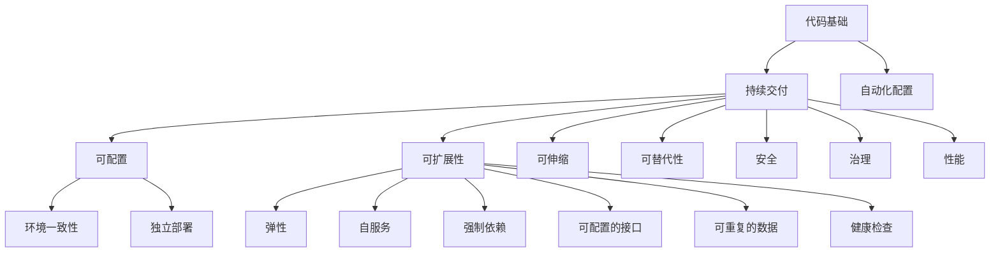

                 

# 云原生应用开发：12因素应用方法论

## 1. 背景介绍

随着云计算的普及和容器技术的成熟，云原生应用开发逐渐成为企业级应用的主流趋势。云原生应用程序能够无缝地部署、扩展、管理和监控在云平台上的服务，带来了诸多优势，如部署速度快、容错能力强、便于更新、资源按需伸缩等。云原生方法论的核心思想是通过将应用设计和实现按照云平台环境进行重构，从而更好地利用云资源的弹性和便利性。

本文将详细阐述云原生应用的12个核心原则，这些原则已经被广泛应用于DevOps和微服务架构中。理解并践行这些原则，可以帮助开发人员和架构师构建高性能、可靠、可扩展的云原生应用。

## 2. 核心概念与联系

### 2.1 核心概念概述

云原生应用的核心概念包括12因素方法和DevOps文化。这些概念之间有着紧密的联系，共同构成了云原生应用的完整框架。

- **12因素方法**：指导开发人员设计、构建和部署云原生应用的一组原则。这些原则包括代码基础、持续交付、自动化配置、可配置、可扩展性、环境一致性、独立部署、可伸缩、可替代性、安全、治理和性能。
- **DevOps文化**：强调协作、快速反馈和持续改进的开发模式。DevOps文化鼓励开发者、运维人员、测试人员紧密合作，共同实现高效的持续交付和系统监控。

这些概念共同支撑了云原生应用的开发和运维，确保应用程序能够在云平台中高效运行，同时能够快速响应市场变化和技术创新。

### 2.2 核心概念原理和架构的 Mermaid 流程图



该图展示了12因素方法的核心概念及其联系。每个因素都对应了一个关键的概念和原则，构建了云原生应用的完整框架。开发者和架构师需要理解这些概念，并在实践中加以应用，才能构建出高性能的云原生应用。

## 3. 核心算法原理 & 具体操作步骤

### 3.1 算法原理概述

云原生应用的12因素方法论，是一种指导开发和运维的实践方法，旨在帮助开发者构建出高质量、可靠、可扩展的云原生应用。这些因素综合考虑了应用的性能、安全、可靠性、可扩展性、运维难度和开发效率等各个方面，是构建云原生应用的基础。

### 3.2 算法步骤详解

以下是对每个因素的具体解释和操作步骤：

#### 1. 代码基础

**代码基础**是云原生应用开发的基础。它要求开发者使用版本控制系统（如Git）进行代码管理，同时遵循单一职责原则（Single Responsibility Principle），确保代码模块化、可读性强。

**操作步骤**：

1. **版本控制**：使用Git等版本控制系统进行代码管理，确保代码的追踪和回滚。
2. **单一职责原则**：将代码分解为小模块，每个模块只负责单一功能，提高代码的可读性和维护性。
3. **依赖管理**：使用依赖管理工具（如Maven、npm）管理项目依赖，确保依赖关系清晰。

#### 2. 持续交付

**持续交付**是指在软件开发过程中，快速、频繁地将代码交付给生产环境，从而实现快速反馈和快速迭代。

**操作步骤**：

1. **自动化构建和测试**：使用自动化工具（如Jenkins、Travis CI）进行构建和测试，确保代码的质量。
2. **持续集成**：将代码提交到版本控制系统后，自动触发构建和测试流程。
3. **持续部署**：在通过测试后，自动部署代码到生产环境，实现快速交付。

#### 3. 自动化配置

**自动化配置**指的是在应用部署时，使用脚本自动化配置系统环境，确保环境的一致性。

**操作步骤**：

1. **环境变量管理**：将环境变量集中管理，减少手工配置的错误。
2. **基础设施即代码（IaC）**：使用IaC工具（如Terraform、Ansible）管理基础设施配置，确保配置的一致性。
3. **容器化部署**：使用容器化技术（如Docker、Kubernetes）部署应用，确保应用在各种环境中的行为一致。

#### 4. 可配置

**可配置**是指应用通过配置文件（如YAML、XML）进行配置，使应用的配置与环境分离，便于管理和维护。

**操作步骤**：

1. **配置文件管理**：使用统一的配置文件格式，如YAML，进行配置管理。
2. **配置项分离**：将应用配置项分离到不同的配置文件中，便于管理和维护。
3. **环境变量**：使用环境变量进行环境配置，确保配置项与环境分离。

#### 5. 可扩展性

**可扩展性**指的是应用能够快速、灵活地扩展其容量和功能，以应对业务需求的变化。

**操作步骤**：

1. **微服务架构**：将应用拆分为多个独立的服务，每个服务负责单一功能，便于扩展。
2. **弹性伸缩**：使用自动伸缩技术（如Kubernetes的HPA）自动调整应用容量，确保应用能够快速应对流量变化。
3. **消息队列**：使用消息队列（如RabbitMQ、Kafka）进行解耦合，提高系统的可靠性。

#### 6. 环境一致性

**环境一致性**指的是在不同环境中（如开发、测试、生产）应用的行为一致，确保应用在不同环境中的稳定性。

**操作步骤**：

1. **IaC工具**：使用IaC工具管理基础设施配置，确保配置的一致性。
2. **虚拟环境**：使用虚拟环境（如virtualenv）隔离不同环境下的依赖关系。
3. **测试环境**：建立与生产环境一致的测试环境，进行全面的测试。

#### 7. 独立部署

**独立部署**指的是每个服务独立部署，便于管理和维护。

**操作步骤**：

1. **服务拆分**：将应用拆分为多个独立的服务，每个服务负责单一功能。
2. **容器化部署**：使用容器化技术部署服务，确保服务独立性。
3. **服务发现**：使用服务发现工具（如Consul）管理服务注册和发现，确保服务的可靠性。

#### 8. 可伸缩

**可伸缩**指的是应用能够根据业务需求自动调整其容量，确保应用能够快速应对流量变化。

**操作步骤**：

1. **负载均衡**：使用负载均衡器（如Nginx、HAProxy）分配流量，确保应用的高可用性。
2. **自动伸缩**：使用自动伸缩技术（如Kubernetes的HPA）自动调整应用容量，确保应用能够快速应对流量变化。
3. **缓存技术**：使用缓存技术（如Redis）提高应用的响应速度。

#### 9. 可替代性

**可替代性**指的是应用中的每个服务都是独立的，能够快速替代其他服务，提高系统的可靠性。

**操作步骤**：

1. **服务拆分**：将应用拆分为多个独立的服务，每个服务负责单一功能。
2. **服务注册**：使用服务注册工具（如Consul）管理服务注册和发现，确保服务的可靠性。
3. **故障转移**：使用负载均衡和自动伸缩技术实现服务的故障转移。

#### 10. 安全

**安全**指的是应用能够保护数据和系统免受恶意攻击和未授权访问，确保应用的安全性。

**操作步骤**：

1. **身份验证**：使用身份验证机制（如OAuth、JWT）保护系统免受未授权访问。
2. **加密**：使用加密技术（如SSL、AES）保护数据传输和存储的安全。
3. **漏洞扫描**：定期进行漏洞扫描，确保系统的安全性。

#### 11. 治理

**治理**指的是应用的管理和监控，确保应用的高可用性和性能。

**操作步骤**：

1. **监控**：使用监控工具（如Prometheus、Grafana）监控应用的性能和状态。
2. **日志管理**：使用日志管理工具（如ELK Stack）管理应用的日志。
3. **性能优化**：根据监控结果进行性能优化，确保应用的高可用性。

#### 12. 性能

**性能**指的是应用的响应速度和吞吐量，确保应用的高效性和可靠性。

**操作步骤**：

1. **负载均衡**：使用负载均衡器（如Nginx、HAProxy）分配流量，确保应用的高可用性。
2. **缓存技术**：使用缓存技术（如Redis）提高应用的响应速度。
3. **性能优化**：根据监控结果进行性能优化，确保应用的高可用性。

### 3.3 算法优缺点

#### 优点：

1. **快速交付**：持续交付和自动化配置使得开发者能够快速交付和部署应用，提高开发效率。
2. **灵活扩展**：微服务架构和弹性伸缩技术使得应用能够快速扩展其容量和功能，提高系统的可扩展性。
3. **环境一致**：IaC工具和虚拟环境确保了应用在不同环境中的行为一致，提高系统的可靠性。

#### 缺点：

1. **复杂性高**：云原生架构和12因素方法增加了应用的复杂性，需要更高的技术水平和管理能力。
2. **成本高**：使用云原生架构和12因素方法需要更高的基础设施投入，增加了成本。
3. **学习曲线陡峭**：云原生方法和DevOps文化需要开发人员和运维人员掌握新的技术和工具，学习曲线较陡峭。

### 3.4 算法应用领域

云原生应用的12因素方法论广泛应用于各种规模的企业中，包括金融、电商、互联网、医疗等领域。这些原则和方法帮助企业在云计算环境下构建出高效、可靠、可扩展的应用。

- **金融行业**：云原生应用在金融行业中被广泛应用，帮助银行、保险公司等金融机构实现业务数字化转型，提高服务效率和客户体验。
- **电商行业**：电商行业使用云原生应用实现高效的订单处理、库存管理和支付服务，确保业务的高可用性和可扩展性。
- **互联网行业**：互联网公司使用云原生应用构建高流量的网站和应用程序，提供稳定、可靠的服务。
- **医疗行业**：医疗机构使用云原生应用实现电子病历管理、医疗数据共享等功能，提高医疗服务的效率和质量。

## 4. 数学模型和公式 & 详细讲解 & 举例说明

### 4.1 数学模型构建

云原生应用的12因素方法论是一种实践方法，可以通过数学模型来进一步解释和量化。

设云原生应用的当前状态为 $S$，目标状态为 $S^*$。在执行12因素方法时，应用的状态变化可以表示为：

$$
S \rightarrow S_1 \rightarrow S_2 \rightarrow \cdots \rightarrow S_n \rightarrow S^*
$$

其中 $S_i$ 表示应用在执行第 $i$ 个因素后的状态。每个因素可以表示为 $F_i$，其对应的操作可以表示为 $T_i$。因此，应用的状态变化可以表示为：

$$
S \xrightarrow{F_1} S_1 \xrightarrow{F_2} S_2 \xrightarrow{F_3} \cdots \xrightarrow{F_n} S^*
$$

### 4.2 公式推导过程

对于每个因素 $F_i$，其对应的操作 $T_i$ 可以表示为：

$$
T_i(S) = S_i
$$

其中 $S_i$ 表示应用在执行第 $i$ 个因素后的状态。例如，对于 **可配置性** 因素，其对应的操作可以表示为：

$$
T_{\text{配置}}(S) = S' \text{ where } S' = \{s_1, s_2, \cdots, s_k\}
$$

其中 $S'$ 表示应用在执行可配置性操作后的状态，$s_1, s_2, \cdots, s_k$ 表示应用的不同配置项。

### 4.3 案例分析与讲解

以 **持续交付** 因素为例，分析其操作步骤和数学模型。

设应用在当前状态为 $S_0$，持续交付操作 $T_{\text{持续交付}}$ 可以表示为：

$$
T_{\text{持续交付}}(S_0) = S_1
$$

其中 $S_1$ 表示应用在执行持续交付操作后的状态。其操作步骤包括：

1. **自动化构建和测试**：
   - 使用自动化工具进行构建和测试，确保代码的质量。
   - 数学模型表示为：
   $$
   T_{\text{构建}}(S_0) = S_1 \text{ where } S_1 = \{S_0', \text{构建成功}, \text{构建失败}\}
   $$
2. **持续集成**：
   - 将代码提交到版本控制系统后，自动触发构建和测试流程。
   - 数学模型表示为：
   $$
   T_{\text{集成}}(S_1) = S_2 \text{ where } S_2 = \{S_1', \text{构建成功}, \text{构建失败}\}
   $$
3. **持续部署**：
   - 在通过测试后，自动部署代码到生产环境，实现快速交付。
   - 数学模型表示为：
   $$
   T_{\text{部署}}(S_2) = S_3 \text{ where } S_3 = \{S_2', \text{部署成功}, \text{部署失败}\}
   $$

最终，应用的状态从 $S_0$ 变为 $S_3$，实现了持续交付的目标。

## 5. 项目实践：代码实例和详细解释说明

### 5.1 开发环境搭建

开发环境搭建是云原生应用开发的基础，以下是一个典型的开发环境搭建流程：

1. **选择云平台**：选择合适的云平台（如AWS、Azure、Google Cloud），创建云账户，并设置默认区域。
2. **安装 Docker**：安装 Docker 引擎和客户端，以便使用容器化技术。
3. **安装 Kubernetes**：安装 Kubernetes 集群，以便管理容器的生命周期。
4. **安装 CI/CD 工具**：选择 CI/CD 工具（如Jenkins、GitLab CI），配置自动化构建和部署流程。
5. **配置 IaC 工具**：安装 IaC 工具（如Terraform、Ansible），配置基础设施自动化。

### 5.2 源代码详细实现

以下是一个基于 Kubernetes 和 Docker 的云原生应用实现示例。

#### Dockerfile

```Dockerfile
FROM ubuntu:latest
WORKDIR /app
COPY . /app
RUN apt-get update && apt-get install -y --no-install-recommends \
    nodejs \
    npm \
    git \
    jq
COPY package.json /app
RUN npm install
COPY .gitignore /app
COPY .env /app
RUN ln -s /app/node_modules/.bin/ \
    node \
    npm
EXPOSE 80
CMD ["npm", "start"]
```

#### Kubernetes Deployment

```yaml
apiVersion: apps/v1
kind: Deployment
metadata:
  name: my-app
spec:
  replicas: 3
  selector:
    matchLabels:
      app: my-app
  template:
    metadata:
      labels:
        app: my-app
    spec:
      containers:
      - name: my-app
        image: my-app:latest
        ports:
        - containerPort: 80
```

#### Kubernetes Service

```yaml
apiVersion: v1
kind: Service
metadata:
  name: my-app
spec:
  selector:
    app: my-app
  ports:
    - protocol: TCP
      port: 80
      targetPort: 80
  type: LoadBalancer
```

### 5.3 代码解读与分析

#### Dockerfile

Dockerfile 描述了如何构建一个 Docker 镜像。它指定了基础镜像、工作目录、复制代码、安装依赖、设置环境变量等步骤。最终生成的镜像将包含 Node.js 和 npm，并暴露了 80 端口。

#### Kubernetes Deployment

Kubernetes Deployment 定义了应用的副本数量、选择器、模板等参数，并指定了应用的容器镜像、端口映射和生命周期管理。通过这种声明式的方式，可以方便地管理多个应用的副本和资源。

#### Kubernetes Service

Kubernetes Service 定义了服务的类型、选择器、端口映射等参数，并暴露了应用的负载均衡和网络访问。通过这种声明式的方式，可以方便地管理应用的负载均衡和网络访问。

## 6. 实际应用场景

### 6.1 智能客服系统

智能客服系统是云原生应用的典型应用场景之一。基于云原生架构的智能客服系统，可以实现快速部署、弹性扩展和自动恢复，提升客服效率和客户满意度。

#### 部署流程

1. **容器化**：将智能客服系统应用容器化，便于部署和扩展。
2. **自动扩展**：使用 Kubernetes 的自动伸缩功能，根据流量自动扩展容器的数量。
3. **服务注册**：使用 Consul 进行服务注册和发现，便于系统管理和监控。
4. **监控告警**：使用 Prometheus 和 Grafana 进行监控和告警，确保系统的稳定性和可靠性。

#### 优点

1. **快速部署**：容器化和自动化部署使得智能客服系统可以快速部署到生产环境。
2. **弹性扩展**：自动伸缩功能使得系统能够快速扩展其容量，应对业务高峰期的流量压力。
3. **高可用性**：服务注册和负载均衡使得系统能够自动恢复，确保高可用性。
4. **易于管理**：监控和告警功能使得系统易于管理和维护。

### 6.2 金融舆情监测系统

金融舆情监测系统是云原生应用的另一大应用场景。基于云原生架构的金融舆情监测系统，可以实现实时监控、快速响应和高效分析，提升金融风险防控能力。

#### 部署流程

1. **容器化**：将金融舆情监测应用容器化，便于部署和扩展。
2. **自动扩展**：使用 Kubernetes 的自动伸缩功能，根据舆情数据量自动扩展容器的数量。
3. **消息队列**：使用 Kafka 进行消息队列管理，确保舆情数据的可靠传输和处理。
4. **监控告警**：使用 Prometheus 和 Grafana 进行监控和告警，确保系统的稳定性和可靠性。

#### 优点

1. **实时监控**：容器化和自动伸缩使得系统能够实时监控舆情数据。
2. **快速响应**：使用消息队列和自动伸缩功能使得系统能够快速响应舆情事件。
3. **高效分析**：容器化和自动化部署使得系统易于管理和维护。
4. **高可用性**：监控和告警功能使得系统易于管理和维护。

## 7. 工具和资源推荐

### 7.1 学习资源推荐

#### 书籍

1. 《云原生架构实践》（作者：秦晓华）：全面介绍了云原生架构的设计和实现，是理解云原生应用的绝佳入门书籍。
2. 《DevOps文化》（作者：Patrick Debois）：介绍了DevOps文化的基本概念和实践方法，帮助开发者理解云原生应用的运维模式。

#### 在线课程

1. 《云原生应用开发与运维》（Udemy）：详细讲解了云原生应用开发和运维的基本知识和实践方法。
2. 《Kubernetes入门与实战》（腾讯云）：介绍了Kubernetes的基本概念和实战应用，帮助开发者快速上手Kubernetes。

#### 社区和博客

1. Kubernetes官方文档：提供完整的Kubernetes文档，涵盖从入门到进阶的所有知识。
2. CNCF官网：云原生社区联盟（CNCF）提供丰富的云原生相关资源，包括博客、文档和开源项目。

### 7.2 开发工具推荐

#### IDE

1. VS Code：功能强大且易于使用的开源IDE，支持容器化和Kubernetes开发。
2. JetBrains IntelliJ IDEA：面向Java应用的强大IDE，支持容器化和Kubernetes开发。

#### 部署工具

1. Jenkins：功能强大的持续集成和持续部署工具，支持多种容器化工具和Kubernetes集群管理。
2. GitLab CI/CD：提供CI/CD功能，支持多种容器化工具和Kubernetes集群管理。

#### 监控工具

1. Prometheus：高性能的监控系统，支持多种容器化工具和Kubernetes集群管理。
2. Grafana：强大的数据可视化工具，支持Prometheus数据源。

### 7.3 相关论文推荐

#### 学术论文

1. "12 Factor Application Architecture"（作者：Sam Newman）：介绍云原生应用的12因素方法论，是云原生架构的经典论文。
2. "Cloud-Native Computing Foundation"（作者：CNCF）：介绍云原生社区的基本概念和实践方法，是云原生架构的重要文档。

## 8. 总结：未来发展趋势与挑战

### 8.1 研究成果总结

云原生应用的12因素方法论是一种系统化、实践化的开发和运维方法，广泛应用于云平台环境中的应用开发。该方法论的核心思想是通过对应用的设计、实现和部署进行重构，从而更好地利用云资源的弹性和便利性。

### 8.2 未来发展趋势

#### 趋势一：微服务架构的普及

微服务架构是云原生架构的重要组成部分，未来将得到更广泛的应用。微服务架构能够提高系统的可扩展性、弹性和可维护性，是构建高性能、高可用性系统的关键。

#### 趋势二：DevOps文化的普及

DevOps文化强调协作、快速反馈和持续改进，是云原生应用的核心理念。未来，DevOps文化将得到更广泛的应用，帮助企业实现高效的持续交付和系统监控。

#### 趋势三：容器化和Kubernetes的普及

容器化和Kubernetes是云原生架构的核心技术，未来将得到更广泛的应用。容器化技术使得应用能够快速部署、扩展和迁移，Kubernetes使得应用能够自动管理、监控和扩展。

#### 趋势四：多云和混合云的普及

多云和混合云架构能够提供更灵活的资源管理和成本优化，未来将得到更广泛的应用。多云和混合云架构使得企业能够根据实际需求选择最优的云平台资源，提高资源利用率和成本效益。

### 8.3 面临的挑战

#### 挑战一：技术复杂性

云原生架构和12因素方法论增加了应用的复杂性，需要更高的技术水平和管理能力。未来，如何简化技术栈，降低技术门槛，是企业面临的重要挑战。

#### 挑战二：成本问题

云原生架构和容器化技术需要更高的基础设施投入，增加了企业的成本。未来，如何优化资源配置，降低成本，是企业面临的重要挑战。

#### 挑战三：人才短缺

云原生架构和DevOps文化需要开发人员和运维人员掌握新的技术和工具，学习曲线较陡峭。未来，如何培养和引进高质量的开发和运维人才，是企业面临的重要挑战。

### 8.4 研究展望

#### 展望一：自动化运维的普及

自动化运维是云原生架构的重要方向，未来将得到更广泛的应用。通过自动化运维，企业可以实现更高效的系统管理和运维，提高生产效率和质量。

#### 展望二：持续交付的普及

持续交付是云原生架构的重要理念，未来将得到更广泛的应用。通过持续交付，企业可以实现更快速的软件交付和更新，提升用户体验和市场竞争力。

#### 展望三：安全性和合规性

云原生架构的安全性和合规性是企业面临的重要问题。未来，如何构建安全、合规的云原生应用，是企业面临的重要挑战。

## 9. 附录：常见问题与解答

### Q1: 什么是云原生应用？

A: 云原生应用是一种在云平台环境中设计和部署的应用，通过使用容器化、微服务、DevOps等技术，实现高效、可靠、可扩展的系统开发和运维。

### Q2: 12因素方法论的核心思想是什么？

A: 12因素方法论的核心思想是通过对应用的设计、实现和部署进行重构，从而更好地利用云资源的弹性和便利性。

### Q3: 云原生架构的优点有哪些？

A: 云原生架构的优点包括快速部署、弹性扩展、高可用性、易于管理、持续交付等，能够提升企业的生产效率和市场竞争力。

### Q4: 如何构建云原生应用？

A: 构建云原生应用需要遵循12因素方法论，通过容器化、微服务、DevOps等技术，实现高效、可靠、可扩展的系统开发和运维。

### Q5: 如何管理云原生应用的性能？

A: 管理云原生应用的性能需要综合考虑监控、负载均衡、缓存、自动伸缩等多个因素，确保应用的高性能和可扩展性。

### Q6: 云原生应用的未来发展方向是什么？

A: 云原生应用的未来发展方向包括微服务架构的普及、DevOps文化的普及、容器化和Kubernetes的普及、多云和混合云的普及等。

通过深入理解云原生应用的12因素方法论，掌握云原生应用的开发和运维技巧，可以帮助企业构建高效、可靠、可扩展的云原生应用，提升企业的竞争力和市场份额。

