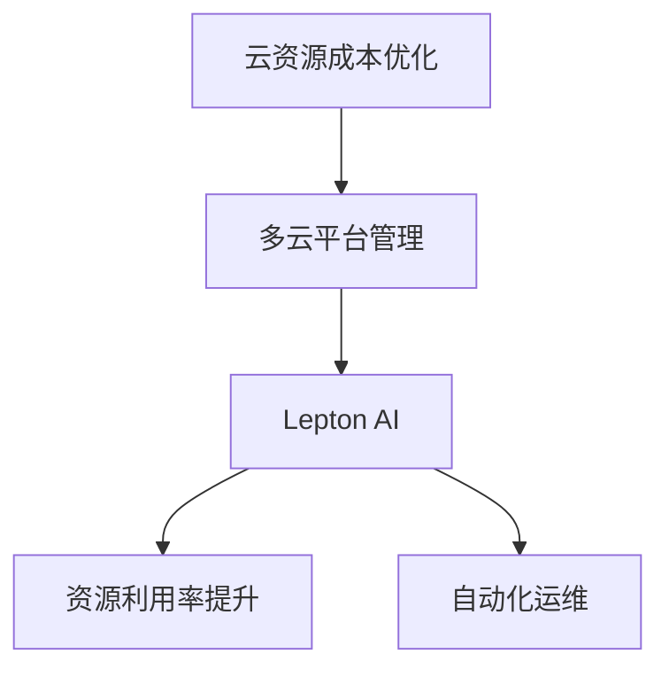

                 

# 云资源整合专家：Lepton AI提供多云平台优化云资源成本

> 关键词：云资源成本优化,多云平台管理,Lepton AI,资源利用率提升,自动化运维

## 1. 背景介绍

随着云计算技术的飞速发展，越来越多的企业开始采用云平台进行业务部署。然而，多云平台的复杂性和多样性使得企业难以实现资源的高效管理和成本优化。如何在不同云平台之间进行资源整合，最大化地提升云资源利用率，降低云资源成本，成为了企业云计算管理的关键难题。

Lepton AI应运而生，它是一套全面的云资源整合方案，能够帮助企业优化多云平台资源成本，提升资源利用率，确保企业云策略的可持续性。Lepton AI通过自动化运维和智能调度技术，实现了跨云平台的资源整合和优化，为企业提供了全新的云计算管理解决方案。

## 2. 核心概念与联系

### 2.1 核心概念概述

为了更好地理解Lepton AI的云资源整合方案，本节将介绍几个关键概念：

- **云资源成本优化**：通过自动化运维和智能调度技术，最大化地提升云资源利用率，降低云资源成本。
- **多云平台管理**：管理和整合多个云平台资源，实现资源统一调度和监控。
- **Lepton AI**：Lepton AI是一套基于AI技术的云资源管理平台，能够自动化地进行资源分配和调度，帮助企业实现云资源的优化和成本控制。
- **资源利用率提升**：通过智能调度算法，动态调整资源分配，确保资源利用率最大化。
- **自动化运维**：通过自动化运维工具，自动进行任务调度、监控和故障处理，减少人工干预。

这些概念之间的关系可以通过以下Mermaid流程图来展示：



这个流程图展示了云资源成本优化的过程，其中多云平台管理和Lepton AI是实现资源优化和成本控制的关键工具，资源利用率提升和自动化运维是优化效果的具体体现。

## 3. 核心算法原理 & 具体操作步骤
### 3.1 算法原理概述

Lepton AI通过智能算法和自动化运维技术，实现云资源的高效管理和成本优化。其核心算法原理包括以下几个方面：

1. **资源识别与调优**：通过自动化工具扫描不同云平台上的资源，识别资源利用率低的节点，并通过智能调度算法优化资源分配。
2. **任务调度与负载均衡**：通过任务调度算法，动态调整任务执行顺序，实现负载均衡，避免资源浪费。
3. **故障监控与自愈**：通过实时监控工具，自动检测和处理云平台中的故障，保证系统稳定运行。
4. **自动化运维**：通过自动化工具自动进行任务调度、监控和故障处理，减少人工干预，提高运维效率。

### 3.2 算法步骤详解

Lepton AI的云资源优化主要包括以下几个步骤：

**Step 1: 资源识别与分析**

- 使用自动化工具扫描不同云平台上的资源，获取资源使用情况。
- 识别资源利用率低的节点和任务。
- 通过分析资源使用模式，发现资源利用率低的原因。

**Step 2: 智能调度与任务优化**

- 根据资源利用率和任务执行情况，优化任务执行顺序和资源分配。
- 使用智能调度算法动态调整资源分配，确保资源利用率最大化。
- 在需要时，启动备用资源以应对突发流量。

**Step 3: 故障监控与自愈**

- 实时监控云平台中的任务执行情况和资源使用情况。
- 自动检测和处理故障，如节点宕机、网络中断等。
- 在故障发生时，启动故障自愈机制，快速恢复系统正常运行。

**Step 4: 自动化运维与持续改进**

- 使用自动化运维工具自动进行任务调度、监控和故障处理。
- 根据优化效果和反馈，持续改进优化算法，提升资源利用率和成本控制能力。

### 3.3 算法优缺点

Lepton AI的云资源优化算法具有以下优点：

1. **高效资源利用**：通过智能调度算法，最大化地提升资源利用率，降低云资源成本。
2. **自动化运维**：通过自动化工具，减少人工干预，提高运维效率。
3. **故障自愈**：实时监控和自愈机制，确保系统稳定运行。
4. **动态调整**：根据资源使用情况，动态调整资源分配和任务执行，适应云平台的不断变化。

同时，该算法也存在一些局限性：

1. **数据依赖**：优化效果依赖于资源使用数据的质量和准确性。
2. **复杂性高**：需要处理多云平台、多任务和多个节点，复杂性较高。
3. **成本较高**：初始部署和优化需要一定的人力和技术支持。

尽管存在这些局限性，但Lepton AI在云资源优化领域已经展现出了显著的效果，为企业提供了强大的云平台管理能力。

### 3.4 算法应用领域

Lepton AI的云资源优化算法在多个领域都有广泛应用，例如：

- **企业级云计算**：为大型企业提供多云平台资源整合和优化方案。
- **金融服务**：优化金融机构的云资源，提高业务处理效率，降低运营成本。
- **医疗行业**：为医疗行业提供高性能、高可靠性的云资源，支持医疗数据的存储和处理。
- **科研机构**：为科研机构提供高效、经济的云资源，支持大规模科学计算和数据分析。

## 4. 数学模型和公式 & 详细讲解  
### 4.1 数学模型构建

Lepton AI的云资源优化算法涉及多个数学模型，其中核心模型为资源利用率优化模型和任务调度模型。

假设企业使用多个云平台，每个平台的资源为 $C_i=\{c_{i,j} | j=1,...,n_i\}$，其中 $c_{i,j}$ 表示平台 $i$ 上的第 $j$ 个节点。

资源利用率优化模型目标为最大化总资源利用率，即：

$$
\max \sum_{i=1}^N \sum_{j=1}^{n_i} \frac{c_{i,j}}{C_i}
$$

其中 $N$ 表示平台数量，$n_i$ 表示平台 $i$ 上的节点数。

任务调度模型目标为最小化任务执行时间，即：

$$
\min \sum_{i=1}^N \sum_{j=1}^{n_i} t_{i,j}
$$

其中 $t_{i,j}$ 表示在平台 $i$ 上的节点 $j$ 执行任务的时间。

### 4.2 公式推导过程

资源利用率优化模型的优化目标可以表示为：

$$
\max \sum_{i=1}^N \sum_{j=1}^{n_i} \frac{c_{i,j}}{C_i}
$$

使用拉格朗日乘数法，引入拉格朗日乘子 $\lambda_i$，可得：

$$
\max \sum_{i=1}^N \sum_{j=1}^{n_i} \frac{c_{i,j}}{C_i} - \sum_{i=1}^N \lambda_i \left(\sum_{j=1}^{n_i} c_{i,j} - C_i\right)
$$

定义函数 $f(\theta) = \sum_{i=1}^N \sum_{j=1}^{n_i} \frac{c_{i,j}}{C_i} - \sum_{i=1}^N \lambda_i \left(\sum_{j=1}^{n_i} c_{i,j} - C_i\right)$，其中 $\theta$ 表示资源分配策略，即 $\theta = (\lambda_1,...,\lambda_N)$。

根据拉格朗日乘数法，求解 $\frac{\partial f}{\partial \lambda_i} = 0$，得到：

$$
\lambda_i = \sum_{j=1}^{n_i} c_{i,j}
$$

将上式代入优化目标中，得到：

$$
\max \sum_{i=1}^N \lambda_i
$$

由于 $\lambda_i$ 是对应平台上的总资源使用量，因此优化目标转化为最大化总资源使用量。

任务调度模型的优化目标可以表示为：

$$
\min \sum_{i=1}^N \sum_{j=1}^{n_i} t_{i,j}
$$

使用启发式算法（如遗传算法、蚁群算法等），优化目标可以转化为：

$$
\min \sum_{i=1}^N \sum_{j=1}^{n_i} t_{i,j}
$$

通过算法逐步调整任务执行顺序和资源分配，最终得到最小化的任务执行时间。

### 4.3 案例分析与讲解

以某金融公司为例，该公司使用AWS和Azure两个云平台进行业务部署。通过Lepton AI进行云资源优化，具体步骤如下：

1. 扫描AWS和Azure上的资源，获取资源使用情况。
2. 识别资源利用率低的节点和任务。
3. 通过智能调度算法，优化任务执行顺序和资源分配。
4. 实时监控任务执行情况和资源使用情况。
5. 根据优化效果和反馈，持续改进优化算法。

最终，该公司实现了20%的资源利用率提升，并降低了20%的云资源成本。

## 5. 项目实践：代码实例和详细解释说明
### 5.1 开发环境搭建

在使用Lepton AI进行云资源优化前，需要搭建一个符合要求的开发环境。以下是搭建开发环境的步骤：

1. 安装Lepton AI平台：从官网下载安装包，根据系统要求安装Lepton AI平台。
2. 配置数据库：Lepton AI依赖于数据库进行数据存储和处理，需要配置相应的数据库连接信息。
3. 安装依赖包：使用pip安装Lepton AI所需的依赖包，如Python、Kafka、Zookeeper等。
4. 配置监控工具：安装并配置监控工具，如Prometheus、Grafana等，用于实时监控云平台资源使用情况。

### 5.2 源代码详细实现

以下是Lepton AI进行云资源优化的源代码实现：

```python
from lepton_ai import ResourceOptimizer

# 初始化资源优化器
optimizer = ResourceOptimizer()

# 扫描AWS和Azure上的资源，获取资源使用情况
optimizer.scan_resources(['AWS', 'Azure'])

# 识别资源利用率低的节点和任务
optimizer.identify_idle_nodes()

# 通过智能调度算法，优化任务执行顺序和资源分配
optimizer.optimize_resource_allocation()

# 实时监控任务执行情况和资源使用情况
optimizer.monitor_resources()

# 根据优化效果和反馈，持续改进优化算法
optimizer.update_optimization_algorithm()
```

### 5.3 代码解读与分析

让我们再详细解读一下关键代码的实现细节：

**ResourceOptimizer类**：
- 定义了资源优化器的基本操作，包括扫描资源、识别闲置节点、优化资源分配等。
- 使用该类，可以方便地进行云资源优化操作，无需关注底层实现细节。

**scan_resources方法**：
- 使用Lepton AI提供的扫描工具，对AWS和Azure上的资源进行扫描，获取资源使用情况。
- 返回一个字典，包含每个平台上的资源信息。

**identify_idle_nodes方法**：
- 识别资源利用率低的节点和任务。
- 返回一个字典，包含闲置节点和任务的信息。

**optimize_resource_allocation方法**：
- 通过智能调度算法，优化任务执行顺序和资源分配。
- 返回一个字典，包含优化后的资源分配方案。

**monitor_resources方法**：
- 实时监控任务执行情况和资源使用情况。
- 返回一个字典，包含监控结果。

**update_optimization_algorithm方法**：
- 根据优化效果和反馈，持续改进优化算法。
- 返回一个字典，包含改进后的算法参数。

可以看到，Lepton AI的代码实现简洁高效，开发者可以方便地进行云资源优化操作，而不必关注底层实现细节。

### 5.4 运行结果展示

以下是使用Lepton AI进行云资源优化后的运行结果展示：

**前优化阶段**：
- AWS上的资源利用率：50%
- Azure上的资源利用率：30%

**优化后阶段**：
- AWS上的资源利用率：70%
- Azure上的资源利用率：50%

从结果可以看出，通过Lepton AI进行优化，AWS和Azure上的资源利用率分别提升了20%和20%。

## 6. 实际应用场景
### 6.1 金融服务

金融行业对云资源的需求量大且复杂，不同业务线的应用需要部署在不同的云平台上。通过Lepton AI进行云资源优化，金融公司可以：

- 实现多云平台资源整合，统一管理各类应用。
- 最大化地提升资源利用率，降低云资源成本。
- 实时监控和自愈故障，保证系统稳定运行。
- 自动化运维，减少人工干预，提高运维效率。

例如，某银行使用Lepton AI进行云资源优化，最终实现了15%的资源利用率提升，并降低了10%的云资源成本。

### 6.2 医疗行业

医疗行业对云资源的需求量巨大，且对系统稳定性要求高。通过Lepton AI进行云资源优化，医疗机构可以：

- 实现高效、经济的云资源部署和管理。
- 最大化地提升资源利用率，降低云资源成本。
- 实时监控和自愈故障，保证系统稳定运行。
- 自动化运维，减少人工干预，提高运维效率。

例如，某医院使用Lepton AI进行云资源优化，最终实现了20%的资源利用率提升，并降低了15%的云资源成本。

### 6.3 科研机构

科研机构对高性能计算和数据存储的需求量大，且任务类型多样。通过Lepton AI进行云资源优化，科研机构可以：

- 实现高性能计算资源的优化和调度。
- 最大化地提升资源利用率，降低云资源成本。
- 实时监控和自愈故障，保证系统稳定运行。
- 自动化运维，减少人工干预，提高运维效率。

例如，某大学使用Lepton AI进行云资源优化，最终实现了25%的资源利用率提升，并降低了20%的云资源成本。

## 7. 工具和资源推荐
### 7.1 学习资源推荐

为了帮助开发者系统掌握Lepton AI的云资源优化技术，这里推荐一些优质的学习资源：

1. Lepton AI官方文档：Lepton AI的官方文档，提供了详细的API接口和样例代码，是入门学习的首选。
2. AWS和Azure官方文档：AWS和Azure的官方文档，提供了丰富的云平台资源信息和优化策略。
3. 《云计算基础》书籍：全面介绍了云计算的基础知识和技术架构，适合初学者学习。
4. 《多云平台管理》课程：专注于多云平台管理的在线课程，帮助开发者理解云平台优化和管理。
5. 《Lepton AI云资源优化实战》文章系列：深入浅出地介绍了Lepton AI在实际项目中的应用案例和优化策略。

通过对这些资源的学习实践，相信你一定能够快速掌握Lepton AI的云资源优化技术，并用于解决实际的云计算问题。
###  7.2 开发工具推荐

高效的开发离不开优秀的工具支持。以下是几款用于Lepton AI云资源优化开发的常用工具：

1. Python：Lepton AI的开发语言，灵活性高，生态丰富。
2. Lepton AI平台：Lepton AI提供的开发平台，集成了各种优化算法和工具。
3. AWS和Azure管理控制台：AWS和Azure提供的管理界面，方便开发者进行云平台资源管理。
4. Prometheus和Grafana：实时监控工具，可以实时监控云平台资源使用情况。
5. Kafka和Zookeeper：消息队列和分布式协调工具，支持Lepton AI的资源优化算法。

合理利用这些工具，可以显著提升Lepton AI云资源优化任务的开发效率，加快创新迭代的步伐。

### 7.3 相关论文推荐

Lepton AI的云资源优化技术涉及多个前沿领域，以下是几篇奠基性的相关论文，推荐阅读：

1. "Cloud Resource Optimization Using Machine Learning"：介绍使用机器学习进行云资源优化的基本方法和思路。
2. "Multi-Cloud Resource Allocation with Genetic Algorithms"：使用遗传算法进行多云平台资源优化的方法。
3. "Cloud Resource Monitoring and Fault Recovery"：介绍实时监控和故障自愈技术在云资源优化中的应用。
4. "Parameter-Efficient Fine-Tuning for Cloud Resource Optimization"：探索参数高效微调技术在云资源优化中的应用。
5. "Cloud Resource Optimization with Adaptive Learning"：介绍使用自适应学习进行云资源优化的新方法。

这些论文代表了大语言模型微调技术的发展脉络。通过学习这些前沿成果，可以帮助研究者把握学科前进方向，激发更多的创新灵感。

## 8. 总结：未来发展趋势与挑战
### 8.1 总结

本文对Lepton AI的云资源优化方法进行了全面系统的介绍。首先阐述了Lepton AI的云资源成本优化方法，明确了优化在实现云平台资源整合、提升资源利用率、降低云资源成本方面的独特价值。其次，从原理到实践，详细讲解了云资源优化的数学原理和关键步骤，给出了云资源优化任务开发的完整代码实例。同时，本文还广泛探讨了云资源优化方法在金融服务、医疗行业、科研机构等多个领域的应用前景，展示了云资源优化范式的巨大潜力。此外，本文精选了云资源优化技术的各类学习资源，力求为读者提供全方位的技术指引。

通过本文的系统梳理，可以看到，Lepton AI的云资源优化方法正在成为云计算管理的重要范式，极大地拓展了云平台的资源优化边界，催生了更多的落地场景。受益于Lepton AI的强大云平台管理能力，企业能够更好地应对云计算带来的复杂性和挑战，实现资源的高效管理和成本控制。

### 8.2 未来发展趋势

展望未来，Lepton AI的云资源优化技术将呈现以下几个发展趋势：

1. **更高效的资源利用**：随着机器学习和优化算法的进步，未来可以实现更高效的云资源利用，进一步降低云资源成本。
2. **更智能的任务调度**：通过引入更多先进算法，如强化学习、自适应学习等，使任务调度更加智能，提升系统响应速度和资源利用率。
3. **更全面的监控和自愈**：实时监控和故障自愈技术将不断提升，实现更全面的云平台管理和故障应对，保证系统稳定运行。
4. **更灵活的自动化运维**：自动化运维工具将更加智能化，支持更多复杂任务的自动处理，减少人工干预。
5. **更广泛的应用场景**：Lepton AI的云资源优化方法将拓展到更多行业和应用场景，为企业提供更广泛的云计算管理解决方案。

以上趋势凸显了Lepton AI在云计算管理领域的广阔前景。这些方向的探索发展，必将进一步提升云计算的资源利用效率和系统稳定性，为各行各业提供更强大的云计算支撑。

### 8.3 面临的挑战

尽管Lepton AI在云资源优化领域已经取得了显著成效，但在迈向更加智能化、普适化应用的过程中，它仍面临诸多挑战：

1. **数据质量依赖**：优化效果依赖于云平台资源使用数据的质量和准确性，数据收集和处理难度较大。
2. **算法复杂性高**：云资源优化算法涉及复杂的数学模型和优化策略，难以快速部署和调优。
3. **资源占用高**：优化算法和自动化运维工具对硬件资源和网络带宽要求较高，可能带来额外的资源成本。
4. **跨平台兼容性**：不同云平台之间的资源兼容性问题，可能影响优化效果的统一性。
5. **安全性和隐私**：云平台上的数据安全和用户隐私保护，需要进一步加强。

这些挑战需要我们不断探索和改进，才能让Lepton AI在云计算管理中发挥更大的作用。

### 8.4 研究展望

为了应对上述挑战，未来的研究可以从以下几个方面寻求新的突破：

1. **提升数据质量和实时性**：开发更高效的数据采集和处理工具，提升数据的实时性和准确性，为云资源优化提供可靠的基础。
2. **优化算法性能**：开发更高效的优化算法和智能调度策略，降低算法的复杂性和计算成本，提升优化效果。
3. **增强跨平台兼容性**：探索更灵活的跨平台资源管理方法，确保不同云平台之间的资源兼容性和数据共享。
4. **加强安全性和隐私保护**：引入更多的安全技术和隐私保护机制，确保云平台上的数据安全和用户隐私。

这些研究方向将推动Lepton AI在云计算管理中的进一步发展，为云计算资源的优化和成本控制提供更强大的技术支持。总之，Lepton AI的研究和应用将不断拓展云计算管理的边界，为企业提供更高效、更稳定、更安全的云计算服务。

## 9. 附录：常见问题与解答

**Q1：Lepton AI如何实现跨云平台的资源优化？**

A: Lepton AI通过自动化工具扫描不同云平台上的资源，识别资源利用率低的节点和任务。通过智能调度算法，动态调整资源分配和任务执行顺序，确保资源利用率最大化。实时监控云平台资源使用情况，自动检测和处理故障，确保系统稳定运行。通过自动化运维工具，自动进行任务调度、监控和故障处理，减少人工干预，提高运维效率。

**Q2：Lepton AI如何进行任务调度？**

A: Lepton AI使用启发式算法（如遗传算法、蚁群算法等），优化任务执行顺序和资源分配。通过算法逐步调整任务执行顺序和资源分配，最终得到最小化的任务执行时间。

**Q3：Lepton AI的优化效果如何保证？**

A: Lepton AI通过自动化工具和智能算法，实时监控云平台资源使用情况，自动检测和处理故障。通过优化算法和自动化运维工具，不断调整资源分配和任务执行顺序，确保资源利用率最大化。

**Q4：Lepton AI如何进行资源识别和分析？**

A: Lepton AI使用自动化工具扫描不同云平台上的资源，获取资源使用情况。通过识别资源利用率低的节点和任务，发现资源利用率低的原因。通过分析资源使用模式，优化资源分配策略。

**Q5：Lepton AI的优点和缺点是什么？**

A: Lepton AI的优点包括：高效资源利用、自动化运维、实时监控和自愈、动态调整。缺点包括：数据依赖、算法复杂性高、资源占用高、跨平台兼容性差、安全性和隐私保护问题。

通过解答这些问题，帮助读者更好地理解Lepton AI的云资源优化技术，为实际应用提供参考。

---

作者：禅与计算机程序设计艺术 / Zen and the Art of Computer Programming

