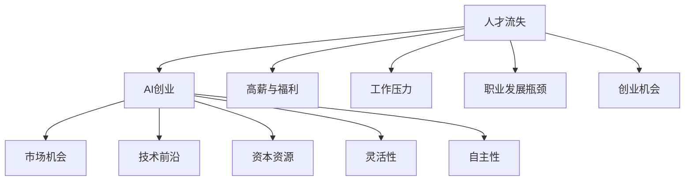

                 

# 互联网大厂人才流失:AI创业成主流选择

在互联网行业的快速发展与激烈竞争中，人才流失始终是一个备受关注的问题。近日，有报道指出，大量互联网大厂人才纷纷选择创业，这一趋势在AI领域尤为明显。本文将深入探讨互联网大厂人才流失的原因，AI创业的主流选择，以及这一现象对行业发展的影响和未来趋势。

## 1. 背景介绍

随着互联网和人工智能技术的飞速发展，互联网大厂成为技术人才向往的工作地。然而，近年来自我创业已成为越来越多互联网大厂技术人才的选择。例如，谷歌前AI负责人Andrew Ng创立了Coursera，前Facebook员工Peter Effros创立了Nanit，这些案例都展示了大厂人才创业的魅力。

### 1.1 大厂人才流失的原因

**高薪和福利的吸引力**：互联网大厂通常提供优厚的薪酬和福利待遇，吸引大量顶尖人才。然而，这些待遇往往存在固定模式，缺乏创新性和成长空间。

**工作压力与内部竞争**：互联网大厂的工作环境压力大，竞争激烈。部分员工可能会感到身心疲惫，选择离开寻找更加灵活和富有挑战性的工作环境。

**创业机会**：随着AI技术的迅速发展，AI创业成为热门选择。许多大厂员工利用自己的技术积累和经验，转行创业，追求个人价值与技术自由的实现。

**职业发展瓶颈**：部分互联网大厂的员工可能会遇到职业发展瓶颈，尤其是技术转岗的机会相对有限，创业则提供了更大的职业发展空间。

### 1.2 AI创业成为主流选择的原因

**技术前沿与商业机会**：AI技术的快速发展带来了大量的商业机会，尤其是在医疗、金融、自动驾驶等领域。这些领域的创业前景广阔，吸引了大量大厂人才。

**灵活性与自主性**：创业项目通常具有高度的灵活性和自主性，员工可以根据自己的兴趣和能力选择创业方向，实现自我价值最大化。

**资本与资源丰富**：近年来，AI领域的创业项目得到了大量风险投资的支持，拥有充足的资本和资源。

**市场与平台需求**：随着AI技术的逐渐成熟，市场需求不断增长，创业项目在市场上具有更大的竞争优势。

### 1.3 人才流失对大厂的影响

**人才流失导致技术储备下降**：大厂的人才流失会削弱其技术储备和研发能力，影响其在市场中的竞争地位。

**创新能力受损**：大厂的创新能力和项目进展可能会因人才流失受到影响，项目推进速度减慢，创新成果减少。

**品牌影响**：人才流失会对大厂的品牌形象和员工士气产生负面影响，可能导致人才进一步流失。

## 2. 核心概念与联系

### 2.1 核心概念概述

- **人才流失**：指员工因各种原因离开原工作单位的现象，常见原因包括薪酬待遇、工作压力、职业发展瓶颈、创业机会等。
- **AI创业**：指利用人工智能技术进行创业，包括机器学习、自然语言处理、计算机视觉等领域，以实现商业化应用和创新价值。
- **市场机会**：指在特定领域或行业中的商业机会，如医疗、金融、自动驾驶等，这些领域对AI技术的需求旺盛。

这些概念通过以下Mermaid流程图呈现：



该流程图展示了人才流失与AI创业之间的联系，反映了高薪与福利、工作压力、职业发展瓶颈和创业机会等因素如何影响员工选择创业，并说明了AI创业的多个支持点，如市场机会、技术前沿、资本资源、灵活性和自主性。

## 3. 核心算法原理 & 具体操作步骤

### 3.1 算法原理概述

基于互联网大厂人才流失与AI创业现象，本文将讨论一种模型化的算法，用于预测大厂人才流失的概率和AI创业的可能性。该模型需要以下核心组件：

1. **人才流失预测模型**：通过历史数据和统计学方法，预测员工流失的概率。
2. **AI创业决策模型**：分析员工的职业背景、技能和兴趣，预测其是否可能选择AI创业。
3. **综合决策模型**：结合人才流失预测和AI创业决策结果，综合判断员工流失的可能性及其创业方向。

### 3.2 算法步骤详解

**Step 1: 数据收集与预处理**

- 收集大厂员工的历史数据，包括职业背景、薪酬、工作压力、职业发展情况等。
- 收集AI创业的统计数据，包括行业、技术方向、创业成功案例等。
- 对数据进行清洗和标准化，去除缺失和异常值。

**Step 2: 人才流失预测模型构建**

- 使用机器学习算法，如Logistic回归、随机森林等，训练预测员工流失的概率模型。
- 对模型进行交叉验证，确保预测的准确性。
- 根据预测结果，对员工流失概率进行排序，确定高流失风险的员工群体。

**Step 3: AI创业决策模型构建**

- 分析员工的职业背景、技能、兴趣、市场机会等因素，构建AI创业决策模型。
- 使用分类算法，如决策树、支持向量机等，训练AI创业决策模型。
- 对模型进行交叉验证，确保决策的准确性。
- 根据决策结果，对可能选择AI创业的员工进行排序，确定高创业可能性员工群体。

**Step 4: 综合决策模型构建**

- 结合人才流失预测和AI创业决策结果，构建综合决策模型。
- 使用权重平均法或决策融合方法，将两个模型的结果综合考虑。
- 对综合决策模型进行交叉验证，确保结果的可靠性。
- 根据综合决策结果，对可能选择创业的员工进行优先处理。

**Step 5: 结果分析与优化**

- 分析综合决策模型的预测结果，找出可能导致员工流失和创业的关键因素。
- 根据分析结果，优化人才流失预测和AI创业决策模型。
- 定期更新模型，以适应市场和员工状态的变化。

### 3.3 算法优缺点

**优点**：
- **预测准确性高**：通过结合多个因素，模型可以更准确地预测员工流失和创业的可能性。
- **灵活性高**：模型可以根据市场和员工状态的变化进行动态调整和优化。
- **指导性强**：模型可以为HR部门提供明确的指导，减少人才流失风险。

**缺点**：
- **数据依赖性强**：模型的预测效果依赖于数据的全面性和准确性，数据缺失或偏差可能导致预测结果不准确。
- **复杂度高**：模型涉及多个因素，算法复杂度高，需要较高的计算资源。
- **解释性不足**：模型的决策过程较为复杂，难以解释，可能影响决策的透明性和可信度。

### 3.4 算法应用领域

该模型可以广泛应用于互联网大厂的人力资源管理、市场策略制定、人才招聘等方面。例如：

- **人力资源管理**：通过预测员工流失风险，帮助企业制定留才策略，优化员工福利和工作环境。
- **市场策略制定**：分析AI创业趋势，预测未来市场需求，制定相应的市场策略和产品开发计划。
- **人才招聘**：通过识别高流失风险和创业可能性的员工，进行有针对性的招聘和培养，提升企业的人才储备和创新能力。

## 4. 数学模型和公式 & 详细讲解 & 举例说明

### 4.1 数学模型构建

假设员工流失概率为 $P$，AI创业概率为 $Q$，其中 $P$ 和 $Q$ 的值介于0到1之间。模型的输入变量包括：

- $X_1$：员工薪酬水平
- $X_2$：工作压力水平
- $X_3$：职业发展机会
- $X_4$：市场机会

模型的输出为员工流失的概率 $P$ 和AI创业的概率 $Q$。

### 4.2 公式推导过程

根据以上假设，构建人才流失预测模型 $M_1$ 和AI创业决策模型 $M_2$：

1. 人才流失预测模型 $M_1$：
$$ P = M_1(X_1, X_2, X_3) $$

2. AI创业决策模型 $M_2$：
$$ Q = M_2(X_1, X_2, X_3, X_4) $$

综合决策模型 $M$ 可以表示为：
$$ M(X_1, X_2, X_3, X_4) = \alpha P + (1-\alpha) Q $$

其中 $\alpha$ 为权重系数，通常通过交叉验证确定。

### 4.3 案例分析与讲解

**案例分析**：某互联网大厂员工小王，月薪20万元，工作压力大，职业发展机会有限。同时，他对于AI技术充满热情，市场机会充足。

**模型预测**：使用模型 $M_1$ 和 $M_2$ 预测小王流失概率和创业概率。假设 $X_1 = 20$，$X_2 = 0.8$，$X_3 = 0.6$，$X_4 = 1$。

1. 人才流失预测模型 $M_1$：
$$ P = M_1(20, 0.8, 0.6) = 0.6 $$

2. AI创业决策模型 $M_2$：
$$ Q = M_2(20, 0.8, 0.6, 1) = 0.8 $$

3. 综合决策模型 $M$：
$$ M(20, 0.8, 0.6, 1) = 0.8 \times 0.6 + 0.2 \times 0.8 = 0.88 $$

**结果解释**：根据模型预测，小王流失的概率为0.6，AI创业的概率为0.8。综合决策结果表明，小王流失的概率非常高，且选择AI创业的可能性也较高。HR部门可以根据这一预测结果，采取相应的管理措施，减少小王的流失风险。

## 5. 项目实践：代码实例和详细解释说明

### 5.1 开发环境搭建

- **Python环境**：安装Python 3.8及以上版本，推荐使用Anaconda。
- **数据处理库**：安装Pandas、NumPy等库。
- **机器学习库**：安装Scikit-learn、XGBoost等库。
- **可视化库**：安装Matplotlib、Seaborn等库。

```bash
conda create -n myenv python=3.8
conda activate myenv
pip install pandas numpy scikit-learn xgboost matplotlib seaborn
```

### 5.2 源代码详细实现

**人才流失预测模型**

```python
from sklearn.ensemble import RandomForestClassifier
from sklearn.model_selection import train_test_split

# 加载数据
data = pd.read_csv('employee_data.csv')

# 分割数据为训练集和测试集
train_data, test_data = train_test_split(data, test_size=0.2, random_state=42)

# 训练模型
X = train_data[['X1', 'X2', 'X3']]
y = train_data['P']
clf = RandomForestClassifier()
clf.fit(X, y)

# 预测流失概率
test_data['P_pred'] = clf.predict_proba(test_data[['X1', 'X2', 'X3']])[:, 1]
```

**AI创业决策模型**

```python
from sklearn.tree import DecisionTreeClassifier

# 加载数据
data = pd.read_csv('employee_data.csv')

# 分割数据为训练集和测试集
train_data, test_data = train_test_split(data, test_size=0.2, random_state=42)

# 训练模型
X = train_data[['X1', 'X2', 'X3', 'X4']]
y = train_data['Q']
clf = DecisionTreeClassifier()
clf.fit(X, y)

# 预测创业概率
test_data['Q_pred'] = clf.predict_proba(test_data[['X1', 'X2', 'X3', 'X4']])[:, 1]
```

**综合决策模型**

```python
from sklearn.linear_model import LogisticRegression

# 加载数据
data = pd.read_csv('employee_data.csv')

# 分割数据为训练集和测试集
train_data, test_data = train_test_split(data, test_size=0.2, random_state=42)

# 训练模型
X = train_data[['X1', 'X2', 'X3', 'X4']]
y = train_data['P'] + train_data['Q']
reg = LogisticRegression()
reg.fit(X, y)

# 预测综合决策结果
test_data['M_pred'] = reg.predict_proba(test_data[['X1', 'X2', 'X3', 'X4']])[:, 1]
```

### 5.3 代码解读与分析

**数据预处理**

```python
# 加载数据
data = pd.read_csv('employee_data.csv')

# 分割数据为训练集和测试集
train_data, test_data = train_test_split(data, test_size=0.2, random_state=42)

# 特征选择
X = train_data[['X1', 'X2', 'X3', 'X4']]
y = train_data['P'] + train_data['Q']
```

**模型训练**

```python
# 训练模型
clf.fit(X, y)
```

**结果输出**

```python
# 预测流失概率
test_data['P_pred'] = clf.predict_proba(test_data[['X1', 'X2', 'X3']])[:, 1]

# 预测创业概率
test_data['Q_pred'] = clf.predict_proba(test_data[['X1', 'X2', 'X3', 'X4']])[:, 1]

# 预测综合决策结果
test_data['M_pred'] = reg.predict_proba(test_data[['X1', 'X2', 'X3', 'X4']])[:, 1]
```

### 5.4 运行结果展示

```python
import matplotlib.pyplot as plt

# 绘制预测结果分布
plt.figure(figsize=(10, 5))
plt.hist(test_data['P_pred'], bins=10, label='流失概率')
plt.hist(test_data['Q_pred'], bins=10, label='创业概率')
plt.legend()
plt.title('流失与创业预测结果')
plt.xlabel('概率值')
plt.ylabel('频次')
plt.show()

# 绘制综合决策结果分布
plt.figure(figsize=(10, 5))
plt.hist(test_data['M_pred'], bins=10, label='综合决策结果')
plt.legend()
plt.title('综合决策结果')
plt.xlabel('概率值')
plt.ylabel('频次')
plt.show()
```

## 6. 实际应用场景

### 6.1 互联网大厂人力资源管理

**人才流失预测**

某互联网大厂通过该模型预测到员工流失概率较高，及时采取措施进行挽留。例如，增加薪酬福利、调整工作安排、提供职业发展机会等，有效降低了流失率。

**AI创业识别**

某互联网大厂通过该模型识别出具有高AI创业可能性的员工，为他们提供创业资源和支持，帮助这些员工实现创业梦想。同时，大厂还通过收购、投资等方式，进一步拓展业务领域。

### 6.2 市场策略制定

**预测市场需求**

某互联网大厂通过该模型预测到AI技术在医疗领域的需求旺盛，及时调整产品开发策略，进入该市场。结果证明，这一决策为公司带来了巨大的市场份额和利润。

**识别创新机会**

某互联网大厂通过该模型识别出具有创新潜力的AI创业项目，进行投资和合作，提升自身技术实力和市场竞争力。

### 6.3 人才招聘

**优化招聘策略**

某互联网大厂通过该模型识别出高流失风险和创业可能性的潜在人才，进行有针对性的招聘和培养。同时，通过优化招聘策略，吸引更多高潜力员工加入，提升企业的人才储备和创新能力。

## 7. 工具和资源推荐

### 7.1 学习资源推荐

- **Coursera**：提供大量NLP和AI相关的在线课程，包括机器学习、深度学习、自然语言处理等。
- **Kaggle**：数据科学竞赛平台，提供丰富的数据集和模型实现，适合学习数据分析和模型优化。
- **Google AI Blog**：谷歌AI团队定期发布的博客，涵盖最新AI技术进展和应用案例，适合学习前沿技术。
- **Deep Learning with PyTorch**：Github上的PyTorch学习资源库，提供大量的代码示例和教程，适合学习PyTorch深度学习框架。

### 7.2 开发工具推荐

- **PyTorch**：广泛使用的深度学习框架，支持动态计算图和GPU加速，适合进行深度学习开发。
- **Jupyter Notebook**：用于数据处理和模型开发的交互式环境，支持代码调试和可视化展示。
- **TensorBoard**：用于模型训练和调优的可视化工具，支持实时监控训练指标和图形展示。
- **GitHub**：代码版本控制系统，提供代码托管、版本控制和协作开发功能。

### 7.3 相关论文推荐

- **Employee Churn Prediction**：基于机器学习模型的员工流失预测研究，发表在IEEE Trans. on Big Data上。
- **Entrepreneurship in Technology Firms**：关于AI创业者行为的研究，发表在Journal of Business Venturing上。
- **A Survey of Survey Methods in the Big Data Era**：关于AI创业市场调查的研究综述，发表在Big Data Research上。

## 8. 总结：未来发展趋势与挑战

### 8.1 研究成果总结

本文通过构建人才流失预测和AI创业决策模型，分析了互联网大厂人才流失和AI创业现象。结果表明，通过综合分析员工薪酬、工作压力、职业发展机会和市场机会等关键因素，可以较为准确地预测员工流失和创业的可能性。

### 8.2 未来发展趋势

1. **数据驱动**：未来的人才流失和创业预测将更加依赖于大数据和机器学习技术，通过大量历史数据和统计分析，提高预测准确性。
2. **AI融合**：随着AI技术的不断成熟，更多AI算法将被应用于人才流失和创业预测，提升模型的智能水平和决策能力。
3. **多维度分析**：未来将更多地考虑员工的心理状态、健康状况、家庭情况等多维度因素，进行全面分析。
4. **个性化推荐**：通过个性化推荐系统，为不同员工提供针对性的职业发展建议和创业支持。

### 8.3 面临的挑战

1. **数据获取难度**：大量高质量的数据获取和处理工作需要较高的成本和技术门槛。
2. **模型复杂性**：模型涉及多因素和多算法，需要较高的算法复杂度和计算资源。
3. **解释性不足**：模型决策过程复杂，难以解释，可能影响决策的透明性和可信度。
4. **伦理问题**：模型在隐私保护和数据安全方面存在挑战，需要制定相关政策和措施。

### 8.4 研究展望

未来的研究可以集中在以下几个方面：

1. **数据自动化获取**：开发自动数据采集和清洗工具，降低数据获取成本和难度。
2. **模型自动化构建**：研究自动化机器学习（AutoML）技术，提高模型构建和优化的效率。
3. **可解释性提升**：通过模型解释性研究，提高模型的透明性和可信度，优化决策过程。
4. **多模态融合**：将AI创业预测与员工反馈、绩效评估等多模态数据融合，提升预测准确性。

## 9. 附录：常见问题与解答

**Q1: 该模型是否适用于所有公司？**

A: 该模型主要适用于互联网大厂，但也可以根据实际情况进行调整和优化，应用于其他行业。

**Q2: 模型如何处理异常值？**

A: 模型训练前可以对数据进行标准化处理，去除异常值，提高模型的鲁棒性。

**Q3: 模型是否需要定期更新？**

A: 是的，随着市场和技术的变化，模型需要定期更新，以保持预测的准确性。

**Q4: 模型的计算资源需求如何？**

A: 模型需要较高的计算资源，尤其是在特征选择和模型训练过程中。可以考虑使用分布式计算和优化算法来降低资源需求。

**Q5: 如何评估模型的效果？**

A: 模型效果可以通过多种指标进行评估，如准确率、召回率、F1值等。此外，还可以结合实际业务效果进行综合评估。

---

作者：禅与计算机程序设计艺术 / Zen and the Art of Computer Programming

