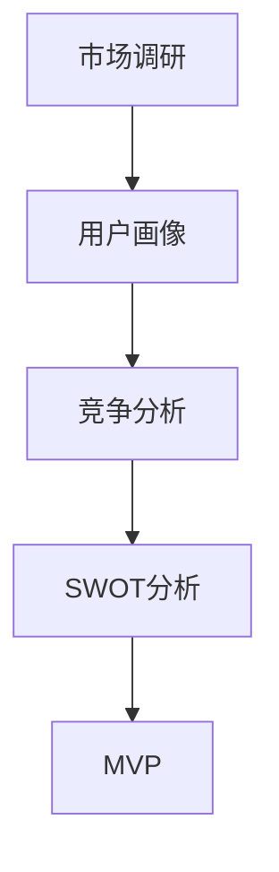

                 

# 产品开发的市场需求分析

> 关键词：市场调研,需求分析,用户画像,竞争分析,SWOT分析

## 1. 背景介绍

### 1.1 问题由来

随着互联网和科技的快速发展，产品开发已经成为一个日益重要的话题。无论是创业公司还是大公司，都在不断推出新产品，试图在激烈的市场竞争中脱颖而出。然而，成功的产品开发不仅仅是技术创新和市场推广，更需要深入的市场需求分析和产品设计。本文将从市场需求分析的角度，探讨如何通过科学的方法和技术，准确把握市场脉搏，制定有效的产品策略，实现商业成功。

### 1.2 问题核心关键点

市场需求分析是产品开发过程中至关重要的一环，它直接影响到产品的定位、功能和用户群体。市场调研、用户需求挖掘、竞争对手分析等都是核心关键点。准确的需求分析可以帮助企业制定合理的商业计划，提升产品市场竞争力。

## 2. 核心概念与联系

### 2.1 核心概念概述

为更好地理解产品开发的市场需求分析，本节将介绍几个关键概念：

- 市场调研(Market Research)：通过收集、整理、分析市场数据和信息，了解目标市场的需求和趋势，为产品开发提供数据支持。
- 用户画像(User Persona)：基于目标用户的特征、行为、需求等信息，构建虚拟用户模型，指导产品设计。
- 竞争分析(Competitive Analysis)：通过研究竞争对手的产品、策略、市场表现，找到自身产品的差异化优势。
- SWOT分析(Strengths, Weaknesses, Opportunities, Threats Analysis)：全面评估企业的优势、劣势、机会和威胁，制定合适的市场策略。
- MVP (Minimum Viable Product)：最小可行产品，指在满足基本用户需求的情况下，尽可能简单的产品原型，用于验证市场和用户需求。

这些核心概念之间的逻辑关系可以通过以下Mermaid流程图来展示：



这个流程图展示了一系列的市场需求分析步骤，包括：

1. 市场调研：了解市场总体趋势和数据。
2. 用户画像：基于用户特征和行为构建虚拟用户模型。
3. 竞争分析：研究竞争对手的优势和劣势。
4. SWOT分析：全面评估企业的内部和外部环境。
5. MVP：通过简单的原型验证市场和用户需求。

## 3. 核心算法原理 & 具体操作步骤

### 3.1 算法原理概述

市场需求分析的本质是通过一系列的数据分析方法和工具，理解目标市场的特点、用户需求、竞争对手状况等，从而制定出有效的产品策略。这包括但不限于以下步骤：

1. **数据收集**：通过问卷调查、用户访谈、社交媒体分析等多种方式，获取目标市场的用户数据和反馈。
2. **数据整理**：对收集到的数据进行分类、清洗和处理，确保数据的准确性和完整性。
3. **数据分析**：运用统计分析、机器学习等方法，分析用户行为、市场趋势等关键数据。
4. **需求建模**：构建用户画像和需求模型，找出用户的关键需求和痛点。
5. **竞争对比**：评估竞争对手的产品和服务，找到自身产品的差异化优势。
6. **SWOT分析**：综合考虑企业的内部和外部环境，制定合理的市场策略。

### 3.2 算法步骤详解

以下是市场调研和用户需求分析的详细步骤：

#### 步骤1：数据收集

**问卷调查**：设计符合目标用户特征的问卷，通过线上线下渠道收集用户反馈。问卷应包括基本信息、使用习惯、需求偏好等内容。

**用户访谈**：与目标用户进行面对面或电话访谈，深入了解其需求和痛点，收集更细致的信息。

**社交媒体分析**：利用社交媒体数据分析工具，如Twitter sentiment analysis、Facebook insights等，获取用户的在线行为和反馈。

**市场报告**：购买或下载市场研究报告，了解行业趋势和市场规模。

**竞争产品分析**：购买或下载竞争对手的产品评测、用户反馈等数据，了解竞争对手的产品优劣。

#### 步骤2：数据整理

**数据清洗**：去除重复、无关、异常数据，确保数据质量。

**数据编码**：对收集到的数据进行编码和分类，便于后续分析。

**数据可视化**：使用Tableau、Power BI等工具，将数据转化为直观的图表，帮助理解数据特点。

#### 步骤3：数据分析

**统计分析**：使用SPSS、R等统计软件，对数据进行描述性统计、回归分析、假设检验等。

**机器学习**：利用Python、Scikit-learn等工具，进行分类、聚类、关联规则分析等。

**数据可视化**：进一步使用数据可视化工具，展示分析结果，如饼图、柱状图、热力图等。

#### 步骤4：需求建模

**用户画像**：根据分析结果，构建虚拟用户模型，包括用户基本信息、行为特征、需求偏好等。

**需求模型**：使用K-means聚类、层次聚类等方法，将用户需求进行分类和建模。

**需求优先级**：根据用户反馈和数据分析结果，确定不同需求的优先级。

#### 步骤5：竞争对比

**竞争产品功能对比**：列出竞争对手的产品功能，与自身产品进行对比，找出差异和优势。

**用户评价对比**：收集用户对竞争对手产品的评价，了解用户对不同产品的满意度。

**市场份额对比**：分析竞争对手的市场份额和市场表现，了解市场竞争格局。

**创新点对比**：找出竞争对手产品的创新点和不足，寻找自身产品的差异化优势。

#### 步骤6：SWOT分析

**优势分析**：列出企业内部的优势，如技术优势、品牌优势等。

**劣势分析**：找出企业内部的劣势，如技术短板、市场局限等。

**机会分析**：根据市场趋势和用户需求，找出市场机会，如新兴市场、技术趋势等。

**威胁分析**：识别市场威胁，如竞争对手、市场波动等。

#### 步骤7：MVP开发

**产品原型设计**：根据需求模型和用户画像，设计简单的产品原型，涵盖核心功能。

**用户测试**：选择目标用户进行测试，收集反馈，验证产品原型。

**迭代优化**：根据测试结果和用户反馈，对产品进行迭代优化，直至满足用户需求。

### 3.3 算法优缺点

市场需求分析的优点在于：

- **系统全面**：通过系统的方法和工具，获取全面的市场和用户数据。
- **科学客观**：采用统计分析和机器学习等科学方法，确保分析结果的客观性和可靠性。
- **实践性强**：结合MVP开发，验证市场需求，确保产品策略的可行性。

然而，市场需求分析也存在一些缺点：

- **数据收集成本高**：大规模的数据收集和整理需要较高的时间和资金投入。
- **分析复杂**：数据分析涉及多种统计和机器学习方法，需要专业知识和技能。
- **市场变化快**：市场环境和用户需求变化较快，分析结果可能过时。

### 3.4 算法应用领域

市场需求分析广泛应用于各种产品开发领域，包括但不限于：

- 消费品：如电子产品、服装、食品等。
- 服务行业：如互联网服务、金融服务、医疗服务等。
- 工业制造：如汽车制造、机械制造等。
- 教育行业：如在线教育、培训机构等。
- 农业领域：如农机设备、农产品等。

市场需求分析在产品开发过程中扮演着重要角色，通过科学的方法和技术，企业可以更加准确地把握市场需求，提升产品竞争力，实现商业成功。

## 4. 数学模型和公式 & 详细讲解 & 举例说明

### 4.1 数学模型构建

在市场需求分析中，常用的数学模型包括：

- **回归分析**：用于分析变量之间的关系，找出影响产品需求的关键因素。
- **聚类分析**：将用户需求进行分类，识别不同用户群体的需求特点。
- **时间序列分析**：用于预测市场需求的变化趋势，识别季节性、周期性变化。

### 4.2 公式推导过程

以回归分析为例，回归模型的一般形式为：

$$ y = \beta_0 + \beta_1 x_1 + \beta_2 x_2 + ... + \beta_n x_n + \epsilon $$

其中 $y$ 为目标变量，$x_i$ 为自变量，$\beta_i$ 为回归系数，$\epsilon$ 为误差项。

回归模型可以通过最小二乘法进行求解，目标是最小化误差平方和：

$$ \sum_{i=1}^n (y_i - \hat{y}_i)^2 $$

其中 $\hat{y}_i = \beta_0 + \beta_1 x_{i1} + \beta_2 x_{i2} + ... + \beta_n x_{in}$。

### 4.3 案例分析与讲解

**案例1：消费品市场需求分析**

假设某消费品公司的目标是预测未来一年的市场需求量。通过收集过去几年的销售数据、市场价格、广告支出等数据，建立线性回归模型：

$$ Sales = \beta_0 + \beta_1 Price + \beta_2 Marketing + \epsilon $$

其中 $Sales$ 为销售额，$Price$ 为产品价格，$Marketing$ 为广告支出。

通过最小二乘法求解回归系数，得到最佳拟合方程。根据拟合方程，可以预测未来一年的销售额，帮助公司制定合理的生产计划和市场策略。

**案例2：服务行业市场需求分析**

某在线教育平台希望了解用户对不同课程的需求，通过问卷调查和用户访谈收集数据，建立聚类分析模型：

$$ User_{i} = Cluster_{j} $$

其中 $User_{i}$ 为用户 $i$ 的虚拟用户画像，$Cluster_{j}$ 为聚类分析结果。

通过聚类分析，识别出不同用户群体的需求特点，如学生群体更关注课程内容和质量，而职业人士更关注课程的实用性和应用性。根据不同用户群体的需求，设计不同的课程内容和服务，提升用户满意度和平台竞争力。

## 5. 项目实践：代码实例和详细解释说明

### 5.1 开发环境搭建

市场需求分析的项目开发需要以下工具和环境：

1. **Python**：作为市场需求分析的主要开发语言。
2. **Jupyter Notebook**：用于编写和执行Python代码，方便数据可视化和报告编写。
3. **Pandas**：用于数据处理和分析。
4. **NumPy**：用于数学计算和矩阵操作。
5. **Matplotlib**：用于数据可视化。
6. **Scikit-learn**：用于机器学习和统计分析。

以下是Python开发环境搭建的详细步骤：

**步骤1：安装Python**

- 下载并安装Python，推荐使用Anaconda，方便管理和安装第三方库。

**步骤2：安装Jupyter Notebook**

- 通过Anaconda安装Jupyter Notebook，命令为：
```
conda install jupyter notebook
```

**步骤3：安装数据处理库**

- 使用pip安装Pandas和NumPy，命令为：
```
pip install pandas numpy
```

**步骤4：安装机器学习库**

- 使用pip安装Scikit-learn，命令为：
```
pip install scikit-learn
```

### 5.2 源代码详细实现

以下是一个简单的市场需求分析项目的代码实现，包括数据收集、整理和分析：

```python
import pandas as pd
import numpy as np
from sklearn.linear_model import LinearRegression
from sklearn.cluster import KMeans
from sklearn.metrics import silhouette_score

# 数据收集
# 假设已经收集到数据文件，使用pandas读取数据
data = pd.read_csv('data.csv')

# 数据清洗
# 去除重复和无关数据
data = data.drop_duplicates()
data = data.dropna()

# 数据编码
# 将分类数据转换为数值数据
data['Gender'] = pd.Categorical(data['Gender']).codes

# 数据可视化
# 使用Matplotlib绘制直方图
import matplotlib.pyplot as plt
plt.hist(data['Age'], bins=30)
plt.show()

# 回归分析
# 使用scikit-learn的LinearRegression进行线性回归
X = data[['Age', 'Income']]
y = data['Sales']
model = LinearRegression()
model.fit(X, y)

# 聚类分析
# 使用scikit-learn的KMeans进行聚类
X = data[['Age', 'Income']]
kmeans = KMeans(n_clusters=3, random_state=0)
kmeans.fit(X)
labels = kmeans.labels_

# 评估聚类效果
# 使用silhouette_score评估聚类效果
score = silhouette_score(X, labels)
print('Silhouette Score:', score)
```

### 5.3 代码解读与分析

**数据收集**

- 数据来源可以是问卷调查、用户访谈、社交媒体分析等多种渠道。

**数据清洗**

- 数据清洗是数据处理的第一步，需要去除重复、无关、异常数据，确保数据质量。

**数据编码**

- 将分类数据转换为数值数据，方便机器学习模型处理。

**数据可视化**

- 使用Matplotlib等工具，将数据转化为直观的图表，帮助理解数据特点。

**回归分析**

- 使用scikit-learn的LinearRegression模型进行线性回归，找出影响产品需求的关键因素。

**聚类分析**

- 使用scikit-learn的KMeans模型进行聚类，识别不同用户群体的需求特点。

**聚类效果评估**

- 使用silhouette_score评估聚类效果，确保聚类模型的有效性。

### 5.4 运行结果展示

以下是回归分析和聚类分析的运行结果展示：

**回归分析结果**

- 输出回归系数和拟合方程
```
print(model.coef_)
print(model.intercept_)
print(model.predict(X))
```

**聚类分析结果**

- 输出聚类标签和聚类中心
```
print(kmeans.labels_)
print(kmeans.cluster_centers_)
```

## 6. 实际应用场景

市场需求分析广泛应用于各种产品开发领域，以下是几个典型应用场景：

### 6.1 消费品

某消费品公司希望推出新产品，通过市场调研和用户需求分析，了解用户对新产品的期望和需求。例如，某饮料公司推出一款新口味的饮料，通过调研和分析，发现消费者最关注产品的口感和包装，从而优化产品的设计和包装，提升市场竞争力。

### 6.2 服务行业

某在线教育平台希望推出新课程，通过市场需求分析，识别出不同用户群体的需求特点，设计不同的课程内容和服务。例如，某在线编程课程平台推出Python编程课程，通过调研和分析，发现大学生和在职人士对课程内容和实践项目的需求不同，从而设计不同的课程模块，满足不同用户的需求。

### 6.3 工业制造

某汽车制造公司希望推出新的车型，通过市场需求分析，了解消费者对新车型的需求和期望。例如，某汽车公司推出一款新电动汽车，通过调研和分析，发现消费者最关注电池续航、充电便利性和安全性能，从而优化新电动汽车的设计和功能，提升市场竞争力。

### 6.4 教育行业

某培训机构希望推出新的课程，通过市场需求分析，识别出不同用户群体的需求特点，设计不同的课程内容和服务。例如，某在线培训机构推出新一轮的英语课程，通过调研和分析，发现不同年龄段的学员对课程内容和教学方式的需求不同，从而设计不同的课程模块，满足不同用户的需求。

## 7. 工具和资源推荐

### 7.1 学习资源推荐

为了帮助开发者系统掌握市场需求分析的理论基础和实践技巧，这里推荐一些优质的学习资源：

1. 《市场调研与数据分析》系列书籍：系统介绍市场调研的基本方法、工具和应用案例。
2. 《数据挖掘与统计分析》课程：深度学习相关的统计分析课程，涵盖回归分析、聚类分析等内容。
3. Kaggle：全球最大的数据科学竞赛平台，提供丰富的市场调研和数据分析竞赛，提升实战能力。
4. Google Analytics：谷歌提供的免费数据分析工具，可用于网站流量分析和用户行为研究。
5. Tableau：全球领先的数据可视化工具，用于数据可视化和报表生成。

通过这些资源的学习实践，相信你一定能够快速掌握市场需求分析的精髓，并用于解决实际的商业问题。

### 7.2 开发工具推荐

高效的开发离不开优秀的工具支持。以下是几款用于市场需求分析开发的常用工具：

1. Jupyter Notebook：用于编写和执行Python代码，方便数据可视化和报告编写。
2. Python：作为市场需求分析的主要开发语言，功能强大且生态丰富。
3. Pandas：用于数据处理和分析，高效便捷。
4. NumPy：用于数学计算和矩阵操作，是数据科学的基石。
5. Scikit-learn：用于机器学习和统计分析，功能强大且易用。
6. Matplotlib：用于数据可视化，功能强大且可定制。

合理利用这些工具，可以显著提升市场需求分析的开发效率，加快创新迭代的步伐。

### 7.3 相关论文推荐

市场需求分析的研究源于学界的持续研究。以下是几篇奠基性的相关论文，推荐阅读：

1. "Market Research: Methods, Data, and Tools" by J. N. Elkin：系统介绍市场调研的基本方法、工具和应用案例。
2. "Data Mining and Statistical Learning" by T. Hastie et al.：介绍统计分析和机器学习的基本概念和方法。
3. "K-means Clustering" by A. Ng：介绍K-means聚类算法的基本原理和应用。
4. "Linear Regression Analysis" by S. Desai：介绍线性回归的基本概念和应用。
5. "Customer Segmentation and Targeting" by J. Wind et al.：介绍客户分群和市场细分的基本方法和工具。

这些论文代表市场需求分析的研究脉络，通过学习这些前沿成果，可以帮助研究者把握学科前进方向，激发更多的创新灵感。

## 8. 总结：未来发展趋势与挑战

### 8.1 研究成果总结

市场需求分析作为产品开发的重要环节，已经在各行各业得到了广泛应用。通过系统的方法和工具，企业可以更加准确地把握市场需求，提升产品竞争力，实现商业成功。

### 8.2 未来发展趋势

市场需求分析的未来趋势主要体现在以下几个方面：

1. **智能化分析**：结合人工智能和大数据技术，进行智能化需求分析，提升分析的准确性和效率。
2. **多模态分析**：结合语音、图像、社交媒体等多种数据，进行全面需求分析，提升分析的全面性和深度。
3. **实时分析**：结合实时数据流分析技术，进行实时需求分析，提升市场响应的速度和灵活性。
4. **预测分析**：结合时间序列分析和机器学习，进行市场趋势和需求预测，提升决策的准确性和前瞻性。
5. **用户生成内容分析**：结合用户生成内容（UGC）分析，进行用户需求和反馈分析，提升用户体验和满意度。

### 8.3 面临的挑战

市场需求分析虽然已经取得了一定的进展，但在实施过程中仍面临诸多挑战：

1. **数据质量和多样性**：数据质量和多样性直接影响分析结果的准确性和全面性。如何获取高质量、多样化的数据是关键。
2. **技术复杂性**：市场需求分析涉及多种技术和工具，如回归分析、聚类分析、机器学习等，技术复杂性较高。
3. **用户隐私保护**：市场需求分析需要大量用户数据，如何在保障用户隐私的前提下，进行数据收集和分析，是重要的挑战。
4. **市场需求变化快**：市场需求变化较快，如何动态调整分析模型，保持分析结果的及时性和准确性，是重要的挑战。
5. **跨领域整合**：市场需求分析涉及多个领域，如何进行跨领域整合，提升分析的全面性和深度，是重要的挑战。

### 8.4 研究展望

市场需求分析的研究方向主要包括以下几个方面：

1. **智能化分析技术**：结合人工智能和大数据技术，提升市场需求分析的智能化和自动化水平。
2. **多模态分析技术**：结合多模态数据，提升市场需求分析的全面性和深度。
3. **实时分析技术**：结合实时数据流分析技术，提升市场响应的速度和灵活性。
4. **预测分析技术**：结合时间序列分析和机器学习，提升市场趋势和需求预测的准确性和前瞻性。
5. **用户生成内容分析**：结合用户生成内容（UGC）分析，提升用户需求和反馈分析的全面性和深度。

## 9. 附录：常见问题与解答

**Q1：市场需求分析需要哪些数据？**

A: 市场需求分析需要收集多方面的数据，包括但不限于：
- 用户调查数据：通过问卷调查、用户访谈等方式获取用户反馈。
- 市场销售数据：通过销售记录、销售报告等方式获取市场销售情况。
- 竞争对手数据：通过竞争对手分析、市场报告等方式获取竞争对手的市场表现。
- 社交媒体数据：通过社交媒体分析工具获取用户在线行为和反馈。

**Q2：如何进行数据清洗？**

A: 数据清洗是数据分析的重要步骤，主要包括以下几个方面：
- 去除重复和无关数据：通过数据去重和数据筛选，去除重复和无关数据。
- 处理缺失数据：使用均值、中位数、插值等方法处理缺失数据。
- 数据规范化：将数据转换为标准格式和范围，方便后续分析。

**Q3：如何选择聚类算法？**

A: 聚类算法的选择需要根据数据特点和分析目的进行。常用的聚类算法包括K-means、层次聚类、DBSCAN等。K-means适用于大规模数据集，层次聚类适用于数据分层明显的情况，DBSCAN适用于发现任意形状的聚类。

**Q4：如何进行回归分析？**

A: 回归分析是市场需求分析的重要手段，主要包括以下几个步骤：
- 数据预处理：将数据转换为数值型数据，处理缺失和异常数据。
- 建立回归模型：选择合适的回归模型，如线性回归、多项式回归、岭回归等。
- 模型训练和评估：使用训练集进行模型训练，使用测试集进行模型评估和验证。
- 模型预测：使用训练好的模型进行市场预测，得出市场趋势和需求。

**Q5：如何进行用户画像？**

A: 用户画像的构建需要基于大量用户数据和市场分析，主要包括以下几个步骤：
- 数据收集：通过问卷调查、用户访谈等方式收集用户数据。
- 数据处理：清洗和处理数据，去除无关和异常数据。
- 数据分析：使用统计分析和机器学习等方法，识别用户的基本特征和行为特点。
- 画像构建：根据数据分析结果，构建虚拟用户模型，用于指导产品设计和市场策略。

**Q6：如何进行SWOT分析？**

A: SWOT分析是市场需求分析的重要工具，主要包括以下几个步骤：
- 优势分析：列出企业内部的优势，如技术优势、品牌优势等。
- 劣势分析：找出企业内部的劣势，如技术短板、市场局限等。
- 机会分析：根据市场趋势和用户需求，找出市场机会，如新兴市场、技术趋势等。
- 威胁分析：识别市场威胁，如竞争对手、市场波动等。
- 策略制定：根据SWOT分析结果，制定合适的市场策略，提升企业竞争力。

---

作者：禅与计算机程序设计艺术 / Zen and the Art of Computer Programming

