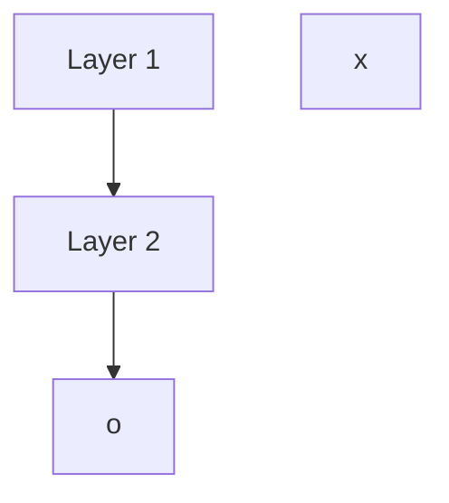

                 

# 人工智能(Artificial Intelligence) - 原理与代码实例讲解

> 关键词：人工智能(AI),深度学习,神经网络,机器学习,计算机视觉,自然语言处理(NLP),强化学习,生成对抗网络(GAN)

## 1. 背景介绍

### 1.1 问题由来
人工智能(AI)作为21世纪最具影响力的技术之一，正在深刻改变着社会的方方面面。从智能推荐、图像识别、语音识别到自然语言处理等，AI技术在各行各业中的应用日益广泛。然而，尽管AI技术在理论和应用上都取得了巨大进展，但其核心原理和实现机制仍然存在诸多困惑。

本文将从原理与实践两个层面，全面深入地探讨人工智能的核心技术。首先，我们将在第一章介绍AI的起源与重要里程碑事件，帮助读者理解AI的发展脉络。其次，我们将在第二章阐述AI的主要分支与核心概念，展示AI技术的广泛应用。最后，我们将在第三章通过代码实例讲解，深入解析深度学习、神经网络、自然语言处理等核心技术。通过系统的理论讲解与实例演示，相信读者能够全面理解AI的原理与实现，为未来的技术实践打下坚实的基础。

## 2. 核心概念与联系

### 2.1 核心概念概述

为了更好地理解人工智能的核心理论，我们先介绍几个关键的AI核心概念：

- **人工智能(AI)**：通过模拟人类智能行为，使机器具有学习、推理、感知、决策等能力。AI的目标是构建能够自主完成复杂任务的系统，而不仅仅是自动化执行单一任务。

- **机器学习(ML)**：通过数据驱动的方法，使机器能够从经验中学习和改进，而无需人工干预。机器学习是实现AI的核心技术之一。

- **深度学习(Deep Learning, DL)**：一种基于神经网络的机器学习方法，通过多层次的非线性变换，自动学习输入数据的复杂特征表示。深度学习是现代AI技术的重要组成部分。

- **自然语言处理(NLP)**：使计算机能够理解和处理人类语言的技术，包括语音识别、文本处理、机器翻译等。NLP是AI在语言领域的典型应用。

- **计算机视觉(CV)**：使计算机能够理解和处理图像、视频等视觉信息的技术，包括目标检测、图像识别、场景理解等。CV是AI在视觉领域的核心应用。

- **强化学习(RL)**：通过试错学习和奖励机制，使机器能够在动态环境中自主优化决策，以达成特定目标。强化学习是实现AI自主决策的关键技术。

- **生成对抗网络(GAN)**：通过两个相互竞争的神经网络，生成逼真的数据样本，广泛应用于图像生成、视频合成等。GAN是AI在生成领域的重要技术。

这些核心概念之间的逻辑关系可以通过以下Mermaid流程图来展示：

```mermaid
graph TB
    A[人工智能(AI)] --> B[机器学习(ML)]
    B --> C[深度学习(Deep Learning)]
    B --> D[自然语言处理(NLP)]
    B --> E[计算机视觉(CV)]
    B --> F[强化学习(RL)]
    B --> G[生成对抗网络(GAN)]
    A --> H[算法与数据]
    A --> I[应用领域]
    I --> J[医疗]
    I --> K[金融]
    I --> L[交通]
    I --> M[游戏]
```

这个流程图展示了大AI的核心概念及其之间的关系：

1. AI通过学习、推理、感知、决策等能力，实现自主完成任务。
2. ML是实现AI的核心理论基础，通过数据驱动的学习方法，使机器能够自我提升。
3. DL作为ML的子集，利用神经网络进行多层次特征学习。
4. NLP、CV、RL、GAN等技术，分别应用于语言、视觉、决策和生成等具体领域，实现AI的具体应用。
5. 数据和算法是AI发展的基础，而应用领域则是其目标导向。

## 3. 核心算法原理 & 具体操作步骤

### 3.1 算法原理概述

人工智能的核心算法包括机器学习、深度学习、强化学习、自然语言处理等。本文将重点介绍深度学习与神经网络，这是现代AI技术的核心所在。

深度学习是一种基于神经网络的机器学习方法，通过多层非线性变换，自动学习输入数据的复杂特征表示。其核心思想是通过训练大量的数据，让神经网络能够自主提取数据中的有用信息，并据此进行预测或生成。

深度学习的核心模型是神经网络(Neural Network)。神经网络由多个层次的神经元组成，通过前向传播和反向传播算法，不断调整网络参数，最小化损失函数，以实现对数据的精确拟合。神经网络通过调整权重和偏置，学习输入数据的复杂特征，并最终进行分类、回归或生成等任务。

### 3.2 算法步骤详解

深度学习算法的主要步骤如下：

1. **数据准备**：收集和处理训练数据，包括数据清洗、特征提取、数据划分等。

2. **模型设计**：选择和设计合适的神经网络模型，包括网络结构、激活函数、损失函数、优化器等。

3. **模型训练**：使用训练数据对模型进行前向传播和反向传播，不断调整网络参数，最小化损失函数。

4. **模型评估**：使用测试数据对模型进行评估，计算精度、召回率、F1分数等指标，衡量模型的性能。

5. **模型优化**：根据评估结果，调整模型结构、超参数或引入正则化技术，进一步提升模型性能。

6. **模型部署**：将优化后的模型应用到实际任务中，进行预测或生成，并持续监控和优化。

### 3.3 算法优缺点

深度学习与神经网络的优点包括：

1. **强大的特征学习能力**：通过多层非线性变换，自动学习数据的复杂特征表示。
2. **广泛的适用性**：适用于图像识别、语音识别、自然语言处理等各类任务。
3. **高效的泛化能力**：在足够数据和计算资源下，深度学习模型能够泛化到未见过的数据。

其缺点主要包括：

1. **需要大量数据**：深度学习需要大量标注数据进行训练，数据获取成本较高。
2. **高计算成本**：深度学习模型通常参数量大，训练和推理速度较慢，对计算资源要求高。
3. **难以解释**：深度学习模型通常被视为“黑盒”，难以解释其内部工作机制和决策逻辑。
4. **过拟合风险**：深度学习模型在数据量不足的情况下，容易过拟合，泛化能力受限。

### 3.4 算法应用领域

深度学习和神经网络技术已经在诸多领域得到广泛应用，以下是几个典型案例：

- **计算机视觉**：通过卷积神经网络(CNN)进行图像识别、物体检测、场景理解等。
- **自然语言处理**：通过循环神经网络(RNN)、长短时记忆网络(LSTM)、Transformer等进行文本分类、情感分析、机器翻译等。
- **语音识别**：通过递归神经网络(RNN)、卷积神经网络(CNN)等进行语音识别和语音合成。
- **游戏AI**：通过强化学习算法进行游戏决策和策略优化。
- **推荐系统**：通过深度学习模型进行用户行为分析和推荐内容生成。
- **医疗影像**：通过深度学习模型进行病灶检测、疾病分类等。
- **自动驾驶**：通过深度学习模型进行环境感知和路径规划。

这些应用展示了深度学习与神经网络技术的强大功能和广泛适用性，为各行各业带来了深刻的变革。

## 4. 数学模型和公式 & 详细讲解 & 举例说明

### 4.1 数学模型构建

深度学习模型的数学模型通常包括输入数据、网络结构、损失函数和优化算法等。以下以一个简单的神经网络为例，介绍其数学模型构建过程。

假设输入数据为 $x \in \mathbb{R}^n$，神经网络由两层全连接层构成，第一层有 $m$ 个神经元，第二层有 $k$ 个神经元，输出层为 $o \in \mathbb{R}^k$。网络结构如图1所示：



图1: 神经网络结构示意图

其中，$W_1 \in \mathbb{R}^{m \times n}$ 和 $W_2 \in \mathbb{R}^{k \times m}$ 为两个全连接层的权重矩阵，$b_1 \in \mathbb{R}^{m}$ 和 $b_2 \in \mathbb{R}^{k}$ 为偏置向量。

神经网络的前向传播过程为：

$$
h_1 = g_1(W_1x + b_1) \\
h_2 = g_2(W_2h_1 + b_2) \\
o = h_2
$$

其中 $g_1$ 和 $g_2$ 为激活函数，如ReLU、Sigmoid等。

### 4.2 公式推导过程

假设神经网络的目标为二分类任务，即输出 $o$ 表示样本属于正类的概率。使用二元交叉熵损失函数，损失函数为：

$$
\mathcal{L}(\theta) = -\frac{1}{N}\sum_{i=1}^N [y_i\log o_i + (1-y_i)\log(1-o_i)]
$$

其中 $y_i \in \{0,1\}$ 为真实标签，$o_i$ 为模型预测的输出。

使用梯度下降优化算法，损失函数对参数 $\theta$ 的梯度为：

$$
\nabla_{\theta}\mathcal{L}(\theta) = -\frac{1}{N}\sum_{i=1}^N [y_i(1-o_i) - (1-y_i)o_i] \nabla_{\theta}o_i
$$

其中 $\nabla_{\theta}o_i$ 为输出层的梯度，根据链式法则可进一步展开为：

$$
\nabla_{\theta}o_i = \frac{\partial o_i}{\partial h_2} \frac{\partial h_2}{\partial h_1} \frac{\partial h_1}{\partial x} \nabla_{\theta}x
$$

将上述公式代入梯度下降算法，可得：

$$
\theta \leftarrow \theta - \eta \nabla_{\theta}\mathcal{L}(\theta)
$$

其中 $\eta$ 为学习率，通过不断迭代，直至损失函数收敛。

### 4.3 案例分析与讲解

以手写数字识别为例，介绍深度学习模型的实际应用。使用MNIST数据集，其中包含60000张28x28的灰度图像，每张图像对应一个0到9之间的数字标签。

**数据预处理**：将原始图像进行归一化，转化为张量形式。

**模型构建**：设计一个简单的卷积神经网络(CNN)，包括卷积层、池化层和全连接层。

**模型训练**：使用训练集对模型进行前向传播和反向传播，不断调整权重和偏置。

**模型评估**：使用测试集对模型进行评估，计算准确率和混淆矩阵。

以下是使用PyTorch实现手写数字识别的完整代码：

```python
import torch
import torch.nn as nn
import torch.optim as optim
import torchvision.transforms as transforms
from torchvision.datasets import MNIST
from torch.utils.data import DataLoader

# 定义神经网络模型
class CNN(nn.Module):
    def __init__(self):
        super(CNN, self).__init__()
        self.conv1 = nn.Conv2d(1, 16, kernel_size=3, stride=1, padding=1)
        self.conv2 = nn.Conv2d(16, 32, kernel_size=3, stride=1, padding=1)
        self.pool = nn.MaxPool2d(kernel_size=2, stride=2)
        self.fc1 = nn.Linear(7 * 7 * 32, 128)
        self.fc2 = nn.Linear(128, 10)

    def forward(self, x):
        x = self.pool(nn.functional.relu(self.conv1(x)))
        x = self.pool(nn.functional.relu(self.conv2(x)))
        x = x.view(-1, 7 * 7 * 32)
        x = nn.functional.relu(self.fc1(x))
        x = self.fc2(x)
        return x

# 加载数据集
train_dataset = MNIST(root='./data', train=True, transform=transforms.ToTensor(), download=True)
test_dataset = MNIST(root='./data', train=False, transform=transforms.ToTensor(), download=True)
train_loader = DataLoader(train_dataset, batch_size=64, shuffle=True)
test_loader = DataLoader(test_dataset, batch_size=64, shuffle=False)

# 定义模型、优化器和损失函数
model = CNN()
criterion = nn.CrossEntropyLoss()
optimizer = optim.Adam(model.parameters(), lr=0.001)

# 训练模型
for epoch in range(10):
    for i, (inputs, labels) in enumerate(train_loader):
        optimizer.zero_grad()
        outputs = model(inputs)
        loss = criterion(outputs, labels)
        loss.backward()
        optimizer.step()
        if i % 100 == 0:
            print(f'Epoch {epoch+1}, step {i}, loss: {loss.item()}')

# 评估模型
model.eval()
correct = 0
total = 0
with torch.no_grad():
    for inputs, labels in test_loader:
        outputs = model(inputs)
        _, predicted = torch.max(outputs.data, 1)
        total += labels.size(0)
        correct += (predicted == labels).sum().item()
accuracy = 100 * correct / total
print(f'Accuracy: {accuracy:.2f}%')
```

通过以上代码，我们展示了使用PyTorch进行深度学习模型训练的全过程。代码中详细介绍了模型构建、数据加载、训练过程和模型评估等关键步骤，希望能帮助读者全面理解深度学习模型的实现原理。

## 5. 项目实践：代码实例和详细解释说明

### 5.1 开发环境搭建

在进行深度学习项目实践前，我们需要准备好开发环境。以下是使用Python进行PyTorch开发的环境配置流程：

1. 安装Anaconda：从官网下载并安装Anaconda，用于创建独立的Python环境。

2. 创建并激活虚拟环境：
```bash
conda create -n pytorch-env python=3.8 
conda activate pytorch-env
```

3. 安装PyTorch：根据CUDA版本，从官网获取对应的安装命令。例如：
```bash
conda install pytorch torchvision torchaudio cudatoolkit=11.1 -c pytorch -c conda-forge
```

4. 安装TensorFlow：使用pip安装最新的TensorFlow版本，支持GPU加速。

5. 安装各类工具包：
```bash
pip install numpy pandas scikit-learn matplotlib tqdm jupyter notebook ipython
```

完成上述步骤后，即可在`pytorch-env`环境中开始深度学习项目开发。

### 5.2 源代码详细实现

这里我们以图像分类任务为例，给出使用PyTorch进行深度学习模型训练的完整代码实现。

首先，定义数据处理函数：

```python
import torch
import torchvision.transforms as transforms
from torch.utils.data import DataLoader
from torchvision.datasets import CIFAR10

def data_loader(batch_size=64):
    transform = transforms.Compose([
        transforms.ToTensor(),
        transforms.Normalize((0.5, 0.5, 0.5), (0.5, 0.5, 0.5))
    ])
    train_dataset = CIFAR10(root='./data', train=True, transform=transform, download=True)
    test_dataset = CIFAR10(root='./data', train=False, transform=transform, download=True)
    train_loader = DataLoader(train_dataset, batch_size=batch_size, shuffle=True)
    test_loader = DataLoader(test_dataset, batch_size=batch_size, shuffle=False)
    return train_loader, test_loader
```

然后，定义模型和优化器：

```python
import torch.nn as nn
import torch.optim as optim

class CNN(nn.Module):
    def __init__(self):
        super(CNN, self).__init__()
        self.conv1 = nn.Conv2d(3, 32, kernel_size=3, stride=1, padding=1)
        self.conv2 = nn.Conv2d(32, 64, kernel_size=3, stride=1, padding=1)
        self.pool = nn.MaxPool2d(kernel_size=2, stride=2)
        self.fc1 = nn.Linear(64 * 7 * 7, 128)
        self.fc2 = nn.Linear(128, 10)

    def forward(self, x):
        x = nn.functional.relu(self.conv1(x))
        x = nn.functional.relu(self.conv2(x))
        x = self.pool(x)
        x = x.view(-1, 64 * 7 * 7)
        x = nn.functional.relu(self.fc1(x))
        x = self.fc2(x)
        return x

model = CNN()
criterion = nn.CrossEntropyLoss()
optimizer = optim.Adam(model.parameters(), lr=0.001)
```

接着，定义训练和评估函数：

```python
def train_epoch(model, train_loader, optimizer):
    model.train()
    train_loss = 0
    for inputs, labels in train_loader:
        optimizer.zero_grad()
        outputs = model(inputs)
        loss = criterion(outputs, labels)
        train_loss += loss.item()
        loss.backward()
        optimizer.step()
    return train_loss / len(train_loader)

def evaluate(model, test_loader):
    model.eval()
    correct = 0
    total = 0
    with torch.no_grad():
        for inputs, labels in test_loader:
            outputs = model(inputs)
            _, predicted = torch.max(outputs.data, 1)
            total += labels.size(0)
            correct += (predicted == labels).sum().item()
    accuracy = 100 * correct / total
    return accuracy
```

最后，启动训练流程并在测试集上评估：

```python
train_loader, test_loader = data_loader()
epochs = 10

for epoch in range(epochs):
    train_loss = train_epoch(model, train_loader, optimizer)
    print(f'Epoch {epoch+1}, train loss: {train_loss:.3f}')
    
    accuracy = evaluate(model, test_loader)
    print(f'Epoch {epoch+1}, test accuracy: {accuracy:.2f}%')
```

以上就是使用PyTorch进行图像分类任务训练的完整代码实现。通过以上代码，我们展示了深度学习模型训练的全过程，包括数据处理、模型定义、优化器和损失函数设置、训练和评估等关键步骤。

### 5.3 代码解读与分析

让我们再详细解读一下关键代码的实现细节：

**data_loader函数**：
- `transforms.Compose`方法：定义数据增强和标准化处理，如归一化、缩放等。
- `CIFAR10`数据集：加载CIFAR-10数据集，并分批次处理数据。

**CNN模型定义**：
- `nn.Conv2d`方法：定义卷积层，包括卷积核大小、步长、填充等参数。
- `nn.functional.relu`方法：定义ReLU激活函数，进行非线性变换。
- `nn.MaxPool2d`方法：定义最大池化层，进行下采样操作。
- `nn.Linear`方法：定义全连接层，将特征向量映射为输出。

**训练和评估函数**：
- `model.train()`和`model.eval()`方法：控制模型在训练和评估时的状态。
- `optimizer.zero_grad()`方法：清零优化器的梯度。
- `loss.backward()`方法：反向传播计算梯度。
- `optimizer.step()`方法：更新模型参数。

通过以上代码，我们展示了深度学习模型训练的全过程，包括数据处理、模型定义、优化器和损失函数设置、训练和评估等关键步骤。这些代码展示了深度学习模型训练的基本流程，希望能帮助读者理解深度学习的实现原理。

当然，工业级的系统实现还需考虑更多因素，如模型的保存和部署、超参数的自动搜索、更灵活的任务适配层等。但核心的训练流程基本与此类似。

## 6. 实际应用场景

### 6.1 智能推荐系统

深度学习技术在智能推荐系统中的应用非常广泛，各大电商、视频、音乐等平台都采用了深度学习模型进行个性化推荐。通过分析用户的行为数据和兴趣特征，深度学习模型能够预测用户可能感兴趣的商品、视频、音乐等，提升用户体验和平台收益。

具体而言，可以收集用户浏览、点击、评分等行为数据，提取和用户交互的文本、音频、图像等特征。使用深度学习模型进行特征表示学习，如使用LSTM、CNN等对文本、图像等数据进行处理，再通过全连接层进行预测。通过优化模型的超参数和学习率，可以进一步提升模型的预测精度和泛化能力。

### 6.2 医疗影像分析

深度学习在医疗影像分析领域也具有广泛应用。通过深度学习模型，可以对医学影像进行自动化的病变检测、分割、分类等任务。这些任务对医生的诊断和治疗具有重要参考价值，能够大幅提升医疗服务水平。

具体而言，可以收集大量医学影像数据，如CT、MRI等，标注其中的病变区域。使用深度学习模型进行特征学习，如使用卷积神经网络(CNN)对影像进行分割和分类，再通过全连接层进行诊断。通过在大量数据上进行训练，深度学习模型能够学习到病变区域的特征表示，并准确预测病变类型和位置。

### 6.3 金融风险管理

深度学习在金融风险管理领域也有重要应用。通过深度学习模型，可以对金融市场数据进行实时分析和预测，帮助金融机构进行风险评估和决策。

具体而言，可以收集金融市场的历史数据，如股票价格、汇率、市场指数等，提取和市场相关的特征。使用深度学习模型进行特征学习，如使用循环神经网络(RNN)对时间序列数据进行处理，再通过全连接层进行预测。通过优化模型的超参数和学习率，可以进一步提升模型的预测精度和泛化能力。

### 6.4 未来应用展望

随着深度学习技术的不断发展，未来深度学习将在更多领域得到应用，为各行各业带来深刻的变革。以下是几个可能的未来应用方向：

1. **自动驾驶**：通过深度学习模型进行环境感知和路径规划，提升无人驾驶汽车的安全性和智能化水平。
2. **智能客服**：通过深度学习模型进行自然语言处理和语音识别，提升客服系统的智能化水平，改善用户体验。
3. **个性化教育**：通过深度学习模型进行学情分析和个性化推荐，提升教育效果和学习体验。
4. **智能制造**：通过深度学习模型进行预测和优化，提升生产效率和产品质量。
5. **健康医疗**：通过深度学习模型进行医学影像分析和疾病预测，提升医疗服务的智能化水平。
6. **环境保护**：通过深度学习模型进行环境监测和数据分析，提升环境保护的效果和效率。

这些应用展示了深度学习技术的广泛应用前景，未来深度学习将继续推动各行各业的智能化转型和升级。

## 7. 工具和资源推荐

### 7.1 学习资源推荐

为了帮助开发者系统掌握深度学习与神经网络的核心技术，这里推荐一些优质的学习资源：

1. 《深度学习》（Ian Goodfellow等著）：全面介绍深度学习的基本原理、算法和应用，是深度学习领域的经典教材。
2. CS231n《Convolutional Neural Networks for Visual Recognition》课程：斯坦福大学开设的视觉识别课程，深入讲解CNN模型的实现原理和应用。
3. CS224n《Natural Language Processing with Deep Learning》课程：斯坦福大学开设的自然语言处理课程，全面讲解NLP的基本原理和深度学习方法。
4. DeepLearning.ai《深度学习专项课程》：由深度学习领域权威人物Andrew Ng教授主讲，涵盖深度学习的基本原理、算法和应用。
5. Coursera《Deep Learning Specialization》课程：由深度学习领域权威人物Andrew Ng教授主讲，深入讲解深度学习的基本原理、算法和应用。

通过这些资源的学习，相信你一定能够全面理解深度学习与神经网络的核心技术，为未来的技术实践打下坚实的基础。

### 7.2 开发工具推荐

高效的开发离不开优秀的工具支持。以下是几款用于深度学习项目开发的常用工具：

1. PyTorch：基于Python的开源深度学习框架，灵活动态的计算图，适合快速迭代研究。

2. TensorFlow：由Google主导开发的开源深度学习框架，生产部署方便，适合大规模工程应用。

3. Keras：高层次的深度学习框架，使用简便，适合快速原型开发和模型测试。

4. Jupyter Notebook：开源的交互式编程环境，支持多种语言和库的混合使用，适合数据分析和模型训练。

5. Weights & Biases：模型训练的实验跟踪工具，可以记录和可视化模型训练过程中的各项指标，方便对比和调优。

6. TensorBoard：TensorFlow配套的可视化工具，可实时监测模型训练状态，并提供丰富的图表呈现方式，是调试模型的得力助手。

合理利用这些工具，可以显著提升深度学习项目的开发效率，加快创新迭代的步伐。

### 7.3 相关论文推荐

深度学习与神经网络的研究源于学界的持续研究。以下是几篇奠基性的相关论文，推荐阅读：

1. AlexNet：提出深度卷积神经网络，刷新了2012年ImageNet图像分类比赛的结果。

2. GoogleNet：提出Inception模块，进一步提升了深度卷积神经网络的性能。

3. ResNet：提出残差网络，解决了深度网络退化的问题，极大提升了深度神经网络的训练深度和性能。

4. Transformer：提出自注意力机制，极大提升了序列建模的能力，成为现代NLP任务中的主流模型。

5. YOLO：提出目标检测的单阶段网络，极大提升了目标检测的效率和精度。

6. GAN：提出生成对抗网络，能够生成逼真的图像和音频，极大提升了生成模型的性能。

这些论文代表了大深度学习技术的发展脉络。通过学习这些前沿成果，可以帮助研究者把握学科前进方向，激发更多的创新灵感。

## 8. 总结：未来发展趋势与挑战

### 8.1 总结

本文从原理与实践两个层面，全面深入地探讨了人工智能的核心技术。首先，我们介绍了AI的起源与重要里程碑事件，明确了AI的发展脉络。其次，我们阐述了AI的主要分支与核心概念，展示了AI技术的广泛应用。最后，我们通过代码实例讲解，深入解析了深度学习与神经网络等核心技术。

通过本文的系统梳理，我们可以看到，深度学习与神经网络技术已经成为现代AI技术的核心，其强大的特征学习和泛化能力，广泛应用于计算机视觉、自然语言处理、语音识别等诸多领域。得益于大规模数据和算力资源的推动，深度学习与神经网络技术正不断突破其自身局限，推动人工智能技术的全面普及和应用。

### 8.2 未来发展趋势

展望未来，深度学习与神经网络技术将呈现以下几个发展趋势：

1. **模型规模持续增大**：随着算力成本的下降和数据规模的扩张，深度学习模型将进一步增加其参数量，提升模型的复杂度和能力。
2. **训练效率提升**：通过优化训练算法和硬件设施，深度学习模型的训练速度将显著提升，进一步缩短模型训练时间。
3. **模型迁移性增强**：深度学习模型将具备更强的跨领域迁移能力，能够在不同的数据和任务上进行快速适应和微调。
4. **模型可解释性增强**：通过引入可解释性技术，深度学习模型将能够提供更透明的决策过程，增强用户信任和使用体验。
5. **多模态融合增强**：深度学习模型将能够更好地整合不同模态的数据，提升其在多模态任务中的表现。

这些趋势展示了深度学习与神经网络技术的广阔前景，未来深度学习将继续推动人工智能技术的全面普及和应用。

### 8.3 面临的挑战

尽管深度学习与神经网络技术取得了诸多进展，但在迈向更加智能化、普适化应用的过程中，它仍面临诸多挑战：

1. **数据获取成本高**：深度学习模型需要大量的标注数据进行训练，数据获取成本较高。
2. **模型泛化能力有限**：深度学习模型在数据量不足的情况下，容易过拟合，泛化能力受限。
3. **模型鲁棒性不足**：深度学习模型在面对异常数据或噪声时，鲁棒性较差，容易产生错误决策。
4. **模型可解释性不足**：深度学习模型通常被视为“黑盒”，难以解释其内部工作机制和决策逻辑。
5. **模型安全性不足**：深度学习模型可能存在攻击漏洞，如对抗样本攻击、模型逆向工程等。

这些挑战需要在算法、模型、数据和应用等多个层面进行协同攻关，才能进一步提升深度学习与神经网络技术的性能和应用范围。

### 8.4 研究展望

面对深度学习与神经网络技术面临的挑战，未来的研究需要在以下几个方面寻求新的突破：

1. **无监督学习与半监督学习**：探索无监督和半监督学习范式，摆脱对大规模标注数据的依赖，利用非结构化数据进行模型训练。
2. **参数高效和计算高效的微调方法**：开发更加参数高效的微调方法，在固定大部分预训练参数的同时，只更新极少量的任务相关参数。
3. **模型跨领域迁移**：通过跨领域迁移学习技术，提升深度学习模型的泛化能力和应用范围。
4. **模型可解释性增强**：通过可解释性技术，增强深度学习模型的决策过程的透明性和可理解性。
5. **模型安全性提升**：通过安全验证和加固技术，提升深度学习模型的鲁棒性和安全性。

这些研究方向将进一步推动深度学习与神经网络技术的成熟，提升其应用效果和用户体验。相信随着研究的不断深入，深度学习与神经网络技术必将迎来新的突破，为人工智能技术的发展注入新的动力。

## 9. 附录：常见问题与解答

**Q1：深度学习与神经网络需要大量标注数据进行训练，数据获取成本高，如何缓解这一问题？**

A: 深度学习与神经网络需要大量标注数据进行训练，数据获取成本较高。以下是一些缓解方法：

1. **数据增强**：通过对原始数据进行旋转、裁剪、缩放等变换，生成更多的训练样本，增加数据量。
2. **半监督学习**：使用少量标注数据和大量未标注数据进行联合训练，提升模型泛化能力。
3. **主动学习**：通过模型选择重要样本进行标注，减少标注工作量。
4. **迁移学习**：使用预训练模型进行迁移学习，减少对标注数据的需求。

这些方法可以在一定程度上缓解深度学习与神经网络训练对标注数据的依赖，降低训练成本。

**Q2：深度学习模型在数据量不足的情况下，容易过拟合，泛化能力受限，如何解决这一问题？**

A: 深度学习模型在数据量不足的情况下，容易过拟合，泛化能力受限。以下是一些缓解方法：

1. **正则化技术**：通过L2正则、Dropout等技术，防止模型过拟合。
2. **数据扩充**：通过数据增强等技术，生成更多的训练样本，增加数据量。
3. **对抗训练**：通过引入对抗样本，提高模型的鲁棒性，防止过拟合。
4. **迁移学习**：使用预训练模型进行迁移学习，减少对标注数据的需求。
5. **模型集成**：通过模型集成技术，提升模型的泛化能力和鲁棒性。

这些方法可以在一定程度上缓解深度学习模型在数据量不足的情况下容易过拟合的问题。

**Q3：深度学习模型通常被视为“黑盒”，难以解释其内部工作机制和决策逻辑，如何解决这一问题？**

A: 深度学习模型通常被视为“黑盒”，难以解释其内部工作机制和决策逻辑。以下是一些解决方

法：

1. **可解释性技术**：通过引入可解释性技术，如Shapley值、LIME等，提升模型的透明性和可理解性。
2. **模型可视化**：通过可视化技术，展示模型在训练和推理过程中的中间结果，帮助理解模型行为。
3. **规则抽取**：通过规则抽取技术，提取模型的决策规则，提供更透明的解释。

这些方法可以在一定程度上提升深度学习模型的可解释性，增强用户信任和使用体验。

**Q4：深度学习模型可能存在攻击漏洞，如对抗样本攻击、模型逆向工程等，如何解决这一问题？**

A: 深度学习模型可能存在攻击漏洞，如对抗样本攻击、模型逆向工程等。以下是一些解决方

法：

1. **对抗训练**：通过引入对抗样本，训练鲁棒的深度学习模型，防止对抗样本攻击。
2. **模型加密**：通过加密技术，防止模型逆向工程和对抗样本攻击。
3. **模型验证**：通过安全验证技术，检测模型的潜在漏洞和攻击漏洞。
4. **数据扰动**：通过对数据进行扰动，防止对抗样本攻击。

这些方法可以在一定程度上提升深度学习模型的安全性，防止攻击漏洞。

---

作者：禅与计算机程序设计艺术 / Zen and the Art of Computer Programming

