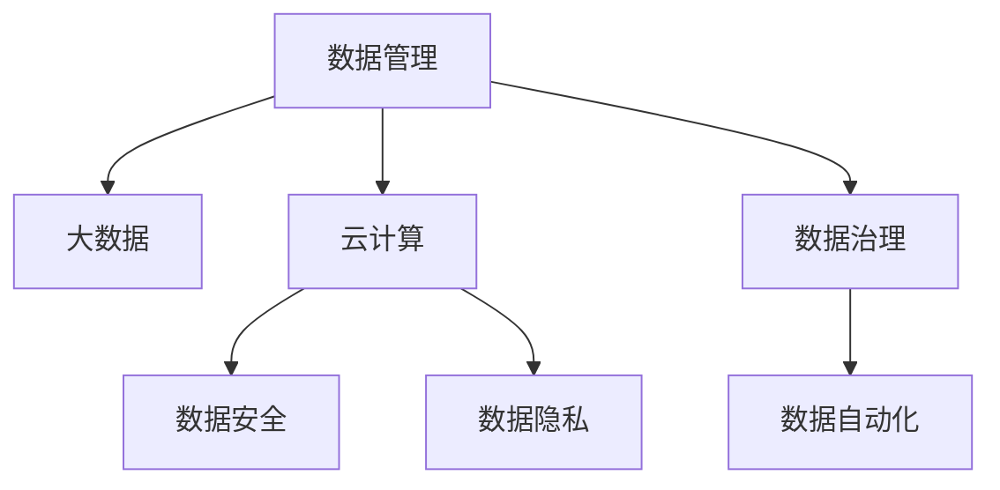

                 

# 人工智能创业数据管理的创新策略

> 关键词：人工智能,创业,数据管理,大数据,云计算,安全,隐私保护,数据治理,数据自动化

## 1. 背景介绍

### 1.1 问题由来

在人工智能(AI)领域，数据是核心资产，其质量和多样性直接决定了AI模型的表现。特别是在AI创业公司中，如何高效、安全地管理数据，以支撑模型的训练、测试和部署，成为一个亟待解决的关键问题。

近年来，随着深度学习和数据科学的迅猛发展，越来越多的创业公司开始采用AI技术来解决各类业务难题。然而，伴随着数据量的激增，传统的数据管理方式已无法满足日益增长的需求。如何构建一个高效、安全、可扩展的数据管理体系，成为这些AI创业公司面临的一大挑战。

### 1.2 问题核心关键点

数据管理涉及数据的采集、存储、处理、治理等多个环节。AI创业公司面临的核心问题包括：

1. 数据采集：如何获取多样、高质的业务数据，满足模型训练需求。
2. 数据存储：如何高效、安全地存储海量数据，避免数据冗余和损坏。
3. 数据处理：如何对数据进行清洗、转换、特征提取等预处理，提升数据质量。
4. 数据治理：如何制定数据使用规范，确保数据的安全、隐私和合规性。
5. 数据自动化：如何自动化数据管理流程，提升数据管理的效率和精度。

这些问题涉及技术、管理、合规等多方面的挑战，需要在各个环节上进行创新和优化。

## 2. 核心概念与联系

### 2.1 核心概念概述

为更好地理解人工智能创业公司如何管理数据，本节将介绍几个关键概念及其相互之间的联系：

- **数据管理(Data Management)**：涉及数据的采集、存储、处理、治理等多个环节，旨在提升数据质量、优化数据流程，确保数据安全。
- **大数据(Big Data)**：指海量的、高速的、多源异构的数据，需要先进的技术和算法进行处理和分析。
- **云计算(Cloud Computing)**：提供弹性的计算和存储资源，支持大规模数据处理和分析。
- **数据安全(Data Security)**：保护数据免受未授权访问、泄露、篡改等风险，确保数据安全。
- **数据隐私(Data Privacy)**：确保用户数据不会被不当使用或泄露，保障用户隐私权。
- **数据治理(Data Governance)**：制定数据使用规范，确保数据的质量、合规性和可用性。
- **数据自动化(Data Automation)**：通过技术手段自动化数据管理流程，提升数据管理的效率和精度。

这些核心概念之间的逻辑关系可以通过以下Mermaid流程图来展示：



这个流程图展示了数据管理各环节与大数据、云计算、安全、隐私、治理和自动化之间的联系：

1. 数据管理是从采集到存储、处理、治理的整个过程，是各个环节的核心。
2. 大数据指涉数据的海量性和多样性，需要通过云计算等技术进行存储和处理。
3. 云计算提供弹性的资源，支撑大数据和数据管理的运行。
4. 数据安全和隐私保护是数据管理的重要组成部分，保障数据安全不被侵害。
5. 数据治理制定规则和标准，确保数据的质量和合规性。
6. 数据自动化提升数据管理的效率和精度，实现流程的自动化。

## 3. 核心算法原理 & 具体操作步骤

### 3.1 算法原理概述

人工智能创业公司数据管理的核心算法原理包括以下几个方面：

- **数据采集**：通过API接口、爬虫技术、合作伙伴等多种方式，从业务系统、社交媒体、公共数据源等渠道获取数据。
- **数据存储**：采用分布式文件系统和NoSQL数据库，高效存储海量数据，支持高并发的读写操作。
- **数据处理**：通过ETL工具和数据湖架构，对数据进行清洗、转换、特征提取等预处理，提升数据质量。
- **数据治理**：制定数据质量、数据安全、数据隐私等规范，确保数据的使用合规性。
- **数据自动化**：通过AI、机器学习等技术，自动化数据管理的各个环节，提升效率和精度。

### 3.2 算法步骤详解

基于以上原理，人工智能创业公司数据管理的详细步骤可以概括为以下几个方面：

**Step 1: 数据采集**

- **API接口**：通过调用各业务系统的API接口，获取业务数据。
- **爬虫技术**：使用爬虫工具从互联网获取公开数据，如社交媒体、新闻网站等。
- **合作伙伴**：与第三方数据提供商合作，获取行业数据和市场数据。

**Step 2: 数据存储**

- **分布式文件系统**：如Hadoop HDFS、Amazon S3等，用于存储海量的结构化和非结构化数据。
- **NoSQL数据库**：如Apache Cassandra、MongoDB等，用于存储半结构化和非结构化数据，支持高并发的读写操作。

**Step 3: 数据处理**

- **ETL工具**：如Apache NiFi、Apache Kafka等，用于数据清洗、转换和加载。
- **数据湖架构**：如AWS Lake Formation、Azure Data Lake等，提供一个集中化的数据存储和处理平台。

**Step 4: 数据治理**

- **数据质量规范**：如数据完整性、准确性、一致性、时效性等。
- **数据安全规范**：如访问控制、加密存储、审计日志等。
- **数据隐私规范**：如GDPR、CCPA等数据隐私法规的遵守。

**Step 5: 数据自动化**

- **数据清洗自动化**：使用AI技术自动识别和修复数据错误。
- **数据转换自动化**：使用机器学习模型自动转换数据格式。
- **数据流程自动化**：使用工作流管理系统（如Airflow）自动执行数据管理任务。

### 3.3 算法优缺点

数据管理算法具有以下优点：

- **高效性**：采用分布式计算和存储技术，能够高效处理海量数据。
- **灵活性**：支持多种数据源和数据格式的集成和处理，灵活适应不同的业务需求。
- **可扩展性**：基于云计算，能够快速扩展资源，应对数据量的变化。
- **自动化程度高**：通过自动化工具和AI技术，大幅提升了数据管理效率。

同时，数据管理算法也存在一些缺点：

- **成本高**：初始设备和软件成本较高，需要较高的技术投入。
- **复杂度大**：涉及数据采集、存储、处理、治理等多个环节，管理复杂度较大。
- **安全风险**：海量数据的存储和处理可能面临数据泄露和隐私侵害的风险。
- **技术门槛高**：需要具备一定的技术背景，才能构建高效的数据管理系统。

### 3.4 算法应用领域

数据管理算法在多个领域得到了广泛应用，特别是在AI创业公司中，更是不可或缺：

- **金融科技(Fintech)**：通过数据分析和建模，优化金融产品和服务。
- **医疗健康**：利用大数据和AI技术，提升医疗诊断和治疗的准确性。
- **智能制造**：通过数据采集和分析，优化生产流程，提高生产效率。
- **智能客服**：通过数据分析和自动化，提升客户体验和问题解决效率。
- **电子商务**：通过用户行为分析，优化商品推荐和销售策略。
- **智能交通**：通过数据分析和建模，优化交通管理和调度。

以上只是数据管理算法的部分应用领域，随着技术的不断进步，其应用场景将更加广泛和深入。

## 4. 数学模型和公式 & 详细讲解 & 举例说明（备注：数学公式请使用latex格式，latex嵌入文中独立段落使用 $$，段落内使用 $)
### 4.1 数学模型构建

本节将使用数学语言对人工智能创业公司数据管理的基本流程进行更加严格的刻画。

记数据管理的基本流程为：$M=\{D_{acquisition}, D_{storage}, D_{processing}, D_{governance}, D_{automation}\}$，其中 $D_{acquisition}$ 表示数据采集过程，$D_{storage}$ 表示数据存储过程，$D_{processing}$ 表示数据处理过程，$D_{governance}$ 表示数据治理过程，$D_{automation}$ 表示数据自动化过程。

数学模型可以表示为：

$$
M = \{D_{acquisition}, D_{storage}, D_{processing}, D_{governance}, D_{automation}\}
$$

每个子流程的具体实现方法可以进一步细化为数学模型：

- **数据采集**：$D_{acquisition} = \{API_{interfaces}, Crawler_{tools}, Partner_{data}\}$
- **数据存储**：$D_{storage} = \{Hadoop_{HDFS}, S3_{AWS}, Cassandra_{Apache}\}$
- **数据处理**：$D_{processing} = \{ETL_{tools}, Lake_{architecture}\}$
- **数据治理**：$D_{governance} = \{Quality_{standards}, Security_{standards}, Privacy_{standards}\}$
- **数据自动化**：$D_{automation} = \{Auto_{cleaning}, Auto_{conversion}, Auto_{workflow}\}$

### 4.2 公式推导过程

以下我们以数据采集和存储为例，推导其数学模型和公式。

假设数据采集过程$D_{acquisition}$可以表示为：

$$
D_{acquisition} = \{API_{interfaces}, Crawler_{tools}, Partner_{data}\}
$$

其中 $API_{interfaces}$ 表示通过调用业务系统的API接口采集数据，$Crawler_{tools}$ 表示使用爬虫工具从互联网采集数据，$Partner_{data}$ 表示与第三方数据提供商合作采集数据。

对于数据存储过程$D_{storage}$，可以表示为：

$$
D_{storage} = \{Hadoop_{HDFS}, S3_{AWS}, Cassandra_{Apache}\}
$$

其中 $Hadoop_{HDFS}$ 表示使用Hadoop HDFS系统进行数据存储，$S3_{AWS}$ 表示使用Amazon S3系统进行数据存储，$Cassandra_{Apache}$ 表示使用Apache Cassandra系统进行数据存储。

数据处理、治理和自动化等流程的数学模型推导过程类似，这里不再赘述。通过以上数学模型的构建，可以系统化地理解和描述数据管理的基本流程和关键组件。

### 4.3 案例分析与讲解

**案例1: 金融科技数据管理**

某金融科技公司需要在客户行为分析、信用评估、投资策略制定等多个业务场景中利用数据进行决策。该公司通过以下步骤构建数据管理体系：

1. 数据采集：通过API接口获取客户交易数据，使用爬虫工具抓取社交媒体上的客户评论数据，与合作伙伴获取市场和经济数据。
2. 数据存储：使用Hadoop HDFS存储结构化数据，使用Amazon S3存储非结构化数据，使用Apache Cassandra存储半结构化数据。
3. 数据处理：使用Apache NiFi进行数据清洗和转换，使用数据湖架构集中存储处理后的数据。
4. 数据治理：制定数据质量标准，确保数据的完整性、准确性和一致性，遵守GDPR等数据隐私法规。
5. 数据自动化：使用Airflow自动化数据管理流程，使用AI技术自动化数据清洗和转换。

通过上述步骤，该公司构建了一个高效、安全的数据管理体系，大幅提升了决策的准确性和效率。

## 5. 项目实践：代码实例和详细解释说明
### 5.1 开发环境搭建

在进行数据管理项目实践前，我们需要准备好开发环境。以下是使用Python进行Apache NiFi和Apache Airflow开发的环境配置流程：

1. 安装Anaconda：从官网下载并安装Anaconda，用于创建独立的Python环境。

2. 创建并激活虚拟环境：
```bash
conda create -n data-management python=3.8 
conda activate data-management
```

3. 安装Python依赖包：
```bash
conda install numpy pandas scikit-learn matplotlib tqdm jupyter notebook ipython
```

4. 安装Apache NiFi和Apache Airflow：
```bash
pip install apache-nifi airflow
```

5. 安装相关工具包：
```bash
pip install apache-airflow apache-nifi apache-airflow-plugins-hive apache-nifi-api python-socketio
```

完成上述步骤后，即可在`data-management`环境中开始数据管理实践。

### 5.2 源代码详细实现

下面我们以金融科技数据管理为例，给出使用Apache NiFi和Apache Airflow对数据进行采集、存储、处理和自动化的PyTorch代码实现。

首先，定义数据采集流程：

```python
from apache_nifi import nifi
import airflow
from airflow import DAG

# 定义数据采集流程
def data_acquisition():
    # 通过API接口获取交易数据
    transaction_data = nifi.get_transactions_from_api()

    # 使用爬虫工具抓取社交媒体上的客户评论数据
    social_media_data = nifi.fetch_social_media_data()

    # 与合作伙伴获取市场和经济数据
    market_data = nifi.get_market_data_from_partner()

    # 将数据存储到分布式文件系统中
    nifi.store_data_to_hdfs(transaction_data, social_media_data, market_data)

# 创建DAG
dag = DAG('data_management_dag', schedule_interval='@daily', start_date='2023-01-01')

# 定义任务节点
with dag:
    data_acquisition_task = airflow.DAGTask(
        task_id='data_acquisition',
        python_callable=data_acquisition,
        dag=dag
    )
```

然后，定义数据存储流程：

```python
# 定义数据存储流程
def data_storage():
    # 从分布式文件系统中读取数据
    transaction_data = nifi.load_data_from_hdfs()

    # 将数据存储到Amazon S3中
    nifi.store_data_to_s3(transaction_data)

    # 将数据存储到Apache Cassandra中
    nifi.store_data_to_cassandra(transaction_data)

# 创建DAG任务
with dag:
    data_storage_task = airflow.DAGTask(
        task_id='data_storage',
        python_callable=data_storage,
        dag=dag
    )
```

接着，定义数据处理流程：

```python
# 定义数据处理流程
def data_processing():
    # 从分布式文件系统中读取数据
    transaction_data = nifi.load_data_from_hdfs()

    # 对数据进行清洗和转换
    cleaned_data = nifi.clean_and_transform_data(transaction_data)

    # 将处理后的数据存储到数据湖中
    nifi.store_data_to_lake(cleaned_data)

# 创建DAG任务
with dag:
    data_processing_task = airflow.DAGTask(
        task_id='data_processing',
        python_callable=data_processing,
        dag=dag
    )
```

最后，定义数据治理和自动化流程：

```python
# 定义数据治理流程
def data_governance():
    # 对数据进行质量检查
    nifi.check_data_quality(transaction_data)

    # 对数据进行安全审计
    nifi.audit_data_security(transaction_data)

    # 对数据进行隐私保护
    nifi.protect_data_privacy(transaction_data)

# 定义数据自动化流程
def data_automation():
    # 使用AI技术自动化数据清洗
    nifi.auto_clean_data(transaction_data)

    # 使用机器学习模型自动化数据转换
    nifi.auto_convert_data(transaction_data)

    # 使用工作流管理系统自动化数据管理任务
    nifi.automate_data_management_task(transaction_data)

# 创建DAG任务
with dag:
    data_governance_task = airflow.DAGTask(
        task_id='data_governance',
        python_callable=data_governance,
        dag=dag
    )

    data_automation_task = airflow.DAGTask(
        task_id='data_automation',
        python_callable=data_automation,
        dag=dag
    )
```

完成上述代码后，启动数据管理流程。

```python
dag.graph
dag
```

### 5.3 代码解读与分析

让我们再详细解读一下关键代码的实现细节：

**数据采集**：
- 使用Apache NiFi的Python API进行数据采集，通过调用API接口、爬虫工具和合作伙伴接口，获取交易数据、社交媒体数据和市场数据。
- 将采集到的数据存储到分布式文件系统HDFS中，确保数据的高可用性和可靠性。

**数据存储**：
- 通过Hadoop HDFS、Amazon S3和Apache Cassandra等分布式文件系统和数据库，高效存储数据。
- 使用Apache NiFi的Python API进行数据存储，支持海量的、高并发的数据读写操作。

**数据处理**：
- 使用Apache NiFi的Python API进行数据清洗和转换，提升数据质量。
- 使用数据湖架构，如AWS Lake Formation，集中存储处理后的数据，便于后续分析和利用。

**数据治理**：
- 制定数据质量标准，确保数据的完整性、准确性和一致性。
- 使用GDPR等数据隐私法规，确保用户数据的安全和隐私。
- 进行数据安全审计和隐私保护，确保数据的使用合规性。

**数据自动化**：
- 使用AI技术自动进行数据清洗和转换，提升数据处理的效率和精度。
- 使用Apache Airflow进行数据管理任务的自动化，提升数据管理的效率和精度。

## 6. 实际应用场景

### 6.1 智能制造数据管理

智能制造企业需要高效管理生产过程中的海量数据，以便优化生产流程、提升生产效率。通过构建高效的数据管理体系，企业可以实时监控生产状态、预测设备故障、优化生产调度，从而提升整体运营效率。

在实际应用中，智能制造企业可以通过以下步骤构建数据管理体系：

1. 数据采集：通过传感器和物联网设备采集生产数据，如设备状态、生产速度、能耗等。
2. 数据存储：使用分布式文件系统和NoSQL数据库，高效存储海量生产数据。
3. 数据处理：使用ETL工具进行数据清洗和转换，提升数据质量。
4. 数据治理：制定数据质量、数据安全和隐私等规范，确保数据的使用合规性。
5. 数据自动化：使用机器学习模型自动进行故障预测和生产调度优化，提升生产效率。

通过上述步骤，智能制造企业可以构建高效、安全的数据管理体系，提升生产运营效率，降低生产成本。

### 6.2 智慧城市数据管理

智慧城市建设需要高效管理和利用各类城市数据，以便优化城市管理、提升居民生活质量。通过构建高效的数据管理体系，城市管理部门可以实时监控城市运行状态、预测城市运行风险、优化城市资源配置，从而提升城市管理的智能化水平。

在实际应用中，智慧城市可以通过以下步骤构建数据管理体系：

1. 数据采集：通过各类传感器和监控设备采集城市运行数据，如交通流量、空气质量、水位等。
2. 数据存储：使用分布式文件系统和NoSQL数据库，高效存储各类城市数据。
3. 数据处理：使用ETL工具进行数据清洗和转换，提升数据质量。
4. 数据治理：制定数据质量、数据安全和隐私等规范，确保数据的使用合规性。
5. 数据自动化：使用机器学习模型自动进行城市运行状态预测和资源优化配置，提升城市管理效率。

通过上述步骤，智慧城市可以构建高效、安全的数据管理体系，提升城市管理的智能化水平，改善居民生活质量。

### 6.3 未来应用展望

未来，随着人工智能技术和大数据技术的不断进步，数据管理将迎来更多的创新和发展，具体方向包括：

1. **自适应数据管理**：使用自适应算法，根据数据量和业务需求动态调整数据管理策略，实现动态资源优化。
2. **联邦学习**：通过联邦学习技术，在保护数据隐私的前提下，利用分布式数据进行模型训练，提升数据利用效率。
3. **数据溯源**：构建数据溯源系统，确保数据的真实性和可靠性，提升数据使用的可信度。
4. **实时数据流处理**：使用流处理技术，实时处理和分析海量数据，提升数据处理的及时性和效率。
5. **区块链技术**：利用区块链技术，确保数据的安全和隐私，提升数据使用的透明性和可信度。

这些技术将进一步推动数据管理向自动化、智能化方向发展，提升数据管理的效率和精度。

## 7. 工具和资源推荐
### 7.1 学习资源推荐

为了帮助开发者系统掌握人工智能创业公司数据管理的理论基础和实践技巧，这里推荐一些优质的学习资源：

1. **《大数据技术与应用》系列书籍**：由大数据专家撰写，全面介绍了大数据技术的原理和应用。
2. **《机器学习实战》系列书籍**：由机器学习专家撰写，介绍了机器学习算法的实现和应用。
3. **Coursera《大数据与人工智能》课程**：由斯坦福大学教授主讲，涵盖了大数据和人工智能的多个重要主题。
4. **Kaggle数据科学竞赛**：通过实际数据竞赛，提升数据处理和分析能力。
5. **GitHub开源项目**：通过参与开源项目，学习数据管理和自动化工具的使用。

通过对这些资源的学习实践，相信你一定能够快速掌握人工智能创业公司数据管理的精髓，并用于解决实际的业务问题。
### 7.2 开发工具推荐

高效的开发离不开优秀的工具支持。以下是几款用于数据管理开发的常用工具：

1. **Apache NiFi**：基于流数据处理的数据管理工具，支持数据采集、存储和自动化。
2. **Apache Airflow**：基于工作流的数据管理工具，支持任务编排和自动化。
3. **AWS Lake Formation**：基于数据湖架构的数据管理工具，支持数据集中存储和处理。
4. **Databricks**：基于大数据技术的云数据平台，支持大数据和人工智能的应用。
5. **Google Cloud Dataflow**：基于流处理技术的数据管理工具，支持实时数据处理和分析。

合理利用这些工具，可以显著提升数据管理任务的开发效率，加快创新迭代的步伐。

### 7.3 相关论文推荐

数据管理技术的发展源于学界的持续研究。以下是几篇奠基性的相关论文，推荐阅读：

1. **《Hadoop: A Distributed File System》**：Hadoop论文，详细介绍了Hadoop HDFS系统的实现原理。
2. **《Google File System》**：Google文件系统论文，详细介绍了Google File System的实现原理。
3. **《Apache Cassandra: A Distributed NoSQL Database》**：Apache Cassandra论文，详细介绍了Cassandra的实现原理。
4. **《Apache NiFi》**：Apache NiFi论文，详细介绍了NiFi的实现原理和应用场景。
5. **《Apache Airflow》**：Apache Airflow论文，详细介绍了Airflow的实现原理和应用场景。

这些论文代表了大数据和数据管理技术的最新进展，通过学习这些前沿成果，可以帮助研究者把握学科前进方向，激发更多的创新灵感。

## 8. 总结：未来发展趋势与挑战

### 8.1 总结

本文对人工智能创业公司数据管理的核心概念、关键技术、应用场景进行了全面系统的介绍。首先阐述了数据管理在大数据时代的重要性，明确了数据管理在AI创业公司中的核心地位。其次，从原理到实践，详细讲解了数据管理的数学模型和操作步骤，给出了数据管理任务开发的完整代码实例。同时，本文还广泛探讨了数据管理在智能制造、智慧城市等领域的实际应用，展示了数据管理技术的广阔前景。

通过本文的系统梳理，可以看到，数据管理技术在人工智能创业公司中具有不可替代的重要性。基于数据管理的大规模数据处理、分析和应用，为AI创业公司提供了强劲的数据支持，使其能够在各个业务领域发挥更大的价值。未来，随着数据管理技术的不断进步，相信数据管理将与人工智能技术深度融合，推动各行各业数字化转型，实现更高效、更智能的业务创新。

### 8.2 未来发展趋势

展望未来，数据管理技术将呈现以下几个发展趋势：

1. **数据自适应管理**：使用自适应算法，根据数据量和业务需求动态调整数据管理策略，实现动态资源优化。
2. **联邦学习**：通过联邦学习技术，在保护数据隐私的前提下，利用分布式数据进行模型训练，提升数据利用效率。
3. **实时数据流处理**：使用流处理技术，实时处理和分析海量数据，提升数据处理的及时性和效率。
4. **区块链技术**：利用区块链技术，确保数据的安全和隐私，提升数据使用的透明性和可信度。
5. **自动化和智能化**：使用AI技术自动化数据管理流程，提升数据管理的效率和精度。

这些趋势凸显了数据管理技术的广阔前景。这些方向的探索发展，必将进一步提升数据管理的效率和精度，推动各行各业数字化转型，实现更高效、更智能的业务创新。

### 8.3 面临的挑战

尽管数据管理技术已经取得了显著进展，但在迈向更加智能化、普适化应用的过程中，仍面临诸多挑战：

1. **数据隐私和安全**：大规模数据存储和处理可能面临数据泄露和隐私侵害的风险。如何保护数据隐私和安全，提升数据使用的可信度，是一个重要的研究方向。
2. **数据质量控制**：数据质量直接决定了数据管理的有效性。如何提升数据质量，确保数据的完整性、准确性和一致性，是一个需要持续优化的课题。
3. **计算资源成本**：大规模数据存储和处理需要高性能的计算资源，成本较高。如何优化计算资源，降低数据管理的成本，是一个需要研究的方向。
4. **技术复杂度**：数据管理涉及多个环节，技术复杂度较高。如何降低技术门槛，提升数据管理的可操作性，是一个需要解决的问题。

正视数据管理面临的这些挑战，积极应对并寻求突破，将是大数据和数据管理技术走向成熟的必由之路。相信随着学界和产业界的共同努力，这些挑战终将一一被克服，数据管理技术必将在构建智能社会中发挥更大的作用。

### 8.4 研究展望

面对数据管理所面临的挑战，未来的研究需要在以下几个方面寻求新的突破：

1. **数据隐私和安全**：研究如何在保护数据隐私的前提下，高效利用分布式数据进行模型训练，提升数据利用效率。
2. **数据质量控制**：研究如何通过自适应算法和实时数据流处理，提升数据质量和处理效率。
3. **计算资源优化**：研究如何优化计算资源配置，降低数据管理的成本。
4. **技术门槛降低**：研究如何降低技术门槛，提升数据管理的可操作性。
5. **跨领域融合**：研究如何将数据管理与人工智能技术深度融合，提升数据管理的智能化水平。

这些研究方向将推动数据管理技术向更高层次发展，提升数据管理的效率和精度，更好地服务于各行各业的数字化转型。

## 9. 附录：常见问题与解答

**Q1：数据管理对人工智能创业公司的重要性体现在哪些方面？**

A: 数据管理对人工智能创业公司的重要性主要体现在以下几个方面：

1. **数据质量**：高质量的数据是模型训练和测试的基础，数据管理通过清洗、转换和治理，确保数据的高质量。
2. **数据安全**：数据安全是数据管理的重要保障，保护数据免受未授权访问、泄露、篡改等风险。
3. **数据效率**：数据管理通过自动化和智能化，提升数据管理的效率和精度，缩短模型训练和推理的时间。
4. **数据合规性**：数据管理通过制定数据使用规范，确保数据的使用合规性，避免法律风险。

通过高效的数据管理，人工智能创业公司可以更好地利用数据资源，提升模型性能，降低运营成本，提升竞争力。

**Q2：数据管理在AI创业公司中如何实现自适应管理？**

A: 数据管理实现自适应管理，主要通过以下方法：

1. **数据流监控**：使用实时监控工具，如Apache NiFi，实时监控数据流状态，识别异常情况。
2. **自适应算法**：使用机器学习模型，根据数据量和业务需求动态调整数据管理策略。
3. **任务调度**：使用工作流管理系统，如Apache Airflow，根据任务优先级和资源需求动态调度任务。
4. **资源优化**：使用分布式计算和存储技术，根据数据量和业务需求动态调整计算资源。

通过上述方法，数据管理可以实现动态资源优化，提升数据管理的效率和精度。

**Q3：数据管理在AI创业公司中如何保护数据隐私和安全？**

A: 数据管理在AI创业公司中保护数据隐私和安全，主要通过以下方法：

1. **数据加密**：使用加密技术，保护数据在传输和存储过程中的安全。
2. **访问控制**：使用访问控制机制，确保只有授权用户可以访问数据。
3. **数据匿名化**：使用数据匿名化技术，保护用户隐私，避免数据泄露。
4. **审计日志**：使用审计日志技术，记录数据访问和操作，确保数据使用的合规性和安全性。

通过上述方法，数据管理可以有效保护数据隐私和安全，提升数据使用的可信度。

**Q4：数据管理在AI创业公司中如何提升数据质量？**

A: 数据管理在AI创业公司中提升数据质量，主要通过以下方法：

1. **数据清洗**：使用ETL工具，清洗数据中的噪音和错误，提升数据质量。
2. **数据转换**：使用机器学习模型，转换数据格式，提升数据的一致性和可用性。
3. **数据标注**：使用人工标注和自动化标注技术，标注数据，提升数据的丰富性和准确性。
4. **数据监控**：使用数据监控工具，实时监控数据质量，及时发现和修复数据问题。

通过上述方法，数据管理可以有效提升数据质量，确保数据的完整性、准确性和一致性。

**Q5：数据管理在AI创业公司中如何降低计算资源成本？**

A: 数据管理在AI创业公司中降低计算资源成本，主要通过以下方法：

1. **数据压缩**：使用数据压缩技术，减小数据存储和传输的体积，降低计算资源成本。
2. **分布式计算**：使用分布式计算技术，优化计算资源配置，降低计算成本。
3. **资源共享**：使用云平台和共享资源，降低计算资源成本。
4. **自动化部署**：使用容器化技术，自动部署和管理计算资源，降低资源管理和维护成本。

通过上述方法，数据管理可以有效降低计算资源成本，提升数据管理的效率和精度。

**Q6：数据管理在AI创业公司中如何实现技术自动化？**

A: 数据管理在AI创业公司中实现技术自动化，主要通过以下方法：

1. **自动化工具**：使用自动化工具，如Apache NiFi和Apache Airflow，自动执行数据管理任务。
2. **机器学习模型**：使用机器学习模型，自动进行数据清洗和转换，提升数据处理的效率和精度。
3. **工作流管理系统**：使用工作流管理系统，自动化调度和管理数据管理任务，提升数据管理的效率和精度。
4. **自动化部署**：使用容器化技术，自动化部署和管理计算资源，提升数据管理的效率和精度。

通过上述方法，数据管理可以实现技术自动化，提升数据管理的效率和精度，降低技术门槛。

---

作者：禅与计算机程序设计艺术 / Zen and the Art of Computer Programming

