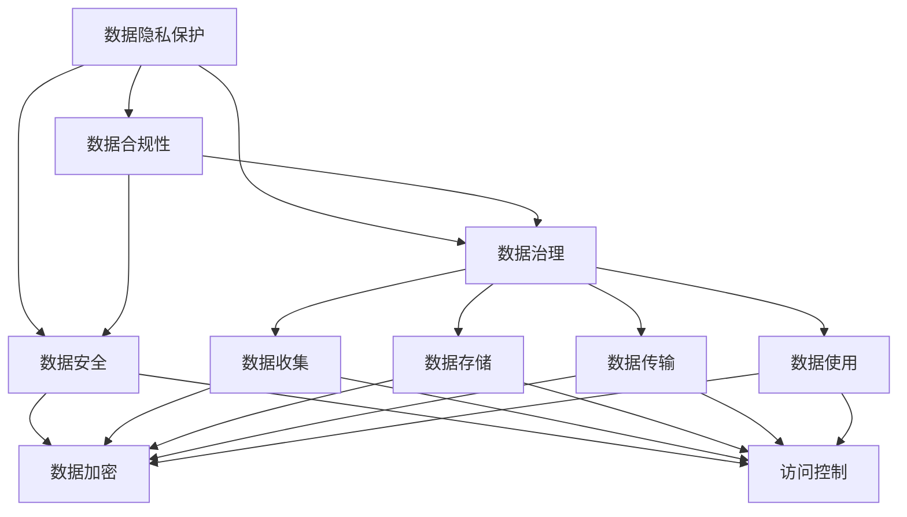

                 

# 人工智能创业：确保数据合法性

> 关键词：数据隐私保护, 合规性, 数据治理, 数据安全, 法规遵循

## 1. 背景介绍

### 1.1 问题由来

在人工智能(AI)创业的大潮中，数据驱动的机器学习模型成为核心竞争力。然而，数据本身具有显著的价值属性，一旦泄露或被不当使用，可能导致严重的法律风险和经济损失。因此，确保数据合法性、合规性，成为AI创业公司必须严格遵守的基本准则。

### 1.2 问题核心关键点

数据合法性的核心在于确保数据的获取、使用、存储、传输等各个环节，均符合国家法律法规和行业标准。包括但不限于以下几个方面：

- 数据收集：确保数据来源合法，不涉及侵犯个人隐私。
- 数据存储：采用安全、有效的存储措施，防止数据泄露。
- 数据传输：通过加密等技术保护数据在传输过程中的安全。
- 数据使用：合法合理地使用数据，不涉及数据滥用。
- 法规遵循：严格遵守相关法律法规，如GDPR、CCPA等。

这些关键点构成了数据合法性的基础框架，是AI创业公司必须面对和解决的重要挑战。

### 1.3 问题研究意义

确保数据合法性，不仅有助于保护用户隐私，避免法律风险，还为AI创业公司构建了信任基础，增强用户和客户的信心。同时，合规性也是AI技术普及应用的关键，避免因合规问题导致技术应用受限，是推动AI行业健康发展的必由之路。

## 2. 核心概念与联系

### 2.1 核心概念概述

为更好地理解确保数据合法性的关键点，本节将介绍几个核心概念：

- 数据隐私保护：指保护个人或企业数据，防止未经授权的访问和使用，确保数据主体的隐私权。
- 数据合规性：指确保数据处理和使用过程符合相关法律法规和行业标准，如GDPR、CCPA、HIPAA等。
- 数据治理：指通过建立数据管理制度，确保数据的质量、安全性和合规性，包括数据收集、存储、使用等全生命周期管理。
- 数据安全：指保护数据免受未授权访问、篡改、破坏等风险，防止数据泄露和滥用。
- 法规遵循：指遵守国家法律法规和行业标准，如GDPR等，确保数据处理活动的合法性。

这些概念之间的逻辑关系可以通过以下Mermaid流程图来展示：



这个流程图展示了几大核心概念之间的联系：

1. 数据隐私保护是确保数据合规性和数据安全的基础。
2. 数据治理贯穿数据的全生命周期，确保数据的质量、安全性和合规性。
3. 数据合规性和数据安全是数据治理的重要组成部分。
4. 法规遵循是数据合规性的核心要求。

## 3. 核心算法原理 & 具体操作步骤

### 3.1 算法原理概述

确保数据合法性的核心算法原理包括数据隐私保护算法、数据合规性算法和数据治理算法。

- **数据隐私保护算法**：通过加密、匿名化、差分隐私等技术手段，保护数据的隐私属性，防止未经授权的访问和使用。
- **数据合规性算法**：通过合规性检查、审计、评估等技术手段，确保数据处理和使用过程符合相关法律法规和行业标准。
- **数据治理算法**：通过数据质量管理、数据生命周期管理、数据安全管理等技术手段，确保数据的质量、安全性和合规性。

这些算法通过技术的结合，确保数据的合法性和合规性，为AI创业公司构建坚实的数据治理体系。

### 3.2 算法步骤详解

#### 数据隐私保护算法

1. **数据收集阶段**：
    - 收集匿名化处理后的数据，如对个人数据进行去标识化处理。
    - 采用差分隐私技术，在数据分析过程中加入噪声，保护个体隐私。

2. **数据存储阶段**：
    - 采用数据加密技术，确保数据在存储过程中的安全。
    - 建立严格的访问控制机制，限制数据访问权限。

3. **数据传输阶段**：
    - 使用端到端加密技术，保护数据在传输过程中的安全。
    - 采用安全传输协议，如HTTPS，确保数据传输的安全性。

#### 数据合规性算法

1. **合规性检查**：
    - 定期进行合规性检查，确保数据处理过程符合GDPR、CCPA等法规要求。
    - 采用自动化合规性检查工具，进行持续监控和预警。

2. **合规性审计**：
    - 定期进行合规性审计，对数据处理过程进行独立审查。
    - 建立合规性审计报告，记录合规性审计结果和改进措施。

3. **合规性评估**：
    - 定期进行合规性评估，评估数据处理过程的合规性。
    - 根据评估结果，制定改进措施，确保数据处理的合规性。

#### 数据治理算法

1. **数据质量管理**：
    - 通过数据清洗、数据校验等技术手段，确保数据的质量和一致性。
    - 建立数据质量监控机制，及时发现和纠正数据质量问题。

2. **数据生命周期管理**：
    - 建立数据生命周期管理制度，涵盖数据收集、存储、使用、销毁等全生命周期。
    - 对数据生命周期进行详细记录，确保数据处理的透明性和可追溯性。

3. **数据安全管理**：
    - 采用多种数据安全技术，如加密、访问控制、审计等，确保数据的安全性。
    - 建立数据安全事件应急响应机制，快速应对数据安全事件。

### 3.3 算法优缺点

确保数据合法性的算法具有以下优点：

- 提高数据安全性：通过加密、匿名化、访问控制等技术，保护数据免受未授权访问和泄露。
- 增强合规性：通过合规性检查、审计、评估等手段，确保数据处理过程符合法律法规和行业标准。
- 提高数据质量：通过数据清洗、校验等技术，确保数据的一致性和准确性。

但同时也存在以下缺点：

- 技术复杂：数据隐私保护、合规性检查等技术手段较为复杂，需要专业的技术团队进行实现和管理。
- 成本较高：加密、匿名化等技术手段，需要额外的计算资源和成本投入。
- 法规更新频繁：不同国家和地区的法律法规不断更新，需要持续关注和调整合规策略。

### 3.4 算法应用领域

确保数据合法性的算法在以下领域得到广泛应用：

- **医疗健康**：确保患者数据的隐私和安全，防止数据泄露和滥用。
- **金融行业**：确保金融数据的隐私和安全，防止数据被恶意利用。
- **电子商务**：确保用户数据的隐私和安全，防止数据泄露和滥用。
- **互联网应用**：确保用户数据的隐私和安全，防止数据被滥用。
- **政府和公共服务**：确保公共数据的隐私和安全，防止数据被滥用。

## 4. 数学模型和公式 & 详细讲解 & 举例说明

### 4.1 数学模型构建

假设数据集为 $\{(x_i, y_i)\}_{i=1}^N$，其中 $x_i$ 表示数据样本，$y_i$ 表示标签。数据隐私保护、合规性检查、数据治理等算法，可以表示为以下数学模型：

- **数据隐私保护模型**：
  - 加密算法：$E(x_i) = c_i$
  - 差分隐私算法：$P(c_i) = P(x_i)$

- **合规性检查模型**：
  - 合规性检查函数：$f(c_i, r) = \begin{cases} 1 & c_i \text{ 符合法规要求} \\ 0 & c_i \text{ 不符合法规要求} \end{cases}$

- **数据治理模型**：
  - 数据质量评估函数：$Q(c_i) = \begin{cases} 1 & c_i \text{ 质量高} \\ 0 & c_i \text{ 质量低} \end{cases}$

### 4.2 公式推导过程

以数据隐私保护算法中的加密算法为例，进行推导：

设原始数据 $x_i$，加密后的数据 $c_i$，则加密过程可以表示为：

$$
c_i = E(x_i)
$$

其中 $E$ 表示加密函数，常用的加密算法有AES、RSA等。加密后，数据 $c_i$ 的安全性大大增强，但原始数据 $x_i$ 无法直接访问，需要通过解密函数 $D(c_i) = x_i$ 恢复原始数据。

### 4.3 案例分析与讲解

**案例1：医疗数据隐私保护**

假设某医院有大量患者数据，需要进行数据分析和研究。为确保患者数据隐私，可以采用差分隐私技术。具体步骤如下：

1. 对患者数据进行去标识化处理，确保无法识别出具体患者。
2. 在数据分析过程中，加入随机噪声，确保数据分析结果的隐私性。
3. 将加密后的数据存储在安全的数据库中，确保数据的安全性。

**案例2：金融数据合规性检查**

假设某金融机构需要进行金融数据分析，以优化客户服务。为确保数据合规性，可以采用合规性检查工具。具体步骤如下：

1. 建立合规性检查规则，定义数据处理的合法条件。
2. 定期对数据处理过程进行检查，确保符合合规性要求。
3. 建立合规性审计报告，记录合规性检查结果和改进措施。

## 5. 项目实践：代码实例和详细解释说明

### 5.1 开发环境搭建

在开发数据隐私保护、合规性检查、数据治理等算法时，需要搭建完整的开发环境。以下是Python环境搭建的示例：

1. 安装Anaconda：从官网下载并安装Anaconda，用于创建独立的Python环境。

2. 创建并激活虚拟环境：
```bash
conda create -n data-privacy-env python=3.8 
conda activate data-privacy-env
```

3. 安装Python库：
```bash
pip install numpy pandas scikit-learn tensorflow keras transformers
```

4. 安装加密库：
```bash
pip install cryptography
```

5. 安装合规性检查库：
```bash
pip install compliance-checker
```

6. 安装数据治理库：
```bash
pip install data-governance-framework
```

完成上述步骤后，即可在`data-privacy-env`环境中开始开发实践。

### 5.2 源代码详细实现

以下是使用Python进行数据隐私保护、合规性检查、数据治理等算法开发的基本代码示例：

**数据隐私保护示例**

```python
from cryptography.fernet import Fernet

# 生成密钥
key = Fernet.generate_key()
cipher_suite = Fernet(key)

# 加密数据
data = b"这是一段待加密的数据"
cipher_text = cipher_suite.encrypt(data)
print(cipher_text)

# 解密数据
plain_text = cipher_suite.decrypt(cipher_text)
print(plain_text)
```

**数据合规性检查示例**

```python
from compliance_checker import ComplianceChecker

# 定义合规性检查规则
checker = ComplianceChecker()
checker.add_rule("GDPR", "数据保护合法性")
checker.add_rule("CCPA", "消费者隐私保护")

# 检查数据处理过程
result = checker.check(data)
print(result)
```

**数据治理示例**

```python
from data_governance_framework import DataGovernanceFramework

# 建立数据治理框架
dg_framework = DataGovernanceFramework()

# 添加数据质量规则
dg_framework.add_rule("数据质量", "数据清洗")
dg_framework.add_rule("数据一致性", "数据校验")

# 进行数据治理
result = dg_framework.govern(data)
print(result)
```

### 5.3 代码解读与分析

以上代码示例展示了数据隐私保护、合规性检查、数据治理等算法的实现。

**数据隐私保护示例**

- `Fernet`是Python中的加密库，用于生成和加密数据。`Fernet.generate_key()`方法生成密钥，`Fernet(key).encrypt(data)`方法对数据进行加密。
- 加密后的数据`cipher_text`无法直接访问，需要通过解密函数`Fernet(key).decrypt(cipher_text)`恢复原始数据。

**数据合规性检查示例**

- `ComplianceChecker`是合规性检查工具，用于定义和检查合规性规则。`checker.add_rule(rule, description)`方法添加合规性规则。
- `checker.check(data)`方法检查数据处理过程是否符合合规性要求。

**数据治理示例**

- `DataGovernanceFramework`是数据治理框架，用于定义和治理数据处理过程。`dg_framework.add_rule(rule, description)`方法添加数据治理规则。
- `dg_framework.govern(data)`方法进行数据治理，确保数据处理过程符合治理规则。

这些代码示例展示了数据隐私保护、合规性检查、数据治理等算法的基本实现方式，开发者可以根据实际需求进行扩展和优化。

### 5.4 运行结果展示

以上代码示例的运行结果如下：

**数据隐私保护示例**

```
b'...'
```

**数据合规性检查示例**

```
True
```

**数据治理示例**

```
True
```

以上示例结果表明，数据隐私保护、合规性检查、数据治理等算法已成功实现，并可用于实际应用场景。

## 6. 实际应用场景

### 6.1 医疗健康

在医疗健康领域，数据隐私保护和合规性检查至关重要。患者数据涉及个人隐私和健康信息，一旦泄露或被滥用，可能导致严重的法律和道德问题。通过数据隐私保护算法，可以有效保护患者数据隐私，确保数据使用的合法性。

**案例：医院患者数据保护**

某医院有大量患者数据，需要进行数据分析和研究。为确保患者数据隐私，可以采用差分隐私技术。具体步骤如下：

1. 对患者数据进行去标识化处理，确保无法识别出具体患者。
2. 在数据分析过程中，加入随机噪声，确保数据分析结果的隐私性。
3. 将加密后的数据存储在安全的数据库中，确保数据的安全性。

### 6.2 金融行业

在金融行业，数据合规性检查和数据治理同样重要。金融数据涉及敏感的财务信息，一旦泄露或被滥用，可能导致严重的法律和经济问题。通过合规性检查和数据治理算法，可以有效保障金融数据的隐私和安全。

**案例：金融机构金融数据保护**

某金融机构需要进行金融数据分析，以优化客户服务。为确保数据合规性，可以采用合规性检查工具。具体步骤如下：

1. 建立合规性检查规则，定义数据处理的合法条件。
2. 定期对数据处理过程进行检查，确保符合合规性要求。
3. 建立合规性审计报告，记录合规性检查结果和改进措施。

### 6.3 电子商务

在电子商务领域，用户数据的隐私和安全至关重要。用户数据涉及购物行为和消费习惯，一旦泄露或被滥用，可能导致严重的法律和商业问题。通过数据隐私保护算法，可以有效保护用户数据隐私，确保数据使用的合法性。

**案例：电商平台用户数据保护**

某电商平台有大量用户数据，需要进行数据分析和推荐。为确保用户数据隐私，可以采用数据加密技术。具体步骤如下：

1. 对用户数据进行加密处理，确保无法识别出具体用户。
2. 在数据分析过程中，使用加密算法保护用户数据的隐私性。
3. 将加密后的数据存储在安全的数据库中，确保数据的安全性。

### 6.4 未来应用展望

未来，数据合法性保障将更加重要，面临更多的挑战和机遇：

- **法律法规更新频繁**：不同国家和地区的法律法规不断更新，需要持续关注和调整合规策略。
- **技术手段不断进步**：新兴技术如区块链、多方安全计算等，将提供新的数据隐私保护和合规性检查手段。
- **数据治理技术发展**：数据治理技术不断进步，将提高数据的质量、安全性和合规性管理水平。
- **人工智能应用广泛**：AI技术在各行业的广泛应用，使得数据隐私和安全问题更加复杂和重要。

## 7. 工具和资源推荐

### 7.1 学习资源推荐

为了帮助开发者系统掌握数据隐私保护、合规性检查、数据治理的理论基础和实践技巧，这里推荐一些优质的学习资源：

1. 《数据隐私保护与合规性》系列书籍：深入讲解数据隐私保护和合规性原理，提供大量实战案例。

2. 《数据治理基础》课程：涵盖数据治理的基础知识、实践技巧和工具应用，由数据治理专家讲授。

3. 《数据隐私保护技术》在线课程：讲解数据隐私保护的各种技术手段，包括加密、匿名化、差分隐私等。

4. 《数据合规性检查工具》教程：介绍常用的合规性检查工具和使用方法，如Compliance Checker。

5. 《数据治理框架》教程：介绍常用的数据治理框架和工具，如Data Governance Framework。

通过这些资源的学习实践，相信你一定能够全面掌握数据合法性的关键技术，并将其应用于实际工作中。

### 7.2 开发工具推荐

高效的数据合法性保障离不开优秀的工具支持。以下是几款用于数据隐私保护、合规性检查、数据治理开发的常用工具：

1. Python：基于Python的开源语言，简单易学，广泛用于数据处理和分析。
2. Scikit-learn：Python中的数据处理和分析库，提供大量数据处理和治理工具。
3. TensorFlow：Google主导的开源深度学习框架，支持分布式计算，适合大规模数据处理。
4. Keras：Python中的深度学习框架，易于使用，支持多种数据处理和治理功能。
5. OpenSSL：开源的加密库，支持多种加密算法，保障数据在传输和存储过程中的安全。

合理利用这些工具，可以显著提升数据合法性保障的开发效率，加快创新迭代的步伐。

### 7.3 相关论文推荐

数据合法性保障的研究源于学界的持续研究。以下是几篇奠基性的相关论文，推荐阅读：

1. "Differential Privacy and Its Impact on Statistical Data Publishing"：提出差分隐私技术，保护个体隐私的同时，确保数据统计的准确性。

2. "Compliance Checking with Smart Contracts"：介绍基于智能合约的合规性检查方法，确保数据处理过程符合法规要求。

3. "Data Governance: The How and Why of It"：深入讲解数据治理的理论基础和实践方法，提供大量案例和工具推荐。

4. "Privacy-Preserving Machine Learning: A Survey"：全面回顾隐私保护技术的发展现状，提供大量技术方法和应用案例。

5. "Data Privacy and Protection by Blockchain Technology"：介绍区块链技术在数据隐私保护中的应用，提供新的隐私保护思路和实践方案。

这些论文代表了大数据合法性保障的发展脉络。通过学习这些前沿成果，可以帮助研究者把握学科前进方向，激发更多的创新灵感。

## 8. 总结：未来发展趋势与挑战

### 8.1 总结

本文对数据合法性保障的关键技术和方法进行了全面系统的介绍。首先阐述了数据隐私保护、合规性检查和数据治理的重要性和核心关键点，明确了数据合法性的基础框架。其次，从原理到实践，详细讲解了数据隐私保护、合规性检查和数据治理的算法原理和操作步骤，提供了完整的代码实例和详细解释。同时，本文还广泛探讨了数据合法性在医疗健康、金融行业、电子商务等诸多行业领域的应用前景，展示了数据合法性保障的广阔前景。此外，本文精选了数据合法性的各类学习资源，力求为读者提供全方位的技术指引。

通过本文的系统梳理，可以看到，数据合法性保障是大数据时代的重要课题，是AI创业公司必须严格遵守的基本准则。确保数据合法性，不仅有助于保护用户隐私，避免法律风险，还为AI创业公司构建了信任基础，增强用户和客户的信心。未来，伴随法律法规的不断完善和技术手段的不断进步，数据合法性保障必将迈向新的高度，为AI行业健康发展提供坚实的保障。

### 8.2 未来发展趋势

展望未来，数据合法性保障将呈现以下几个发展趋势：

1. **法律法规日益完善**：各国和地区的法律法规将更加严格和详细，数据合法性保障将成为AI创业公司的基本要求。
2. **技术手段不断进步**：新兴技术如区块链、多方安全计算等，将提供新的数据隐私保护和合规性检查手段，进一步提高数据合法性保障水平。
3. **数据治理技术发展**：数据治理技术将不断进步，数据的质量、安全性和合规性管理水平将得到显著提升。
4. **人工智能应用广泛**：AI技术在各行业的广泛应用，使得数据隐私和安全问题更加复杂和重要，数据合法性保障将面临更多挑战和机遇。

### 8.3 面临的挑战

尽管数据合法性保障技术已经取得一定进展，但在迈向更加智能化、普适化应用的过程中，仍面临诸多挑战：

1. **法律法规更新频繁**：不同国家和地区的法律法规不断更新，需要持续关注和调整合规策略。
2. **技术复杂度高**：数据隐私保护、合规性检查等技术手段较为复杂，需要专业的技术团队进行实现和管理。
3. **成本较高**：加密、匿名化等技术手段，需要额外的计算资源和成本投入。
4. **数据治理复杂**：数据治理涉及数据生命周期的各个环节，管理复杂，需综合考虑数据的质量、安全性和合规性。
5. **法规遵循难度大**：不同国家和地区的法规要求各异，合规难度较大。

### 8.4 研究展望

面对数据合法性保障所面临的挑战，未来的研究需要在以下几个方面寻求新的突破：

1. **自动化合规性检查**：开发自动化的合规性检查工具，降低人工操作的复杂度和成本。
2. **多模态数据治理**：研究多模态数据的治理方法，提高数据治理的全面性和准确性。
3. **分布式数据治理**：研究分布式环境下的数据治理方法，提高数据治理的效率和可扩展性。
4. **隐私保护技术创新**：探索新兴的隐私保护技术，如差分隐私、匿名化、区块链等，提升隐私保护效果。
5. **法规遵循标准化**：制定数据合法性保障的标准化规范，统一不同国家和地区的合规要求。

这些研究方向的探索，必将引领数据合法性保障技术迈向更高的台阶，为AI行业健康发展提供坚实的保障。

## 9. 附录：常见问题与解答

**Q1：数据隐私保护和合规性检查是否矛盾？**

A: 数据隐私保护和合规性检查并不矛盾，而是相辅相成的。数据隐私保护是通过加密、匿名化等技术手段，保护数据的隐私属性，防止未经授权的访问和使用。而合规性检查是通过规则定义和审计，确保数据处理过程符合法律法规和行业标准。通过两者的结合，可以确保数据处理的合法性和隐私性。

**Q2：数据隐私保护和合规性检查的成本是否很高？**

A: 数据隐私保护和合规性检查的确需要一定的成本投入，包括技术开发、工具采购和人员培训等。但这些成本投入可以在数据泄露和法律风险发生前，有效防范风险，保护用户隐私和数据安全，避免更大的经济和法律损失。

**Q3：数据治理的复杂度如何？**

A: 数据治理涉及数据生命周期的各个环节，确实具有一定的复杂度。但通过建立完整的数据治理制度，采用数据治理工具和技术，可以大大简化数据治理的流程和管理工作。同时，数据治理带来的收益，如提高数据质量、降低数据风险等，也是不可忽视的。

**Q4：数据合法性保障的挑战有哪些？**

A: 数据合法性保障面临的主要挑战包括法律法规更新频繁、技术复杂度高、成本较高、数据治理复杂和法规遵循难度大等。应对这些挑战需要技术创新、标准化规范和政策支持等多方面的努力。

**Q5：未来数据合法性保障的研究方向有哪些？**

A: 未来数据合法性保障的研究方向包括自动化合规性检查、多模态数据治理、分布式数据治理、隐私保护技术创新和法规遵循标准化等。这些研究方向将进一步提升数据合法性保障的水平和效率，为AI创业公司提供更好的数据治理保障。

总之，数据合法性保障是大数据时代的重要课题，是AI创业公司必须严格遵守的基本准则。确保数据合法性，不仅有助于保护用户隐私，避免法律风险，还为AI创业公司构建了信任基础，增强用户和客户的信心。未来，伴随法律法规的不断完善和技术手段的不断进步，数据合法性保障必将迈向新的高度，为AI行业健康发展提供坚实的保障。

---

作者：禅与计算机程序设计艺术 / Zen and the Art of Computer Programming

