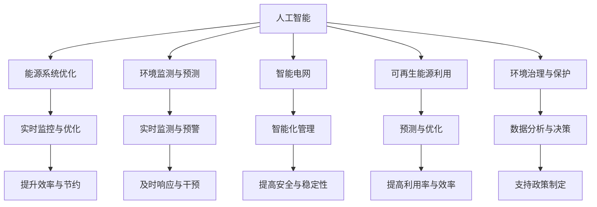

                 

# 人工智能在能源和环境中的应用

> 关键词：人工智能, 能源, 环境, 优化, 预测, 可持续, 绿色技术

## 1. 背景介绍

### 1.1 问题由来
随着全球人口的不断增长和工业化的加速，能源和环境问题愈发严峻。能源短缺、环境污染、气候变化等全球性问题，正成为人类社会可持续发展的巨大挑战。面对这一系列问题，传统的解决方案显得力不从心，亟需全新的技术和方法来提供有效支持。

人工智能(AI)作为一种前沿科技，在数据处理、模式识别、决策优化等方面具有独特优势。其在能源和环境领域的应用，有望为我们应对复杂挑战提供新的思路和方法。

### 1.2 问题核心关键点
人工智能在能源和环境中的应用主要体现在以下几个方面：

- 能源系统优化：利用AI技术对能源生产和消费过程进行实时监控和优化，提升能源利用效率，减少浪费。
- 环境监测与预测：借助AI算法对大气、水质、土壤等环境要素进行监测和预测，及时发现环境问题并采取措施。
- 智能电网：通过AI技术实现电网的智能化管理，优化电力传输和分配，提升电网的安全性和效率。
- 可再生能源利用：利用AI技术对风力、太阳能等可再生能源进行预测和优化，提高其利用率，促进能源结构的转型。
- 环境治理与保护：使用AI技术分析环境数据，识别污染源和潜在风险，辅助制定环境治理策略。

这些应用不仅能够提升能源和环境管理的智能化水平，还能推动可持续发展，实现人与自然的和谐共生。

### 1.3 问题研究意义
研究人工智能在能源和环境中的应用，对于应对全球气候变化、推动绿色低碳转型、提升能源利用效率具有重要意义：

- 减少环境污染：通过环境监测和治理，AI可以显著降低工业废气、废水、固体废弃物等污染物的排放，改善空气和水质。
- 提高能源利用率：利用AI进行能源管理优化，可大幅提高能源利用效率，减少能源浪费，降低碳排放。
- 促进可持续发展：AI在能源和环境中的应用，能够推动能源结构的清洁化和多样化，支持低碳经济发展。
- 增强环境预警和应对能力：通过预测模型，AI能提前发现环境风险，提供科学依据，提高环境应急响应能力。
- 优化能源和环境政策制定：AI技术可以辅助政府和企业制定更科学、更精准的能源和环境政策，指导实际行动。

总之，AI在能源和环境中的应用，对于构建一个更加绿色、可持续的未来社会，具有不可替代的重要价值。

## 2. 核心概念与联系

### 2.1 核心概念概述

为更好地理解人工智能在能源和环境中的应用，本节将介绍几个密切相关的核心概念：

- 人工智能(AI)：利用计算机算法和数据技术，使机器具备类似人类智能的能力。涵盖机器学习、深度学习、自然语言处理、计算机视觉等多个领域。
- 能源系统(Energy System)：涉及能源的生产、传输、分配、消费等环节，包括化石能源、可再生能源、电网等。
- 环境监测(Environment Monitoring)：通过传感器、无人机、卫星等技术手段，对大气、水质、土壤等环境要素进行实时监测。
- 预测模型(Prediction Model)：利用历史数据和机器学习算法，对未来事件进行预测。广泛应用于能源和环境领域，如负荷预测、环境污染预测等。
- 智能电网(Smart Grid)：将先进的通信、信息和控制技术应用于电网管理，实现电网的智能化和高效化。
- 可持续(Sustainable)：强调在满足当前需求的同时，不损害后代满足需求的能力。AI在能源和环境中的应用，旨在推动可持续发展的目标。
- 绿色技术(Green Technology)：旨在减少对环境的负面影响，推动资源循环利用、能源清洁化等。

这些核心概念之间的逻辑关系可以通过以下Mermaid流程图来展示：



这个流程图展示了大语言模型的核心概念及其之间的关系：

1. 人工智能通过优化能源系统、监测环境、管理智能电网、利用可再生能源和治理环境，推动可持续发展。
2. 实时监控与优化、实时监测与预警、智能化管理、预测与优化、数据分析与决策等环节，共同构成人工智能在能源和环境中的具体应用。
3. 这些应用相互支持，共同提升能源和环境管理的智能化水平，助力可持续发展的目标实现。

## 3. 核心算法原理 & 具体操作步骤
### 3.1 算法原理概述

人工智能在能源和环境中的应用，通常涉及数据收集、数据处理、模型训练、模型应用等多个环节。其核心算法原理如下：

1. **数据收集与处理**：
   - 通过传感器、监控设备、无人机、卫星等技术手段，实时获取能源和环境数据。
   - 数据预处理，包括数据清洗、归一化、特征工程等，为模型训练做准备。

2. **模型训练**：
   - 利用机器学习、深度学习等算法，训练预测模型，如回归模型、分类模型、神经网络模型等。
   - 模型训练通常需要大量标注数据，可以利用监督学习、半监督学习等方法进行训练。

3. **模型应用**：
   - 将训练好的模型应用于实际问题，如能源管理优化、环境监测与预测、智能电网控制等。
   - 实时监测与反馈，根据模型预测结果，动态调整能源和环境管理策略。

### 3.2 算法步骤详解

人工智能在能源和环境中的应用，一般包括以下几个关键步骤：

**Step 1: 数据收集与预处理**
- 收集能源和环境相关的数据，如电力负荷、气温、湿度、水质等。
- 进行数据清洗，去除噪声和异常值。
- 进行特征工程，提取有意义的特征，如气温、湿度、光照强度等。

**Step 2: 模型训练**
- 选择合适的机器学习或深度学习模型，如随机森林、支持向量机、卷积神经网络(CNN)、循环神经网络(RNN)、长短期记忆网络(LSTM)等。
- 利用历史数据，对模型进行训练，调整超参数，优化模型性能。
- 应用交叉验证、网格搜索等技术，选择合适的模型参数。

**Step 3: 模型应用与验证**
- 将训练好的模型应用于实际问题，进行实时监测与优化、预测与预警等。
- 在验证集上评估模型性能，确保模型泛化能力强。
- 根据实际效果，进行模型调优，迭代改进。

**Step 4: 部署与监控**
- 将模型部署到生产环境中，进行实际应用。
- 实时监测模型性能，确保模型持续稳定运行。
- 根据反馈结果，不断调整模型参数，提升模型精度。

### 3.3 算法优缺点

人工智能在能源和环境中的应用，具有以下优点：
1. 数据驱动：利用大量历史数据，进行智能分析和决策，提升能源和环境管理的智能化水平。
2. 实时响应：能够实现实时监控和反馈，及时调整能源和环境管理策略，提高响应速度。
3. 精度高：采用先进算法，如深度学习，能够获得高精度的预测和分析结果。
4. 可扩展性强：通过分布式计算、云计算等技术，可以扩展模型应用范围和处理能力。

同时，也存在一些局限性：
1. 数据质量依赖：模型预测和决策的精度，高度依赖数据的质量和完整性。
2. 模型复杂度高：深度学习模型结构复杂，训练和优化难度大。
3. 部署成本高：需要高性能计算设备和网络资源，部署成本较高。
4. 黑盒问题：部分算法模型难以解释其内部决策过程，不够透明。
5. 安全性问题：数据泄露和模型攻击可能导致严重的后果，需加强安全防护。

尽管存在这些局限性，但人工智能在能源和环境中的应用，其巨大的潜力和应用前景不容忽视。

### 3.4 算法应用领域

人工智能在能源和环境中的应用，覆盖了能源管理、环境监测、智能电网、可再生能源等多个领域，具体如下：

**能源管理优化**
- 预测电力负荷：利用历史负荷数据和天气预报，预测未来负荷变化。
- 能源分配优化：通过机器学习算法，优化能源分配策略，减少浪费。
- 需求响应：根据实时数据，调整用户负荷，避免电网过载。

**环境监测与预测**
- 空气质量监测：实时监测PM2.5、PM10等污染物浓度，预测未来污染趋势。
- 水质监测：监测河流、湖泊水质，预测污染扩散情况。
- 土壤监测：监测土壤湿度、温度等参数，预测土壤健康状况。

**智能电网**
- 负荷预测：利用机器学习模型，预测电力负荷变化，优化电网调度。
- 智能调度：根据负荷预测结果，动态调整电网运行策略，提高供电可靠性。
- 电网安全监测：利用传感器技术，实时监测电网状态，预防事故发生。

**可再生能源利用**
- 风力发电预测：预测风力发电输出，优化风电场运行策略。
- 太阳能发电预测：预测太阳能发电输出，优化太阳能电站运行。
- 智能调度：根据可再生能源输出预测，调整电网负荷分配。

**环境治理与保护**
- 污染源识别：利用数据分析，识别污染源和污染物种类。
- 环境风险预警：基于历史数据和实时监测，预警环境风险，提前采取措施。
- 环境政策制定：利用数据分析，辅助制定环境保护政策，优化治理策略。

这些领域的应用，不仅能够提升能源和环境管理的智能化水平，还能推动可持续发展，实现人与自然的和谐共生。

## 4. 数学模型和公式 & 详细讲解 & 举例说明
### 4.1 数学模型构建

人工智能在能源和环境中的应用，通常涉及多个领域的数据分析和预测模型。这里以能源负荷预测为例，介绍其数学模型构建。

假设能源负荷数据为 $\{X_t\}_{t=1}^N$，其中 $X_t$ 为第 $t$ 天的负荷值。基于历史数据，我们希望建立一个线性回归模型，预测未来一天的负荷值 $X_{t+1}$。

设预测模型为 $X_{t+1} = f(X_t, \theta)$，其中 $\theta$ 为模型参数。线性回归模型的一般形式为：

$$
X_{t+1} = \theta_0 + \theta_1 X_t + \epsilon_t
$$

其中 $\theta_0$ 为截距，$\theta_1$ 为斜率，$\epsilon_t$ 为随机误差。

利用最小二乘法，我们可以求解 $\theta_0$ 和 $\theta_1$，使预测误差最小化：

$$
\hat{\theta} = \arg\min_{\theta} \sum_{t=1}^N (X_{t+1} - f(X_t, \theta))^2
$$

### 4.2 公式推导过程

利用最小二乘法，求解线性回归模型参数 $\theta_0$ 和 $\theta_1$ 的公式推导如下：

首先，定义误差函数：

$$
J(\theta) = \frac{1}{2N} \sum_{t=1}^N (X_{t+1} - \hat{X}_t)^2
$$

其中 $\hat{X}_t = \theta_0 + \theta_1 X_t$。

然后，求误差函数对 $\theta_0$ 和 $\theta_1$ 的偏导数：

$$
\frac{\partial J(\theta)}{\partial \theta_0} = \frac{1}{N} \sum_{t=1}^N (X_{t+1} - \hat{X}_t) = 0
$$

$$
\frac{\partial J(\theta)}{\partial \theta_1} = \frac{1}{N} \sum_{t=1}^N (X_{t+1} - \hat{X}_t)X_t = 0
$$

解上述方程组，得到：

$$
\hat{\theta}_0 = \frac{1}{N} \sum_{t=1}^N X_{t+1}
$$

$$
\hat{\theta}_1 = \frac{1}{N} \sum_{t=1}^N (X_{t+1} - \hat{\theta}_0)X_t
$$

### 4.3 案例分析与讲解

以某城市电力负荷预测为例，解释线性回归模型的应用。

假设我们收集了该城市过去一年的电力负荷数据，共365天的负荷值。利用上述线性回归模型，对未来一天的负荷进行预测。

**Step 1: 数据准备**
- 收集过去一年的负荷数据 $\{X_t\}_{t=1}^{365}$。
- 计算截距 $\hat{\theta}_0 = \frac{1}{365} \sum_{t=1}^{365} X_{t+1}$。

**Step 2: 模型训练**
- 利用历史数据，计算斜率 $\hat{\theta}_1 = \frac{1}{365} \sum_{t=1}^{365} (X_{t+1} - \hat{\theta}_0)X_t$。

**Step 3: 模型应用**
- 利用训练好的模型 $\hat{X}_{t+1} = \hat{\theta}_0 + \hat{\theta}_1 X_t$，对未来一天的负荷进行预测。

**Step 4: 模型验证**
- 在验证集上评估模型性能，如均方误差(MSE)、均方根误差(RMSE)等指标。
- 根据评估结果，调整模型参数，提升模型精度。

## 5. 项目实践：代码实例和详细解释说明
### 5.1 开发环境搭建

在进行项目实践前，我们需要准备好开发环境。以下是使用Python进行Scikit-Learn和TensorFlow开发的环境配置流程：

1. 安装Anaconda：从官网下载并安装Anaconda，用于创建独立的Python环境。

2. 创建并激活虚拟环境：
```bash
conda create -n ai-env python=3.8 
conda activate ai-env
```

3. 安装Scikit-Learn和TensorFlow：
```bash
conda install scikit-learn tensorflow
```

4. 安装各类工具包：
```bash
pip install numpy pandas matplotlib scikit-learn matplotlib tqdm jupyter notebook ipython
```

完成上述步骤后，即可在`ai-env`环境中开始项目实践。

### 5.2 源代码详细实现

这里以能源负荷预测为例，给出使用Scikit-Learn进行线性回归模型的PyTorch代码实现。

首先，定义数据处理函数：

```python
import numpy as np
import pandas as pd
from sklearn.model_selection import train_test_split
from sklearn.linear_model import LinearRegression
from sklearn.metrics import mean_squared_error

def load_data(path):
    data = pd.read_csv(path, index_col=0, parse_dates=True)
    return data

def preprocess_data(data):
    data = data.dropna().reindex(data.index[::5]) # 只保留每5分钟的数据
    X = data.index.to_frame('time').drop(['time'], axis=1)
    X.columns = ['t'] # 定义t为时间变量
    X = X.copy().values
    y = data['load']
    return X, y

def train_test_split(X, y, test_size=0.2, random_state=42):
    X_train, X_test, y_train, y_test = train_test_split(X, y, test_size=test_size, random_state=random_state)
    return X_train, X_test, y_train, y_test

def train_model(X_train, y_train, X_test, y_test):
    model = LinearRegression()
    model.fit(X_train, y_train)
    y_pred = model.predict(X_test)
    rmse = np.sqrt(mean_squared_error(y_test, y_pred))
    return model, rmse
```

然后，定义训练和评估函数：

```python
def evaluate_model(model, X_test, y_test):
    y_pred = model.predict(X_test)
    mse = mean_squared_error(y_test, y_pred)
    rmse = np.sqrt(mse)
    return mse, rmse
```

最后，启动训练流程并在测试集上评估：

```python
import matplotlib.pyplot as plt

# 加载数据
data = load_data('load.csv')

# 数据预处理
X, y = preprocess_data(data)

# 划分训练集和测试集
X_train, X_test, y_train, y_test = train_test_split(X, y, test_size=0.2, random_state=42)

# 模型训练
model = train_model(X_train, y_train, X_test, y_test)

# 模型评估
mse, rmse = evaluate_model(model, X_test, y_test)
print(f'Mean Squared Error: {mse:.3f}')
print(f'Root Mean Squared Error: {rmse:.3f}')

# 可视化
plt.plot(y_test)
plt.plot(y_pred)
plt.show()
```

以上就是使用Scikit-Learn对能源负荷预测进行线性回归模型的完整代码实现。可以看到，Scikit-Learn的封装使得模型训练和评估变得简洁高效。

### 5.3 代码解读与分析

让我们再详细解读一下关键代码的实现细节：

**load_data函数**：
- 读取能源负荷数据，以时间为索引，解析为Pandas DataFrame格式。

**preprocess_data函数**：
- 对数据进行清洗，去除缺失值，并只保留每5分钟的数据。
- 定义时间变量t，将原始数据转换为Pandas DataFrame格式。

**train_test_split函数**：
- 使用Scikit-Learn的train_test_split方法，将数据集划分为训练集和测试集。
- 可以设置测试集大小和随机种子，确保每次划分结果一致。

**train_model函数**：
- 创建线性回归模型，拟合训练集数据，预测测试集数据。
- 计算模型预测误差，返回模型和均方根误差。

**evaluate_model函数**：
- 计算模型预测误差，返回均方误差和均方根误差。
- 可视化真实值和预测值，便于直观了解模型效果。

**训练流程**：
- 加载数据，进行预处理和数据集划分。
- 调用train_model函数训练模型，并计算均方根误差。
- 调用evaluate_model函数评估模型，输出误差指标。
- 可视化预测结果，便于后续分析和改进。

可以看到，Scikit-Learn使得模型训练和评估过程变得简洁高效。开发者可以将更多精力放在数据处理、模型改进等高层逻辑上，而不必过多关注底层的实现细节。

当然，工业级的系统实现还需考虑更多因素，如模型的保存和部署、超参数的自动搜索、更灵活的任务适配层等。但核心的模型训练和评估范式基本与此类似。

## 6. 实际应用场景
### 6.1 智能电网

智能电网是人工智能在能源领域的重要应用之一。通过AI技术，可以实现电网的智能化管理，优化电力传输和分配，提升电网的安全性和效率。

智能电网系统通常包括以下几个关键组件：

1. **数据采集与监测**
   - 利用传感器、监控设备、无人机等技术手段，实时获取电网状态数据。
   - 数据预处理，包括数据清洗、归一化、特征提取等。

2. **负荷预测**
   - 利用机器学习算法，预测未来电力负荷变化。
   - 基于负荷预测结果，优化电网调度，减少浪费，提高供电可靠性。

3. **智能调度**
   - 根据负荷预测结果，动态调整电网运行策略。
   - 利用优化算法，优化电力传输和分配，提高电网效率。

4. **电网安全监测**
   - 实时监测电网状态，预警潜在的风险和故障。
   - 结合专家知识，制定应急响应策略，保障电网安全。

### 6.2 风力发电预测

风力发电是可再生能源的重要组成部分，但其发电效率受天气等自然因素影响较大。利用AI技术，可以提升风力发电的预测精度，优化风电场运行策略。

风力发电预测通常包括以下几个关键步骤：

1. **数据收集与预处理**
   - 收集风力发电场的历史气象数据，如风速、气温、湿度等。
   - 进行数据清洗和归一化，提取有意义的特征，如风速、风向等。

2. **模型训练**
   - 利用历史数据，训练机器学习模型，如回归模型、神经网络模型等。
   - 优化模型参数，提升预测精度。

3. **模型应用**
   - 利用训练好的模型，对未来风力发电进行预测。
   - 根据预测结果，优化风电场运行策略，提高发电效率。

4. **模型验证与优化**
   - 在验证集上评估模型性能，如均方误差、均方根误差等指标。
   - 根据评估结果，调整模型参数，提升预测精度。

### 6.3 环境监测与治理

环境监测与治理是人工智能在环境领域的重要应用之一。通过AI技术，可以实现对大气、水质、土壤等环境要素的实时监测和预警，辅助环境治理决策。

环境监测与治理通常包括以下几个关键步骤：

1. **数据收集与预处理**
   - 利用传感器、无人机、卫星等技术手段，实时获取环境数据。
   - 进行数据清洗和归一化，提取有意义的特征，如PM2.5浓度、水质指标等。

2. **模型训练**
   - 利用历史数据，训练机器学习模型，如回归模型、分类模型、神经网络模型等。
   - 优化模型参数，提升预测精度。

3. **环境监测**
   - 实时监测环境数据，预警环境风险。
   - 结合专家知识，制定环境治理策略。

4. **环境政策制定**
   - 利用数据分析，辅助制定环境保护政策。
   - 优化环境治理措施，推动可持续发展。

### 6.4 未来应用展望

随着人工智能技术的不断发展，其在能源和环境领域的应用前景将更加广阔：

1. **智能电网**
   - 利用AI技术，实现电网的智能化管理，优化电力传输和分配，提升电网的安全性和效率。
   - 通过实时监测和预测，提升电网应急响应能力，保障电力供应安全。

2. **可再生能源利用**
   - 利用AI技术，提升风力、太阳能等可再生能源的预测精度，优化能源分配策略。
   - 结合优化算法，提高能源利用效率，推动能源结构的清洁化。

3. **环境监测与治理**
   - 利用AI技术，实时监测环境数据，预警环境风险，辅助环境治理决策。
   - 利用数据分析，制定科学的环境政策，推动环境保护和可持续发展。

4. **智慧城市**
   - 通过AI技术，实现城市能源、交通、公共安全等方面的智能化管理，提升城市治理水平。
   - 利用大数据和AI算法，优化城市资源配置，提高城市运行效率。

5. **工业能效优化**
   - 利用AI技术，优化工业生产过程中的能源使用，提高能源利用效率。
   - 结合工业物联网技术，实现对生产设备的实时监控和维护。

以上应用场景展示了人工智能在能源和环境领域的广泛应用，有助于推动社会的可持续发展，构建更加绿色、和谐的未来社会。

## 7. 工具和资源推荐
### 7.1 学习资源推荐

为了帮助开发者系统掌握人工智能在能源和环境中的应用，这里推荐一些优质的学习资源：

1. 《人工智能与能源管理》系列博文：由能源领域专家撰写，系统讲解了人工智能在能源管理中的应用，如智能电网、可再生能源预测等。

2. 《环境监测与预测》课程：清华大学开设的在线课程，介绍了环境监测与预测的基本原理和实用方法，包括机器学习、深度学习等技术。

3. 《人工智能与环境治理》书籍：环境领域专家所著，全面介绍了人工智能在环境监测、治理和保护中的应用。

4. TensorFlow官方文档：TensorFlow的官方文档，提供了丰富的机器学习算法和模型实现，适合快速学习。

5. PyTorch官方文档：PyTorch的官方文档，提供了强大的深度学习框架和模型实现，适合系统学习。

通过这些资源的学习实践，相信你一定能够快速掌握人工智能在能源和环境中的应用，并用于解决实际问题。

### 7.2 开发工具推荐

高效的开发离不开优秀的工具支持。以下是几款用于人工智能在能源和环境领域开发常用的工具：

1. Scikit-Learn：Python的机器学习库，提供了丰富的机器学习算法和模型实现，适合快速实验和调试。

2. TensorFlow：由Google主导开发的深度学习框架，支持分布式计算和云计算，适合大规模工程应用。

3. PyTorch：由Facebook主导的深度学习框架，灵活易用，支持动态计算图，适合研究和原型开发。

4. Weights & Biases：模型训练的实验跟踪工具，可以记录和可视化模型训练过程中的各项指标，方便对比和调优。

5. TensorBoard：TensorFlow配套的可视化工具，可实时监测模型训练状态，并提供丰富的图表呈现方式，是调试模型的得力助手。

合理利用这些工具，可以显著提升人工智能在能源和环境领域应用的开发效率，加快创新迭代的步伐。

### 7.3 相关论文推荐

人工智能在能源和环境领域的研究源于学界的持续探索。以下是几篇奠基性的相关论文，推荐阅读：

1. AI-Powered Energy System Optimization：介绍利用AI技术进行能源系统优化的研究成果，涵盖了智能电网、可再生能源预测等。

2. Machine Learning for Environmental Monitoring：阐述了利用机器学习技术进行环境监测和预测的方法，如水质监测、空气质量预测等。

3. Deep Learning for Smart Grid Management：介绍利用深度学习技术进行智能电网管理的研究，包括负荷预测、智能调度等。

4. AI in Renewable Energy Utilization：探讨了利用AI技术提升风力、太阳能等可再生能源利用效率的研究，包括预测、优化等。

这些论文代表了大语言模型在能源和环境领域的研究进展，通过学习这些前沿成果，可以帮助研究者把握学科前进方向，激发更多的创新灵感。

## 8. 总结：未来发展趋势与挑战
### 8.1 总结

本文对人工智能在能源和环境中的应用进行了全面系统的介绍。首先阐述了能源和环境问题的重要性，明确了人工智能在其中的关键作用。其次，从原理到实践，详细讲解了人工智能在能源和环境中的具体应用，如能源管理优化、环境监测与预测、智能电网、可再生能源利用等。最后，本文探讨了人工智能在能源和环境领域的应用前景，展望了未来的发展方向。

通过本文的系统梳理，可以看到，人工智能在能源和环境中的应用，不仅能够提升能源和环境管理的智能化水平，还能推动可持续发展，实现人与自然的和谐共生。未来，伴随人工智能技术的持续演进，其在能源和环境领域的应用将更加广泛和深入。

### 8.2 未来发展趋势

展望未来，人工智能在能源和环境领域的应用将呈现以下几个发展趋势：

1. **智能化与自动化的提升**
   - 通过AI技术，实现能源和环境管理的智能化和自动化，提高效率和精度。
   - 利用深度学习、强化学习等技术，进一步优化能源和环境决策。

2. **数据驱动与模型驱动的融合**
   - 利用大数据技术，整合多源异构数据，提升模型预测和决策能力。
   - 结合领域知识和专家经验，优化模型的训练和优化策略。

3. **跨领域融合与创新**
   - 将AI技术与其他技术，如物联网、区块链、5G等进行融合，拓展应用场景。
   - 探索新的应用领域，如智能家居、智慧农业、智慧交通等。

4. **模型优化与参数高效化**
   - 开发更加参数高效的模型，提高模型的计算效率和部署速度。
   - 结合知识蒸馏、迁移学习等技术，提升模型的泛化能力和适应性。

5. **安全与隐私保护**
   - 加强数据安全和隐私保护，防止数据泄露和模型攻击。
   - 引入伦理道德约束，确保AI技术的公平性、透明性和安全性。

6. **可解释性与可控性**
   - 开发可解释性强的AI模型，提高模型的可理解性和可信度。
   - 通过可控性增强，提高模型的鲁棒性和稳定性。

### 8.3 面临的挑战

尽管人工智能在能源和环境领域的应用前景广阔，但在实际应用中也面临一些挑战：

1. **数据获取与处理**
   - 能源和环境领域的数据获取成本高、处理难度大，数据质量依赖于数据源的可靠性和一致性。
   - 需要结合领域知识和专家经验，选择合适的数据集和预处理策略。

2. **模型复杂性与优化**
   - 深度学习模型的结构复杂，训练和优化难度大，需要大量的计算资源和时间。
   - 需要结合专家知识和领域数据，选择适合的模型架构和训练策略。

3. **技术融合与协同**
   - AI技术与现有系统的融合，需要考虑技术协同和接口设计问题。
   - 需要引入标准化规范和互操作性技术，提高系统的兼容性和可扩展性。

4. **安全与隐私**
   - 数据泄露和模型攻击可能导致严重的后果，需加强安全防护。
   - 需要引入伦理道德约束，确保AI技术的公平性、透明性和安全性。

5. **可解释性与可控性**
   - AI模型的内部工作机制难以解释，不够透明。
   - 需要开发可解释性强的AI模型，提高模型的可理解性和可信度。

6. **实际应用中的复杂性**
   - 实际应用中的环境复杂多变，AI模型的适应性和鲁棒性不足。
   - 需要结合领域知识和专家经验，优化模型的训练和优化策略。

### 8.4 研究展望

面对人工智能在能源和环境领域所面临的挑战，未来的研究需要在以下几个方面寻求新的突破：

1. **无监督与半监督学习**
   - 探索无监督和半监督学习范式，降低对标注数据的依赖，提升模型的泛化能力。

2. **参数高效与计算高效**
   - 开发更加参数高效的模型，提高模型的计算效率和部署速度。

3. **跨领域融合与创新**
   - 将AI技术与其他技术，如物联网、区块链、5G等进行融合，拓展应用场景。

4. **模型优化与鲁棒性增强**
   - 结合知识蒸馏、迁移学习等技术，提升模型的泛化能力和鲁棒性。

5. **可解释性与可控性**
   - 开发可解释性强的AI模型，提高模型的可理解性和可信度。

6. **安全与隐私保护**
   - 引入伦理道德约束，确保AI技术的公平性、透明性和安全性。

通过这些研究方向的探索，人工智能在能源和环境领域的应用将更加广泛和深入，为构建一个更加绿色、可持续的未来社会提供强有力的技术支撑。

## 9. 附录：常见问题与解答

**Q1：人工智能在能源和环境中的应用是否仅限于预测与优化？**

A: 人工智能在能源和环境中的应用不仅限于预测与优化，还包括数据收集、数据处理、模型训练、模型应用等多个环节。这些环节相互支持，共同提升能源和环境管理的智能化水平。

**Q2：人工智能在能源和环境中的应用是否存在局限性？**

A: 人工智能在能源和环境中的应用存在一些局限性，如数据获取与处理难度大、模型复杂度高等。需要结合领域知识和专家经验，优化数据处理和模型训练策略，才能充分发挥AI技术的作用。

**Q3：人工智能在能源和环境中的应用是否需要跨领域融合？**

A: 人工智能在能源和环境中的应用需要跨领域融合，如将AI技术与物联网、区块链、5G等技术进行融合，拓展应用场景。这样可以提升AI技术的适用性和灵活性，实现更广泛的应用。

**Q4：人工智能在能源和环境中的应用是否需要可解释性强的模型？**

A: 人工智能在能源和环境中的应用需要可解释性强的模型，提高模型的可理解性和可信度。这样可以在实际应用中更好地解释AI决策过程，增强模型的透明度和可靠性。

**Q5：人工智能在能源和环境中的应用是否需要结合伦理道德约束？**

A: 人工智能在能源和环境中的应用需要结合伦理道德约束，确保AI技术的公平性、透明性和安全性。这样可以防止AI技术被滥用，保护环境和公共利益。

通过本文的系统梳理，可以看到，人工智能在能源和环境中的应用，具有巨大的潜力和广阔的前景。随着技术的发展和应用的深入，AI技术必将在能源和环境领域发挥更大的作用，推动社会的可持续发展。

