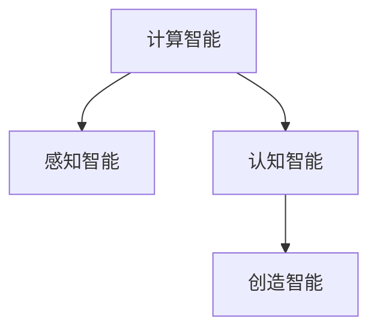
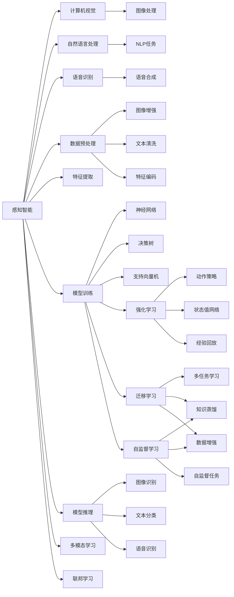

                 

## 1. 背景介绍

人工智能(AI)技术自诞生以来，经历了从专家系统、统计学习、深度学习、强化学习等不同的发展阶段。每一次技术的突破，都带来了应用领域的拓展和新一轮的产业变革。展望未来，AI技术将继续演进，从计算智能、感知智能，迈向认知智能、创造智能。本文将系统梳理AI技术的发展脉络，深入探讨其未来方向与挑战。

## 2. 核心概念与联系

### 2.1 核心概念概述

为更好地理解人工智能的未来发展方向，首先需要澄清几个核心概念：

- **计算智能(Computational Intelligence, CI)**：以数据和算法为基础，通过计算和逻辑推理解决特定问题的智能。主要包括传统机器学习、深度学习等方法。

- **感知智能(Perceptual Intelligence, PI)**：通过传感器、摄像头、麦克风等设备获取环境信息，结合感知模型进行环境理解和交互。主要涉及计算机视觉、自然语言处理、语音识别等领域。

- **认知智能(Cognitive Intelligence, COI)**：模拟人类认知过程，理解、记忆、推理、学习和决策。主要涉及知识图谱、推理机、图神经网络等技术。

- **创造智能(Creative Intelligence, CI)**：超越现有知识，进行原创性、创新性的思考和创作。涉及生成模型、对抗网络、创新算法等前沿方法。

这些概念之间的关系可以通过以下Mermaid流程图来展示：



该流程图展示了从计算智能到创造智能的递进关系。

### 2.2 核心概念原理和架构的 Mermaid 流程图



该流程图示例了感知智能中常见的组件和算法架构，包括计算机视觉、自然语言处理和语音识别的各个环节。

## 3. 核心算法原理 & 具体操作步骤

### 3.1 算法原理概述

人工智能的未来发展将沿着认知智能和创造智能的方向推进，其中认知智能和感知智能是基础，而创造智能是更高层次的目标。本文将重点探讨这一过程的算法原理和具体操作步骤。

### 3.2 算法步骤详解

**Step 1: 感知智能技术提升**
- **计算机视觉**：通过深度学习技术提升图像识别、目标检测、语义分割等能力，引入生成对抗网络(GANs)提高图像生成和修复效果。
- **自然语言处理**：利用BERT、GPT等预训练模型提升语言理解、情感分析、机器翻译等能力，采用Transformer结构优化模型推理效率。
- **语音识别**：借助WaveNet、Tacotron等模型提升语音合成和识别的自然度，引入声纹识别、语音情绪分析等新应用。

**Step 2: 认知智能技术构建**
- **知识图谱**：基于RDF等标准，构建大规模知识库，引入深度学习模型进行知识抽取和关系推理。
- **推理机**：结合规则引擎和神经网络，实现自动推理和逻辑演绎，支持复杂任务决策。
- **图神经网络(GNN)**：引入图卷积网络(GCN)等技术，对非结构化数据进行高效建模和分析。

**Step 3: 创造智能技术探索**
- **生成模型**：使用GANs、VAE等模型生成高质量的图像、音频、视频等内容，辅助创作和设计。
- **对抗网络**：开发对抗生成网络(GANs)和对抗训练技术，提升模型的鲁棒性和攻击抵御能力。
- **创新算法**：引入基于增强学习的创新算法，如NeuroEvolution、GANs等，推动人工智能的边界扩展和应用创新。

### 3.3 算法优缺点

认知智能和感知智能技术的发展，使得AI系统具备了更强的理解和交互能力。然而，这些技术也存在以下缺点：

- **数据依赖**：这些技术依赖于大量高质量标注数据和复杂模型，对数据量和算力要求较高。
- **解释性不足**：黑盒模型难以解释内部推理过程，不利于用户理解和信任。
- **鲁棒性有限**：面对噪声、异常数据等情况，模型的鲁棒性还有待提升。
- **知识泛化能力有限**：现有模型难以灵活应用跨领域、跨模态的知识，需要更多协同智能技术的支持。

### 3.4 算法应用领域

感知智能和认知智能技术已经广泛应用于多个行业和场景，例如：

- **智慧医疗**：利用计算机视觉进行影像诊断，使用自然语言处理进行病历分析，通过推理机辅助医生决策。
- **自动驾驶**：通过计算机视觉进行环境感知，使用自然语言处理进行导航和交互，结合推理机实现决策和控制。
- **智能客服**：采用自然语言处理进行语音识别和对话生成，利用推理机进行问题分析和知识查询。
- **金融风控**：利用计算机视觉进行欺诈检测，使用自然语言处理进行舆情分析，通过推理机进行风险评估。

## 4. 数学模型和公式 & 详细讲解 & 举例说明

### 4.1 数学模型构建

认知智能和感知智能技术涉及多种数学模型和算法，以下以知识图谱和自然语言处理为例，构建相应的数学模型：

**知识图谱模型**：
- **知识抽取**：使用实体关系抽取模型，将文本信息转化为知识图谱的实体-关系节点。
- **关系推理**：使用基于规则的推理机，或结合深度学习模型进行链推理，构建实体间的多跳推理关系。

**自然语言处理模型**：
- **预训练模型**：如BERT、GPT等，使用自监督学习任务进行预训练，学习语言表示。
- **下游任务模型**：如分类、问答、生成等，使用监督学习任务进行微调，优化特定任务的性能。

### 4.2 公式推导过程

**知识图谱构建**：
$$
G=(V,E) \quad \text{其中} \quad V=\{e_i\}, E=\{(r_{i,j})\}
$$
- 知识图谱由节点集合 $V$ 和边集合 $E$ 构成，节点 $e_i$ 表示实体，边 $(r_{i,j})$ 表示实体间的关系。

**自然语言处理预训练**：
- **自监督学习任务**：如掩码语言模型(Masked Language Model, MLM)、下一句预测(Next Sentence Prediction, NSP)等，使用如下公式进行训练：
$$
\max_{\theta} P(\mathcal{L}_{MLM},\mathcal{L}_{NSP}|\theta)
$$
- **下游任务模型**：如分类任务，使用交叉熵损失函数：
$$
\mathcal{L}=\frac{1}{N} \sum_{i=1}^{N} -y_i \log P(y_i|x_i;\theta)
$$
- **推理机**：结合符号逻辑和神经网络，使用以下公式进行推理：
$$
\text{Inference}=\text{Explanation} + \text{Relevancy} + \text{Consistency}
$$
- **创新算法**：如NeuroEvolution，使用遗传算法对模型参数进行进化，以生成新的创新模型。

### 4.3 案例分析与讲解

**计算机视觉**：使用卷积神经网络(CNN)进行图像分类任务，公式推导如下：
- **数据预处理**：将图像转换为张量，进行标准化处理：
$$
x_{\text{normalized}}=\frac{x_{\text{raw}}-\mu}{\sigma}
$$
- **特征提取**：使用卷积层提取图像特征，使用池化层进行下采样：
$$
x_{\text{features}}=\text{Conv}(x_{\text{normalized}})
$$
- **模型训练**：使用交叉熵损失函数进行监督学习，公式如下：
$$
\mathcal{L}=\frac{1}{N} \sum_{i=1}^{N} -y_i \log P(y_i|x_i;\theta)
$$

**自然语言处理**：使用BERT模型进行情感分析任务，公式推导如下：
- **预训练任务**：在大规模无标签文本上进行掩码语言模型和下一句预测训练：
$$
\max_{\theta} P(\mathcal{L}_{MLM},\mathcal{L}_{NSP}|\theta)
$$
- **下游任务微调**：使用监督学习任务进行情感分类：
$$
\mathcal{L}=\frac{1}{N} \sum_{i=1}^{N} -y_i \log P(y_i|x_i;\theta)
$$

**知识图谱**：使用知识抽取和关系推理模型，公式推导如下：
- **知识抽取**：使用基于深度学习的实体关系抽取模型：
$$
\text{ER}=\text{Embedding}_{\text{token}} + \text{Conv}_{\text{token}} + \text{Pooling}_{\text{token}} + \text{Embedding}_{\text{relation}} + \text{Conv}_{\text{relation}} + \text{Pooling}_{\text{relation}}
$$
- **关系推理**：使用基于规则的推理机，或结合神经网络进行链推理：
$$
\text{Inference}=\text{Explanation} + \text{Relevancy} + \text{Consistency}
$$

## 5. 项目实践：代码实例和详细解释说明

### 5.1 开发环境搭建

要进行AI项目实践，首先需要搭建相应的开发环境。以下是基于Python和PyTorch的开发环境配置步骤：

1. 安装Python：选择Python 3.x版本，安装最新稳定版本。
2. 安装Anaconda：从官网下载并安装Anaconda，用于创建独立的Python环境。
3. 创建并激活虚拟环境：
```bash
conda create -n ai-env python=3.8 
conda activate ai-env
```
4. 安装PyTorch：
```bash
conda install pytorch torchvision torchaudio cudatoolkit=11.1 -c pytorch -c conda-forge
```
5. 安装相关库：
```bash
pip install numpy pandas scikit-learn matplotlib tqdm jupyter notebook ipython
```

完成上述步骤后，即可在`ai-env`环境中开始AI项目实践。

### 5.2 源代码详细实现

以下是使用PyTorch进行自然语言处理和计算机视觉任务开发的代码实例：

**自然语言处理任务：情感分析**

```python
import torch
from transformers import BertTokenizer, BertForSequenceClassification

tokenizer = BertTokenizer.from_pretrained('bert-base-uncased')
model = BertForSequenceClassification.from_pretrained('bert-base-uncased', num_labels=2)

inputs = tokenizer("I love machine learning", return_tensors='pt')
labels = torch.tensor([1], dtype=torch.long)

outputs = model(**inputs, labels=labels)
loss = outputs.loss
logits = outputs.logits
```

**计算机视觉任务：图像分类**

```python
import torch
from torchvision import datasets, transforms, models

# 数据预处理
transform = transforms.Compose([
    transforms.Resize(256),
    transforms.CenterCrop(224),
    transforms.ToTensor(),
    transforms.Normalize(mean=[0.485, 0.456, 0.406], std=[0.229, 0.224, 0.225])
])

# 加载数据集
train_data = datasets.ImageFolder("train", transform=transform)
test_data = datasets.ImageFolder("test", transform=transform)

# 构建数据加载器
train_loader = torch.utils.data.DataLoader(train_data, batch_size=32, shuffle=True)
test_loader = torch.utils.data.DataLoader(test_data, batch_size=32, shuffle=False)

# 加载预训练模型
model = models.resnet18(pretrained=True)

# 替换顶层分类器
num_ftrs = model.fc.in_features
model.fc = torch.nn.Linear(num_ftrs, 2)

# 定义损失函数和优化器
criterion = torch.nn.CrossEntropyLoss()
optimizer = torch.optim.SGD(model.parameters(), lr=0.001, momentum=0.9)

# 训练模型
for epoch in range(10):
    for inputs, labels in train_loader:
        optimizer.zero_grad()
        outputs = model(inputs)
        loss = criterion(outputs, labels)
        loss.backward()
        optimizer.step()
```

### 5.3 代码解读与分析

**自然语言处理任务**：
- 使用BertTokenizer进行文本分词和标准化处理。
- 加载预训练的BertForSequenceClassification模型，并设置2分类任务。
- 使用tokenizer将输入文本转换为模型可接受的格式。
- 进行前向传播计算损失和logits，返回输出。

**计算机视觉任务**：
- 使用torchvision库进行数据预处理和加载。
- 加载预训练的ResNet-18模型，并替换顶层分类器。
- 定义交叉熵损失函数和随机梯度下降优化器。
- 使用数据加载器迭代训练数据，进行模型训练。

## 6. 实际应用场景

### 6.1 智慧医疗

在智慧医疗领域，认知智能和感知智能技术已得到广泛应用，例如：

- **影像诊断**：利用计算机视觉进行图像分割和病变检测，结合自然语言处理进行病历记录和医生笔记。
- **疾病预测**：通过知识图谱进行疾病关联分析，结合推理机进行风险评估和预测。

### 6.2 自动驾驶

自动驾驶系统通过感知智能和认知智能技术实现环境感知、决策规划和控制执行。例如：

- **环境感知**：使用计算机视觉进行对象检测和轨迹预测，结合自然语言处理进行语音交互和导航指令处理。
- **决策规划**：通过知识图谱进行路线规划和障碍物避免，结合推理机进行动态决策。
- **控制执行**：使用自然语言处理进行任务指令理解和执行，结合知识图谱进行动作调度。

### 6.3 智能客服

智能客服系统通过感知智能和认知智能技术实现自动化对话和复杂问题处理。例如：

- **自然语言理解**：利用自然语言处理进行意图识别和实体抽取，结合推理机进行对话理解和问题解答。
- **知识管理**：通过知识图谱进行信息检索和知识推理，结合自然语言处理进行对话生成和推荐。
- **用户交互**：使用自然语言处理进行语音识别和合成，结合知识图谱进行智能推荐和用户引导。

### 6.4 未来应用展望

展望未来，人工智能将在更多领域得到应用，例如：

- **智慧城市**：通过感知智能和认知智能技术进行城市管理、交通调控和环境监测，提高城市运行效率和安全性。
- **智能制造**：利用计算机视觉进行缺陷检测和质量控制，结合知识图谱进行生产规划和资源优化。
- **金融科技**：使用自然语言处理进行舆情分析和情绪监测，结合推理机进行风险评估和交易决策。
- **教育科技**：通过计算机视觉进行学生行为分析，结合知识图谱进行个性化推荐和智能辅导。

## 7. 工具和资源推荐

### 7.1 学习资源推荐

为了帮助开发者系统掌握AI技术的未来发展方向，这里推荐一些优质的学习资源：

1. **《深度学习》课程**：斯坦福大学开设的著名课程，深入浅出地介绍了深度学习的基本概念和前沿技术。
2. **《人工智能导论》书籍**：清华大学郑涌教授的著作，系统介绍了AI技术的原理、算法和应用。
3. **《人工智能的未来》博客**：作者撰写的一系列文章，涵盖AI技术的历史、现状和未来方向。
4. **Google AI博客**：谷歌AI团队的官方博客，发布最新研究进展和技术分享。
5. **HuggingFace官方文档**：Transformer库的官方文档，提供了海量预训练模型和微调范式，适合初学者和专家学习。

### 7.2 开发工具推荐

高效的开发离不开优秀的工具支持。以下是几款用于AI开发常用的工具：

1. **Anaconda**：免费的Python发行版，包含科学计算库和数据分析工具，便于快速搭建开发环境。
2. **Jupyter Notebook**：开源的交互式笔记本，支持Python、R等语言，适合实验和展示。
3. **TensorBoard**：谷歌开源的可视化工具，可实时监测模型训练状态，提供丰富的图表呈现方式。
4. **Weights & Biases**：实验跟踪工具，记录和可视化模型训练过程中的各项指标，方便对比和调优。
5. **PyTorch Lightning**：基于PyTorch的快速开发框架，支持多GPU训练和模型并行，适合大规模模型训练。

### 7.3 相关论文推荐

以下是几篇奠基性的相关论文，推荐阅读：

1. **AlphaGo**：DeepMind开发的围棋AI程序，展示了强化学习在复杂决策问题中的潜力。
2. **GANs**：Goodfellow等提出的生成对抗网络，推动了生成模型的研究和应用。
3. **NeuroEvolution**：E cannon-Baker等提出的进化算法，用于生成和优化神经网络模型。
4. **Inception**：Google提出的多尺度卷积网络，提高了图像分类和目标检测的效果。
5. **BERT**：Google提出的预训练语言模型，提升了自然语言处理的精度和泛化能力。

## 8. 总结：未来发展趋势与挑战

### 8.1 研究成果总结

本文系统梳理了AI技术的未来发展方向，涵盖了感知智能、认知智能和创造智能的各个方面。通过深入探讨其算法原理和具体操作步骤，提供了实用的代码实例和详细分析。同时，通过实际应用场景的展示，展现了AI技术在不同领域的应用前景。最后，推荐了丰富的学习资源和开发工具，为读者提供了全方位的技术指引。

### 8.2 未来发展趋势

展望未来，AI技术将继续演进，从计算智能、感知智能，迈向认知智能、创造智能。以下是未来发展的主要趋势：

1. **多模态智能**：结合视觉、听觉、触觉等多种模态数据，构建更全面的感知智能系统。
2. **知识驱动智能**：构建大规模知识图谱，结合推理机和深度学习，提升智能系统的认知能力。
3. **创新算法**：开发新的生成算法和增强学习算法，推动AI技术边界拓展和应用创新。
4. **协同智能**：结合物联网、区块链等技术，构建分布式、协同的智能系统。
5. **普适智能**：将AI技术应用到更广泛的领域，如智慧农业、智能家居、智能教育等，推动社会进步。

### 8.3 面临的挑战

尽管AI技术发展迅速，但仍面临诸多挑战：

1. **数据依赖**：大规模数据采集和标注是AI技术的基础，但获取高质量标注数据成本高、周期长。
2. **伦理道德**：AI技术可能带来隐私、公平、安全等问题，需要在技术设计和使用过程中加以规范。
3. **可解释性**：黑盒模型难以解释内部推理过程，需要更多的可解释性技术支持。
4. **计算资源**：大规模模型训练和推理需要大量计算资源，硬件成本和技术门槛较高。
5. **鲁棒性**：面对噪声、异常数据等情况，模型的鲁棒性还有待提升。
6. **隐私保护**：在数据处理和存储过程中，需要加强隐私保护和数据安全。

### 8.4 研究展望

面对AI技术的诸多挑战，未来的研究方向应在以下几个方面进行探索：

1. **无监督学习**：减少对标注数据的依赖，利用自监督学习、主动学习等方法提升模型效果。
2. **高效计算**：开发高效计算框架和硬件加速技术，如模型并行、混合精度训练等，降低计算成本。
3. **可解释性**：开发可解释性算法和技术，如注意力机制、因果推断等，增强模型的透明性和可信度。
4. **知识整合**：构建知识图谱和推理引擎，将符号逻辑和神经网络结合，提升知识融合能力。
5. **伦理道德**：加强AI伦理研究，制定AI技术应用规范，保障社会公平和人类价值观。

## 9. 附录：常见问题与解答

**Q1: 什么是人工智能的未来发展方向？**

A: 人工智能的未来发展方向是向认知智能和创造智能迈进。感知智能是认知智能和创造智能的基础，认知智能在认知能力上更进一层，而创造智能则代表着更高级别的智能，能够进行创新和创造。

**Q2: 如何构建认知智能系统？**

A: 构建认知智能系统需要构建大规模知识图谱，并结合推理机进行知识抽取和关系推理。此外，需要使用深度学习模型进行特征提取和模式识别。

**Q3: 人工智能的实际应用场景有哪些？**

A: 人工智能的实际应用场景包括智慧医疗、自动驾驶、智能客服、智慧城市等。这些场景通过感知智能和认知智能技术，实现了自动化和智能化的管理和服务。

**Q4: 人工智能技术在发展过程中面临哪些挑战？**

A: 人工智能技术在发展过程中面临数据依赖、伦理道德、可解释性、计算资源、鲁棒性和隐私保护等挑战。

**Q5: 未来人工智能技术将如何发展？**

A: 未来人工智能技术将朝着多模态智能、知识驱动智能、创新算法、协同智能和普适智能的方向发展。这将进一步提升AI技术的认知能力、创新能力和应用范围。

---

作者：禅与计算机程序设计艺术 / Zen and the Art of Computer Programming

