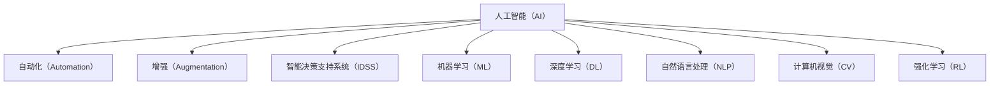

                 

# 人工智能管理：在AI时代重新定义工作

## 1. 背景介绍

### 1.1 问题由来
随着人工智能技术的迅猛发展，AI在各行各业的应用已经变得越来越广泛。从制造业的自动化生产线，到金融行业的智能投顾，再到医疗领域的智能诊断，AI正在深刻地改变着我们的工作方式。然而，AI技术的普及也带来了一系列新的管理挑战。传统的管理方法已经不再适用，亟需重新定义管理模式，以适应AI时代的新要求。

### 1.2 问题核心关键点
人工智能管理的关键在于如何有效利用AI技术提升工作效率，同时管理AI系统的运行，确保其安全性、稳定性和公平性。具体来说，包括以下几个关键点：

1. **工作效率提升**：通过AI自动化处理大量重复性工作，减少人为干预，提高工作效率和准确性。
2. **系统运行管理**：对AI系统的运行状态进行监控和优化，确保其高效稳定运行。
3. **安全性保障**：建立安全机制，防止AI系统被恶意攻击或数据泄露。
4. **公平性考虑**：避免AI系统的决策偏见，确保公平公正。
5. **人机协同**：建立合理的人机协同机制，充分利用AI优势，同时发挥人的创造力和决策能力。

### 1.3 问题研究意义
在AI时代，重新定义管理工作，对于提升企业竞争力、优化资源配置、提高员工满意度等具有重要意义：

1. **提高效率**：通过引入AI技术，自动化处理繁琐、重复的工作，提高整体工作效率。
2. **降低成本**：AI系统的部署和维护成本较低，可以为企业节省大量人力资源和运营成本。
3. **优化决策**：利用AI算法，提升决策的科学性和准确性，减少人为失误和偏见。
4. **增强灵活性**：AI系统可以根据环境变化快速调整策略，提高企业应对市场变化的能力。
5. **改善用户体验**：通过AI技术，提供更加智能、高效的用户服务，提升用户体验。

## 2. 核心概念与联系

### 2.1 核心概念概述

为更好地理解人工智能管理，本节将介绍几个密切相关的核心概念：

- **人工智能（AI）**：利用计算机和算法处理和分析数据，模拟人类智能行为的技术。
- **人工智能管理（AI Management）**：在AI技术的应用过程中，对系统进行监控、优化、决策和协同的管理活动。
- **自动化（Automation）**：通过AI技术自动化处理重复性、标准化工作，减少人工干预。
- **增强（Augmentation）**：利用AI技术提升人类工作能力，增强人机协同。
- **机器人流程自动化（RPA）**：通过AI驱动的软件机器人，自动化执行业务流程，提高效率和准确性。
- **智能决策支持系统（IDSS）**：利用AI算法和数据，辅助决策者进行决策，提高决策的科学性和效率。
- **机器学习（ML）**：利用数据和算法，使机器能够从经验中学习，提升模型性能。
- **深度学习（DL）**：利用多层神经网络，处理和分析复杂数据，模拟人类智能行为。
- **自然语言处理（NLP）**：利用AI技术，理解和处理人类语言，实现人机自然交互。
- **计算机视觉（CV）**：利用AI技术，实现图像和视频的识别、处理和分析。
- **强化学习（RL）**：利用奖励和惩罚机制，使机器能够通过试错学习最优策略。

这些核心概念之间的逻辑关系可以通过以下Mermaid流程图来展示：



这个流程图展示了大语言模型的核心概念及其之间的关系：

1. 人工智能通过自动化处理工作，提高效率和准确性。
2. 增强提升人类工作能力，增强人机协同。
3. 智能决策支持系统辅助决策，提升决策效率。
4. 机器学习和深度学习处理复杂数据，模拟人类智能行为。
5. 自然语言处理和计算机视觉实现人机自然交互。
6. 强化学习通过试错学习最优策略，提升系统性能。

这些概念共同构成了人工智能管理的核心框架，为其在各行业的广泛应用奠定了基础。通过理解这些核心概念，我们可以更好地把握人工智能管理的工作原理和优化方向。

## 3. 核心算法原理 & 具体操作步骤
### 3.1 算法原理概述

人工智能管理涉及多个领域的算法和理论，其中核心的算法原理包括以下几个方面：

- **自动化算法**：通过机器人流程自动化（RPA）技术，将业务流程自动化处理。
- **增强算法**：利用增强学习算法，提升人类工作能力，实现人机协同。
- **智能决策支持算法**：结合机器学习、深度学习和自然语言处理等技术，辅助决策者进行决策。
- **深度学习算法**：利用深度神经网络，处理和分析复杂数据，提升模型性能。
- **强化学习算法**：通过试错学习，使机器能够自适应环境，优化系统性能。

### 3.2 算法步骤详解

人工智能管理的核心步骤包括以下几个方面：

1. **需求分析**：确定企业内部需要自动化处理的具体任务和流程，评估AI技术可行的解决方案。
2. **系统设计**：设计AI系统的架构和功能模块，选择合适的算法和技术。
3. **数据准备**：收集和整理系统所需的数据，进行数据清洗和预处理。
4. **模型训练**：使用机器学习或深度学习算法，训练AI模型，优化模型性能。
5. **系统部署**：将训练好的AI模型部署到生产环境中，进行测试和优化。
6. **系统监控**：对AI系统的运行状态进行监控，及时发现和解决异常问题。
7. **持续优化**：根据系统运行情况和业务需求，不断优化AI模型和系统配置。

### 3.3 算法优缺点

人工智能管理的方法具有以下优点：

1. **效率提升**：通过自动化处理，大大提高工作效率和准确性。
2. **成本降低**：减少人力投入，降低运营成本。
3. **决策优化**：利用数据和算法，提升决策的科学性和效率。
4. **灵活性增强**：AI系统能够快速适应环境变化，提高企业应对市场变化的能力。

同时，这些方法也存在一些局限性：

1. **数据依赖**：AI系统的性能依赖于数据的质量和数量，数据获取和处理成本较高。
2. **技术复杂**：AI系统设计和维护需要专业知识，实施难度较大。
3. **公平性问题**：AI系统的决策可能存在偏见，导致不公平现象。
4. **安全风险**：AI系统可能被恶意攻击或数据泄露，影响系统安全。
5. **人机协同困难**：AI系统的自动化处理可能替代部分人工岗位，影响就业。

### 3.4 算法应用领域

人工智能管理的方法已经广泛应用于各行各业，以下是几个典型的应用场景：

- **制造业**：利用机器人流程自动化（RPA）和计算机视觉（CV）技术，优化生产线和质量检测流程。
- **金融行业**：利用机器学习和深度学习技术，进行智能投顾、信用评估和欺诈检测。
- **医疗行业**：利用自然语言处理（NLP）和计算机视觉（CV）技术，实现智能诊断和病历分析。
- **零售行业**：利用增强学习（RL）和智能决策支持系统（IDSS）技术，优化供应链管理和客户服务。
- **物流行业**：利用机器人流程自动化（RPA）和智能决策支持系统（IDSS）技术，提高配送效率和物流管理水平。
- **教育行业**：利用自然语言处理（NLP）和增强学习（RL）技术，实现个性化学习和智能评估。

## 4. 数学模型和公式 & 详细讲解 & 举例说明

### 4.1 数学模型构建

人工智能管理涉及多个领域的数学模型，这里以智能决策支持系统（IDSS）为例，介绍其数学模型构建过程。

假设企业需要优化生产线的运行效率，利用智能决策支持系统辅助决策。系统根据历史数据和实时数据，使用机器学习算法训练预测模型，预测生产线在不同参数配置下的输出效率。

定义系统参数为 $x$，输出效率为 $y$，则预测模型为：

$$
y = f(x; \theta)
$$

其中 $f(x)$ 为预测函数，$\theta$ 为模型参数，通过训练数据 $(x_i, y_i)$ 学习得到。

系统通过求解最优参数 $\theta^*$，使得预测函数在特定约束条件下，最大化输出效率 $y$。因此，优化问题可表示为：

$$
\theta^* = \mathop{\arg\min}_{\theta} \frac{1}{N}\sum_{i=1}^N (y_i - f(x_i; \theta))^2
$$

其中 $N$ 为样本数量，约束条件可包括生产线参数的可行范围、预算限制等。

### 4.2 公式推导过程

根据最小二乘法，求解最优参数 $\theta^*$ 的公式为：

$$
\theta^* = (X^T X)^{-1} X^T y
$$

其中 $X$ 为特征矩阵，$y$ 为样本输出，$X^T$ 为矩阵转置。

在实际应用中，由于数据可能存在异常值和噪声，通常需要引入正则化技术，如L2正则、Dropout等，防止过拟合。同时，使用梯度下降等优化算法，求解最优参数 $\theta^*$，最小化损失函数：

$$
\mathcal{L}(\theta) = \frac{1}{N}\sum_{i=1}^N (y_i - f(x_i; \theta))^2 + \lambda ||\theta||^2
$$

其中 $\lambda$ 为正则化系数，$||\theta||^2$ 为L2正则项。

### 4.3 案例分析与讲解

以金融行业为例，介绍智能决策支持系统在信用评估中的应用。

假设银行需要对贷款申请人进行信用评估，系统需要根据申请人的收入、负债、信用历史等数据，预测其还款能力。系统使用机器学习算法，如随机森林、梯度提升树等，训练信用评分模型。模型输入为申请人特征 $x$，输出为信用评分 $y$，预测函数为：

$$
y = f(x; \theta)
$$

其中 $x$ 包括申请人收入、负债、信用历史等特征，$\theta$ 为模型参数。

系统通过求解最优参数 $\theta^*$，使得预测函数在特定约束条件下，最大化信用评分 $y$。因此，优化问题可表示为：

$$
\theta^* = \mathop{\arg\min}_{\theta} \frac{1}{N}\sum_{i=1}^N (y_i - f(x_i; \theta))^2
$$

其中 $N$ 为样本数量，约束条件可包括申请人的年龄、职业、收入等特征的可行范围。

## 5. 项目实践：代码实例和详细解释说明
### 5.1 开发环境搭建

在进行人工智能管理项目开发前，我们需要准备好开发环境。以下是使用Python进行PyTorch开发的环境配置流程：

1. 安装Anaconda：从官网下载并安装Anaconda，用于创建独立的Python环境。

2. 创建并激活虚拟环境：
```bash
conda create -n ai-env python=3.8 
conda activate ai-env
```

3. 安装PyTorch：根据CUDA版本，从官网获取对应的安装命令。例如：
```bash
conda install pytorch torchvision torchaudio cudatoolkit=11.1 -c pytorch -c conda-forge
```

4. 安装各类工具包：
```bash
pip install numpy pandas scikit-learn matplotlib tqdm jupyter notebook ipython
```

完成上述步骤后，即可在`ai-env`环境中开始人工智能管理项目的开发。

### 5.2 源代码详细实现

这里我们以智能决策支持系统在金融行业信用评估中的应用为例，给出使用PyTorch进行模型训练和评估的代码实现。

首先，定义信用评估任务的数据处理函数：

```python
import pandas as pd
import numpy as np
from sklearn.model_selection import train_test_split
from torch.utils.data import Dataset, DataLoader
import torch
from torch import nn, optim

class CreditDataset(Dataset):
    def __init__(self, data, targets, features, label):
        self.data = data
        self.targets = targets
        self.features = features
        self.label = label
        
    def __len__(self):
        return len(self.data)
    
    def __getitem__(self, idx):
        x = torch.tensor(self.data.iloc[idx, self.features], dtype=torch.float32)
        y = torch.tensor(self.targets.iloc[idx, self.label], dtype=torch.float32)
        return x, y
```

然后，定义模型和优化器：

```python
import torch.nn as nn
from sklearn.preprocessing import StandardScaler

class CreditModel(nn.Module):
    def __init__(self, input_dim, output_dim, hidden_dim=64, num_layers=2):
        super(CreditModel, self).__init__()
        self.fc1 = nn.Linear(input_dim, hidden_dim)
        self.fc2 = nn.Linear(hidden_dim, hidden_dim)
        self.fc3 = nn.Linear(hidden_dim, output_dim)
        self.relu = nn.ReLU()
        self.dropout = nn.Dropout(0.5)
    
    def forward(self, x):
        x = self.fc1(x)
        x = self.relu(x)
        x = self.dropout(x)
        x = self.fc2(x)
        x = self.relu(x)
        x = self.dropout(x)
        x = self.fc3(x)
        return x
    
model = CreditModel(input_dim=8, output_dim=1)
optimizer = optim.Adam(model.parameters(), lr=0.001)
```

接着，定义训练和评估函数：

```python
def train_epoch(model, data_loader, optimizer):
    model.train()
    total_loss = 0
    for x, y in data_loader:
        optimizer.zero_grad()
        output = model(x)
        loss = nn.MSELoss()(output, y)
        loss.backward()
        optimizer.step()
        total_loss += loss.item()
    return total_loss / len(data_loader)

def evaluate(model, data_loader):
    model.eval()
    total_loss = 0
    total_pred = 0
    with torch.no_grad():
        for x, y in data_loader:
            output = model(x)
            loss = nn.MSELoss()(output, y)
            total_loss += loss.item()
            total_pred += output.cpu().numpy().squeeze()
    return total_loss / len(data_loader), total_pred / len(data_loader)
```

最后，启动训练流程并在测试集上评估：

```python
from sklearn.metrics import mean_absolute_error
from sklearn.model_selection import train_test_split

data = pd.read_csv('credit_data.csv')
features = ['Age', 'Income', 'Debt', 'CreditHistory']
label = ['Default']
X, y = data[features], data[label]

X_train, X_test, y_train, y_test = train_test_split(X, y, test_size=0.2, random_state=42)
scaler = StandardScaler()
X_train = scaler.fit_transform(X_train)
X_test = scaler.transform(X_test)

train_dataset = CreditDataset(X_train, y_train, features, label)
test_dataset = CreditDataset(X_test, y_test, features, label)
train_loader = DataLoader(train_dataset, batch_size=32, shuffle=True)
test_loader = DataLoader(test_dataset, batch_size=32)

epochs = 10

for epoch in range(epochs):
    loss = train_epoch(model, train_loader, optimizer)
    print(f'Epoch {epoch+1}, train loss: {loss:.3f}')
    
    loss, pred = evaluate(model, test_loader)
    print(f'Epoch {epoch+1}, test loss: {loss:.3f}, MAE: {mean_absolute_error(y_test, pred)}')
```

以上就是使用PyTorch进行智能决策支持系统在金融行业信用评估应用的代码实现。可以看到，得益于PyTorch的强大封装，我们可以用相对简洁的代码完成信用评估模型的训练和评估。

### 5.3 代码解读与分析

让我们再详细解读一下关键代码的实现细节：

**CreditDataset类**：
- `__init__`方法：初始化数据、标签、特征、目标等关键组件。
- `__len__`方法：返回数据集的样本数量。
- `__getitem__`方法：对单个样本进行处理，将数据和标签转换为模型所需的输入和输出。

**CreditModel类**：
- `__init__`方法：定义模型的结构，包括全连接层、激活函数、Dropout等组件。
- `forward`方法：实现模型的前向传播，计算输出。

**train_epoch函数**：
- 使用PyTorch的DataLoader对数据集进行批次化加载，供模型训练使用。
- 对每个批次进行前向传播计算损失，并反向传播更新模型参数。

**evaluate函数**：
- 与训练类似，不同点在于不更新模型参数，并在每个批次结束后将预测和标签结果存储下来，最后使用sklearn的mean_absolute_error函数对整个评估集的预测结果进行打印输出。

**训练流程**：
- 定义总的epoch数，开始循环迭代
- 每个epoch内，先在训练集上训练，输出平均loss
- 在测试集上评估，输出MAE（平均绝对误差）
- 所有epoch结束后，得到最终训练结果

可以看到，PyTorch配合Scikit-Learn等工具，使得信用评估模型的代码实现变得简洁高效。开发者可以将更多精力放在数据处理、模型改进等高层逻辑上，而不必过多关注底层的实现细节。

当然，工业级的系统实现还需考虑更多因素，如模型的保存和部署、超参数的自动搜索、更灵活的任务适配层等。但核心的模型训练和评估流程基本与此类似。

## 6. 实际应用场景
### 6.1 金融风险管理

人工智能管理在金融行业的应用非常广泛，主要体现在以下几个方面：

1. **信用评估**：利用智能决策支持系统，对贷款申请人的信用进行评估，判断其还款能力。系统通过机器学习算法，预测申请人的信用评分，辅助银行进行贷款决策。
2. **风险预警**：利用AI技术，对股票市场、债券市场等金融市场进行实时监控，预测市场波动，及时预警风险。系统通过深度学习算法，分析历史数据和实时数据，预测市场趋势，提供决策支持。
3. **欺诈检测**：利用AI技术，对交易数据进行异常检测，识别出潜在的欺诈行为。系统通过机器学习算法，学习正常交易模式，检测异常交易，提升交易安全性。
4. **智能投顾**：利用AI技术，为投资者提供个性化的投资建议。系统通过深度学习算法，分析市场数据和用户行为，推荐投资组合，优化投资策略。

### 6.2 医疗健康管理

人工智能管理在医疗行业的应用，主要体现在以下几个方面：

1. **疾病预测**：利用智能决策支持系统，对病人的健康数据进行预测，预防疾病的发生。系统通过机器学习算法，学习病历数据和健康指标，预测疾病风险，提供个性化的健康管理方案。
2. **智能诊断**：利用AI技术，对医疗影像进行分析和诊断。系统通过计算机视觉技术，自动识别病灶，辅助医生进行诊断，提升诊断准确性和效率。
3. **治疗方案优化**：利用AI技术，优化治疗方案。系统通过深度学习算法，学习病人的病情数据和药物效果，推荐最佳治疗方案，提高治疗效果。
4. **患者监测**：利用AI技术，实时监测患者的健康状态。系统通过传感器和智能设备，采集患者的生理数据，实时分析其健康状态，及时预警异常。

### 6.3 制造业生产管理

人工智能管理在制造业的应用，主要体现在以下几个方面：

1. **设备维护**：利用AI技术，预测设备故障，提前进行维护。系统通过机器学习算法，分析设备运行数据，预测设备故障，提前进行维护，减少停机时间。
2. **质量控制**：利用AI技术，实时监控生产线的运行状态，识别异常情况。系统通过计算机视觉技术，实时监控生产线，识别异常情况，及时进行干预，提高产品质量。
3. **物料管理**：利用AI技术，优化物料采购和库存管理。系统通过机器学习算法，分析物料需求数据，优化采购计划，减少库存成本。
4. **供应链管理**：利用AI技术，优化供应链管理。系统通过机器学习算法，分析供应链数据，预测需求，优化库存和物流管理，提高供应链效率。

## 7. 工具和资源推荐
### 7.1 学习资源推荐

为了帮助开发者系统掌握人工智能管理的理论基础和实践技巧，这里推荐一些优质的学习资源：

1. 《机器学习》（周志华）：国内机器学习领域的经典教材，涵盖机器学习的基本理论和算法。
2. 《深度学习》（Ian Goodfellow）：深度学习领域的权威教材，深入浅出地介绍了深度学习的理论和实践。
3. 《Python数据科学手册》（Jake VanderPlas）：Python数据科学领域的经典教材，涵盖数据科学的基本工具和算法。
4. 《强化学习》（Richard S. Sutton）：强化学习领域的经典教材，深入浅出地介绍了强化学习的基本理论和算法。
5. 《自然语言处理综述》（Christopher D. Manning）：自然语言处理领域的经典教材，涵盖自然语言处理的基本理论和算法。
6. 《人工智能基础》（Christopher Bishop）：人工智能领域的经典教材，涵盖人工智能的基本理论和算法。
7. 《深度学习实战》（Ian Goodfellow）：深度学习领域的实践指南，涵盖深度学习的基本工具和算法。
8. 《机器学习实战》（Peter Harrington）：机器学习领域的实践指南，涵盖机器学习的基本工具和算法。

通过对这些资源的学习实践，相信你一定能够快速掌握人工智能管理的精髓，并用于解决实际的AI问题。

### 7.2 开发工具推荐

高效的开发离不开优秀的工具支持。以下是几款用于人工智能管理开发的常用工具：

1. PyTorch：基于Python的开源深度学习框架，灵活动态的计算图，适合快速迭代研究。
2. TensorFlow：由Google主导开发的开源深度学习框架，生产部署方便，适合大规模工程应用。
3. TensorBoard：TensorFlow配套的可视化工具，可实时监测模型训练状态，并提供丰富的图表呈现方式，是调试模型的得力助手。
4. Weights & Biases：模型训练的实验跟踪工具，可以记录和可视化模型训练过程中的各项指标，方便对比和调优。
5. Jupyter Notebook：交互式编程环境，支持多种编程语言，方便数据处理和模型训练。
6. Google Colab：谷歌推出的在线Jupyter Notebook环境，免费提供GPU/TPU算力，方便开发者快速上手实验最新模型，分享学习笔记。

合理利用这些工具，可以显著提升人工智能管理的开发效率，加快创新迭代的步伐。

### 7.3 相关论文推荐

人工智能管理的研究源于学界的持续研究。以下是几篇奠基性的相关论文，推荐阅读：

1. 《机器人流程自动化：企业流程优化的一种新方法》（J. Lucas）：介绍了机器人流程自动化的基本概念和技术，探讨了其在企业流程优化中的应用。
2. 《智能决策支持系统：理论与应用》（J. Elhadad）：介绍了智能决策支持系统的基本原理和应用，探讨了其在企业决策中的应用。
3. 《深度学习在金融风控中的应用》（K. He）：介绍了深度学习在金融风控中的应用，探讨了其在信用评估、欺诈检测等方面的应用。
4. 《自然语言处理在医疗中的应用》（D. Jurafsky）：介绍了自然语言处理在医疗中的应用，探讨了其在智能诊断、患者监测等方面的应用。
5. 《强化学习在制造业中的应用》（C. M. Artz）：介绍了强化学习在制造业中的应用，探讨了其在设备维护、质量控制等方面的应用。

这些论文代表了大语言模型微调技术的发展脉络。通过学习这些前沿成果，可以帮助研究者把握学科前进方向，激发更多的创新灵感。

## 8. 总结：未来发展趋势与挑战

### 8.1 总结

本文对人工智能管理的核心概念、原理和实践进行了全面系统的介绍。首先阐述了人工智能管理的背景和研究意义，明确了其在提高效率、降低成本、优化决策等方面的独特价值。其次，从原理到实践，详细讲解了人工智能管理的数学模型和算法步骤，给出了人工智能管理任务开发的完整代码实例。同时，本文还广泛探讨了人工智能管理在金融、医疗、制造等多个行业领域的应用前景，展示了人工智能管理的广阔前景。最后，本文精选了人工智能管理的各类学习资源，力求为读者提供全方位的技术指引。

通过本文的系统梳理，可以看到，人工智能管理技术正在成为各行业的重要范式，极大地提升工作效率和决策质量，为企业的数字化转型和智能化升级提供了新的思路。未来，伴随人工智能技术的不断发展，人工智能管理必将在更多的领域得到应用，为各行各业带来深刻变革。

### 8.2 未来发展趋势

展望未来，人工智能管理将呈现以下几个发展趋势：

1. **智能化程度提升**：随着AI技术的不断进步，人工智能管理的智能化程度将不断提升，系统将能够处理更加复杂、动态的问题。
2. **人机协同增强**：人工智能管理将更加注重人机协同，利用AI技术增强人类工作能力，提升决策效率和质量。
3. **跨领域应用拓展**：人工智能管理将逐步拓展到更多领域，如教育、农业、环保等，为各行各业带来新的管理模式和技术支持。
4. **多模态融合**：人工智能管理将融合多模态数据，如文本、图像、声音等，提升系统的感知能力和决策准确性。
5. **自适应学习**：人工智能管理将具备自适应学习能力，能够根据环境变化实时调整策略，提升系统的鲁棒性和灵活性。
6. **大数据驱动**：人工智能管理将利用大数据技术，从海量数据中挖掘有价值的信息，提供更加精准的管理决策支持。

### 8.3 面临的挑战

尽管人工智能管理技术已经取得了不小的进展，但在实现全面智能化管理的过程中，仍面临诸多挑战：

1. **数据质量**：数据质量是AI管理的基础，数据获取和处理成本较高，数据质量和完整性问题影响系统性能。
2. **技术复杂性**：AI管理技术需要专业知识，实施难度较大，技术门槛较高。
3. **系统鲁棒性**：AI系统可能存在漏洞和偏见，导致决策错误和安全问题。
4. **法律法规**：AI管理技术涉及数据隐私和伦理问题，法律法规的完善和监管问题亟待解决。
5. **人才短缺**：AI管理技术需要跨学科的人才，当前领域内的人才储备不足。
6. **模型透明性**：AI模型的决策过程缺乏透明性，难以解释模型的内部工作机制和决策逻辑。
7. **社会接受度**：AI管理技术在实际应用中可能引起社会抵触和接受度问题，需要加强公众教育和宣传。

### 8.4 研究展望

面对人工智能管理面临的种种挑战，未来的研究需要在以下几个方面寻求新的突破：

1. **数据治理与数据质量提升**：建立完善的数据治理机制，提升数据质量，降低数据获取和处理成本。
2. **技术普及与人才培养**：加强AI技术的普及和人才培养，降低技术门槛，提高技术的可接受性和可操作性。
3. **系统鲁棒性与公平性**：提升AI系统的鲁棒性和公平性，减少漏洞和偏见，提高系统的稳定性和可信度。
4. **法律法规与伦理规范**：完善法律法规和伦理规范，保障数据隐私和安全，确保AI管理技术的公平性和合法性。
5. **多模态融合与跨领域应用**：推动多模态数据的融合和跨领域应用，提升系统的感知能力和决策准确性，拓展AI管理技术的应用范围。
6. **模型透明性与可解释性**：增强AI模型的透明性和可解释性，提供更加可靠的决策支持。
7. **社会接受度与公众教育**：加强AI技术的公众教育和宣传，提高社会对AI管理的接受度和信任度。

这些研究方向的探索，必将引领人工智能管理技术迈向更高的台阶，为各行各业带来更加智能化、高效化的管理模式，为社会进步和经济发展提供新的动力。面向未来，人工智能管理技术还需要与其他人工智能技术进行更深入的融合，如知识表示、因果推理、强化学习等，多路径协同发力，共同推动人工智能技术的普及和应用。只有勇于创新、敢于突破，才能不断拓展人工智能管理技术的边界，让智能技术更好地造福人类社会。

## 9. 附录：常见问题与解答

**Q1：人工智能管理是否适用于所有行业？**

A: 人工智能管理适用于大部分行业，但具体应用场景需要根据行业特点进行定制。例如，金融行业适合应用信用评估、风险预警等管理模式；医疗行业适合应用疾病预测、智能诊断等管理模式。

**Q2：人工智能管理的实施难度大吗？**

A: 实施人工智能管理需要跨学科的知识和技能，例如机器学习、深度学习、自然语言处理等。同时，需要具备数据处理和系统部署的能力，实施难度较大。但随着技术的发展和工具的完善，实施难度逐渐降低。

**Q3：人工智能管理是否会造成就业替代？**

A: 人工智能管理通过自动化处理大量重复性、标准化工作，确实会替代部分人工岗位。但同时也会创造新的岗位和机会，例如AI系统的维护、调试、数据标注等岗位。

**Q4：人工智能管理的未来发展趋势如何？**

A: 人工智能管理的未来发展趋势包括智能化程度提升、人机协同增强、跨领域应用拓展、多模态融合、自适应学习、大数据驱动等。这些趋势将推动人工智能管理技术在各行各业中的应用和普及。

**Q5：人工智能管理是否存在安全隐患？**

A: 人工智能管理技术在实施过程中，存在数据隐私和安全问题。需要加强数据保护和隐私管理，确保系统安全。

通过本文的系统梳理，可以看到，人工智能管理技术正在成为各行业的重要范式，极大地提升工作效率和决策质量，为企业的数字化转型和智能化升级提供了新的思路。未来，伴随人工智能技术的不断发展，人工智能管理必将在更多的领域得到应用，为各行各业带来深刻变革。

