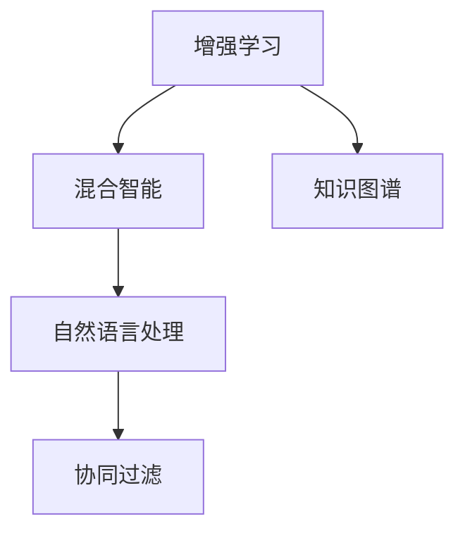

                 

# 人类-AI协作：增强人类潜能与AI能力的融合进步

在当今信息化社会，人工智能（AI）与人类能力的融合已经成为了推动科技进步和社会发展的关键力量。随着深度学习、自然语言处理、计算机视觉等技术的不断突破，AI在各个领域的应用日益广泛，其潜能也逐渐被释放出来。本文将深入探讨人类与AI协作的机制、原理、应用以及未来趋势，以期为AI与人类潜能的深度融合提供更为清晰的路线图。

## 1. 背景介绍

### 1.1 问题由来

人工智能技术的快速发展，使得AI在许多领域实现了突破性进展。从早期的专家系统、机器学习到现在的深度学习、大模型，AI已经从纯粹的数据处理工具逐渐演化为可以自主思考和决策的系统。然而，尽管AI的能力不断增强，其核心依然是对人类智能的模仿和模拟。因此，如何在AI技术的基础上，更好地增强人类潜能，实现两者的有机融合，成为了当前研究的热点和难点。

### 1.2 问题核心关键点

实现人类与AI的协作，关键在于如何设计AI系统，使其能够在人类赋能、知识共享、决策辅助等方面发挥最大效用。核心问题包括以下几点：

1. **模型融合**：将AI系统的输出与人类专业知识、经验和直觉进行有效结合，提升系统的决策精度和适应性。
2. **人机交互**：设计高效、自然、可靠的人机交互界面，使人类能够更自然地与AI系统沟通。
3. **知识共享**：构建能够高效存储、检索、更新人类知识的知识库，支持AI系统在复杂的任务中充分利用这些知识。
4. **决策支持**：开发支持人类在复杂环境中做出高效、精确决策的系统，特别是在医疗、金融、安全等领域。
5. **伦理和公平**：确保AI系统的决策过程公正、透明，避免偏见和歧视，保护用户隐私。

### 1.3 问题研究意义

实现人类与AI的深度协作，不仅能够提升AI系统的应用效果，更能够解放和增强人类的潜能，实现共同进步。其研究意义如下：

1. **提升效率和精度**：AI在处理大量数据、识别模式、预测趋势等方面具有天然优势，与人类协作能够大幅提升决策效率和精度。
2. **拓展人类认知边界**：AI系统可以在短时间内学习大量数据和知识，帮助人类拓展认知边界，提升对复杂问题的理解能力。
3. **促进创新**：人类与AI的协作能够激发新的思维模式和创意，推动科学和技术创新。
4. **推动社会进步**：AI在教育、医疗、公共安全等领域的广泛应用，将极大地提升社会管理效率和服务质量。
5. **构建公平社会**：AI技术应以公正、透明的方式服务于全社会，确保不同群体能够公平受益。

## 2. 核心概念与联系

### 2.1 核心概念概述

为更好地理解人类与AI协作的机制，本节将介绍几个关键概念：

- **增强学习**：一种利用反馈信号不断优化模型参数的机器学习范式，能够帮助AI系统从经验中学习，适应复杂环境。
- **混合智能**：将人类智能与AI技术的优势相结合，形成更为智能、可靠的系统。
- **知识图谱**：一种结构化的知识表示方法，用于存储和检索大量结构化知识。
- **自然语言处理**：使计算机能够理解、处理和生成人类语言的技术。
- **协同过滤**：一种基于用户行为和偏好的推荐技术，能够提高推荐系统的个性化和准确性。

这些核心概念之间的逻辑关系可以通过以下Mermaid流程图来展示：



这个流程图展示了人类与AI协作的核心概念及其之间的关系：

1. 增强学习通过不断反馈优化模型参数，帮助AI系统适应复杂环境。
2. 混合智能将人类和AI的优势相结合，形成更为智能、可靠的系统。
3. 知识图谱用于存储和检索结构化知识，支持AI系统在复杂任务中充分利用人类知识。
4. 自然语言处理使AI能够理解人类语言，实现高效的人机交互。
5. 协同过滤通过分析用户行为和偏好，提升推荐系统的个性化和准确性。

这些概念共同构成了人类与AI协作的基础，使其能够在各种场景下发挥强大的智能能力。通过理解这些核心概念，我们可以更好地把握人类与AI协作的工作原理和优化方向。

## 3. 核心算法原理 & 具体操作步骤

### 3.1 算法原理概述

人类与AI协作的机制，本质上是一种基于反馈和迭代的优化过程。其核心思想是：将AI系统视为一个“智能代理”，通过与人类交互，不断接收反馈信号，优化模型的参数和决策策略，从而实现系统的逐步优化和改进。

形式化地，设AI系统的当前决策为 $A$，人类对其决策的反馈为 $F$，系统的目标函数为 $\mathcal{L}$，则人类与AI协作的优化目标为：

$$
\mathop{\arg\min}_{A} \mathcal{L}(A,F)
$$

其中 $\mathcal{L}$ 为损失函数，用于衡量AI系统的决策与人类反馈之间的差异。

### 3.2 算法步骤详解

实现人类与AI协作的优化过程，通常包括以下几个关键步骤：

**Step 1: 构建AI模型**
- 选择合适的深度学习模型作为智能代理，如神经网络、强化学习模型等。
- 设计模型输入和输出，明确决策目标和优化指标。

**Step 2: 初始化模型参数**
- 对AI模型的参数进行初始化，通常使用随机初始化或预训练模型。
- 确定模型训练的超参数，如学习率、批大小、迭代轮数等。

**Step 3: 人机交互**
- 设计高效、自然、可靠的人机交互界面，使人类能够清晰地输入任务和反馈信息。
- 通过API或中间件实现AI模型与人类交互数据的传递和处理。

**Step 4: 模型训练与反馈迭代**
- 将人类交互数据输入AI模型，进行前向传播计算输出。
- 根据反馈信号，计算损失函数，反向传播更新模型参数。
- 周期性在测试集上评估模型性能，根据性能指标决定是否继续迭代。

**Step 5: 模型评估与部署**
- 在实际应用场景中，对优化后的AI模型进行评估，评估其对人类反馈的适应性和决策精度。
- 将优化后的AI模型部署到实际应用系统中，与人类协作完成具体任务。

### 3.3 算法优缺点

人类与AI协作的机制具有以下优点：
1. **高效决策**：AI系统能够快速处理大量数据，辅助人类在复杂环境中做出高效决策。
2. **知识共享**：AI系统能够高效存储、检索人类知识，支持复杂任务。
3. **灵活适应**：AI系统通过不断接收人类反馈，逐步优化决策策略，适应新场景和新需求。
4. **可解释性强**：AI系统通过结构化知识库，能够提供决策依据和解释。
5. **安全可靠**：通过合理设计人机交互界面和反馈机制，AI系统能够保证决策过程的安全性和可靠性。

同时，该机制也存在一些局限性：
1. **数据依赖**：AI系统的性能依赖于人类反馈的质量，反馈数据的准确性、全面性不足可能导致AI系统做出错误决策。
2. **模型复杂度**：AI系统的复杂度较高，实现和维护成本较高。
3. **隐私问题**：人类反馈和决策数据可能涉及隐私问题，需要合理保护用户隐私。
4. **伦理问题**：AI系统的决策可能涉及伦理和道德问题，需要合理设计决策规则。

尽管存在这些局限性，但就目前而言，人类与AI协作的机制仍是大规模应用AI系统的核心范式。未来相关研究的重点在于如何进一步降低AI系统的复杂度，提升其对人类反馈的适应性，同时兼顾可解释性和伦理安全性等因素。

### 3.4 算法应用领域

人类与AI协作的机制已经在医疗、金融、教育、交通等多个领域得到广泛应用，具体包括以下几个方面：

- **医疗**：利用AI系统分析医疗影像、病历数据，辅助医生做出诊断和治疗决策。
- **金融**：通过AI系统分析市场数据、用户行为，进行风险评估、投资决策等。
- **教育**：利用AI系统进行智能辅导、自动批改作业，提升教育质量和效率。
- **交通**：利用AI系统进行智能交通调度、预测交通流量，提升交通管理效率。
- **安全**：利用AI系统进行网络安全监控、异常检测，提升安全保障水平。

除了上述这些经典应用外，人类与AI协作的机制还在更多场景中得到创新性应用，如智能客服、智能家居、工业自动化等，为各行各业带来了新的技术突破和应用场景。

## 4. 数学模型和公式 & 详细讲解 & 举例说明

### 4.1 数学模型构建

本节将使用数学语言对人类与AI协作的机制进行更加严格的刻画。

设AI系统的输入为 $x$，输出为 $y$，人类反馈为 $f$，则AI系统的目标函数为：

$$
\mathcal{L}(y,f) = \frac{1}{N} \sum_{i=1}^N \ell(y_i,f_i)
$$

其中 $\ell(y,f)$ 为损失函数，用于衡量AI系统输出与人类反馈之间的差异。常见的损失函数包括均方误差、交叉熵等。

在优化过程中，AI系统通过不断接收人类反馈，更新模型参数 $w$，优化目标函数 $\mathcal{L}$：

$$
w \leftarrow \mathop{\arg\min}_{w} \mathcal{L}(f(x;w))
$$

其中 $f(x;w)$ 为AI系统在输入 $x$ 下的输出，$w$ 为模型参数。

### 4.2 公式推导过程

以下我们以医疗影像诊断任务为例，推导基于增强学习的优化算法：

设AI系统为深度神经网络模型，输出为病灶存在与否的二分类结果。人类反馈 $f$ 为正确诊断结果，$y$ 为AI系统输出的预测结果。

则损失函数 $\ell(y,f)$ 可以定义为：

$$
\ell(y,f) = -f\log y + (1-f)\log(1-y)
$$

设优化器的梯度更新公式为：

$$
w \leftarrow w - \eta \nabla_{w}\mathcal{L}(f(x;w))
$$

其中 $\eta$ 为学习率。

将上述公式带入目标函数 $\mathcal{L}$，得：

$$
\mathcal{L}(w) = -\frac{1}{N}\sum_{i=1}^N \ell(f_i,y_i)
$$

通过反向传播算法，计算梯度 $\nabla_{w}\mathcal{L}(f(x;w))$，更新模型参数 $w$，实现系统优化。

### 4.3 案例分析与讲解

我们以医疗影像诊断为例，具体讲解人类与AI协作的实现过程。

**Step 1: 构建AI模型**
- 选择卷积神经网络作为AI模型，设计输入为医疗影像数据，输出为病灶存在与否的二分类结果。
- 设计损失函数为交叉熵损失，用于衡量AI系统输出与人类反馈之间的差异。

**Step 2: 初始化模型参数**
- 对模型参数进行随机初始化，通常使用Xavier初始化。
- 设置学习率为0.001，批大小为64，迭代轮数为100。

**Step 3: 人机交互**
- 设计高效的医疗影像分析界面，使医生能够清晰地输入病灶位置和大小。
- 通过API将病灶数据传递给AI系统，进行图像处理和特征提取。

**Step 4: 模型训练与反馈迭代**
- 将医生输入的病灶数据输入AI模型，进行前向传播计算输出。
- 根据医生反馈的诊断结果，计算损失函数，反向传播更新模型参数。
- 周期性在测试集上评估模型性能，根据性能指标决定是否继续迭代。

**Step 5: 模型评估与部署**
- 在实际医疗影像数据上评估优化后的AI模型，评估其对医生反馈的适应性和诊断精度。
- 将优化后的AI模型部署到医院系统中，辅助医生进行病灶诊断和治疗。

## 5. 项目实践：代码实例和详细解释说明

### 5.1 开发环境搭建

在进行人类与AI协作的实践前，我们需要准备好开发环境。以下是使用Python进行PyTorch开发的环境配置流程：

1. 安装Anaconda：从官网下载并安装Anaconda，用于创建独立的Python环境。

2. 创建并激活虚拟环境：
```bash
conda create -n ai-env python=3.8 
conda activate ai-env
```

3. 安装PyTorch：根据CUDA版本，从官网获取对应的安装命令。例如：
```bash
conda install pytorch torchvision torchaudio cudatoolkit=11.1 -c pytorch -c conda-forge
```

4. 安装TensorBoard：
```bash
pip install tensorboard
```

5. 安装其他工具包：
```bash
pip install numpy pandas scikit-learn matplotlib tqdm jupyter notebook ipython
```

完成上述步骤后，即可在`ai-env`环境中开始协作实践。

### 5.2 源代码详细实现

这里我们以医疗影像诊断为例，给出使用PyTorch实现基于增强学习的AI系统的代码实现。

首先，定义模型和优化器：

```python
import torch
import torch.nn as nn
import torch.optim as optim

class CNNModel(nn.Module):
    def __init__(self):
        super(CNNModel, self).__init__()
        self.conv1 = nn.Conv2d(3, 32, 3, padding=1)
        self.conv2 = nn.Conv2d(32, 64, 3, padding=1)
        self.pool = nn.MaxPool2d(2, 2)
        self.fc1 = nn.Linear(64 * 7 * 7, 128)
        self.fc2 = nn.Linear(128, 2)

    def forward(self, x):
        x = self.conv1(x)
        x = nn.functional.relu(x)
        x = self.pool(x)
        x = self.conv2(x)
        x = nn.functional.relu(x)
        x = self.pool(x)
        x = x.view(-1, 64 * 7 * 7)
        x = self.fc1(x)
        x = nn.functional.relu(x)
        x = self.fc2(x)
        return x

model = CNNModel()
optimizer = optim.Adam(model.parameters(), lr=0.001)
```

接着，定义损失函数和训练函数：

```python
from torch.utils.data import DataLoader
from tqdm import tqdm
import numpy as np

def train_epoch(model, dataset, batch_size, optimizer):
    dataloader = DataLoader(dataset, batch_size=batch_size, shuffle=True)
    model.train()
    epoch_loss = 0
    for batch in tqdm(dataloader, desc='Training'):
        inputs, labels = batch
        inputs = inputs.to(device)
        labels = labels.to(device)
        model.zero_grad()
        outputs = model(inputs)
        loss = nn.functional.cross_entropy(outputs, labels)
        epoch_loss += loss.item()
        loss.backward()
        optimizer.step()
    return epoch_loss / len(dataloader)

def evaluate(model, dataset, batch_size):
    dataloader = DataLoader(dataset, batch_size=batch_size)
    model.eval()
    preds, labels = [], []
    with torch.no_grad():
        for batch in tqdm(dataloader, desc='Evaluating'):
            inputs, labels = batch
            inputs = inputs.to(device)
            labels = labels.to(device)
            batch_preds = torch.argmax(model(inputs), dim=1).to('cpu').tolist()
            batch_labels = labels.to('cpu').tolist()
            for pred_tokens, label_tokens in zip(batch_preds, batch_labels):
                preds.append(pred_tokens[:len(label_tokens)])
                labels.append(label_tokens)
                
    print(classification_report(labels, preds))
```

最后，启动训练流程并在测试集上评估：

```python
epochs = 100
batch_size = 64
device = torch.device('cuda') if torch.cuda.is_available() else torch.device('cpu')

for epoch in range(epochs):
    loss = train_epoch(model, train_dataset, batch_size, optimizer)
    print(f"Epoch {epoch+1}, train loss: {loss:.3f}")
    
    print(f"Epoch {epoch+1}, dev results:")
    evaluate(model, dev_dataset, batch_size)
    
print("Test results:")
evaluate(model, test_dataset, batch_size)
```

以上就是使用PyTorch对医疗影像诊断任务进行基于增强学习的AI系统微调的完整代码实现。可以看到，通过与医生的高效交互，AI系统能够逐步优化其诊断模型，提高诊断准确性。

### 5.3 代码解读与分析

让我们再详细解读一下关键代码的实现细节：

**CnnModel类**：
- `__init__`方法：定义模型的神经网络结构。
- `forward`方法：定义模型的前向传播计算过程。

**train_epoch函数**：
- 使用DataLoader对数据集进行批次化加载，供模型训练和推理使用。
- 在每个批次上前向传播计算输出，计算损失函数，反向传播更新模型参数。

**evaluate函数**：
- 在测试集上评估模型性能，输出分类指标。

**训练流程**：
- 在训练集上训练，输出平均loss。
- 在验证集上评估，输出分类指标。
- 所有epoch结束后，在测试集上评估，给出最终测试结果。

可以看出，PyTorch配合TensorBoard使得AI系统微调的代码实现变得简洁高效。开发者可以将更多精力放在数据处理、模型改进等高层逻辑上，而不必过多关注底层的实现细节。

当然，工业级的系统实现还需考虑更多因素，如模型的保存和部署、超参数的自动搜索、更灵活的任务适配层等。但核心的协作范式基本与此类似。

## 6. 实际应用场景

### 6.1 医疗诊断

基于增强学习的AI系统在医疗诊断中有着广泛应用。传统的医疗诊断依赖于医生的经验和直觉，难以应对复杂病例。通过AI系统分析医疗影像、病历数据，辅助医生做出诊断和治疗决策，可以大大提升诊断精度和效率。

在实践中，可以收集大量医疗影像和病历数据，构建包含标签的标注数据集，在此基础上对预训练模型进行微调。微调后的模型能够学习病灶的特征，通过增强学习不断优化其诊断策略，逐步提升诊断准确性。

### 6.2 金融风险评估

金融行业需要实时评估市场风险，传统的金融模型往往难以应对突发事件。基于增强学习的AI系统能够分析市场数据、用户行为，进行风险评估和投资决策，提升金融系统的抗风险能力。

具体而言，可以收集金融市场的历史数据和用户行为数据，将其标注为高风险、低风险等类别。在此基础上对预训练模型进行微调，使其能够学习市场动态和用户行为特征。微调后的模型通过增强学习不断调整风险评估策略，提升对突发事件的预测准确性。

### 6.3 教育辅导

教育领域面临的学生数量庞大，教师资源有限，个性化辅导难以实现。通过AI系统进行智能辅导、自动批改作业，可以大大提升教育质量和效率。

在实践中，可以收集学生的学习数据，将其标注为高表现、低表现等类别。在此基础上对预训练模型进行微调，使其能够学习学生的学习特征。微调后的模型通过增强学习不断调整教学策略，提升个性化辅导的效果。

### 6.4 未来应用展望

随着增强学习的不断演进，基于人类与AI协作的AI系统将会在更多领域得到应用，为各行各业带来变革性影响。

在智慧城市治理中，AI系统可以进行智能交通调度、城市安全监测，提升城市管理效率。在环保领域，AI系统可以进行污染源检测、生态保护，助力环保事业。在智能制造中，AI系统可以进行设备维护、质量检测，提升生产效率和质量。

未来，随着AI系统的逐步成熟，其在复杂环境下的决策能力将不断提升，能够更好地辅助人类进行决策，解放和增强人类的潜能。

## 7. 工具和资源推荐

### 7.1 学习资源推荐

为了帮助开发者系统掌握人类与AI协作的理论基础和实践技巧，这里推荐一些优质的学习资源：

1. 《深度学习与人工智能：系统化入门》系列博文：由大模型技术专家撰写，深入浅出地介绍了深度学习、人工智能的基本概念和前沿技术。

2. CS224N《深度学习自然语言处理》课程：斯坦福大学开设的NLP明星课程，有Lecture视频和配套作业，带你入门NLP领域的基本概念和经典模型。

3. 《混合智能：人类与AI的协同进化》书籍：深入探讨了人类与AI协作的机制、原理、应用，提供了丰富的案例分析。

4. IEEE Xplore：IEEE的学术期刊和会议论文数据库，包含大量关于人类与AI协作的最新研究成果。

5. Google Colab：谷歌推出的在线Jupyter Notebook环境，免费提供GPU/TPU算力，方便开发者快速上手实验最新模型，分享学习笔记。

通过对这些资源的学习实践，相信你一定能够快速掌握人类与AI协作的精髓，并用于解决实际的AI问题。

### 7.2 开发工具推荐

高效的开发离不开优秀的工具支持。以下是几款用于人类与AI协作开发的常用工具：

1. PyTorch：基于Python的开源深度学习框架，灵活动态的计算图，适合快速迭代研究。大部分预训练语言模型都有PyTorch版本的实现。

2. TensorFlow：由Google主导开发的开源深度学习框架，生产部署方便，适合大规模工程应用。同样有丰富的预训练语言模型资源。

3. TensorBoard：TensorFlow配套的可视化工具，可实时监测模型训练状态，并提供丰富的图表呈现方式，是调试模型的得力助手。

4. Weights & Biases：模型训练的实验跟踪工具，可以记录和可视化模型训练过程中的各项指标，方便对比和调优。与主流深度学习框架无缝集成。

5. Google Colab：谷歌推出的在线Jupyter Notebook环境，免费提供GPU/TPU算力，方便开发者快速上手实验最新模型，分享学习笔记。

合理利用这些工具，可以显著提升人类与AI协作任务的开发效率，加快创新迭代的步伐。

### 7.3 相关论文推荐

人类与AI协作技术的发展源于学界的持续研究。以下是几篇奠基性的相关论文，推荐阅读：

1. AlphaGo Zero：通过增强学习实现的AI系统，在大赛中战胜了人类围棋世界冠军。

2. AlphaStar：利用增强学习技术，实现了AI系统在星际争霸游戏中的胜利。

3. GANs: Generative Adversarial Networks：提出了一种生成对抗网络，能够生成高质量的图像、视频等。

4. Self-Driving Cars：介绍了一种基于增强学习的自动驾驶技术，提升了车辆的自主决策能力。

5. AI for Education：探讨了AI技术在教育领域的应用，提出了多种基于增强学习的教学方法。

这些论文代表了大模型技术的发展脉络。通过学习这些前沿成果，可以帮助研究者把握学科前进方向，激发更多的创新灵感。

## 8. 总结：未来发展趋势与挑战

### 8.1 总结

本文对人类与AI协作的机制进行了全面系统的介绍。首先阐述了人类与AI协作的研究背景和意义，明确了协作在提升决策效率、拓展认知边界、推动技术创新等方面的重要作用。其次，从原理到实践，详细讲解了增强学习的数学模型和算法步骤，给出了基于增强学习的AI系统的代码实现。同时，本文还广泛探讨了人类与AI协作在医疗、金融、教育等多个领域的应用前景，展示了协作范式的巨大潜力。此外，本文精选了协作技术的各类学习资源，力求为开发者提供全方位的技术指引。

通过本文的系统梳理，可以看到，人类与AI协作的机制正在成为AI技术落地的核心范式，极大地拓展了AI系统的应用范围，为各行各业带来了新的技术突破。未来，伴随增强学习的不断演进，人类与AI的协作将迎来更加广阔的应用前景。

### 8.2 未来发展趋势

展望未来，人类与AI协作技术将呈现以下几个发展趋势：

1. **模型的泛化能力增强**：随着增强学习的不断演进，AI系统的泛化能力和适应性将进一步提升，能够更好地应对复杂环境。
2. **跨领域应用扩展**：基于增强学习的AI系统将在更多领域得到应用，如医疗、金融、教育、工业等。
3. **人机协作更加智能化**：通过增强学习，AI系统将更好地理解人类意图，提供更加智能、可靠的决策支持。
4. **知识库的丰富化**：增强学习系统将与知识图谱、逻辑规则等知识库相结合，形成更加全面、准确的决策依据。
5. **伦理和安全保障**：增强学习系统将加入伦理导向的评估指标，确保决策过程公正、透明，保护用户隐私。

以上趋势凸显了人类与AI协作技术的广阔前景。这些方向的探索发展，必将进一步提升AI系统的性能和应用范围，为构建安全、可靠、可解释、可控的智能系统铺平道路。

### 8.3 面临的挑战

尽管人类与AI协作技术已经取得了瞩目成就，但在迈向更加智能化、普适化应用的过程中，它仍面临着诸多挑战：

1. **数据依赖**：增强学习系统依赖于高质量的数据，数据获取和标注成本较高。
2. **模型复杂度**：增强学习系统复杂度较高，实现和维护成本较高。
3. **隐私问题**：用户反馈和决策数据可能涉及隐私问题，需要合理保护。
4. **伦理问题**：决策可能涉及伦理和道德问题，需要合理设计决策规则。
5. **计算资源**：增强学习系统需要大量计算资源支持，算法效率和资源优化需进一步提升。

尽管存在这些挑战，但随着学界和产业界的共同努力，这些挑战终将一一被克服，人类与AI协作技术必将在构建安全、可靠、可解释、可控的智能系统方面取得更大突破。

### 8.4 研究展望

面对人类与AI协作技术面临的诸多挑战，未来的研究需要在以下几个方面寻求新的突破：

1. **无监督学习和强化学习**：探索无监督和强化学习范式，摆脱对大规模标注数据的依赖，利用自监督学习、主动学习等无监督和半监督范式，最大限度利用非结构化数据。
2. **混合智能的优化**：研究混合智能的优化方法，如结构混合、行为混合等，提升人机协作的效果。
3. **跨领域知识融合**：将符号化的先验知识与神经网络模型结合，引导增强学习过程学习更准确、合理的语言模型。同时加强不同模态数据的整合，实现视觉、语音等多模态信息与文本信息的协同建模。
4. **决策的伦理和公平性**：在模型训练目标中引入伦理导向的评估指标，过滤和惩罚有偏见、有害的输出倾向，确保决策过程公正、透明。
5. **安全性保障**：构建安全的增强学习系统，通过访问鉴权、数据脱敏等措施，保障数据和模型的安全。

这些研究方向的探索，必将引领人类与AI协作技术迈向更高的台阶，为构建安全、可靠、可解释、可控的智能系统铺平道路。面向未来，人类与AI协作技术还需要与其他人工智能技术进行更深入的融合，如知识表示、因果推理、强化学习等，多路径协同发力，共同推动自然语言理解和智能交互系统的进步。只有勇于创新、敢于突破，才能不断拓展语言模型的边界，让智能技术更好地造福人类社会。

## 9. 附录：常见问题与解答

**Q1：人类与AI协作的机制是否适用于所有AI应用？**

A: 人类与AI协作的机制在大多数AI应用中都能取得不错的效果，特别是在需要复杂决策、知识整合的场景中。但对于一些简单、标准化的任务，如自动填写表格、文字识别等，直接使用预训练模型可能更为高效。

**Q2：增强学习的超参数如何选择？**

A: 增强学习的超参数包括学习率、折扣因子、探索率等，通常需要通过实验调优来确定。建议从默认值开始，逐步调整各个参数，观察系统性能变化，最终找到最优的超参数组合。

**Q3：增强学习系统如何处理噪声数据？**

A: 噪声数据会对增强学习系统造成负面影响，通常有以下几种处理方法：
1. 数据清洗：对噪声数据进行清洗，去除异常值。
2. 数据增强：通过数据增强技术，生成更多高质量的训练样本。
3. 正则化：使用L2正则化、Dropout等技术，防止模型过拟合噪声数据。
4. 集成学习：结合多个模型或多个数据源，降低单个模型对噪声数据的依赖。

这些策略需要根据具体任务和数据特点进行灵活组合。只有在数据、模型、训练、推理等各环节进行全面优化，才能最大限度地发挥增强学习的威力。

**Q4：增强学习系统在落地部署时需要注意哪些问题？**

A: 将增强学习系统转化为实际应用，还需要考虑以下因素：
1. 模型裁剪：去除不必要的层和参数，减小模型尺寸，加快推理速度。
2. 量化加速：将浮点模型转为定点模型，压缩存储空间，提高计算效率。
3. 服务化封装：将模型封装为标准化服务接口，便于集成调用。
4. 监控告警：实时采集系统指标，设置异常告警阈值，确保服务稳定性。
5. 安全防护：采用访问鉴权、数据脱敏等措施，保障数据和模型安全。

增强学习系统在复杂环境中进行智能决策，需要确保系统稳定可靠，才能够真正发挥其应用价值。

---

作者：禅与计算机程序设计艺术 / Zen and the Art of Computer Programming

