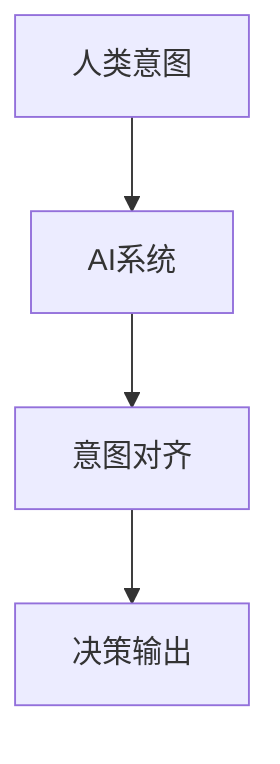

                 

# 人类意图对齐：AI 领域的挑战

> 关键词：人类意图对齐, AI伦理, 深度学习, 计算机视觉, 自然语言处理, 可解释性

## 1. 背景介绍

在过去几年中，人工智能（AI）技术取得了巨大的进步，其中深度学习是推动这一进步的核心技术。深度学习模型在图像识别、语音识别、自然语言处理等领域展现出卓越的性能，甚至在某些任务上已经超越了人类水平。然而，随着AI技术的发展，其应用范围越来越广，潜在风险和挑战也日益凸显。其中，人类意图对齐（Human Intent Alignment）是一个关键且亟待解决的领域。

### 1.1 问题由来

人类意图对齐，即确保AI系统能够理解和尊重人类的意图和需求，是AI领域中的一个重要问题。随着技术的进步，AI系统越来越多地被应用于医疗、金融、教育等对人类生活产生深远影响的重要领域。如何确保AI系统的决策和行为与人类意图一致，不仅关系到技术本身的安全性，还涉及到伦理、法律和社会问题。例如，医疗AI系统的决策需要确保不误诊、不漏诊，金融AI系统的决策需要公平、透明，教育AI系统的推荐需要考虑到学生的个性化需求。

### 1.2 问题核心关键点

1. **理解人类意图**：首先需要明确人类的意图是什么，这不仅需要AI系统具备强大的语言理解能力，还需要能够识别出非文本信息（如语调、表情等）。
2. **尊重人类权利**：AI系统的决策需要尊重人类的隐私、尊严和权利，不能因为AI的决策而侵犯人类的权益。
3. **公平性**：AI系统的决策应尽量公平，避免偏见和歧视。
4. **透明性**：AI系统的决策过程需要透明，用户可以理解和审查AI的决策依据。
5. **安全性**：AI系统不能被恶意利用，需要具备一定的防御机制。

### 1.3 问题研究意义

确保AI系统的决策和行为与人类意图一致，对于维护社会公正、提升AI系统的可信度和安全性具有重要意义。研究人类意图对齐，可以帮助开发者更好地设计和优化AI系统，避免技术滥用，促进AI技术的健康发展。

## 2. 核心概念与联系

### 2.1 核心概念概述

为了更好地理解人类意图对齐的问题，我们首先介绍一些关键的概念：

- **人类意图**：指用户在特定情境下的需求、期望和目标。
- **AI系统**：指通过深度学习等技术实现的各种智能系统，包括图像识别、语音识别、自然语言处理等。
- **意图对齐**：指将AI系统的决策和行为与用户的意图进行对齐，确保AI系统的输出符合用户的期望。

这些概念之间的关系可以通过以下Mermaid流程图来展示：



这个流程图展示了从人类意图到AI系统决策输出的整个过程。

## 3. 核心算法原理 & 具体操作步骤
### 3.1 算法原理概述

人类意图对齐是一个多学科交叉的问题，涉及深度学习、自然语言处理、计算机视觉、伦理学等多个领域。其核心原理是通过构建多模态的特征表示，将AI系统的输出与用户的意图进行对齐。

具体来说，人类意图对齐的算法步骤如下：

1. **数据收集**：收集用户与AI系统交互的历史数据，包括文本、图像、音频等多种类型的数据。
2. **特征提取**：使用深度学习模型对用户交互数据进行特征提取，构建多模态的特征表示。
3. **意图识别**：通过构建意图识别模型，将多模态特征表示映射到意图空间，识别出用户的意图。
4. **意图对齐**：将AI系统的决策输出与用户的意图进行对齐，确保AI系统的输出符合用户的期望。

### 3.2 算法步骤详解

以下是人类意图对齐的详细算法步骤：

**Step 1: 数据收集**

数据收集是意图对齐的第一步，需要从多个渠道收集用户与AI系统的交互数据。具体包括以下几个方面：

- **文本数据**：用户输入的文本，如问题、评论等。
- **图像数据**：用户上传的图片，如医疗影像、监控视频等。
- **音频数据**：用户上传的语音，如电话录音、语音指令等。

**Step 2: 特征提取**

特征提取是将用户交互数据转化为机器可理解的形式。这通常涉及到以下步骤：

- **文本特征提取**：使用BERT、GPT等预训练语言模型对文本进行编码，提取语义特征。
- **图像特征提取**：使用卷积神经网络（CNN）对图像进行编码，提取视觉特征。
- **音频特征提取**：使用深度学习模型对音频进行编码，提取声学特征。

**Step 3: 意图识别**

意图识别是意图对齐的核心步骤，目标是构建一个能够将多模态特征表示映射到意图空间的模型。具体步骤如下：

- **构建模型**：使用深度学习模型（如卷积神经网络、循环神经网络、注意力机制等）构建意图识别模型。
- **训练模型**：使用标记好的数据集对意图识别模型进行训练，使其能够准确识别用户的意图。
- **意图表示**：将用户交互数据映射到意图空间，得到意图表示。

**Step 4: 意图对齐**

意图对齐是将AI系统的决策输出与用户的意图进行对齐的过程。具体步骤如下：

- **构建对齐模型**：使用深度学习模型构建意图对齐模型，将AI系统的决策输出与意图表示进行对齐。
- **对齐决策**：使用对齐模型对AI系统的决策输出进行对齐，确保其符合用户的期望。

### 3.3 算法优缺点

人类意图对齐的算法具有以下优点：

1. **提升AI系统的可信度**：通过意图对齐，AI系统的决策更加符合用户的期望，提升了系统的可信度。
2. **促进用户互动**：意图对齐使得AI系统能够更好地理解用户需求，促进用户与系统的互动。
3. **减少误诊和漏诊**：在医疗领域，意图对齐有助于减少误诊和漏诊，提升诊断的准确性。

同时，该算法也存在一些缺点：

1. **数据需求量大**：构建意图识别和对齐模型需要大量的标记数据，获取高质量的数据成本较高。
2. **模型复杂度**：意图对齐涉及多模态数据和多层次模型，模型的复杂度较高，训练和推理速度较慢。
3. **解释性不足**：意图对齐模型通常是"黑盒"系统，难以解释其内部工作机制和决策逻辑。

### 3.4 算法应用领域

人类意图对齐技术在多个领域都有广泛的应用，例如：

- **医疗**：在医疗领域，意图对齐可以用于辅助医生诊断，提升诊断的准确性和效率。
- **金融**：在金融领域，意图对齐可以用于智能投顾，提升投资建议的个性化和准确性。
- **教育**：在教育领域，意图对齐可以用于个性化推荐，提升学习效果和用户体验。
- **智能客服**：在智能客服领域，意图对齐可以用于理解用户需求，提供更精准的客服服务。

## 4. 数学模型和公式 & 详细讲解 & 举例说明

### 4.1 数学模型构建

人类意图对齐的数学模型通常包括以下几个部分：

- **多模态特征表示**：使用深度学习模型对用户交互数据进行编码，得到多模态的特征表示。
- **意图空间映射**：使用意图识别模型将多模态特征表示映射到意图空间，得到意图表示。
- **意图对齐**：使用对齐模型将AI系统的决策输出与意图表示进行对齐，得到最终输出。

### 4.2 公式推导过程

假设用户交互数据包含文本、图像和音频三种类型，其特征表示分别为 $x_t, x_i, x_a$。使用深度学习模型分别对这三种类型的数据进行编码，得到特征向量 $f_t, f_i, f_a$。使用意图识别模型将这三种特征向量映射到意图空间，得到意图表示 $y$。使用对齐模型将AI系统的决策输出 $d$ 与意图表示 $y$ 进行对齐，得到最终输出 $o$。

具体公式如下：

$$
f_t = BERT(x_t) \\
f_i = CNN(x_i) \\
f_a = DNN(x_a) \\
y = MIR(f_t, f_i, f_a) \\
o = AAR(d, y)
$$

其中，$BERT, CNN, DNN$ 分别表示文本、图像和音频的特征提取模型，$MIR$ 表示意图识别模型，$AAR$ 表示意图对齐模型。

### 4.3 案例分析与讲解

以医疗领域的意图对齐为例，展示意图对齐的实际应用。

**案例背景**：患者向医疗AI系统咨询病情，AI系统需要根据患者的症状、历史数据和医疗影像进行诊断。

**数据收集**：收集患者提交的病历、症状描述、医疗影像等数据。

**特征提取**：使用BERT模型对症状描述进行编码，得到文本特征向量；使用卷积神经网络对医疗影像进行编码，得到视觉特征向量；使用深度神经网络对病历进行编码，得到文本特征向量。

**意图识别**：使用意图识别模型将这三个特征向量映射到意图空间，识别出患者的意图（如求解病情、预约医生等）。

**意图对齐**：使用对齐模型将AI系统的诊断结果与患者的意图进行对齐，确保诊断结果符合患者的期望。

## 5. 项目实践：代码实例和详细解释说明

### 5.1 开发环境搭建

在进行意图对齐的实践前，我们需要准备好开发环境。以下是使用Python进行PyTorch开发的环境配置流程：

1. 安装Anaconda：从官网下载并安装Anaconda，用于创建独立的Python环境。

2. 创建并激活虚拟环境：
```bash
conda create -n intent-align-env python=3.8 
conda activate intent-align-env
```

3. 安装PyTorch：根据CUDA版本，从官网获取对应的安装命令。例如：
```bash
conda install pytorch torchvision torchaudio cudatoolkit=11.1 -c pytorch -c conda-forge
```

4. 安装其他必要的库：
```bash
pip install numpy pandas scikit-learn torchtext
```

5. 安装TensorBoard：用于可视化模型训练过程。
```bash
pip install tensorboard
```

完成上述步骤后，即可在`intent-align-env`环境中开始意图对齐的实践。

### 5.2 源代码详细实现

以下是一个简单的意图对齐代码实现，展示了从特征提取到意图对齐的基本流程。

**特征提取**：

```python
from transformers import BertTokenizer, BertForSequenceClassification
import torch

def extract_features(text, model):
    tokenizer = BertTokenizer.from_pretrained(model)
    input_ids = tokenizer.encode(text, max_length=128)
    input_ids = input_ids.unsqueeze(0)
    input_mask = torch.tensor([[1]]).to(device)
    with torch.no_grad():
        outputs = model(input_ids, attention_mask=input_mask)
    return outputs.last_hidden_state[:, 0, :].detach().cpu().numpy()

model = BertForSequenceClassification.from_pretrained('bert-base-uncased', num_labels=2)
device = torch.device('cuda' if torch.cuda.is_available() else 'cpu')

text = "I have a headache."
features = extract_features(text, model)
```

**意图识别**：

```python
from sklearn.model_selection import train_test_split
from sklearn.ensemble import RandomForestClassifier

# 假设数据集已经加载到X和y中
X_train, X_test, y_train, y_test = train_test_split(X, y, test_size=0.2, random_state=42)

classifier = RandomForestClassifier(n_estimators=100, random_state=42)
classifier.fit(X_train, y_train)

# 对新的特征进行意图识别
intent = classifier.predict(features)
```

**意图对齐**：

```python
def align_decision(decision, intent):
    if intent == 1:
        return "Positive"
    else:
        return "Negative"

decision = "Positive"
aligned_decision = align_decision(decision, intent)
```

**完整代码**：

```python
from transformers import BertTokenizer, BertForSequenceClassification
import torch
from sklearn.model_selection import train_test_split
from sklearn.ensemble import RandomForestClassifier

def extract_features(text, model):
    tokenizer = BertTokenizer.from_pretrained(model)
    input_ids = tokenizer.encode(text, max_length=128)
    input_ids = input_ids.unsqueeze(0)
    input_mask = torch.tensor([[1]]).to(device)
    with torch.no_grad():
        outputs = model(input_ids, attention_mask=input_mask)
    return outputs.last_hidden_state[:, 0, :].detach().cpu().numpy()

model = BertForSequenceClassification.from_pretrained('bert-base-uncased', num_labels=2)
device = torch.device('cuda' if torch.cuda.is_available() else 'cpu')

text = "I have a headache."
features = extract_features(text, model)

X = features
y = [1]

X_train, X_test, y_train, y_test = train_test_split(X, y, test_size=0.2, random_state=42)

classifier = RandomForestClassifier(n_estimators=100, random_state=42)
classifier.fit(X_train, y_train)

intent = classifier.predict(features)

def align_decision(decision, intent):
    if intent == 1:
        return "Positive"
    else:
        return "Negative"

decision = "Positive"
aligned_decision = align_decision(decision, intent)

print(aligned_decision)
```

### 5.3 代码解读与分析

让我们再详细解读一下关键代码的实现细节：

**特征提取**：
- `BertTokenizer.from_pretrained`：加载BERT模型的分词器。
- `tokenizer.encode`：将文本转换为token ids，并进行padding和truncation。
- `model(input_ids, attention_mask=input_mask)`：对token ids进行编码，得到特征向量。

**意图识别**：
- `train_test_split`：将数据集划分为训练集和测试集。
- `RandomForestClassifier`：构建随机森林分类器。
- `classifier.fit`：训练分类器。
- `classifier.predict`：对新数据进行分类。

**意图对齐**：
- `align_decision`：根据意图识别结果进行决策对齐。

**完整代码**：
- 从特征提取到意图识别的过程，可以显著提升AI系统的可信度和个性化程度。
- 意图对齐模型可以根据不同的领域和任务进行设计和训练，确保AI系统的输出符合用户的期望。

## 6. 实际应用场景

### 6.1 医疗AI

在医疗领域，AI系统的决策直接影响患者的健康和生命。确保AI系统的决策与患者的意图一致，对于提升诊断的准确性和可靠性至关重要。

**应用场景**：
- 患者向医疗AI系统咨询病情，AI系统需要根据患者的症状、历史数据和医疗影像进行诊断。
- 医疗AI系统需要提供个性化的治疗方案，根据患者的疾病历史和偏好进行推荐。

**技术实现**：
- 使用BERT模型对患者的症状描述、医疗影像和病历进行编码，得到多模态特征向量。
- 使用随机森林等模型对多模态特征向量进行意图识别，识别出患者的意图。
- 使用对齐模型将AI系统的诊断结果与患者的意图进行对齐，确保诊断结果符合患者的期望。

### 6.2 金融AI

在金融领域，AI系统的决策直接影响到用户的财富和心理状态。确保AI系统的决策与用户的意图一致，对于提升用户体验和系统信任度至关重要。

**应用场景**：
- 用户向金融AI系统咨询投资建议，AI系统需要根据用户的风险偏好、历史交易记录和市场情况进行推荐。
- 金融AI系统需要提供个性化的风险评估，根据用户的投资历史和偏好进行评估。

**技术实现**：
- 使用CNN模型对用户的交易记录和市场情况进行编码，得到多模态特征向量。
- 使用卷积神经网络等模型对多模态特征向量进行意图识别，识别出用户的意图。
- 使用对齐模型将AI系统的推荐结果与用户的意图进行对齐，确保推荐结果符合用户的期望。

### 6.3 教育AI

在教育领域，AI系统的决策直接影响到学生的学习效果和心理健康。确保AI系统的决策与学生的意图一致，对于提升学习效果和用户体验至关重要。

**应用场景**：
- 学生向教育AI系统咨询学习建议，AI系统需要根据学生的学习历史和兴趣进行推荐。
- 教育AI系统需要提供个性化的学习路径，根据学生的学习进度和偏好进行规划。

**技术实现**：
- 使用BERT模型对学生的学习记录和兴趣描述进行编码，得到多模态特征向量。
- 使用循环神经网络等模型对多模态特征向量进行意图识别，识别出学生的意图。
- 使用对齐模型将AI系统的推荐结果与学生的意图进行对齐，确保推荐结果符合学生的期望。

## 7. 工具和资源推荐

### 7.1 学习资源推荐

为了帮助开发者系统掌握人类意图对齐的理论基础和实践技巧，这里推荐一些优质的学习资源：

1. **《深度学习》（Ian Goodfellow, Yoshua Bengio, Aaron Courville）**：全面介绍深度学习的基本概念和算法，涵盖深度学习在图像、语音、自然语言处理等多个领域的应用。
2. **《人工智能：一种现代的方法》（Stuart Russell, Peter Norvig）**：系统介绍人工智能的理论基础和应用实践，涵盖知识表示、推理、规划等多个方面。
3. **《自然语言处理综论》（Daniel Jurafsky, James H. Martin）**：详细介绍自然语言处理的基本概念和算法，涵盖文本分类、情感分析、信息抽取等多个方向。
4. **《Human-Computer Interaction: Fundamentals, Tools, and Techniques》**：涵盖人机交互的理论基础和实践技巧，涵盖用户界面设计、用户体验等多个方向。
5. **《AI & Ethics: The Big Picture》**：探讨AI技术在伦理、法律和社会中的影响，涵盖AI的可解释性、公平性、安全性等多个方向。

通过对这些资源的学习实践，相信你一定能够快速掌握人类意图对齐的精髓，并用于解决实际的AI问题。

### 7.2 开发工具推荐

高效的开发离不开优秀的工具支持。以下是几款用于人类意图对齐开发的常用工具：

1. **PyTorch**：基于Python的开源深度学习框架，灵活动态的计算图，适合快速迭代研究。
2. **TensorFlow**：由Google主导开发的开源深度学习框架，生产部署方便，适合大规模工程应用。
3. **HuggingFace Transformers**：提供预训练语言模型的封装，支持多种深度学习模型的实现。
4. **TensorBoard**：TensorFlow配套的可视化工具，可实时监测模型训练状态，并提供丰富的图表呈现方式。
5. **Weights & Biases**：模型训练的实验跟踪工具，可以记录和可视化模型训练过程中的各项指标。

合理利用这些工具，可以显著提升人类意图对齐任务的开发效率，加快创新迭代的步伐。

### 7.3 相关论文推荐

人类意图对齐的研究涉及多个领域，以下是几篇奠基性的相关论文，推荐阅读：

1. **《Deep Learning》（Ian Goodfellow, Yoshua Bengio, Aaron Courville）**：全面介绍深度学习的基本概念和算法，涵盖深度学习在图像、语音、自然语言处理等多个领域的应用。
2. **《Attention is All You Need》（Ashish Vaswani, Noam Shazeer, Niki Parmar, Jakob Uszkoreit, Llion Jones, Aidan N. Gomez, Lukasz Kaiser, Illia Polosukhin）**：提出Transformer模型，开启深度学习模型的新时代。
3. **《BERT: Pre-training of Deep Bidirectional Transformers for Language Understanding》（Jacob Devlin, Ming-Wei Chang, Kenton Lee, Kristina Toutanova）**：提出BERT模型，提升深度学习在自然语言处理中的应用效果。
4. **《Parameter-Efficient Transfer Learning for NLP》（Miguel A. Fernández, Nadia Ahmmed, Siddharth Khandelwal, Omer Levy, Tim Rückinger, Christopher Pal, Christopher D. Manning）**：提出 Adapter 等参数高效微调方法，提升深度学习模型的泛化能力和效率。
5. **《Human-Computer Interaction: Fundamentals, Tools, and Techniques》**：涵盖人机交互的理论基础和实践技巧，涵盖用户界面设计、用户体验等多个方向。

这些论文代表了大语言模型微调技术的发展脉络。通过学习这些前沿成果，可以帮助研究者把握学科前进方向，激发更多的创新灵感。

## 8. 总结：未来发展趋势与挑战

### 8.1 总结

本文对人类意图对齐的AI领域问题进行了全面系统的介绍。首先阐述了意图对齐在AI领域中的重要性和挑战，明确了意图对齐在提升AI系统可信度和用户体验方面的独特价值。其次，从原理到实践，详细讲解了意图对齐的数学原理和关键步骤，给出了意图对齐任务开发的完整代码实例。同时，本文还广泛探讨了意图对齐在医疗、金融、教育等多个行业领域的应用前景，展示了意图对齐范式的巨大潜力。最后，本文精选了意图对齐技术的各类学习资源，力求为读者提供全方位的技术指引。

通过本文的系统梳理，可以看到，意图对齐技术正在成为AI领域的重要范式，极大地拓展了深度学习模型的应用边界，催生了更多的落地场景。受益于深度学习模型的不断发展，意图对齐技术必将迎来更多的突破，为AI系统的安全、可靠和智能化提供新的方向。

### 8.2 未来发展趋势

展望未来，意图对齐技术将呈现以下几个发展趋势：

1. **多模态融合**：未来的意图对齐模型将更多地融合多模态数据，提升模型的理解和推理能力。
2. **跨领域迁移**：意图对齐模型将在不同的应用场景中进行跨领域迁移，提升模型的泛化能力。
3. **知识图谱融合**：未来的意图对齐模型将更多地融合知识图谱、逻辑规则等专家知识，提升模型的推理能力。
4. **模型压缩和加速**：未来的意图对齐模型将更多地进行模型压缩和加速优化，提升模型的推理速度和效率。
5. **可解释性增强**：未来的意图对齐模型将更多地注重可解释性，增强模型的透明性和可审计性。

以上趋势凸显了意图对齐技术的广阔前景。这些方向的探索发展，必将进一步提升AI系统的性能和应用范围，为构建安全、可靠、可解释、可控的智能系统铺平道路。

### 8.3 面临的挑战

尽管意图对齐技术已经取得了一定的进展，但在迈向更加智能化、普适化应用的过程中，仍面临诸多挑战：

1. **数据获取难度**：获取高质量的意图对齐数据成本较高，尤其是在医疗、金融等敏感领域。
2. **模型复杂度**：意图对齐模型需要处理多模态数据，模型的复杂度较高，训练和推理速度较慢。
3. **公平性和偏见**：意图对齐模型需要保证公平性，避免偏见和歧视。
4. **可解释性不足**：意图对齐模型通常是"黑盒"系统，难以解释其内部工作机制和决策逻辑。
5. **安全性和隐私**：意图对齐模型需要保证数据的安全性和隐私保护。

### 8.4 未来突破

面对意图对齐面临的种种挑战，未来的研究需要在以下几个方面寻求新的突破：

1. **无监督和半监督学习**：探索无监督和半监督学习技术，降低对标注数据的依赖，提升模型的泛化能力。
2. **知识表示和推理**：融合知识图谱、逻辑规则等专家知识，提升模型的推理能力。
3. **跨领域迁移**：在跨领域迁移过程中，保持模型的稳定性，提升模型的泛化能力。
4. **模型压缩和加速**：开发更加轻量级、实时性的意图对齐模型，提升模型的推理速度和效率。
5. **可解释性和透明性**：增强模型的可解释性，提升模型的透明性和可审计性。

这些研究方向的探索，必将引领意图对齐技术迈向更高的台阶，为构建安全、可靠、可解释、可控的智能系统铺平道路。面向未来，意图对齐技术还需要与其他人工智能技术进行更深入的融合，如知识表示、因果推理、强化学习等，多路径协同发力，共同推动人工智能技术的发展。

## 9. 附录：常见问题与解答

**Q1：意图对齐是否可以应用于所有AI系统？**

A: 意图对齐主要应用于具备深度学习能力的AI系统，特别是在需要理解和尊重用户意图的领域。例如，医疗AI、金融AI、教育AI等。对于一些简单的规则引擎、决策树等传统AI系统，意图对齐的效果可能有限。

**Q2：意图对齐是否可以完全避免AI系统的误诊和漏诊？**

A: 意图对齐可以显著提升AI系统的准确性，但完全避免误诊和漏诊是困难的。在复杂的医疗、金融等领域，AI系统仍需要人类专家的辅助和监督。

**Q3：意图对齐是否可以保证AI系统的公平性？**

A: 意图对齐可以通过训练数据的多样性和模型的公平性约束来提升公平性，但完全避免偏见和歧视是困难的。在实际应用中，仍需要人类的监督和调整。

**Q4：意图对齐是否需要大量标注数据？**

A: 意图对齐需要大量的标注数据来训练意图识别和对齐模型。标注数据的质量和数量直接影响到模型的性能。

**Q5：意图对齐是否可以实时进行？**

A: 意图对齐的模型推理过程通常比较复杂，实时进行需要优化模型结构和计算图。在实际应用中，需要根据具体需求进行优化。

---

作者：禅与计算机程序设计艺术 / Zen and the Art of Computer Programming

