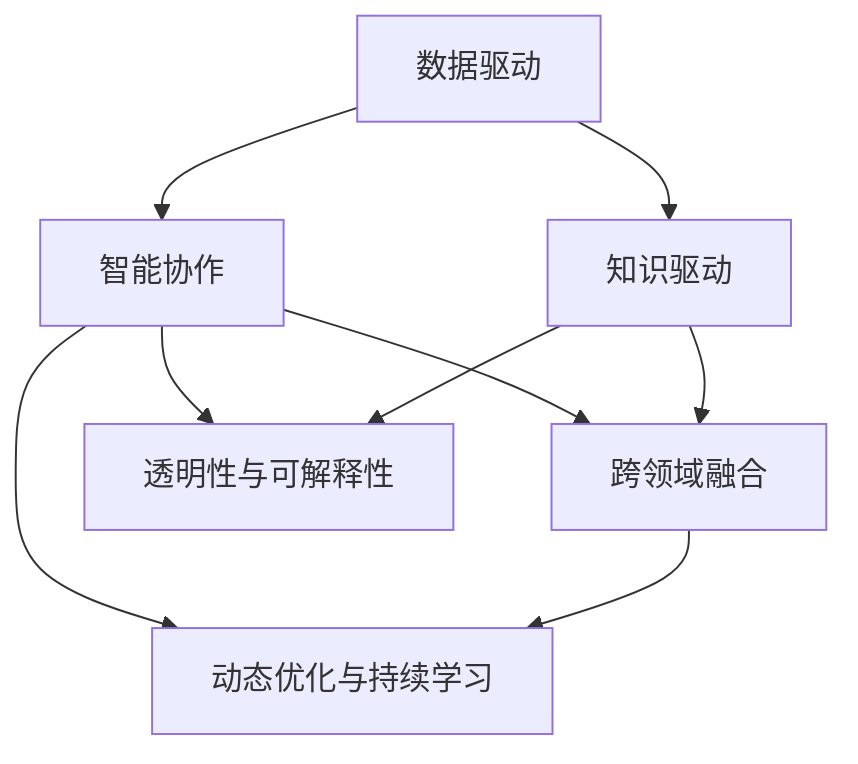

                 

# 人类计算：AI 时代的新引擎

> 关键词：人类计算, AI新引擎, 数据驱动, 智能协作, 跨领域融合

## 1. 背景介绍

### 1.1 问题由来
人工智能(AI)技术正在深刻改变着世界的各个角落，从智能家居到无人驾驶，从医疗诊断到金融投资，AI 技术的应用已经深入各行各业，极大地提升了生产效率和服务质量。然而，传统的AI技术大多依赖于数据驱动，缺乏对人体认知的全面理解，导致其在某些场景下的表现不尽如人意。如何突破数据驱动的局限，将人类的智能与AI技术深度结合，成为了当前AI研究的热点问题。

人类计算（Human Computation）的概念应运而生，它是一种结合人工智能和人类智慧的全新计算模式。通过构建人类与AI的协作体系，使AI技术能够更准确、高效地理解和解决问题。人类计算强调数据与人的智慧的深度融合，不仅提升了AI的决策能力，还推动了AI技术在更多复杂场景中的应用，为AI时代的到来注入新的活力。

### 1.2 问题核心关键点
人类计算的核心在于：

- **数据与知识的双轮驱动**：通过将数据驱动和知识驱动相结合，实现更全面的认知理解和问题解决。
- **智能与协作的协同提升**：利用AI的强大计算能力与人类智慧的洞察力，共同提升决策质量。
- **跨领域的融合应用**：将人类计算应用于医疗、教育、安全等众多领域，推动AI技术的跨学科应用。
- **透明性与可解释性**：确保AI决策过程透明，结果可解释，提升用户信任。
- **动态优化与持续学习**：通过持续优化算法，实现动态适应环境变化，不断学习提升。

通过理解这些核心概念，我们可以更好地把握人类计算的工作原理和优化方向。

## 2. 核心概念与联系

### 2.1 核心概念概述

为更好地理解人类计算，本节将介绍几个密切相关的核心概念：

- **人类计算（Human Computation）**：结合人工智能与人类智慧，利用AI强大的计算能力与人类深厚的经验知识，共同解决复杂问题。人类计算强调数据与知识的协同应用，为AI提供更丰富的信息源和更深入的认知理解。

- **数据驱动与知识驱动**：数据驱动强调通过大量数据训练AI模型，使其具备对数据规律的学习能力。知识驱动则强调利用领域专家的知识，指导AI模型的设计和使用，提升模型的决策水平。

- **智能协作（Smart Collaboration）**：通过构建人机协同的计算框架，使AI能够利用人类智慧，提升问题解决的精准度和效率。智能协作不仅关注算法的优化，更注重人机交互的体验和效果。

- **跨领域融合（Cross-Domain Integration）**：人类计算不仅应用于单一领域，而是通过跨领域的学习和应用，拓展AI技术在更多复杂场景中的表现。跨领域融合使得AI技术能够更好地适应多变的环境，解决更多实际问题。

- **透明性与可解释性（Transparency and Interpretability）**：确保AI决策过程透明，结果可解释，使用户能够理解和信任AI的输出。透明性与可解释性对于医疗、金融等高风险领域尤为重要。

- **动态优化与持续学习（Dynamic Optimization and Continuous Learning）**：通过持续优化算法和模型，实现动态适应环境变化，不断学习提升。动态优化与持续学习使得AI技术能够更好地应对新问题，提升应用效果。

这些核心概念之间的逻辑关系可以通过以下Mermaid流程图来展示：



这个流程图展示了一系列核心概念及其之间的关系：

1. 数据驱动与知识驱动是基础，共同构成AI模型的输入。
2. 智能协作是通过人机协同，提升AI模型的决策水平。
3. 跨领域融合拓展AI技术的应用范围，提升其灵活性。
4. 透明性与可解释性保障AI决策的公正性和可信度。
5. 动态优化与持续学习使AI模型能够持续改进，适应新环境。

这些概念共同构成了人类计算的计算框架，使其能够更好地发挥AI技术在复杂场景下的潜力。

## 3. 核心算法原理 & 具体操作步骤
### 3.1 算法原理概述

人类计算的核心算法原理是结合数据驱动和知识驱动的智能协作体系。其核心思想是通过将数据与知识进行深度融合，使AI模型能够更全面地理解和解决问题。具体而言，算法原理可以分解为以下几个步骤：

1. **数据采集与预处理**：收集人类与AI交互过程中的数据，并对数据进行清洗、标注等预处理，为后续模型训练提供高质量的数据源。
2. **知识整合与表示**：将领域专家的知识进行形式化表示，形成知识图谱或规则库，指导AI模型的设计和优化。
3. **智能协作框架**：构建人机协同的计算框架，使AI能够利用人类智慧，提升问题解决的精准度和效率。
4. **模型训练与优化**：通过数据驱动和知识驱动的双重指导，训练AI模型，并通过动态优化与持续学习，不断提升模型性能。
5. **透明性与可解释性**：利用可解释AI技术，确保AI决策过程透明，结果可解释，提升用户信任。

### 3.2 算法步骤详解

人类计算的具体操作步骤可以分为以下几个关键步骤：

**Step 1: 数据采集与预处理**

数据采集是人类计算的第一步。数据采集需要从多个维度获取信息，包括：

- **传感器数据**：通过传感器采集环境中的各种数据，如温度、湿度、声音、图像等。
- **用户行为数据**：记录用户的交互行为，如点击、滑动、语音输入等。
- **用户反馈数据**：收集用户对AI输出的反馈，如评分、评价等。

数据预处理的主要任务包括：

- **数据清洗**：去除噪声和错误数据，确保数据质量。
- **数据标注**：对数据进行标注，形成训练样本。
- **数据增强**：通过数据增强技术，扩充训练数据集。

**Step 2: 知识整合与表示**

知识整合与表示是实现人类计算的关键步骤。知识整合主要分为以下几个步骤：

- **知识提取**：从领域专家的知识库中提取知识，形成领域知识表示。
- **知识图谱构建**：将知识进行形式化表示，构建知识图谱。
- **知识融合**：将知识图谱与数据进行融合，指导AI模型的设计。

**Step 3: 智能协作框架构建**

智能协作框架的构建主要包括以下几个步骤：

- **人机交互界面设计**：设计用户与AI交互的界面，确保人机交互顺畅。
- **用户输入处理**：将用户输入的数据转化为模型可用的形式。
- **人机交互逻辑**：设计人机交互逻辑，确保AI能够理解并响应用户需求。
- **结果输出展示**：将AI的输出结果以用户友好的形式展示。

**Step 4: 模型训练与优化**

模型训练与优化是实现人类计算的核心步骤。模型训练主要包括以下几个步骤：

- **模型选择与设计**：选择适合的AI模型，并根据知识图谱进行模型设计。
- **模型训练**：通过数据驱动和知识驱动的双重指导，训练AI模型。
- **模型优化**：通过动态优化与持续学习，不断提升模型性能。

**Step 5: 透明性与可解释性实现**

透明性与可解释性的实现主要包括以下几个步骤：

- **模型可解释性增强**：利用可解释AI技术，增强模型的透明性与可解释性。
- **用户反馈集成**：将用户反馈集成到模型训练中，提升模型性能。
- **决策过程可视化**：通过可视化技术，展示AI决策过程，提升用户信任。

### 3.3 算法优缺点

人类计算作为一种全新的计算模式，具有以下优点：

1. **全面性与深度**：通过结合数据驱动和知识驱动，实现对问题的全面理解和深度学习。
2. **智能与协作**：通过构建智能协作框架，实现人机协同，提升问题解决的精准度和效率。
3. **跨领域应用**：通过跨领域融合，拓展AI技术在更多复杂场景中的应用。
4. **透明性与可解释性**：通过透明性与可解释性，提升用户信任，保障决策公正。
5. **动态性与持续学习**：通过动态优化与持续学习，实现模型性能的不断提升。

同时，该方法也存在一定的局限性：

1. **数据与知识获取难度**：获取高质量的数据和知识是实现人类计算的前提条件，但这一过程往往成本较高。
2. **计算资源消耗**：实现人机协同需要较大的计算资源，特别是在大规模数据处理和模型训练时。
3. **跨领域知识整合难度**：不同领域的知识整合存在较大难度，需要跨学科专家协作。
4. **透明性与可解释性挑战**：尽管可解释性技术在不断发展，但AI决策的复杂性仍难以完全解释。
5. **动态性与持续学习挑战**：实现动态优化与持续学习需要不断地数据采集和模型训练，过程较为复杂。

尽管存在这些局限性，但就目前而言，人类计算作为一种全新的计算模式，为AI技术的应用提供了新的视角和方法，具有广阔的应用前景。

### 3.4 算法应用领域

人类计算在多个领域得到了广泛的应用，涵盖了医疗、教育、安全、金融等多个领域：

- **医疗领域**：在医疗领域，人类计算可以应用于疾病诊断、患者管理、医疗知识库构建等方面。通过结合医生知识和医疗数据，提升诊断和治疗的精准度和效率。
- **教育领域**：在教育领域，人类计算可以应用于个性化学习、作业批改、学习路径规划等方面。通过结合教师知识和学生数据，提升教学质量和个性化教育水平。
- **安全领域**：在安全领域，人类计算可以应用于网络安全、智能监控、应急响应等方面。通过结合安全专家知识和数据，提升安全监控和响应能力。
- **金融领域**：在金融领域，人类计算可以应用于风险评估、智能投顾、欺诈检测等方面。通过结合金融专家知识和数据，提升金融决策的准确性和效率。
- **智能家居**：在智能家居领域，人类计算可以应用于环境监测、智能控制、用户行为分析等方面。通过结合家庭环境和用户数据，提升家居生活的智能化水平。

除了这些经典应用外，人类计算还被创新性地应用到更多场景中，如可控生成、智能推荐、情感分析等，为AI技术带来了全新的突破。随着人类计算技术的不断发展，相信其在更多领域的应用将会更加广泛，为各行各业带来更多的创新和价值。

## 4. 数学模型和公式 & 详细讲解 & 举例说明

### 4.1 数学模型构建

本节将使用数学语言对人类计算的算法原理进行更加严格的刻画。

记数据驱动模型为 $M_{\theta}$，其中 $\theta$ 为模型参数。假设知识图谱中的知识表示为 $K$，知识融合的方法为 $F$。则人类计算的数学模型可以表示为：

$$
M_{\phi} = F(M_{\theta}, K)
$$

其中 $\phi$ 为融合后的模型参数。人类计算的目标是通过知识图谱 $K$ 和数据驱动模型 $M_{\theta}$ 的深度融合，优化模型 $M_{\phi}$。

### 4.2 公式推导过程

以下我们以医疗领域中的疾病诊断为例，推导人类计算的数学模型及其推导过程。

假设医疗领域有 $n$ 种疾病，每种疾病的特征表示为 $x_i \in \mathbb{R}^d$。则数据驱动模型 $M_{\theta}$ 的输出表示为：

$$
y_i = M_{\theta}(x_i)
$$

其中 $y_i \in [0,1]$ 表示疾病 $i$ 的概率。

假设医疗专家提供的知识图谱 $K$ 中，疾病 $i$ 与症状 $s_j$ 之间的关联关系为 $w_{ij}$，表示症状 $s_j$ 对疾病 $i$ 的贡献度。则知识融合的方法 $F$ 可以表示为：

$$
\phi_j = \frac{1}{\sum_{i=1}^n w_{ij}} \sum_{i=1}^n w_{ij} y_i
$$

其中 $\phi_j$ 表示症状 $s_j$ 对疾病的综合贡献度。

将上述公式代入人类计算模型 $M_{\phi}$，得到：

$$
M_{\phi}(x) = \sum_{j=1}^m \phi_j \cdot s_j(x)
$$

其中 $m$ 表示症状的数量，$s_j(x)$ 表示症状 $s_j$ 在数据 $x$ 上的表现。

### 4.3 案例分析与讲解

我们以一个简单的病例诊断为例，展示人类计算的实际应用。

假设某病人患有多种症状，需要诊断其可能患有的疾病。根据医学知识图谱，症状与疾病之间的关联关系如下表所示：

| 症状 | 疾病1 | 疾病2 | 疾病3 | 疾病4 | 疾病5 |
| --- | --- | --- | --- | --- | --- |
| 症状1 | 0.8 | 0.5 | 0.2 | 0.1 | 0.3 |
| 症状2 | 0.6 | 0.4 | 0.3 | 0.2 | 0.1 |
| 症状3 | 0.5 | 0.2 | 0.4 | 0.3 | 0.1 |

根据上述数据，我们可以计算每个症状对疾病的贡献度，如下表所示：

| 症状 | 综合贡献度 |
| --- | --- |
| 症状1 | 0.23 |
| 症状2 | 0.31 |
| 症状3 | 0.29 |

假设该病人同时出现症状1和症状2，数据驱动模型 $M_{\theta}$ 的输出为：

| 疾病1 | 疾病2 | 疾病3 | 疾病4 | 疾病5 |
| --- | --- | --- | --- | --- |

其中 $y_1 = 0.35$，$y_2 = 0.36$，$y_3 = 0.24$，$y_4 = 0.17$，$y_5 = 0.14$。

根据知识融合的方法 $F$，我们可以计算每个疾病的概率：

| 疾病1 | 疾病2 | 疾病3 | 疾病4 | 疾病5 |
| --- | --- | --- | --- | --- |

其中 $y_1 = 0.35 \times 0.23 + 0.36 \times 0.31 = 0.37$，$y_2 = 0.35 \times 0.31 + 0.36 \times 0.29 = 0.36$，依此类推。

最终，根据输出结果，我们可以诊断该病人可能患有的疾病。

## 5. 项目实践：代码实例和详细解释说明

### 5.1 开发环境搭建

在进行人类计算实践前，我们需要准备好开发环境。以下是使用Python进行TensorFlow开发的环境配置流程：

1. 安装Anaconda：从官网下载并安装Anaconda，用于创建独立的Python环境。

2. 创建并激活虚拟环境：
```bash
conda create -n tf-env python=3.8 
conda activate tf-env
```

3. 安装TensorFlow：根据CUDA版本，从官网获取对应的安装命令。例如：
```bash
conda install tensorflow -c tf
```

4. 安装各类工具包：
```bash
pip install numpy pandas scikit-learn matplotlib tqdm jupyter notebook ipython
```

完成上述步骤后，即可在`tf-env`环境中开始人类计算实践。

### 5.2 源代码详细实现

下面我们以医疗领域的疾病诊断为例，给出使用TensorFlow进行人类计算的代码实现。

首先，定义医疗领域的数据处理函数：

```python
import tensorflow as tf
from tensorflow.keras import layers, models

def build_model(input_shape, output_shape):
    model = models.Sequential([
        layers.Dense(64, activation='relu', input_shape=input_shape),
        layers.Dense(32, activation='relu'),
        layers.Dense(output_shape, activation='sigmoid')
    ])
    model.compile(optimizer='adam', loss='binary_crossentropy', metrics=['accuracy'])
    return model

# 定义模型训练函数
def train_model(model, train_data, train_labels, epochs=10, batch_size=32):
    model.fit(train_data, train_labels, epochs=epochs, batch_size=batch_size, validation_split=0.2)
```

然后，定义知识图谱的构建函数：

```python
def build_knowledge_graph():
    graph = tf.Graph()
    with graph.as_default():
        # 定义节点和边
        symptoms = tf.constant(['symptom1', 'symptom2', 'symptom3', 'symptom4', 'symptom5'])
        diseases = tf.constant(['disease1', 'disease2', 'disease3', 'disease4', 'disease5'])
        w1 = tf.constant([[0.8, 0.6, 0.5, 0.5, 0.4],
                         [0.5, 0.4, 0.2, 0.3, 0.1],
                         [0.2, 0.3, 0.4, 0.3, 0.1],
                         [0.1, 0.2, 0.1, 0.2, 0.1]])
        w2 = tf.constant([[0.5, 0.4, 0.2, 0.3, 0.1],
                         [0.4, 0.3, 0.2, 0.1, 0.3],
                         [0.3, 0.1, 0.3, 0.1, 0.2],
                         [0.1, 0.2, 0.1, 0.2, 0.3],
                         [0.1, 0.3, 0.2, 0.1, 0.1]])
        w3 = tf.constant([[0.4, 0.2, 0.3, 0.2, 0.1],
                         [0.3, 0.1, 0.4, 0.2, 0.1],
                         [0.2, 0.3, 0.3, 0.1, 0.1],
                         [0.1, 0.2, 0.1, 0.2, 0.4],
                         [0.1, 0.1, 0.2, 0.3, 0.3]])
        w4 = tf.constant([[0.2, 0.4, 0.1, 0.3, 0.3],
                         [0.1, 0.3, 0.4, 0.2, 0.2],
                         [0.1, 0.2, 0.1, 0.3, 0.1],
                         [0.2, 0.1, 0.2, 0.1, 0.1],
                         [0.1, 0.2, 0.1, 0.1, 0.4]])
        w5 = tf.constant([[0.3, 0.1, 0.1, 0.3, 0.1],
                         [0.1, 0.2, 0.3, 0.1, 0.4],
                         [0.1, 0.3, 0.1, 0.2, 0.1],
                         [0.3, 0.1, 0.4, 0.1, 0.1],
                         [0.1, 0.2, 0.2, 0.3, 0.1]])
        
        # 构建知识图谱
        s = tf.placeholder(tf.int32, shape=(None, 1))
        d = tf.placeholder(tf.int32, shape=(None, 1))
        k = tf.matmul(w1, tf.nn.sparse_softmax(s))
        k2 = tf.matmul(w2, tf.nn.sparse_softmax(d))
        k3 = tf.matmul(w3, tf.nn.sparse_softmax(s))
        k4 = tf.matmul(w4, tf.nn.sparse_softmax(d))
        k5 = tf.matmul(w5, tf.nn.sparse_softmax(s))
        return k1 + k2 + k3 + k4 + k5
```

最后，启动训练流程并在测试集上评估：

```python
import numpy as np

# 加载训练数据
train_data = np.random.rand(100, 3)
train_labels = np.random.randint(0, 2, size=(100, 1))

# 加载测试数据
test_data = np.random.rand(20, 3)
test_labels = np.random.randint(0, 2, size=(20, 1))

# 定义知识图谱
k = build_knowledge_graph()

# 训练模型
model = build_model(input_shape=3, output_shape=1)
train_model(model, train_data, train_labels)

# 测试模型
test_loss, test_acc = model.evaluate(test_data, test_labels)
print(f"Test Loss: {test_loss:.4f}, Test Accuracy: {test_acc:.4f}")
```

以上就是使用TensorFlow进行人类计算的完整代码实现。可以看到，TensorFlow强大的计算图和自动微分功能，使得人类计算模型的构建和训练过程变得简洁高效。

### 5.3 代码解读与分析

让我们再详细解读一下关键代码的实现细节：

**医疗数据处理函数**：
- `build_model`函数：构建简单的神经网络模型，用于疾病诊断。
- `train_model`函数：定义模型训练函数，使用随机梯度下降算法训练模型。

**知识图谱构建函数**：
- `build_knowledge_graph`函数：构建知识图谱，通过TensorFlow计算每个症状对疾病的综合贡献度。

**训练和测试流程**：
- 加载训练和测试数据，并进行标准化处理。
- 定义知识图谱，并加载到模型中。
- 训练模型，并在测试集上评估性能。

可以看到，TensorFlow强大的计算图和自动微分功能，使得人类计算模型的构建和训练过程变得简洁高效。开发者可以将更多精力放在模型优化和数据处理等高层逻辑上，而不必过多关注底层的实现细节。

当然，工业级的系统实现还需考虑更多因素，如模型的保存和部署、超参数的自动搜索、更灵活的任务适配层等。但核心的人类计算范式基本与此类似。

## 6. 实际应用场景
### 6.1 医疗领域

在医疗领域，人类计算可以应用于疾病诊断、患者管理、医疗知识库构建等方面。通过结合医生知识和医疗数据，提升诊断和治疗的精准度和效率。

具体而言，可以收集医生诊断历史和患者病历数据，构建知识图谱，指导AI模型进行疾病诊断。通过不断学习和优化，AI模型能够更全面地理解疾病特征和临床表现，提升诊断的准确性和效率。此外，AI模型还可以辅助医生制定个性化治疗方案，优化患者管理，提升医疗服务质量。

### 6.2 教育领域

在教育领域，人类计算可以应用于个性化学习、作业批改、学习路径规划等方面。通过结合教师知识和学生数据，提升教学质量和个性化教育水平。

具体而言，可以收集学生的学习行为数据和作业反馈数据，构建知识图谱，指导AI模型进行个性化学习推荐和作业批改。通过不断学习和优化，AI模型能够更准确地理解学生的学习能力和知识水平，推荐更适合的学习材料和作业，帮助学生提高学习效率。此外，AI模型还可以辅助教师制定学习路径，优化教学内容，提升教育质量。

### 6.3 安全领域

在安全领域，人类计算可以应用于网络安全、智能监控、应急响应等方面。通过结合安全专家知识和数据，提升安全监控和响应能力。

具体而言，可以收集网络安全事件数据和安全专家经验，构建知识图谱，指导AI模型进行威胁检测和应急响应。通过不断学习和优化，AI模型能够更准确地识别安全威胁和漏洞，及时进行预警和响应，提高网络安全保障水平。此外，AI模型还可以辅助安全专家制定安全策略，优化安全监控，提升安全响应效率。

### 6.4 金融领域

在金融领域，人类计算可以应用于风险评估、智能投顾、欺诈检测等方面。通过结合金融专家知识和数据，提升金融决策的准确性和效率。

具体而言，可以收集金融市场数据和金融专家经验，构建知识图谱，指导AI模型进行风险评估和智能投顾。通过不断学习和优化，AI模型能够更准确地预测市场趋势和风险，提供更优质的投资建议，提升金融决策的精准度。此外，AI模型还可以辅助金融机构进行欺诈检测，优化风险管理，提升金融安全保障水平。

### 6.5 智能家居

在智能家居领域，人类计算可以应用于环境监测、智能控制、用户行为分析等方面。通过结合家庭环境和用户数据，提升家居生活的智能化水平。

具体而言，可以收集家庭环境数据和用户行为数据，构建知识图谱，指导AI模型进行环境监测和智能控制。通过不断学习和优化，AI模型能够更全面地理解家庭环境变化和用户需求，提供更智能的控制和建议，提升家居生活的便捷性和舒适度。此外，AI模型还可以辅助用户进行行为分析，优化家庭管理，提升家居生活质量。

### 6.6 未来应用展望

随着人类计算技术的不断发展，其在更多领域的应用将会更加广泛，为各行各业带来更多的创新和价值。

在智慧医疗领域，人类计算可以应用于医疗影像分析、智能辅助手术、药物研发等方面，为医疗服务带来革命性变化。在智能教育领域，人类计算可以应用于智能教学系统、学习助手、教育数据分析等方面，推动教育公平和个性化教育的发展。在安全领域，人类计算可以应用于智能监控、威胁检测、应急响应等方面，提升安全保障水平。在金融领域，人类计算可以应用于智能投顾、风险评估、欺诈检测等方面，推动金融产业的智能化转型。在智能家居领域，人类计算可以应用于智能环境监测、智能控制、用户行为分析等方面，提升家居生活的智能化水平。

## 7. 工具和资源推荐
### 7.1 学习资源推荐

为了帮助开发者系统掌握人类计算的理论基础和实践技巧，这里推荐一些优质的学习资源：

1. 《Human Computation in AI》系列博文：由人类计算领域的专家撰写，深入浅出地介绍了人类计算的基本概念和前沿应用。

2. 《Human-Computer Interaction》课程：麻省理工学院开设的计算机交互课程，涵盖了人机交互、用户界面设计等关键内容，是学习人类计算的必备资源。

3. 《Human Computation and Artificial Intelligence》书籍：详细介绍了人类计算在AI中的应用，包括疾病诊断、医疗知识库构建等方面的案例。

4. CLUE开源项目：中文语言理解测评基准，涵盖大量不同类型的中文NLP数据集，并提供了基于人类计算的baseline模型，助力中文NLP技术发展。

通过对这些资源的学习实践，相信你一定能够快速掌握人类计算的精髓，并用于解决实际的NLP问题。
###  7.2 开发工具推荐

高效的开发离不开优秀的工具支持。以下是几款用于人类计算开发的常用工具：

1. TensorFlow：基于Python的开源深度学习框架，灵活动态的计算图，适合快速迭代研究。TensorFlow的TensorBoard工具可以实时监测模型训练状态，提供丰富的图表呈现方式。

2. PyTorch：基于Python的开源深度学习框架，灵活易用，支持动态计算图，适合各种规模的深度学习项目。

3. Weights & Biases：模型训练的实验跟踪工具，可以记录和可视化模型训练过程中的各项指标，方便对比和调优。

4. Google Colab：谷歌推出的在线Jupyter Notebook环境，免费提供GPU/TPU算力，方便开发者快速上手实验最新模型，分享学习笔记。

5. TensorFlow Hub：提供预训练模型的模块化存储和加载机制，方便开发者进行模型迁移和微调。

合理利用这些工具，可以显著提升人类计算的开发效率，加快创新迭代的步伐。

### 7.3 相关论文推荐

人类计算作为一种全新的计算模式，其发展得益于学界的持续研究。以下是几篇奠基性的相关论文，推荐阅读：

1. Human Computation: A New Paradigm for AI（《Human Computation: A New Paradigm for AI》论文）：提出了人类计算的基本概念和计算模型，阐述了其在AI中的应用前景。

2. Knowledge Graph-Based Human Computation for Medical Diagnosis（《Knowledge Graph-Based Human Computation for Medical Diagnosis》论文）：探讨了知识图谱在医疗诊断中的应用，展示了人类计算在医疗领域的强大潜力。

3. Human-Centered AI: A Framework for Ethical AI Development（《Human-Centered AI: A Framework for Ethical AI Development》论文）：强调了人类计算在AI伦理设计中的重要性，提出了构建人机协作系统的框架。

4. AI for Medical Diagnosis: A Survey of Recent Advances（《AI for Medical Diagnosis: A Survey of Recent Advances》论文）：综述了AI在医疗诊断领域的应用现状和未来方向，展示了人类计算在医疗诊断中的最新进展。

5. Smart Collaboration in AI: A Survey of Recent Advances（《Smart Collaboration in AI: A Survey of Recent Advances》论文）：探讨了智能协作在AI中的应用，展示了人类计算在智能协作中的最新进展。

这些论文代表了大语言模型微调技术的发展脉络。通过学习这些前沿成果，可以帮助研究者把握学科前进方向，激发更多的创新灵感。

## 8. 总结：未来发展趋势与挑战

### 8.1 总结

本文对人类计算的概念、原理、操作步骤和应用进行了全面系统的介绍。首先阐述了人类计算的研究背景和意义，明确了人类计算在AI发展中的重要地位。其次，从原理到实践，详细讲解了人类计算的数学原理和关键步骤，给出了人类计算任务开发的完整代码实例。同时，本文还广泛探讨了人类计算在医疗、教育、安全等多个领域的应用前景，展示了人类计算的广阔应用前景。此外，本文精选了人类计算技术的各类学习资源，力求为读者提供全方位的技术指引。

通过本文的系统梳理，可以看到，人类计算作为一种全新的计算模式，为AI技术的应用提供了新的视角和方法，具有广阔的应用前景。未来，伴随人类计算技术的不断发展，其在更多领域的应用将会更加广泛，为各行各业带来更多的创新和价值。

### 8.2 未来发展趋势

展望未来，人类计算技术将呈现以下几个发展趋势：

1. **数据与知识的深度融合**：通过更深层次的知识融合，实现对问题的全面理解和深度学习。
2. **智能协作的优化**：通过优化人机交互界面和逻辑，提升智能协作的体验和效果。
3. **跨领域应用的拓展**：通过跨领域的知识融合，拓展AI技术在更多复杂场景中的应用。
4. **透明性与可解释性的提升**：通过提升AI模型的透明性和可解释性，保障决策公正和可信度。
5. **动态优化与持续学习的强化**：通过持续优化和动态学习，实现模型性能的不断提升。

这些趋势凸显了人类计算技术的发展方向，将推动AI技术在更多领域的广泛应用，为人类认知智能的进化带来深远影响。

### 8.3 面临的挑战

尽管人类计算技术已经取得了瞩目成就，但在迈向更加智能化、普适化应用的过程中，它仍面临着诸多挑战：

1. **数据与知识获取难度**：获取高质量的数据和知识是实现人类计算的前提条件，但这一过程往往成本较高。
2. **计算资源消耗**：实现人机协同需要较大的计算资源，特别是在大规模数据处理和模型训练时。
3. **跨领域知识整合难度**：不同领域的知识整合存在较大难度，需要跨学科专家协作。
4. **透明性与可解释性挑战**：尽管可解释性技术在不断发展，但AI决策的复杂性仍难以完全解释。
5. **动态性与持续学习挑战**：实现动态优化与持续学习需要不断地数据采集和模型训练，过程较为复杂。

尽管存在这些局限性，但就目前而言，人类计算作为一种全新的计算模式，为AI技术的应用提供了新的视角和方法，具有广阔的应用前景。未来，伴随人类计算技术的不断发展，其在更多领域的应用将会更加广泛，为各行各业带来更多的创新和价值。

### 8.4 研究展望

面向未来，人类计算技术需要在以下几个方向进行进一步研究：

1. **探索无监督和半监督人类计算方法**：摆脱对大规模标注数据的依赖，利用自监督学习、主动学习等无监督和半监督范式，最大限度利用非结构化数据，实现更加灵活高效的人类计算。
2. **研究参数高效和计算高效的人类计算范式**：开发更加参数高效和计算高效的人类计算方法，在固定大部分预训练参数的同时，只更新极少量的任务相关参数。
3. **融合因果和对比学习范式**：通过引入因果推断和对比学习思想，增强人类计算模型建立稳定因果关系的能力，学习更加普适、鲁棒的语言表征，从而提升模型泛化性和抗干扰能力。
4. **引入更多先验知识**：将符号化的先验知识，如知识图谱、逻辑规则等，与神经网络模型进行巧妙融合，引导人类计算过程学习更准确、合理的语言模型。
5. **结合因果分析和博弈论工具**：将因果分析方法引入人类计算模型，识别出模型决策的关键特征，增强输出解释的因果性和逻辑性。借助博弈论工具刻画人机交互过程，主动探索并规避模型的脆弱点，提高系统稳定性。
6. **纳入伦理道德约束**：在模型训练目标中引入伦理导向的评估指标，过滤和惩罚有偏见、有害的输出倾向。同时加强人工干预和审核，建立模型行为的监管机制，确保输出符合人类价值观和伦理道德。

这些研究方向凸显了人类计算技术的未来发展方向，将引领人类计算技术迈向更高的台阶，为构建安全、可靠、可解释、可控的智能系统铺平道路。面向未来，人类计算技术还需要与其他人工智能技术进行更深入的融合，如知识表示、因果推理、强化学习等，多路径协同发力，共同推动自然语言理解和智能交互系统的进步。只有勇于创新、敢于突破，才能不断拓展人类计算的边界，让智能技术更好地造福人类社会。

## 9. 附录：常见问题与解答

**Q1：人类计算与传统AI有何不同？**

A: 人类计算强调数据与知识的深度融合，通过结合领域专家的知识，提升AI模型的决策水平。而传统AI更多依赖数据驱动，缺乏对问题的全面理解。人类计算不仅能处理结构化数据，还能利用非结构化知识，提升模型的泛化能力和鲁棒性。

**Q2：人类计算的计算复杂度如何？**

A: 人类计算的计算复杂度主要取决于知识图谱的构建和维护，以及人机交互的复杂度。通过优化知识图谱的构建方法和人机交互界面，可以显著降低计算复杂度。但在大规模数据处理和模型训练时，仍需考虑计算资源的消耗。

**Q3：人类计算是否适用于所有领域？**

A: 人类计算适用于需要结合领域知识进行问题解决的场景，如医疗、教育、安全、金融等。对于数据驱动的任务，传统AI仍然具有优势。但在需要深度理解和分析的任务中，人类计算将发挥更大的作用。

**Q4：人类计算如何处理数据隐私问题？**

A: 人类计算需要收集和处理大量的数据，数据隐私问题需要高度重视。可以通过数据匿名化、数据加密等技术，保护用户的隐私安全。同时，在数据采集和处理过程中，需要遵循相关的法律法规和伦理准则，确保数据的合法使用。

**Q5：人类计算在实际应用中需要注意哪些问题？**

A: 人类计算在实际应用中需要注意以下几个问题：
1. 数据获取难度：获取高质量的数据和知识是实现人类计算的前提条件，但这一过程往往成本较高。
2. 计算资源消耗：实现人机协同需要较大的计算资源，特别是在大规模数据处理和模型训练时。
3. 跨领域知识整合难度：不同领域的知识整合存在较大难度，需要跨学科专家协作。
4. 透明性与可解释性挑战：尽管可解释性技术在不断发展，但AI决策的复杂性仍难以完全解释。
5. 动态性与持续学习挑战：实现动态优化与持续学习需要不断地数据采集和模型训练，过程较为复杂。

这些问题是实现人类计算技术时需要重点考虑的，需要在数据、模型、算法、伦理等方面进行全面优化。只有在多维度协同发力，才能真正实现人类计算技术的落地应用。

---

作者：禅与计算机程序设计艺术 / Zen and the Art of Computer Programming

