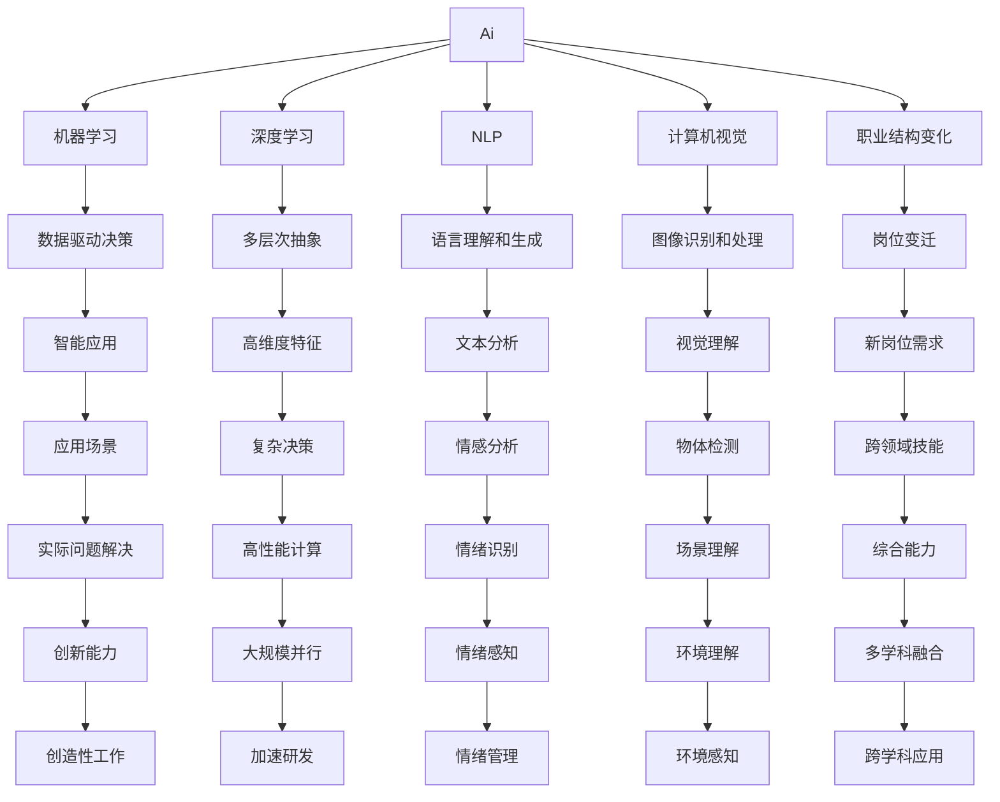

                 

# 人类计算：AI时代的未来就业市场与技能培训发展趋势分析总结挑战

## 1. 背景介绍

### 1.1 问题由来
随着人工智能(AI)技术的迅猛发展，尤其是深度学习、自然语言处理(NLP)、计算机视觉(CV)等领域的突破，AI正逐步渗透到各行各业。这不仅改变了企业的运营模式，也重塑了人类的工作方式和生活方式。然而，AI的崛起同样带来了诸多挑战，尤其是在就业市场和技能培训方面。

### 1.2 问题核心关键点
未来就业市场和技能培训发展趋势的核心在于如何应对AI技术带来的变革，以及如何在这一过程中确保社会公平和可持续发展。关键点包括：
- **就业市场的重构**：AI将改变职业结构，部分传统岗位可能被自动化取代，但同时也会催生新的就业机会。
- **技能培训的变革**：未来劳动力的技能需求将发生变化，职业教育和培训机构需要适应这一趋势，培养具有新技能的人才。
- **政策与伦理的考量**：在推动AI技术应用的同时，需关注其对社会的影响，确保技术发展与社会价值、伦理标准的协调。

### 1.3 问题研究意义
本文聚焦于AI时代下就业市场和技能培训的演变趋势，总结未来发展方向，并探讨在这一过程中面临的挑战，旨在为政策制定者、教育机构和企业提供有价值的参考，帮助他们更好地适应AI时代的变化。

## 2. 核心概念与联系

### 2.1 核心概念概述

为更好地理解AI对就业市场和技能培训的影响，本节将介绍几个核心概念：

- **人工智能(AI)**：一种通过算法和机器学习技术使计算机系统具有智能能力的技术。
- **机器学习(ML)**：AI的一个子领域，指计算机系统通过数据学习并进行决策的能力。
- **深度学习(DL)**：一种特殊的机器学习方法，通过多层神经网络对数据进行抽象和推理。
- **自然语言处理(NLP)**：使计算机能够理解和生成人类语言的技术。
- **计算机视觉(CV)**：使计算机能够“看”和理解图像和视频的技术。
- **职业结构变化**：AI导致的职业岗位变迁，包括新增岗位和消失岗位。
- **技能需求更新**：AI应用对劳动者技能的新要求。
- **教育体系调整**：职业教育体系如何适应AI时代的技能需求。

这些概念之间的联系可以通过以下Mermaid流程图来展示：



这个流程图展示了AI及其相关技术如何影响就业市场和技能培训的各个方面：

1. AI技术通过数据驱动决策和复杂决策能力，使机器能够处理各种实际问题。
2. 深度学习的多层次抽象和计算机视觉的物体检测能力，提升了机器处理复杂图像和视频数据的能力。
3. 自然语言处理的文本分析和情感分析能力，使机器能够理解和生成人类语言。
4. AI技术引发的职业结构变化，导致部分岗位消失，但同时也会催生新的跨领域技能需求。
5. 教育体系的调整，需培养具备新技能的人才，以适应AI时代的就业市场。

## 3. 核心算法原理 & 具体操作步骤
### 3.1 算法原理概述

AI技术在就业市场和技能培训中的应用，本质上是一个多学科交叉的复杂问题。其核心在于通过数据驱动的机器学习模型，预测和引导未来的就业趋势和技能需求。

形式化地，设AI技术对当前就业市场的影响为 $F(x)$，其中 $x$ 为影响因素，包括技术进步、市场需求、政策导向等。理想情况下，模型能够通过历史数据和当前趋势，准确预测未来的就业市场变化和技能需求。

### 3.2 算法步骤详解

AI技术在就业市场和技能培训中的应用，通常包括以下几个关键步骤：

**Step 1: 数据收集与预处理**
- 收集影响就业市场和技能培训的各类数据，如历史就业数据、技术发展趋势、市场需求变化等。
- 清洗和预处理数据，去除噪音，填补缺失值，标准化数据格式。

**Step 2: 特征工程**
- 设计特征集，提取影响就业和技能培训的关键指标，如技术需求、岗位变化、教育投入等。
- 使用主成分分析(PCA)、特征选择等方法，减少特征维度，提高模型效率。

**Step 3: 模型选择与训练**
- 根据数据特点，选择合适的机器学习模型，如线性回归、支持向量机(SVM)、随机森林等。
- 使用历史数据训练模型，调整超参数，如学习率、正则化系数等，最小化预测误差。

**Step 4: 结果验证与优化**
- 在验证集上评估模型性能，如均方误差(MSE)、平均绝对误差(MAE)等。
- 使用交叉验证、网格搜索等技术，优化模型超参数，提高预测准确性。

**Step 5: 结果解释与部署**
- 对模型结果进行解释，提供可视化的图表和报告，帮助政策制定者和教育机构理解未来趋势。
- 将模型部署到实际应用中，持续监控模型性能，根据反馈进行调整。

### 3.3 算法优缺点

AI技术在就业市场和技能培训中的应用，具有以下优点：
1. 数据驱动决策：通过大量历史数据，可以发现就业市场和技能培训的规律和趋势。
2. 模型预测准确：基于机器学习模型的预测，能够提供较为准确的就业市场和技能需求预测。
3. 灵活性高：模型可以根据新数据和新需求进行更新，适应不断变化的就业市场。

同时，也存在以下局限性：
1. 数据依赖性：模型的准确性高度依赖于数据的质量和完整性。
2. 模型黑盒问题：复杂的机器学习模型难以解释，决策过程不透明。
3. 过拟合风险：在面对小样本数据时，模型可能过度拟合，预测结果不准确。
4. 伦理考量：AI模型的应用可能引发伦理问题，如就业歧视、隐私保护等。

### 3.4 算法应用领域

AI技术在就业市场和技能培训中的应用，主要集中在以下几个领域：

1. **就业趋势预测**：利用AI模型预测未来就业市场的发展趋势，包括新增岗位、消失岗位等。
2. **技能需求分析**：分析未来就业市场对劳动者技能的新需求，帮助教育机构和企业调整培训内容。
3. **职业规划指导**：为个人提供基于AI的职业生涯规划建议，推荐适合的技能培训和职业路径。
4. **教育体系优化**：帮助教育机构设计更科学的课程体系，满足未来就业市场的需求。
5. **企业人力资源管理**：利用AI技术优化招聘流程，提高招聘效率，匹配合适的岗位和候选人。

## 4. 数学模型和公式 & 详细讲解 & 举例说明

### 4.1 数学模型构建

本节将使用数学语言对AI技术在就业市场和技能培训中的应用进行更加严格的刻画。

设就业市场影响因素为 $\mathbf{x}=\{x_1,x_2,\ldots,x_n\}$，其中 $x_i$ 为第 $i$ 个影响因素，如技术进步、市场需求、政策导向等。设未来就业市场变化为 $y$，则模型可以表示为：

$$
y = f(\mathbf{x})
$$

其中 $f$ 为预测模型。假设 $f$ 为线性模型，则有：

$$
y = \mathbf{w} \cdot \mathbf{x} + b
$$

其中 $\mathbf{w}$ 为模型参数，$b$ 为截距。

### 4.2 公式推导过程

以线性回归模型为例，推导其预测过程和损失函数。

假设模型在历史数据集 $\mathcal{D}=\{(\mathbf{x}_i,y_i)\}_{i=1}^N$ 上的最小二乘估计参数为 $\mathbf{w}^*$，则预测值为：

$$
\hat{y} = \mathbf{w}^* \cdot \mathbf{x} + b
$$

模型损失函数为均方误差损失函数：

$$
\mathcal{L}(\mathbf{w},b) = \frac{1}{N} \sum_{i=1}^N (y_i - \mathbf{w}^* \cdot \mathbf{x}_i - b)^2
$$

通过最小化损失函数，求得最优参数 $\mathbf{w}^*$ 和 $b$。

### 4.3 案例分析与讲解

以自然语言处理(NLP)为例，分析AI技术在技能培训中的应用。

假设目标任务为文本分类，即根据文本内容判断其所属类别。训练集为 $\mathcal{D}=\{(x_i,y_i)\}_{i=1}^N$，其中 $x_i$ 为文本，$y_i$ 为类别标签。

使用Transformer模型进行微调，步骤如下：

1. 数据预处理：将文本编码成向量，应用BERT等预训练模型提取特征。
2. 任务适配层：在Transformer顶层添加全连接层，输出分类概率。
3. 损失函数：使用交叉熵损失函数，衡量预测概率与真实标签的差异。
4. 模型训练：在标注数据集上使用AdamW优化器进行有监督训练。
5. 模型评估：在验证集上评估模型性能，使用混淆矩阵等指标衡量分类准确性。

通过上述步骤，可以训练出针对文本分类的微调模型，提升技能培训效果。

## 5. 项目实践：代码实例和详细解释说明

### 5.1 开发环境搭建

在进行AI技术应用开发前，我们需要准备好开发环境。以下是使用Python进行TensorFlow开发的环境配置流程：

1. 安装Anaconda：从官网下载并安装Anaconda，用于创建独立的Python环境。

2. 创建并激活虚拟环境：
```bash
conda create -n tensorflow-env python=3.8 
conda activate tensorflow-env
```

3. 安装TensorFlow：根据CUDA版本，从官网获取对应的安装命令。例如：
```bash
conda install tensorflow tensorflow-gpu -c conda-forge
```

4. 安装各类工具包：
```bash
pip install numpy pandas scikit-learn matplotlib tqdm jupyter notebook ipython
```

完成上述步骤后，即可在`tensorflow-env`环境中开始AI技术应用开发。

### 5.2 源代码详细实现

下面以使用TensorFlow进行文本分类的微调为例，给出完整代码实现。

首先，定义数据处理函数：

```python
import tensorflow as tf
from tensorflow.keras.preprocessing.text import Tokenizer
from tensorflow.keras.preprocessing.sequence import pad_sequences

def preprocess_data(texts, labels, max_len=128):
    tokenizer = Tokenizer(num_words=5000, oov_token='<OOV>')
    tokenizer.fit_on_texts(texts)
    sequences = tokenizer.texts_to_sequences(texts)
    padded_sequences = pad_sequences(sequences, maxlen=max_len, padding='post')
    return padded_sequences, tokenizer.word_index, labels
```

然后，定义模型和训练函数：

```python
from tensorflow.keras.models import Sequential
from tensorflow.keras.layers import Embedding, LSTM, Dense

def build_model(vocab_size, max_len):
    model = Sequential([
        Embedding(vocab_size, 100, input_length=max_len),
        LSTM(128),
        Dense(1, activation='sigmoid')
    ])
    model.compile(optimizer='adam', loss='binary_crossentropy', metrics=['accuracy'])
    return model

def train_model(model, train_data, val_data, epochs=10, batch_size=32):
    model.fit(train_data[0], train_data[2], 
              validation_data=(val_data[0], val_data[2]), 
              epochs=epochs, batch_size=batch_size, verbose=2)
    return model
```

接着，定义数据加载函数：

```python
from tensorflow.keras.utils import to_categorical

def load_data(path, labels_path):
    texts = []
    labels = []
    with open(path, 'r') as f:
        for line in f:
            texts.append(line.strip())
    with open(labels_path, 'r') as f:
        for line in f:
            labels.append(int(line.strip()))
    return preprocess_data(texts, labels)
```

最后，启动训练流程：

```python
train_path = 'train.txt'
val_path = 'val.txt'
labels_path = 'labels.txt'

max_len = 128
vocab_size = 5000

train_data, vocab, labels = load_data(train_path, labels_path)
val_data, _, _ = load_data(val_path, labels_path)

model = build_model(vocab_size, max_len)
model = train_model(model, train_data, val_data)
```

以上就是使用TensorFlow进行文本分类的微调过程的完整代码实现。可以看到，TensorFlow提供了丰富的API，可以方便地进行模型定义、数据预处理、训练和评估等步骤。

### 5.3 代码解读与分析

让我们再详细解读一下关键代码的实现细节：

**preprocess_data函数**：
- 使用Tokenizer对文本进行分词，并转换成数字序列。
- 对序列进行填充，保证每个样本长度一致。

**build_model函数**：
- 定义一个包含嵌入层、LSTM层和全连接层的简单文本分类模型。
- 使用Adam优化器，二元交叉熵损失函数，准确率作为评估指标。

**train_model函数**：
- 在训练集上进行模型训练，设置epoch和batch size。
- 使用验证集进行模型评估，监控模型训练过程中的性能。

**load_data函数**：
- 从文本文件中读取训练和验证数据。
- 预处理数据，生成数字序列和标签。

通过这些函数，可以方便地搭建、训练和评估文本分类的微调模型，并使用到实际应用中。

## 6. 实际应用场景

### 6.1 智能招聘系统

AI技术在招聘中的应用，可以通过智能招聘系统实现。通过AI模型分析简历和职位描述，快速筛选出符合条件的候选人，并提供职业建议，提升招聘效率和质量。

例如，可以使用预训练的BERT模型，对简历进行文本分类，判断是否与岗位需求匹配。通过微调模型，还可以进一步提升分类的准确性，减少误判。

### 6.2 教育个性化推荐系统

教育领域可以通过AI技术实现个性化推荐系统，帮助学生找到适合的学习资源。

通过分析学生的学习记录和行为数据，使用机器学习模型预测学生的兴趣和学习需求。通过微调模型，可以更好地理解学生的个性化需求，推荐合适的学习材料和课程。

### 6.3 金融风险评估系统

金融行业可以利用AI技术进行风险评估，预测贷款申请人的违约风险。

通过分析历史贷款数据和申请人的个人信息，使用机器学习模型预测申请人是否可能违约。通过微调模型，可以提高预测的准确性，帮助金融机构更好地控制风险。

### 6.4 未来应用展望

随着AI技术的不断发展，未来在就业市场和技能培训方面的应用将更加广泛和深入。

1. **就业市场自动化**：AI技术可以自动分析和预测就业市场变化，帮助企业和政府制定合理的就业政策，促进就业市场的平衡发展。
2. **技能培训智能化**：AI技术可以自动化设计培训课程，根据未来技能需求，提供个性化学习路径，提升培训效果。
3. **教育公平化**：通过AI技术，可以打破地域和资源的限制，实现教育资源的共享，促进教育公平。
4. **职业发展动态化**：AI技术可以实时分析职业发展趋势，帮助个人和企业制定合理的职业规划。
5. **安全与隐私保护**：AI技术可以用于风险检测和安全监控，保护就业市场和技能培训过程中的数据隐私和安全。

## 7. 工具和资源推荐

### 7.1 学习资源推荐

为了帮助开发者系统掌握AI技术在就业市场和技能培训中的应用，这里推荐一些优质的学习资源：

1. **Coursera《机器学习》课程**：由斯坦福大学教授Andrew Ng主讲，深入浅出地介绍了机器学习的基本概念和算法，是入门学习的优秀资源。
2. **Google AI开发者文档**：提供丰富的AI技术文档和代码示例，涵盖机器学习、NLP、CV等多个领域。
3. **Kaggle竞赛平台**：提供大量数据集和竞赛项目，帮助开发者实践AI技术，提升技能水平。
4. **PyTorch官方文档**：提供TensorFlow和PyTorch等深度学习框架的全面介绍和使用指南。
5. **深度学习框架比较**：比较TensorFlow、PyTorch和Keras等主流框架的特点和适用场景，帮助开发者选择合适的工具。

通过对这些资源的学习实践，相信你一定能够快速掌握AI技术在就业市场和技能培训中的应用，并用于解决实际的就业和培训问题。

### 7.2 开发工具推荐

高效的开发离不开优秀的工具支持。以下是几款用于AI技术应用开发的常用工具：

1. **Jupyter Notebook**：开源的交互式计算环境，方便进行代码调试和数据可视化。
2. **TensorFlow**：由Google主导开发的深度学习框架，支持分布式计算和GPU加速，适合大规模工程应用。
3. **PyTorch**：Facebook开发的深度学习框架，动态计算图，灵活性高，适合快速迭代研究。
4. **Keras**：基于TensorFlow和Theano的高级神经网络API，易于上手，适合初学者。
5. **Anaconda**：Python环境管理工具，支持多种依赖包管理和虚拟环境配置。

合理利用这些工具，可以显著提升AI技术应用开发的效率，加快创新迭代的步伐。

### 7.3 相关论文推荐

AI技术在就业市场和技能培训中的应用，源于学界的持续研究。以下是几篇奠基性的相关论文，推荐阅读：

1. **《AI, machine learning, and the future of work》**：探讨AI技术对未来就业市场的影响，分析就业市场变化的趋势和应对策略。
2. **《Predicting the Future of Employment: An Artificial Intelligence Approach》**：使用机器学习模型预测未来就业市场变化，提供就业趋势预测的方法和技术。
3. **《Learning from Data in the Age of AI: Data Mining, Statistical Learning, and Statistical Intelligence》**：介绍数据驱动的AI技术，分析其在就业市场和技能培训中的应用。
4. **《Towards a theory of job displacement due to automation》**：研究自动化技术对就业市场的影响，提出AI技术在职业结构变化中的应用。
5. **《Skill Requirements for AI-Augmented Jobs》**：分析AI技术对技能需求的影响，提出技能培训的新要求和方法。

这些论文代表了大AI技术在就业市场和技能培训的发展脉络。通过学习这些前沿成果，可以帮助研究者把握学科前进方向，激发更多的创新灵感。

## 8. 总结：未来发展趋势与挑战

### 8.1 总结

本文对AI技术在就业市场和技能培训中的应用进行了全面系统的介绍。首先阐述了AI技术对未来就业市场和技能培训的影响，明确了未来的发展方向和趋势。其次，从原理到实践，详细讲解了AI技术的数学模型和关键步骤，给出了实际应用中的代码实例。同时，本文还广泛探讨了AI技术在招聘、教育、金融等多个行业领域的应用前景，展示了AI技术的巨大潜力。最后，本文总结了未来发展的趋势和面临的挑战，提出了一些有价值的建议和展望。

通过本文的系统梳理，可以看到，AI技术在就业市场和技能培训中的应用前景广阔，但同时也面临着诸多挑战。只有在理解这些挑战的前提下，我们才能更好地应对未来的变化，确保AI技术的健康发展。

### 8.2 未来发展趋势

展望未来，AI技术在就业市场和技能培训中的应用将呈现以下几个发展趋势：

1. **技术自动化普及**：AI技术将逐步自动化到更多行业领域，提高生产效率和创造新的就业机会。
2. **技能需求多样化**：随着AI技术的发展，新的技能需求将不断涌现，职业教育体系需进行相应调整。
3. **教育资源的全球化**：AI技术可以打破地域限制，实现教育资源的全球共享，促进教育公平。
4. **终身学习成为常态**：AI技术的应用将推动终身学习的普及，人们需要不断更新自己的知识和技能。
5. **个性化培训成为主流**：AI技术可以根据个人特点，提供定制化的学习路径和培训方案。
6. **多学科融合发展**：AI技术将与更多学科进行深度融合，推动跨学科发展。

### 8.3 面临的挑战

尽管AI技术在就业市场和技能培训中的应用前景广阔，但在迈向更加智能化、普适化应用的过程中，仍面临诸多挑战：

1. **数据隐私与安全**：AI技术的应用需要大量数据支持，如何保护数据隐私和安全成为重要问题。
2. **伦理与法律问题**：AI技术的广泛应用可能引发伦理和法律问题，需要制定相应的规范和标准。
3. **公平性问题**：AI技术的应用可能加剧社会不公平，如何确保技术的公平性是一个重要课题。
4. **技术失业风险**：AI技术的普及可能导致部分岗位消失，如何缓解技术失业风险是一个需要解决的问题。
5. **模型透明性与解释性**：复杂的AI模型难以解释，如何提升模型的透明性和可解释性是一个重要挑战。
6. **技能升级与培训**：如何帮助劳动者快速适应新的技能需求，是教育和培训机构需要解决的问题。

### 8.4 研究展望

面对AI技术在就业市场和技能培训应用中面临的挑战，未来的研究需要在以下几个方面寻求新的突破：

1. **数据隐私保护**：开发更加安全的数据保护技术，确保数据隐私和安全。
2. **伦理与法律框架**：建立AI技术的伦理与法律框架，规范AI技术的应用。
3. **技术公平性**：开发公平性算法，确保AI技术的公平性。
4. **技能升级机制**：建立技能升级机制，帮助劳动者快速适应新的技能需求。
5. **透明性与解释性**：提升AI模型的透明性和可解释性，增强模型的可信度。
6. **跨学科融合**：推动AI技术与更多学科的深度融合，推动跨学科发展。

这些研究方向的探索，必将引领AI技术在就业市场和技能培训应用中的健康发展，为社会带来更加公正、公平、高效的未来。

## 9. 附录：常见问题与解答

**Q1: AI技术对就业市场有哪些具体影响？**

A: AI技术对就业市场的影响是多方面的：
1. **岗位变化**：AI技术将取代一些重复性、低技能岗位，如数据分析、客服、制造业等。
2. **新岗位产生**：AI技术将催生新的职业岗位，如数据科学家、AI工程师、智能系统维护等。
3. **技能需求更新**：AI技术的发展将改变对技能的需求，如数据分析、编程、机器学习等技能将变得更加重要。

**Q2: 如何应对AI技术带来的就业市场变化？**

A: 应对AI技术带来的就业市场变化，可以从以下几个方面入手：
1. **教育改革**：调整教育体系，培养具备新技能的人才，如编程、数据分析、AI等。
2. **技能升级**：通过职业培训和继续教育，帮助劳动者提升现有技能，适应新的职业需求。
3. **政策支持**：政府应提供相应的政策支持，如失业保险、职业培训补贴等，帮助劳动者顺利过渡到新的职业。
4. **企业责任**：企业应承担社会责任，提供职业转型培训，帮助员工提升新技能。

**Q3: 如何确保AI技术的公平性与伦理性？**

A: 确保AI技术的公平性与伦理性，可以从以下几个方面入手：
1. **数据公平性**：确保训练数据的多样性和代表性，避免数据偏见。
2. **算法透明性**：开发透明的算法，提供可解释的模型输出。
3. **伦理审查**：建立伦理审查机制，对AI技术的应用进行审查和监督。
4. **法律规范**：制定相应的法律规范，确保AI技术的应用符合伦理和法律标准。
5. **社会监督**：建立社会监督机制，确保AI技术的应用符合公众利益。

**Q4: 如何提升AI技术的可解释性？**

A: 提升AI技术的可解释性，可以从以下几个方面入手：
1. **简化模型**：使用更简单的模型结构，降低复杂度，提升可解释性。
2. **透明算法**：使用可解释的算法，如线性模型、决策树等。
3. **解释工具**：使用可解释工具，如LIME、SHAP等，提供模型输出的解释。
4. **可视化**：通过可视化技术，展示模型内部的决策过程和特征重要性。

**Q5: 如何应对AI技术带来的技术失业风险？**

A: 应对AI技术带来的技术失业风险，可以从以下几个方面入手：
1. **再就业培训**：提供再就业培训，帮助失业员工重新进入就业市场。
2. **技能升级**：提供技能升级培训，帮助员工提升现有技能，适应新的职业需求。
3. **创造新岗位**：AI技术的发展将催生新的职业岗位，政府和企业应积极推动新岗位的创造。
4. **社会保障**：建立完善的社会保障体系，提供失业保险、医疗保障等支持。

通过这些措施，可以缓解AI技术带来的技术失业风险，确保社会稳定和公平。

---

作者：禅与计算机程序设计艺术 / Zen and the Art of Computer Programming

