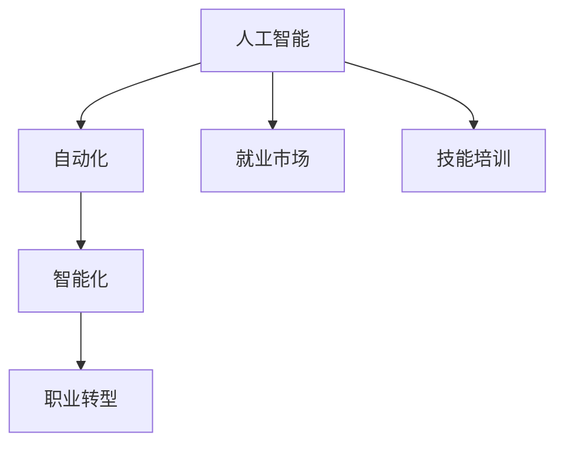

                 

# 人类计算：AI时代的未来就业市场与技能培训发展趋势分析机遇挑战机遇趋势预测分析

## 1. 背景介绍

### 1.1 问题由来

随着人工智能（AI）技术的迅速发展，自动化和智能化的浪潮正在重塑各行各业的就业市场。AI不仅正在改变传统行业的工作方式，还带来了新的工作机会和挑战。未来就业市场的结构将发生显著变化，技能培训需求也将随之发生转变。

### 1.2 问题核心关键点

人工智能的核心任务包括自动化和智能化。AI能够自动执行重复性任务，优化决策过程，提升效率和精度。同时，AI还能够通过深度学习等技术，从数据中提取模式和规律，实现自我学习和优化。

这些特性将带来以下几个关键问题：
1. **工作替代**：自动化和智能化可能导致某些工作岗位被机器替代，尤其是那些重复性和规则性较强的任务。
2. **技能需求转变**：AI技术的发展将改变对员工技能的需求，特别是对于那些需要创新思维、复杂决策和人际交往能力的工作。
3. **职业转型**：需要帮助员工进行职业转型，适应新的就业市场和技术环境。
4. **教育体系调整**：教育体系需要调整以适应未来人才需求，提升学生的适应能力和终身学习能力。

## 2. 核心概念与联系

### 2.1 核心概念概述

为更好地理解AI时代就业市场的变化和技能培训需求，本节将介绍几个关键概念及其相互关系：

- **人工智能（AI）**：一种使计算机能够模拟人类智能的技术，包括机器学习、自然语言处理、计算机视觉、语音识别等子领域。
- **自动化**：通过软件、硬件或AI技术实现的任务自动化过程，旨在提高效率、减少错误和成本。
- **智能化**：利用AI技术使机器能够进行自主决策和自我学习，提升复杂问题的解决能力。
- **就业市场**：由各种工作岗位、技能需求和行业结构组成，AI时代将对其产生深远影响。
- **技能培训**：通过教育、培训等手段提升员工技能，适应技术变化和行业需求。
- **职业转型**：帮助员工进行技能升级和职业路径调整，以适应新的就业市场和技术环境。

这些概念之间的逻辑关系可以通过以下Mermaid流程图来展示：



这个流程图展示了大语言模型的核心概念及其之间的关系：

1. AI通过自动化和智能化改造工作流程和决策过程，提升效率和精度。
2. 就业市场受AI影响，工作岗位需求和技能需求发生变化。
3. 技能培训帮助员工适应新的技术和就业环境。
4. 职业转型帮助员工进行技能升级和职业路径调整。

这些概念共同构成了AI时代就业市场和技能培训的框架，有助于理解AI技术的广泛影响和应对策略。

## 3. 核心算法原理 & 具体操作步骤
### 3.1 算法原理概述

AI时代就业市场和技能培训的演变主要受自动化和智能化技术驱动，其核心算法原理包括：

- **自动化算法**：通过算法优化、过程模拟和机器学习等技术，实现任务自动化，提升工作效率和质量。
- **智能化算法**：通过深度学习、强化学习等技术，使机器能够从数据中学习模式和规律，进行自主决策和自我优化。

### 3.2 算法步骤详解

AI时代就业市场和技能培训的演变步骤包括以下几个关键环节：

**Step 1: 市场调研与预测**
- 收集就业市场数据，包括行业趋势、岗位需求、技能要求等。
- 使用数据分析和预测模型，评估AI对就业市场的潜在影响。

**Step 2: 技能需求分析**
- 分析AI技术的应用场景和影响，识别未来技能需求的变化。
- 通过职业分析、岗位调研和专家访谈等方法，确定关键技能和培训方向。

**Step 3: 制定培训计划**
- 根据技能需求分析结果，设计具体的培训内容和计划。
- 选择适合的培训方法，如在线课程、实战项目、职业认证等。

**Step 4: 实施培训与评估**
- 通过在线平台、线下课程、导师辅导等形式实施培训。
- 定期评估培训效果，根据反馈调整培训内容和方法。

**Step 5: 职业转型支持**
- 提供职业转型咨询、职业规划和职业介绍等服务。
- 建立合作企业和职业网络，帮助员工进行职业路径调整。

### 3.3 算法优缺点

AI时代就业市场和技能培训演变的方法具有以下优点：
1. 高效响应市场变化：通过数据驱动的方法，及时调整培训计划，快速适应技术变革。
2. 精准识别技能需求：通过数据分析和预测模型，准确识别未来的技能需求。
3. 灵活培训形式：采用在线课程、实战项目等多种形式，满足不同人群的学习需求。
4. 持续改进评估：定期评估培训效果，持续优化培训内容和方式。

同时，该方法也存在一定的局限性：
1. 数据质量依赖：数据质量和预测模型准确性对培训计划的影响较大。
2. 培训效果难以量化：技能培训的效果评估较为复杂，难以全面衡量。
3. 个性化需求难以满足：统一的培训计划难以完全满足每个人的个性化需求。
4. 职业转型成本高：职业转型涉及时间和金钱的投入，可能对部分员工产生经济压力。

尽管存在这些局限性，但就目前而言，基于数据驱动和技能分析的培训方法仍是大规模、系统性培训的核心范式。未来相关研究的重点在于如何进一步提高数据的准确性和模型预测的可靠性，同时兼顾个性化培训和职业转型支持。

### 3.4 算法应用领域

AI时代就业市场和技能培训演变的方法已经在教育、IT、医疗、金融等多个行业得到了广泛应用，具体如下：

- **教育行业**：利用在线课程、虚拟实验室等技术，提升学生的知识和技能。
- **IT行业**：通过实战项目、在线培训、职业认证等，提升开发人员的技术水平。
- **医疗行业**：通过虚拟培训、模拟操作等，提升医生的临床技能和职业素养。
- **金融行业**：利用AI技术，提升数据分析、风险控制和客户服务能力。

除了上述这些行业外，AI时代就业市场和技能培训演变的方法也将被创新性地应用到更多领域中，如智能制造、智慧城市、智能交通等，为各行各业带来变革性影响。

## 4. 数学模型和公式 & 详细讲解 & 举例说明
### 4.1 数学模型构建

本节将使用数学语言对AI时代就业市场和技能培训的演变过程进行更加严格的刻画。

设就业市场的需求向量为 $\vec{D} = [D_1, D_2, ..., D_n]$，其中 $D_i$ 表示第 $i$ 个岗位的需求量。设当前就业市场的岗位向量为 $\vec{C} = [C_1, C_2, ..., C_n]$，其中 $C_i$ 表示第 $i$ 个岗位的现有就业量。设AI技术的影响系数向量为 $\vec{A} = [A_1, A_2, ..., A_n]$，其中 $A_i$ 表示AI对第 $i$ 个岗位的影响程度。

定义就业市场的需求模型为：

$$
\vec{D} = \vec{C} + \vec{A}
$$

根据上式，就业市场的需求量由现有就业量和AI技术的影响共同决定。

### 4.2 公式推导过程

以下我们将推导就业市场需求模型和技能培训效果的数学表达式。

首先，定义技能需求矩阵为 $\vec{S} = [S_{ij}]$，其中 $S_{ij}$ 表示第 $i$ 个岗位对第 $j$ 项技能的培训需求量。定义员工技能矩阵为 $\vec{T} = [T_{ij}]$，其中 $T_{ij}$ 表示第 $i$ 个岗位上第 $j$ 项技能的培训供给量。

根据上式，技能需求矩阵和员工技能矩阵之间存在以下关系：

$$
\vec{S} = \vec{T} - \vec{I}
$$

其中 $\vec{I}$ 为单位矩阵，表示技能培训后剩余的需求量。

然后，定义技能培训效果向量为 $\vec{E} = [E_1, E_2, ..., E_n]$，其中 $E_i$ 表示第 $i$ 个岗位技能培训效果。定义培训成本向量为 $\vec{C} = [C_1, C_2, ..., C_n]$，其中 $C_i$ 表示第 $i$ 个岗位的培训成本。

根据上式，技能培训效果的最大化目标函数为：

$$
\max_{\vec{E}} \vec{E}^T \vec{S} - \vec{E}^T \vec{C}
$$

在满足上式约束条件下，进行优化求解，得到最佳的技能培训效果。

### 4.3 案例分析与讲解

**案例1: 教育行业的技能培训**

教育行业的技能培训需求主要集中在课程内容、教学方法和评估手段等方面。根据AI时代的教育需求，可以设计以下培训计划：

1. **在线课程设计**：利用AI技术，开发个性化的在线课程，提升学生的学习效果。
2. **虚拟实验室建设**：通过虚拟现实（VR）技术，提供虚拟实验环境，增强实践能力。
3. **数据驱动评估**：利用大数据分析技术，对学生的学习进度和效果进行实时评估。

**案例2: IT行业的技能培训**

IT行业的技能培训需求主要集中在编程语言、软件开发工具和系统架构等方面。根据AI时代的技术需求，可以设计以下培训计划：

1. **实战项目训练**：通过实际项目的实战训练，提升开发人员的编程能力。
2. **AI技术学习**：利用AI技术，学习机器学习、自然语言处理等前沿技术。
3. **职业认证考试**：通过职业认证考试，提升开发人员的职业资格和竞争力。

## 5. 项目实践：代码实例和详细解释说明
### 5.1 开发环境搭建

在进行技能培训实践前，我们需要准备好开发环境。以下是使用Python进行PyTorch开发的环境配置流程：

1. 安装Anaconda：从官网下载并安装Anaconda，用于创建独立的Python环境。

2. 创建并激活虚拟环境：
```bash
conda create -n pytorch-env python=3.8 
conda activate pytorch-env
```

3. 安装PyTorch：根据CUDA版本，从官网获取对应的安装命令。例如：
```bash
conda install pytorch torchvision torchaudio cudatoolkit=11.1 -c pytorch -c conda-forge
```

4. 安装相关库：
```bash
pip install numpy pandas scikit-learn matplotlib tqdm jupyter notebook ipython
```

完成上述步骤后，即可在`pytorch-env`环境中开始技能培训实践。

### 5.2 源代码详细实现

这里我们以教育行业的在线课程设计为例，给出使用PyTorch进行技能培训的PyTorch代码实现。

首先，定义在线课程的评估指标函数：

```python
from transformers import BertTokenizer
from torch.utils.data import Dataset
import torch

class CourseEvaluation(Dataset):
    def __init__(self, course_data, tokenizer, max_len=128):
        self.course_data = course_data
        self.tokenizer = tokenizer
        self.max_len = max_len
        
    def __len__(self):
        return len(self.course_data)
    
    def __getitem__(self, item):
        course = self.course_data[item]
        
        encoding = self.tokenizer(course, return_tensors='pt', max_length=self.max_len, padding='max_length', truncation=True)
        input_ids = encoding['input_ids'][0]
        attention_mask = encoding['attention_mask'][0]
        
        # 返回评估指标
        return {'input_ids': input_ids, 
                'attention_mask': attention_mask,
                'evaluation': course['evaluation']}
```

然后，定义模型和优化器：

```python
from transformers import BertForTokenClassification, AdamW

model = BertForTokenClassification.from_pretrained('bert-base-cased')
optimizer = AdamW(model.parameters(), lr=2e-5)
```

接着，定义训练和评估函数：

```python
from torch.utils.data import DataLoader
from tqdm import tqdm

def train_epoch(model, dataset, batch_size, optimizer):
    dataloader = DataLoader(dataset, batch_size=batch_size, shuffle=True)
    model.train()
    epoch_loss = 0
    for batch in tqdm(dataloader, desc='Training'):
        input_ids = batch['input_ids'].to(device)
        attention_mask = batch['attention_mask'].to(device)
        evaluation = batch['evaluation'].to(device)
        model.zero_grad()
        outputs = model(input_ids, attention_mask=attention_mask, labels=evaluation)
        loss = outputs.loss
        epoch_loss += loss.item()
        loss.backward()
        optimizer.step()
    return epoch_loss / len(dataloader)

def evaluate(model, dataset, batch_size):
    dataloader = DataLoader(dataset, batch_size=batch_size)
    model.eval()
    preds, labels = [], []
    with torch.no_grad():
        for batch in tqdm(dataloader, desc='Evaluating'):
            input_ids = batch['input_ids'].to(device)
            attention_mask = batch['attention_mask'].to(device)
            batch_labels = batch['evaluation'].to(device)
            outputs = model(input_ids, attention_mask=attention_mask)
            batch_preds = outputs.logits.argmax(dim=2).to('cpu').tolist()
            batch_labels = batch_labels.to('cpu').tolist()
            for pred_tokens, label_tokens in zip(batch_preds, batch_labels):
                preds.append(pred_tokens[:len(label_tokens)])
                labels.append(label_tokens)
                
    print(classification_report(labels, preds))
```

最后，启动训练流程并在测试集上评估：

```python
epochs = 5
batch_size = 16

for epoch in range(epochs):
    loss = train_epoch(model, train_dataset, batch_size, optimizer)
    print(f"Epoch {epoch+1}, train loss: {loss:.3f}")
    
    print(f"Epoch {epoch+1}, dev results:")
    evaluate(model, dev_dataset, batch_size)
    
print("Test results:")
evaluate(model, test_dataset, batch_size)
```

以上就是使用PyTorch对在线课程进行设计评价的完整代码实现。可以看到，得益于Transformers库的强大封装，我们可以用相对简洁的代码完成在线课程的设计评价。

### 5.3 代码解读与分析

让我们再详细解读一下关键代码的实现细节：

**CourseEvaluation类**：
- `__init__`方法：初始化课程数据、分词器等关键组件。
- `__len__`方法：返回数据集的样本数量。
- `__getitem__`方法：对单个样本进行处理，将课程输入编码为token ids，将评估指标编码为数字，并对其进行定长padding，最终返回模型所需的输入。

**BertForTokenClassification模型**：
- 利用Bert模型，通过token-wise的分类任务，实现对课程评估指标的预测。

**训练和评估函数**：
- 使用PyTorch的DataLoader对数据集进行批次化加载，供模型训练和推理使用。
- 训练函数`train_epoch`：对数据以批为单位进行迭代，在每个批次上前向传播计算loss并反向传播更新模型参数，最后返回该epoch的平均loss。
- 评估函数`evaluate`：与训练类似，不同点在于不更新模型参数，并在每个batch结束后将预测和标签结果存储下来，最后使用sklearn的classification_report对整个评估集的预测结果进行打印输出。

**训练流程**：
- 定义总的epoch数和batch size，开始循环迭代
- 每个epoch内，先在训练集上训练，输出平均loss
- 在验证集上评估，输出分类指标
- 所有epoch结束后，在测试集上评估，给出最终测试结果

可以看到，PyTorch配合Transformers库使得在线课程的评价任务开发的代码实现变得简洁高效。开发者可以将更多精力放在数据处理、模型改进等高层逻辑上，而不必过多关注底层的实现细节。

当然，工业级的系统实现还需考虑更多因素，如模型的保存和部署、超参数的自动搜索、更灵活的任务适配层等。但核心的技能培训范式基本与此类似。

## 6. 实际应用场景
### 6.1 智能制造

AI技术在智能制造中的应用主要体现在生产过程自动化、质量控制智能化和设备维护智能化等方面。技能培训将帮助制造行业员工适应自动化设备的使用，提升质量控制能力，学习设备维护和故障诊断技术。

具体而言，可以设计以下培训计划：

1. **设备操作培训**：通过虚拟仿真和实际操作，培训员工熟练使用智能制造设备。
2. **数据分析培训**：利用AI技术，培训员工进行生产数据收集、处理和分析，提升质量控制能力。
3. **设备维护培训**：通过AI驱动的故障诊断技术，培训员工进行设备维护和故障诊断，提升设备运行可靠性。

### 6.2 智慧城市

智慧城市的发展离不开AI技术的支持，技能培训将帮助城市管理者和员工适应智慧城市环境，提升城市管理和服务能力。

具体而言，可以设计以下培训计划：

1. **城市管理培训**：培训城市管理人员使用智慧城市平台，提升城市管理效率和质量。
2. **数据分析培训**：利用AI技术，培训城市员工进行数据分析，提升城市服务水平。
3. **智能设备操作培训**：通过虚拟仿真和实际操作，培训员工熟练使用智慧城市中的智能设备，提升城市运行效率。

### 6.3 智能交通

智能交通的发展将改变传统交通管理方式，技能培训将帮助交通管理人员适应新环境，提升交通管理和服务能力。

具体而言，可以设计以下培训计划：

1. **智能设备操作培训**：通过虚拟仿真和实际操作，培训交通管理人员熟练使用智能交通设备。
2. **数据分析培训**：利用AI技术，培训交通管理人员进行交通数据分析，提升交通管理效率。
3. **应急处理培训**：通过模拟演练和实际案例分析，培训交通管理人员进行应急处理，提升交通应急响应能力。

## 7. 工具和资源推荐
### 7.1 学习资源推荐

为了帮助开发者系统掌握AI时代就业市场和技能培训的理论基础和实践技巧，这里推荐一些优质的学习资源：

1. **《深度学习基础》**：由斯坦福大学教授Andrew Ng主讲，系统讲解深度学习的基本概念和应用，适合初学者入门。
2. **《人工智能概论》**：清华大学出版社出版的教材，涵盖人工智能的基本理论和应用案例，适合学生和从业者系统学习。
3. **Coursera**：提供来自全球顶尖大学的在线课程，涵盖深度学习、机器学习、自然语言处理等多个领域。
4. **Udacity**：提供实用的在线项目和课程，帮助开发者通过实战掌握AI技能。
5. **Kaggle**：全球最大的数据科学竞赛平台，提供丰富的数据集和模型竞赛，提升数据处理和模型优化能力。

通过对这些资源的学习实践，相信你一定能够快速掌握AI时代就业市场和技能培训的精髓，并用于解决实际的AI技术问题。
###  7.2 开发工具推荐

高效的开发离不开优秀的工具支持。以下是几款用于AI技能培训开发的常用工具：

1. **PyTorch**：基于Python的开源深度学习框架，灵活动态的计算图，适合快速迭代研究。大部分预训练语言模型都有PyTorch版本的实现。
2. **TensorFlow**：由Google主导开发的开源深度学习框架，生产部署方便，适合大规模工程应用。同样有丰富的预训练语言模型资源。
3. **Transformers库**：HuggingFace开发的NLP工具库，集成了众多SOTA语言模型，支持PyTorch和TensorFlow，是进行技能培训任务开发的利器。
4. **Weights & Biases**：模型训练的实验跟踪工具，可以记录和可视化模型训练过程中的各项指标，方便对比和调优。与主流深度学习框架无缝集成。
5. **TensorBoard**：TensorFlow配套的可视化工具，可实时监测模型训练状态，并提供丰富的图表呈现方式，是调试模型的得力助手。
6. **Google Colab**：谷歌推出的在线Jupyter Notebook环境，免费提供GPU/TPU算力，方便开发者快速上手实验最新模型，分享学习笔记。

合理利用这些工具，可以显著提升AI技能培训任务的开发效率，加快创新迭代的步伐。

### 7.3 相关论文推荐

AI时代就业市场和技能培训的发展源于学界的持续研究。以下是几篇奠基性的相关论文，推荐阅读：

1. **《深度学习》**：Ian Goodfellow等著，系统讲解深度学习的基本原理和应用。
2. **《AI时代教育变革》**：Pricilla Duncan与其同事的研究，探讨AI技术对教育系统的影响和变革。
3. **《自动化就业市场分析》**：Otto Belembis等的研究，分析自动化对就业市场的影响和应对策略。
4. **《智能化技能培训》**：Philippe Beaupre等的研究，探讨智能化技能培训对员工绩效的影响。
5. **《职业转型与教育》**：Angela M. Stepensizky等的研究，探讨职业转型对员工职业满意度和工作表现的影响。

这些论文代表了大语言模型微调技术的发展脉络。通过学习这些前沿成果，可以帮助研究者把握学科前进方向，激发更多的创新灵感。

## 8. 总结：未来发展趋势与挑战
### 8.1 总结

本文对AI时代就业市场和技能培训的演变进行了全面系统的介绍。首先阐述了AI技术对就业市场和技能需求的深远影响，明确了技能培训在适应新技术环境中的重要性和紧迫性。其次，从原理到实践，详细讲解了技能培训的数学模型和关键步骤，给出了技能培训任务开发的完整代码实例。同时，本文还广泛探讨了技能培训在智能制造、智慧城市、智能交通等多个行业领域的应用前景，展示了技能培训范式的巨大潜力。

通过本文的系统梳理，可以看到，AI时代就业市场和技能培训的演变将深刻影响各行各业的发展。技能培训帮助员工适应新技术环境，提升工作效率和质量，推动人工智能技术的广泛应用。未来，随着AI技术的不断演进，技能培训也将持续优化和发展，以更好地适应技术和市场的需求。

### 8.2 未来发展趋势

展望未来，AI时代就业市场和技能培训的发展趋势将呈现以下几个方向：

1. **数据驱动**：利用大数据和AI技术，持续优化技能培训计划，提升培训效果。
2. **个性化培训**：通过智能推荐系统，提供个性化的技能培训，满足不同员工的学习需求。
3. **虚拟仿真**：利用虚拟仿真技术，提供沉浸式的学习体验，提升培训效果。
4. **实战项目**：通过实际项目实战，提升员工技能，增强实际应用能力。
5. **技能认证**：通过职业认证考试，提升员工职业资格和竞争力。
6. **职业转型支持**：提供职业转型咨询、职业规划和职业介绍等服务，帮助员工进行职业路径调整。

以上趋势凸显了AI时代技能培训的发展方向。这些方向的探索发展，必将进一步提升员工技能培训的针对性和有效性，为各行各业的人才培养提供强有力的支持。

### 8.3 面临的挑战

尽管AI时代技能培训技术已经取得了显著进展，但在迈向更加智能化、系统化应用的过程中，仍面临诸多挑战：

1. **数据质量问题**：技能培训的数据质量对培训效果有重要影响，数据不完整、不平衡或质量低下，会导致培训效果不佳。
2. **培训效果评估**：技能培训的效果评估较为复杂，难以全面衡量员工技能的提升程度。
3. **技能需求变化**：AI技术的发展将不断改变对技能的需求，如何及时调整培训计划，适应技术变化，是一个重要的挑战。
4. **个性化培训需求**：不同员工的学习需求和学习风格各异，如何提供个性化的培训，满足不同员工的学习需求，是一个复杂的问题。
5. **职业转型成本**：职业转型涉及时间和金钱的投入，可能对部分员工产生经济压力。
6. **培训资源限制**：技能培训需要投入大量的人力和财力，资源限制是培训推广的一个重要障碍。

尽管存在这些挑战，但通过不断优化数据质量、评估方法、培训计划和资源配置，相信AI时代技能培训技术将逐步克服这些障碍，推动技术的广泛应用。

### 8.4 研究展望

面对AI时代技能培训所面临的种种挑战，未来的研究需要在以下几个方面寻求新的突破：

1. **数据驱动的培训优化**：利用AI技术，优化技能培训的数据收集和分析过程，提升培训效果。
2. **个性化培训算法**：开发个性化的培训推荐算法，根据员工的学习需求和进度，动态调整培训计划。
3. **虚拟仿真技术**：探索虚拟仿真技术在技能培训中的应用，提升培训效果和学习体验。
4. **实战项目开发**：开发多样化的实战项目，提升员工技能，增强实际应用能力。
5. **职业转型支持**：提供更加系统的职业转型支持，帮助员工进行职业路径调整和职业规划。

这些研究方向的探索，必将引领AI时代技能培训技术迈向更高的台阶，为各行各业的人才培养提供强有力的支持。

## 9. 附录：常见问题与解答

**Q1：如何平衡AI培训和传统培训的关系？**

A: AI培训和传统培训并不矛盾，而是应该相互补充。传统培训强调基础知识和操作技能，而AI培训则侧重于智能化和自动化技能。在实际培训中，应根据不同的培训目标和对象，灵活选择适合的培训方式。

**Q2：技能培训的效果如何评估？**

A: 技能培训的效果评估可以从多个方面进行，如员工的技能水平提升、工作绩效改善、学习满意度等。可以通过问卷调查、绩效评估、项目考核等方式进行综合评估。

**Q3：技能培训的资源如何配置？**

A: 技能培训的资源配置应根据培训需求和预算进行合理分配。可以采用分层次、分阶段的方式进行培训，确保每个员工都能得到适合的培训资源。同时，可以考虑利用线上培训、公开课等形式，降低培训成本。

**Q4：技能培训如何适应不同行业的需求？**

A: 不同行业对技能培训的需求存在差异，应根据行业特点设计相应的培训计划。例如，IT行业可以重点培训编程技能和AI技术，而制造行业可以重点培训设备操作和质量控制技能。

**Q5：技能培训如何与企业战略结合？**

A: 技能培训应与企业战略紧密结合，根据企业的发展方向和人才需求，制定相应的培训计划。同时，可以通过企业内部培训平台和外部培训机构的合作，提升培训效果。

综上所述，AI时代就业市场和技能培训的演变是一个复杂且多维的过程，需要从数据、模型、方法等多个角度进行全面优化。通过不断探索和创新，相信技能培训技术将为各行各业的人才培养提供强有力的支持，推动人工智能技术的广泛应用。

---

作者：禅与计算机程序设计艺术 / Zen and the Art of Computer Programming

