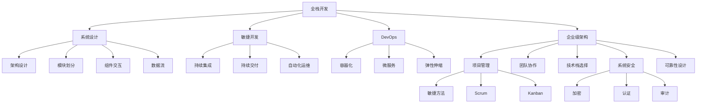
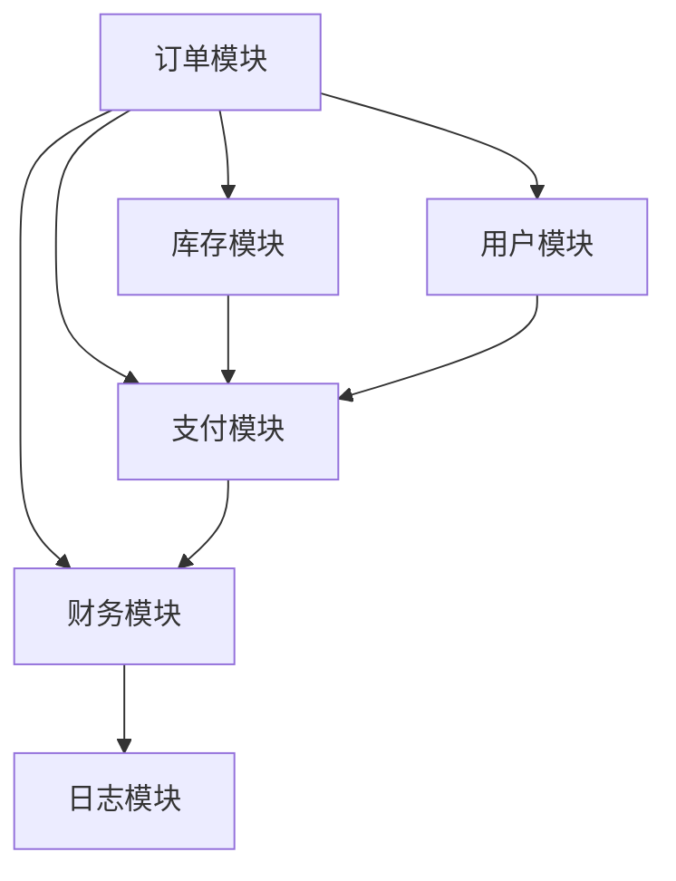
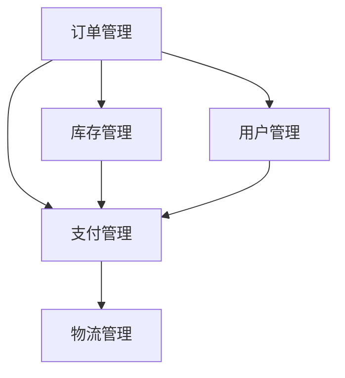

                 

# 从全栈开发到企业级架构师的进阶之路

> 关键词：全栈开发,企业级架构,系统设计,软件开发,技术管理,软件架构师,敏捷开发

## 1. 背景介绍

### 1.1 问题由来

随着科技的迅猛发展，软件技术不断革新，企业对软件系统的要求越来越高。从简单的单功能应用，到复杂的分布式微服务系统，企业软件架构师需要具备越来越综合的技术能力和管理能力。这不仅需要他们在技术上精通前后端开发，还需要对系统设计、项目管理、团队协作等有深刻的理解。

本文将从全栈开发入手，循序渐进地介绍如何从全栈开发人员成长为一名卓越的企业级架构师。从基础到高级，逐步展现技术栈的拓展、技术思维的转变和项目管理能力的提升。

### 1.2 问题核心关键点

全栈开发到企业级架构师进阶的关键点包括：

- 系统架构设计：掌握不同架构模式及其适用场景，如单体应用、微服务、微内核等。
- 技术栈优化：根据项目需求选择最佳技术栈，优化系统性能和可维护性。
- 项目管理与团队协作：掌握敏捷开发、Scrum、Kanban等项目管理方法。
- 技术管理和迭代：持续学习和实践，保持技术领先和创新，提升团队效率。
- 系统安全与可靠性：设计安全机制、高可用架构，确保系统安全稳定运行。
- 云原生技术：了解云计算、容器化、DevOps等云原生技术，提升系统灵活性和扩展性。

## 2. 核心概念与联系

### 2.1 核心概念概述

为更好地理解全栈开发到企业级架构师进阶的路径，本节将介绍几个密切相关的核心概念：

- 全栈开发(Full-Stack Development)：指一个开发人员能够覆盖软件开发生命周期的所有阶段，包括前端和后端的开发、数据库设计、接口开发、测试等。
- 企业级架构(Enterprise Architecture)：指一个企业应用系统整体的设计、开发和运维规范。包括架构设计、技术栈选择、项目管理、团队协作等多个方面。
- 系统设计(System Design)：指设计系统架构、模块划分、组件交互、数据流等，确保系统的高效、可靠、可维护。
- 敏捷开发(Agile Development)：指通过快速迭代、持续交付的方式进行软件开发，强调团队协作和客户反馈。
- DevOps：指将开发和运维紧密结合，通过持续集成、持续部署、自动化运维等手段提升软件交付效率。
- 云原生(Cloud-Native)：指设计基于云环境的软件架构，通过容器化、微服务、弹性伸缩等技术提升系统灵活性和扩展性。

这些概念之间的逻辑关系可以通过以下Mermaid流程图来展示：



这个流程图展示了全栈开发到企业级架构师进阶的核心概念及其之间的关系：

1. 全栈开发是基础，覆盖前端和后端的开发、测试等。
2. 系统设计是核心，通过架构设计、模块划分、组件交互、数据流等构建系统框架。
3. 敏捷开发和DevOps是关键，提升开发效率和运维效率。
4. 企业级架构是目标，通过项目管理、团队协作、技术栈选择、安全设计等构建企业级系统。
5. 云原生技术是前沿，通过容器化、微服务、弹性伸缩等技术提升系统灵活性和扩展性。

这些概念共同构成了全栈开发到企业级架构师进阶的框架，使开发人员能够系统性地提升自己的技术能力和管理能力。通过理解这些核心概念，我们可以更好地把握从全栈开发到企业级架构师进阶的路径。

## 3. 核心算法原理 & 具体操作步骤
### 3.1 算法原理概述

从全栈开发到企业级架构师的进阶，本质上是一个从基础到高级的系统化学习过程。其核心思想是：通过不断深入学习技术栈、项目管理、系统设计等，逐步掌握企业级架构设计的关键技能。

### 3.2 算法步骤详解

本节将详细介绍从全栈开发到企业级架构师进阶的具体步骤：

**Step 1: 基础技术栈掌握**
- 学习编程语言：掌握主流编程语言，如Java、Python、JavaScript等。
- 学习数据库技术：了解关系型数据库、非关系型数据库、SQL、NoSQL等。
- 学习前端技术：掌握HTML、CSS、JavaScript、React、Vue等前端框架。
- 学习后端技术：掌握RESTful API设计、微服务架构、Spring、Django等后端框架。
- 学习测试技术：掌握单元测试、集成测试、自动化测试等。

**Step 2: 系统设计思维建立**
- 学习架构模式：掌握MVC、MVVM、微服务、微内核等架构模式。
- 学习设计原则：掌握 SOLID、DRY、KISS 等设计原则。
- 学习架构评估：掌握软件开发生命周期、设计模式、架构模式等评估标准。
- 学习架构工具：掌握 UML、ERD、架构可视化工具等。

**Step 3: 项目管理能力提升**
- 学习敏捷方法：掌握 Scrum、Kanban、XP 等敏捷开发方法。
- 学习项目管理工具：掌握 JIRA、Trello、Confluence 等项目管理工具。
- 学习团队协作：掌握沟通技巧、团队建设、代码评审等。
- 学习持续集成：掌握 Jenkins、Travis CI、GitLab CI 等持续集成工具。
- 学习持续交付：掌握自动化部署、容器化、DevOps 等技术。

**Step 4: 企业级架构设计**
- 学习架构设计：掌握架构评估、架构定义、架构演化等。
- 学习技术栈选择：根据项目需求选择最佳技术栈。
- 学习项目管理：掌握项目计划、资源管理、进度控制等。
- 学习团队协作：掌握团队建设、沟通技巧、代码评审等。
- 学习系统安全：掌握加密、认证、审计等安全机制。
- 学习可靠性设计：掌握高可用架构、故障恢复机制等。
- 学习云原生技术：掌握容器化、微服务、弹性伸缩等云原生技术。

**Step 5: 持续学习和实践**
- 持续学习新技术：保持对新技术的关注和理解，定期学习新工具、新框架、新算法等。
- 持续实践和优化：通过实际项目不断实践和优化，提升技术能力和管理能力。
- 持续改进和迭代：不断总结经验，改进流程和工具，提升团队效率和项目质量。

### 3.3 算法优缺点

从全栈开发到企业级架构师的进阶方法具有以下优点：
1. 全面系统：涵盖技术栈、项目管理、系统设计、安全可靠性等多个方面，全面提升技术能力和管理能力。
2. 实用性强：每个步骤都有具体的实践建议和技术工具，易于上手。
3. 灵活可控：可根据自身需求和经验，灵活调整进阶步骤，找到最适合自己的路径。

同时，该方法也存在一些局限性：
1. 学习周期长：进阶过程涉及多个领域，需要大量时间和精力投入。
2. 技术栈广：需要掌握多种技术栈和工具，初期可能会感到压力。
3. 难度大：企业级架构设计复杂，需要较高的系统思维和项目管理能力。
4. 需求变化快：技术栈、项目管理方法等不断变化，需要持续学习和更新。

尽管存在这些局限性，但就目前而言，从全栈开发到企业级架构师的进阶方法仍是最为全面、系统的方法，具有较高的实用性和参考价值。

### 3.4 算法应用领域

从全栈开发到企业级架构师的进阶方法，适用于多种软件开发和项目管理场景，如：

- 中小型应用开发：通过全栈开发和系统设计，构建高效、可靠的应用系统。
- 大型企业应用开发：通过企业级架构设计，构建可扩展、可维护、高可靠的企业级系统。
- 敏捷项目开发：通过敏捷开发和DevOps方法，提高项目交付效率和质量。
- 分布式系统开发：通过微服务架构和云原生技术，构建灵活、高效的分布式系统。
- 数据驱动项目开发：通过大数据分析和云存储技术，构建数据驱动的智能系统。
- 安全可靠系统开发：通过系统安全设计和架构评估，构建安全、可靠的系统。

除了这些经典场景外，进阶方法还适用于更多场景，如游戏开发、物联网应用、区块链应用等，帮助开发者构建更高效、稳定、安全的软件系统。

## 4. 数学模型和公式 & 详细讲解 & 举例说明
### 4.1 数学模型构建

本文将从软件架构设计的角度，介绍一个基本的软件架构模型，以及如何使用数学模型来描述和分析软件系统。

假设一个企业级应用系统由多个模块组成，每个模块的功能和依赖关系如下图所示：



这个模型可以用有向图来表示，其中节点表示模块，边表示模块间的依赖关系。每个模块可以表示为一个函数 $f_i$，其中 $i$ 表示模块编号，$f_i$ 表示模块的功能实现。系统的整体功能 $F$ 可以表示为所有模块功能的组合：

$$
F = f_A \cdot f_B \cdot f_C \cdot f_D \cdot f_E
$$

其中 $\cdot$ 表示函数组合，即模块间的依赖关系。

### 4.2 公式推导过程

接下来，我们进一步分析上述模型，推导出系统的计算复杂度：

假设每个模块的计算复杂度为 $C_i$，系统的计算复杂度 $C$ 可以表示为所有模块计算复杂度的乘积：

$$
C = C_A \cdot C_B \cdot C_C \cdot C_D \cdot C_E
$$

因此，系统的总计算复杂度为所有模块计算复杂度的乘积。

在实际的软件架构设计中，为了降低系统计算复杂度，通常会采用模块化设计、多线程并发、分布式计算等技术。这些技术可以通过数学模型进行分析和评估，帮助设计更加高效、灵活的软件系统。

### 4.3 案例分析与讲解

考虑一个电商平台的订单处理系统，系统架构如下图所示：



假设订单管理的计算复杂度为 $C_A = O(n)$，库存管理的计算复杂度为 $C_B = O(n^2)$，用户管理的计算复杂度为 $C_C = O(1)$，支付管理的计算复杂度为 $C_D = O(n^3)$，物流管理的计算复杂度为 $C_E = O(n^4)$。

根据上述公式，系统的总计算复杂度为：

$$
C = C_A \cdot C_B \cdot C_C \cdot C_D \cdot C_E = O(n) \cdot O(n^2) \cdot O(1) \cdot O(n^3) \cdot O(n^4) = O(n^7)
$$

可以看出，由于库存管理和支付管理的计算复杂度较高，系统的总计算复杂度为 $O(n^7)$，因此需要采用分布式计算、缓存机制等技术，以降低系统计算复杂度，提升系统性能。

## 5. 项目实践：代码实例和详细解释说明
### 5.1 开发环境搭建

在进行项目实践前，我们需要准备好开发环境。以下是使用Java进行Spring Boot开发的环境配置流程：

1. 安装Java JDK：从官网下载并安装JDK，推荐安装最新版本。
2. 安装Maven：从官网下载并安装Maven，用于构建和管理项目依赖。
3. 安装Git：从官网下载并安装Git，用于版本控制。
4. 安装IDE：安装如IntelliJ IDEA、Eclipse等IDE，用于开发和调试。

完成上述步骤后，即可在IDE中开始项目开发。

### 5.2 源代码详细实现

下面我们以电商平台的订单管理模块为例，给出使用Spring Boot进行微服务的PyTorch代码实现。

首先，定义订单管理模块的实体类：

```java
@Entity
public class Order {
    @Id
    @GeneratedValue(strategy = GenerationType.IDENTITY)
    private Long id;
    private String orderNumber;
    private String customerName;
    private Double orderTotal;
    private String paymentMethod;
    // 省略其他字段和setter getter方法
}
```

然后，定义订单管理模块的服务类：

```java
@Service
public class OrderService {
    @Autowired
    private OrderRepository orderRepository;
    @Autowired
    private PaymentService paymentService;
    // 省略其他字段和方法
    public Order saveOrder(Order order) {
        // 保存订单信息
        // 调用支付服务进行支付
        return orderRepository.save(order);
    }
}
```

接着，定义订单管理模块的控制器类：

```java
@RestController
@RequestMapping("/orders")
public class OrderController {
    @Autowired
    private OrderService orderService;
    // 省略其他字段和方法
    @GetMapping("/{id}")
    public ResponseEntity<Order> getOrderById(@PathVariable Long id) {
        // 根据订单ID获取订单信息
        return ResponseEntity.ok(orderService.findById(id));
    }
}
```

最后，启动订单管理模块的服务：

```java
@SpringBootApplication
public class OrderApplication {
    public static void main(String[] args) {
        SpringApplication.run(OrderApplication.class, args);
    }
}
```

以上就是使用Spring Boot进行电商平台的订单管理模块开发的完整代码实现。可以看到，借助Spring Boot的强大功能和便捷的开发体验，我们能够快速构建出高效、可维护的微服务系统。

### 5.3 代码解读与分析

让我们再详细解读一下关键代码的实现细节：

**Order类**：
- 定义订单实体类，包含订单ID、订单号、客户姓名、订单总额、支付方式等属性。
- 使用JPA注解定义实体映射关系和主键自增长策略。

**OrderService类**：
- 定义订单服务类，通过@Autowired注解注入订单仓库和支付服务。
- 实现订单的增删改查等操作，调用支付服务进行支付操作。

**OrderController类**：
- 定义订单控制器类，通过@Autowired注解注入订单服务。
- 实现获取订单信息等操作，使用RESTful API设计规范。

**OrderApplication类**：
- 定义Spring Boot应用入口类，使用@SpringBootApplication注解定义Spring Boot应用程序。
- 在main方法中启动Spring Boot应用。

这些代码展示了从全栈开发到企业级架构师进阶的具体实践，包括实体类、服务类、控制器类和应用入口类的定义。借助Spring Boot的强大功能和便捷的开发体验，开发者能够快速构建出高效、可维护的微服务系统。

当然，工业级的系统实现还需考虑更多因素，如消息队列、事务管理、安全机制等。但核心的微服务架构设计思路基本与此类似。

## 6. 实际应用场景
### 6.1 智能客服系统

基于微服务架构的全栈开发，可以应用于智能客服系统的构建。传统客服往往需要配备大量人力，高峰期响应缓慢，且一致性和专业性难以保证。而使用微服务架构的智能客服系统，可以7x24小时不间断服务，快速响应客户咨询，用自然流畅的语言解答各类常见问题。

在技术实现上，可以采用Spring Boot和Docker容器化技术构建微服务，通过RESTful API设计规范进行接口调用，实现多语言支持的自然语言处理系统。智能客服系统可以整合语音识别、语音合成、自然语言理解等技术，提高客户咨询体验和问题解决效率。

### 6.2 金融舆情监测

金融机构需要实时监测市场舆论动向，以便及时应对负面信息传播，规避金融风险。传统的人工监测方式成本高、效率低，难以应对网络时代海量信息爆发的挑战。基于微服务架构的全栈开发，可以构建实时数据采集、处理和分析系统，及时监测舆情变化，预测市场风险。

在技术实现上，可以采用Spring Boot和Kafka消息队列技术，实现实时数据采集和处理。通过引入大数据分析、机器学习等技术，构建舆情监测模型，预测市场趋势和风险，及时预警，帮助金融机构快速应对潜在风险。

### 6.3 个性化推荐系统

当前的推荐系统往往只依赖用户的历史行为数据进行物品推荐，无法深入理解用户的真实兴趣偏好。基于微服务架构的全栈开发，可以构建基于用户行为和兴趣的推荐系统，提供更精准、多样的推荐内容。

在技术实现上，可以采用Spring Boot和ElasticSearch等技术，构建用户行为和兴趣分析系统。通过引入深度学习、自然语言处理等技术，构建推荐模型，根据用户行为和兴趣，动态生成推荐列表。

### 6.4 未来应用展望

随着微服务架构和全栈开发技术的不断发展，基于微服务架构的全栈开发必将在更多领域得到应用，为传统行业带来变革性影响。

在智慧医疗领域，基于微服务架构的全栈开发可以构建医疗问答、病历分析、药物研发等系统，提升医疗服务的智能化水平，辅助医生诊疗，加速新药开发进程。

在智能教育领域，基于微服务架构的全栈开发可以构建作业批改、学情分析、知识推荐等系统，因材施教，促进教育公平，提高教学质量。

在智慧城市治理中，基于微服务架构的全栈开发可以构建城市事件监测、舆情分析、应急指挥等系统，提高城市管理的自动化和智能化水平，构建更安全、高效的未来城市。

此外，在企业生产、社会治理、文娱传媒等众多领域，基于微服务架构的全栈开发的应用场景也将不断涌现，为经济社会发展注入新的动力。相信随着技术的日益成熟，基于微服务架构的全栈开发必将在构建人机协同的智能时代中扮演越来越重要的角色。

## 7. 工具和资源推荐
### 7.1 学习资源推荐

为了帮助开发者系统掌握微服务架构和全栈开发的技术基础和实践技巧，这里推荐一些优质的学习资源：

1. Spring Boot官方文档：Spring Boot官方文档提供了全面的API和教程，是学习Spring Boot的基础。
2. Docker官方文档：Docker官方文档提供了Docker容器的详细使用指南，是学习容器化的必备资料。
3. Kubernetes官方文档：Kubernetes官方文档提供了Kubernetes集群的管理和部署指南，是学习Kubernetes的基础。
4. ElasticSearch官方文档：ElasticSearch官方文档提供了ElasticSearch的详细使用指南，是学习大数据分析的基础。
5. Redis官方文档：Redis官方文档提供了Redis的详细使用指南，是学习缓存机制的基础。

通过对这些资源的学习实践，相信你一定能够快速掌握微服务架构和全栈开发的核心技能，并用于解决实际的系统开发问题。

### 7.2 开发工具推荐

高效的开发离不开优秀的工具支持。以下是几款用于全栈开发和微服务架构开发的常用工具：

1. IntelliJ IDEA：一款流行的Java开发IDE，提供便捷的开发环境和丰富的插件。
2. Spring Boot：一款基于Spring框架的快速开发框架，支持Spring MVC、RESTful API设计等。
3. Docker：一款开源的容器化平台，支持快速构建、运行和管理容器。
4. Kubernetes：一款开源的容器编排平台，支持大规模集群管理。
5. ElasticSearch：一款开源的全文搜索引擎，支持分布式索引和搜索。
6. Redis：一款开源的内存数据库，支持快速读写和缓存。
7. Git：一款常用的版本控制系统，支持分布式版本控制和代码协作。

合理利用这些工具，可以显著提升微服务架构和全栈开发的开发效率，加快创新迭代的步伐。

### 7.3 相关论文推荐

全栈开发到企业级架构师进阶的演变过程，源于学界的持续研究。以下是几篇奠基性的相关论文，推荐阅读：

1. The Twelve-Factor App：介绍十二个应用程序设计原则，是微服务架构的基石。
2. Microservices: A Pattern for Distributed Systems Development：介绍微服务架构的设计和实现方法，是微服务架构的权威指南。
3. Spring Boot官方文档：Spring Boot官方文档提供了全面的API和教程，是学习Spring Boot的基础。
4. Docker官方文档：Docker官方文档提供了Docker容器的详细使用指南，是学习容器化的必备资料。
5. Kubernetes官方文档：Kubernetes官方文档提供了Kubernetes集群的管理和部署指南，是学习Kubernetes的基础。
6. ElasticSearch官方文档：ElasticSearch官方文档提供了ElasticSearch的详细使用指南，是学习大数据分析的基础。
7. Redis官方文档：Redis官方文档提供了Redis的详细使用指南，是学习缓存机制的基础。

这些论文代表了大规模微服务架构的发展脉络。通过学习这些前沿成果，可以帮助研究者把握学科前进方向，激发更多的创新灵感。

## 8. 总结：未来发展趋势与挑战
### 8.1 总结

本文对从全栈开发到企业级架构师进阶的方法进行了全面系统的介绍。首先阐述了从全栈开发到企业级架构师进阶的关键点，包括系统架构设计、技术栈优化、项目管理与团队协作等。其次，从原理到实践，详细讲解了微服务架构和全栈开发的具体步骤，给出了微服务系统开发的完整代码实例。同时，本文还广泛探讨了微服务架构在智能客服、金融舆情、个性化推荐等多个行业领域的应用前景，展示了微服务架构的巨大潜力。

通过本文的系统梳理，可以看到，从全栈开发到企业级架构师进阶的方法，涵盖了微服务架构设计、项目管理、系统设计等多个方面，使开发者能够系统性地提升自己的技术能力和管理能力。从基础到高级，逐步拓展技术栈、提升思维能力和项目管理水平，最终实现从全栈开发到企业级架构师的进阶。

### 8.2 未来发展趋势

展望未来，全栈开发到企业级架构师的进阶方法将呈现以下几个发展趋势：

1. 技术栈更加多样化：未来开发者将需要掌握更多技术栈，如区块链、云计算、人工智能等。
2. 项目管理更加敏捷：敏捷开发、DevOps、Scrum等项目管理方法将进一步普及。
3. 系统设计更加灵活：微服务架构、容器化、DevOps等技术将进一步发展。
4. 云原生技术更加普及：云原生技术将成为主流，促进企业级系统的灵活性和扩展性。
5. 系统安全更加重视：系统安全设计将成为关键，保护企业数据和系统的安全稳定。
6. 人工智能更加融合：人工智能技术将与微服务架构、全栈开发等深度融合，推动智能系统的发展。

以上趋势凸显了全栈开发到企业级架构师进阶的广阔前景。这些方向的探索发展，必将进一步提升开发者的技术能力和管理能力，为构建高效、稳定、可扩展的企业级系统奠定坚实基础。

### 8.3 面临的挑战

尽管全栈开发到企业级架构师进阶的方法已经取得了一定的成果，但在迈向更加智能化、普适化应用的过程中，它仍面临着诸多挑战：

1. 技术栈广且复杂：开发者需要掌握多种技术栈和工具，初期可能会感到压力。
2. 项目管理方法不断变化：敏捷开发、DevOps等方法不断变化，需要持续学习和更新。
3. 系统设计和优化困难：微服务架构设计复杂，需要较高的系统思维和项目管理能力。
4. 系统安全和可靠性要求高：系统安全和可靠性设计难度大，需要全面的技术保障。
5. 人工智能技术融合挑战：AI技术融入系统设计和管理需要深入研究和实践。

尽管存在这些挑战，但全栈开发到企业级架构师进阶方法的发展潜力巨大，通过不断学习、实践和改进，相信这些挑战终将一一被克服，开发者将能够更好地应对复杂多变的企业级系统开发需求。

### 8.4 研究展望

面向未来，全栈开发到企业级架构师进阶的研究还需要在以下几个方面寻求新的突破：

1. 持续学习和实践：持续学习新技术、新方法，不断提升技术能力和管理能力。
2. 系统思维和设计：提升系统思维能力，掌握架构设计原则和方法。
3. 项目管理方法：深入研究敏捷开发、DevOps等项目管理方法，提升项目管理效率。
4. 人工智能融合：深入研究AI技术在企业级系统中的应用，推动AI与微服务架构的深度融合。

这些研究方向将引领全栈开发到企业级架构师进阶方法的不断发展，使开发者能够更好地构建高效、稳定、智能的企业级系统。面向未来，我们需要勇于创新、敢于突破，才能在技术竞争中保持领先地位。

## 9. 附录：常见问题与解答

**Q1：全栈开发到企业级架构师进阶需要掌握哪些技术栈？**

A: 全栈开发到企业级架构师进阶需要掌握多种技术栈，包括但不限于：
- Java、Python、JavaScript等编程语言。
- Spring Boot、Django、Flask等后端框架。
- React、Vue等前端框架。
- Redis、ElasticSearch等数据存储和处理技术。
- Docker、Kubernetes等容器化和微服务技术。
- Git、JIRA等版本控制和项目管理工具。

**Q2：微服务架构设计有哪些关键原则？**

A: 微服务架构设计的关键原则包括：
- 单功能、高内聚：每个微服务只负责单一功能，内部高度聚合。
- 独立部署：每个微服务独立部署，可以快速更新和回滚。
- 通信协议统一：使用统一的通信协议，如HTTP/RESTful API。
- 服务注册与发现：使用服务注册中心，实现微服务间的快速发现和通信。
- 分布式事务管理：使用分布式事务管理器，确保微服务间的一致性。
- 日志和监控：使用日志和监控工具，及时发现和解决系统问题。

**Q3：如何进行微服务架构的性能优化？**

A: 微服务架构的性能优化可以从以下几个方面入手：
- 数据库优化：使用读写分离、缓存机制、数据库分片等技术。
- 消息队列：使用消息队列进行异步通信，提高系统响应速度。
- 负载均衡：使用负载均衡技术，实现微服务的高可用和扩展性。
- 容器化：使用Docker容器化技术，提高微服务的部署和运维效率。
- 微服务拆分：合理拆分微服务，提高系统的可扩展性和可维护性。

这些优化手段可以帮助提升微服务架构的性能和稳定性，确保系统的高效运行。

**Q4：微服务架构设计需要考虑哪些安全问题？**

A: 微服务架构设计需要考虑以下安全问题：
- 认证和授权：使用OAuth2、JWT等技术，进行认证和授权。
- 数据加密：使用AES、RSA等加密算法，保护数据传输和存储安全。
- 访问控制：使用RBAC、ABAC等访问控制策略，限制用户权限。
- 异常处理：使用异常处理机制，防止攻击者利用漏洞进行攻击。
- 日志审计：使用日志审计工具，监控和记录系统行为，发现和防范安全威胁。

这些安全措施可以帮助提升微服务架构的安全性和可靠性，确保系统的稳定运行。

**Q5：微服务架构设计的最佳实践是什么？**

A: 微服务架构设计的最佳实践包括：
- 合理拆分微服务：根据业务逻辑和数据模型，合理拆分微服务，避免过细或过粗的拆分。
- 独立部署和运维：每个微服务独立部署和运维，快速更新和回滚。
- 统一通信协议：使用统一的通信协议，如HTTP/RESTful API，便于微服务间的通信。
- 服务注册与发现：使用服务注册中心，实现微服务间的快速发现和通信。
- 分布式事务管理：使用分布式事务管理器，确保微服务间的一致性。
- 日志和监控：使用日志和监控工具，及时发现和解决系统问题。
- 安全性设计：使用认证和授权、数据加密、访问控制等技术，保障系统安全。
- 性能优化：使用数据库优化、消息队列、负载均衡、容器化等技术，提升系统性能。
- 持续集成与交付：使用CI/CD工具，实现快速开发、测试和部署。

这些最佳实践可以帮助开发者设计高效、稳定、安全的微服务架构，提升系统的可靠性和用户体验。

---

作者：禅与计算机程序设计艺术 / Zen and the Art of Computer Programming

