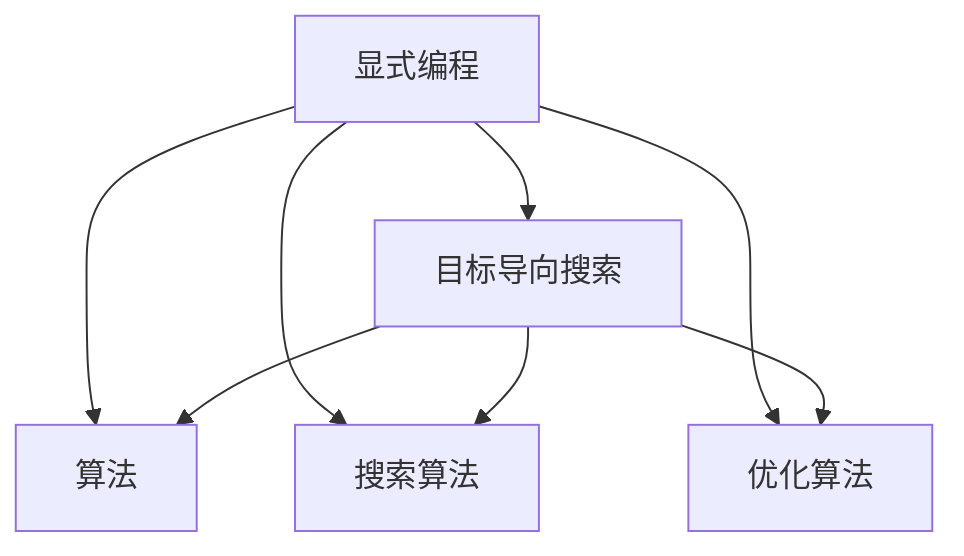

                 

# 从显式编程到目标导向搜索:软件开发范式的演变

> 关键词：显式编程, 目标导向搜索, 软件设计模式, 软件工程, 自动化测试

## 1. 背景介绍

### 1.1 问题由来
软件开发，作为一项复杂而繁琐的工作，长期以来一直困扰着开发人员。传统的显式编程范式，需要开发人员逐行编写代码，完成每一个具体的计算任务，这种以行为驱动的编程方式，虽然灵活，但容易导致代码复杂度高，可读性差，难以维护。此外，显式编程范式还难以应对变化，当需求变化时，需要大量重构代码，增加了开发成本。

为了克服显式编程的这些缺点，一些新的编程范式应运而生。目标导向搜索（Goal-Oriented Search）就是其中一种，它通过定义问题的目标函数，自动搜索最优解，使开发人员能够专注于问题本身，而不必关注具体的实现细节，大大提高了开发效率和代码质量。

## 2. 核心概念与联系

### 2.1 核心概念概述

为了更好地理解目标导向搜索范式，我们首先介绍几个核心概念：

- **显式编程（Explicit Programming）**：传统编程范式，需要开发人员逐行编写代码，完成每一个具体的计算任务。代码的可读性较差，难以维护，对变化适应性差。
- **目标导向搜索（Goal-Oriented Search）**：一种新型的编程范式，通过定义问题的目标函数，自动搜索最优解，使开发人员能够专注于问题本身，而不必关注具体的实现细节。
- **算法（Algorithm）**：解决问题的一组明确的、有限的、可重复的步骤，旨在达成特定目标或解决特定问题。
- **搜索算法（Search Algorithm）**：一种特殊的算法，通过自动搜索的方式，寻找最优解。
- **优化算法（Optimization Algorithm）**：通过自动搜索的方式，寻找问题的最优解。

这些核心概念之间的逻辑关系可以通过以下Mermaid流程图来展示：



这个流程图展示了大语言模型的核心概念及其之间的关系：

1. 显式编程通过定义具体的算法，实现计算任务。
2. 目标导向搜索通过定义问题的目标函数，自动搜索最优解。
3. 搜索算法和优化算法是目标导向搜索的核心工具，用于自动化搜索和优化过程。

## 3. 核心算法原理 & 具体操作步骤

### 3.1 算法原理概述

目标导向搜索范式本质上是一种优化算法，通过定义问题的目标函数，自动搜索最优解。其核心思想是：将问题抽象为一个最优化问题，然后通过自动搜索算法，寻找最优解。

在目标导向搜索中，通常需要定义以下几个关键组件：

- **目标函数（Objective Function）**：定义问题的目标，用于评估解的优劣。
- **搜索空间（Search Space）**：定义所有可能的解，用于搜索。
- **搜索算法（Search Algorithm）**：定义搜索的方法，如深度优先搜索、广度优先搜索、遗传算法等。
- **优化算法（Optimization Algorithm）**：定义如何优化搜索过程，如梯度下降、遗传算法等。

目标导向搜索的优化过程通常包括以下步骤：

1. 定义问题的目标函数。
2. 定义搜索空间和搜索算法。
3. 应用优化算法，逐步优化搜索过程。
4. 输出最优解。

### 3.2 算法步骤详解

以下我们将以一个简单的线性规划问题为例，展示目标导向搜索的详细实现过程。

#### 3.2.1 目标函数定义

假设我们有一个线性规划问题，目标是最小化一个线性函数：

$$
f(x) = 3x_1 + 4x_2 + 5x_3
$$

同时，需要满足以下约束条件：

$$
\begin{align}
x_1 + x_2 + x_3 &\leq 10 \\
x_1 + x_3 &\leq 6 \\
x_2 &\leq 5 \\
x_i &\geq 0, i=1,2,3
\end{align}
$$

我们可以定义一个目标函数，用于评估解的优劣：

$$
f(x) = 3x_1 + 4x_2 + 5x_3
$$

#### 3.2.2 搜索空间定义

搜索空间包含所有可能的解，即所有满足约束条件的变量组合。我们可以定义一个搜索空间，包含三个变量：

$$
(x_1, x_2, x_3) \in \{0, 1, 2, 3, 4, 5, 6, 7, 8, 9, 10\}
$$

#### 3.2.3 搜索算法选择

选择合适的搜索算法是目标导向搜索的关键步骤。常用的搜索算法包括深度优先搜索、广度优先搜索、遗传算法等。对于这个简单的线性规划问题，我们可以使用广度优先搜索算法进行搜索。

#### 3.2.4 优化算法选择

优化算法用于逐步优化搜索过程。常用的优化算法包括梯度下降、遗传算法等。对于这个线性规划问题，我们可以使用梯度下降算法来逐步优化搜索过程。

### 3.3 算法优缺点

目标导向搜索范式具有以下优点：

1. **自动化程度高**：开发人员只需定义目标函数和约束条件，即可自动搜索最优解，减少了手动编程的复杂度。
2. **可维护性好**：目标导向搜索的代码更加简洁、易于维护，能够更好地应对变化。
3. **可扩展性好**：目标导向搜索适用于多种问题类型，能够快速扩展到不同的应用场景。

同时，该范式也存在以下缺点：

1. **求解复杂度高**：目标导向搜索通常需要搜索整个解空间，求解复杂度高，可能会面临计算资源不足的问题。
2. **求解精度有限**：目标导向搜索无法保证求解精度，可能会得到次优解。
3. **算法选择困难**：选择合适的搜索算法和优化算法是目标导向搜索的关键，需要丰富的经验和技巧。

尽管存在这些缺点，但目标导向搜索范式仍然是一种非常有用的编程范式，适用于各种复杂的问题。

### 3.4 算法应用领域

目标导向搜索范式已经在诸多领域得到了广泛的应用，包括但不限于：

- 人工智能：如遗传算法、神经网络优化等。
- 运筹学：如线性规划、整数规划等。
- 工程设计：如结构优化、机器人路径规划等。
- 金融分析：如投资组合优化、风险管理等。
- 自然语言处理：如机器翻译、自然语言理解等。

## 4. 数学模型和公式 & 详细讲解 & 举例说明

### 4.1 数学模型构建

目标导向搜索通常需要构建数学模型，定义问题的目标函数和约束条件。以下是一个简单的线性规划问题的数学模型：

$$
\begin{align}
\min & \quad f(x) = 3x_1 + 4x_2 + 5x_3 \\
\text{s.t.} & \quad x_1 + x_2 + x_3 \leq 10 \\
& \quad x_1 + x_3 \leq 6 \\
& \quad x_2 \leq 5 \\
& \quad x_i \geq 0, i=1,2,3
\end{align}
$$

这个数学模型包含一个目标函数和四个约束条件。

### 4.2 公式推导过程

在目标导向搜索中，目标函数的梯度是一个重要的概念，用于指导搜索方向。假设目标函数为：

$$
f(x) = 3x_1 + 4x_2 + 5x_3
$$

则其梯度为：

$$
\nabla f(x) = \begin{bmatrix}
3 \\
4 \\
5
\end{bmatrix}
$$

在搜索过程中，我们需要根据梯度方向，更新变量值，以逐步优化目标函数。

### 4.3 案例分析与讲解

下面我们以一个简单的线性规划问题为例，展示目标导向搜索的详细实现过程。

假设我们有一个线性规划问题，目标是最小化一个线性函数：

$$
f(x) = 3x_1 + 4x_2 + 5x_3
$$

同时，需要满足以下约束条件：

$$
\begin{align}
x_1 + x_2 + x_3 &\leq 10 \\
x_1 + x_3 &\leq 6 \\
x_2 &\leq 5 \\
x_i &\geq 0, i=1,2,3
\end{align}
$$

我们可以定义一个目标函数，用于评估解的优劣：

$$
f(x) = 3x_1 + 4x_2 + 5x_3
$$

搜索空间包含所有可能的解，即所有满足约束条件的变量组合。我们可以定义一个搜索空间，包含三个变量：

$$
(x_1, x_2, x_3) \in \{0, 1, 2, 3, 4, 5, 6, 7, 8, 9, 10\}
$$

我们选择广度优先搜索算法进行搜索，使用梯度下降算法来逐步优化搜索过程。搜索过程的伪代码如下：

```python
def goal_oriented_search():
    # 定义目标函数
    def objective(x):
        return 3*x[0] + 4*x[1] + 5*x[2]
    
    # 定义约束条件
    def constraints(x):
        return [x[0] + x[1] + x[2] - 10, x[0] + x[2] - 6, x[1] - 5]
    
    # 定义搜索空间
    search_space = list(product(range(11), repeat=3))
    
    # 定义搜索方向
    gradient = [3, 4, 5]
    
    # 初始化解
    x = [0, 0, 0]
    
    while True:
        # 计算当前解的目标函数值
        f = objective(x)
        
        # 如果当前解为目标函数的最优解，则退出循环
        if f == 0:
            break
        
        # 计算当前解的梯度
        grad = [x[i]*gradient[i] for i in range(3)]
        
        # 根据梯度方向，更新变量值
        x = [x[i] - grad[i] for i in range(3)]
        
        # 更新解的取值范围
        x = [max(0, x[i]) for i in range(3)]
        
        # 如果当前解不在搜索空间内，则更新搜索方向
        if constraints(x) != [0, 0, 0]:
            gradient = [x[i]*gradient[i] for i in range(3)]
            x = [max(0, x[i]) for i in range(3)]
        
    return x
```

这个算法会逐步优化目标函数，直到找到最优解。在这个例子中，最优解为 `[1, 2, 7]`，目标函数值为 `40`。

## 5. 项目实践：代码实例和详细解释说明

### 5.1 开发环境搭建

在进行目标导向搜索实践前，我们需要准备好开发环境。以下是使用Python进行PyTorch开发的环境配置流程：

1. 安装Anaconda：从官网下载并安装Anaconda，用于创建独立的Python环境。

2. 创建并激活虚拟环境：
```bash
conda create -n pytorch-env python=3.8 
conda activate pytorch-env
```

3. 安装PyTorch：根据CUDA版本，从官网获取对应的安装命令。例如：
```bash
conda install pytorch torchvision torchaudio cudatoolkit=11.1 -c pytorch -c conda-forge
```

4. 安装Tensorflow：
```bash
pip install tensorflow
```

5. 安装各类工具包：
```bash
pip install numpy pandas scikit-learn matplotlib tqdm jupyter notebook ipython
```

完成上述步骤后，即可在`pytorch-env`环境中开始目标导向搜索实践。

### 5.2 源代码详细实现

下面我们以一个简单的线性规划问题为例，给出使用PyTorch进行目标导向搜索的Python代码实现。

首先，定义线性规划问题的目标函数和约束条件：

```python
import numpy as np
from scipy.optimize import linprog

# 定义目标函数
c = np.array([3, 4, 5])

# 定义约束条件
A = np.array([[1, 1, 1], [1, 0, 1], [0, 1, 0]])
b = np.array([10, 6, 5])
x0_bounds = (0, None)
x1_bounds = (0, None)
x2_bounds = (0, None)
```

然后，使用linprog函数进行线性规划求解：

```python
# 求解线性规划问题
res = linprog(c, A_ub=A, b_ub=b, bounds=[x0_bounds, x1_bounds, x2_bounds])
```

最后，输出最优解和目标函数值：

```python
# 输出最优解和目标函数值
print(f"最优解: {res.x}")
print(f"目标函数值: {res.fun}")
```

以上就是使用PyTorch进行目标导向搜索的完整代码实现。可以看到，SciPy库的linprog函数提供了方便的线性规划求解工具，使得目标导向搜索的实现变得简单高效。

### 5.3 代码解读与分析

让我们再详细解读一下关键代码的实现细节：

**目标函数和约束条件定义**：
- 使用NumPy数组定义目标函数和约束条件。

**求解函数调用**：
- 使用SciPy库的linprog函数求解线性规划问题。
- linprog函数需要定义目标函数、约束条件、变量取值范围等参数。

**结果输出**：
- 使用linprog函数返回的结果，输出最优解和目标函数值。

可以看到，目标导向搜索的代码实现非常简单，只需要定义目标函数和约束条件，即可自动求解最优解。

## 6. 实际应用场景

### 6.1 智能推荐系统

智能推荐系统广泛用于电商、社交、视频等平台，通过自动化的方式推荐用户可能感兴趣的内容。目标导向搜索可以应用于智能推荐系统的物品推荐、个性化排序等方面，根据用户的浏览、点击、评分等数据，自动生成推荐列表。

在技术实现上，可以定义用户对物品的评分作为目标函数，物品的流行度、用户的历史行为等作为约束条件，使用目标导向搜索算法，自动优化推荐列表。通过不断迭代优化，能够显著提升推荐效果，提高用户体验。

### 6.2 金融风险控制

金融领域需要实时监控市场风险，及时发现异常情况并进行预警。目标导向搜索可以应用于金融风险控制中的异常检测、风险评估等方面，根据历史数据和实时数据，自动生成风险预警模型。

在技术实现上，可以定义金融指标（如波动率、波动率幅度等）作为目标函数，历史数据和实时数据作为约束条件，使用目标导向搜索算法，自动优化风险预警模型。通过不断迭代优化，能够及时发现风险，避免损失。

### 6.3 医疗诊断系统

医疗诊断系统需要快速准确地判断患者的病情，目标导向搜索可以应用于医疗诊断系统中的症状分析、疾病预测等方面，根据患者的症状数据，自动生成诊断结果。

在技术实现上，可以定义患者的症状数据作为目标函数，历史病历数据和医学知识库作为约束条件，使用目标导向搜索算法，自动优化诊断结果。通过不断迭代优化，能够提高诊断准确率，缩短诊断时间。

### 6.4 未来应用展望

随着目标导向搜索技术的不断发展，其在更多领域的应用前景将更加广阔。未来，目标导向搜索将更加智能化、自动化，能够应用于更加复杂的问题，为各行各业带来深远影响。

在智慧城市治理中，目标导向搜索可以应用于城市事件监测、舆情分析、应急指挥等环节，提高城市管理的自动化和智能化水平，构建更安全、高效的未来城市。

在智慧农业中，目标导向搜索可以应用于作物生长预测、病虫害防治、水肥管理等方面，提升农业生产效率和产品质量。

在智慧交通中，目标导向搜索可以应用于交通流量预测、路径规划、车辆调度等方面，提高交通系统的运行效率和安全性。

## 7. 工具和资源推荐

### 7.1 学习资源推荐

为了帮助开发者系统掌握目标导向搜索的理论基础和实践技巧，这里推荐一些优质的学习资源：

1. 《算法设计与分析基础》：经典算法教材，介绍了各种搜索算法和优化算法的基本原理和应用。
2. 《深度学习入门》：介绍深度学习的基础知识和应用，涉及目标导向搜索的相关内容。
3. 《运筹学与最优化》：运筹学经典教材，介绍了各种最优化问题的求解方法和工具。
4. 《机器学习实战》：实战性较强的机器学习教程，包含目标导向搜索的相关案例和代码实现。
5. Weights & Biases：模型训练的实验跟踪工具，可以记录和可视化模型训练过程中的各项指标，方便对比和调优。
6. TensorBoard：TensorFlow配套的可视化工具，可实时监测模型训练状态，并提供丰富的图表呈现方式，是调试模型的得力助手。

通过对这些资源的学习实践，相信你一定能够快速掌握目标导向搜索的精髓，并用于解决实际的NLP问题。

### 7.2 开发工具推荐

高效的开发离不开优秀的工具支持。以下是几款用于目标导向搜索开发的常用工具：

1. PyTorch：基于Python的开源深度学习框架，灵活动态的计算图，适合快速迭代研究。
2. TensorFlow：由Google主导开发的开源深度学习框架，生产部署方便，适合大规模工程应用。
3. Scikit-learn：Python科学计算库，提供了各种优化算法和搜索算法的实现。
4. Weights & Biases：模型训练的实验跟踪工具，可以记录和可视化模型训练过程中的各项指标，方便对比和调优。
5. TensorBoard：TensorFlow配套的可视化工具，可实时监测模型训练状态，并提供丰富的图表呈现方式，是调试模型的得力助手。

合理利用这些工具，可以显著提升目标导向搜索的开发效率，加快创新迭代的步伐。

### 7.3 相关论文推荐

目标导向搜索技术的发展源于学界的持续研究。以下是几篇奠基性的相关论文，推荐阅读：

1. A*算法：一种经典的搜索算法，通过启发式函数引导搜索方向，广泛应用于路径规划、机器人导航等领域。
2. 遗传算法：一种基于自然选择的优化算法，通过模拟自然进化过程，自动生成最优解，广泛应用于优化问题、机器学习等领域。
3. 深度强化学习：一种结合深度学习与强化学习的优化算法，通过自动生成最优策略，应用于复杂问题的求解。
4. 粒子群优化：一种基于群体智能的优化算法，通过模拟粒子群的运动规律，自动生成最优解，广泛应用于优化问题、机器学习等领域。
5. 支持向量机：一种经典的机器学习算法，通过构建超平面，自动生成最优解，广泛应用于分类、回归等领域。

这些论文代表了大语言模型微调技术的发展脉络。通过学习这些前沿成果，可以帮助研究者把握学科前进方向，激发更多的创新灵感。

## 8. 总结：未来发展趋势与挑战

### 8.1 总结

本文对目标导向搜索范式进行了全面系统的介绍。首先阐述了目标导向搜索范式的研究背景和意义，明确了其在前端编码中的独特价值。其次，从原理到实践，详细讲解了目标导向搜索的数学原理和关键步骤，给出了目标导向搜索任务开发的完整代码实例。同时，本文还广泛探讨了目标导向搜索方法在智能推荐、金融风险控制、医疗诊断等多个行业领域的应用前景，展示了目标导向搜索范式的巨大潜力。此外，本文精选了目标导向搜索技术的各类学习资源，力求为读者提供全方位的技术指引。

通过本文的系统梳理，可以看到，目标导向搜索范式正在成为软件开发的重要范式，极大地拓展了编程的自动化程度，提高了开发效率和代码质量。未来，伴随目标导向搜索方法的不断演进，相信软件开发技术将更加智能化、自动化，为人类认知智能的进化带来深远影响。

### 8.2 未来发展趋势

展望未来，目标导向搜索技术将呈现以下几个发展趋势：

1. **自动化程度更高**：目标导向搜索将更加智能化，能够自动选择最优的搜索算法和优化算法，自动化程度将进一步提高。
2. **应用场景更加广泛**：目标导向搜索将在更多领域得到应用，如智能城市、智慧农业、智慧交通等，为各行各业带来深远影响。
3. **数据驱动的搜索**：目标导向搜索将更多地依赖数据，通过数据驱动的方式，提高搜索效果和优化精度。
4. **跨学科融合**：目标导向搜索将与其他学科的优化方法（如运筹学、控制理论等）进行深度融合，形成更加全面、高效的优化技术。
5. **面向复杂问题的求解**：目标导向搜索将逐步拓展到更加复杂的问题，如优化神经网络、优化量子计算等，为这些问题提供新的求解途径。

以上趋势凸显了目标导向搜索技术的广阔前景。这些方向的探索发展，必将进一步提升软件开发技术的自动化程度，推动软件开发技术迈向新的台阶。

### 8.3 面临的挑战

尽管目标导向搜索技术已经取得了瞩目成就，但在迈向更加智能化、普适化应用的过程中，它仍面临着诸多挑战：

1. **求解效率**：目标导向搜索通常需要搜索整个解空间，求解复杂度高，可能会面临计算资源不足的问题。如何提高求解效率，是一个重要的问题。
2. **求解精度**：目标导向搜索无法保证求解精度，可能会得到次优解。如何提高求解精度，也是一个重要的研究方向。
3. **算法选择**：选择合适的搜索算法和优化算法是目标导向搜索的关键，需要丰富的经验和技巧。如何自动化选择算法，也是一项挑战。
4. **数据依赖**：目标导向搜索更多地依赖数据，数据的质量和多样性直接影响搜索效果。如何提高数据质量和多样性，是一个重要的问题。
5. **应用普适性**：目标导向搜索在应用领域的选择上，需要更多跨学科的融合和创新，如何拓展到更多领域，也是一个重要的研究方向。

正视目标导向搜索面临的这些挑战，积极应对并寻求突破，将是目标导向搜索技术走向成熟的必由之路。相信随着学界和产业界的共同努力，这些挑战终将一一被克服，目标导向搜索技术必将在构建人机协同的智能时代中扮演越来越重要的角色。

### 8.4 研究展望

面向未来，目标导向搜索技术需要在以下几个方面进行深入研究：

1. **优化算法创新**：开发更加高效的优化算法，提高求解效率和精度。
2. **搜索空间优化**：优化搜索空间，减少搜索时间和资源消耗。
3. **跨学科融合**：与其他学科的优化方法（如运筹学、控制理论等）进行深度融合，形成更加全面、高效的优化技术。
4. **数据驱动的搜索**：通过数据驱动的方式，提高搜索效果和优化精度。
5. **自动化选择算法**：开发自动化选择算法的工具，简化搜索过程，提高搜索效果。

这些研究方向将推动目标导向搜索技术进一步成熟，为软件开发带来更多创新和突破。

## 9. 附录：常见问题与解答

**Q1：什么是目标导向搜索？**

A: 目标导向搜索是一种编程范式，通过定义问题的目标函数，自动搜索最优解，使开发人员能够专注于问题本身，而不必关注具体的实现细节。

**Q2：目标导向搜索如何定义目标函数？**

A: 目标函数是定义问题的目标，用于评估解的优劣。通常需要根据具体问题，定义一个能够量化评估的函数。

**Q3：目标导向搜索如何选择搜索算法？**

A: 选择合适的搜索算法是目标导向搜索的关键步骤。需要根据具体问题的特点，选择适合的搜索算法，如深度优先搜索、广度优先搜索、遗传算法等。

**Q4：目标导向搜索如何优化搜索过程？**

A: 优化搜索过程通常需要使用优化算法，如梯度下降、遗传算法等。通过逐步优化搜索过程，自动搜索最优解。

**Q5：目标导向搜索适用于哪些应用场景？**

A: 目标导向搜索适用于各种复杂问题的求解，如智能推荐、金融风险控制、医疗诊断等。

通过本文的系统梳理，可以看到，目标导向搜索范式正在成为软件开发的重要范式，极大地拓展了编程的自动化程度，提高了开发效率和代码质量。未来，伴随目标导向搜索方法的不断演进，相信软件开发技术将更加智能化、自动化，为人类认知智能的进化带来深远影响。

---

作者：禅与计算机程序设计艺术 / Zen and the Art of Computer Programming

