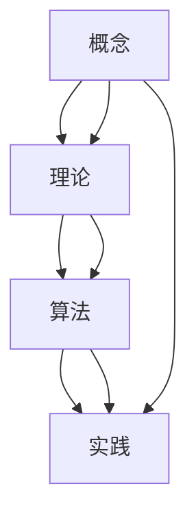

                 

# 从概念到实践：思想的转化

## 1. 背景介绍

### 1.1 问题由来

在信息爆炸的时代，知识的更新迭代变得前所未有的快速。面对庞杂的信息流，如何从中找到有价值的内容，并将这些信息转化为实际行动，成为了各个领域从业者面临的重要问题。这不仅要求从业者具备强大的信息获取和处理能力，还需要具备良好的思考和决策能力。

### 1.2 问题核心关键点

在信息技术领域，从概念到实践的转化，具体表现为将抽象的理论知识应用到具体的技术实现中。这一过程不仅涉及到技术原理的掌握，还涉及到对应用场景的理解和优化。只有真正理解和掌握了这一转化过程，才能在实际工作中得心应手，推动技术创新和应用进步。

### 1.3 问题研究意义

实现从概念到实践的转化，是推动技术进步和应用创新的关键。这不仅能提升工作效率，还能带来新的技术和产品。具体来说，从概念到实践的转化对技术发展具有以下几个方面的意义：

1. **提升技术实用性**：将理论知识转化为实际应用，能够帮助解决实际问题，提升技术实用性。
2. **加速技术迭代**：通过不断实践和优化，技术能够快速迭代和进步，适应新的需求和挑战。
3. **促进知识传播**：将复杂的技术原理转化为易于理解的应用案例，有助于知识的传播和普及。
4. **推动创新发展**：从概念到实践的转化过程中，不断探索新的思路和方法，能够推动技术创新和应用创新。

## 2. 核心概念与联系

### 2.1 核心概念概述

为更好地理解从概念到实践的转化过程，本节将介绍几个关键概念及其相互联系：

- **概念**：指对事物本质的抽象描述，通常需要通过语言、符号等载体进行表达。
- **理论**：基于对事物规律的总结，形成抽象的、系统化的知识体系。
- **算法**：解决特定问题的一系列步骤和方法，是理论转化为具体实践的桥梁。
- **实践**：将理论、算法应用到具体问题中的过程，是概念到实践转化的最终体现。

### 2.2 核心概念原理和架构的 Mermaid 流程图



### 2.3 核心概念之间的关系

从概念到实践的转化过程中，各概念之间存在紧密联系。具体来说：

- **概念**是起点，它为**理论**提供了基础和依据。
- **理论**是对**概念**的深入分析和总结，形成系统化的知识体系。
- **算法**是将**理论**应用到具体问题中的工具，是连接理论和实践的桥梁。
- **实践**是**理论**和**算法**的最终应用，是概念到实践转化的目标。

## 3. 核心算法原理 & 具体操作步骤

### 3.1 算法原理概述

从概念到实践的转化，涉及将理论知识转化为具体算法的步骤。这一过程需要遵循一定的原则和步骤，以确保转化过程的科学性和有效性。

### 3.2 算法步骤详解

从概念到实践的转化主要包括以下几个关键步骤：

1. **需求分析**：明确问题的具体需求，理解问题的本质和目标。
2. **算法设计**：基于需求分析，选择合适的算法框架和方法，设计具体的算法步骤。
3. **算法实现**：使用编程语言和工具，实现具体的算法步骤。
4. **测试验证**：对实现结果进行测试和验证，确保算法正确性和有效性。
5. **优化迭代**：根据测试结果，对算法进行优化和迭代，提高算法的性能和鲁棒性。

### 3.3 算法优缺点

从概念到实践的转化算法具有以下优点：

- **可操作性强**：通过具体的算法步骤，将抽象的概念转化为可执行的操作，便于理解和实现。
- **可扩展性强**：算法设计具有灵活性，可以根据不同的应用场景进行优化和扩展。
- **适用范围广**：算法设计适用于多种不同类型的问题和场景，具有广泛的应用前景。

同时，这一算法也存在以下缺点：

- **复杂度高**：算法设计需要考虑多个因素，有时可能过于复杂，难以理解和实现。
- **性能要求高**：算法的实现需要满足一定的性能要求，有时可能需要较高的计算资源。
- **易过拟合**：算法设计有时可能过于针对特定场景，无法泛化到其他场景。

### 3.4 算法应用领域

从概念到实践的转化算法在多个领域都有广泛应用，包括但不限于：

- **自然语言处理**：如文本分类、机器翻译、情感分析等任务，需要通过算法将语言模型转化为具体的实现步骤。
- **计算机视觉**：如图像识别、目标检测、图像分割等任务，需要通过算法将视觉模型转化为具体的实现步骤。
- **数据挖掘**：如数据清洗、特征提取、模型训练等任务，需要通过算法将数据处理流程转化为具体的实现步骤。
- **智能推荐系统**：如个性化推荐、广告推荐等任务，需要通过算法将推荐模型转化为具体的实现步骤。

## 4. 数学模型和公式 & 详细讲解 & 举例说明

### 4.1 数学模型构建

从概念到实践的转化过程中，数学模型是必不可少的一部分。构建数学模型需要基于问题需求，选择适当的数学表达式和符号表示。

### 4.2 公式推导过程

以一个简单的线性回归问题为例，介绍数学模型的构建和公式推导过程。

假设已知一组数据 $(x_i, y_i)$，其中 $x_i$ 为自变量，$y_i$ 为因变量，目标是通过数学模型预测新的 $y$ 值。根据线性回归的基本假设，可以构建如下数学模型：

$$ y = \theta_0 + \theta_1 x $$

其中 $\theta_0$ 和 $\theta_1$ 为待估参数，可以使用最小二乘法进行求解：

$$ \hat{\theta} = (X^TX)^{-1}X^Ty $$

其中 $X = [1, x_1, x_2, ..., x_n]$，$y = [y_1, y_2, ..., y_n]$，$\hat{\theta}$ 为模型参数的估计值。

### 4.3 案例分析与讲解

以图像识别任务为例，介绍从概念到实践的转化过程。

图像识别任务的目标是将输入图像转化为对应的类别标签。其基本思路为：

1. **概念理解**：理解图像识别任务的概念和目标，明确需要解决的问题。
2. **理论总结**：总结图像识别的理论基础，如卷积神经网络（CNN）的原理和应用。
3. **算法设计**：设计具体的图像识别算法，如使用预训练的ResNet模型进行迁移学习。
4. **算法实现**：使用编程语言（如Python）和框架（如TensorFlow）实现具体的图像识别算法。
5. **测试验证**：对实现结果进行测试和验证，确保算法的正确性和有效性。
6. **优化迭代**：根据测试结果，对算法进行优化和迭代，提高算法的性能和鲁棒性。

## 5. 项目实践：代码实例和详细解释说明

### 5.1 开发环境搭建

在进行从概念到实践的转化实践前，我们需要准备好开发环境。以下是使用Python进行TensorFlow开发的环境配置流程：

1. 安装Anaconda：从官网下载并安装Anaconda，用于创建独立的Python环境。

2. 创建并激活虚拟环境：
```bash
conda create -n tf-env python=3.8 
conda activate tf-env
```

3. 安装TensorFlow：根据CUDA版本，从官网获取对应的安装命令。例如：
```bash
conda install tensorflow=2.7 -c conda-forge -c pytorch -c nvidia
```

4. 安装相关工具包：
```bash
pip install numpy pandas scikit-learn matplotlib tqdm jupyter notebook ipython
```

完成上述步骤后，即可在`tf-env`环境中开始实践。

### 5.2 源代码详细实现

这里我们以图像识别任务为例，给出使用TensorFlow进行迁移学习的PyTorch代码实现。

首先，定义数据处理函数：

```python
import numpy as np
import tensorflow as tf
from tensorflow.keras.preprocessing.image import ImageDataGenerator

def preprocess_data(data_dir, batch_size, img_height, img_width):
    datagen = ImageDataGenerator(rescale=1./255, shear_range=0.2, zoom_range=0.2, horizontal_flip=True)
    train_generator = datagen.flow_from_directory(
        data_dir,
        target_size=(img_height, img_width),
        batch_size=batch_size,
        class_mode='categorical',
        shuffle=True)
    return train_generator
```

然后，定义模型和优化器：

```python
from tensorflow.keras.applications.resnet50 import ResNet50, preprocess_input, decode_predictions
from tensorflow.keras.optimizers import Adam

model = ResNet50(include_top=False, weights='imagenet', input_shape=(img_height, img_width, 3))
for layer in model.layers:
    layer.trainable = False

optimizer = Adam(learning_rate=0.001)
```

接着，定义训练和评估函数：

```python
def train_epoch(model, train_generator, epochs, batch_size, optimizer):
    train_generator = train_generator.flow(train_images, train_labels, batch_size=batch_size)
    for epoch in range(epochs):
        for i, (images, labels) in enumerate(train_generator):
            images = images / 255.0
            with tf.GradientTape() as tape:
                predictions = model(images)
                loss = tf.keras.losses.categorical_crossentropy(labels, predictions)
            gradients = tape.gradient(loss, model.trainable_variables)
            optimizer.apply_gradients(zip(gradients, model.trainable_variables))
            if i % 100 == 0:
                print(f'Epoch {epoch+1}, Step {i}, Loss: {loss.numpy():.4f}')

def evaluate(model, test_generator, batch_size):
    test_generator = test_generator.flow(test_images, test_labels, batch_size=batch_size)
    correct_predictions = 0
    total_predictions = 0
    for images, labels in test_generator:
        images = images / 255.0
        predictions = model(images)
        predicted_labels = np.argmax(predictions, axis=1)
        correct_predictions += np.sum(predicted_labels == labels)
        total_predictions += len(labels)
    accuracy = correct_predictions / total_predictions
    print(f'Accuracy: {accuracy:.4f}')
```

最后，启动训练流程并在测试集上评估：

```python
train_images, train_labels = preprocess_data(train_data_dir, batch_size, img_height, img_width)
test_images, test_labels = preprocess_data(test_data_dir, batch_size, img_height, img_width)

train_epoch(model, train_generator, epochs, batch_size, optimizer)
evaluate(model, test_generator, batch_size)
```

以上就是使用TensorFlow对ResNet模型进行图像识别任务迁移学习的完整代码实现。可以看到，得益于TensorFlow的强大封装，我们可以用相对简洁的代码完成迁移学习的实践。

### 5.3 代码解读与分析

让我们再详细解读一下关键代码的实现细节：

**preprocess_data函数**：
- `ImageDataGenerator`类：用于数据增强和预处理，提升模型泛化能力。
- `flow_from_directory`方法：从目录中自动加载数据，并进行处理，生成批次数据流。

**train_epoch函数**：
- 在每个epoch内，对训练集数据进行批次化处理，前向传播计算损失函数，反向传播更新模型参数。

**evaluate函数**：
- 对测试集数据进行批次化处理，前向传播计算预测结果，并与真实标签进行比较，统计准确率。

**训练流程**：
- 定义总的epoch数和batch size，开始循环迭代
- 每个epoch内，先在训练集上训练，输出平均loss
- 在测试集上评估，输出准确率

可以看到，TensorFlow配合Keras框架使得迁移学习的代码实现变得简洁高效。开发者可以将更多精力放在数据处理、模型改进等高层逻辑上，而不必过多关注底层的实现细节。

当然，工业级的系统实现还需考虑更多因素，如模型的保存和部署、超参数的自动搜索、更灵活的任务适配层等。但核心的转化过程基本与此类似。

## 6. 实际应用场景

### 6.1 智能客服系统

从概念到实践的转化，在智能客服系统的构建中有着广泛应用。传统的客服系统往往依赖于规则和人工干预，效率低下，响应速度慢。而通过从概念到实践的转化，可以构建基于深度学习模型的智能客服系统，提升客户服务体验。

在技术实现上，可以收集企业的客服历史数据，提取问答对作为监督数据，训练深度学习模型。通过从概念到实践的转化，可以将客服问答问题转化为具体的算法步骤，实现自动化的客户服务。当客户提出问题时，系统可以自动进行理解和回答，从而大大提升客服系统的效率和响应速度。

### 6.2 金融舆情监测

金融市场的动态变化对金融机构来说至关重要。传统的舆情监测方法依赖于人工分析，费时费力，难以应对海量数据。通过从概念到实践的转化，可以构建基于深度学习模型的舆情监测系统，实时监测市场舆论动向，规避金融风险。

在技术实现上，可以收集金融领域的新闻、报道、评论等文本数据，训练深度学习模型进行文本分类和情感分析。通过从概念到实践的转化，可以将金融舆情监测转化为具体的算法步骤，实现自动化的舆情分析。当系统检测到舆情波动时，可以及时发出预警，帮助金融机构及时应对潜在风险。

### 6.3 个性化推荐系统

在电商和内容平台中，推荐系统是提升用户体验的关键。传统的推荐系统依赖于用户的历史行为数据，无法深入理解用户的真实兴趣偏好。通过从概念到实践的转化，可以构建基于深度学习模型的个性化推荐系统，提升推荐系统的精准度和个性化程度。

在技术实现上，可以收集用户浏览、点击、评论、分享等行为数据，提取和用户交互的物品标题、描述、标签等文本内容。通过从概念到实践的转化，可以将推荐系统转化为具体的算法步骤，实现自动化的推荐。在推荐过程中，可以结合用户的文本数据和行为数据，生成个性化的推荐结果，提升用户满意度。

### 6.4 未来应用展望

随着深度学习技术的不断进步，从概念到实践的转化将带来更广泛的应用前景。未来，这一转化过程将在更多的领域得到应用，为各行各业带来变革性影响。

在智慧医疗领域，通过从概念到实践的转化，可以构建基于深度学习模型的医疗诊断和推荐系统，提升医疗服务的智能化水平，辅助医生诊疗，加速新药开发进程。

在智能教育领域，通过从概念到实践的转化，可以构建基于深度学习模型的智能教育系统，因材施教，促进教育公平，提高教学质量。

在智慧城市治理中，通过从概念到实践的转化，可以构建基于深度学习模型的城市事件监测、舆情分析、应急指挥等系统，提高城市管理的自动化和智能化水平，构建更安全、高效的未来城市。

此外，在企业生产、社会治理、文娱传媒等众多领域，从概念到实践的转化技术也将不断涌现，为经济社会发展注入新的动力。相信随着技术的日益成熟，这一转化过程将成为人工智能落地应用的重要范式，推动人工智能技术向更广阔的领域加速渗透。

## 7. 工具和资源推荐

### 7.1 学习资源推荐

为了帮助开发者系统掌握从概念到实践的转化技术，这里推荐一些优质的学习资源：

1. **深度学习理论与实践**：这是一门由斯坦福大学开设的深度学习课程，系统介绍了深度学习的基本原理和实践方法。课程包括Lecture视频和配套作业，适合初学者入门。

2. **TensorFlow官方文档**：TensorFlow官方文档提供了丰富的教程和样例代码，帮助开发者快速上手TensorFlow开发。

3. **Keras官方文档**：Keras官方文档提供了Keras框架的使用指南和样例代码，帮助开发者快速上手深度学习模型的训练和优化。

4. **PyTorch官方文档**：PyTorch官方文档提供了详细的API文档和样例代码，帮助开发者快速上手深度学习模型的训练和优化。

5. **Coursera深度学习课程**：由斯坦福大学Andrew Ng教授开设，系统介绍了深度学习的基本原理和实践方法，包括卷积神经网络、循环神经网络等内容。

通过对这些资源的学习实践，相信你一定能够快速掌握从概念到实践的转化技术的精髓，并用于解决实际的深度学习问题。

### 7.2 开发工具推荐

高效的开发离不开优秀的工具支持。以下是几款用于深度学习开发的常用工具：

1. **Anaconda**：用于创建和管理Python虚拟环境，方便不同项目之间的隔离。

2. **TensorFlow**：由Google主导开发的深度学习框架，生产部署方便，适合大规模工程应用。

3. **Keras**：基于TensorFlow等后端的高级深度学习API，简洁易用，适合快速原型开发。

4. **PyTorch**：由Facebook主导开发的深度学习框架，灵活性高，适合研究应用。

5. **Jupyter Notebook**：用于编写和分享代码的交互式编程环境，支持代码、图表、公式等元素的混合展示。

6. **Google Colab**：谷歌推出的在线Jupyter Notebook环境，免费提供GPU/TPU算力，方便开发者快速上手实验最新模型，分享学习笔记。

合理利用这些工具，可以显著提升深度学习模型的开发效率，加快创新迭代的步伐。

### 7.3 相关论文推荐

从概念到实践的转化技术的发展源于学界的持续研究。以下是几篇奠基性的相关论文，推荐阅读：

1. **深度学习框架的发展**：介绍深度学习框架（如TensorFlow、Keras、PyTorch）的发展历程和技术特点，帮助理解深度学习开发的最佳实践。

2. **卷积神经网络的应用**：介绍卷积神经网络在计算机视觉、自然语言处理等领域的应用，帮助理解深度学习模型的设计和实现。

3. **迁移学习与预训练模型的应用**：介绍迁移学习和预训练模型在深度学习任务中的广泛应用，帮助理解从概念到实践的转化过程。

4. **深度学习算法的优化**：介绍深度学习算法的优化方法，如正则化、Dropout、Adam优化器等，帮助理解深度学习模型的训练和优化。

5. **深度学习模型的可解释性**：介绍深度学习模型的可解释性方法，如可视化、特征提取等，帮助理解深度学习模型的内部机制和决策逻辑。

这些论文代表了大规模深度学习技术的发展脉络，通过学习这些前沿成果，可以帮助研究者把握学科前进方向，激发更多的创新灵感。

## 8. 总结：未来发展趋势与挑战

### 8.1 总结

本文对从概念到实践的转化技术进行了全面系统的介绍。首先阐述了这一技术在深度学习领域的重要性和实际应用场景，明确了其将理论知识转化为具体算法的过程。其次，从原理到实践，详细讲解了从概念到实践的转化过程，给出了具体的实现方法和实例。同时，本文还广泛探讨了该技术在智能客服、金融舆情、个性化推荐等多个行业领域的应用前景，展示了其广阔的应用前景。此外，本文精选了从概念到实践的转化技术的各类学习资源，力求为读者提供全方位的技术指引。

通过本文的系统梳理，可以看到，从概念到实践的转化技术正在成为深度学习领域的重要范式，极大地拓展了深度学习模型的应用边界，催生了更多的落地场景。受益于大规模深度学习模型的预训练和微调，这一转化过程能够快速实现理论到实践的转化，推动深度学习技术的产业化进程。未来，伴随深度学习技术的发展和优化，这一转化过程必将带来更加高效、灵活、可靠的解决方案。

### 8.2 未来发展趋势

展望未来，从概念到实践的转化技术将呈现以下几个发展趋势：

1. **模型规模持续增大**：随着算力成本的下降和数据规模的扩张，深度学习模型的参数量还将持续增长。超大规模模型蕴含的丰富知识，有望支撑更加复杂多变的任务。

2. **转化方法日趋多样化**：除了传统的深度学习模型外，未来会涌现更多转化方法，如强化学习、生成对抗网络（GAN）等，在保持高效的同时也能保证转化精度。

3. **跨领域转化能力增强**：从概念到实践的转化过程将更加灵活，能够跨领域进行转化，提升模型的泛化能力和应用范围。

4. **多模态转化技术发展**：未来的转化技术将更加注重多模态数据的整合，如图像、语音、文本等不同模态数据的协同转化，提升模型的综合感知能力。

5. **自动化和智能化提升**：随着自动化学习技术的发展，从概念到实践的转化过程将更加智能化，能够自动探索最优的转化路径，提升转化效率。

6. **伦理和社会影响重视**：未来的转化技术将更加注重伦理和社会影响，确保转化过程的公平、透明和可解释，避免偏见和歧视。

以上趋势凸显了从概念到实践的转化技术的广阔前景。这些方向的探索发展，必将进一步提升深度学习系统的性能和应用范围，为各个领域带来新的技术进步和应用创新。

### 8.3 面临的挑战

尽管从概念到实践的转化技术已经取得了瞩目成就，但在迈向更加智能化、普适化应用的过程中，它仍面临着诸多挑战：

1. **数据依赖问题**：许多转化过程依赖于大规模标注数据，难以获取充足的高质量数据，成为制约转化效果的重要瓶颈。如何进一步降低对标注数据的依赖，将是一大难题。

2. **模型复杂度问题**：一些转化过程可能过于复杂，难以理解和实现，导致转化过程的可操作性不足。如何在保证转化效果的同时，降低模型复杂度，将是重要的优化方向。

3. **泛化能力问题**：许多转化过程可能在特定场景下表现良好，但在泛化到其他场景时效果不佳。如何提高转化过程的泛化能力，避免过拟合，将是重要的研究课题。

4. **安全性问题**：转化过程可能引入有害信息或偏见，导致输出结果不安全。如何在转化过程中确保模型的安全性，将是重要的研究方向。

5. **可解释性问题**：一些转化过程可能过于复杂，难以解释其内部工作机制和决策逻辑。如何提高转化过程的可解释性，将有助于其应用推广和接受度提升。

6. **资源消耗问题**：一些转化过程可能需要大量的计算资源和时间，难以在大规模数据集上高效实现。如何优化转化过程，降低资源消耗，将是重要的优化方向。

正视从概念到实践的转化技术面临的这些挑战，积极应对并寻求突破，将是从概念到实践的转化技术走向成熟的必由之路。相信随着学界和产业界的共同努力，这些挑战终将一一被克服，这一转化过程必将在构建人机协同的智能时代中扮演越来越重要的角色。

### 8.4 研究展望

面对从概念到实践的转化技术所面临的种种挑战，未来的研究需要在以下几个方面寻求新的突破：

1. **数据增强技术的发展**：探索更多数据增强方法，如数据合成、迁移学习等，减少对标注数据的依赖，提升转化过程的鲁棒性。

2. **模型优化技术的发展**：开发更加高效、简洁的转化模型，如轻量化模型、可解释模型等，提升转化过程的可操作性和可解释性。

3. **多模态转化技术的发展**：探索多模态数据的协同转化方法，如图像、语音、文本的整合，提升转化过程的综合感知能力。

4. **自动化学习技术的发展**：开发自动化的转化模型，如强化学习、自动学习等，提升转化过程的智能化和自动化水平。

5. **伦理和社会影响的研究**：注重转化过程的伦理和社会影响，确保转化过程的公平、透明和可解释，避免偏见和歧视。

6. **安全性保障的研究**：在转化过程中引入安全性保障机制，如异常检测、隐私保护等，确保转化结果的安全性和可靠性。

这些研究方向将推动从概念到实践的转化技术的不断进步，为人工智能技术的落地应用提供更加强大和可靠的技术支持。面向未来，从概念到实践的转化技术将与更多人工智能技术进行更深入的融合，共同推动人工智能技术的进步和应用创新。

## 9. 附录：常见问题与解答

**Q1: 从概念到实践的转化过程是否适用于所有深度学习任务？**

A: 从概念到实践的转化过程在深度学习领域具有广泛适用性，能够应用于几乎所有类型的深度学习任务。然而，对于某些特定领域的任务，如医疗、法律等，需要结合领域知识进行进一步优化，以提升转化效果。

**Q2: 如何选择最优的转化算法？**

A: 选择最优的转化算法需要考虑多个因素，如任务类型、数据特点、资源限制等。一般来说，可以从以下几个方面进行考虑：
1. 数据量大小：数据量较大时，可以使用传统的深度学习模型，如图像识别、文本分类等。
2. 任务复杂度：任务较为复杂时，可以使用深度神经网络模型，如图卷积网络、循环神经网络等。
3. 资源限制：资源有限时，可以使用轻量化模型，如MobileNet、EfficientNet等。

**Q3: 从概念到实践的转化过程中，如何避免模型过拟合？**

A: 避免模型过拟合是深度学习模型转化过程中的关键问题之一。以下是一些常用的方法：
1. 数据增强：通过对数据进行随机扰动、旋转、裁剪等操作，增加数据的多样性，提升模型的泛化能力。
2. 正则化：使用L2正则、Dropout等技术，减少模型的复杂度，防止过拟合。
3. 早停法：在训练过程中，监控模型在验证集上的表现，及时停止训练，避免过拟合。
4. 迁移学习：使用预训练模型进行微调，利用已有知识，提升模型性能。

**Q4: 从概念到实践的转化过程中，如何确保模型的可解释性？**

A: 确保模型的可解释性是深度学习模型转化过程中的重要问题之一。以下是一些常用的方法：
1. 可视化：使用可视化工具，如TensorBoard、Netron等，展示模型的内部结构和推理过程。
2. 特征提取：使用特征提取方法，如t-SNE、PCA等，分析模型的关键特征，提高模型的可解释性。
3. 模型简化：使用模型简化技术，如剪枝、量化等，降低模型的复杂度，提升模型的可解释性。

**Q5: 从概念到实践的转化过程中，如何提高模型的性能？**

A: 提高模型的性能是深度学习模型转化过程中的重要目标之一。以下是一些常用的方法：
1. 超参数调优：通过调整学习率、批量大小等超参数，优化模型的性能。
2. 模型融合：使用模型融合技术，如Bagging、Boosting等，提高模型的稳定性和泛化能力。
3. 迁移学习：使用预训练模型进行微调，利用已有知识，提升模型性能。

通过本文的系统梳理，可以看到，从概念到实践的转化技术正在成为深度学习领域的重要范式，极大地拓展了深度学习模型的应用边界，催生了更多的落地场景。受益于大规模深度学习模型的预训练和微调，这一转化过程能够快速实现理论到实践的转化，推动深度学习技术的产业化进程。未来，伴随深度学习技术的发展和优化，这一转化过程必将带来更加高效、灵活、可靠的解决方案。

