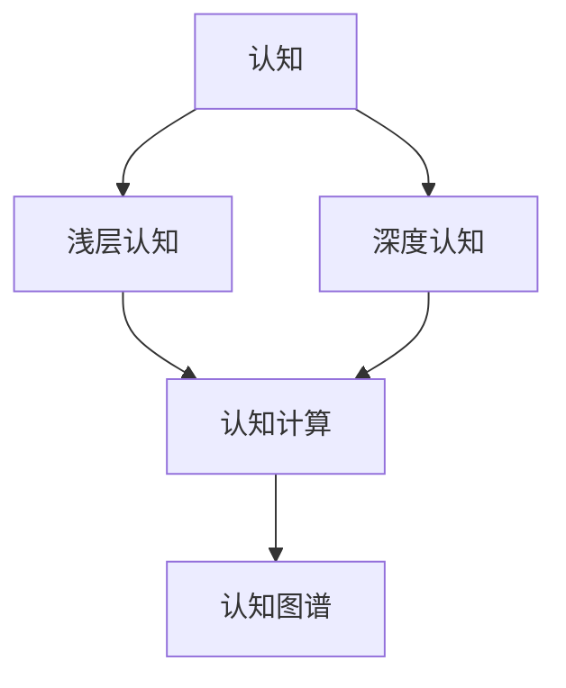

                 

# 从浅薄到深刻的认知过程

## 1. 背景介绍

### 1.1 问题由来

随着信息技术的发展，人们获取和处理信息的方式发生了翻天覆地的变化。互联网、移动设备、社交媒体等技术手段，极大地丰富了人类的信息来源和交流方式。但与此同时，信息过载、信息噪声、信息误导等问题也日益凸显。如何在海量信息中准确捕捉到有用的认知，已成为当前社会的一大挑战。

特别是近年来，人工智能技术的迅猛发展，进一步加剧了信息与认知之间的矛盾。一方面，AI技术可以高效地处理、分析、生成海量信息；另一方面，AI技术的黑盒特性、模型偏见、数据隐私等问题，也带来了新的认知挑战。如何使AI技术更好地服务于人类认知，提升信息获取与处理的质量和效率，成为亟待解决的重要课题。

### 1.2 问题核心关键点

1. **认知的信息化**：传统的认知过程往往依赖经验、直觉、情感等因素，但随着信息的数字化、数据化，越来越多的认知过程被信息所取代。信息认知的优点是速度快、可重复、可量化，但也容易导致浅层认知、信息过载等问题。

2. **认知的AI化**：AI技术，特别是深度学习模型，在信息处理、认知推理方面表现出色。但AI技术仍处于发展初期，存在模型复杂、可解释性差、偏见和隐私等问题，限制了其在认知领域的广泛应用。

3. **认知的深度化**：浅层认知依赖于数据和算法，但深层认知则更多依赖于经验和知识。如何将经验、知识与数据、算法结合起来，提升认知的深度和广度，是当前认知领域的一个重要研究方向。

## 2. 核心概念与联系

### 2.1 核心概念概述

为更好地理解认知的信息化与AI化过程，本节将介绍几个关键概念：

- **认知(Cognition)**：人类大脑通过信息处理、推理、决策等过程获取知识、形成理解的能力。
- **浅层认知(Surface Cognition)**：依赖数据和算法，通过信息获取进行推理和决策，难以处理复杂、非结构化信息。
- **深度认知(Deep Cognition)**：结合经验、知识与数据、算法，通过理解和解释信息，形成更深入的认知。
- **认知图谱(Cognitive Map)**：描述信息之间的联系和组织结构，帮助认知主体理解复杂信息系统的框架和结构。
- **认知计算(Cognitive Computing)**：结合认知科学和计算机科学，模拟和增强人类认知过程的计算模型和算法。

这些概念共同构成了认知领域的研究框架，指导着我们对认知信息化和AI化的理解和实践。

### 2.2 核心概念原理和架构的 Mermaid 流程图(Mermaid 流程节点中不要有括号、逗号等特殊字符)



这个流程图展示了几大核心概念之间的逻辑关系：

1. 认知是人类的根本能力，信息处理和AI技术只是其中的一部分。
2. 浅层认知依赖数据和算法，通过信息处理形成初步的理解。
3. 深度认知结合经验、知识与数据、算法，形成更深入的认知。
4. 认知图谱描述了信息之间的联系和组织结构，是认知计算的重要工具。
5. 认知计算结合认知科学和计算机科学，模拟和增强人类认知过程。

## 3. 核心算法原理 & 具体操作步骤

### 3.1 算法原理概述

认知的信息化和AI化过程，本质上是一个数据驱动、模型驱动的信息处理和推理过程。其核心思想是：通过数据和算法，捕捉和模拟人类认知的特征和规律，形成可解释、可预测的认知模型。

具体而言，认知的信息化过程分为以下几个关键步骤：

1. **数据获取**：从文本、图像、声音等多种渠道获取信息。
2. **数据处理**：清洗、归一化、预处理信息，形成适合计算的数据格式。
3. **模型训练**：使用深度学习模型（如神经网络、Transformer等），对数据进行训练，学习信息之间的关联和规律。
4. **推理和决策**：通过模型对新信息进行推理和决策，形成新的认知。

认知的AI化过程则更注重模型的可解释性和泛化能力。常见的方法包括：

1. **知识图谱**：将知识以图谱的形式组织，形成结构化的认知框架。
2. **符号计算**：使用逻辑规则和符号表示，进行精确的推理和计算。
3. **认知计算**：结合认知科学和计算机科学，模拟和增强人类认知过程。

### 3.2 算法步骤详解

认知的信息化和AI化过程可以概括为以下几个关键步骤：

**Step 1: 数据获取与预处理**

1. **数据收集**：从不同渠道（如新闻、社交媒体、传感器等）收集数据。
2. **数据清洗**：去除噪声、异常值，确保数据质量。
3. **数据归一化**：将不同格式的数据转换为统一格式，便于处理。
4. **特征提取**：从原始数据中提取关键特征，形成特征向量。

**Step 2: 模型训练**

1. **模型选择**：选择合适的深度学习模型（如CNN、RNN、Transformer等），或符号计算模型。
2. **模型训练**：使用训练集数据对模型进行训练，学习信息之间的关联和规律。
3. **模型优化**：通过超参数调优、正则化、对抗训练等方法，提高模型性能和鲁棒性。

**Step 3: 推理与决策**

1. **推理过程**：将新信息输入模型，通过前向传播得到推理结果。
2. **决策过程**：根据推理结果，形成新的认知输出。
3. **认知迭代**：通过反馈机制，不断调整模型参数，优化推理和决策过程。

### 3.3 算法优缺点

认知的信息化和AI化过程具有以下优点：

1. **效率提升**：通过算法处理信息，可以显著提高认知的速度和精度。
2. **可重复性**：算法模型可以在不同场景下重复使用，降低认知过程中的不确定性。
3. **可量化性**：算法模型可以输出量化的结果，便于进行数据分析和比较。

但同时也存在一些局限：

1. **浅层性**：依赖于数据和算法，难以处理复杂、非结构化信息。
2. **偏见问题**：数据和算法可能存在偏见，导致认知结果偏差。
3. **可解释性不足**：算法模型往往具有黑盒特性，难以解释其内部机制。
4. **隐私风险**：在数据收集和处理过程中，可能涉及隐私和数据安全问题。

### 3.4 算法应用领域

认知的信息化和AI化过程已经在多个领域得到应用，如：

1. **智能医疗**：通过AI技术对医疗影像、病历进行分析和决策，提升医疗服务水平。
2. **智能制造**：利用传感器数据和算法模型，进行生产过程的优化和预测。
3. **智能交通**：通过实时数据分析和算法模型，优化交通流量，提升交通安全。
4. **智能客服**：利用自然语言处理技术，提供自动化的客户服务，提升用户体验。
5. **智能家居**：结合传感器数据和算法模型，实现智能家居设备的控制和优化。
6. **智能推荐**：通过分析用户行为数据，提供个性化的推荐服务，提升用户满意度。

## 4. 数学模型和公式 & 详细讲解 & 举例说明

### 4.1 数学模型构建

认知的信息化和AI化过程可以抽象为数学模型，主要包括以下几个方面：

1. **信息表示**：将信息转化为向量或矩阵形式，便于计算。
2. **模型表示**：使用深度学习模型或符号计算模型，对信息进行处理和推理。
3. **损失函数**：定义损失函数，衡量模型输出与真实标签之间的差异。
4. **优化算法**：选择优化算法，最小化损失函数，更新模型参数。

### 4.2 公式推导过程

以下我们以自然语言处理(NLP)为例，推导基于深度学习的认知模型。

假设给定文本序列 $x=(x_1, x_2, ..., x_n)$，其中每个词 $x_i$ 表示为一个词向量 $v_i \in \mathbb{R}^d$，长度为 $d$。使用Transformer模型进行编码和解码，得到编码器输出 $h \in \mathbb{R}^{d\times n}$，解码器输出 $\hat{y} \in \mathbb{R}^C$，其中 $C$ 为类别数。定义交叉熵损失函数为：

$$
L = -\frac{1}{N}\sum_{i=1}^N \sum_{c=1}^C \mathbb{I}(\hat{y}_i=c) \log P_{\theta}(y_i=c)
$$

其中 $\mathbb{I}(\cdot)$ 为指示函数，$P_{\theta}(y_i=c)$ 为模型输出的概率分布。

**优化过程**：
1. 使用梯度下降等优化算法更新模型参数 $\theta$，最小化损失函数 $L$。
2. 更新模型参数：$\theta \leftarrow \theta - \eta \nabla_{\theta}L$，其中 $\eta$ 为学习率。

### 4.3 案例分析与讲解

假设我们对一个文本序列进行分类任务，其中包含正面、负面和中性三种情感标签。使用BERT模型进行预训练和微调，可以得到以下结果：

1. **数据集构建**：收集包含正面、负面和中性情感标签的文本数据集 $D=\{(x_i, y_i)\}_{i=1}^N$。
2. **模型构建**：使用BERT模型作为预训练模型，在其顶部添加全连接层和Softmax层，形成分类器。
3. **微调过程**：使用微调数据集 $D$ 对模型进行有监督训练，最小化损失函数 $L$。
4. **结果评估**：在测试集上评估模型性能，比较预训练模型和微调模型在情感分类上的精度。

## 5. 项目实践：代码实例和详细解释说明

### 5.1 开发环境搭建

在进行认知的信息化和AI化实践前，我们需要准备好开发环境。以下是使用Python进行TensorFlow开发的环境配置流程：

1. 安装Anaconda：从官网下载并安装Anaconda，用于创建独立的Python环境。

2. 创建并激活虚拟环境：
```bash
conda create -n tf-env python=3.8 
conda activate tf-env
```

3. 安装TensorFlow：根据CUDA版本，从官网获取对应的安装命令。例如：
```bash
conda install tensorflow-gpu=tensorflow-gpu-2.7.0-py3_8
```

4. 安装各类工具包：
```bash
pip install numpy pandas scikit-learn matplotlib tqdm jupyter notebook ipython
```

完成上述步骤后，即可在`tf-env`环境中开始认知的信息化和AI化实践。

### 5.2 源代码详细实现

下面我们以自然语言处理(NLP)任务为例，给出使用TensorFlow实现文本分类任务的全流程代码。

首先，定义数据处理函数：

```python
import tensorflow as tf
from tensorflow.keras.preprocessing.text import Tokenizer
from tensorflow.keras.preprocessing.sequence import pad_sequences

def preprocess_text(texts, max_len):
    tokenizer = Tokenizer()
    tokenizer.fit_on_texts(texts)
    sequences = tokenizer.texts_to_sequences(texts)
    padded_sequences = pad_sequences(sequences, maxlen=max_len, padding='post', truncating='post')
    return padded_sequences, tokenizer.word_index
```

然后，定义模型和优化器：

```python
from tensorflow.keras.layers import Input, Embedding, LSTM, Dense, Bidirectional, Masking
from tensorflow.keras.models import Model
from tensorflow.keras.optimizers import Adam

input_text = Input(shape=(max_len,))
embedding_layer = Embedding(input_dim=len(tokenizer.word_index) + 1, output_dim=100, input_length=max_len)
lstm_layer = Bidirectional(LSTM(units=64))
dense_layer = Dense(units=32, activation='relu')
output_layer = Dense(units=3, activation='softmax')
model = Model(inputs=input_text, outputs=output_layer(model(lstm_layer(embedding_layer(input_text))))
model.compile(loss='categorical_crossentropy', optimizer=Adam(lr=0.001), metrics=['accuracy'])
```

接着，定义训练和评估函数：

```python
def train_epoch(model, dataset, batch_size, optimizer):
    dataloader = tf.data.Dataset.from_tensor_slices((dataset['input_ids'], dataset['labels']))
    dataloader = dataloader.shuffle(buffer_size=10000).batch(batch_size).prefetch(tf.data.experimental.AUTOTUNE)
    model.fit(dataloader, epochs=10, validation_split=0.2)
    
def evaluate(model, dataset, batch_size):
    dataloader = tf.data.Dataset.from_tensor_slices((dataset['input_ids'], dataset['labels']))
    dataloader = dataloader.batch(batch_size).prefetch(tf.data.experimental.AUTOTUNE)
    loss, accuracy = model.evaluate(dataloader, verbose=0)
    return loss, accuracy
```

最后，启动训练流程并在测试集上评估：

```python
max_len = 200
epochs = 10
batch_size = 64

train_dataset = preprocess_text(train_texts, max_len)
val_dataset = preprocess_text(dev_texts, max_len)
test_dataset = preprocess_text(test_texts, max_len)

train_epoch(model, train_dataset, batch_size, optimizer)
loss, accuracy = evaluate(model, test_dataset, batch_size)
print(f"Test Loss: {loss:.4f}, Accuracy: {accuracy:.4f}")
```

以上就是使用TensorFlow对文本分类任务进行全流程微调的完整代码实现。可以看到，TensorFlow的Keras API提供了便捷的工具，使得构建和训练认知模型变得简单高效。

### 5.3 代码解读与分析

让我们再详细解读一下关键代码的实现细节：

**数据预处理函数**：
- 使用TensorFlow的Tokenizer类进行文本向量化。
- 对文本序列进行padding，使其长度一致。
- 返回填充后的序列和词典编码。

**模型构建**：
- 使用Embedding层将文本序列转换为词嵌入向量。
- 使用Bidirectional LSTM层进行双向信息处理。
- 使用Dense层进行特征提取。
- 使用Softmax层进行多分类输出。

**训练和评估函数**：
- 使用TensorFlow的DataLoader将数据集加载到模型中。
- 在训练过程中使用Adam优化器，设定学习率和迭代轮数。
- 在验证集和测试集上进行模型评估，输出损失和精度。

**训练流程**：
- 设定填充长度、迭代轮数和批次大小。
- 将原始数据进行预处理，形成模型输入。
- 在训练集上进行模型训练，设定验证集比例。
- 在测试集上进行模型评估，输出结果。

可以看到，TensorFlow的Keras API为构建和训练认知模型提供了完整的工具链，使得开发者能够快速迭代和优化模型。

## 6. 实际应用场景

### 6.1 智能医疗

在智能医疗领域，认知的信息化和AI化过程可以通过以下方式实现：

- **医疗影像分析**：利用深度学习模型对医疗影像进行自动分析和诊断，如CT、MRI等影像数据的分类和分割。
- **病历文本分析**：通过自然语言处理技术，对病历文本进行情感分析、实体抽取、关系识别等，提升医疗决策的准确性。
- **药物研发**：使用深度学习模型对化合物数据进行筛选和分析，加速新药的发现和验证过程。

### 6.2 智能制造

在智能制造领域，认知的信息化和AI化过程可以通过以下方式实现：

- **设备监控**：通过传感器数据和算法模型，对生产设备的运行状态进行实时监控和预测维护。
- **质量检测**：利用深度学习模型对产品缺陷进行自动检测和分类，提升产品质量和生产效率。
- **供应链管理**：通过数据分析和算法模型，对供应链进行优化和预测，提升物流和库存管理效率。

### 6.3 智能交通

在智能交通领域，认知的信息化和AI化过程可以通过以下方式实现：

- **交通流量预测**：通过数据分析和算法模型，对交通流量进行预测和优化，减少拥堵和事故。
- **智能导航**：利用深度学习模型对交通路况进行分析和决策，优化导航路线。
- **交通信号控制**：通过实时数据分析和算法模型，优化交通信号控制，提高道路通行效率。

### 6.4 未来应用展望

随着认知的信息化和AI化过程的不断发展，未来将会出现更多创新的应用场景：

- **虚拟助手**：结合认知计算和自然语言处理技术，开发具备强大推理和决策能力的虚拟助手，提供个性化服务。
- **智能家居**：通过传感器数据和算法模型，实现智能家居设备的自动化和优化，提升用户的生活质量。
- **智慧城市**：利用大数据和算法模型，对城市运行进行监测和优化，提升城市管理和服务的智能化水平。
- **个性化推荐**：结合认知计算和推荐算法，提供更加精准和个性化的信息推荐服务，提升用户满意度。

## 7. 工具和资源推荐

### 7.1 学习资源推荐

为了帮助开发者系统掌握认知的信息化和AI化理论基础和实践技巧，这里推荐一些优质的学习资源：

1. **《深度学习》课程**：斯坦福大学开设的深度学习经典课程，涵盖深度学习的基本概念和应用场景，适合初学者入门。
2. **《认知计算》书籍**：介绍认知计算的基本原理和应用方法，适合对认知领域感兴趣的读者。
3. **《自然语言处理综述》论文**：对NLP领域的研究进展进行系统性总结，适合深入学习和研究。
4. **Kaggle竞赛**：参加Kaggle数据科学竞赛，通过实战训练，提升数据处理和算法建模能力。

通过对这些资源的学习实践，相信你一定能够快速掌握认知的信息化和AI化精髓，并用于解决实际的认知问题。

### 7.2 开发工具推荐

高效的开发离不开优秀的工具支持。以下是几款用于认知的信息化和AI化开发的常用工具：

1. **TensorFlow**：基于Google的开源深度学习框架，支持GPU加速和分布式训练，适合大规模应用场景。
2. **PyTorch**：基于Python的开源深度学习框架，灵活动态的计算图，适合快速迭代研究。
3. **Keras**：基于TensorFlow和Theano的高级API，提供便捷的深度学习模型构建工具。
4. **Jupyter Notebook**：免费的在线笔记本工具，支持代码编写和结果展示，方便实时调试和分享。
5. **TensorBoard**：TensorFlow配套的可视化工具，可实时监测模型训练状态，并提供丰富的图表呈现方式。

合理利用这些工具，可以显著提升认知的信息化和AI化任务的开发效率，加快创新迭代的步伐。

### 7.3 相关论文推荐

认知的信息化和AI化发展源于学界的持续研究。以下是几篇奠基性的相关论文，推荐阅读：

1. **《深度学习》书籍**：Ian Goodfellow等人所著，全面介绍深度学习的理论和实践，适合系统学习。
2. **《认知计算》论文**：介绍认知计算的基本原理和方法，适合深入研究。
3. **《认知科学》论文**：涵盖认知科学的最新研究进展，适合理解认知计算的科学基础。
4. **《自然语言处理综述》论文**：对NLP领域的研究进展进行系统性总结，适合深入学习和研究。

这些论文代表了大语言模型微调技术的发展脉络。通过学习这些前沿成果，可以帮助研究者把握学科前进方向，激发更多的创新灵感。

## 8. 总结：未来发展趋势与挑战

### 8.1 总结

本文对认知的信息化和AI化过程进行了全面系统的介绍。首先阐述了认知的信息化和AI化过程的研究背景和意义，明确了信息处理和AI技术在认知过程中的独特价值。其次，从原理到实践，详细讲解了认知的信息化和AI化数学模型和算法流程，给出了认知任务开发的完整代码实例。同时，本文还广泛探讨了认知信息化和AI化在医疗、制造、交通等多个行业领域的应用前景，展示了认知技术的应用潜力。此外，本文精选了认知信息化的各类学习资源，力求为读者提供全方位的技术指引。

通过本文的系统梳理，可以看到，认知的信息化和AI化过程正在成为认知领域的重要范式，极大地拓展了认知技术的应用边界，催生了更多的落地场景。受益于大规模数据和算法模型的支持，认知技术必将在更广阔的应用领域大放异彩，深刻影响人类的生产生活方式。

### 8.2 未来发展趋势

展望未来，认知的信息化和AI化过程将呈现以下几个发展趋势：

1. **深度化增强**：深度学习模型的不断发展，使得认知模型的深度和精度不断提升。结合符号计算和认知计算，可以进一步增强认知模型的深度和广度。
2. **多模态融合**：将视觉、语音、文字等多模态信息进行融合，提升认知模型的鲁棒性和泛化能力。
3. **实时化处理**：通过优化算法和硬件加速，使得认知模型的实时处理能力不断增强。
4. **个性化定制**：利用个性化推荐算法，根据用户行为和需求，提供更加精准的认知服务。
5. **跨领域应用**：将认知技术应用于更多垂直领域，如医疗、制造、交通等，提升各行业的智能化水平。

以上趋势凸显了认知的信息化和AI化过程的广阔前景。这些方向的探索发展，必将进一步提升认知模型的性能和应用范围，为人类认知智能的进化带来深远影响。

### 8.3 面临的挑战

尽管认知的信息化和AI化过程已经取得了瞩目成就，但在迈向更加智能化、普适化应用的过程中，它仍面临着诸多挑战：

1. **数据质量瓶颈**：数据的质量、多样性和代表性是认知模型的基础。高质量、高量级的数据获取和处理仍是一个难题。
2. **模型复杂性**：深度学习模型和符号计算模型往往结构复杂，难以解释和理解。如何提高模型的可解释性和可理解性，是当前的重要研究方向。
3. **泛化能力不足**：认知模型在不同场景下的泛化能力仍需提升，避免过拟合和灾难性遗忘。
4. **隐私和安全风险**：认知模型在数据收集和处理过程中可能涉及隐私和数据安全问题，需要加强隐私保护和数据治理。
5. **计算资源限制**：大规模数据和复杂模型的处理需要强大的计算资源支持，如何优化计算资源利用，降低计算成本，是当前的一个重要课题。

### 8.4 研究展望

面对认知的信息化和AI化过程面临的种种挑战，未来的研究需要在以下几个方面寻求新的突破：

1. **数据增强与预处理**：通过数据增强和预处理技术，提升数据质量和多样性，增强认知模型的泛化能力。
2. **模型简化与优化**：通过模型简化和优化技术，降低模型的复杂性，提高模型的可解释性和可理解性。
3. **多模态融合与协同**：通过多模态信息的融合，提升认知模型的鲁棒性和泛化能力，增强认知模型的跨领域应用。
4. **隐私保护与数据治理**：加强隐私保护和数据治理技术，确保数据安全，提升用户信任。
5. **计算加速与优化**：通过计算加速和优化技术，提升认知模型的实时处理能力，降低计算成本。

这些研究方向将引领认知的信息化和AI化过程向更高的台阶发展，为构建安全、可靠、可解释、可控的智能系统铺平道路。面向未来，认知的信息化和AI化过程还需要与其他人工智能技术进行更深入的融合，如知识表示、因果推理、强化学习等，多路径协同发力，共同推动认知科学的进步。

## 9. 附录：常见问题与解答

**Q1：认知的信息化和AI化过程是否适合所有应用场景？**

A: 认知的信息化和AI化过程在大多数应用场景中都能取得不错的效果，特别是在数据量和计算资源充足的情况下。但对于一些需要深层次、多维度认知的任务，如医学、法律等，仅仅依赖数据和算法可能难以完全满足需求。此时需要结合专家知识和经验，进行更为深入的分析和理解。

**Q2：认知的信息化和AI化过程如何提升决策的准确性？**

A: 认知的信息化和AI化过程通过深度学习模型和符号计算模型，可以高效处理大量信息，形成结构化的认知框架。通过模型训练和推理，可以得到更加精确和可靠的认知结果。结合专家知识和经验，可以对模型输出进行验证和解释，提升决策的准确性和可解释性。

**Q3：认知的信息化和AI化过程如何结合符号计算？**

A: 认知的信息化和AI化过程可以通过符号计算模型，提升认知模型的可解释性和可理解性。常见的方法包括：

1. **逻辑规则**：使用逻辑规则进行精确的推理和计算，提升认知模型的深度和广度。
2. **知识图谱**：将知识以图谱的形式组织，形成结构化的认知框架，提升认知模型的泛化能力和跨领域应用。
3. **符号表示**：使用符号表示方法，提升认知模型的可解释性和可理解性。

**Q4：认知的信息化和AI化过程如何避免模型偏见？**

A: 认知的信息化和AI化过程中，模型偏见是一个重要的问题。为了避免模型偏见，可以采取以下措施：

1. **数据多样性**：使用多样化的数据集进行训练，避免数据集中的偏见。
2. **正则化技术**：使用正则化技术，如L2正则、Dropout等，避免模型过拟合和泛化能力不足。
3. **对抗训练**：引入对抗样本，提高模型的鲁棒性和泛化能力。
4. **模型解释**：通过模型解释和验证技术，发现和纠正模型的偏见。

**Q5：认知的信息化和AI化过程如何应用在医疗领域？**

A: 认知的信息化和AI化过程在医疗领域可以通过以下方式应用：

1. **医疗影像分析**：利用深度学习模型对医疗影像进行自动分析和诊断，如CT、MRI等影像数据的分类和分割。
2. **病历文本分析**：通过自然语言处理技术，对病历文本进行情感分析、实体抽取、关系识别等，提升医疗决策的准确性。
3. **药物研发**：使用深度学习模型对化合物数据进行筛选和分析，加速新药的发现和验证过程。

总之，认知的信息化和AI化过程在医疗领域有着广泛的应用前景，可以为医疗服务提供更加智能化、精准化的解决方案。

---

作者：禅与计算机程序设计艺术 / Zen and the Art of Computer Programming

