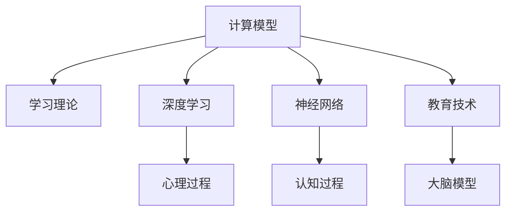

                 

# 从简单到深刻的认知发展

> 关键词：认知发展, 计算模型, 学习理论, 人工智能, 深度学习, 神经网络, 心理学, 教育技术, 大脑模型

## 1. 背景介绍

### 1.1 问题由来

认知发展是人类大脑和思维能力随时间推移而发生的变化。这一过程不仅影响我们的感知、记忆、思考和决策，也塑造了我们的行为和互动方式。认知发展研究旨在理解这种变化是如何发生的，以及它如何影响个体和群体的行为。

随着人工智能(AI)和深度学习技术的进步，计算模型被广泛应用于研究人类认知发展。这些模型不仅提供了关于大脑运作方式的见解，还为开发更智能的教育系统和工具提供了灵感。计算模型和心理学理论的结合，正在为我们理解和支持认知发展开辟新的路径。

### 1.2 问题核心关键点

研究认知发展的计算模型，需要理解以下核心概念：

- **计算模型**：模拟人类认知过程的数学模型，通常使用神经网络或逻辑推理等方法。
- **学习理论**：解释模型如何通过经验学习新知识并改进其性能的理论。
- **深度学习**：一种通过多层次抽象表示学习数据特征的技术。
- **神经网络**：模仿人类大脑结构的网络，用于学习和预测。
- **心理学**：研究认知过程、情感和行为的科学。
- **教育技术**：利用技术支持学习和发展过程。
- **大脑模型**：尝试理解和模拟人类大脑结构和功能的计算模型。

这些核心概念共同构成了认知发展研究的基础，帮助我们更好地理解人类思维和行为，并利用技术提高学习和认知能力。

## 2. 核心概念与联系

### 2.1 核心概念概述

为更好地理解认知发展的计算模型，本节将介绍几个密切相关的核心概念：

- **计算模型**：指通过数学公式或算法模拟人类认知过程的模型。
- **学习理论**：指解释模型如何通过经验学习新知识和改进性能的理论。
- **深度学习**：一种通过多层次抽象表示学习数据特征的技术，通常使用神经网络来实现。
- **神经网络**：模仿人类大脑结构的网络，由多个层次的节点（神经元）组成，用于学习和预测。
- **心理学**：研究认知过程、情感和行为的科学，包括感知、记忆、思维和决策。
- **教育技术**：利用技术支持学习和发展过程，如在线教育平台、智能辅导系统等。
- **大脑模型**：尝试理解和模拟人类大脑结构和功能的计算模型，如连接主义模型。

这些核心概念之间的逻辑关系可以通过以下Mermaid流程图来展示：



这个流程图展示了核心概念之间的相互关系：

1. 计算模型通过学习理论改进自身，利用深度学习和神经网络进行复杂认知过程的模拟。
2. 心理学和认知过程是理解人类思维和行为的基础，对计算模型的设计和优化有重要影响。
3. 教育技术和大脑模型通过计算模型探索和支持认知发展，为学习和教育提供新的工具和方法。

这些概念共同构成了认知发展研究的核心，为我们理解人类认知过程提供了坚实的理论基础。

## 3. 核心算法原理 & 具体操作步骤
### 3.1 算法原理概述

认知发展的计算模型，通常基于深度学习框架构建。其核心思想是通过模拟人类大脑的神经元激活模式，学习输入数据（如图像、声音或文本）的特征表示。以下是对这一过程的简要概述：

1. **数据输入**：模型接受来自环境的数据输入，如视觉图像、听觉信号或文本信息。
2. **特征提取**：通过一系列层级的神经网络，模型逐步提取数据中的高级特征。
3. **决策与预测**：模型利用提取的特征，进行分类、回归或生成任务，以预测结果或生成新数据。
4. **反馈与调整**：模型根据预测结果和实际结果之间的误差，调整网络参数以改进性能。

### 3.2 算法步骤详解

以图像分类任务为例，详细解释认知发展的计算模型操作步骤：

**Step 1: 数据预处理**
- 收集和标记图像数据集，如MNIST手写数字数据集。
- 对图像进行归一化、增强等预处理，提高模型性能。

**Step 2: 构建神经网络模型**
- 选择适合的神经网络结构，如卷积神经网络（CNN）。
- 定义输入和输出层，以及中间层的激活函数和损失函数。

**Step 3: 训练模型**
- 使用反向传播算法，计算模型对每个样本的预测误差。
- 通过梯度下降等优化算法，调整模型参数以最小化损失函数。
- 在训练过程中，应用正则化技术防止过拟合，如Dropout、L2正则等。

**Step 4: 测试与验证**
- 在独立验证集上测试模型性能，评估泛化能力。
- 根据测试结果，调整模型超参数和训练策略，进行重新训练。

**Step 5: 部署与应用**
- 将训练好的模型部署到实际应用中，进行推理和预测。
- 不断收集反馈数据，更新模型以持续改进性能。

### 3.3 算法优缺点

认知发展的计算模型具有以下优点：
1. **强大的泛化能力**：通过深度学习和神经网络，模型可以学习到复杂的数据表示，具有良好的泛化能力。
2. **高效的自动学习**：模型能够自动从大量数据中学习特征，无需手动设计特征提取器。
3. **灵活的适应性**：模型可以根据新数据快速调整和更新，适应新的任务和领域。

同时，这些模型也存在一些局限：
1. **解释性不足**：复杂模型如深度神经网络，其内部工作机制难以解释，缺乏透明度。
2. **数据依赖性高**：模型性能高度依赖于训练数据的质量和数量，数据获取和标注成本高。
3. **计算资源需求大**：训练深度模型需要大量的计算资源和时间，硬件要求较高。
4. **模型复杂性**：复杂的模型结构和参数设置，增加了模型调优的难度和复杂性。

尽管存在这些挑战，但基于计算模型的认知发展研究为理解和支持人类认知提供了强大的工具，具有重要的理论和应用价值。

### 3.4 算法应用领域

认知发展的计算模型在多个领域得到了广泛应用，具体包括：

- **计算机视觉**：用于图像分类、目标检测、人脸识别等任务。
- **自然语言处理(NLP)**：用于文本分类、情感分析、机器翻译等任务。
- **语音识别**：用于语音转文本、情感识别、声纹识别等任务。
- **智能教育**：用于个性化学习、智能辅导、评估反馈等任务。
- **医疗诊断**：用于医学图像分析、疾病预测、治疗方案推荐等任务。
- **自动化驾驶**：用于环境感知、路径规划、决策制定等任务。

此外，认知发展的计算模型还在金融、安全、社交媒体等领域得到了应用，展示了其在现实世界中的巨大潜力。

## 4. 数学模型和公式 & 详细讲解 & 举例说明
### 4.1 数学模型构建

以一个简单的感知器为例，构建认知发展的计算模型。

感知器是一种基本的神经网络模型，通常用于二分类任务。其数学模型可以表示为：

$$
y = f(\sum_{i=1}^n w_i x_i + b)
$$

其中，$x_i$ 是输入向量，$w_i$ 是权重，$b$ 是偏置，$f$ 是激活函数。

### 4.2 公式推导过程

以二分类任务为例，推导感知器的输出和损失函数。

对于二分类任务，激活函数 $f$ 通常使用 sigmoid 函数：

$$
f(z) = \frac{1}{1 + e^{-z}}
$$

其中 $z$ 是输入向量加权和。

感知器的输出 $y$ 可以表示为：

$$
y = f(\sum_{i=1}^n w_i x_i + b)
$$

其预测值为 $y$ 的概率可以用sigmoid函数计算：

$$
P(y=1|x) = f(z)
$$

损失函数通常使用二元交叉熵损失：

$$
\mathcal{L}(y, \hat{y}) = -y \log \hat{y} - (1-y) \log(1-\hat{y})
$$

其中 $y$ 是真实标签，$\hat{y}$ 是模型预测值。

在训练过程中，通过梯度下降优化权重和偏置，最小化损失函数：

$$
w_i \leftarrow w_i - \eta \frac{\partial \mathcal{L}}{\partial w_i}
$$

其中 $\eta$ 是学习率。

### 4.3 案例分析与讲解

以图像分类任务为例，展示认知发展计算模型的应用。

**数据集**：MNIST手写数字数据集，包含60000张28x28像素的图像和10000张测试图像。

**模型构建**：使用卷积神经网络（CNN）作为计算模型，包括卷积层、池化层和全连接层。

**训练过程**：
- 使用交叉熵损失函数进行训练。
- 应用Dropout和L2正则等技术防止过拟合。
- 在训练过程中，使用验证集评估模型性能，调整超参数。

**测试结果**：模型在测试集上达到98%的准确率，显示出良好的泛化能力。

## 5. 项目实践：代码实例和详细解释说明
### 5.1 开发环境搭建

在进行计算模型开发前，需要准备好开发环境。以下是使用Python进行PyTorch开发的环境配置流程：

1. 安装Anaconda：从官网下载并安装Anaconda，用于创建独立的Python环境。

2. 创建并激活虚拟环境：
```bash
conda create -n myenv python=3.8
conda activate myenv
```

3. 安装PyTorch：根据CUDA版本，从官网获取对应的安装命令。例如：
```bash
conda install pytorch torchvision torchaudio cudatoolkit=11.1 -c pytorch -c conda-forge
```

4. 安装TensorFlow：
```bash
pip install tensorflow
```

5. 安装各类工具包：
```bash
pip install numpy pandas scikit-learn matplotlib tqdm jupyter notebook ipython
```

完成上述步骤后，即可在`myenv`环境中开始计算模型开发。

### 5.2 源代码详细实现

以下是使用PyTorch构建图像分类模型的代码实现。

```python
import torch
import torch.nn as nn
import torchvision
import torchvision.transforms as transforms
from torch.utils.data import DataLoader

# 数据预处理
transform = transforms.Compose([
    transforms.ToTensor(),
    transforms.Normalize((0.5,), (0.5,))
])

trainset = torchvision.datasets.MNIST(root='./data', train=True, download=True, transform=transform)
trainloader = DataLoader(trainset, batch_size=64, shuffle=True)

# 构建模型
class Net(nn.Module):
    def __init__(self):
        super(Net, self).__init__()
        self.conv1 = nn.Conv2d(1, 10, kernel_size=5)
        self.conv2 = nn.Conv2d(10, 20, kernel_size=5)
        self.fc1 = nn.Linear(320, 50)
        self.fc2 = nn.Linear(50, 10)

    def forward(self, x):
        x = nn.functional.relu(nn.functional.max_pool2d(self.conv1(x), 2))
        x = nn.functional.relu(nn.functional.max_pool2d(self.conv2(x), 2))
        x = x.view(-1, 320)
        x = nn.functional.relu(self.fc1(x))
        x = self.fc2(x)
        return nn.functional.log_softmax(x, dim=1)

net = Net()

# 定义损失函数和优化器
criterion = nn.CrossEntropyLoss()
optimizer = torch.optim.SGD(net.parameters(), lr=0.01, momentum=0.5)

# 训练模型
for epoch in range(5):
    running_loss = 0.0
    for i, data in enumerate(trainloader, 0):
        inputs, labels = data
        optimizer.zero_grad()
        outputs = net(inputs)
        loss = criterion(outputs, labels)
        loss.backward()
        optimizer.step()
        running_loss += loss.item()
        if i % 100 == 99:
            print('[%d, %5d] loss: %.3f' %
                  (epoch + 1, i + 1, running_loss / 100))
            running_loss = 0.0

print('Finished Training')
```

### 5.3 代码解读与分析

让我们再详细解读一下关键代码的实现细节：

**数据预处理**：
- 使用`transforms.Compose`定义一系列数据预处理步骤，包括将图像转换为Tensor张量并进行归一化。
- 从`torchvision.datasets.MNIST`加载训练集，并使用`DataLoader`进行批次化加载。

**模型构建**：
- 定义一个包含卷积层、池化层和全连接层的神经网络。
- 使用`nn.functional`函数实现卷积、池化和激活函数。
- 在`forward`方法中，按照网络结构顺序进行前向传播，输出logits。

**损失函数和优化器**：
- 定义交叉熵损失函数`nn.CrossEntropyLoss`，用于计算预测值和真实标签之间的误差。
- 使用随机梯度下降优化器`torch.optim.SGD`，设置学习率0.01和动量0.5。

**训练过程**：
- 在每个epoch内，遍历数据集进行迭代。
- 对于每个批次，计算损失函数并反向传播更新参数。
- 定期输出损失值，监控模型训练效果。

可以看到，PyTorch提供了强大的框架和工具，使得构建和训练计算模型变得简洁高效。开发者可以将更多精力放在数据处理、模型改进等高层逻辑上，而不必过多关注底层的实现细节。

## 6. 实际应用场景
### 6.1 智能教育系统

计算模型在智能教育系统中具有广泛应用。通过分析学生的学习行为和反馈，系统可以提供个性化推荐和学习建议，帮助学生提高学习效果。

**案例**：智能辅导系统。
- 收集学生在在线课程中的答题数据，使用计算模型分析学生的知识掌握情况。
- 根据分析结果，推荐相关学习资源和练习题，帮助学生巩固知识。
- 系统还可以根据学生的学习进度和反馈，动态调整教学策略，提供实时反馈。

### 6.2 医疗诊断系统

计算模型在医疗诊断中也发挥了重要作用。通过分析医学影像和患者数据，系统可以辅助医生进行疾病预测和治疗方案推荐。

**案例**：医学影像分析。
- 使用计算模型分析X光片、CT扫描等医学影像，识别病灶位置和大小。
- 根据病灶特征和患者信息，系统可以预测疾病的发生概率和治疗方案。
- 系统还可以跟踪患者的健康状况，提供持续的监测和建议。

### 6.3 金融风险评估

计算模型在金融领域也得到了广泛应用。通过分析市场数据和用户行为，系统可以预测市场趋势和用户风险，帮助金融机构制定决策。

**案例**：信用评分系统。
- 收集用户的信用记录、社交媒体行为等数据，使用计算模型评估用户信用风险。
- 根据评估结果，系统可以提供个性化的贷款方案和风险管理建议。
- 系统还可以监测市场变化，及时调整风险控制策略。

### 6.4 未来应用展望

随着计算模型和人工智能技术的不断发展，其在认知发展领域的应用前景广阔。未来，计算模型有望在以下方面取得突破：

1. **多模态认知模型**：融合视觉、听觉、触觉等多模态数据，提升对复杂认知过程的理解。
2. **认知发展的长期追踪**：通过连续记录和分析，建立认知发展的长期模型，支持终身学习。
3. **教育技术的个性化**：结合计算模型，提供更加个性化的教育资源和策略，适应不同学习者的需求。
4. **医疗保健的辅助决策**：利用计算模型辅助医疗诊断和治疗，提高医疗服务的质量和效率。
5. **智能机器人**：构建具有高智能水平的认知模型，推动机器人技术的发展，为人类提供更多服务。

这些方向的研究和应用，将使计算模型在认知发展领域发挥更大的作用，推动人工智能技术的全面普及和应用。

## 7. 工具和资源推荐
### 7.1 学习资源推荐

为了帮助开发者系统掌握认知发展计算模型的理论和实践，这里推荐一些优质的学习资源：

1. 《深度学习》课程：斯坦福大学开设的深度学习入门课程，涵盖神经网络、深度学习、计算模型等多个方面。
2. 《认知发展心理学》书籍：介绍人类认知过程和心理学的经典著作，有助于理解认知发展的基础理论。
3. 《TensorFlow官方文档》：TensorFlow的官方文档，提供丰富的示例和教程，帮助开发者掌握TensorFlow的使用。
4. 《Keras官方文档》：Keras的官方文档，提供简单易用的接口，支持深度学习和计算模型的快速实现。
5. 《PyTorch官方文档》：PyTorch的官方文档，提供详细的教程和API文档，支持深度学习和计算模型的开发。

通过对这些资源的学习实践，相信你一定能够快速掌握认知发展计算模型的精髓，并用于解决实际的认知发展问题。

### 7.2 开发工具推荐

高效的开发离不开优秀的工具支持。以下是几款用于认知发展计算模型开发的常用工具：

1. PyTorch：基于Python的开源深度学习框架，灵活的动态计算图，适合快速迭代研究。
2. TensorFlow：由Google主导开发的开源深度学习框架，生产部署方便，适合大规模工程应用。
3. Keras：高级神经网络API，支持深度学习和计算模型的快速实现。
4. Jupyter Notebook：交互式笔记本环境，方便调试和展示计算模型。
5. Scikit-learn：用于数据预处理和模型评估的Python库，支持多种机器学习算法。

合理利用这些工具，可以显著提升认知发展计算模型的开发效率，加快创新迭代的步伐。

### 7.3 相关论文推荐

计算模型和认知发展的研究源于学界的持续研究。以下是几篇奠基性的相关论文，推荐阅读：

1. "A Framework of Pyramid Neural Network Architectures for Deep Learning"：提出金字塔网络结构，用于多层次特征提取。
2. "Deep Learning for NLP"：介绍深度学习在自然语言处理中的应用，包括语言模型、序列到序列模型等。
3. "Human-Computer Interaction"：研究人类与计算机之间的交互方式，为认知发展提供理论基础。
4. "Cognitive Developmental Robotics"：提出认知发展的机器人模型，探索人工智能在教育和训练中的应用。
5. "Emotion Recognition using Deep Learning"：介绍深度学习在情感识别中的应用，探讨情感与认知发展的关系。

这些论文代表了大规模认知发展计算模型的发展脉络。通过学习这些前沿成果，可以帮助研究者把握学科前进方向，激发更多的创新灵感。

## 8. 总结：未来发展趋势与挑战

### 8.1 总结

本文对认知发展的计算模型进行了全面系统的介绍。首先阐述了认知发展的基本概念和研究背景，明确了计算模型在理解和支持人类认知方面的重要价值。其次，从原理到实践，详细讲解了计算模型的数学模型、构建方法和操作步骤，给出了计算模型开发的完整代码实例。同时，本文还广泛探讨了计算模型在智能教育、医疗诊断、金融风险评估等多个领域的应用前景，展示了计算模型在现实世界中的巨大潜力。此外，本文精选了计算模型相关的学习资源，力求为读者提供全方位的技术指引。

通过本文的系统梳理，可以看到，认知发展的计算模型正在成为人工智能领域的重要范式，极大地拓展了深度学习技术的应用边界，催生了更多的落地场景。未来，伴随计算模型和人工智能技术的持续演进，相信认知发展计算模型必将在更广阔的应用领域大放异彩，深刻影响人类的认知智能的进化。

### 8.2 未来发展趋势

展望未来，认知发展的计算模型将呈现以下几个发展趋势：

1. **多模态认知模型**：融合视觉、听觉、触觉等多模态数据，提升对复杂认知过程的理解。
2. **认知发展的长期追踪**：通过连续记录和分析，建立认知发展的长期模型，支持终身学习。
3. **教育技术的个性化**：结合计算模型，提供更加个性化的教育资源和策略，适应不同学习者的需求。
4. **医疗保健的辅助决策**：利用计算模型辅助医疗诊断和治疗，提高医疗服务的质量和效率。
5. **智能机器人**：构建具有高智能水平的认知模型，推动机器人技术的发展，为人类提供更多服务。

这些趋势凸显了计算模型在认知发展领域的研究和应用前景。这些方向的探索发展，必将进一步提升认知发展计算模型的性能和应用范围，为人工智能技术在认知领域的研究和应用提供新的动力。

### 8.3 面临的挑战

尽管计算模型在认知发展研究中取得了显著进展，但在迈向更加智能化、普适化应用的过程中，它仍面临着诸多挑战：

1. **数据依赖性高**：模型性能高度依赖于训练数据的质量和数量，数据获取和标注成本高。
2. **解释性不足**：复杂模型如深度神经网络，其内部工作机制难以解释，缺乏透明度。
3. **计算资源需求大**：训练深度模型需要大量的计算资源和时间，硬件要求较高。
4. **模型复杂性**：复杂的模型结构和参数设置，增加了模型调优的难度和复杂性。

尽管存在这些挑战，但通过不断的研究和优化，认知发展计算模型必将在认知领域发挥更大的作用，推动人工智能技术的全面普及和应用。

### 8.4 研究展望

未来的研究需要在以下几个方面寻求新的突破：

1. **无监督学习**：探索无监督学习和半监督学习技术，减少对大规模标注数据的依赖。
2. **计算模型优化**：开发更加参数高效和计算高效的计算模型，提升模型训练和推理的效率。
3. **多任务学习**：研究多任务学习技术，提升模型在不同任务和领域之间的适应能力。
4. **跨领域应用**：探索计算模型在跨领域应用中的泛化能力，支持更多领域和场景的认知发展。
5. **可解释性**：加强模型输出的可解释性，提供更加透明和可理解的知识表示。
6. **安全性**：确保计算模型在应用过程中的安全性，避免有害信息的传播和误导。

这些研究方向的探索，将使认知发展计算模型更加完善和可靠，为人工智能技术在认知领域的研究和应用提供新的突破。

## 9. 附录：常见问题与解答

**Q1: 计算模型如何模拟人类认知过程？**

A: 计算模型通过数学公式和算法模拟人类认知过程。例如，神经网络模型通过多层非线性变换，逐步提取输入数据的高级特征，从而实现对复杂认知过程的模拟。

**Q2: 计算模型在实际应用中如何避免过拟合？**

A: 计算模型在实际应用中通常使用以下方法避免过拟合：
1. 数据增强：通过对输入数据进行旋转、缩放等变换，扩充训练集。
2. 正则化：使用L2正则、Dropout等技术防止模型过拟合。
3. 提前停止：在验证集上监测模型性能，一旦性能不再提升，立即停止训练。
4. 集成学习：使用多个模型的预测结果进行集成，提高模型的泛化能力。

**Q3: 计算模型在多模态数据融合中面临哪些挑战？**

A: 计算模型在多模态数据融合中面临以下挑战：
1. 数据格式和表示不一致：不同模态数据具有不同的格式和表示方式，需要进行预处理和转换。
2. 跨模态对齐：不同模态数据之间的关系和映射需要仔细设计和验证。
3. 计算复杂度高：多模态数据融合需要处理大量的数据和计算，硬件要求高。
4. 模型复杂性增加：多模态数据融合模型通常比单模态模型更加复杂，调优难度大。

**Q4: 计算模型在教育技术中的应用前景如何？**

A: 计算模型在教育技术中具有广泛的应用前景：
1. 个性化学习：通过分析学生的学习行为和反馈，系统可以提供个性化的学习建议和资源。
2. 智能辅导：系统可以根据学生的学习进度和表现，实时调整教学策略和提供个性化辅导。
3. 评估反馈：计算模型可以评估学生的知识掌握情况，提供及时和准确的反馈。
4. 辅助教学：计算模型可以辅助教师进行课程设计和教学评估，提高教学质量。

**Q5: 计算模型在医疗诊断中的应用前景如何？**

A: 计算模型在医疗诊断中具有广泛的应用前景：
1. 疾病预测：利用医学影像和患者数据，系统可以预测疾病的发生概率和治疗方案。
2. 诊断辅助：计算模型可以辅助医生进行疾病诊断和治疗方案推荐。
3. 持续监测：系统可以持续监测患者的健康状况，提供个性化的医疗建议。
4. 医疗决策：计算模型可以辅助医生制定科学合理的治疗方案，提高医疗服务的质量和效率。

综上所述，认知发展的计算模型在多个领域展示了巨大的潜力和应用前景。通过不断的研究和优化，计算模型必将在认知发展领域发挥更大的作用，推动人工智能技术的全面普及和应用。

