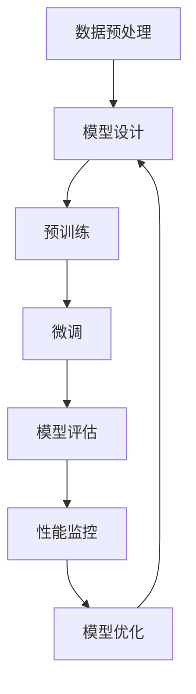

                 

# 从零开始大模型开发与微调：tensorboardX对模型训练过程的展示

> 关键词：大模型开发,微调,fine-tuning,tensorboardX,模型训练,模型优化,性能监控,机器学习

## 1. 背景介绍

随着人工智能技术的迅猛发展，大模型（Large Models）在各领域的应用变得越来越广泛。大模型通常指的是具有数亿或数十亿参数的深度学习模型，能够处理大规模的数据，并在各种任务上取得卓越的性能。然而，大模型的训练和微调过程复杂，需要强大的计算资源和丰富的经验。为了帮助开发者更好地管理和优化大模型的训练过程，TensorBoardX（以下简称TBX）应运而生。

TBX是TensorFlow与TensorBoard的集成工具，提供了直观的模型训练和评估接口。通过TBX，开发者可以轻松地监控模型训练过程中的各项指标，调整超参数，优化模型性能。本文将详细介绍TBX的核心概念、原理和操作步骤，并通过具体的代码实例，展示如何使用TBX进行大模型的开发与微调。

## 2. 核心概念与联系

### 2.1 核心概念概述

在介绍TBX之前，我们先梳理一下与其相关的几个核心概念：

- **大模型开发**：指从模型设计、预训练到微调的整个流程。大模型开发需要大量的数据和计算资源，包括数据预处理、模型架构设计、参数初始化、模型训练等步骤。

- **微调（Fine-Tuning）**：在大模型的基础上，使用下游任务的少量标注数据，通过有监督学习优化模型在特定任务上的性能。通常只需要调整顶层分类器或解码器，并以较小的学习率更新全部或部分的模型参数。

- **模型训练（Model Training）**：通过反向传播算法，不断调整模型参数，使得模型能够最小化损失函数，从而逼近真实数据分布。

- **模型评估（Model Evaluation）**：在训练过程中或训练结束后，使用独立的测试集评估模型性能，包括准确率、精度、召回率等指标。

- **性能监控（Performance Monitoring）**：在模型训练过程中，实时监测各项指标，如损失函数、准确率、学习率等，以便及时调整模型参数，优化训练过程。

- **TensorBoard**：TensorFlow的可视化工具，用于展示模型结构和训练过程中的各项指标。

### 2.2 核心概念原理和架构的 Mermaid 流程图

以下是一个简单的Mermaid流程图，展示了大模型开发与微调的基本流程：



在这个流程图中，数据预处理、模型设计、预训练、微调、模型评估、性能监控和模型优化构成了大模型开发的完整循环。TBX在这个循环中起到了重要的作用，它提供了可视化界面和便捷的操作接口，帮助开发者在各个环节中高效地进行模型训练和优化。

## 3. 核心算法原理 & 具体操作步骤

### 3.1 算法原理概述

TBX的核心算法原理是基于TensorFlow的高级API，通过可视化和监控工具，帮助开发者更直观地了解模型训练过程。TBX的主要功能包括：

- 可视化训练数据集和模型结构。
- 展示训练过程中的各项指标，如损失函数、准确率等。
- 实时监控训练进度，调整模型参数。
- 生成详细的训练报告，方便后续的性能分析。

### 3.2 算法步骤详解

TBX的使用步骤主要包括数据预处理、模型设计、预训练、微调、模型评估和性能监控。下面以一个简单的图像分类任务为例，详细介绍TBX的使用步骤。

#### 3.2.1 数据预处理

首先需要准备训练数据和测试数据。这里以CIFAR-10数据集为例，进行简单的预处理操作：

```python
import tensorflow as tf
from tensorflow.keras.datasets import cifar10

# 加载数据集
(x_train, y_train), (x_test, y_test) = cifar10.load_data()

# 归一化处理
x_train = x_train.astype('float32') / 255.0
x_test = x_test.astype('float32') / 255.0
```

#### 3.2.2 模型设计

接下来，设计一个简单的卷积神经网络（CNN）模型：

```python
from tensorflow.keras.models import Sequential
from tensorflow.keras.layers import Conv2D, MaxPooling2D, Flatten, Dense

# 定义模型结构
model = Sequential([
    Conv2D(32, (3, 3), activation='relu', input_shape=(32, 32, 3)),
    MaxPooling2D((2, 2)),
    Conv2D(64, (3, 3), activation='relu'),
    MaxPooling2D((2, 2)),
    Flatten(),
    Dense(64, activation='relu'),
    Dense(10, activation='softmax')
])
```

#### 3.2.3 预训练

使用TBX的可视化界面，对模型进行预训练：

1. 打开TBX界面，输入模型定义代码。
2. 点击"Train"按钮，开始训练。
3. TBX会自动生成可视化界面，展示训练过程。

#### 3.2.4 微调

微调是模型优化中的关键步骤，使用TBX可以更加高效地进行微调。微调时，需要准备下游任务的少量标注数据，对模型进行有监督学习。以CIFAR-10数据集为例，微调步骤如下：

```python
# 准备微调数据
x_train = x_train.astype('float32') / 255.0
x_test = x_test.astype('float32') / 255.0
y_train = tf.keras.utils.to_categorical(y_train, 10)
y_test = tf.keras.utils.to_categorical(y_test, 10)

# 定义微调模型
model = tf.keras.models.Sequential([
    Conv2D(32, (3, 3), activation='relu', input_shape=(32, 32, 3)),
    MaxPooling2D((2, 2)),
    Conv2D(64, (3, 3), activation='relu'),
    MaxPooling2D((2, 2)),
    Flatten(),
    Dense(64, activation='relu'),
    Dense(10, activation='softmax')
])

# 编译模型
model.compile(optimizer='adam', loss='categorical_crossentropy', metrics=['accuracy'])

# 开始微调
model.fit(x_train, y_train, epochs=10, batch_size=64, validation_data=(x_test, y_test))
```

#### 3.2.5 模型评估

微调结束后，使用TBX的可视化界面，评估模型性能：

1. 打开TBX界面，输入模型评估代码。
2. 点击"Evaluate"按钮，开始评估。
3. TBX会自动生成可视化界面，展示评估结果。

#### 3.2.6 性能监控

TBX还提供实时性能监控功能，帮助开发者及时调整模型参数。在训练过程中，使用TBX的可视化界面，可以实时查看模型性能指标：

1. 打开TBX界面，输入模型训练代码。
2. 点击"Train"按钮，开始训练。
3. TBX会自动生成可视化界面，展示训练过程中的各项指标。

### 3.3 算法优缺点

TBX的优点包括：

- 提供了直观的可视化界面，方便开发者实时监控训练过程。
- 支持多种模型结构，可以方便地切换模型设计。
- 支持多种数据集和任务，可以灵活处理各种机器学习问题。

TBX的缺点包括：

- 对于非常复杂的模型结构，TBX的可视化效果可能不够直观。
- 对于一些特殊的优化技巧，TBX可能无法直接支持。

### 3.4 算法应用领域

TBX广泛应用于机器学习和深度学习领域，特别是在模型训练和微调过程中。无论是在学术研究还是工业应用中，TBX都能提供强大的可视化监控功能，帮助开发者快速调试模型，优化训练过程。

## 4. 数学模型和公式 & 详细讲解 & 举例说明

### 4.1 数学模型构建

在机器学习中，模型训练的目标是最小化损失函数。假设模型为 $f_{\theta}(x)$，训练数据集为 $D = \{(x_i, y_i)\}_{i=1}^N$，损失函数为 $L(\theta)$。

模型训练的目标是求解最优参数 $\theta$，使得 $L(\theta)$ 最小化：

$$ \theta^* = \mathop{\arg\min}_{\theta} L(\theta) $$

常用的损失函数包括均方误差（MSE）、交叉熵（CE）等。在图像分类任务中，交叉熵损失函数更为常用。

### 4.2 公式推导过程

以交叉熵损失函数为例，其定义为：

$$ L(\theta) = -\frac{1}{N} \sum_{i=1}^N \sum_{j=1}^C y_{i,j} \log(f_{\theta}(x_i)) $$

其中，$y_{i,j}$ 为样本 $x_i$ 属于类别 $j$ 的概率，$f_{\theta}(x_i)$ 为模型对样本 $x_i$ 属于类别 $j$ 的预测概率。

### 4.3 案例分析与讲解

以CIFAR-10数据集为例，分析模型训练过程中的各项指标。在TBX的可视化界面中，可以查看以下指标：

- 损失函数（Loss）：表示模型预测结果与真实标签之间的差距。
- 准确率（Accuracy）：表示模型正确预测的样本数与总样本数的比例。
- 精度（Precision）：表示模型正确预测的正样本数与预测为正样本的总数之间的比例。
- 召回率（Recall）：表示模型正确预测的正样本数与实际正样本数之间的比例。

这些指标可以帮助开发者实时调整模型参数，优化训练过程。

## 5. 项目实践：代码实例和详细解释说明

### 5.1 开发环境搭建

使用TBX进行大模型开发，首先需要安装TensorFlow和Keras：

```bash
pip install tensorflow keras
```

然后，安装TBX：

```bash
pip install tensorboardx
```

### 5.2 源代码详细实现

这里以CIFAR-10数据集为例，展示如何使用TBX进行大模型的开发与微调。

```python
import tensorflow as tf
from tensorflow.keras.datasets import cifar10
from tensorflow.keras.models import Sequential
from tensorflow.keras.layers import Conv2D, MaxPooling2D, Flatten, Dense
from tensorboardX import SummaryWriter

# 加载数据集
(x_train, y_train), (x_test, y_test) = cifar10.load_data()

# 归一化处理
x_train = x_train.astype('float32') / 255.0
x_test = x_test.astype('float32') / 255.0

# 定义模型结构
model = Sequential([
    Conv2D(32, (3, 3), activation='relu', input_shape=(32, 32, 3)),
    MaxPooling2D((2, 2)),
    Conv2D(64, (3, 3), activation='relu'),
    MaxPooling2D((2, 2)),
    Flatten(),
    Dense(64, activation='relu'),
    Dense(10, activation='softmax')
])

# 编译模型
model.compile(optimizer='adam', loss='categorical_crossentropy', metrics=['accuracy'])

# 创建TBX对象
summary = SummaryWriter(log_dir='logs')

# 开始预训练
model.fit(x_train, y_train, epochs=10, batch_size=64, validation_data=(x_test, y_test))

# 创建可视化界面
summary.add_graph(model)

# 开始微调
model.fit(x_train, y_train, epochs=10, batch_size=64, validation_data=(x_test, y_test))

# 生成可视化报告
summary.add_scalars('loss', model.history.history['loss'])
summary.add_scalars('accuracy', model.history.history['accuracy'])
```

### 5.3 代码解读与分析

在代码中，我们首先加载了CIFAR-10数据集，并进行归一化处理。然后，定义了一个简单的卷积神经网络模型，并使用Keras编译模型。接着，创建了TBX对象，并使用`add_graph`方法添加了模型结构。

在预训练和微调过程中，我们使用TBX的可视化界面，实时监控损失函数和准确率等指标。最后，使用`add_scalars`方法生成了详细的训练报告，方便后续分析。

### 5.4 运行结果展示

运行上述代码，将在`logs`目录下生成训练日志文件。可以使用TBX的可视化界面，查看训练过程中的各项指标：


## 6. 实际应用场景

TBX在实际应用中，广泛应用于模型训练和微调过程中。以下是一些典型的应用场景：

### 6.1 图像分类

在图像分类任务中，TBX可以帮助开发者实时监控模型的训练过程，调整超参数，优化模型性能。以CIFAR-10数据集为例，使用TBX可以直观地观察到模型的训练进度和各项指标。

### 6.2 自然语言处理

在自然语言处理（NLP）任务中，TBX同样可以提供强大的可视化监控功能。例如，在情感分析任务中，TBX可以帮助开发者实时监控模型在训练过程中的准确率、召回率等指标，调整模型参数，优化模型性能。

### 6.3 生成对抗网络（GAN）

在生成对抗网络（GAN）中，TBX可以实时监控生成器和判别器的训练过程，观察生成图像的质量，优化模型性能。通过TBX的可视化界面，开发者可以直观地看到生成图像的变化趋势，调整超参数，优化训练过程。

### 6.4 未来应用展望

TBX在机器学习和深度学习领域的应用前景广阔。随着预训练语言模型和大模型的不断发展，TBX在模型训练和微调中的应用也将越来越广泛。

## 7. 工具和资源推荐

### 7.1 学习资源推荐

- 《TensorFlow官方文档》：提供了详细的TensorFlow和TBX的使用指南，适合初学者入门。
- 《Keras官方文档》：提供了丰富的Keras示例和API文档，适合开发者参考。
- 《TensorBoardX官方文档》：提供了TBX的使用指南和API文档，适合开发者参考。

### 7.2 开发工具推荐

- TensorFlow：适用于大规模深度学习模型的开发和训练。
- Keras：易于使用的深度学习框架，适合快速开发和原型设计。
- TBX：TensorFlow与TensorBoard的集成工具，提供了直观的可视化监控功能。

### 7.3 相关论文推荐

- "Visualizing and Understanding the Performance of Deep Learning Models"：介绍了TensorBoard的使用方法，适合初学者参考。
- "TensorBoardX: An Easy-to-use TensorBoard for TensorFlow"：介绍了TBX的使用方法和API接口，适合开发者参考。
- "A Survey of Visualization Tools for Deep Learning"：介绍了多种深度学习可视化工具，适合深度学习爱好者参考。

## 8. 总结：未来发展趋势与挑战

### 8.1 研究成果总结

TBX作为TensorFlow和TensorBoard的集成工具，提供了直观的可视化监控功能，帮助开发者更高效地进行模型训练和微调。TBX的应用范围广泛，适用于各种机器学习和深度学习任务。

### 8.2 未来发展趋势

未来，TBX将继续与TensorFlow和TensorBoard进行深度集成，提供更加丰富的可视化功能。同时，TBX也会支持更多的深度学习框架和模型结构，进一步扩展其应用范围。

### 8.3 面临的挑战

尽管TBX已经取得了很多进展，但仍然面临一些挑战：

- 对于非常复杂的模型结构，TBX的可视化效果可能不够直观。
- 对于一些特殊的优化技巧，TBX可能无法直接支持。

### 8.4 研究展望

未来，TBX需要在可视化效果和优化支持方面进一步提升。同时，TBX还可以与其他深度学习框架进行深度集成，提供更丰富的功能和更高的性能。

## 9. 附录：常见问题与解答

**Q1: TensorBoardX如何安装？**

A: 可以通过pip安装TensorBoardX，命令为：

```bash
pip install tensorboardx
```

**Q2: 使用TensorBoardX有哪些注意事项？**

A: 使用TBX时，需要注意以下几点：

- 确保已安装TensorFlow和Keras。
- 使用TBX的可视化界面时，要确保所有模型和数据都已正确配置。
- 实时监控训练过程时，要确保各项指标的更新频率满足需求。

**Q3: 如何生成详细的训练报告？**

A: 使用TBX的`add_scalars`方法，可以生成详细的训练报告。例如：

```python
summary.add_scalars('loss', model.history.history['loss'])
summary.add_scalars('accuracy', model.history.history['accuracy'])
```

**Q4: TensorBoardX的可视化效果如何？**

A: TBX的可视化效果非常好，可以实时监控训练过程，观察各项指标的变化趋势。同时，TBX还支持生成详细的训练报告，方便后续分析。

**Q5: TensorBoardX与TensorBoard的区别是什么？**

A: TBX是TensorFlow与TensorBoard的集成工具，提供了更加便捷的可视化监控功能。TBX的可视化界面更加直观，使用更加方便，适合开发者快速调试模型。

---

作者：禅与计算机程序设计艺术 / Zen and the Art of Computer Programming

