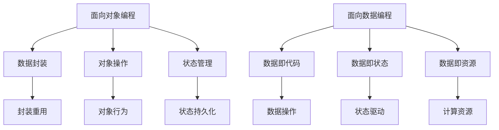

                 

# 从面向对象到面向数据:编程范式的演进

## 1. 背景介绍

编程范式（Programming Paradigm），是指编程时采用的思维模式和抽象方式。面向对象编程（Object-Oriented Programming, OOP），是现代编程的核心范式之一，它通过将数据和行为封装在对象中，使得代码更加模块化、复用性和可维护性。然而，随着数据规模的增长和计算需求的增加，面向对象编程也面临着诸多挑战。本文将探讨面向对象编程的演变，并提出面向数据编程（Data-Oriented Programming, DOP）范式，强调数据的中心地位，以更好地应对数据驱动的时代。

### 1.1 问题由来
面向对象编程（OOP）自上世纪80年代起便成为了主流编程范式。其核心思想是通过将数据（属性）和操作数据的行为（方法）封装在类中，实现代码模块化。OOP通过抽象、封装、继承和多态等机制，极大提升了软件系统的可复用性和可维护性。

然而，随着数据量的爆炸式增长和计算需求的日益多样化，面向对象编程也暴露出了一些问题。例如：

- **数据封装和类型安全带来的灵活性不足**：OOP通过封装数据和操作，提高了代码的可维护性，但同时也限制了数据共享和灵活性。例如，类之间的数据无法直接共享，数据类型的安全检查增加了运行时开销。
- **对象创建和销毁带来的性能损失**：对象的创建和销毁需要额外的内存分配和回收操作，性能开销较大。尤其是对于大数据处理场景，频繁的对象创建会导致性能瓶颈。
- **状态变化带来的状态管理困难**：面向对象编程中，对象的状态变化往往需要通过修改对象的属性或调用方法来实现。对于复杂的状态逻辑，可能导致状态管理困难。

这些问题使得面向对象编程在某些大规模数据处理和实时计算场景中逐渐暴露出局限性，促使编程范式的演进。

## 2. 核心概念与联系

### 2.1 核心概念概述

面向数据编程（DOP）范式强调数据的核心地位，通过将数据和操作解耦，实现更高的灵活性和性能。其核心思想包括：

- **数据即代码**：将数据和操作分离，强调数据本身的重要性。操作可以是算法、函数、脚本等。
- **数据即状态**：将对象的状态转换为数据，使用数据流模型管理状态。状态可以是内存中的数据结构，也可以是数据库中的表、文件等。
- **数据即资源**：将数据看作计算资源，通过高效的数据操作实现计算任务。数据操作可以是简单的读写、过滤、聚合，也可以是复杂的算法和计算图。

DOP范式与OOP范式在思维方式和编程方式上有着本质的区别，但并非完全割裂。实际上，OOP和DOP范式可以相辅相成，共同构建高效的软件系统。

### 2.2 核心概念原理和架构的 Mermaid 流程图(Mermaid 流程节点中不要有括号、逗号等特殊字符)


## 3. 核心算法原理 & 具体操作步骤

### 3.1 算法原理概述

面向数据编程的算法原理，基于“数据即代码”、“数据即状态”和“数据即资源”的核心理念，将数据和操作分离，实现更高效、灵活的编程方式。其核心算法流程包括数据准备、数据处理、结果生成等环节，每个环节都基于数据的特性进行设计和优化。

### 3.2 算法步骤详解
#### 步骤1：数据准备
- **数据收集**：从多个数据源收集数据，例如数据库、文件、API等。
- **数据清洗**：对收集的数据进行清洗、去重、格式转换等预处理操作。
- **数据标注**：对数据进行标注，如添加标签、编码、分类等，以便后续处理。

#### 步骤2：数据处理
- **数据分割**：将数据分割成训练集、验证集和测试集，以便进行模型训练和评估。
- **数据转换**：对数据进行特征工程，包括特征选择、特征提取、特征降维等操作。
- **数据增强**：通过数据扩充、增强等技术，丰富训练集的多样性，提升模型的泛化能力。

#### 步骤3：模型训练与评估
- **模型选择**：选择合适的机器学习模型，如回归、分类、聚类、深度学习等。
- **模型训练**：使用训练集对模型进行训练，调整模型参数以最小化损失函数。
- **模型评估**：使用验证集和测试集评估模型的性能，如准确率、召回率、F1值等。
- **模型优化**：根据评估结果调整模型参数，进行超参数调优、模型集成等操作，提升模型效果。

#### 步骤4：结果生成与导出
- **结果预测**：使用训练好的模型对新数据进行预测，生成结果。
- **结果可视化**：使用可视化工具对结果进行展示，以便用户理解和使用。
- **结果导出**：将结果导出为文件或数据库，以便后续使用。

### 3.3 算法优缺点

面向数据编程的优点包括：

- **灵活性高**：数据和操作分离，可以灵活地进行数据处理和操作，适应各种复杂数据场景。
- **性能优异**：数据操作高效，避免了对象创建和销毁的开销，提升了性能。
- **可扩展性强**：数据和操作分离，可以方便地进行扩展和升级，适应未来的数据变化。

缺点主要包括：

- **开发复杂度较高**：需要重新设计和实现数据处理流程，开发工作量较大。
- **状态管理复杂**：数据的状态管理需要考虑数据的生命周期、持久化等复杂问题。
- **可读性较差**：数据处理流程复杂，代码可读性较差，需要较高的开发经验。

### 3.4 算法应用领域

面向数据编程在多个领域得到了广泛应用，包括但不限于以下几类：

- **大数据处理**：大数据场景下，面向数据编程可以高效处理海量数据，避免对象操作带来的性能瓶颈。例如，Hadoop、Spark等大数据平台采用了面向数据编程的范式。
- **实时计算**：实时计算场景下，面向数据编程可以高效处理实时数据流，提升系统的实时性和响应速度。例如，Kafka、Flink等实时计算平台也采用了面向数据编程的范式。
- **深度学习**：深度学习场景下，面向数据编程可以高效地进行模型训练和结果生成，提升模型的性能和效率。例如，TensorFlow、PyTorch等深度学习框架支持面向数据编程的范式。
- **推荐系统**：推荐系统场景下，面向数据编程可以高效处理用户行为数据，提升推荐精度和效率。例如，YouTube、Netflix等推荐系统采用了面向数据编程的范式。

## 4. 数学模型和公式 & 详细讲解 & 举例说明

### 4.1 数学模型构建

面向数据编程的数学模型构建，基于数据驱动的思想，将数据和操作分离，使用数据流模型进行状态管理。以下是一个简单的数据流模型的数学模型构建过程：

```plaintext
数据流模型 = (数据源, 数据处理操作, 数据结果)
```

其中，数据源可以是文件、数据库、API等；数据处理操作可以是过滤、映射、聚合等；数据结果是对数据处理后的最终输出。

### 4.2 公式推导过程
假设我们有一个简单的数据流模型，其数据源为一个包含用户行为数据的文件，数据处理操作为筛选和分组操作，数据结果为用户行为分析结果。该数据流模型的数学模型可以表示为：

```plaintext
数据流模型 = (用户行为数据文件, 筛选操作, 分组操作, 用户行为分析结果)
```

其中，筛选操作和分组操作可以表示为函数映射，例如：

```plaintext
筛选操作 = f(x) = 过滤条件(x)
分组操作 = g(x) = 分组键(x)
```

### 4.3 案例分析与讲解

假设我们有一个电商网站的用户行为数据集，包含用户的点击、购买、评价等信息。我们使用面向数据编程的方式，对数据进行预处理、分析和展示，具体步骤如下：

1. **数据准备**：从电商网站的数据库中提取用户行为数据，存储为CSV文件。
2. **数据处理**：使用Python脚本对CSV文件进行预处理，包括清洗、去重、格式转换等操作。
3. **模型训练与评估**：使用训练集对用户行为分析模型进行训练，评估模型的性能。
4. **结果生成与导出**：使用训练好的模型对新数据进行预测，并将结果导出为报告。

## 5. 项目实践：代码实例和详细解释说明

### 5.1 开发环境搭建

为了进行面向数据编程的实践，我们需要搭建合适的开发环境。以下是一些常用的开发工具和环境：

1. **Python**：Python是最常用的面向数据编程语言，具有丰富的数据处理和分析库，如Pandas、NumPy、Scikit-learn等。
2. **Jupyter Notebook**：Jupyter Notebook是一个交互式的数据处理和分析环境，支持Python、R等多种语言，方便进行数据探索和可视化。
3. **Hadoop/Spark**：Hadoop和Spark是大数据处理和实时计算的主要框架，支持分布式计算和数据流处理。
4. **TensorFlow/PyTorch**：TensorFlow和PyTorch是深度学习的主要框架，支持面向数据编程的范式，方便进行模型训练和结果生成。

### 5.2 源代码详细实现

以下是一个简单的Python代码示例，用于对电商网站的用户行为数据进行预处理和分析：

```python
import pandas as pd

# 数据源准备
user_data = pd.read_csv('user_behavior.csv')

# 数据预处理
user_data = user_data.dropna()  # 清洗缺失数据
user_data = user_data.drop_duplicates()  # 去重
user_data = user_data.rename(columns={'item_id': 'item', 'user_id': 'user'})  # 重命名列名

# 数据处理
user_data = user_data.groupby('user', as_index=False).agg({'item': 'count'})  # 分组统计
user_data = user_data.drop(columns={'item'})  # 去除计数列

# 模型训练与评估
from sklearn.ensemble import RandomForestClassifier
from sklearn.metrics import accuracy_score

X = user_data[['user']]
y = user_data['category']
clf = RandomForestClassifier()
clf.fit(X, y)
y_pred = clf.predict(X)
accuracy = accuracy_score(y, y_pred)

# 结果生成与导出
result = pd.DataFrame({'user': user_data['user'], 'category': y_pred})
result.to_csv('user_analysis_result.csv', index=False)
```

### 5.3 代码解读与分析

在上述代码中，我们首先使用Pandas库进行数据准备和预处理，然后利用Scikit-learn库进行模型训练和评估，最后使用Pandas库生成分析结果并导出为CSV文件。

代码的关键步骤包括：

1. **数据源准备**：使用Pandas的`read_csv`方法读取用户行为数据文件。
2. **数据预处理**：使用Pandas的`dropna`、`drop_duplicates`和`rename`方法进行数据清洗、去重和列名重命名。
3. **数据处理**：使用Pandas的`groupby`和`agg`方法进行分组统计，去除计数列。
4. **模型训练与评估**：使用Scikit-learn的`RandomForestClassifier`进行分类模型训练，使用`accuracy_score`方法评估模型准确率。
5. **结果生成与导出**：使用Pandas的`DataFrame`方法生成分析结果，并导出为CSV文件。

## 6. 实际应用场景

### 6.1 电商推荐系统

电商推荐系统是面向数据编程的典型应用场景。在推荐系统中，需要处理大量的用户行为数据，使用面向数据编程的方式，可以高效地进行数据预处理和分析，提升推荐精度和效率。例如，使用Python脚本对用户行为数据进行清洗、去重、特征工程和模型训练，可以自动化处理推荐系统的数据流，提升系统的实时性和可扩展性。

### 6.2 金融风控系统

金融风控系统需要实时处理大量的交易数据，使用面向数据编程的方式，可以高效地进行数据预处理和分析，提升风控系统的准确性和效率。例如，使用Python脚本对交易数据进行清洗、去重、特征工程和模型训练，可以自动化处理风控系统的数据流，提升系统的实时性和可扩展性。

### 6.3 智慧医疗系统

智慧医疗系统需要处理大量的医疗数据，使用面向数据编程的方式，可以高效地进行数据预处理和分析，提升医疗系统的诊断精度和效率。例如，使用Python脚本对医疗数据进行清洗、去重、特征工程和模型训练，可以自动化处理智慧医疗系统的数据流，提升系统的实时性和可扩展性。

### 6.4 未来应用展望

面向数据编程在未来的应用前景非常广阔，以下是一些可能的趋势：

- **数据流平台的兴起**：随着大数据和实时计算的需求增加，数据流平台（如Flink、Apache Beam等）将成为主流，支持面向数据编程的范式。
- **数据可视化工具的发展**：数据可视化工具（如Tableau、Power BI等）将更加智能化和自动化，支持面向数据编程的范式，方便数据探索和分析。
- **深度学习框架的演进**：深度学习框架（如TensorFlow、PyTorch等）将进一步支持面向数据编程的范式，提升模型训练和结果生成的效率。
- **云计算和大数据平台的融合**：云计算和大数据平台（如AWS、Azure等）将进一步融合，支持面向数据编程的范式，提供更加高效、可扩展的计算环境。

## 7. 工具和资源推荐

### 7.1 学习资源推荐

为了帮助开发者更好地理解面向数据编程，以下是一些优质的学习资源：

1. **《Python数据分析基础》**：详细介绍Python在数据处理和分析中的应用，适合初学者入门。
2. **《深度学习与数据挖掘》**：讲解深度学习在数据处理和分析中的应用，适合有一定基础的开发者。
3. **《数据科学实战》**：详细讲解数据科学领域的技术和工具，适合希望全面提升数据处理和分析能力的开发者。
4. **《Python数据科学手册》**：综合介绍Python在数据科学领域的应用，包括数据处理、可视化、机器学习等。
5. **《Hadoop实战》**：讲解Hadoop在大数据处理中的应用，适合希望深入学习大数据技术的开发者。

### 7.2 开发工具推荐

以下是一些常用的面向数据编程工具：

1. **Pandas**：Pandas是Python中最常用的数据处理库，支持数据清洗、去重、特征工程等操作。
2. **NumPy**：NumPy是Python中的数学库，支持高效的数据计算和矩阵运算。
3. **Scikit-learn**：Scikit-learn是Python中的机器学习库，支持多种机器学习算法和模型训练。
4. **TensorFlow/PyTorch**：TensorFlow和PyTorch是深度学习的主要框架，支持面向数据编程的范式。
5. **Flink/Spark**：Flink和Spark是大数据处理和实时计算的主要框架，支持分布式计算和数据流处理。

### 7.3 相关论文推荐

以下是一些面向数据编程的相关论文，适合深入学习：

1. **《Data-Parallel Programming for Distributed Memory Multiprocessor Systems》**：介绍数据并行编程的基本原理和实现方法。
2. **《Dataflow Programming: Concepts and Foundations》**：详细讲解数据流编程的基本概念和实现方法。
3. **《Deep Learning with Data Flow Graphs》**：介绍深度学习中的数据流图模型和计算图优化方法。
4. **《Programming with DataFlow》**：介绍数据流编程在深度学习中的广泛应用和实现方法。
5. **《Parallel Programming Models for Big Data and Deep Learning》**：介绍并行编程在大数据和深度学习中的应用和实现方法。

## 8. 总结：未来发展趋势与挑战

### 8.1 研究成果总结

面向数据编程在数据驱动的时代具有重要意义，它通过将数据和操作分离，实现了更高的灵活性和性能。面向数据编程的数学模型构建、算法步骤、案例分析等方面，为开发者提供了全面的指导。面向数据编程在多个领域得到了广泛应用，如电商推荐、金融风控、智慧医疗等，展示了其在实际应用中的价值。

### 8.2 未来发展趋势

面向数据编程的未来发展趋势包括：

- **数据流平台的普及**：随着大数据和实时计算的需求增加，数据流平台（如Flink、Apache Beam等）将成为主流，支持面向数据编程的范式。
- **数据可视化工具的发展**：数据可视化工具（如Tableau、Power BI等）将更加智能化和自动化，支持面向数据编程的范式，方便数据探索和分析。
- **深度学习框架的演进**：深度学习框架（如TensorFlow、PyTorch等）将进一步支持面向数据编程的范式，提升模型训练和结果生成的效率。
- **云计算和大数据平台的融合**：云计算和大数据平台（如AWS、Azure等）将进一步融合，支持面向数据编程的范式，提供更加高效、可扩展的计算环境。

### 8.3 面临的挑战

面向数据编程在实际应用中也面临着一些挑战：

- **数据处理复杂度增加**：数据流模型的设计和实现需要考虑数据处理的多样性和复杂性，开发工作量较大。
- **数据安全和隐私问题**：数据流模型需要处理大量敏感数据，数据安全和隐私问题需要引起重视。
- **数据处理效率低下**：数据处理过程中，数据流模型的效率可能低下，需要进一步优化。

### 8.4 研究展望

面向数据编程的未来研究展望包括：

- **数据流模型的自动化设计**：探索自动化的数据流模型设计工具，减少开发者工作量。
- **数据流模型的优化算法**：研究高效的数据流模型优化算法，提升数据处理效率。
- **数据流模型的可视化工具**：开发面向数据流模型的可视化工具，方便用户理解和调试。
- **数据流模型的安全机制**：研究数据流模型的安全机制，保护数据安全和隐私。

## 9. 附录：常见问题与解答

### Q1：面向数据编程和面向对象编程有什么区别？

A: 面向数据编程和面向对象编程的区别在于思维方式和编程方式。面向数据编程将数据和操作分离，强调数据本身的重要性，操作可以是算法、函数、脚本等；而面向对象编程将数据和操作封装在对象中，强调对象的可复用性和可维护性。面向数据编程适合数据驱动的场景，面向对象编程适合系统复杂、可维护性要求高的场景。

### Q2：面向数据编程的优势和劣势是什么？

A: 面向数据编程的优势包括：灵活性高、性能优异、可扩展性强。数据和操作分离，可以灵活地进行数据处理和操作，适应各种复杂数据场景。数据操作高效，避免了对象创建和销毁的开销，提升了性能。数据和操作分离，可以方便地进行扩展和升级，适应未来的数据变化。

劣势包括：开发复杂度较高、状态管理复杂、可读性较差。需要重新设计和实现数据处理流程，开发工作量较大。数据的状态管理需要考虑数据的生命周期、持久化等复杂问题。代码可读性较差，需要较高的开发经验。

### Q3：面向数据编程适用于哪些场景？

A: 面向数据编程适用于数据驱动的场景，例如大数据处理、实时计算、深度学习等。在电商推荐、金融风控、智慧医疗等场景中，面向数据编程可以高效地处理大量数据，提升系统的实时性和可扩展性。

### Q4：面向数据编程和深度学习有什么关系？

A: 面向数据编程和深度学习有密切的关系。深度学习中，模型训练和结果生成的过程可以看作是数据流模型的实现。面向数据编程提供了高效的数据处理和分析方法，为深度学习模型的训练和评估提供了有力支持。同时，深度学习框架（如TensorFlow、PyTorch等）也支持面向数据编程的范式，方便进行模型训练和结果生成。

### Q5：面向数据编程的未来趋势是什么？

A: 面向数据编程的未来趋势包括：数据流平台的普及、数据可视化工具的发展、深度学习框架的演进、云计算和大数据平台的融合。随着大数据和实时计算的需求增加，数据流平台（如Flink、Apache Beam等）将成为主流，支持面向数据编程的范式。数据可视化工具（如Tableau、Power BI等）将更加智能化和自动化，支持面向数据编程的范式，方便数据探索和分析。深度学习框架（如TensorFlow、PyTorch等）将进一步支持面向数据编程的范式，提升模型训练和结果生成的效率。云计算和大数据平台（如AWS、Azure等）将进一步融合，支持面向数据编程的范式，提供更加高效、可扩展的计算环境。

---

作者：禅与计算机程序设计艺术 / Zen and the Art of Computer Programming

