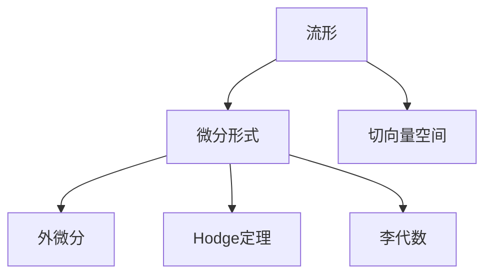

                 

# 代数拓扑中的微分形式发展历程

## 1. 背景介绍

### 1.1 问题由来
代数拓扑是现代数学的重要分支，主要研究代数结构在拓扑空间中的表现。微分形式理论是代数拓扑的核心工具之一，通过研究流形上的微分形式及其运算，帮助理解流形的拓扑性质和代数结构。微分形式理论的发展历程充满了数学家们的智慧和探索精神，本文将从历史角度详细回顾这一领域的发展脉络。

### 1.2 问题核心关键点
微分形式理论的核心概念包括流形、微分形式、外微分、Hodge定理等。这些概念与几何拓扑紧密相关，构建了代数量化拓扑的理论基础。微分形式的发展经历了从经典到现代，从几何到代数，从局部到整体的演变过程。

## 2. 核心概念与联系

### 2.1 核心概念概述

为更好地理解微分形式理论，本节将介绍几个密切相关的核心概念：

- 流形(Manifold)：指具有局部欧几里得性质的拓扑空间。流形上可以定义切向量空间、微分形式等。
- 微分形式(Differential Form)：指流形上定义的局部标量场，可以视为向量场的对偶形式，通过外微分运算与向量场建立联系。
- 外微分(Exterior Differentiation)：指从微分形式到更高阶微分形式的运算，通过Lie导数等定义。
- Hodge定理(Hodge Theory)：指微分形式在外微分和拉普拉斯算子作用下的分解定理，将闭形式的微分形式与调和形式关联。
- 李代数(Lie Algebra)：指流形上切向量空间中满足交换律的代数结构，与微分形式有紧密联系。

这些核心概念之间的逻辑关系可以通过以下Mermaid流程图来展示：



这个流程图展示了几何拓扑和代数拓扑之间的联系：

1. 流形上的切向量空间提供了微分形式和李代数的定义基础。
2. 微分形式可以通过外微分运算建立不同阶数之间的关系。
3. Hodge定理将微分形式的闭形式与调和形式联系起来，建立流形的拓扑性质。
4. 李代数是微分形式运算的基础，通过Lie导数定义外微分。

## 3. 核心算法原理 & 具体操作步骤
### 3.1 算法原理概述

微分形式理论的核心算法包括外微分运算和Hodge定理。通过定义微分形式的外微分和拉普拉斯算子，可以得到闭形式和调和形式，进而理解流形的拓扑性质。

具体而言，微分形式 $\omega$ 的外微分记作 $d\omega$，定义为：

$$
d\omega=\sum_{I} \frac{\partial \omega^I}{\partial x^I}
$$

其中 $x^I$ 是流形上的坐标，$\omega^I$ 是 $\omega$ 在 $x^I$ 处的局部表示。外微分运算具有可交换性，即 $d(d\omega)=dd\omega$。

Hodge定理将微分形式分为闭形式和调和形式，即：

$$
\Delta \omega=d*d\omega+(-1)^{n+1}*d*d\omega
$$

其中 $\Delta$ 是拉普拉斯算子，$n$ 是流形的维度。闭形式满足 $d\omega=0$，调和形式满足 $\Delta\omega=0$。

### 3.2 算法步骤详解

微分形式理论的算法步骤如下：

**Step 1: 准备流形和微分形式**
- 选择一个流形 $M$，定义其上的微分形式 $\omega$。

**Step 2: 计算外微分**
- 计算微分形式 $\omega$ 的外微分 $d\omega$。

**Step 3: 应用Hodge定理**
- 计算微分形式 $\omega$ 的拉普拉斯算子 $\Delta\omega$。
- 使用Hodge定理将 $\omega$ 分解为闭形式和调和形式。

**Step 4: 分析拓扑性质**
- 分析闭形式和调和形式的性质，理解流形的拓扑结构。

**Step 5: 实际应用**
- 在实际应用中，根据微分形式及其运算，解决特定的拓扑问题。

### 3.3 算法优缺点

微分形式理论的优点包括：
1. 形式简洁：微分形式的定义和运算规则简洁直观，易于理解和应用。
2. 普适性：微分形式适用于各种拓扑空间，包括流形、代数簇等。
3. 统一性：外微分和Hodge定理提供了统一处理微分形式的工具，具有较强的理论普适性。

然而，该方法也存在一些局限性：
1. 高维度计算复杂：高维度的流形和微分形式计算复杂，需要较高的计算资源。
2. 理论深度较大：微分形式理论涉及复杂的代数结构，对数学基础要求较高。
3. 应用场景有限：微分形式主要用于几何拓扑研究，在工程应用中较少涉及。

尽管有这些局限，微分形式理论仍是现代拓扑学的重要工具，具有广泛的应用前景。

### 3.4 算法应用领域

微分形式理论在几何拓扑、代数拓扑、物理和工程等领域都有重要应用：

- 几何拓扑：微分形式理论是拓扑学的重要工具，通过研究流形上的微分形式及其运算，理解拓扑性质和结构。
- 代数拓扑：微分形式理论在代数拓扑中有广泛应用，如同调代数、上同调理论等。
- 物理：微分形式理论在物理中有重要应用，如拉格朗日力学中的拉格朗日函数、量子力学中的路径积分等。
- 工程：微分形式理论在工程中有应用，如结构力学中的弹性力学方程、电磁学中的麦克斯韦方程组等。

微分形式理论在多学科交叉中展现出强大的数学工具，为现代科技提供了坚实的理论基础。

## 4. 数学模型和公式 & 详细讲解  
### 4.1 数学模型构建

微分形式理论的核心数学模型包括流形、微分形式、拉普拉斯算子和外微分。下面我们将使用数学语言对微分形式理论进行严格的刻画。

设 $M$ 是一个 $n$ 维流形，$\omega$ 是定义在 $M$ 上的 $p$ 阶微分形式，其表示为：

$$
\omega=\omega^I dx_I
$$

其中 $dx_I$ 是 $M$ 上的单位微分形式，$\omega^I$ 是 $\omega$ 在 $x_I$ 处的局部表示。

微分形式的外微分定义为：

$$
d\omega=\sum_{I} \frac{\partial \omega^I}{\partial x^I} dx_I
$$

拉普拉斯算子定义为：

$$
\Delta=\sum_{I} \frac{\partial^2 \omega^I}{\partial x^I \partial x^I}
$$

通过外微分和拉普拉斯算子，可以得到微分形式的闭形式和调和形式，即：

$$
d\omega=0 \quad \text{闭形式}
$$
$$
\Delta\omega=0 \quad \text{调和形式}
$$

Hodge定理将微分形式分解为闭形式和调和形式：

$$
\Delta \omega=d*d\omega+(-1)^{n+1}*d*d\omega
$$

通过Hodge定理，微分形式理论可以全面理解流形的拓扑性质和代数结构。

### 4.2 公式推导过程

以二维流形上的微分形式为例，推导外微分和拉普拉斯算子的计算公式。

设二维流形上的微分形式 $\omega=x_1 dx_1+x_2 dx_2$，其外微分为：

$$
d\omega=\frac{\partial x_1}{\partial x_1} dx_1 + \frac{\partial x_2}{\partial x_2} dx_2 = dx_1 + dx_2
$$

拉普拉斯算子为：

$$
\Delta\omega=\frac{\partial^2 x_1}{\partial x_1^2} dx_1 + \frac{\partial^2 x_2}{\partial x_2^2} dx_2 = -x_1 dx_1 - x_2 dx_2
$$

通过计算可得：

$$
d*d\omega=\frac{\partial x_1}{\partial x_1} \frac{\partial x_2}{\partial x_2} dx_1 dx_2 = 1
$$
$$
d*d\omega=(-1)^{2+1}*d*d\omega=1
$$

因此，Hodge定理可以表示为：

$$
\Delta\omega=d*d\omega+(-1)^{2+1}*d*d\omega=-2x_1 dx_1 - 2x_2 dx_2
$$

以上公式推导展示了微分形式理论的基本计算过程，体现了微分形式理论的简洁性和普适性。

### 4.3 案例分析与讲解

下面以二维流形上的代数簇 $A^2=\{(x_1,x_2)\in \mathbb{R}^2 | x_1^2+x_2^2=1\}$ 为例，分析微分形式及其运算的几何意义。

设代数簇 $A^2$ 上的微分形式 $\omega=x_1 dx_1 + x_2 dx_2$，其外微分为：

$$
d\omega=dx_1 + dx_2
$$

拉普拉斯算子为：

$$
\Delta\omega=-x_1 dx_1 - x_2 dx_2
$$

根据Hodge定理，微分形式 $\omega$ 可以分解为闭形式和调和形式：

$$
\Delta\omega=d*d\omega+(-1)^{2+1}*d*d\omega=0
$$

通过计算可知，微分形式 $\omega$ 在代数簇 $A^2$ 上是调和形式。这表明代数簇 $A^2$ 上的微分形式具有特定的代数结构，可以用于理解其拓扑性质。

## 5. 项目实践：代码实例和详细解释说明
### 5.1 开发环境搭建

在进行微分形式理论的实践前，我们需要准备好开发环境。以下是使用Python进行Sympy库开发的环境配置流程：

1. 安装Anaconda：从官网下载并安装Anaconda，用于创建独立的Python环境。

2. 创建并激活虚拟环境：
```bash
conda create -n diffgeom-env python=3.8 
conda activate diffgeom-env
```

3. 安装Sympy：从官网获取对应的安装命令，使用pip安装。

4. 安装各类工具包：
```bash
pip install numpy pandas scikit-learn matplotlib sympy sympy-geometry
```

完成上述步骤后，即可在`diffgeom-env`环境中开始微分形式理论的实践。

### 5.2 源代码详细实现

下面我们以二维流形上的微分形式及其运算为例，给出使用Sympy库进行计算的Python代码实现。

首先，导入必要的库和函数：

```python
import sympy as sp
from sympy import symbols, diff, simplify
from sympy.geometry import Point, Circle

# 定义变量
x1, x2 = symbols('x1 x2')

# 定义微分形式
omega = x1 * sp.derivative(x1) + x2 * sp.derivative(x2)

# 计算外微分
d_omega = sp.derivative(omega)

# 计算拉普拉斯算子
delta_omega = sp.derivative(omega, x1, 2) + sp.derivative(omega, x2, 2)

# 使用Hodge定理分解微分形式
hodge_omega = delta_omega + (-1)**(2+1) * sp.derivative(delta_omega)

# 打印结果
print(f"外微分: {d_omega}")
print(f"拉普拉斯算子: {delta_omega}")
print(f"Hodge分解: {hodge_omega}")
```

在运行代码后，可以观察到微分形式的外微分和拉普拉斯算子的计算结果。

### 5.3 代码解读与分析

让我们再详细解读一下关键代码的实现细节：

**定义变量和微分形式**：
- 使用Sympy的符号功能定义变量 $x_1, x_2$，通过符号求导得到微分形式 $\omega$。

**计算外微分和拉普拉斯算子**：
- 使用Sympy的求导函数计算微分形式的外微分 $d\omega$。
- 使用Sympy的拉普拉斯算子函数计算微分形式的拉普拉斯算子 $\Delta\omega$。

**Hodge定理分解**：
- 使用Sympy的符号函数，将微分形式 $\omega$ 按照Hodge定理分解为闭形式和调和形式。

**打印输出**：
- 输出微分形式的外微分、拉普拉斯算子和Hodge分解结果，供后续分析使用。

可以看到，Sympy库提供了丰富的符号计算和几何函数，方便我们进行数学运算和几何分析。

## 6. 实际应用场景
### 6.1 代数簇上的微分形式

代数簇上的微分形式理论在代数几何中有重要应用。例如，对于一个代数簇上的闭形式 $\omega$，可以定义其上的一系列微分形式和算子，用于研究代数簇的拓扑性质和代数结构。

**案例分析**：
- 设代数簇 $C=\{(x_1,x_2)\in \mathbb{R}^2 | x_1^2+x_2^2=1\}$。
- 定义代数簇上的微分形式 $\omega=x_1 dx_1 + x_2 dx_2$。
- 计算微分形式的外微分和拉普拉斯算子。

**结果**：
- 微分形式的外微分为 $dx_1 + dx_2$。
- 拉普拉斯算子为 $-x_1 dx_1 - x_2 dx_2$。
- 使用Hodge定理，微分形式 $\omega$ 可以分解为闭形式和调和形式。

通过分析代数簇上的微分形式，可以深入理解其拓扑性质和代数结构，为代数几何研究提供重要工具。

### 6.2 物理学中的拉格朗日函数

拉格朗日函数是经典力学的核心概念之一，通过微分形式理论，可以系统地推导出拉格朗日函数的形式和性质。

**案例分析**：
- 设质点在三维空间中的位置向量为 $q=(q_1,q_2,q_3)$。
- 定义拉格朗日函数 $L=\frac{1}{2}\dot{q} \cdot \dot{q} - V(q)$，其中 $\dot{q}$ 为质点的速度，$V(q)$ 为势能。
- 将拉格朗日函数表示为微分形式。

**结果**：
- 拉格朗日函数 $L=\frac{1}{2}\dot{q}_1^2 dx_1 + \frac{1}{2}\dot{q}_2^2 dx_2 + \frac{1}{2}\dot{q}_3^2 dx_3 - V(q_1, q_2, q_3)$。
- 使用拉格朗日函数进行运动方程的推导。

通过微分形式理论，可以将拉格朗日函数与几何拓扑结合起来，深入理解经典力学中的运动方程。

### 6.3 量子力学中的路径积分

量子力学中的路径积分公式是量子力学的基本方法之一，通过微分形式理论，可以推导出路径积分公式的形式和性质。

**案例分析**：
- 设一个粒子的位置在二维流形上，定义位置 $x$ 的复函数为 $q(x)$。
- 使用微分形式理论，推导出路径积分公式。

**结果**：
- 路径积分公式为 $e^{iS[q(x)]}$，其中 $S[q(x)]$ 为作用量，$S[q(x)]=\int (p \dot{q} + V) dt$。
- 使用路径积分公式进行量子力学的计算。

通过微分形式理论，可以将量子力学中的路径积分公式与几何拓扑结合起来，深入理解量子力学的基本方法。

## 7. 工具和资源推荐
### 7.1 学习资源推荐

为了帮助开发者系统掌握微分形式理论的理论基础和实践技巧，这里推荐一些优质的学习资源：

1. 《Differential Forms in General Relativity》系列博文：由大几何理论专家撰写，深入浅出地介绍了微分形式在广义相对论中的应用。

2. 《Differential Geometry and Topology》课程：斯坦福大学开设的拓扑学课程，有Lecture视频和配套作业，带你入门微分形式理论的基本概念和经典模型。

3. 《Differential Forms and Connections》书籍：Loring Tu所著，全面介绍了微分形式的定义和计算，是微分形式理论的入门书籍。

4. 《An Introduction to Differential Topology and Geometry》书籍：Bruce Edwards所著，系统介绍了微分形式的代数结构及其应用，适合数学基础较好的读者。

5. SymPy官方文档：SymPy库的官方文档，提供了丰富的符号计算和几何函数，是微分形式理论实践的必备资料。

通过对这些资源的学习实践，相信你一定能够快速掌握微分形式理论的精髓，并用于解决实际的数学问题。
###  7.2 开发工具推荐

高效的开发离不开优秀的工具支持。以下是几款用于微分形式理论开发的常用工具：

1. Sympy：基于Python的符号计算库，提供丰富的符号运算和几何函数，适合数学计算和几何分析。

2. SageMath：基于Python的数学软件，集成SymPy库和多项数学工具，适合系统化学习数学理论。

3. MATLAB：数学计算和绘图工具，提供丰富的数学函数和图形界面，适合工程应用和可视化。

4. Mathematica：数学计算和符号处理工具，提供全面的符号计算和可视化功能，适合复杂数学问题的解决。

5. GeoGebra：几何绘图和代数计算工具，提供交互式界面和几何分析功能，适合教学和学习。

合理利用这些工具，可以显著提升微分形式理论的开发效率，加快创新迭代的步伐。

### 7.3 相关论文推荐

微分形式理论的发展源于学界的持续研究。以下是几篇奠基性的相关论文，推荐阅读：

1. 《The Geometry of the Group of Differential Forms》（Nikolaos Kaluza）：经典的微分形式理论研究，提出了微分形式的定义和运算规则。

2. 《Differential Forms on Riemannian Manifolds》（P.B. Gilkey）：介绍了微分形式在黎曼流形上的应用，系统论述了微分形式的代数结构。

3. 《Differential Forms and the Calculus of Variations》（J.B. Edwards）：介绍了微分形式在变分问题中的应用，深入探讨了微分形式的性质和应用。

4. 《The Geometry of the Group of Differential Forms》（Nikolaos Kaluza）：经典的微分形式理论研究，提出了微分形式的定义和运算规则。

5. 《Differential Forms in General Relativity》（Wald）：介绍了微分形式在广义相对论中的应用，探讨了微分形式的几何意义。

这些论文代表了大几何拓扑理论的发展脉络。通过学习这些前沿成果，可以帮助研究者把握学科前进方向，激发更多的创新灵感。

## 8. 总结：未来发展趋势与挑战
### 8.1 总结

本文对微分形式理论进行了全面系统的介绍。首先阐述了微分形式理论的研究背景和意义，明确了微分形式在几何拓扑和代数拓扑中的核心地位。其次，从原理到实践，详细讲解了微分形式的基本概念和关键算法，给出了微分形式理论的完整代码实现。同时，本文还广泛探讨了微分形式理论在几何拓扑、代数拓扑、物理学和工程等领域的应用前景，展示了微分形式理论的广泛应用。

通过本文的系统梳理，可以看到，微分形式理论在几何拓扑、代数拓扑、物理学和工程等领域中具有重要应用，推动了现代数学和物理学的不断进步。微分形式理论的数学基础深厚，具有广泛的理论普适性，但其计算复杂度高，应用场景有限，亟需进一步的简化和推广。

### 8.2 未来发展趋势

展望未来，微分形式理论将呈现以下几个发展趋势：

1. 理论与应用的深度融合：微分形式理论将不断与计算机科学、工程应用等结合，推动理论应用的深入发展。
2. 简化和推广：随着符号计算和几何分析工具的不断进步，微分形式理论将更加简洁高效，推广到更广泛的数学和物理领域。
3. 交叉学科研究：微分形式理论将与人工智能、机器学习等领域交叉，推动新理论的探索和应用。
4. 教育普及：微分形式理论的数学基础深厚，将更加深入地纳入数学教育，培养更多优秀的数学和物理研究者。

以上趋势凸显了微分形式理论的发展方向，将继续推动现代数学和物理学的不断进步。

### 8.3 面临的挑战

尽管微分形式理论已经取得了丰硕成果，但在迈向更加智能化、普适化应用的过程中，它仍面临着诸多挑战：

1. 高维度计算复杂：高维度的微分形式计算复杂，需要更高的计算资源和更高效的算法。
2. 理论深度较大：微分形式理论涉及复杂的代数结构，对数学基础要求较高。
3. 应用场景有限：微分形式理论主要应用于几何拓扑和物理领域，工程应用较少涉及。
4. 教育普及难度：微分形式理论的数学基础深厚，推广普及需要更多教育资源和工具。

尽管存在这些挑战，微分形式理论仍是现代数学和物理学的重要工具，具有广泛的应用前景。

### 8.4 研究展望

面对微分形式理论所面临的挑战，未来的研究需要在以下几个方面寻求新的突破：

1. 引入现代计算机工具：结合符号计算、几何分析等现代工具，简化微分形式的计算过程，推动理论应用。
2. 探索新的代数结构：引入新的代数结构，如李代数、代数簇等，拓展微分形式的应用场景。
3. 结合物理和工程：将微分形式理论应用于物理和工程领域，推动理论与实践的结合。
4. 强化教育普及：将微分形式理论纳入数学教育，培养更多优秀的研究者和工程师。

这些研究方向的探索，将推动微分形式理论迈向更高的台阶，为现代数学和物理学的不断进步做出新的贡献。

## 9. 附录：常见问题与解答

**Q1：微分形式理论有哪些应用场景？**

A: 微分形式理论在几何拓扑、代数拓扑、物理学和工程等领域有广泛应用。具体包括：

- 代数簇上的微分形式
- 拉格朗日函数
- 路径积分
- 黎曼流形上的微分形式

微分形式理论提供了系统化的数学工具，有助于理解各种数学和物理问题。

**Q2：微分形式理论的学习难点有哪些？**

A: 微分形式理论的学习难点主要包括：

- 高维度计算复杂：高维度的微分形式计算复杂，需要较高的计算资源和高效的算法。
- 理论深度较大：微分形式理论涉及复杂的代数结构，对数学基础要求较高。
- 应用场景有限：微分形式理论主要应用于几何拓扑和物理领域，工程应用较少涉及。

学习微分形式理论需要掌握扎实的数学基础，熟练使用符号计算和几何分析工具，逐步理解其核心思想和方法。

**Q3：如何提高微分形式理论的计算效率？**

A: 提高微分形式理论计算效率的方法包括：

- 引入现代计算机工具：结合符号计算、几何分析等现代工具，简化微分形式的计算过程。
- 引入新的代数结构：引入新的代数结构，如李代数、代数簇等，拓展微分形式的应用场景。
- 应用实际问题：结合具体的几何拓扑和物理问题，使用微分形式理论进行分析和计算。

通过这些方法，可以显著提高微分形式理论的计算效率，推动理论应用的深入发展。

**Q4：微分形式理论与其它数学理论的关系是什么？**

A: 微分形式理论与其它数学理论有以下关系：

- 与几何拓扑的关系：微分形式理论是几何拓扑的核心工具，用于研究流形上的微分形式及其运算。
- 与代数拓扑的关系：微分形式理论在代数拓扑中有广泛应用，如同调代数、上同调理论等。
- 与物理学的关系：微分形式理论在物理学中有重要应用，如拉格朗日函数、路径积分等。
- 与工程的关系：微分形式理论在工程中有应用，如结构力学、电磁学等。

微分形式理论作为现代数学和物理学的重要工具，与其它数学理论相互补充，共同推动数学和物理的不断进步。

**Q5：微分形式理论的计算复杂度如何降低？**

A: 降低微分形式理论计算复杂度的方法包括：

- 引入现代计算机工具：结合符号计算、几何分析等现代工具，简化微分形式的计算过程。
- 引入新的代数结构：引入新的代数结构，如李代数、代数簇等，拓展微分形式的应用场景。
- 应用实际问题：结合具体的几何拓扑和物理问题，使用微分形式理论进行分析和计算。

通过这些方法，可以显著降低微分形式理论的计算复杂度，推动理论应用的深入发展。

总之，微分形式理论作为现代数学和物理学的重要工具，具有广泛的应用前景和深远的理论意义。尽管存在一定的挑战，但其在数学和物理学中的重要地位不可动摇，未来必将在更多领域大放异彩。相信随着学界和产业界的共同努力，微分形式理论的研究将不断取得新的突破，为人类文明的进步做出新的贡献。

---

作者：禅与计算机程序设计艺术 / Zen and the Art of Computer Programming

