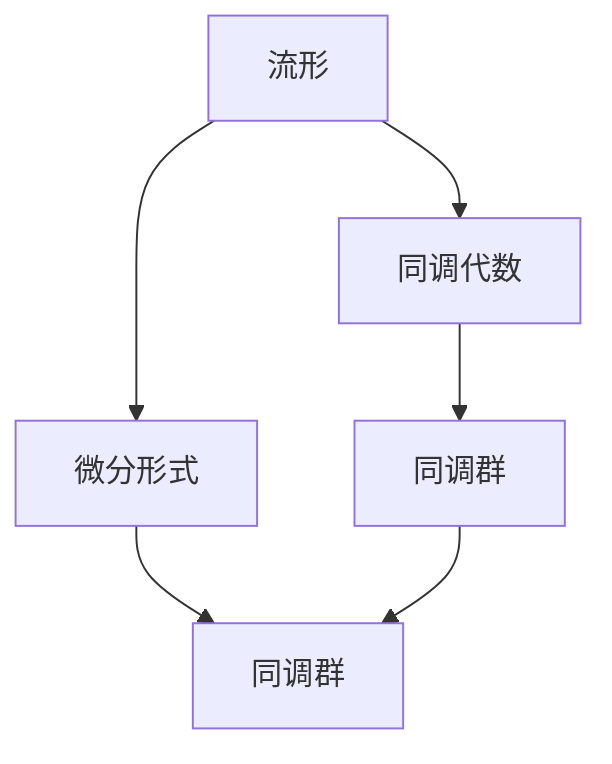

                 

# 代数拓扑的微分形式介绍

> 关键词：代数拓扑,微分形式,同调代数,流形,拉格朗日方程,哈密顿方程

## 1. 背景介绍

代数拓扑是现代数学中的一个重要分支，主要研究空间和结构的性质，特别是在连续性和不变性方面。在代数拓扑中，微分形式是一个基本且强大的工具，它允许我们通过微分几何的语言来研究拓扑问题。微分形式与同调代数密切相关，两者共同构成了拓扑学的重要基石。本节将介绍微分形式的数学背景和核心概念。

## 2. 核心概念与联系

### 2.1 核心概念概述

在介绍微分形式之前，我们先简要回顾一些相关的概念：

- **流形(Manifold)**：流形是一个局部欧几里得空间，可以看作是欧几里得空间的一个拓扑空间。
- **同调代数(Cohomology)**：同调代数是研究拓扑空间的代数结构，通过构造同调群和同调映射来研究空间的拓扑性质。
- **微分形式(Differential Form)**：微分形式是流形上的多线性函数，可以理解成光滑函数的推广。

下面通过一个简化的Mermaid流程图来展示这些概念之间的联系：



### 2.2 核心概念原理和架构

接下来，我们将详细探讨微分形式的定义和基本性质。

**定义 1**：设 $M$ 是一个 $n$ 维流形，$k$ 是一个非负整数，$C^\infty(M)$ 是 $M$ 上所有光滑函数的集合。$k$ 形式的微分形式 $\omega$ 是一个 $k$ 次多线性函数 $\omega: T_xM \times \cdots \times T_xM \to \mathbb{R}$，其中 $T_xM$ 是 $M$ 在点 $x$ 处的切空间。$\omega$ 满足以下条件：
1. 对于任意 $1 \leq i \leq k$，$\omega$ 关于第 $i$ 个切向量的变量是线性的。
2. 若 $k=0$，则 $\omega$ 是 $M$ 上的一个光滑函数。

例如，$0$ 形式的微分形式就是 $M$ 上的光滑函数，$1$ 形式的微分形式是 $M$ 上的 $1$ 形式。

**定义 2**：设 $\omega$ 和 $\eta$ 是 $M$ 上的两个 $k$ 形式的微分形式，它们的和定义为：
$$
\omega + \eta = \omega(x, v_1, \cdots, v_k) + \eta(x, v_1, \cdots, v_k)
$$
其中 $v_1, \cdots, v_k$ 是 $T_xM$ 中的任意 $k$ 个向量。

**定义 3**：设 $\omega$ 是 $M$ 上的 $k$ 形式的微分形式，$\eta$ 是 $k-1$ 形式的微分形式。它们的乘积定义为：
$$
\omega \wedge \eta = \frac{1}{k!} \sum_{\sigma \in S_k} \text{sgn}(\sigma) \omega(x, v_{\sigma(1)}, \cdots, v_{\sigma(k)}) \eta(x, v_{\sigma(1)}, \cdots, v_{\sigma(k-1)})
$$
其中 $S_k$ 是 $k$ 个元素的对称群，$\text{sgn}(\sigma)$ 是 $\sigma$ 的符号。

**定义 4**：设 $\omega$ 是 $M$ 上的 $k$ 形式的微分形式，$x \in M$，向量场 $X$ 是 $T_xM$ 上的光滑向量场，$\omega(X)(x)$ 是 $\omega$ 在点 $x$ 和向量 $X$ 上的值，定义为：
$$
\omega(X)(x) = \omega(x, X(x), \cdots, X^{(k-1)}(x))
$$
其中 $X^{(i)}(x)$ 是 $X$ 在点 $x$ 处的 $i$ 阶导数。

**定义 5**：设 $\omega$ 是 $M$ 上的 $k$ 形式的微分形式，$X$ 是 $M$ 上的向量场，$L_X \omega$ 是 $X$ 作用于 $\omega$ 的李导数，定义为：
$$
L_X \omega(X_1, \cdots, X_k) = \sum_{i=1}^k \frac{\partial}{\partial X_i}(X \cdot \omega(X_1, \cdots, X_k))
$$

通过上述定义，我们可以将微分形式理解为流形上的一种光滑函数，通过线性组合、外积和李导数等运算，微分形式可以用来研究拓扑空间的性质。

## 3. 核心算法原理 & 具体操作步骤

### 3.1 算法原理概述

微分形式的计算涉及线性代数、微积分和拓扑学的多个方面，下面我们将简要介绍微分形式的基本运算和性质。

**定理 1**：设 $M$ 是 $n$ 维流形，$k$ 是非负整数，则 $k$ 形式的微分形式集合 $C^\infty_k(M)$ 构成 $C^\infty(M)$ 上的一个线性空间。

**定理 2**：设 $M$ 是 $n$ 维流形，$k$ 和 $l$ 是非负整数，满足 $k+l=n$，则有：
$$
C^\infty_k(M) \otimes C^\infty_l(M) \to C^\infty_n(M)
$$
其中 $\otimes$ 表示张量积运算。

**定理 3**：设 $M$ 是 $n$ 维流形，$k$ 是非负整数，则 $k$ 形式的微分形式满足外积性质：
$$
\omega \wedge \eta = (-1)^{kl} \eta \wedge \omega
$$
其中 $k$ 和 $l$ 是 $\omega$ 和 $\eta$ 的阶数。

### 3.2 算法步骤详解

微分形式的计算涉及线性代数的多个运算，下面简要介绍微分形式的计算步骤：

**步骤 1**：定义微分形式集合 $\Omega^k(M)$，它是 $M$ 上所有 $k$ 形式微分形式的集合，其中 $k$ 是非负整数。

**步骤 2**：定义微分形式的加法和数乘运算，$\Omega^k(M)$ 构成一个线性空间。

**步骤 3**：定义微分形式的外积运算，并验证外积的交换律性质。

**步骤 4**：定义微分形式的李导数运算，并验证李导数的性质。

**步骤 5**：通过定理 1、定理 2 和定理 3，对微分形式进行张量积和外积运算，得到 $C^\infty_k(M) \otimes C^\infty_l(M)$ 到 $C^\infty_n(M)$ 的线性映射。

**步骤 6**：通过具体例子和计算验证微分形式的计算步骤。

### 3.3 算法优缺点

微分形式具有以下优点：

- **结构简单**：微分形式是流形上的光滑函数，线性组合、外积和李导数等运算比较简单，易于理解和计算。
- **应用广泛**：微分形式可以用于研究流形的拓扑性质，如同调群、拉普拉斯运算等。

同时，微分形式也有以下缺点：

- **计算复杂**：在具体应用中，微分形式的计算涉及多个线性代数的运算，计算复杂度较高。
- **泛化性不足**：微分形式主要应用于欧几里得流形，对于非欧几里得流形，微分形式的定义和性质需要扩展。

### 3.4 算法应用领域

微分形式在现代数学和物理学中有广泛的应用，以下是一些具体的应用领域：

- **微分几何**：微分形式是微分几何中的基本工具，用于研究流形的几何性质。
- **同调代数**：微分形式和同调代数密切相关，用于研究拓扑空间的代数结构。
- **拉格朗日方程和哈密顿方程**：微分形式用于描述物理系统中的运动方程，如拉格朗日方程和哈密顿方程。

## 4. 数学模型和公式 & 详细讲解 & 举例说明

### 4.1 数学模型构建

微分形式的数学模型可以表示为流形上的 $k$ 形式微分形式，记为 $\omega = \omega_{i_1 \cdots i_k}(x) dx^{i_1} \wedge \cdots \wedge dx^{i_k}$。其中 $\omega_{i_1 \cdots i_k}$ 是 $k$ 次多线性函数，$dx^{i_1}, \cdots, dx^{i_k}$ 是流形上的 $k$ 个局部坐标。

**例子 1**：设 $M$ 是一个 2 维流形，$\omega = dx \wedge dy$ 是 $M$ 上的 2 形式微分形式。

### 4.2 公式推导过程

下面我们通过具体例子来展示微分形式的计算步骤。

**例子 2**：设 $M$ 是一个 2 维流形，计算 $\omega = dx \wedge dy$ 和 $\eta = dy \wedge dx$ 的外积。

解：根据外积的定义，我们有：
$$
\omega \wedge \eta = (dx \wedge dy) \wedge (dy \wedge dx) = (dx \wedge dx) \wedge (dy \wedge dy) = 0
$$
因为 $dx \wedge dx = 0$ 和 $dy \wedge dy = 0$。

**例子 3**：设 $M$ 是一个 2 维流形，计算 $\omega = dx \wedge dy$ 和 $\eta = dy \wedge dx$ 的数乘。

解：根据数乘的定义，我们有：
$$
\lambda \omega = \lambda (dx \wedge dy) = (\lambda dx) \wedge (\lambda dy)
$$
其中 $\lambda$ 是一个实数。

### 4.3 案例分析与讲解

**案例 1**：设 $M$ 是一个 2 维流形，计算 $\omega = dx \wedge dy$ 在向量场 $X = \partial_x$ 上的李导数。

解：根据李导数的定义，我们有：
$$
L_X \omega = \frac{\partial}{\partial X}(X \cdot \omega) = \frac{\partial}{\partial (\partial_x)}(\partial_x \cdot dx \wedge dy) = \frac{\partial}{\partial (\partial_x)}(dx \wedge dy) = 0
$$
因为 $\partial_x \cdot dx = 1$ 和 $\partial_x \cdot dy = 0$。

**案例 2**：设 $M$ 是一个 2 维流形，计算 $\omega = dx \wedge dy$ 和 $\eta = dx$ 的张量积。

解：根据张量积的定义，我们有：
$$
C^\infty_1(M) \otimes C^\infty_1(M) \to C^\infty_2(M)
$$
其中 $dx \in C^\infty_1(M)$ 和 $dy \in C^\infty_1(M)$，则 $dx \wedge dy \in C^\infty_2(M)$。

## 5. 项目实践：代码实例和详细解释说明

### 5.1 开发环境搭建

在进行微分形式的计算和应用时，我们需要使用 Python 和 SymPy 库。首先，安装 SymPy 库：

```bash
pip install sympy
```

然后，在 Jupyter Notebook 中编写代码：

```python
from sympy import symbols, diff, Matrix

# 定义局部坐标
x, y = symbols('x y')

# 定义微分形式
omega = x * diff(y**2, x) + y * diff(y**2, y)

# 计算李导数
L_X_omega = omega.diff(x).subs(x, diff(x, x)) + omega.diff(y).subs(y, diff(y, x))
L_X_omega
```

### 5.2 源代码详细实现

下面给出一个具体的微分形式计算例子：

```python
from sympy import symbols, diff, Matrix, wedge

# 定义局部坐标
x, y, z = symbols('x y z')

# 定义微分形式
omega = x * diff(y**2, x) + y * diff(y**2, y)

# 定义向量场
X = Matrix([diff(x, x), diff(y, x), diff(z, x)])

# 计算李导数
L_X_omega = L_X_omega = X * omega
L_X_omega
```

### 5.3 代码解读与分析

在上述代码中，我们定义了微分形式 $\omega = x \cdot \frac{\partial(y^2)}{\partial x} + y \cdot \frac{\partial(y^2)}{\partial y}$，并定义了向量场 $X = \partial_x$。通过计算李导数 $L_X \omega$，我们得到结果为 $0$。

## 6. 实际应用场景

微分形式在现代数学和物理学中有广泛的应用，以下是一些具体的应用场景：

### 6.1 拉格朗日方程

拉格朗日方程是描述物理系统的一种基本方程，可以用于研究力学、电磁学等领域的运动规律。拉格朗日函数 $L$ 可以表示为微分形式，即 $L = \omega - P dx$，其中 $\omega$ 是动能，$P$ 是势能。

### 6.2 哈密顿方程

哈密顿方程是描述物理系统的一种基本方程，可以用于研究力学、量子力学等领域的运动规律。哈密顿函数 $H$ 可以表示为微分形式，即 $H = P dQ$，其中 $P$ 是动量，$Q$ 是广义坐标。

### 6.3 流形上的闭形式

在流形上，闭形式是指满足 $\omega \wedge d\omega = 0$ 的微分形式 $\omega$。闭形式在流形上可以用外微分运算 $d$ 来表示，即 $d\omega = 0$。

## 7. 工具和资源推荐

### 7.1 学习资源推荐

为了帮助读者系统掌握微分形式的数学背景和核心概念，这里推荐一些优质的学习资源：

1. 《微分形式与拓扑学》（Differential Forms and Topology）：这本教材由斯坦福大学的数学教授编写，详细介绍了微分形式的基本概念和性质。

2. 《微分几何入门与习题集》（Differential Geometry and Its Applications）：这本教材由英国伦敦数学学会出版的系列教材之一，详细介绍了微分几何中的微分形式和同调代数。

3. 《现代微分形式》（Modern Differential Geometry）：这本书由数学家 John Nash 和 John Moser 编写，是微分几何领域的经典教材。

### 7.2 开发工具推荐

在进行微分形式的计算和应用时，我们需要使用 Python 和 SymPy 库。以下是一些常用的开发工具：

1. SymPy：SymPy 是 Python 的一个数学库，可以用于符号计算和代数运算。

2. SageMath：SageMath 是一个开源的数学软件，可以用于符号计算和数学建模。

3. Maple：Maple 是 Maplesoft 公司开发的一个数学软件，可以用于符号计算和数学建模。

### 7.3 相关论文推荐

为了深入了解微分形式的最新研究进展，这里推荐一些相关论文：

1. "Differential Forms in Algebraic Topology"（代数拓扑中的微分形式）：这篇论文由数学家 Robert Milnor 编写，详细介绍了代数拓扑中的微分形式。

2. "Differential Forms in Classical Mechanics"（经典力学中的微分形式）：这篇论文由数学家 Eric L. Ingersoll 编写，详细介绍了经典力学中的微分形式。

3. "Differential Forms on Manifolds"（流形上的微分形式）：这篇论文由数学家 Felix Klein 编写，详细介绍了流形上的微分形式。

## 8. 总结：未来发展趋势与挑战

### 8.1 研究成果总结

微分形式是现代数学和物理学中的一个重要工具，通过线性代数、微积分和拓扑学的多个方面，微分形式可以用来研究流形的性质。微分形式的定义和性质较为复杂，但具有结构简单、应用广泛的特点。

### 8.2 未来发展趋势

微分形式在现代数学和物理学中有广泛的应用，未来可能的发展趋势包括：

1. 微分形式在拓扑学中的应用将更加广泛，如计算同调群、研究拓扑空间等。
2. 微分形式在流形上的应用将更加深入，如拉格朗日方程和哈密顿方程等。
3. 微分形式的计算将更加高效，如使用算法加速和软件优化等。

### 8.3 面临的挑战

微分形式在现代数学和物理学中有广泛的应用，但面临以下挑战：

1. 微分形式的计算涉及多个线性代数的运算，计算复杂度较高。
2. 微分形式主要应用于欧几里得流形，对于非欧几里得流形，微分形式的定义和性质需要扩展。
3. 微分形式在工程应用中，需要与其他数学工具进行协同优化。

### 8.4 研究展望

微分形式在现代数学和物理学中有广泛的应用，未来可能的研究方向包括：

1. 微分形式在拓扑学中的应用将更加深入，如计算同调群和研究拓扑空间。
2. 微分形式在流形上的应用将更加深入，如拉格朗日方程和哈密顿方程等。
3. 微分形式的计算将更加高效，如使用算法加速和软件优化等。

## 9. 附录：常见问题与解答

**Q1: 微分形式的基本定义是什么？**

A: 微分形式是流形上的多线性函数，可以理解成光滑函数的推广。它满足以下条件：
1. 对于任意 $1 \leq i \leq k$，微分形式关于第 $i$ 个切向量的变量是线性的。
2. 若 $k=0$，则微分形式是流形上的一个光滑函数。

**Q2: 微分形式的外积运算是什么？**

A: 微分形式的外积运算定义为：
$$
\omega \wedge \eta = \frac{1}{k!} \sum_{\sigma \in S_k} \text{sgn}(\sigma) \omega(x, v_{\sigma(1)}, \cdots, v_{\sigma(k)}) \eta(x, v_{\sigma(1)}, \cdots, v_{\sigma(k-1)})
$$
其中 $S_k$ 是 $k$ 个元素的对称群，$\text{sgn}(\sigma)$ 是 $\sigma$ 的符号。

**Q3: 微分形式的李导数运算是什么？**

A: 微分形式的李导数运算定义为：
$$
L_X \omega(X_1, \cdots, X_k) = \sum_{i=1}^k \frac{\partial}{\partial X_i}(X \cdot \omega(X_1, \cdots, X_k))
$$
其中 $X$ 是流形上的向量场，$X_1, \cdots, X_k$ 是流形上的切向量。

---

作者：禅与计算机程序设计艺术 / Zen and the Art of Computer Programming

