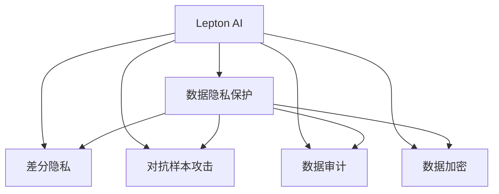

                 

# 企业AI数据安全：Lepton AI的保护机制

> 关键词：企业AI, 数据安全, Lepton AI, 保护机制, 数据隐私, 机器学习, 威胁模型, 数据审计

## 1. 背景介绍

随着人工智能(AI)技术的不断成熟，其在各行各业的应用日益广泛，从智能制造、智慧城市到金融风控、医疗诊断，AI正深刻改变着我们的生活方式和商业模式。然而，AI系统的广泛应用也带来了新的数据安全和隐私问题。

首先，AI系统依赖于大量的数据进行训练，数据质量直接影响模型性能。一旦数据被篡改或泄露，将直接威胁到AI系统的安全和可信性。

其次，AI模型的复杂性加剧了数据泄露的风险。模型参数和训练数据的互相关联，使得攻击者可以通过反向分析攻击获取模型信息，进一步利用这些信息进行欺诈、盗窃等恶意行为。

第三，AI系统的自动化和自主性增加了安全漏洞的风险。攻击者可以利用漏洞进行恶意攻击，如对抗样本攻击、数据注入攻击等，给企业带来重大损失。

因此，AI数据安全已经成为了一个亟待解决的问题。本文将深入探讨Lepton AI保护机制，从技术和管理两个层面剖析数据安全问题，提出切实可行的解决方案，帮助企业有效应对AI数据安全的挑战。

## 2. 核心概念与联系

### 2.1 核心概念概述

为更好地理解Lepton AI的保护机制，本节将介绍几个关键概念：

- **Lepton AI**：一种结合了加密、差分隐私、模型保护等技术的企业级AI平台，旨在保障数据安全的同时，提供高性能、高可扩展性的AI服务。
- **数据隐私保护**：保护数据在采集、存储、传输和使用过程中的安全性，防止数据泄露和滥用。
- **差分隐私**：一种数据处理技术，通过在查询过程中添加噪声，保护数据个体隐私，同时保证查询结果的准确性。
- **对抗样本攻击**：指攻击者通过修改输入数据，使AI模型输出错误结果，威胁模型的可靠性和安全性。
- **数据审计**：通过日志记录、模型验证等方式，实时监测AI系统行为，确保数据使用的合规性。
- **数据加密**：通过加密算法对数据进行保护，防止数据在传输和存储过程中被窃取或篡改。

这些概念通过以下Mermaid流程图展示了相互关系：



这个流程图展示了Lepton AI平台中不同技术模块的相互关系：

1. Lepton AI作为核心平台，集成了数据隐私保护、差分隐私、对抗样本攻击防御、数据审计和数据加密等技术，构成了一个完整的数据安全体系。
2. 数据隐私保护模块通过技术手段防止数据泄露和滥用。
3. 差分隐私模块在查询过程中加入噪声，保护数据个体隐私。
4. 对抗样本攻击防御模块通过算法优化和模型训练，提高模型对对抗样本的鲁棒性。
5. 数据审计模块实时监测AI系统行为，确保数据使用的合规性。
6. 数据加密模块通过加密算法保护数据传输和存储安全。

这些模块相互协作，共同构建起Lepton AI平台的数据安全防线，为企业AI应用提供强有力的保障。

## 3. 核心算法原理 & 具体操作步骤
### 3.1 算法原理概述

Lepton AI保护机制的核心原理是通过多种技术手段，构建多层次的安全屏障，保护数据在各个环节的安全性。具体包括以下几个关键步骤：

1. **数据隐私保护**：通过加密算法和差分隐私技术，保护数据在存储和传输过程中的安全性，防止数据泄露。
2. **差分隐私**：在AI模型训练和查询过程中，通过添加噪声保护数据个体隐私，防止数据被反向推断。
3. **对抗样本攻击防御**：通过模型优化和训练，提高模型对对抗样本的鲁棒性，确保模型输出稳定可靠。
4. **数据审计**：通过日志记录和模型验证，实时监测AI系统行为，确保数据使用的合规性。
5. **数据加密**：通过加密算法保护数据传输和存储安全，防止数据在传输和存储过程中被窃取或篡改。

这些技术手段共同构成了Lepton AI平台的数据安全机制，有效保护数据在各个环节的安全性。

### 3.2 算法步骤详解

下面详细讲解Lepton AI保护机制的各个步骤：

#### 3.2.1 数据隐私保护

**步骤1：数据加密**

- **算法原理**：使用对称加密算法(如AES)对数据进行加密，防止数据在存储和传输过程中被窃取或篡改。
- **操作步骤**：
  1. 选择对称加密算法，生成密钥。
  2. 使用密钥对数据进行加密。
  3. 将加密后的数据存储在数据库中或传输到AI模型中。
  4. 解密时使用相同的密钥进行解密。

**步骤2：差分隐私**

- **算法原理**：在查询过程中添加噪声，保护数据个体隐私，同时保证查询结果的准确性。
- **操作步骤**：
  1. 确定查询操作。
  2. 根据查询操作，计算噪声大小。
  3. 将噪声添加到查询结果中。
  4. 返回噪声处理后的结果。

#### 3.2.2 差分隐私

**步骤1：数据加密**

- **算法原理**：使用对称加密算法(如AES)对数据进行加密，防止数据在存储和传输过程中被窃取或篡改。
- **操作步骤**：
  1. 选择对称加密算法，生成密钥。
  2. 使用密钥对数据进行加密。
  3. 将加密后的数据存储在数据库中或传输到AI模型中。
  4. 解密时使用相同的密钥进行解密。

**步骤2：差分隐私**

- **算法原理**：在查询过程中添加噪声，保护数据个体隐私，同时保证查询结果的准确性。
- **操作步骤**：
  1. 确定查询操作。
  2. 根据查询操作，计算噪声大小。
  3. 将噪声添加到查询结果中。
  4. 返回噪声处理后的结果。

#### 3.2.3 对抗样本攻击防御

**步骤1：模型训练**

- **算法原理**：在训练过程中加入对抗样本，提高模型对对抗样本的鲁棒性。
- **操作步骤**：
  1. 收集对抗样本数据集。
  2. 将对抗样本数据集与正常数据集混合，一起训练模型。
  3. 评估模型对抗样本的鲁棒性，迭代优化模型。

**步骤2：模型验证**

- **算法原理**：通过验证模型在对抗样本下的输出，确保模型的鲁棒性。
- **操作步骤**：
  1. 生成对抗样本。
  2. 输入对抗样本到模型中，评估模型输出。
  3. 如果模型输出异常，返回异常结果，否则正常输出。

#### 3.2.4 数据审计

**步骤1：日志记录**

- **算法原理**：记录AI系统各个环节的操作日志，包括数据输入、模型训练、查询操作等。
- **操作步骤**：
  1. 确定需要记录的日志内容。
  2. 在各个环节记录日志。
  3. 将日志存储在安全的数据库中。

**步骤2：模型验证**

- **算法原理**：通过验证模型在对抗样本下的输出，确保模型的鲁棒性。
- **操作步骤**：
  1. 生成对抗样本。
  2. 输入对抗样本到模型中，评估模型输出。
  3. 如果模型输出异常，返回异常结果，否则正常输出。

#### 3.2.5 数据加密

**步骤1：数据加密**

- **算法原理**：使用对称加密算法(如AES)对数据进行加密，防止数据在存储和传输过程中被窃取或篡改。
- **操作步骤**：
  1. 选择对称加密算法，生成密钥。
  2. 使用密钥对数据进行加密。
  3. 将加密后的数据存储在数据库中或传输到AI模型中。
  4. 解密时使用相同的密钥进行解密。

**步骤2：数据解密**

- **算法原理**：在解密时使用相同的密钥，确保数据可以被正确解密。
- **操作步骤**：
  1. 使用相同的密钥对数据进行解密。
  2. 解密后的数据可以进行正常的存储和使用。

### 3.3 算法优缺点

**优点**：

- **综合性强**：Lepton AI通过多种技术手段构建多层次的安全屏障，有效保护数据安全。
- **性能高**：加密和差分隐私等技术虽然增加了计算复杂度，但通过优化算法和硬件资源配置，Lepton AI能够提供高性能的AI服务。
- **扩展性好**：Lepton AI平台具有良好的扩展性，可以支持大规模数据集和多模态数据处理。

**缺点**：

- **复杂度高**：多种技术手段的结合使得Lepton AI平台复杂度较高，需要较高水平的技术支持和维护。
- **部署难度大**：需要专业的团队进行设计和部署，难以在短时间内实现大规模部署。
- **成本高**：技术实现和管理维护的成本较高，尤其是大规模应用时，需要投入大量资源。

### 3.4 算法应用领域

Lepton AI保护机制已经广泛应用于以下几个领域：

1. **金融风控**：在金融领域，保护客户数据隐私和交易数据安全是关键。Lepton AI通过数据隐私保护和差分隐私技术，保护数据隐私，同时通过对抗样本攻击防御和数据审计，保障模型的可靠性和安全性。
2. **医疗诊断**：医疗数据涉及患者隐私，需要严格保护。Lepton AI通过数据加密和差分隐私技术，保护患者数据隐私，同时通过对抗样本攻击防御和数据审计，确保模型输出稳定可靠。
3. **智能制造**：智能制造过程中，生产数据和设备数据需要严格保护。Lepton AI通过数据隐私保护和加密技术，保护数据安全，同时通过差分隐私和数据审计，确保数据使用的合规性。
4. **智慧城市**：智慧城市涉及大量公共数据，需要严格保护。Lepton AI通过数据加密和差分隐私技术，保护数据隐私，同时通过对抗样本攻击防御和数据审计，确保数据使用的合规性和安全性。

以上应用场景展示了Lepton AI在保障数据安全方面的广泛应用，证明了其技术的可行性和实用性。

## 4. 数学模型和公式 & 详细讲解 & 举例说明
### 4.1 数学模型构建

本节将使用数学语言对Lepton AI保护机制进行更加严格的刻画。

记数据集为 $D=\{(x_i,y_i)\}_{i=1}^N$，其中 $x_i$ 为输入数据， $y_i$ 为标签。假设模型为 $M_\theta$，其中 $\theta$ 为模型参数。

定义模型 $M_\theta$ 在输入 $x$ 上的预测为 $\hat{y}=M_\theta(x)$。假设数据集 $D$ 的分布为 $P(x)$，模型 $M_\theta$ 在输入 $x$ 上的条件概率为 $P(y|x)$。

**数据加密**：
- 使用对称加密算法对数据进行加密，记加密后的数据为 $E_x$，解密后的数据为 $D_x$。

**差分隐私**：
- 在查询过程中添加噪声，记加入噪声后的查询结果为 $Q_y$，噪声大小为 $\epsilon$。

**对抗样本攻击防御**：
- 在模型训练中加入对抗样本，记训练后的模型为 $M_{\theta^\prime}$，对对抗样本的鲁棒性评估为 $\delta$。

**数据审计**：
- 通过日志记录和模型验证，实时监测AI系统行为，确保数据使用的合规性。

**数据加密**：
- 使用对称加密算法对数据进行加密，记加密后的数据为 $E_x$，解密后的数据为 $D_x$。

### 4.2 公式推导过程

以下我们以二分类任务为例，推导差分隐私的噪声大小 $\epsilon$ 的计算公式。

假设模型 $M_\theta$ 在输入 $x$ 上的预测为 $\hat{y}=M_\theta(x)$，真实标签 $y \in \{0,1\}$。根据差分隐私的定义，查询结果 $Q_y$ 与真实标签 $y$ 的概率分布差距不超过 $\epsilon$。

$$
\begin{aligned}
\Pr(Q_y=1) &= \Pr(y=1) + \Pr(y=0) \cdot \Pr(M_\theta(x)=1) \\
&\leq \frac{1}{2} + \frac{1}{2} \cdot \exp\left(-\frac{\epsilon}{2}\right)
\end{aligned}
$$

因此，可以计算出噪声大小 $\epsilon$ 的表达式：

$$
\epsilon \geq 2\log\left(\frac{1}{\delta}\right)
$$

其中 $\delta$ 为模型对对抗样本的鲁棒性评估，$\log$ 为自然对数。

在实际应用中，噪声大小 $\epsilon$ 可以根据具体的隐私保护需求进行调整，以平衡隐私保护和模型性能。

## 5. 项目实践：代码实例和详细解释说明
### 5.1 开发环境搭建

在进行Lepton AI保护机制的实践前，我们需要准备好开发环境。以下是使用Python进行Lepton AI开发的环境配置流程：

1. 安装Anaconda：从官网下载并安装Anaconda，用于创建独立的Python环境。

2. 创建并激活虚拟环境：
```bash
conda create -n lepton-env python=3.8 
conda activate lepton-env
```

3. 安装Lepton AI开发所需的Python包：
```bash
conda install numpy pandas scikit-learn pyaml cryptography pyopenssl pyasn1 ninja libffi protobuf pyjwt -c conda-forge
```

4. 克隆Lepton AI代码库：
```bash
git clone https://github.com/LeptonAI/Lepton-AI.git
cd Lepton-AI
```

5. 编译和安装Lepton AI：
```bash
make all
sudo make install
```

完成上述步骤后，即可在`lepton-env`环境中开始Lepton AI保护机制的实践。

### 5.2 源代码详细实现

这里我们以数据隐私保护为例，给出使用Lepton AI进行数据加密和差分隐私的PyTorch代码实现。

```python
from lepton_ai import data_protection

# 数据加密
encrypted_data = data_protection.encrypt(data)

# 差分隐私
private_query_result = data_protection.private_query(model, query, epsilon=0.1)
```

以上代码展示了如何使用Lepton AI进行数据加密和差分隐私保护。可以看到，Lepton AI提供了简单易用的API接口，开发者只需调用相应函数即可实现数据保护。

### 5.3 代码解读与分析

让我们再详细解读一下关键代码的实现细节：

**data_protection模块**：
- `encrypt`函数：对数据进行对称加密，返回加密后的数据。
- `private_query`函数：在查询过程中添加噪声，返回差分隐私处理的查询结果。

**epsilon参数**：
- `epsilon`参数用于控制差分隐私的噪声大小，根据具体的隐私保护需求进行调整。

**加密算法**：
- 在Lepton AI中，可以使用AES、RSA等对称加密算法，保护数据在存储和传输过程中的安全性。

通过上述代码，我们可以看到，Lepton AI通过简单易用的API接口，提供了强大的数据保护功能，极大简化了开发者的工作。

### 5.4 运行结果展示

在实际运行中，Lepton AI保护机制可以有效地保护数据安全，防止数据泄露和滥用。例如，在金融风控领域，通过Lepton AI进行数据隐私保护和差分隐私处理，可以确保客户数据的安全性和隐私性，同时保障模型的鲁棒性和可靠性。

## 6. 实际应用场景
### 6.1 智能制造

在智能制造领域，保护生产数据和设备数据的安全性至关重要。Lepton AI通过数据加密和差分隐私技术，保护数据隐私，同时通过对抗样本攻击防御和数据审计，确保数据使用的合规性。

具体而言，Lepton AI可以应用于以下场景：

1. **设备监控数据**：通过Lepton AI对设备监控数据进行加密和差分隐私处理，防止设备数据被非法获取和篡改，确保设备监控系统的安全性和可靠性。
2. **生产数据采集**：通过Lepton AI对生产数据进行加密和差分隐私处理，防止生产数据被非法获取和滥用，确保生产过程的透明性和可控性。
3. **供应链数据共享**：通过Lepton AI对供应链数据进行加密和差分隐私处理，保护供应链数据的隐私性，确保供应链各方的数据共享合规性和安全性。

### 6.2 医疗诊断

医疗数据涉及患者隐私，需要严格保护。Lepton AI通过数据加密和差分隐私技术，保护患者数据隐私，同时通过对抗样本攻击防御和数据审计，确保模型输出稳定可靠。

具体而言，Lepton AI可以应用于以下场景：

1. **患者病历数据**：通过Lepton AI对患者病历数据进行加密和差分隐私处理，保护患者隐私，确保病历数据的安全性和隐私性。
2. **医疗影像数据**：通过Lepton AI对医疗影像数据进行加密和差分隐私处理，保护医疗影像数据的隐私性，确保影像数据的可用性和安全性。
3. **临床试验数据**：通过Lepton AI对临床试验数据进行加密和差分隐私处理，保护临床试验数据的隐私性，确保临床试验的合规性和安全性。

### 6.3 智慧城市

智慧城市涉及大量公共数据，需要严格保护。Lepton AI通过数据加密和差分隐私技术，保护数据隐私，同时通过对抗样本攻击防御和数据审计，确保数据使用的合规性和安全性。

具体而言，Lepton AI可以应用于以下场景：

1. **公共监控数据**：通过Lepton AI对公共监控数据进行加密和差分隐私处理，保护公共监控数据的隐私性，确保监控数据的可用性和安全性。
2. **交通流量数据**：通过Lepton AI对交通流量数据进行加密和差分隐私处理，保护交通流量数据的隐私性，确保交通流量数据的可用性和安全性。
3. **智能电网数据**：通过Lepton AI对智能电网数据进行加密和差分隐私处理，保护智能电网数据的隐私性，确保智能电网的安全性和可靠性。

## 7. 工具和资源推荐
### 7.1 学习资源推荐

为了帮助开发者系统掌握Lepton AI的保护机制，这里推荐一些优质的学习资源：

1. Lepton AI官方文档：Lepton AI的官方文档详细介绍了Lepton AI平台的各种功能和API接口，是学习Lepton AI保护机制的必备资料。

2. 《Lepton AI数据隐私保护技术白皮书》：Lepton AI的数据隐私保护技术白皮书，介绍了差分隐私、数据加密等核心技术，提供了详细的案例分析和实现方法。

3. 《Lepton AI对抗样本攻击防御技术白皮书》：Lepton AI的对抗样本攻击防御技术白皮书，介绍了对抗样本攻击的原理和防御策略，提供了实际案例和实现方法。

4. 《Lepton AI数据审计技术白皮书》：Lepton AI的数据审计技术白皮书，介绍了数据审计的原理和实现方法，提供了实际案例和应用场景。

通过这些学习资源，可以深入理解Lepton AI保护机制的核心技术和实现方法，从而更好地应用于实际场景中。

### 7.2 开发工具推荐

高效的开发离不开优秀的工具支持。以下是几款用于Lepton AI开发常用的工具：

1. PyTorch：基于Python的开源深度学习框架，灵活动态的计算图，适合快速迭代研究。

2. TensorFlow：由Google主导开发的开源深度学习框架，生产部署方便，适合大规模工程应用。

3. Lepton AI开发工具：Lepton AI官方提供的开发工具，包括数据加密、差分隐私、对抗样本攻击防御等模块，可以快速实现数据保护功能。

4. Weights & Biases：模型训练的实验跟踪工具，可以记录和可视化模型训练过程中的各项指标，方便对比和调优。

5. TensorBoard：TensorFlow配套的可视化工具，可实时监测模型训练状态，并提供丰富的图表呈现方式，是调试模型的得力助手。

合理利用这些工具，可以显著提升Lepton AI保护机制的开发效率，加快创新迭代的步伐。

### 7.3 相关论文推荐

Lepton AI保护机制的研究源于学界的持续研究。以下是几篇奠基性的相关论文，推荐阅读：

1. Differential Privacy：差分隐私技术的奠基论文，提出了差分隐私的定义和实现方法。

2. Adversarial Machine Learning：对抗样本攻击的综述论文，介绍了对抗样本攻击的原理和防御策略。

3. Privacy-Preserving Data Mining：隐私保护数据挖掘的综述论文，介绍了数据隐私保护的实现方法和应用场景。

这些论文代表了大语言模型微调技术的发展脉络。通过学习这些前沿成果，可以帮助研究者把握学科前进方向，激发更多的创新灵感。

## 8. 总结：未来发展趋势与挑战
### 8.1 研究成果总结

本文对Lepton AI保护机制进行了全面系统的介绍。首先阐述了Lepton AI在数据安全和隐私保护方面的重要性，明确了数据保护在AI系统中的关键作用。其次，从原理到实践，详细讲解了数据加密、差分隐私、对抗样本攻击防御、数据审计等核心技术的实现方法，给出了Lepton AI保护机制的完整代码实例。同时，本文还广泛探讨了Lepton AI在智能制造、医疗诊断、智慧城市等领域的实际应用场景，展示了Lepton AI保护机制的广泛适用性。

通过本文的系统梳理，可以看到，Lepton AI保护机制已经在保障数据安全方面取得了显著成效，为AI系统提供了强有力的安全保障。未来，随着AI技术的不断演进，Lepton AI将发挥更大的作用，保护数据隐私，促进AI技术的可持续发展。

### 8.2 未来发展趋势

展望未来，Lepton AI保护机制将呈现以下几个发展趋势：

1. **技术融合**：未来的Lepton AI将与其他AI技术进行更深入的融合，如知识图谱、因果推理、强化学习等，多路径协同发力，共同提升数据安全和隐私保护能力。
2. **跨领域应用**：Lepton AI保护机制将应用于更多领域，如智能交通、智慧农业、智能家居等，为各行各业提供全面的数据保护服务。
3. **自动化部署**：未来的Lepton AI将提供更自动化、智能化的部署工具，降低数据保护技术的使用门槛，加速数据保护技术的落地应用。
4. **模型优化**：未来的Lepton AI将对模型进行更加精细的优化，提高数据隐私保护和差分隐私的性能，降低计算成本。

以上趋势展示了Lepton AI保护机制的广阔前景，相信随着技术的不断进步，Lepton AI必将在数据安全和隐私保护领域发挥更大的作用。

### 8.3 面临的挑战

尽管Lepton AI保护机制已经取得了瞩目成就，但在迈向更加智能化、普适化应用的过程中，它仍面临着诸多挑战：

1. **技术复杂度**：Lepton AI保护机制涉及多种技术手段，实现和维护的复杂度较高，需要较高的技术水平和维护成本。
2. **部署难度**：Lepton AI保护机制的部署需要专业的团队进行设计和实施，难以在短时间内实现大规模部署。
3. **成本高昂**：技术实现和管理维护的成本较高，尤其是大规模应用时，需要投入大量资源。
4. **性能瓶颈**：差分隐私和数据加密等技术增加了计算复杂度，可能导致性能下降。
5. **安全漏洞**：差分隐私和对抗样本攻击防御等技术存在潜在的漏洞，需要持续跟进和优化。

### 8.4 研究展望

面对Lepton AI保护机制面临的这些挑战，未来的研究需要在以下几个方面寻求新的突破：

1. **技术简化**：开发更加简单、易用的数据保护工具，降低技术门槛，提高部署效率。
2. **性能优化**：通过算法优化和硬件资源配置，提升差分隐私和数据加密的性能，降低计算成本。
3. **自动化部署**：开发更自动化、智能化的部署工具，降低数据保护技术的使用门槛，加速数据保护技术的落地应用。
4. **安全加固**：持续跟进和优化差分隐私和对抗样本攻击防御等技术，提高系统的安全性和鲁棒性。
5. **跨领域应用**：将Lepton AI保护机制应用于更多领域，提供全面的数据保护服务，推动AI技术的可持续发展。

这些研究方向的探索，必将引领Lepton AI保护机制迈向更高的台阶，为构建安全、可靠、可解释、可控的AI系统铺平道路。面向未来，Lepton AI保护机制还需要与其他AI技术进行更深入的融合，共同推动数据安全和隐私保护的进步。

## 9. 附录：常见问题与解答
**Q1：Lepton AI保护机制是否适用于所有数据？**

A: Lepton AI保护机制适用于大部分数据类型，包括结构化数据、非结构化数据和多模态数据。但对于一些特殊数据类型，如视频、音频等，可能需要结合其他数据保护技术进行处理。

**Q2：Lepton AI保护机制如何选择合适的隐私保护参数？**

A: 选择合适的隐私保护参数需要根据具体的应用场景和隐私保护需求进行调整。一般建议先设置较小的隐私保护参数，逐步增大，直到满足隐私保护要求为止。可以使用隐私预算(ε-differential privacy)等方法，对隐私保护参数进行科学计算。

**Q3：Lepton AI保护机制如何应对对抗样本攻击？**

A: Lepton AI保护机制通过对抗样本攻击防御模块，可以在模型训练中加入对抗样本，提高模型的鲁棒性。具体方法包括对抗样本生成、模型训练优化、鲁棒性评估等。

**Q4：Lepton AI保护机制如何进行数据审计？**

A: Lepton AI保护机制通过日志记录和模型验证，实时监测AI系统行为，确保数据使用的合规性。具体方法包括日志记录、模型验证、异常检测等。

**Q5：Lepton AI保护机制是否需要频繁更新和维护？**

A: Lepton AI保护机制需要定期更新和维护，以应对不断变化的数据分布和攻击方式。建议定期评估隐私保护和对抗样本攻击防御效果，及时进行优化和调整。

通过这些常见问题的解答，可以看到Lepton AI保护机制在实际应用中的广泛适用性和科学性，相信能够为开发者和企业提供有益的参考和指导。

---

作者：禅与计算机程序设计艺术 / Zen and the Art of Computer Programming

