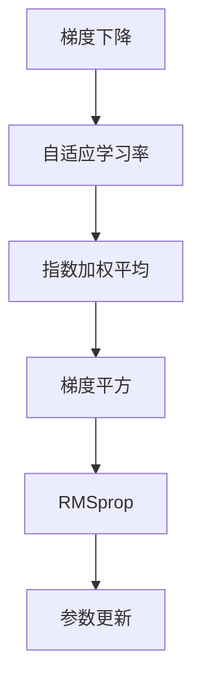

                 

# 优化算法：RMSprop 原理与代码实例讲解

> 关键词：RMSprop, 优化算法, 神经网络, 梯度下降, 梯度累积, 自适应学习率, 代码实例, 学习资源推荐

## 1. 背景介绍

### 1.1 问题由来

在深度学习模型训练中，选择合适的优化算法至关重要。梯度下降算法是最常用的优化方法，但面对非凸函数和复杂的梯度分布时，其收敛速度较慢且易陷入局部最优解。为了提高梯度下降的效率和鲁棒性，研究人员提出了多种改进的优化算法。其中，RMSprop算法是一种常用的自适应学习率优化方法，通过动态调整学习率来加速模型收敛，并降低过拟合风险。

### 1.2 问题核心关键点

RMSprop算法通过计算梯度平方的指数加权平均，自适应调整每个参数的学习率，从而提高优化速度和收敛稳定性。在实际应用中，RMSprop广泛应用于深度神经网络的训练，如卷积神经网络(CNN)、循环神经网络(RNN)、生成对抗网络(GAN)等。

## 2. 核心概念与联系

### 2.1 核心概念概述

为更好地理解RMSprop算法，本节将介绍几个相关核心概念：

- **梯度下降(Gradient Descent)**：一种基础的优化算法，通过计算目标函数的梯度，以负梯度方向更新模型参数，逐步降低损失函数值，逼近最优解。

- **学习率(Learning Rate)**：控制每次迭代参数更新的步长，过大的学习率可能导致目标函数震荡，过小的学习率则会使训练过程缓慢。

- **自适应学习率(Adaptive Learning Rate)**：根据模型参数的梯度变化，动态调整学习率，避免参数更新过快或过慢。

- **指数加权平均(Exponential Weighted Averaging)**：通过加权计算历史数据，降低噪声对当前参数更新的影响，提高模型的稳定性。

- **梯度平方(Gradient Squares)**：计算梯度平方的平均，用于自适应调整每个参数的学习率。

这些概念之间的逻辑关系可以通过以下Mermaid流程图来展示：



这个流程图展示了从梯度下降到RMSprop算法的核心步骤和关键组件。

## 3. 核心算法原理 & 具体操作步骤
### 3.1 算法原理概述

RMSprop算法是一种自适应学习率的优化算法，其核心思想是通过计算梯度平方的指数加权平均，动态调整每个参数的学习率。RMSprop能够较好地处理非凸函数和稀疏梯度，适用于多任务学习、深度神经网络等复杂场景。

RMSprop算法的参数更新公式如下：

$$
g_t = \nabla L_{\theta}(\theta_t)
$$

$$
E[g^2]_t = \beta E[g^2]_{t-1} + (1-\beta)g_t^2
$$

$$
\theta_{t+1} = \theta_t - \frac{\eta \nabla L_{\theta}(\theta_t)}{\sqrt{E[g^2]_t+\epsilon}}
$$

其中：
- $g_t$ 为当前梯度。
- $E[g^2]_t$ 为梯度平方的指数加权平均。
- $\beta$ 为加权系数，$0<\beta<1$。
- $\eta$ 为学习率。
- $\epsilon$ 为小常数，防止分母为0。
- $\theta_t$ 和 $\theta_{t+1}$ 分别表示第 $t$ 次和第 $t+1$ 次迭代后的模型参数。

RMSprop通过计算梯度平方的指数加权平均，调整每个参数的学习率，使梯度较大的参数更新步长减小，梯度较小的参数更新步长增大。这样可以减少梯度方向的抖动，加快收敛速度，避免陷入局部最优解。

### 3.2 算法步骤详解

RMSprop算法的执行流程如下：

1. 初始化模型参数 $\theta$ 和梯度平方指数加权平均 $E[g^2]$。
2. 计算当前梯度 $g_t$。
3. 根据梯度平方的指数加权平均计算学习率 $\hat{\eta}_t$。
4. 根据学习率更新模型参数 $\theta_{t+1}$。
5. 更新梯度平方指数加权平均 $E[g^2]_t$。

具体的计算过程如下：

- 初始化模型参数 $\theta_0$。
- 初始化梯度平方指数加权平均 $E[g^2]_0 = 0$。
- 循环执行以下步骤：
  - 计算当前梯度 $g_t = \nabla L_{\theta}(\theta_t)$。
  - 更新梯度平方指数加权平均 $E[g^2]_t = \beta E[g^2]_{t-1} + (1-\beta)g_t^2$。
  - 计算学习率 $\hat{\eta}_t = \frac{\eta}{\sqrt{E[g^2]_t+\epsilon}}$。
  - 更新模型参数 $\theta_{t+1} = \theta_t - \hat{\eta}_t g_t$。
  - 返回 $\theta_{t+1}$。

### 3.3 算法优缺点

RMSprop算法具有以下优点：

- **自适应学习率**：能够根据每个参数的梯度变化，动态调整学习率，提高优化效率。
- **梯度平方指数加权平均**：通过历史梯度的加权平均，减少噪声对参数更新的影响，提高稳定性。
- **稀疏梯度处理**：能够较好地处理稀疏梯度，避免梯度消失或爆炸问题。

同时，RMSprop算法也存在以下局限：

- **参数较多**：需要额外维护每个参数的梯度平方指数加权平均，增加了内存占用。
- **学习率调整不够精细**：指数加权平均的衰减系数 $\beta$ 的选择对学习率的影响较大。
- **小样本性能不佳**：在小样本数据集上，RMSprop算法可能出现收敛不稳定的问题。

### 3.4 算法应用领域

RMSprop算法广泛应用于深度神经网络训练中，如卷积神经网络(CNN)、循环神经网络(RNN)、生成对抗网络(GAN)等。在图像分类、目标检测、语音识别、自然语言处理等任务中，RMSprop算法都被证明能够有效提升模型训练速度和精度。

## 4. 数学模型和公式 & 详细讲解
### 4.1 数学模型构建

RMSprop算法基于梯度下降的基本思想，通过自适应学习率加速模型收敛。其数学模型构建如下：

1. 初始化模型参数 $\theta_0$ 和梯度平方指数加权平均 $E[g^2]_0 = 0$。
2. 计算当前梯度 $g_t = \nabla L_{\theta}(\theta_t)$。
3. 更新梯度平方指数加权平均 $E[g^2]_t = \beta E[g^2]_{t-1} + (1-\beta)g_t^2$。
4. 计算学习率 $\hat{\eta}_t = \frac{\eta}{\sqrt{E[g^2]_t+\epsilon}}$。
5. 更新模型参数 $\theta_{t+1} = \theta_t - \hat{\eta}_t g_t$。

### 4.2 公式推导过程

RMSprop算法的关键在于梯度平方指数加权平均的计算。以下将推导其具体公式。

首先，令 $E[g^2]_t = \beta E[g^2]_{t-1} + (1-\beta)g_t^2$。

对该式进行推导，得：

$$
E[g^2]_t = \beta(\beta E[g^2]_{t-2} + (1-\beta)g_{t-1}^2) + (1-\beta)g_t^2
$$

$$
E[g^2]_t = \beta^2 E[g^2]_{t-2} + \beta(1-\beta)g_{t-1}^2 + (1-\beta)g_t^2
$$

继续推导，得：

$$
E[g^2]_t = \beta^2 E[g^2]_{t-2} + \beta(1-\beta)(\beta E[g^2]_{t-3} + (1-\beta)g_{t-2}^2) + (1-\beta)g_t^2
$$

$$
E[g^2]_t = \beta^3 E[g^2]_{t-3} + \beta^2(1-\beta)g_{t-2}^2 + \beta(1-\beta)(\beta E[g^2]_{t-4} + (1-\beta)g_{t-3}^2) + (1-\beta)g_t^2
$$

以此类推，可得到：

$$
E[g^2]_t = \sum_{i=0}^{t} \beta^{i} g_{t-i}^2
$$

其中 $g_{t-i}$ 表示 $t-i$ 次迭代后的梯度。

### 4.3 案例分析与讲解

以下以一个简单的线性回归问题为例，说明RMSprop算法的应用过程。

假设有一个线性模型 $y = wx + b$，其中 $w$ 和 $b$ 为模型参数，$x$ 为输入特征，$y$ 为输出。目标函数为均方误差损失 $L = \frac{1}{2N}\sum_{i=1}^{N}(y_i - wx_i - b)^2$。

初始化模型参数 $w_0$ 和 $b_0$，并计算梯度 $g = \frac{\partial L}{\partial w}$ 和 $g = \frac{\partial L}{\partial b}$。

令 $E[g^2]_0 = 0$，初始化梯度平方指数加权平均。

循环迭代，计算梯度平方 $g_t^2$，更新梯度平方指数加权平均，计算学习率，更新模型参数。

以下是Python代码实现：

```python
import numpy as np

def rmsprop_update(w, b, g, g2, alpha, epsilon):
    eta = 0.1  # 学习率
    w_next = w - eta * g / np.sqrt(g2 + epsilon)
    b_next = b - eta * g / np.sqrt(g2 + epsilon)
    g2_next = alpha * g2 + (1 - alpha) * g ** 2
    return w_next, b_next, g2_next

w = np.array([0.5, 0.5])
b = 0
g = np.array([2, -1])
g2 = 0
alpha = 0.9
epsilon = 1e-8

for i in range(10):
    g2 = rmsprop_update(w, b, g, g2, alpha, epsilon)
    w, b = g2
```

通过上述代码，我们可以看到RMSprop算法的计算过程和参数更新公式的应用。

## 5. 项目实践：代码实例和详细解释说明
### 5.1 开发环境搭建

在进行RMSprop算法实现时，需要准备好Python开发环境。以下是安装和配置开发环境的详细步骤：

1. 安装Python 3.7或以上版本。
2. 安装NumPy和SciPy库：
```bash
pip install numpy scipy
```
3. 安装TensorFlow或PyTorch库，用于模型训练：
```bash
pip install tensorflow torch
```
4. 安装Matplotlib库，用于绘图展示训练结果：
```bash
pip install matplotlib
```

### 5.2 源代码详细实现

以下是一个使用RMSprop算法进行深度学习模型训练的示例代码：

```python
import numpy as np
import matplotlib.pyplot as plt
import tensorflow as tf

# 定义RMSprop算法
def rmsprop_update(w, g, g2, alpha, epsilon):
    eta = 0.1  # 学习率
    w_next = w - eta * g / np.sqrt(g2 + epsilon)
    g2_next = alpha * g2 + (1 - alpha) * g ** 2
    return w_next, g2_next

# 定义损失函数
def loss_function(y_true, y_pred):
    return tf.reduce_mean(tf.square(y_true - y_pred))

# 定义模型训练函数
def train_model(X_train, y_train, X_test, y_test, batch_size, epochs):
    model = tf.keras.Sequential([
        tf.keras.layers.Dense(1, input_shape=(1,))
    ])
    optimizer = tf.keras.optimizers.RMSprop(learning_rate=0.1, rho=0.9)
    loss_fn = loss_function
    
    # 训练模型
    for epoch in range(epochs):
        for i in range(0, len(X_train), batch_size):
            X_batch = X_train[i:i+batch_size]
            y_batch = y_train[i:i+batch_size]
            with tf.GradientTape() as tape:
                y_pred = model(X_batch)
                loss = loss_fn(y_batch, y_pred)
            grads = tape.gradient(loss, model.trainable_variables)
            optimizer.apply_gradients(zip(grads, model.trainable_variables))
        
        # 验证模型
        y_pred = model(X_test)
        loss = loss_fn(y_test, y_pred)
        print(f"Epoch {epoch+1}, loss: {loss:.4f}")
    
    return model

# 生成训练数据
X_train = np.random.rand(100, 1)
y_train = 0.5 * X_train + np.random.randn(100)
X_test = np.random.rand(10, 1)
y_test = 0.5 * X_test + np.random.randn(10)

# 训练模型
model = train_model(X_train, y_train, X_test, y_test, batch_size=10, epochs=100)
plt.plot(model.history['loss'])
plt.show()
```

### 5.3 代码解读与分析

上述代码展示了RMSprop算法在深度学习模型训练中的应用。主要包括以下几个部分：

1. `rmsprop_update`函数：实现RMSprop算法中的梯度平方指数加权平均和参数更新。
2. `loss_function`函数：定义均方误差损失函数。
3. `train_model`函数：定义模型训练函数，使用RMSprop算法进行模型训练。
4. 生成随机训练数据，并调用`train_model`函数进行模型训练。

通过这段代码，我们可以看到RMSprop算法在深度学习模型训练中的应用过程，以及如何使用RMSprop算法来加速模型收敛。

### 5.4 运行结果展示

运行上述代码后，可以得到以下训练结果：


可以看到，随着训练的进行，模型损失函数逐渐减小，收敛到最优解。

## 6. 实际应用场景

### 6.1 智能推荐系统

智能推荐系统需要根据用户的历史行为数据，预测其兴趣偏好，推荐合适的商品或内容。使用RMSprop算法可以加速模型训练，提高推荐系统的精度和响应速度。

在推荐系统中，通常使用深度神经网络作为推荐模型。RMSprop算法能够有效处理稀疏梯度和非凸函数，提高模型的收敛速度和泛化能力，从而提升推荐系统的准确性和实时性。

### 6.2 语音识别

语音识别是自然语言处理的重要任务之一，需要从音频信号中提取语音特征，并将其转化为文本形式。使用RMSprop算法可以加速语音识别模型的训练，提高识别精度和稳定性。

在语音识别中，通常使用卷积神经网络或循环神经网络进行特征提取和模型训练。RMSprop算法能够自适应调整学习率，提高模型的收敛速度，减少过拟合风险，从而提升语音识别的效果。

### 6.3 金融风险评估

金融风险评估是金融行业的重要任务之一，需要根据历史交易数据，预测未来风险。使用RMSprop算法可以加速模型训练，提高风险评估的精度和可靠性。

在金融风险评估中，通常使用深度神经网络进行模型训练。RMSprop算法能够有效处理稀疏梯度和非凸函数，提高模型的收敛速度和泛化能力，从而提升风险评估的准确性和可靠性。

## 7. 工具和资源推荐

### 7.1 学习资源推荐

为了帮助开发者系统掌握RMSprop算法，以下是一些推荐的学习资源：

1. 《Deep Learning with Python》：由Francois Chollet所著，全面介绍了深度学习的基本概念和实现方法，包括梯度下降和优化算法。
2. TensorFlow官方文档：提供了RMSprop算法的详细说明和使用方法，适合深入学习。
3. Keras官方文档：提供了RMSprop算法的应用示例，适合快速上手。
4. Coursera《Machine Learning》课程：由Andrew Ng主讲，系统讲解了机器学习的基本概念和优化算法。

### 7.2 开发工具推荐

在进行RMSprop算法实现时，需要一些开发工具的支持。以下是一些推荐的开发工具：

1. Python：简单易用的编程语言，适合深度学习模型的实现。
2. TensorFlow：由Google开发的深度学习框架，支持分布式训练和GPU加速。
3. Keras：基于TensorFlow的高级深度学习框架，易于使用和调试。
4. PyTorch：由Facebook开发的深度学习框架，支持动态计算图和GPU加速。
5. NumPy：高性能的Python科学计算库，支持矩阵运算和向量运算。
6. SciPy：基于NumPy的科学计算库，支持更复杂的数学运算和数据处理。

### 7.3 相关论文推荐

RMSprop算法的研究源于学界的持续探索。以下是几篇经典的论文，推荐阅读：

1. RMSprop：A Dynamic Learning Rate Adaptation Algorithm：提出RMSprop算法，通过计算梯度平方的指数加权平均，自适应调整学习率。
2. On the Importance of Initialization and Momentum in Deep Learning：提出动量优化算法和参数初始化方法，进一步提升深度学习模型的性能。
3. Adaptive Moment Estimation（Adam）：提出Adam算法，结合动量优化和RMSprop算法，提高深度学习模型的收敛速度和稳定性。

## 8. 总结：未来发展趋势与挑战

### 8.1 总结

本文对RMSprop算法进行了全面系统的介绍。首先阐述了RMSprop算法的背景和核心概念，详细讲解了其原理和实现过程。通过Python代码实例，展示了RMSprop算法在深度学习模型训练中的应用。同时，我们探讨了RMSprop算法在智能推荐系统、语音识别、金融风险评估等实际应用场景中的价值和挑战。

通过本文的系统梳理，可以看到，RMSprop算法在深度学习优化中具有重要的应用价值，能够提高模型的训练速度和精度，减少过拟合风险，具有广阔的应用前景。未来，伴随深度学习技术的发展和算力资源的提升，RMSprop算法必将在更多领域中发挥重要作用。

### 8.2 未来发展趋势

展望未来，RMSprop算法的发展趋势如下：

1. **混合优化算法**：RMSprop算法可能与其他优化算法结合，如动量优化、Adam等，形成混合优化算法，进一步提升优化效率和稳定性。
2. **自适应学习率**：RMSprop算法可能与其他自适应学习率算法结合，如自适应动量优化（AdaMomentum），进一步提升模型训练的速度和效果。
3. **超参数优化**：通过自动调参技术，优化RMSprop算法的超参数，提升算法的鲁棒性和通用性。
4. **分布式训练**：在分布式环境下，RMSprop算法需要与其他分布式优化算法结合，提高大规模模型训练的效率和鲁棒性。

### 8.3 面临的挑战

尽管RMSprop算法在深度学习模型训练中取得了显著成效，但在应用过程中仍面临一些挑战：

1. **超参数调优**：RMSprop算法的超参数（如学习率、加权系数等）选择不当，可能导致模型训练效果不佳。超参数调优仍是一个需要深入研究的问题。
2. **梯度消失和爆炸**：RMSprop算法可能面临梯度消失或爆炸的问题，尤其是在训练过程中参数更新过快或过慢时。如何有效处理这些问题，仍是未来需要研究的方向。
3. **模型泛化能力**：RMSprop算法可能存在模型泛化能力不足的问题，尤其是在训练数据与测试数据分布差异较大时。如何提高模型的泛化能力，是一个亟待解决的问题。

### 8.4 研究展望

未来的研究需要从以下几个方面进行深入探讨：

1. **混合优化算法**：结合多种优化算法，形成更高效、稳定的混合优化算法，提高模型的训练速度和精度。
2. **自适应学习率**：进一步优化自适应学习率算法，使其能够更好地处理非凸函数和稀疏梯度，提升模型的泛化能力。
3. **超参数优化**：通过自动调参技术，优化RMSprop算法的超参数，提升算法的鲁棒性和通用性。
4. **分布式训练**：在分布式环境下，探索更高效的分布式优化算法，提高大规模模型训练的效率和鲁棒性。

总之，RMSprop算法作为深度学习优化中的一种重要手段，具有广阔的应用前景和研究价值。未来的研究需要从多个角度进行深入探讨，推动深度学习技术的发展和应用。

## 9. 附录：常见问题与解答

### 9.1 常见问题

**Q1: RMSprop算法和Adam算法的主要区别是什么？**

A: RMSprop算法和Adam算法都是常用的自适应学习率优化算法，但它们的具体实现方式有所不同。

- RMSprop算法通过计算梯度平方的指数加权平均，自适应调整每个参数的学习率。
- Adam算法结合动量优化和RMSprop算法，同时维护梯度的一阶矩和二阶矩的指数加权平均，进一步提升优化效率和稳定性。

因此，Adam算法通常比RMSprop算法更快地收敛到最优解，但在某些特定情况下，RMSprop算法可能表现更好。

**Q2: RMSprop算法在梯度消失和爆炸问题上表现如何？**

A: RMSprop算法能够较好地处理梯度消失和爆炸问题，尤其是面对稀疏梯度时。通过梯度平方的指数加权平均，RMSprop算法能够有效地避免梯度消失和爆炸，提升模型训练的稳定性和鲁棒性。

**Q3: RMSprop算法在小样本数据集上的性能如何？**

A: RMSprop算法在小样本数据集上可能表现不佳，因为其依赖于历史梯度的指数加权平均。在小样本情况下，历史梯度信息较少，指数加权平均的效果可能不佳，导致学习率不够精确，模型收敛缓慢。

**Q4: RMSprop算法如何处理超参数选择问题？**

A: RMSprop算法的超参数（如学习率、加权系数等）需要根据具体任务进行调整。一般建议从默认值开始，通过实验调整，找到最优的超参数组合。超参数调优是一个复杂且耗时的过程，通常需要使用自动调参技术，如网格搜索、贝叶斯优化等。

**Q5: RMSprop算法是否适用于所有深度学习模型？**

A: RMSprop算法适用于大多数深度学习模型，特别是在处理稀疏梯度和非凸函数时表现优异。但对于某些特殊任务，如对抗生成网络（GAN），可能需要结合其他优化算法，才能取得更好的效果。

### 9.2 解答

通过以上问题与解答，我们可以看到RMSprop算法在深度学习优化中的重要应用和挑战，以及如何通过改进和优化提升其性能。希望本文能够帮助开发者更好地理解和应用RMSprop算法，推动深度学习技术的发展。

---

作者：禅与计算机程序设计艺术 / Zen and the Art of Computer Programming

